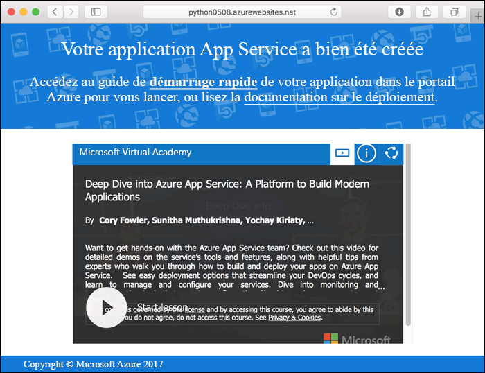
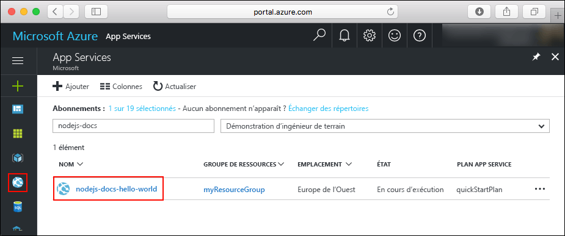
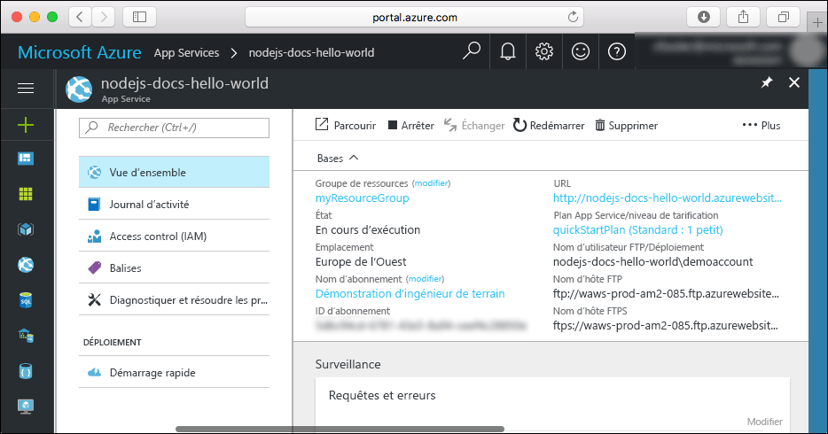

# <a name="create-a-python-web-app-in-azure"></a>Créer une application web Python dans Azure

[Azure Web Apps](app-service-web-overview.md) offre un service d’hébergement web hautement évolutif appliquant des mises à jour correctives automatiques.  Ce guide de démarrage rapide vous guide tout au long du développement et du déploiement d’une application Python dans Azure Web Apps. Vous créez l’application web à l’aide de [l’interface de ligne de commande Azure](https://docs.microsoft.com/cli/azure/get-started-with-azure-cli), et vous utilisez Git pour déployer l’exemple de code Python dans l’application web.


Vous pouvez suivre les étapes ci-dessous en utilisant un ordinateur Mac, Windows ou Linux. Une fois les composants requis installés, l’exécution de cette procédure prend environ cinq minutes.

## <a name="prerequisites"></a>Composants requis

Pour suivre ce didacticiel :

1. [Installez Git](https://git-scm.com/)
1. [Installez Python](https://www.python.org/downloads/)

[!INCLUDE [quickstarts-free-trial-note](../../includes/quickstarts-free-trial-note.md)]

## <a name="download-the-sample"></a>Téléchargez l’exemple

Dans une fenêtre de terminal, exécutez la commande ci-après pour cloner le référentiel de l’exemple d’application sur votre ordinateur local.

```bash
git clone https://github.com/Azure-Samples/python-docs-hello-world
```

Vous utilisez cette fenêtre de terminal pour exécuter toutes les commandes de ce guide de démarrage rapide.

Passez au répertoire qui contient l’exemple de code.

```bash
cd Python-docs-hello-world
```

## <a name="run-the-app-locally"></a>Exécutez l’application localement.

Installez les packages requis à l’aide de `pip`.

```bash
pip install -r requirements.txt
```

Exécutez l’application localement en ouvrant une fenêtre de terminal et en utilisant la commande `Python` pour lancer le serveur web Python intégré.

```bash
python main.py
```

Ouvrez un navigateur web et accédez à l’application exemple à l’adresse `http://localhost:5000`.

Vous pouvez voir sur la page le message **Hello World** de l’exemple d’application.


Dans la fenêtre de terminal, appuyez sur **Ctrl + C** pour quitter le serveur web.

[!INCLUDE [cloud-shell-try-it.md](../../includes/cloud-shell-try-it.md)]

[!INCLUDE [Configure deployment user](../../includes/configure-deployment-user.md)]

[!INCLUDE [Create resource group](../../includes/app-service-web-create-resource-group.md)]

[!INCLUDE [Create app service plan](../../includes/app-service-web-create-app-service-plan.md)]

[!INCLUDE [Create web app](../../includes/app-service-web-create-web-app.md)]



Vous avez créé une application web vide dans Azure.

## <a name="configure-to-use-python"></a>Configurer l’utilisation de Python

Utilisez la commande [az webapp config set](/cli/azure/webapp/config#set) pour configurer l’application web afin d’utiliser la version de Python `3.4`.

```azurecli-interactive
az webapp config set --python-version 3.4 --name <app_name> --resource-group myResourceGroup
```

Cette méthode de définition de la version de Python utilise un conteneur par défaut fourni par la plateforme. Pour utiliser votre propre conteneur, consultez la référence d’Azure CLI relative à la commande [az webapp config container set](/cli/azure/webapp/config/container#set).

[!INCLUDE [Configure local git](../../includes/app-service-web-configure-local-git.md)]

[!INCLUDE [Push to Azure](../../includes/app-service-web-git-push-to-azure.md)]

```bash
Counting objects: 18, done.
Delta compression using up to 4 threads.
Compressing objects: 100% (16/16), done.
Writing objects: 100% (18/18), 4.31 KiB | 0 bytes/s, done.
Total 18 (delta 4), reused 0 (delta 0)
remote: Updating branch 'master'.
remote: Updating submodules.
remote: Preparing deployment for commit id '44e74fe7dd'.
remote: Generating deployment script.
remote: Generating deployment script for python Web Site
remote: Generated deployment script files
remote: Running deployment command...
remote: Handling python deployment.
remote: KuduSync.NET from: 'D:\home\site\repository' to: 'D:\home\site\wwwroot'
remote: Deleting file: 'hostingstart.html'
remote: Copying file: '.gitignore'
remote: Copying file: 'LICENSE'
remote: Copying file: 'main.py'
remote: Copying file: 'README.md'
remote: Copying file: 'requirements.txt'
remote: Copying file: 'virtualenv_proxy.py'
remote: Copying file: 'web.2.7.config'
remote: Copying file: 'web.3.4.config'
remote: Detected requirements.txt.  You can skip Python specific steps with a .skipPythonDeployment file.
remote: Detecting Python runtime from site configuration
remote: Detected python-3.4
remote: Creating python-3.4 virtual environment.
remote: .................................
remote: Pip install requirements.
remote: Successfully installed Flask click itsdangerous Jinja2 Werkzeug MarkupSafe
remote: Cleaning up...
remote: .
remote: Overwriting web.config with web.3.4.config
remote:         1 file(s) copied.
remote: Finished successfully.
remote: Running post deployment command(s)...
remote: Deployment successful.
To https://<app_name>.scm.azurewebsites.net/<app_name>.git
 * [new branch]      master -> master
```

## <a name="browse-to-the-app"></a>Accéder à l’application

Accédez à l’application déployée à l’aide de votre navigateur web.

```bash
http://<app_name>.azurewebsites.net
```

L’exemple de code Python s’exécute dans une application web Azure App Service.


**Félicitations !** Vous avez déployé votre première application Python dans App Service.

## <a name="update-and-redeploy-the-code"></a>Mettre à jour et redéployer le code

À l’aide d’un éditeur de texte local, ouvrez le fichier `main.py` dans l’application Python, puis apportez une petite modification au texte figurant en regard de l’instruction `return` :

```python
return 'Hello, Azure!'
```

Validez vos modifications dans Git, puis envoyez les modifications de code à Azure.

```bash
git commit -am "updated output"
git push azure master
```

Une fois le déploiement terminé, revenez à la fenêtre du navigateur que vous avez ouverte à l’étape [Accéder à l’application](#browse-to-the-app), puis actualisez la page.


## <a name="manage-your-new-azure-web-app"></a>Gérer votre nouvelle application web Azure

Accédez au <a href="https://portal.azure.com" target="_blank">Portail Azure</a> pour gérer l’application web que vous avez créée.

Dans le menu de gauche, cliquez sur **App Services**, puis cliquez sur le nom de votre application web Azure.



Vous voyez apparaître la page Vue d’ensemble de votre application web. Ici, vous pouvez également des tâches de gestion de base (parcourir, arrêter, démarrer, redémarrer et supprimer des éléments, par exemple).



Le menu de gauche fournit différentes pages vous permettant de configurer votre application.

[!INCLUDE [cli-samples-clean-up](../../includes/cli-samples-clean-up.md)]

## <a name="next-steps"></a>Étapes suivantes

> [!div class="nextstepaction"]
> [Mapper un nom DNS personnalisé existant à des applications web Azure](app-service-web-tutorial-custom-domain.md)
