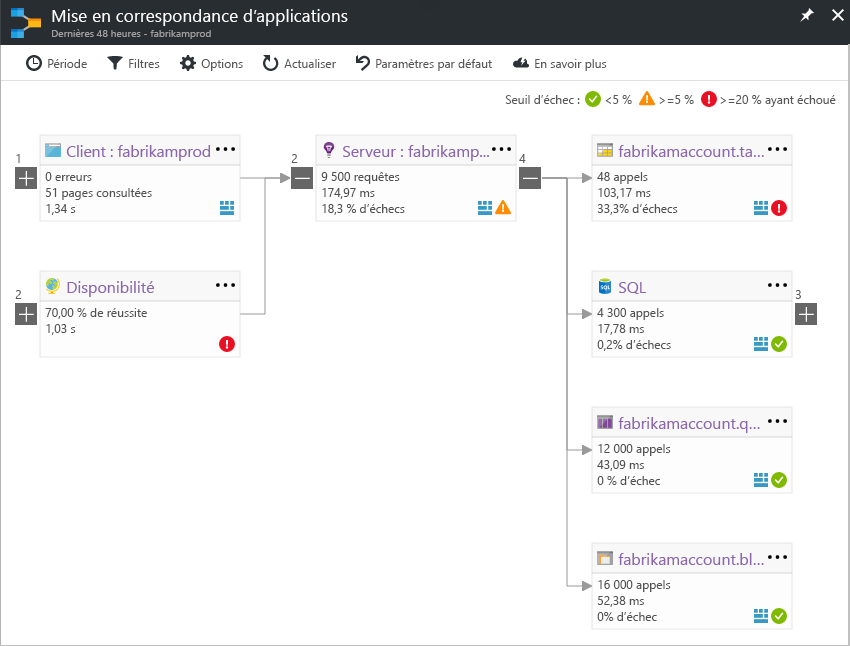

# Mise en correspondance d’applications dans Application InsightsApplication Map in Application Insights
Dans [Azure Application Insights](app-insights-overview.md), mappage d’Application est une présentation visuelle des relations de dépendance hello de composants de votre application.In [Azure Application Insights](app-insights-overview.md), Application Map is a visual layout of hello dependency relationships of your application components. Chaque composant affiche les indicateurs de performance clés telles que toohelp charge, les performances, les échecs et les alertes, vous découvrez un composant à l’origine d’un problème de performances ou l’échec.Each component shows KPIs such as load, performance, failures, and alerts, toohelp you discover any component causing a performance issue or failure. Vous pouvez cliquer à partir de n’importe quel composant toomore détaillée des diagnostics, comme les événements d’Application Insights.You can click through from any component toomore detailed diagnostics, such as Application Insights events. Si votre application utilise des services Azure, vous pouvez également cliquer diagnostics tooAzure, telles que des recommandations de l’Assistant de base de données SQL.If your app uses Azure services, you can also click through tooAzure diagnostics, such as SQL Database Advisor recommendations.

Comme les autres graphiques, vous pouvez épingler un toohello de mappage d’application Azure du tableau de bord, où il est entièrement fonctionnel.Like other charts, you can pin an application map toohello Azure dashboard, where it is fully functional. 

## Mappage d’application hello ouvertOpen hello application map
Carte hello ouvert à partir du Panneau de vue d’ensemble de hello pour votre application :Open hello map from hello overview blade for your application:

carte de Hello montre :hello map shows:

* Tests de disponibilitéAvailability tests
* Composant côté client (surveillé par hello SDK JavaScript)Client-side component (monitored with hello JavaScript SDK)
* Composant côté serveurServer-side component
* Dépendances de composants de client et serveur helloDependencies of hello client and server components

Vous pouvez développer et réduire les groupes de liens de dépendance :You can expand and collapse dependency link groups:

Si vous avez de nombreuses dépendances d’un type (SQL, HTTP, etc.), elles peuvent apparaître groupées.If you have many dependencies of one type (SQL, HTTP etc.), they may appear grouped. 

## Détecter les problèmesSpot problems
Chaque nœud possède des indicateurs de performance appropriés, tels que les taux de défaillance, les performances et la charge hello pour ce composant.Each node has relevant performance indicators, such as hello load, performance, and failure rates for that component. 

Les icônes d’avertissement mettent en évidence les problèmes éventuels.Warning icons highlight possible problems. Un avertissement orange signifie qu’il existe des défaillances dans les requêtes, les vues de page ou les appels de dépendance.An orange warning means there are failures in requests, page views or dependency calls. Un avertissement rouge signifie un taux de défaillance de plus de 5 %.Red means a failure rate above 5%. Si vous souhaitez tooadjust ces seuils, ouvrez les Options.If you want tooadjust these thresholds, open Options.

En outre, des alertes actives s’affichent :Active alerts also show up: 

Si vous utilisez SQL Azure, une icône vous indique des recommandations éventuelles sur la façon dont vous pouvez améliorer les performances.If you use SQL Azure, there's an icon that shows when there are recommendations on how you can improve performance. 

Cliquez sur n’importe quel tooget icône plus de détails :Click any icon tooget more details:

## Clics pour le diagnosticDiagnostic click through
Chacun des nœuds hello sur la carte de hello offre ciblée de clics pour les diagnostics.Each of hello nodes on hello map offers targeted click through for diagnostics. options de Hello varient en fonction de type hello du nœud de hello.hello options vary depending on hello type of hello node.

Pour les composants qui sont hébergées dans Azure, les options de hello incluent des liens directs toothem.For components that are hosted in Azure, hello options include direct links toothem.

## Filtres et périodeFilters and time range
Par défaut, mappage de hello récapitule toutes les données hello disponibles pour hello choisi la plage de temps.By default, hello map summarizes all hello data available for hello chosen time range. Mais vous pouvez le filtrer les noms d’opération spécifique uniquement tooinclude ou les dépendances.But you can filter it tooinclude only specific operation names or dependencies.

* Nom de l’opération : cela inclut les vues de pages et les types de demandes côté serveur.Operation name: This includes both page views and server-side request types. Avec cette option, hello carte affiche hello indicateur de performance clé sur le nœud du côté serveur/client hello pour les opérations de hello sélectionné uniquement.With this option, hello map shows hello KPI on hello server/client-side node for hello selected operations only. Il montre les dépendances hello appelés dans le contexte de hello de ces opérations spécifiques.It shows hello dependencies called in hello context of those specific operations.
* Nom de base de dépendance : Cela inclut les dépendances de navigateur hello AJAX et côté serveur.Dependency base name: This includes hello AJAX browser dependencies and server-side dependencies. Si vous déclarez la télémétrie des dépendances personnalisées avec hello TrackDependency API, elles apparaissent également ici.If you report custom dependency telemetry with hello TrackDependency API, they also appear here. Vous pouvez sélectionner tooshow de dépendances hello sur la carte de hello.You can select hello dependencies tooshow on hello map. Actuellement cette sélection ne filtre pas les demandes côté serveur hello ou des vues de page côté client hello.Currently this selection does not filter hello server-side requests, or hello client-side page views.

## Enregistrer les filtresSave filters
vous avez appliqué des filtres hello toosave, hello du code confidentiel filtré la vue sur un [tableau de bord](app-insights-dashboards.md).toosave hello filters you have applied, pin hello filtered view onto a [dashboard](app-insights-dashboards.md).

## Volet d’erreurError pane
Lorsque vous cliquez sur un nœud dans le mappage de hello, un volet d’erreur s’affiche sur la droite hello résumer les échecs pour ce nœud.When you click a node in hello map, an error pane is displayed on hello right-hand side summarizing failures for that node. Les échecs sont tout d’abord regroupés par ID d’opération, puis par ID de problème.Failures are grouped first by operation ID and then grouped by problem ID.

En cliquant sur un échec vous prend toohello occurrence la plus récente de l’échec.Clicking on a failure takes you toohello most recent instance of that failure.

## Intégrité des ressourcesResource health
Pour certains types de ressources, l’intégrité des ressources est affichée en haut de hello du volet d’erreur hello.For some resource types, resource health is displayed at hello top of hello error pane. Par exemple, en cliquant sur un nœud de SQL affiche les alertes qui ont déclenché et contrôle d’intégrité de la base de données hello.For example, clicking a SQL node will show hello database health and any alerts that have fired.

Vous pouvez cliquer sur des métriques hello ressources nom tooview vue d’ensemble standard de cette ressource.You can click hello resource name tooview standard overview metrics for that resource.

## Cartes d’applications système de bout en boutEnd-to-end system app maps

*Requiert le Kit de développement logiciel (SDK) version 2.3 ou ultérieure**Requires SDK version 2.3 or higher*

Si votre application comporte plusieurs composants - par exemple, un service principal en outre l’application web toohello -, puis vous pouvez afficher les tous sur le mappage d’une application intégrée.If your application has several components - for example, a back-end service in addition toohello web app - then you can show them all on one integrated app map.

mappage d’application Hello recherche des nœuds de serveur en suivant les appels de dépendance HTTP entre les serveurs avec hello Qu'application Insights SDK installé.hello app map finds server nodes by following any HTTP dependency calls made between servers with hello Application Insights SDK installed. Chaque ressource Application Insights est supposé toocontain un seul serveur.Each Application Insights resource is assumed toocontain one server.

### Mise en correspondance d’applications contenant plusieurs rôles (version préliminaire)Multi-role app map (preview)

fonctionnalité de mappage plusieurs rôles application Hello préliminaire vous permet de toouse hello application mappés avec plusieurs serveurs d’envoi de données toohello même ressource Application Insights / clé d’instrumentation.hello preview multi-role app map feature allows you toouse hello app map with multiple servers sending data toohello same Application Insights resource  / instrumentation key. Serveurs de mappage de hello sont segmentées par la propriété cloud_RoleName de hello sur les éléments de télémétrie.Servers in hello map are segmented by hello cloud_RoleName property on telemetry items. Définissez *mappage plusieurs rôles d’Application* trop*sur* de hello aperçus panneau tooenable cette configuration.Set *Multi-role Application Map* too*On* from hello Previews blade tooenable this configuration.

Cette approche peut s’avérer utile dans une application de services de micro ou dans d’autres scénarios où vous souhaitez que les événements de toocorrelate sur plusieurs serveurs au sein d’une seule ressource Application Insights.This approach may be desired in a micro-services application, or in other scenarios where you want toocorrelate events across multiple servers within a single Application Insights resource.

## VidéoVideo

> [!VIDEO https://channel9.msdn.com/events/Connect/2016/112/player] 

## CommentairesFeedback
Veuillez fournir vos commentaires via l’option de commentaires portail hello.Please provide feedback through hello portal feedback option.

## Étapes suivantesNext steps

* [portail AzureAzure portal](https://portal.azure.com)
