# Vue d’ensemble d’Application Insights pour DevOpsOverview of Application Insights for DevOps

Avec [Application Insights](app-insights-overview.md), vous avez la possibilité de connaître rapidement les performances et l’utilisation de votre application active.With [Application Insights](app-insights-overview.md), you can quickly find out how your app is performing and being used when it's live. S’il existe un problème, il vous permet de savoir qu’il vous aide à vous évaluez l’impact de hello et vous aide à déterminer les causes de hello.If there's a problem, it lets you know about it, helps you assess hello impact, and helps you determine hello cause.

Voici le compte d'une équipe qui développe des applications web :Here's an account from a team that develops web applications:

* *« Il y a quelques jours, nous avons déployé un correctif secondaire. Nous n’avez pas exécuter un test d’étendue, mais malheureusement, des modifications inattendues ont été fusionnées dans la charge utile de hello, provoquant l’incompatibilité entre le début de hello et back-end. Immédiatement, exceptions du serveur forcées, notre alerte déclenchée, et nous avons été informés de situation de hello. Quelques clics immédiatement sur le portail Application Insights de hello, obtenue suffisamment d’informations à toonarrow de pile des appels d’exception problème de hello. Nous restaurées immédiatement et limité les dommages hello. Application Insights a effectué cette partie de hello devops cycle très facile et exploitables. »**"A couple of days ago, we deployed a 'minor' hotfix. We didn't run a broad test pass, but unfortunately some unexpected change got merged into hello payload, causing incompatibility between hello front and back ends. Immediately, server exceptions surged, our alert fired, and we were made aware of hello situation. A few clicks away on hello Application Insights portal, we got enough information from exception callstacks toonarrow down hello problem. We rolled back immediately and limited hello damage. Application Insights has made this part of hello devops cycle very easy and actionable."*

Dans cet article, nous suivons une équipe dans la banque de Fabrikam qui développe hello toosee système (répartition) l’utilisation de banque en ligne Application Insights tooquickly toocustomers de répondre et mettre à jour.In this article we follow a team in Fabrikam Bank that develops hello online banking system (OBS) toosee how they use Application Insights tooquickly respond toocustomers and make updates.  

Hello équipe l’exécute un cycle DevOps mentionné dans hello après l’illustration :hello team works on a DevOps cycle depicted in hello following illustration:

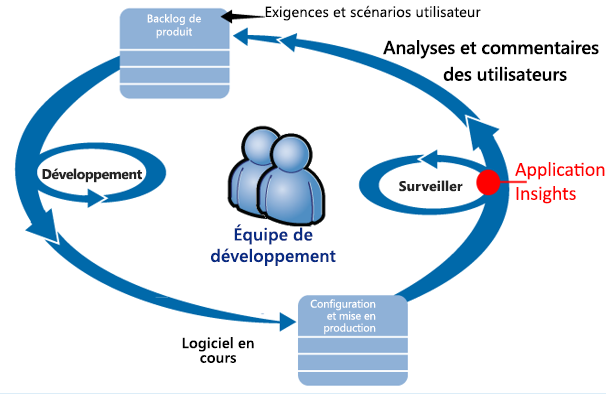

Les exigences alimentent leur backlog de développement (liste des tâches).Requirements feed into their development backlog (task list). Elles fonctionnent en bref sprints, qui souvent fournir des logiciels opérationnels - généralement sous forme de hello d’améliorations et extensions toohello d’application existante.They work in short sprints, which often deliver working software - usually in hello form of improvements and extensions toohello existing application. application en temps réel de Hello est fréquemment mis à jour avec les nouvelles fonctionnalités.hello live app is frequently updated with new features. S’il est dynamique, équipe de hello l’analyse des performances et d’utilisation à l’aide de hello de Application Insights.While it's live, hello team monitors it for performance and usage with hello help of Application Insights. Les données de gestion des performances des applications alimentent leur backlog de développement.This APM data feeds back into their development backlog.

équipe de Hello utilise Application Insights toomonitor hello dynamique d’application web en étroite collaboration pour :hello team uses Application Insights toomonitor hello live web application closely for:

* Les performances.Performance. Ils veulent toounderstand comment les temps de réponse varient selon le nombre de requêtes ; Comment beaucoup l’UC, de réseau, de disque et d’autres ressources sont utilisés ; et où les goulots d’étranglement hello.They want toounderstand how response times vary with request count; how much CPU, network, disk, and other resources are being used; and where hello bottlenecks are.
* Les échecs.Failures. S’il existe des exceptions ou des demandes ayant échoué, ou si un compteur de performance est en dehors de sa plage à l’aise, hello équipe besoins tooknow rapidement afin qu’ils peuvent prendre des mesures.If there are exceptions or failed requests, or if a performance counter goes outside its comfortable range, hello team needs tooknow rapidly so that they can take action.
* L’utilisation.Usage. Chaque fois qu’une nouvelle fonctionnalité est publiée, hello équipe tooknow toowhat étendue est qu’il est utilisé, et si les utilisateurs ont des difficultés avec lui.Whenever a new feature is released, hello team want tooknow toowhat extent it is used, and whether users have any difficulties with it.

Concentrons-nous sur la partie de commentaires de hello du cycle de hello :Let's focus on hello feedback part of hello cycle:

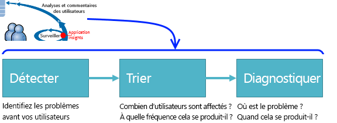

## Détecter une faible disponibilitéDetect poor availability
Marcela Markova est un développeur senior de l’équipe de répartition hello et prend prospect hello sur la surveillance des performances en ligne.Marcela Markova is a senior developer on hello OBS team, and takes hello lead on monitoring online performance. Elle configure plusieurs [tests de disponibilité](app-insights-monitor-web-app-availability.md) :She sets up several [availability tests](app-insights-monitor-web-app-availability.md):

* Un test par URL unique pour la page d’accueil hello pour l’application hello, http://fabrikambank.com/onlinebanking/.A single-URL test for hello main landing page for hello app, http://fabrikambank.com/onlinebanking/. Elle définit des critères de code HTTP 200 et le texte « Bienvenue !She sets criteria of HTTP code 200 and text 'Welcome!'. Si ce test échoue, il est gravement erroné avec hello réseau ou des serveurs de hello ou peut-être un problème de déploiement.If this test fails, there's something seriously wrong with hello network or hello servers, or maybe a deployment issue. (Ou un utilisateur a modifié hello Bienvenue !(Or someone has changed hello Welcome! message sur la page hello sans en avertir son connus).message on hello page without letting her know.)
* Un test en plusieurs étapes plus en profondeur, qui se connecte et obtient la liste des comptes actuels, en vérifiant quelques détails importants sur chaque page.A deeper multi-step test, which logs in and gets a current account listing, checking a few key details on each page. Ce test vérifie que l’utilisation de cette base de données des comptes toohello hello lien.This test verifies that hello link toohello accounts database is working. Elle utilise un ID de client fictif : elle en conserve quelques-uns pour ses tests.She uses a fictitious customer id: a few of them are maintained for test purposes.

Avec les tests de configuration, Marcela est assuré que l’équipe hello rapidement connaissent toute coupure de courant.With these tests set up, Marcela is confident that hello team will quickly know about any outage.  

Erreurs qui s’affichent sous forme de points rouges sur le graphique de test web hello :Failures show up as red dots on hello web test chart:

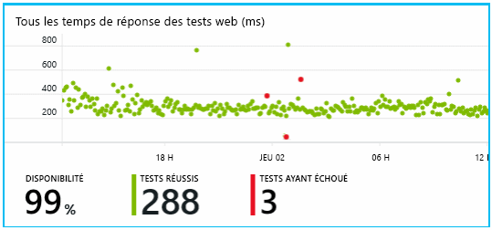

Mais plus important encore, une alerte sur tout échec est par courrier électronique équipe de développement toohello.But more importantly, an alert about any failure is emailed toohello development team. De cette façon, elles savent avant de quasiment tous hello clients.In that way, they know about it before nearly all hello customers.

## Analyser les performancesMonitor Performance
Sur la page de vue d’ensemble de hello dans Application Insights, il est un graphique qui affiche diverses [clé métriques](app-insights-web-monitor-performance.md).On hello overview page in Application Insights, there's a chart that shows a variety of [key metrics](app-insights-web-monitor-performance.md).

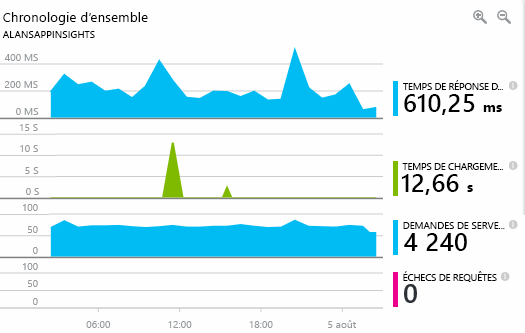

Le temps de chargement de la page du navigateur provient de la télémétrie envoyée directement depuis vos pages web.Browser page load time is derived from telemetry sent directly from web pages. Temps de réponse de serveur, nombre de demandes de serveur et le nombre de demandes ayant échoué sont tous mesurés dans le serveur web de hello et envoyés tooApplication Insights à partir de là.Server response time, server request count, and failed request count are all measured in hello web server and sent tooApplication Insights from there.

Marcela est légèrement concerné avec le graphique de réponse du serveur hello.Marcela is slightly concerned with hello server response graph. Ce graphique montre la durée moyenne de hello entre lorsque le serveur de hello reçoit une requête HTTP à partir du navigateur de l’utilisateur, et lorsqu’il retourne la réponse de hello.This graph shows hello average time between when hello server receives an HTTP request from a user's browser, and when it returns hello response. Il n’est pas inhabituel toosee une variation dans ce graphique, comme la charge sur le système de hello.It isn't unusual toosee a variation in this chart, as load on hello system varies. Mais dans ce cas, il semble que toobe une corrélation entre la petite augmente dans hello nombre de demandes et big augmente dans le temps de réponse hello.But in this case, there seems toobe a correlation between small rises in hello count of requests, and big rises in hello response time. Cela peut indiquer que hello système fonctionne uniquement au niveau de ses limites.That could indicate that hello system is operating just at its limits.

Elle ouvre des graphiques de serveurs hello :She opens hello Servers charts:

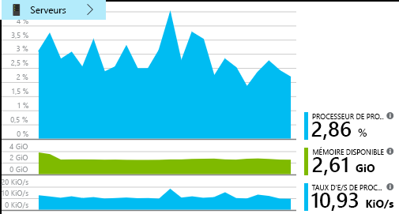

Il peut paraître toobe aucun signe de limitation de ressources, afin de rendre des irrégularités hello maybe graphiques de réponse de serveur hello simplement une coïncidence.There seems toobe no sign of resource limitation there, so maybe hello bumps in hello server response charts are just a coincidence.

## Définir des alertes toomeet objectifsSet alerts toomeet goals
Toutefois, elle souhaite que tookeep un œil sur les temps de réponse hello.Nevertheless, she'd like tookeep an eye on hello response times. Si elles sont trop élevées, elle souhaite tooknow concernant immédiatement.If they go too high, she wants tooknow about it immediately.

Elle définit alors une [alerte](app-insights-metrics-explorer.md) si les temps de réponse dépassent un seuil standard.So she sets an [alert](app-insights-metrics-explorer.md), for response times greater than a typical threshold. Ainsi, elle est certaine d’être avertie en cas de temps de réponse lents.This gives her confidence that she'll know about it if response times are slow.

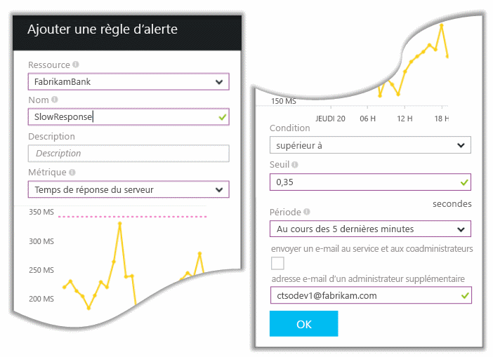

Des alertes peuvent être définies sur une grande variété d’autres mesures.Alerts can be set on a wide variety of other metrics. Par exemple, vous pouvez recevoir des messages électroniques si le nombre d’exceptions hello devient importante, ou la mémoire disponible hello est faible, ou s’il existe un pic dans les demandes des clients.For example, you can receive emails if hello exception count becomes high, or hello available memory goes low, or if there is a peak in client requests.

## Rester informé grâce aux alertes de détection intelligentesStay informed with Smart Detection Alerts
Le jour suivant, un message électronique d’alerte est généré depuis Application Insights.Next day, an alert email does arrive from Application Insights. Mais quand elle s’ouvre, elle trouve qu'il n’est pas d’alerte du temps de réponse hello elle définies.But when she opens it, she finds it isn't hello response time alert that she set. Au lieu de cela, elle lui indique qu’il y a eu une augmentation soudaine du nombre de demandes ayant échoué (autrement dit, les demandes qui ont renvoyé des codes d’erreur d’au moins 500).Instead, it tells her there's been a sudden rise in failed requests - that is, requests that have returned failure codes of 500 or more.

Requêtes ayant échoué sont où les utilisateurs connaissent une erreur - généralement après une exception levée dans le code hello.Failed requests are where users have seen an error - typically following an exception thrown in hello code. Peut-être ont-ils vu un message indiquant « Nous ne pouvons pas mettre à jour vos informations maintenant »Maybe they see a message saying "Sorry we couldn't update your details right now." Ou, au pire de gênant absolu, un vidage de pile s’affiche sur l’écran de l’utilisateur hello, avec l’autorisation de serveur web de hello.Or, at absolute embarrassing worst, a stack dump appears on hello user's screen, courtesy of hello web server.

Cette alerte est une surprise, car hello dernière, elle a examiné, hello des demandes ayant échoué nombre était approcher faible.This alert is a surprise, because hello last time she looked at it, hello failed request count was encouragingly low. Un petit nombre d’échecs est toobe attendu dans un serveur occupé.A small number of failures is toobe expected in a busy server.

Il était également un peu de surprenant pour son travail, car elle n’a pas tooconfigure cette alerte.It was also a bit of a surprise for her because she didn't have tooconfigure this alert. Application Insights intègre la détection intelligente.Application Insights include Smart Detection. Il ajuste automatiquement le motif d’échec habituel tooyour de l’application et les échecs « obtient utilisé pour » sur une page particulière, ou sous une charge élevée, ou les métriques tooother lié.It automatically adjusts tooyour app's usual failure pattern, and "gets used to" failures on a particular page, or under high load, or linked tooother metrics. Il déclenche une alerte de hello uniquement s’il existe une hausse au-dessus de ce qu’il vient tooexpect.It raises hello alarm only if there's a rise above what it comes tooexpect.

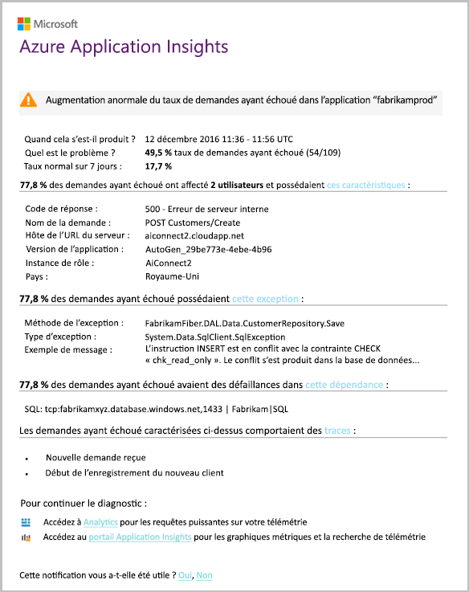

Il s’agit d’un e-mail très utile.This is a very useful email. Il ne génère pas seulement une alarme :It doesn't just raise an alarm. Il effectue beaucoup de travail de diagnostic et de triage de hello trop.It does a lot of hello triage and diagnostic work, too.

Il indique le nombre de clients, les pages web ou des opérations affectés.It shows how many customers are affected, and which web pages or operations. Marcela pouvez décider si elle doit tooget hello ensemble de l’équipe travaille sur cela comme un incendie, ou si elle peut être ignoré jusqu'à ce que la semaine suivante.Marcela can decide whether she needs tooget hello whole team working on this as a fire drill, or whether it can be ignored until next week.

messagerie de Hello montre également qu’une exception particulière s’est produite, et - plus intéressant - échec hello est associé à des échecs d’appels tooa base de données.hello email also shows that a particular exception occurred, and - even more interesting - that hello failure is associated with failed calls tooa particular database. Cela explique pourquoi les pannes hello soudainement est apparue même si l’équipe de Marcela n’a pas déployé les mises à jour récemment.This explains why hello fault suddenly appeared even though Marcela's team has not deployed any updates recently.

Marcella pings hello leader hello équipe de base de données en fonction de ce courrier électronique.Marcella pings hello leader of hello database team based on this email. Il apprend qu’ils publié un correctif logiciel Bonjour dernière moitié heure ; et Oups, peut-être qu’il peut avoir été une modification de schéma secondaire...She learns that they released a hot fix in hello past half hour; and Oops, maybe there might have been a minor schema change....

Problème de hello est donc hello toobeing de manière fixé, même avant d’examiner les journaux et dans les 15 minutes de celui-ci résultant.So hello problem is on hello way toobeing fixed, even before investigating logs, and within 15 minutes of it arising. Toutefois, Marcela clique hello lien tooopen Application Insights.However, Marcela clicks hello link tooopen Application Insights. Il s’ouvre directement sur une demande ayant échoué, et qu’elle peut voir la base de données a échoué à appeler dans la liste associée de hello d’appels de dépendance.It opens straight onto a failed request, and she can see the failed database call in hello associated list of dependency calls.

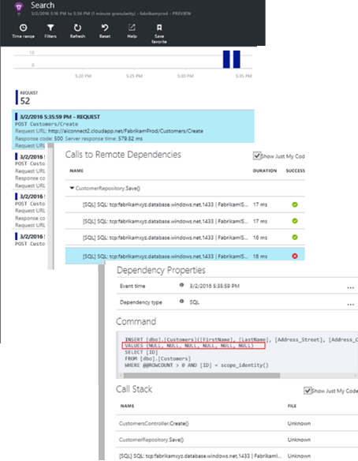

## Détecter les exceptionsDetect exceptions
Avec un peu de l’installation, [exceptions](app-insights-asp-net-exceptions.md) sont signalée tooApplication Insights automatiquement.With a little bit of setup, [exceptions](app-insights-asp-net-exceptions.md) are reported tooApplication Insights automatically. Ils peuvent également être capturés explicitement en insérant des appels trop[TrackException()](app-insights-api-custom-events-metrics.md#trackexception) dans le code de hello :They can also be captured explicitly by inserting calls too[TrackException()](app-insights-api-custom-events-metrics.md#trackexception) into hello code:  

    var telemetry = new TelemetryClient();
    ...
    try
    { ...
    }
    catch (Exception ex)
    {
       // Set up some properties:
       var properties = new Dictionary <string, string>
         {{"Game", currentGame.Name}};

       var measurements = new Dictionary <string, double>
         {{"Users", currentGame.Users.Count}};

       // Send hello exception telemetry:
       telemetry.TrackException(ex, properties, measurements);
    }

équipe de Fabrikam Bank Hello a évolué pratique hello de toujours envoyer les données de télémétrie sur une exception, sauf s’il existe une récupération évidente.hello Fabrikam Bank team has evolved hello practice of always sending telemetry on an exception, unless there's an obvious recovery.  

En fait, leur stratégie est encore plus large que celle : ils envoient la télémétrie dans tous les cas où les clients hello ne sont pas satisfait dans quel ils voulaient toodo, si elle correspond exception tooan dans le code hello ou non.In fact, their strategy is even broader than that: They send telemetry in every case where hello customer is frustrated in what they wanted toodo, whether it corresponds tooan exception in hello code or not. Par exemple, si le système de transfert Inter-bank externe hello renvoie un message « Impossible de terminer cette opération » pour une raison quelconque (aucune erreur de client de hello), opérationnelle elles suivent cet événement.For example, if hello external inter-bank transfer system returns a "can't complete this transaction" message for some operational reason (no fault of hello customer) then they track that event.

    var successCode = AttemptTransfer(transferAmount, ...);
    if (successCode < 0)
    {
       var properties = new Dictionary <string, string>
            {{ "Code", returnCode, ... }};
       var measurements = new Dictionary <string, double>
         {{"Value", transferAmount}};
       telemetry.TrackEvent("transfer failed", properties, measurements);
    }

TrackException est utilisé tooreport exceptions, car il envoie une copie de la pile de hello.TrackException is used tooreport exceptions because it sends a copy of hello stack. TrackEvent est utilisé tooreport autres événements.TrackEvent is used tooreport other events. Vous pouvez joindre toutes les propriétés qui peuvent être utiles au diagnostic.You can attach any properties that might be useful in diagnosis.

Exceptions et les événements apparaissent dans hello [recherche Diagnostic](app-insights-diagnostic-search.md) panneau.Exceptions and events show up in hello [Diagnostic Search](app-insights-diagnostic-search.md) blade. Vous pouvez explorer les propriétés supplémentaires de toosee hello et trace de la pile.You can drill into them toosee hello additional properties and stack trace.

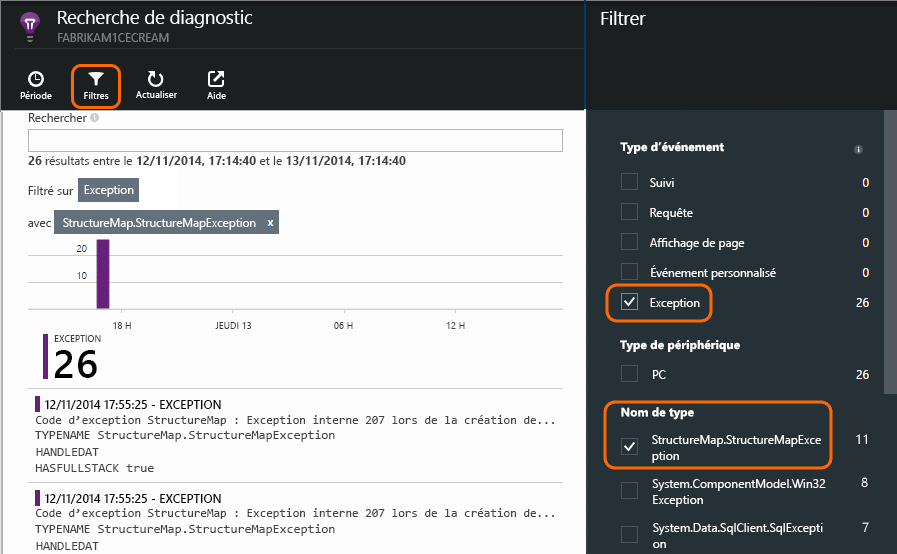

## Surveiller de manière proactiveMonitor proactively
Marcela ne reste pas les bras croisés à attendre les alertes.Marcela doesn't just sit around waiting for alerts. Peu après chaque redéploiement, elle examine les [temps de réponse](app-insights-web-monitor-performance.md) : les deux hello globale figure et compte de la table hello de demandes les plus lents, ainsi que les exceptions.Soon after every redeployment, she takes a look at [response times](app-insights-web-monitor-performance.md) - both hello overall figure and hello table of slowest requests, as well as exception counts.  

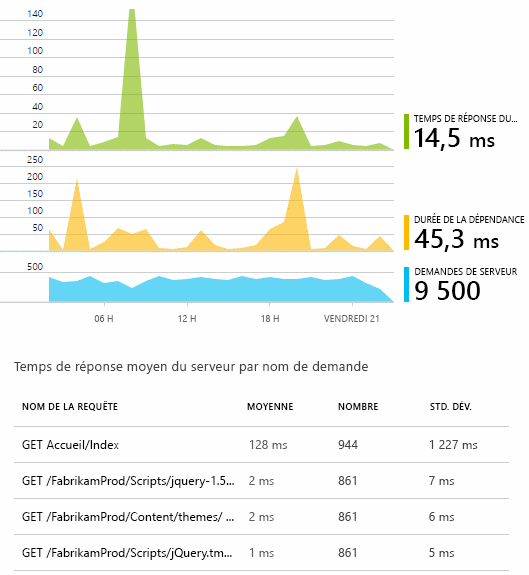

Elle peut évaluer incidence sur les performances de chaque déploiement, hello généralement comparaison dernier chaque semaine par hello.She can assess hello performance effect of every deployment, typically comparing each week with hello last. S’il existe une aggravation soudaine, elle déclenche qui avec les développeurs pertinentes hello.If there's a sudden worsening, she raises that with hello relevant developers.

## Problèmes de triageTriage issues
Triage - évaluation de niveau de gravité hello et l’étendue d’un problème - est hello première étape après la détection.Triage - assessing hello severity and extent of a problem - is hello first step after detection. Étudions que nous appelons à l’équipe de hello à minuit ?Should we call out hello team at midnight? Ou bien, il peut être conservé jusqu'à ce que l’intervalle de pratique suivant hello des travaux en souffrance de hello ?Or can it be left until hello next convenient gap in hello backlog? Le tri pose certaines questions importantes.There are some key questions in triage.

La fréquence à laquelle se passe-t-il ? graphiques Hello sur le panneau de vue d’ensemble de hello donner à un problème de tooa de perspective.How often is it happening? hello charts on hello Overview blade give some perspective tooa problem. Par exemple, hello Fabrikam application générant des alertes de test web quatre une nuit.For example, hello Fabrikam application generated four web test alerts one night. Examinez le graphique de hello matin de hello, hello équipe peut voir qu’il y avait en effet, certains points rouges, si toujours la plupart des tests de hello étaient verte.Looking at hello chart in hello morning, hello team could see that there were indeed some red dots, though still most of hello tests were green. L’exploration dans le graphique de disponibilité hello, il était clair que tous ces problèmes intermittents proviennent d’un emplacement pour un test.Drilling into hello availability chart, it was clear that all of these intermittent problems were from one test location. Il s'agissait d'un problème réseau affectant un seul itinéraire, qui disparaîtra probablement de lui-même.This was obviously a network issue affecting only one route, and would most likely clear itself.  

En revanche, une augmentation considérable et stable dans le graphique de hello du nombre d’exceptions ou de temps de réponse est à l’évidence un élément toopanic sur.By contrast, a dramatic and stable rise in hello graph of exception counts or response times is obviously something toopanic about.

Une bonne tactique de tri est le test réel.A useful triage tactic is Try It Yourself. Si vous rencontrez hello même problème, vous savez qu’il est de type real.If you run into hello same problem, you know it's real.

Quelle est la proportion d’utilisateurs sont affectés ? tooobtain une réponse approximative, divisez le taux d’échec hello par le nombre de sessions hello.What fraction of users are affected? tooobtain a rough answer, divide hello failure rate by hello session count.

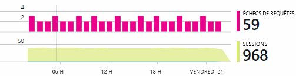

Lorsqu’il existe des réponses lentes, comparez table hello de ne répond plus lente des requêtes avec une fréquence d’utilisation hello de chaque page.When there are slow responses, compare hello table of slowest-responding requests with hello usage frequency of each page.

L’importance est le scénario de hello bloqué ?How important is hello blocked scenario? S'agit-il d'un problème fonctionnel qui bloque un parcours utilisateur particulier et est-il important ?If this is a functional problem blocking a particular user story, does it matter much? Si les clients ne peuvent pas payer leurs factures, c'est grave. S'ils ne peuvent simplement pas changer les préférences de couleur d'écran, peut-être que le problème peut attendre.If customers can't pay their bills, this is serious; if they can't change their screen color preferences, maybe it can wait. Hello détail de l’événement de hello ou d’une exception, ou l’identité de hello de lent des pages hello, vous indique où les clients rencontrent des problèmes.hello detail of hello event or exception, or hello identity of hello slow page, tells you where customers are having trouble.

## Diagnostiquer les problèmesDiagnose issues
Diagnostic n’est pas assez hello identique au débogage.Diagnosis isn't quite hello same as debugging. Avant de commencer le suivi via le code de hello, doit avoir une idée approximative de la raison pour laquelle, où et quand le problème de hello se produit.Before you start tracing through hello code, you should have a rough idea of why, where and when hello issue is occurring.

**Quand il se produit-il ?**  hello historiques fournies par les graphiques d’événement et la métrique hello facilitent les effets toocorrelate facile avec les causes possibles.**When does it happen?** hello historical view provided by hello event and metric charts makes it easy toocorrelate effects with possible causes. S’il existe des pics intermittents taux de réponse temps ou une exception, examinez de nombre de demandes hello : si elle est optimale lorsque hello même temps, puis il ressemble à un problème de ressources.If there are intermittent peaks in response time or exception rates, look at hello request count: if it peaks at hello same time, then it looks like a resource problem. Vous devez tooassign plus d’UC ou de mémoire ?Do you need tooassign more CPU or memory? Ou bien, il y a une dépendance qui ne peut pas gérer la charge de hello ?Or is it a dependency that can't manage hello load?

**Le problème vient-il de nous ?****Is it us?**  Si vous avez une chute soudaine des performances d’un type particulier de demande - par exemple lorsque hello client souhaite un relevé de compte - il est possible, il peut être un sous-système externe au lieu de votre application web.If you have a sudden drop in performance of a particular type of request - for example when hello customer wants an account statement - then there's a possibility it might be an external subsystem rather than your web application. Dans Metrics Explorer, sélectionnez le taux d’échec de la dépendance hello et taux de durée de la dépendance et comparer leurs historiques sur hello au-delà de quelques heures ou jours avec problème de hello que vous détecté.In Metrics Explorer, select hello Dependency Failure rate and Dependency Duration rates and compare their histories over hello past few hours or days with hello problem you detected. Si il corrélation sont des modifications, un sous-système externe peut être tooblame.If there are correlating changes, then an external subsystem might be tooblame.  

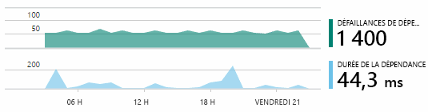

Certains problèmes de dépendances lentes sont dus à des problèmes de géolocalisation.Some slow dependency issues are geolocation problems. La banque Fabrikam utilise des machines virtuelles Azure et l'équipe a découvert que leur serveur web et le compte de ce serveur avaient été placés par inadvertance dans des pays différents.Fabrikam Bank uses Azure virtual machines, and discovered that they had inadvertently located their web server and account server in different countries. La migration d'un de ces deux éléments a apporté des améliorations considérables.A dramatic improvement was brought about by migrating one of them.

**Qu'avons-nous fait ?****What did we do?** Si le problème de hello n’apparaît pas toobe une dépendance, et si elle n’était pas toujours il, il est probablement dû à une modification récente.If hello issue doesn't appear toobe in a dependency, and if it wasn't always there, it's probably caused by a recent change. Hello perspective historique fournie par les graphiques de métriques et les événements hello rend toocorrelate facilement les changements soudains dans des déploiements.hello historical perspective provided by hello metric and event charts makes it easy toocorrelate any sudden changes with deployments. Cela réduit la recherche hello pour problème de hello.That narrows down hello search for hello problem.

**Que se passe-t-il ?****What's going on?** Certains problèmes se produisent rarement et peuvent être difficile tootrack vers le bas en le testant hors connexion.Some problems occur only rarely and can be difficult tootrack down by testing offline. Tout ce que nous pouvons faire est bogue de hello tootry toocapture lorsqu’il se produit en temps réel.All we can do is tootry toocapture hello bug when it occurs live. Vous pouvez inspecter les vidages de pile hello dans les rapports d’exception.You can inspect hello stack dumps in exception reports. En outre, vous pouvez écrire les appels de suivi, soit avec votre infrastructure de journalisation favorite, soit avec TrackTrace() ou TrackEvent().In addition, you can write tracing calls, either with your favorite logging framework or with TrackTrace() or TrackEvent().  

Fabrikam avait un problème intermittent avec les transferts entre comptes, mais uniquement avec certains types de compte.Fabrikam had an intermittent problem with inter-account transfers, but only with certain account types. toounderstand mieux que s’est-il passé, ils inséré TrackTrace() appels à des points clés dans le code hello, attachement hello type de compte comme un appel de tooeach de propriété.toounderstand better what was happening, they inserted TrackTrace() calls at key points in hello code, attaching hello account type as a property tooeach call. Il était facile toofilter out uniquement les traces dans la recherche de Diagnostic.That made it easy toofilter out just those traces in Diagnostic Search. Ils attachés également les valeurs de paramètre en tant qu’appels de trace toohello propriétés et les mesures.They also attached parameter values as properties and measures toohello trace calls.

## Répondre toodiscovered problèmesRespond toodiscovered issues
Une fois que vous avez diagnostiqué le problème de hello, vous pouvez rendre un plan toofix il.Once you've diagnosed hello issue, you can make a plan toofix it. Éventuellement, vous devez tooroll retour une modification récente, ou vous pouvez simplement continuez et corrigez-le.Maybe you need tooroll back a recent change, or maybe you can just go ahead and fix it. Une fois que le correctif de hello est terminé, Application Insights vous indique si vous a réussi.Once hello fix is done, Application Insights tells you whether you succeeded.  

Équipe de développement de la banque de Fabrikam prendre une mesure de tooperformance d’approche plus structurée plus toobefore ils utilisé Application Insights.Fabrikam Bank's development team take a more structured approach tooperformance measurement than they used toobefore they used Application Insights.

* Ils définir des objectifs de performances en termes de mesures spécifiques dans la page de vue d’ensemble d’Application Insights hello.They set performance targets in terms of specific measures in hello Application Insights overview page.
* Concevoir des mesures de performances dans une application hello du début hello, telles que les métriques hello qui mesurent la progression de l’utilisateur via 'Entonnoirs'.They design performance measures into hello application from hello start, such as hello metrics that measure user progress through 'funnels.'  

## Surveiller les activités des utilisateursMonitor user activity
Lorsque le temps de réponse est généralement correct et il existe quelques exceptions près, équipe de développement hello peut déplacer sur toousability.When response time is consistently good and there are few exceptions, hello dev team can move on toousability. Ils peuvent imaginer comment tooimprove hello expérience des utilisateurs, et comment tooencourage hello de tooachieve plus d’utilisateurs souhaité objectifs.They can think about how tooimprove hello users' experience, and how tooencourage more users tooachieve hello desired goals.

Application Insights peuvent également être utilisé toolearn faire de ce que les utilisateurs avec une application.Application Insights can also be used toolearn what users do with an app. Une fois qu’il s’exécute correctement, hello aimerait tooknow les fonctionnalités qui sont hello plus populaire, ce que les utilisateurs comme ou ayant des difficultés avec, et la fréquence à laquelle les rapatrier.Once it's running smoothly, hello team would like tooknow which features are hello most popular, what users like or have difficulty with, and how often they come back. Ces données permettront de hiérarchiser le travail à venir.That will help them prioritize their upcoming work. Et prévoyez de réussite de hello toomeasure de chaque fonctionnalité dans le cadre du cycle de développement hello.And they can plan toomeasure hello success of each feature as part of hello development cycle. 

Par exemple, un trajet utilisateur classique via le site web de hello a un clair » en entonnoir. »For example, a typical user journey through hello web site has a clear "funnel." De nombreux clients rechercher tarifs hello de différents types de prêt.Many customers look at hello rates of different types of loan. Un nombre plus petit, allez sur toofill sous forme de guillemets hello.A smaller number go on toofill in hello quotation form. Les personnes qui reçoivent une citation, quelques continuez de contracter hello prêt.Of those who get a quotation, a few go ahead and take out hello loan.

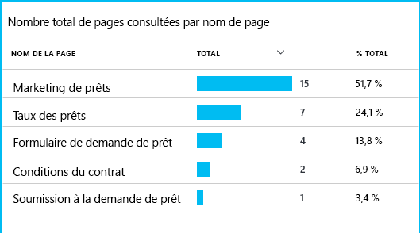

En considérant où disparaître hello de plus grand nombre de clients, business de hello peuvent élaborer comment tooget plus d’utilisateurs par le biais bas toohello Hello en entonnoir.By considering where hello greatest numbers of customers drop out, hello business can work out how tooget more users through toohello bottom of hello funnel. Dans certains cas, il peut y avoir un échec de l’expérience utilisateur - par exemple, le bouton « suivant » hello est toofind dur ou les instructions hello ne sont pas évidentes.In some cases, there might be a user experience (UX) failure - for example, hello 'next' button is hard toofind, or hello instructions aren't obvious. Plus vraisemblablement, il existe des raisons professionnelles plus importantes pour phénomène : peut-être le taux de prêt de hello sont trop élevés.More likely, there are more significant business reasons for drop-outs: maybe hello loan rates are too high.

Quelque raison hello, les données de salutation aident hello équipe à déterminer ce que font les utilisateurs.Whatever hello reasons, hello data helps hello team work out what users are doing. Plus le suivi des appels peuvent être insérées toowork davantage de détails.More tracking calls can be inserted toowork out more detail. TrackEvent() peut être utilisé toocount toutes les actions utilisateur, à partir des détails de hello d’individuels clics, réalisations toosignificant telles que de payer un prêt.TrackEvent() can be used toocount any user actions, from hello fine detail of individual button clicks, toosignificant achievements such as paying off a loan.

équipe de Hello est mise en route toohaving utilisé plus d’informations sur l’activité utilisateur.hello team is getting used toohaving information about user activity. Aujourd'hui, chaque fois qu'ils conçoivent une nouvelle fonctionnalité, ils anticipent les avis qu’ils pourraient obtenir sur celle-ci.Nowadays, whenever they design a new feature, they work out how they will get feedback about its usage. Concevoir des appels de suivi dans la fonction hello du début de hello.They design tracking calls into hello feature from hello start. Ils utilisent la fonctionnalité de hello commentaires tooimprove hello dans chaque cycle de développement.They use hello feedback tooimprove hello feature in each development cycle.

[En savoir plus sur le suivi de l’utilisation](app-insights-usage-overview.md).[Read more about tracking usage](app-insights-usage-overview.md).

## Appliquer le cycle de DevOps helloApply hello DevOps cycle
C’est une team utilisez Application Insights toofix pas simplement individuels des problèmes, mais tooimprove leur cycle de vie de développement.So that's how one team use Application Insights not just toofix individual issues, but tooimprove their development lifecycle. J’espère que ceci vous a donné quelques idées sur la façon dont Application Insights peut vous aider dans vos propres applications avec la gestion des performances des applications.I hope it has given you some ideas about how Application Insights can help you with application performance management in your own applications.

## VidéoVideo

> [!VIDEO https://channel9.msdn.com/events/Connect/2016/112/player]

## Étapes suivantesNext steps
Vous pouvez commencer de différentes façons, selon les caractéristiques de hello de votre application.You can get started in several ways, depending on hello characteristics of your application. Choisissez ce qui vous convient le mieux :Pick what suits you best:

* [Application web ASP.NETASP.NET web application](app-insights-asp-net.md)
* [Application web JavaJava web application](app-insights-java-get-started.md)
* [Application web Node.jsNode.js web application](app-insights-nodejs.md)
* Applications déjà déployées, hébergées sur [IIS](app-insights-monitor-web-app-availability.md), [J2EE](app-insights-java-live.md) ou [Azure](app-insights-azure.md).Already deployed apps, hosted on [IIS](app-insights-monitor-web-app-availability.md), [J2EE](app-insights-java-live.md), or [Azure](app-insights-azure.md).
* [Pages Web](app-insights-javascript.md) -application Page unique ou ordinaire de la page web - utiliser sur son propre ou dans tooany Ajout hello des options de serveur.[Web pages](app-insights-javascript.md) - Single Page App or ordinary web page - use this on its own or in addition tooany of hello server options.
* [Tests de disponibilité](app-insights-monitor-web-app-availability.md) tootest votre application à partir de hello internet public.[Availability tests](app-insights-monitor-web-app-availability.md) tootest your app from hello public internet.
