# Présentation d’Application InsightsWhat is Application Insights?
Application Insights est un service extensible de gestion des performances des applications (APM) destiné aux développeurs web sur de multiples plateformes.Application Insights is an extensible Application Performance Management (APM) service for web developers on multiple platforms. Utilisez-le pour analyser votre application web en direct.Use it to monitor your live web application. Ce service détecte automatiquement les problèmes de performances.It will automatically detect performance anomalies. Il intègre de puissants outils d’analyse pour vous aider à diagnostiquer les problèmes et à comprendre ce que font les utilisateurs avec votre application.It includes powerful analytics tools to help you diagnose issues and to understand what users actually do with your app.  Il a été conçu pour vous permettre d’améliorer continuellement les performances et la convivialité.It's designed to help you continuously improve  performance and usability. Il fonctionne avec des applications sur un large éventail de plates-formes, notamment .NET, Node.js et J2EE, hébergées sur site ou dans le cloud.It works for apps on a wide variety of platforms including .NET, Node.js and J2EE, hosted on-premises or in the cloud. Il s’intègre à votre processus DevOps et offre des points de connexion à un large éventail d’outils de développement.It  integrates with your devOps process, and has connection points to a variety of development tools.

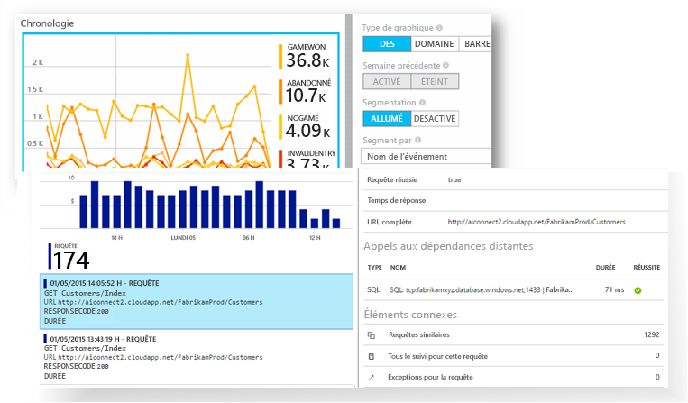

[Consultez l’animation de présentation](https://www.youtube.com/watch?v=fX2NtGrh-Y0).[Take a look at the intro animation](https://www.youtube.com/watch?v=fX2NtGrh-Y0).

## Comment fonctionne Application Insights ?How does Application Insights work?
Vous installez un petit package d’instrumentation dans votre application puis configurez une ressource Application Insights dans le portail Microsoft Azure.You install a small instrumentation package in your application, and set up an Application Insights resource in the Microsoft Azure portal. L’instrumentation surveille votre application et envoie les données de télémétrie au portail.The instrumentation monitors your app and sends telemetry data to the portal. (L’application peut s’exécuter partout, elle n’a pas besoin d’être hébergée dans Azure.)(The application can run anywhere - it doesn't have to be hosted in Azure.)

Vous pouvez instrumenter non seulement l’application de service web, mais aussi tous les composants d’arrière-plan et le code JavaScript des pages web elles-mêmes.You can instrument not only the web service application, but also any background components, and the JavaScript in the web pages themselves. 

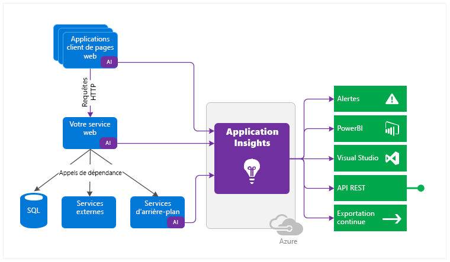

En outre, vous pouvez extraire des données de télémétrie des environnements hôtes, notamment des compteurs de performances, des diagnostics Azure ou des journaux Docker.In addition, you can pull in telemetry from the host environments such as performance counters, Azure diagnostics, or Docker logs. Vous pouvez également configurer des tests web qui envoient régulièrement des demandes synthétiques à votre service web.You can also set up web tests that periodically send synthetic requests to your web service.

Tous ces flux de télémétrie sont intégrés dans le Portail Azure, où vous pouvez appliquer des outils puissants d’analyse et de recherche aux données brutes.All these telemetry streams are integrated in the Azure portal, where you can apply powerful analytic and search tools to the raw data.

### Quelle est la surcharge ?What's the overhead?
L'impact sur les performances de votre application est très faible.The impact on your app's performance is very small. Le suivi des appels n’entraîne aucun blocage, et les appels sont regroupés par lots et envoyés dans un thread séparé.Tracking calls are non-blocking, and are batched and sent in a separate thread.

## Que surveille Application Insights ?What does Application Insights monitor?

Application Insights est destiné à l’équipe de développement et permet de comprendre les performances et l’utilisation de votre application.Application Insights is aimed at the development team, to help you understand how your app is performing and how it's being used. Il analyse les éléments suivants :It monitors:

* **Taux de demandes, temps de réponse et taux d’échec** : identifiez les pages les plus consultées, à quel moment de la journée, et déterminez où se trouvent vos utilisateurs.**Request rates, response times, and failure rates** - Find out which pages are most popular, at what times of day, and where your users are. Identifiez les pages qui offrent les meilleures performances.See which pages perform best. Si vos temps de réponse et votre taux d’échec augmentent lorsqu’il y a plus de requêtes, vous avez peut-être un problème de ressources.If your response times and failure rates go high when there are more requests, then perhaps you have a resourcing problem. 
* **Taux de dépendance, temps de réponse et taux d’échec** : déterminez si des services externes vous ralentissent.**Dependency rates, response times, and failure rates** - Find out whether external services are slowing you down.
* **Exceptions** : analysez les statistiques agrégées, ou choisissez des instances en particulier et explorez l’arborescence des appels de procédure et les requêtes connexes.**Exceptions** - Analyse the aggregated statistics, or pick specific instances and drill into the stack trace and related requests. Les exceptions de serveur et de navigateur sont signalées.Both server and browser exceptions are reported.
* **Consultations de pages et performances de chargement** : indiquées par le navigateur de vos utilisateurs.**Page views and load performance** - reported by your users' browsers.
* **Appels AJAX** à partir de pages web : taux, temps de réponse et taux d’échec.**AJAX calls** from web pages - rates, response times, and failure rates.
* **Nombre de sessions et d’utilisateurs**.**User and session counts**.
* **Compteurs de performances** de vos ordinateurs serveurs Windows ou Linux, par exemple le processeur, la mémoire et l’utilisation du réseau.**Performance counters** from your Windows or Linux server machines, such as CPU, memory, and network usage. 
* **Diagnostics d’hébergement** de Docker ou Azure.**Host diagnostics** from Docker or Azure. 
* **Journaux de suivi des diagnostics** de votre application : pour pouvoir mettre en corrélation les événements de suivi avec les demandes.**Diagnostic trace logs** from your app - so that you can correlate trace events with requests.
* **Mesures et événements personnalisés** que vous écrivez vous-même dans le code client ou serveur, pour effectuer le suivi des événements commerciaux tels que les articles vendus ou les matchs gagnés.**Custom events and metrics** that you write yourself in the client or server code, to track business events such as items sold or games won.

## Où trouver mes données de télémétrie ?Where do I see my telemetry?

Il existe de nombreuses manières d’explorer vos données.There are plenty of ways to explore your data. Consultez les articles suivants :Check out these articles:

|  |  |
| --- | --- |
| [**Détection intelligente et alertes manuelles****Smart detection and manual alerts**](app-insights-proactive-diagnostics.md) Les alertes automatiques s’adaptent aux habitudes télémétriques normales de votre application et se déclenchent lorsqu’un comportement inhabituel est détecté.Automatic alerts adapt to your app's normal patterns of telemetry and trigger when there's something outside the usual pattern. Vous pouvez également [définir des alertes](app-insights-alerts.md) sur des niveaux particuliers de mesures personnalisées ou standard.You can also [set alerts](app-insights-alerts.md) on particular levels of custom or standard metrics. |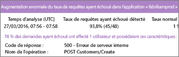 |
| [**Mise en correspondance d’applications****Application map**](app-insights-app-map.md) Les composants de votre application, avec des alertes et des mesures clés.The components of your app, with key metrics and alerts. |  |
| [**Profileur****Profiler**](app-insights-profiler.md) Examinez les profils d’exécution des requêtes échantillonnées.Inspect the execution profiles of sampled requests. |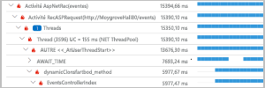 |
| [**Analyse de l’utilisation****Usage analysis**](app-insights-usage-overview.md) Analysez la rétention et la segmentation ds utilisateurs.Analyze user segmentation and retention.| |
| [**Recherche de diagnostic pour les données d’instance****Diagnostic search for instance data**](app-insights-diagnostic-search.md) Cherchez et filtrez les événements, comme les requêtes, les exceptions, les appels de dépendance, les suivis de journaux et les affichages de pages.Search and filter events such as requests, exceptions, dependency calls, log traces, and page views.  |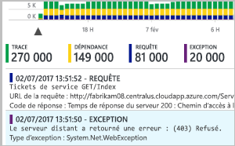 |
| [**Metrics Explorer pour les données agrégées****Metrics Explorer for aggregated data**](app-insights-metrics-explorer.md) Explorez, filtrez et segmentez des données agrégées, comme les taux de demandes, d’échecs et d’exceptions, les temps de réponse et les durées de chargement des pages.Explore, filter, and segment aggregated data such as rates of requests, failures, and exceptions; response times, page load times. | |
| [**Tableaux de bord****Dashboards**](app-insights-dashboards.md#dashboards) Combinez des données de plusieurs sources et partagez-les avec d’autres.Mash up data from multiple resources and share with others. Idéal pour les applications à composants multiples et pour un affichage en continu dans la salle de l’équipe.Great for multi-component applications, and for continuous display in the team room. | |
| [**Live Metrics Stream****Live Metrics Stream**](app-insights-live-stream.md) Lorsque vous déployez une nouvelle version, observez ces indicateurs de performance quasiment en temps réel pour vous assurer que tout fonctionne comme prévu.When you deploy a new build, watch these near-real-time performance indicators to make sure everything works as expected. |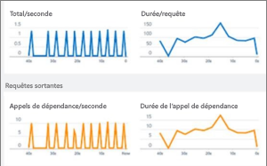 |
| [**Analytics****Analytics**](app-insights-analytics.md) Répondez à des questions difficiles sur les performances et l’utilisation de votre application avec ce langage de requêtes puissant.Answer tough questions about your app's performance and usage by using this powerful query language. |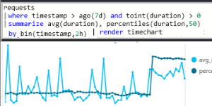 |
| [**Visual Studio****Visual Studio**](app-insights-visual-studio.md) Consultez les données de performances dans le code.See performance data in the code. Accédez au code à partir de l’arborescence des appels de procédure.Go to code from stack traces.|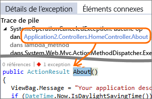 |
| [**Débogueur de capture instantanée****Snapshot debugger**](app-insights-snapshot-debugger.md) Déboguez les captures instantanées échantillonnées à partir des opérations en direct, avec des valeurs de paramètre.Debug snapshots sampled from live operations, with parameter values.|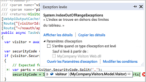 |
| [**Power BI****Power BI**](app-insights-export-power-bi.md) Intégrez des mesures d’utilisation à d’autres données décisionnelles.Integrate usage metrics with other business intelligence.| 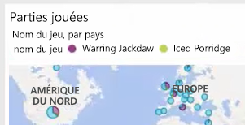|
| [**API REST****REST API**](https://dev.applicationinsights.io/) Écrivez du code pour exécuter des requêtes sur vos propres données brutes et mesures.Write code to run queries over your metrics and raw data.|  |
| [**Exportation continue****Continuous export**](app-insights-export-telemetry.md) Exportation en bloc de données brutes vers le système de stockage dès leur arrivée.Bulk export of raw data to storage as soon as it arrives. |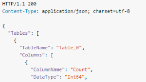 |

## Comment utiliser Application Insights ?How do I use Application Insights?

### SurveillerMonitor
Installez Application Insights dans votre application, configurez les [tests web de disponibilité](app-insights-monitor-web-app-availability.md), puis :Install Application Insights in your app, set up [availability web tests](app-insights-monitor-web-app-availability.md), and:

* Configurez un [tableau de bord](app-insights-dashboards.md) pour la salle de l’équipe afin de garder un œil sur la charge, la réactivité et la performance de vos dépendances, chargements de pages et appels AJAX.Set up a [dashboard](app-insights-dashboards.md) for your team room to keep an eye on load, responsiveness, and the performance of your dependencies, page loads, and AJAX calls.
* Découvrez quelles demandes sont les plus lentes et se terminent le plus par un échec.Discover which are the slowest and most failing requests.
* Surveillez le [flux temps réel](app-insights-live-stream.md) lorsque vous déployez une nouvelle version, afin d’être immédiatement informé en cas de dégradation.Watch [Live Stream](app-insights-live-stream.md) when you deploy a new release, to know immediately about any degradation.

### Détecter, diagnostiquerDetect, Diagnose
Lorsque vous recevez une alerte ou découvrez un problème :When you receive an alert or discover a problem:

* Évaluez le nombre d’utilisateurs affectés.Assess how many users are affected.
* Mettez en corrélation les échecs et les exceptions, les appels de dépendance et les traces.Correlate failures with exceptions, dependency calls and traces.
* Examinez le profileur, les captures instantanées, les vidages de pile et les journaux de suivi.Examine profiler, snapshots, stack dumps, and trace logs.

### Créer, mesurer, apprendreBuild, Measure, Learn
[Mesurez l’efficacité](app-insights-usage-overview.md) de chaque nouvelle fonctionnalité que vous déployez.[Measure the effectiveness](app-insights-usage-overview.md) of each new feature that you deploy.

* Planifiez l’évaluation de la manière dont les clients utilisent de nouvelles fonctionnalités d’entreprise ou utilisateur.Plan to measure how customers use new UX or business features.
* Écrivez des données de télémétrie personnalisées dans votre code.Write custom telemetry into your code.
* Fondez le prochain cycle de développement sur des preuves tangibles provenant de votre télémétrie.Base the next development cycle on hard evidence from your telemetry.

## Prise en mainGet started
Application Insights est un des nombreux services hébergés dans Microsoft Azure, et les données de télémétrie sont envoyées à des fins d’analyse et de présentation.Application Insights is one of the many services hosted within Microsoft Azure, and telemetry is sent there for analysis and presentation. Ainsi, avant d’effectuer une autre opération, vous devez souscrire un abonnement [Microsoft Azure](http://azure.com).So before you do anything else, you'll need a subscription to [Microsoft Azure](http://azure.com). L’inscription est gratuite ; de plus, si vous choisissez le [plan de tarification](https://azure.microsoft.com/pricing/details/application-insights/) de base d’Application Insights, rien n’est facturé tant que votre application n’est pas utilisée de façon substantielle.It's free to sign up, and if you choose the basic [pricing plan](https://azure.microsoft.com/pricing/details/application-insights/) of Application Insights, there's no charge until your application has grown to have substantial usage. Si votre organisation possède déjà un abonnement, votre compte Microsoft peut y être ajouté.If your organization already has a subscription, they could add your Microsoft account to it.

Il existe plusieurs façons de démarrer avec Application Insights.There are several ways to get started. Commencez par la méthode qui vous convient le mieux.Begin with whichever works best for you. Vous pourrez ajouter les autres par la suite.You can add the others later.

* **Au moment de l’exécution : instrumentez votre application web sur le serveur.****At run time: instrument your web app on the server.** Permet d’éviter toute mise à jour du code.Avoids any update to the code. Vous avez besoin de l’accès administrateur à votre serveur.You need admin access to your server.
  * [**IIS local ou sur une machine virtuelle****IIS on-premises or on a VM**](app-insights-monitor-performance-live-website-now.md)
  * [**Application web ou machine virtuelle Azure****Azure web app or VM**](app-insights-monitor-performance-live-website-now.md)
  * [**J2EE****J2EE**](app-insights-java-live.md)
* **Au moment du développement : ajoutez Application Insights à votre code.****At development time: add Application Insights to your code.** Vous permet d’écrire des données de télémétrie personnalisées et d’instrumenter le serveur principal et les applications de bureau.Allows you to write custom telemetry and to instrument back-end and desktop apps.
  * [Visual Studio](app-insights-asp-net.md) 2013 Update 2 ou version ultérieure.[Visual Studio](app-insights-asp-net.md) 2013 update 2 or later.
  * Java dans [Eclipse](app-insights-java-eclipse.md) ou [autres outils](app-insights-java-get-started.md)Java in [Eclipse](app-insights-java-eclipse.md) or [other tools](app-insights-java-get-started.md)
  * [Node.JSNode.js](app-insights-nodejs.md)
  * [autres plateformesOther platforms](app-insights-platforms.md)
* **[Instrumentez vos pages web](app-insights-javascript.md)** pour l’affichage de page, AJAX et d’autres données de télémétrie côté client.**[Instrument your web pages](app-insights-javascript.md)** for page view, AJAX and other client-side telemetry.
* **[Tests de disponibilité](app-insights-monitor-web-app-availability.md)** : effectuez régulièrement un test ping sur votre site web à partir de nos serveurs.**[Availability tests](app-insights-monitor-web-app-availability.md)** - ping your website regularly from our servers.

## Étapes suivantesNext steps
Prise en main lors de l’exécution avec :Get started at runtime with:

* [Serveur IISIIS server](app-insights-monitor-performance-live-website-now.md)
* [Serveur J2EEJ2EE server](app-insights-java-live.md)

Prise en main pendant le développement avec :Get started at development time with:

* [ASP.NETASP.NET](app-insights-asp-net.md)
* [JavaJava](app-insights-java-get-started.md)
* [Node.JSNode.js](app-insights-nodejs.md)

## Support et commentairesSupport and feedback
* Questions et problèmes :Questions and Issues:
  * [Résolution des problèmes][qna][Troubleshooting][qna]
  * [Forum MSDNMSDN Forum](https://social.msdn.microsoft.com/Forums/vstudio/home?forum=ApplicationInsights)
  * [StackoverflowStackOverflow](http://stackoverflow.com/questions/tagged/ms-application-insights)
* Vos suggestions :Your suggestions:
  * [UserVoiceUserVoice](https://visualstudio.uservoice.com/forums/357324)
* Blog :Blog:
  * [Blog Application InsightsApplication Insights blog](https://azure.microsoft.com/blog/tag/application-insights)

## VidéosVideos

[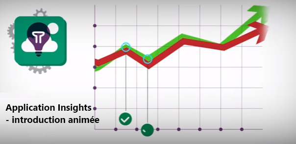](https://www.youtube.com/watch?v=fX2NtGrh-Y0)

> [!VIDEO https://channel9.msdn.com/events/Connect/2016/100/player] 

<!--Link references-->

[android]: https://github.com/Microsoft/ApplicationInsights-Android
[azure]: ../insights-perf-analytics.md
[client]: app-insights-javascript.md
[desktop]: app-insights-windows-desktop.md
[detect]: app-insights-detect-triage-diagnose.md
[greenbrown]: app-insights-asp-net.md
[ios]: https://github.com/Microsoft/ApplicationInsights-iOS
[java]: app-insights-java-get-started.md
[knowUsers]: app-insights-web-track-usage.md
[platforms]: app-insights-platforms.md
[portal]: http://portal.azure.com/
[qna]: app-insights-troubleshoot-faq.md
[redfield]: app-insights-monitor-performance-live-website-now.md
