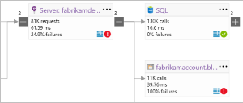

# Présentation d’Application Insights
Application Insights est un service extensible de gestion des performances des applications (APM) destiné aux développeurs web sur de multiples plateformes. Utiliser toomonitor votre application web dynamique. Ce service détecte automatiquement les problèmes de performances. Il inclut toohelp d’outils puissants analytique vous diagnostiquez des problèmes et toounderstand ce que les utilisateurs effectuent avec votre application.  Il est conçu toohelp vous améliorer en permanence les performances et la facilité d’utilisation. Il fonctionne pour les applications sur un large éventail de plateformes, y compris .NET, Node.js et J2EE, hébergé localement ou dans le cloud de hello. Il s’intègre à votre processus devOps et connexion points tooa divers outils de développement.

[Examinez l’animation Introduction hello](https://www.youtube.com/watch?v=fX2NtGrh-Y0).

## Comment fonctionne Application Insights ?
Vous installez un package de petits instrumentation dans votre application et configurez une ressource Application Insights dans le portail de Microsoft Azure hello. instrumentation de Hello surveille votre application et envoie le portail de toohello de données de télémétrie. (application hello peut exécuter n’importe quel endroit - il n’est pas toobe hébergé dans Azure.)

Vous pouvez instrumenter une application de service web hello non seulement, mais également tous les composants de l’arrière-plan et hello JavaScript dans les pages web hello eux-mêmes. 

En outre, vous pouvez extraire de télémétrie de hello hôte environnements tels que les compteurs de performance, les diagnostics Azure ou les journaux de Docker. Vous pouvez également définir des tests web qui envoient régulièrement des demandes synthétiques service web de tooyour.

Tous ces flux de données de télémétrie est intégrés dans hello portail Azure, où vous pouvez appliquer puissante d’analyse et de recherche outils toohello des données brutes.

### Quelle est la surcharge de hello ?
impact de Hello sur les performances de votre application est très faible. Le suivi des appels n’entraîne aucun blocage, et les appels sont regroupés par lots et envoyés dans un thread séparé.

## Que surveille Application Insights ?

Application Insights est destiné à l’équipe de développement hello, toohelp vous comprenez comment votre application s’exécute et comment il est utilisé. Il analyse les éléments suivants :

* **Taux de demandes, temps de réponse et taux d’échec** : identifiez les pages les plus consultées, à quel moment de la journée, et déterminez où se trouvent vos utilisateurs. Identifiez les pages qui offrent les meilleures performances. Si vos temps de réponse et votre taux d’échec augmentent lorsqu’il y a plus de requêtes, vous avez peut-être un problème de ressources. 
* **Taux de dépendance, temps de réponse et taux d’échec** : déterminez si des services externes vous ralentissent.
* **Exceptions** : analyser les statistiques de hello agrégée, ou choisir des instances spécifiques et explorez de trace de la pile hello et requêtes connexes. Les exceptions de serveur et de navigateur sont signalées.
* **Consultations de pages et performances de chargement** : indiquées par le navigateur de vos utilisateurs.
* **Appels AJAX** à partir de pages web : taux, temps de réponse et taux d’échec.
* **Nombre de sessions et d’utilisateurs**.
* **Compteurs de performances** de vos ordinateurs serveurs Windows ou Linux, par exemple le processeur, la mémoire et l’utilisation du réseau. 
* **Diagnostics d’hébergement** de Docker ou Azure. 
* **Journaux de suivi des diagnostics** de votre application : pour pouvoir mettre en corrélation les événements de suivi avec les demandes.
* **Événements personnalisés et des mesures** que vous écrivez vous-même dans hello client ou le code serveur, tootrack des événements commerciaux tels que les articles vendus ou jeux won.

## Où trouver mes données de télémétrie ?

Il existe de nombreuses façons tooexplore vos données. Consultez les articles suivants :

|  |  |
| --- | --- |
| [**Détection intelligente et alertes manuelles**](app-insights-proactive-diagnostics.md) Alertes automatiques adaptent modèles normal de l’application tooyour de télémétrie et le déclencheur lorsqu’il existe un élément en dehors du modèle habituel de hello. Vous pouvez également [définir des alertes](app-insights-alerts.md) sur des niveaux particuliers de mesures personnalisées ou standard. | |
| [**Mise en correspondance d’applications**](app-insights-app-map.md) composants Hello de votre application, avec des mesures clés et les alertes. |  |
| [**Profileur**](app-insights-profiler.md) Vérifiez que les profils d’exécution hello de demandes échantillonnées. | |
| [**Analyse de l’utilisation**](app-insights-usage-overview.md) Analysez la rétention et la segmentation ds utilisateurs.| |
| [**Recherche de diagnostic pour les données d’instance**](app-insights-diagnostic-search.md) Cherchez et filtrez les événements, comme les requêtes, les exceptions, les appels de dépendance, les suivis de journaux et les affichages de pages.  | |
| [**Metrics Explorer pour les données agrégées**](app-insights-metrics-explorer.md) Explorez, filtrez et segmentez des données agrégées, comme les taux de demandes, d’échecs et d’exceptions, les temps de réponse et les durées de chargement des pages. | |
| [**Tableaux de bord**](app-insights-dashboards.md#dashboards) Combinez des données de plusieurs sources et partagez-les avec d’autres. Idéal pour les applications à plusieurs composantes et d’affichage en continu dans la salle d’équipe hello. | |
| [**Live Metrics Stream**](app-insights-live-stream.md) Lorsque vous déployez une nouvelle build, regardez ces toomake d’indicateurs de performance de proximité en temps réel que tout fonctionne comme prévu. | |
| [**Analytics**](app-insights-analytics.md) Répondez à des questions difficiles sur les performances et l’utilisation de votre application avec ce langage de requêtes puissant. | |
| [**Visual Studio**](app-insights-visual-studio.md) Consultez les données de performances dans le code hello. Accédez toocode à partir des traces de pile.| |
| [**Débogueur de capture instantanée**](app-insights-snapshot-debugger.md) Déboguez les captures instantanées échantillonnées à partir des opérations en direct, avec des valeurs de paramètre.| |
| [**Power BI**](app-insights-export-power-bi.md) Intégrez des mesures d’utilisation à d’autres données décisionnelles.| |
| [**API REST**](https://dev.applicationinsights.io/) Écrire du code toorun requêtes via vos métriques et les données brutes.|  |
| [**Exportation continue**](app-insights-export-telemetry.md) Exportation en bloc de données brutes toostorage dès qu’elles arrivent. | |

## Comment utiliser Application Insights ?

### Surveiller
Installez Application Insights dans votre application, configurez les [tests web de disponibilité](app-insights-monitor-web-app-availability.md), puis :

* Configurer un [tableau de bord](app-insights-dashboards.md) pour votre tookeep de salle d’équipe un œil sur la charge, la réactivité et les performances de hello de vos dépendances, page charges et les appels AJAX.
* Découvrez qui sont les plus lents de hello et la plupart des demandes d’échec.
* Espion [flux Live](app-insights-live-stream.md) lorsque vous déployez une nouvelle version, tooknow immédiatement sur la dégradation.

### Détecter, diagnostiquer
Lorsque vous recevez une alerte ou découvrez un problème :

* Évaluez le nombre d’utilisateurs affectés.
* Mettez en corrélation les échecs et les exceptions, les appels de dépendance et les traces.
* Examinez le profileur, les captures instantanées, les vidages de pile et les journaux de suivi.

### Créer, mesurer, apprendre
[Mesurer l’efficacité de hello](app-insights-usage-overview.md) de chacune des nouvelles fonctionnalités que vous déployez.

* Plan toomeasure comment les clients utilisent nouvelle expérience utilisateur ou des fonctionnalités d’entreprise.
* Écrivez des données de télémétrie personnalisées dans votre code.
* Le cycle de développement suivant de hello de base sur la preuve de disque dur à partir de votre télémétrie.

## Prise en main
Application Insights est un des hello de nombreux services hébergés dans Microsoft Azure et la télémétrie est envoyés pour l’analyse et de présentation. Avant de vous faire autre chose, vous devez un abonnement trop[Microsoft Azure](http://azure.com). C’est gratuit toosign et si vous choisissez hello base [plan de tarification](https://azure.microsoft.com/pricing/details/application-insights/) d’Application Insights, aucun frais n’est jusqu'à ce que votre application a été augmenté de manière utilisation importante de toohave. Si votre organisation possède déjà un abonnement, ils pourraient ajouter votre tooit de compte Microsoft.

Il existe plusieurs façons tooget a démarré. Commencez par la méthode qui vous convient le mieux. Vous pouvez ajouter d’autres hello plus tard.

* **Au moment de l’exécution : instrumenter votre application web sur le serveur de hello.** Permet d’éviter tout code toohello de mise à jour. Vous devez le serveur d’administration accès tooyour.
  * [**IIS local ou sur une machine virtuelle**](app-insights-monitor-performance-live-website-now.md)
  * [**Application web ou machine virtuelle Azure**](app-insights-monitor-performance-live-website-now.md)
  * [**J2EE**](app-insights-java-live.md)
* **Au moment du développement : ajoutez Application Insights tooyour code.** Vous permet de toowrite télémétrie et tooinstrument back-end et bureau applications personnalisées.
  * [Visual Studio](app-insights-asp-net.md) 2013 Update 2 ou version ultérieure.
  * Java dans [Eclipse](app-insights-java-eclipse.md) ou [autres outils](app-insights-java-get-started.md)
  * [Node.JS](app-insights-nodejs.md)
  * [autres plateformes](app-insights-platforms.md)
* **[Instrumentez vos pages web](app-insights-javascript.md)** pour l’affichage de page, AJAX et d’autres données de télémétrie côté client.
* **[Tests de disponibilité](app-insights-monitor-web-app-availability.md)** : effectuez régulièrement un test ping sur votre site web à partir de nos serveurs.

## Étapes suivantes
Prise en main lors de l’exécution avec :

* [Serveur IIS](app-insights-monitor-performance-live-website-now.md)
* [Serveur J2EE](app-insights-java-live.md)

Prise en main pendant le développement avec :

* [ASP.NET](app-insights-asp-net.md)
* [Java](app-insights-java-get-started.md)
* [Node.JS](app-insights-nodejs.md)

## Support et commentaires
* Questions et problèmes :
  * [Résolution des problèmes][qna]
  * [Forum MSDN](https://social.msdn.microsoft.com/Forums/vstudio/home?forum=ApplicationInsights)
  * [Stackoverflow](http://stackoverflow.com/questions/tagged/ms-application-insights)
* Vos suggestions :
  * [UserVoice](https://visualstudio.uservoice.com/forums/357324)
* Blog :
  * [Blog Application Insights](https://azure.microsoft.com/blog/tag/application-insights)

## Vidéos

> [!VIDEO https://channel9.msdn.com/events/Connect/2016/100/player] 

<!--Link references-->

[android]: https://github.com/Microsoft/ApplicationInsights-Android
[azure]: ../insights-perf-analytics.md
[client]: app-insights-javascript.md
[desktop]: app-insights-windows-desktop.md
[detect]: app-insights-detect-triage-diagnose.md
[greenbrown]: app-insights-asp-net.md
[ios]: https://github.com/Microsoft/ApplicationInsights-iOS
[java]: app-insights-java-get-started.md
[knowUsers]: app-insights-web-track-usage.md
[platforms]: app-insights-platforms.md
[portal]: http://portal.azure.com/
[qna]: app-insights-troubleshoot-faq.md
[redfield]: app-insights-monitor-performance-live-website-now.md
