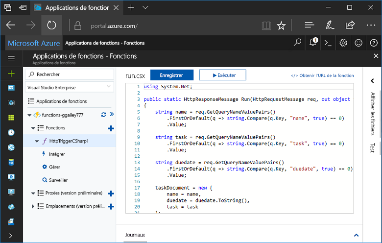
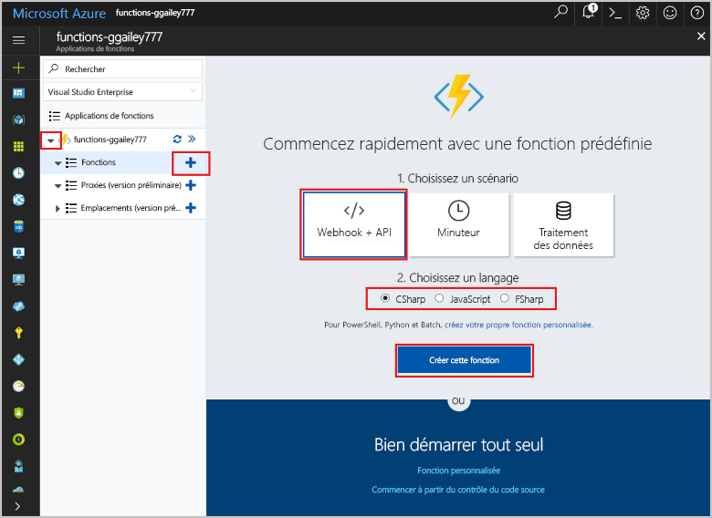
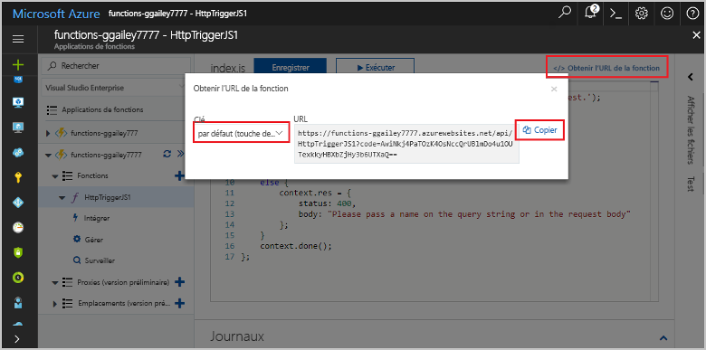
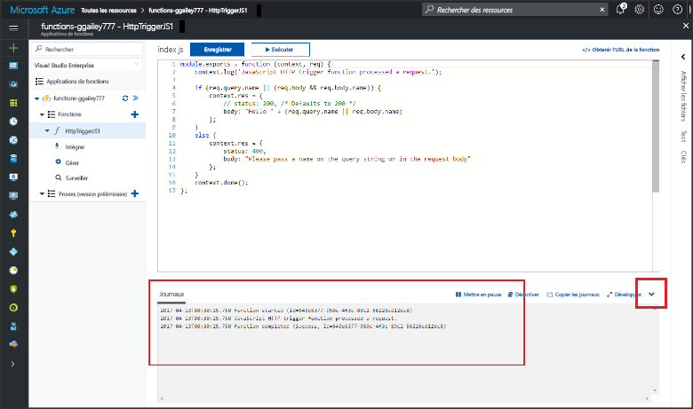

# Créer votre première fonction Bonjour portail AzureCreate your first function in hello Azure portal

Les fonctions Azure vous permet d’exécuter votre code dans un environnement sans serveur sans avoir toofirst créer une machine virtuelle ou publier une application web.Azure Functions lets you execute your code in a serverless environment without having toofirst create a VM or publish a web application. Dans cette rubrique, découvrez comment toouse fonctionne toocreate une fonction de « hello world » dans hello portail Azure.In this topic, learn how toouse Functions toocreate a "hello world" function in hello Azure portal.

[!INCLUDE [quickstarts-free-trial-note](../../includes/quickstarts-free-trial-note.md)]

## Connectez-vous à tooAzureLog in tooAzure

Connectez-vous à toohello [portail Azure](https://portal.azure.com/).Log in toohello [Azure portal](https://portal.azure.com/).

## Créer une Function AppCreate a function app

Vous devez disposer d’une application toohost hello exécution d’une fonction de vos fonctions.You must have a function app toohost hello execution of your functions. Une Function App vous permet de regrouper les fonctions en une unité logique pour faciliter la gestion, le déploiement et le partage des ressources.A function app lets you group functions as a logic unit for easier management, deployment, and sharing of resources. 

[!INCLUDE [Create function app Azure portal](../../includes/functions-create-function-app-portal.md)]

[!INCLUDE [functions-portal-favorite-function-apps](../../includes/functions-portal-favorite-function-apps.md)]

Ensuite, créez une fonction dans hello une nouvelle application de fonction.Next, you create a function in hello new function app.

## Créer une fonction déclenchée via HTTPCreate an HTTP triggered function

1. Développez votre nouvelle application de la fonction, puis cliquez sur hello  **+**  bouton ensuite trop**fonctions**.Expand your new function app, then click hello **+** button next too**Functions**.

2.  Bonjour **mise en route rapide** page, sélectionnez **WebHook + API**, **choisir une langue** votre fonction, puis cliquez sur **créer cette fonction** .In hello **Get started quickly** page, select **WebHook + API**, **Choose a language** for your function, and click **Create this function**. 
   
    

Une fonction est créée dans la langue choisie à l’aide du modèle de hello pour une fonction HTTP déclenchée.A function is created in your chosen language using hello template for an HTTP triggered function. Vous pouvez exécuter la fonction hello en envoyant une requête HTTP.You can run hello new function by sending an HTTP request.

## Fonction hello de testTest hello function

1. Dans votre nouvelle fonction, cliquez sur **</> Obtenir l’URL de la fonction**, sélectionnez **par défaut (touche de fonction)**, puis cliquez sur **Copier**.In your new function, click **</> Get function URL**, select **default (Function key)**, and then click **Copy**. 

    

2. Collez l’URL de fonction hello dans la barre d’adresse de votre navigateur.Paste hello function URL into your browser's address bar. Ajouter la chaîne de requête hello `&name=<yourname>` hello d’URL, puis appuyez sur toothis `Enter` clés sur votre demande de hello tooexecute clavier.Append hello query string `&name=<yourname>` toothis URL and press hello `Enter` key on your keyboard tooexecute hello request. Hello Voici un exemple de réponse hello retourné par la fonction hello dans le navigateur Edge hello :hello following is an example of hello response returned by hello function in hello Edge browser:

    

    demande Hello URL inclut une clé qui est requis, par défaut, tooaccess votre fonction via HTTP.hello request URL includes a key that is required, by default, tooaccess your function over HTTP.   

3. Lorsque votre fonction s’exécute, les informations de trace sont écrite toohello journaux.When your function runs, trace information is written toohello logs. sortie de trace hello toosee à partir de l’exécution précédente de hello, retourner tooyour fonction dans le portail de hello et cliquez sur hello flèche bas hello hello écran tooexpand **journaux**.toosee hello trace output from hello previous execution, return tooyour function in hello portal and click hello up arrow at hello bottom of hello screen tooexpand **Logs**. 

   

## Supprimer des ressourcesClean up resources

[!INCLUDE [Clean up resources](../../includes/functions-quickstart-cleanup.md)]

## Étapes suivantesNext steps

Vous avez créé une Function App avec une simple fonction déclenchée via HTTP.You have created a function app with a simple HTTP triggered function.  

[!INCLUDE [Next steps note](../../includes/functions-quickstart-next-steps.md)]

Pour plus d’informations, consultez [Liaisons HTTP et webhook Azure Functions](functions-bindings-http-webhook.md).For more information, see [Azure Functions HTTP and webhook bindings](functions-bindings-http-webhook.md).

