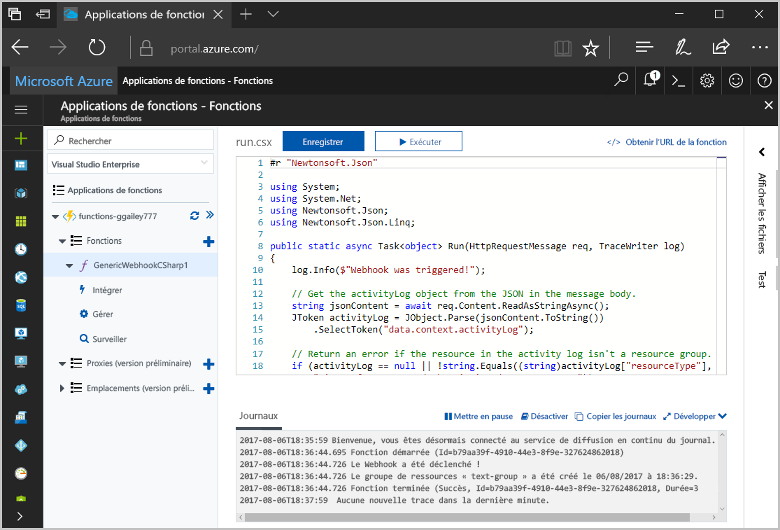
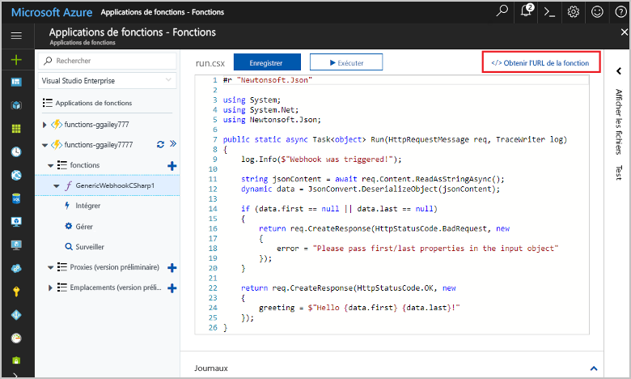
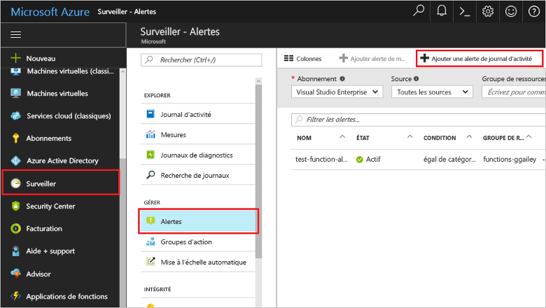
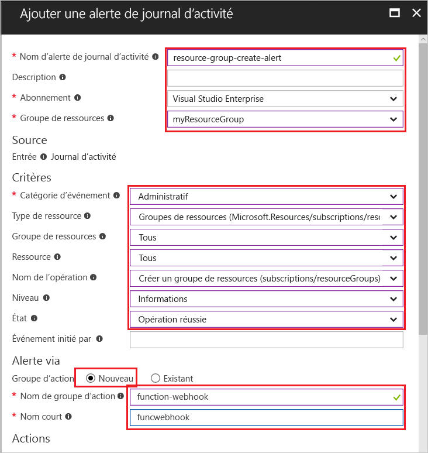
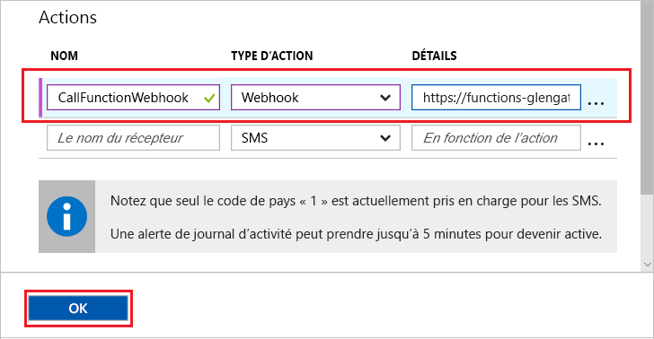
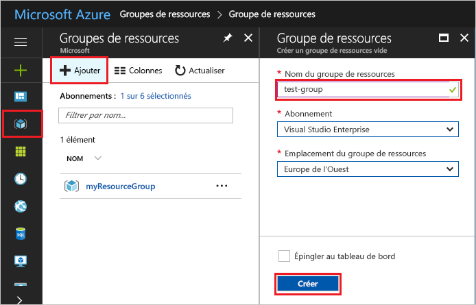
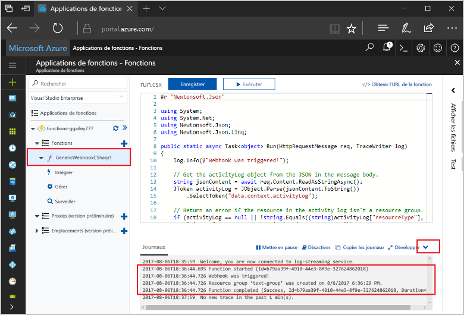

# <a name="create-a-function-triggered-by-a-generic-webhook"></a>Créer une fonction déclenchée par un webhook générique

Les fonctions Azure vous permet d’exécuter votre code dans un environnement sans serveur sans avoir toofirst créer une machine virtuelle ou publier une application web. Par exemple, vous pouvez configurer un toobe fonction déclenchée par une alerte déclenchée par le moniteur de Windows Azure. Cette rubrique vous montre comment tooexecute code c# lorsqu’un groupe de ressources est ajouté tooyour abonnement.   



## <a name="prerequisites"></a>Composants requis 

toocomplete ce didacticiel :

+ Si vous n’avez pas d’abonnement Azure, créez un [compte gratuit](https://azure.microsoft.com/free/?WT.mc_id=A261C142F) avant de commencer.

[!INCLUDE [functions-portal-favorite-function-apps](../../includes/functions-portal-favorite-function-apps.md)]

## <a name="create-an-azure-function-app"></a>Création d’une application Azure Function

[!INCLUDE [Create function app Azure portal](../../includes/functions-create-function-app-portal.md)]

Ensuite, créez une fonction dans hello une nouvelle application de fonction.

## <a name="create-function"></a>Créer une fonction déclenchée par un webhook générique

1. Développez votre application de la fonction et cliquez sur hello  **+**  bouton ensuite trop**fonctions**. Si cette fonction est hello dans votre application de la fonction, sélectionnez **fonction personnalisée**. Cela affiche le jeu complet de hello des modèles de fonction.

    

2. Sélectionnez hello **WebHook - générique c#** modèle. Donnez un nom à votre fonction C#, puis sélectionnez **Créer**.

      

2. Dans votre nouvelle fonction, cliquez sur **<> / Get fonction URL**, puis copiez et enregistrez la valeur de hello. Vous utilisez ce webhook de hello tooconfigure valeur. 

    
         
Créez ensuite un point de terminaison webhook dans une alerte de journal d’activité dans Azure Monitor. 

## <a name="create-an-activity-log-alert"></a>Créer une alerte de journal d’activité

1. Dans hello portail Azure, accédez toohello **moniteur** service, sélectionnez **alertes**, puis cliquez sur **ajouter une alerte journal activité**.   

    

2. Utiliser les paramètres de hello comme spécifié dans la table de hello :

    

    | Paramètre      |  Valeur suggérée   | Description                              |
    | ------------ |  ------- | -------------------------------------------------- |
    | **Nom de l’alerte de journal d’activité** | resource-group-create-alert | Nom de l’alerte de journal d’activité hello. |
    | **Abonnement** | Votre abonnement | abonnement Hello que vous utilisez pour ce didacticiel. | 
    |  **Groupe de ressources** | myResourceGroup | groupe de ressources Hello déployés pour avertir les ressources hello. À l’aide de hello le même groupe de ressources comme votre application de la fonction rend plus facile tooclean après avoir terminé le didacticiel de hello. |
    | **Catégorie d’événement** | Administratif | Cette catégorie inclut les modifications apportées aux ressources de tooAzure.  |
    | **Type de ressource** | Groupes de ressources | Filtre les activités de groupe tooresource alertes. |
    | **Groupe de ressources**<br/>et **Ressource** | Tout | Surveille toutes les ressources. |
    | **Nom d’opération** | Créer un groupe de ressources | Filtre les opérations de toocreate d’alertes. |
    | **Niveau** | Informations | Incluez les alertes de niveau d’informations. | 
    | **État** | Réussi | Filtres tooactions alertes qui ont été effectuées avec succès. |
    | **Groupe d’actions** | Nouveau | Créer un nouveau groupe d’action, qui définit l’action hello se lorsqu’une alerte est déclenchée. |
    | **Nom du groupe d’actions** | function-webhook | Un groupe d’actions nom tooidentify hello.  | 
    | **Nom court** | funcwebhook | Un nom court pour le groupe d’actions hello. |  

3. Dans **Actions**, ajoutez une action à l’aide des paramètres de hello comme spécifié dans la table de hello : 

    

    | Paramètre      |  Valeur suggérée   | Description                              |
    | ------------ |  ------- | -------------------------------------------------- |
    | **Name** | CallFunctionWebhook | Un nom pour l’action de hello. |
    | **Type d’action** | webhook | alerte de toohello Hello réponse est que l’URL du Webhook est appelée. |
    | **Détails** | URL de la fonction | Collez l’URL du webhook hello de fonction hello que vous avez copiée précédemment. |v

4. Cliquez sur **OK** toocreate hello alerte et action le groupe.  

Hello webhook est maintenant appelé lorsqu’un groupe de ressources est créé dans votre abonnement. Ensuite, vous mettre à jour hello code dans votre hello toohandle de fonction JSON journal données hello corps de demande de hello.   

## <a name="update-hello-function-code"></a>Mettre à jour le code de la fonction hello

1. Accédez d’application de fonction tooyour précédent dans le portail de hello et développez votre fonction. 

2. Remplacez le code de script hello c# dans la fonction hello dans le portail de hello hello suivant de code :

    ```csharp
    #r "Newtonsoft.Json"
    
    using System;
    using System.Net;
    using Newtonsoft.Json;
    using Newtonsoft.Json.Linq;
    
    public static async Task<object> Run(HttpRequestMessage req, TraceWriter log)
    {
        log.Info($"Webhook was triggered!");
    
        // Get hello activityLog object from hello JSON in hello message body.
        string jsonContent = await req.Content.ReadAsStringAsync();
        JToken activityLog = JObject.Parse(jsonContent.ToString())
            .SelectToken("data.context.activityLog");
    
        // Return an error if hello resource in hello activity log isn't a resource group. 
        if (activityLog == null || !string.Equals((string)activityLog["resourceType"], 
            "Microsoft.Resources/subscriptions/resourcegroups"))
        {
            log.Error("An error occured");
            return req.CreateResponse(HttpStatusCode.BadRequest, new
            {
                error = "Unexpected message payload or wrong alert received."
            });
        }
    
        // Write information about hello created resource group toohello streaming log.
        log.Info(string.Format("Resource group '{0}' was {1} on {2}.",
            (string)activityLog["resourceGroupName"],
            ((string)activityLog["subStatus"]).ToLower(), 
            (DateTime)activityLog["submissionTimestamp"]));
    
        return req.CreateResponse(HttpStatusCode.OK);    
    }
    ```

Vous pouvez maintenant tester la fonction hello en créant un nouveau groupe de ressources dans votre abonnement.

## <a name="test-hello-function"></a>Fonction hello de test

1. Cliquez sur icône de groupe de ressources hello en hello portail Azure, sélectionnez à gauche hello **+ ajouter**, tapez un **nom de groupe de ressources**, puis sélectionnez **créer** toocreate un groupe de ressources vide.
    
    

2. Revenir en arrière tooyour fonction et développez hello **journaux** fenêtre. Après la création de groupe de ressources hello, webhook hello hello alerte déclencheurs de journal d’activité et hello fonction s’exécute. Vous voyez le nom hello du nouveau groupe de ressources hello écrit des journaux de toohello.  

    

3. (Facultatif) Revenir en arrière et supprimer le groupe de ressources hello que vous avez créé. Notez que cette activité ne déclenche pas fonction hello. C’est parce que delete opérations sont filtrées par l’alerte de hello. 

## <a name="clean-up-resources"></a>Supprimer des ressources

[!INCLUDE [Next steps note](../../includes/functions-quickstart-cleanup.md)]

## <a name="next-steps"></a>Étapes suivantes

Vous avez créé une fonction qui s’exécute lorsqu’une requête est reçue à partir d’un webhook générique. 

[!INCLUDE [Next steps note](../../includes/functions-quickstart-next-steps.md)]

Pour en savoir plus sur les déclencheurs webhook, consultez la page [Liaisons HTTP et webhook d’Azure Functions](functions-bindings-http-webhook.md). toolearn plus sur le développement de fonctions en langage c#, consultez [référence du développeur Azure fonctions C# script](functions-reference-csharp.md).

