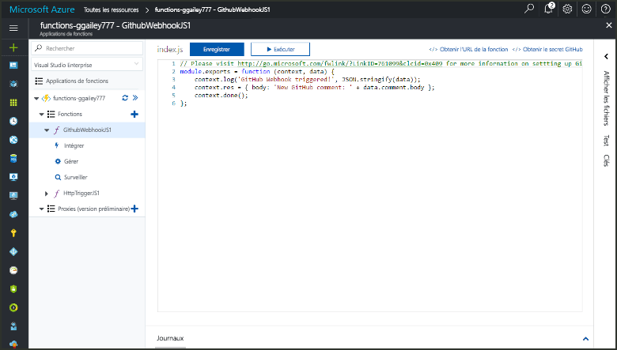
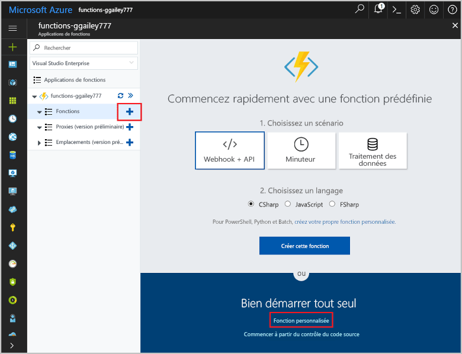
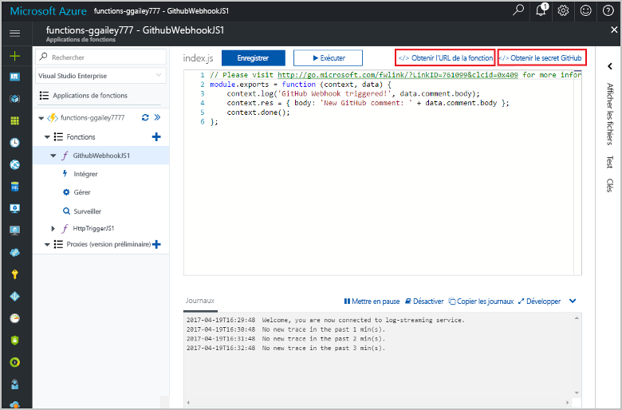
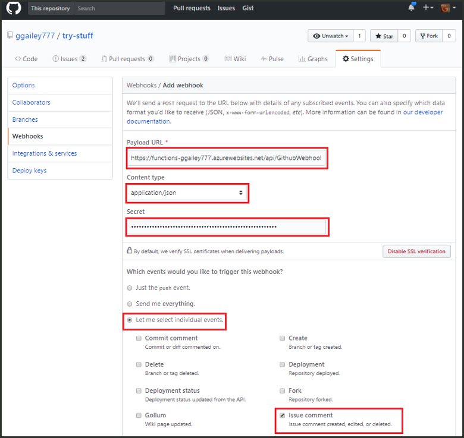
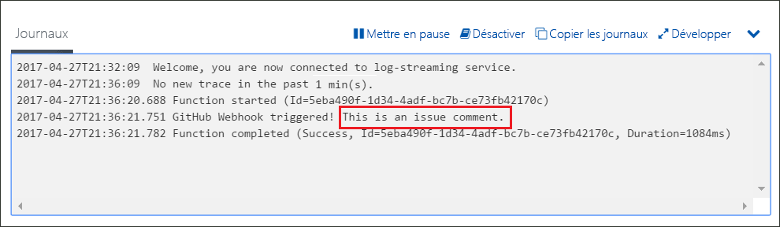

# Créer une fonction déclenchée par un webhook GitHubCreate a function triggered by a GitHub webhook

Découvrez comment toocreate une fonction qui est déclenchée par une demande de webhook HTTP avec une charge utile GitHub spécifiques.Learn how toocreate a function that is triggered by an HTTP webhook request with a GitHub-specific payload.

## Composants requisPrerequisites

+ Un compte GitHub avec au moins un projet.A GitHub account with at least one project.
+ Un abonnement Azure.An Azure subscription. Si vous n’en avez pas, créez un [compte gratuit](https://azure.microsoft.com/free/?WT.mc_id=A261C142F) avant de commencer.If you don't have one, create a [free account](https://azure.microsoft.com/free/?WT.mc_id=A261C142F) before you begin.

[!INCLUDE [functions-portal-favorite-function-apps](../../includes/functions-portal-favorite-function-apps.md)]

## Création d’une application Azure FunctionCreate an Azure Function app

[!INCLUDE [Create function app Azure portal](../../includes/functions-create-function-app-portal.md)]

Ensuite, créez une fonction dans hello une nouvelle application de fonction.Next, you create a function in hello new function app.

## Créer une fonction de déclenchement de webhook GitHubCreate a GitHub webhook triggered function

1. Développez votre application de la fonction et cliquez sur hello  **+**  bouton ensuite trop**fonctions**.Expand your function app and click hello **+** button next too**Functions**. S’il s’agit de hello première fonction dans votre application de la fonction, sélectionnez **fonction personnalisée**.If this is hello first function in your function app, select **Custom function**. Cela affiche le jeu complet de hello des modèles de fonction.This displays hello complete set of function templates.

    

2. Sélectionnez hello **GitHub WebHook** modèle pour le langage de votre choix.Select hello **GitHub WebHook** template for your desired language. **Nommez votre fonction**, puis cliquez sur **Créer**.**Name your function**, then select **Create**.

      

3. Dans votre nouvelle fonction, cliquez sur **<> / Get fonction URL**, puis copiez et enregistrez les valeurs hello.In your new function, click **</> Get function URL**, then copy and save hello values. Hello même chose pour **<> / obtenir le GitHub secret**.Do hello same thing for **</> Get GitHub secret**. Vous utilisez ces webhook de hello valeurs tooconfigure dans GitHub.You use these values tooconfigure hello webhook in GitHub.

    

Ensuite, vous créez le webhook dans votre référentiel GitHub.Next, you create a webhook in your GitHub repository.

## Configurer hello webhookConfigure hello webhook

1. Dans GitHub, accédez référentiel tooa dont vous êtes propriétaire.In GitHub, navigate tooa repository that you own. Vous pouvez également utiliser l’un des référentiels que vous avez dupliqués.You can also use any repository that you have forked. Si vous avez besoin d’un référentiel de toofork, utilisez <https://github.com/Azure-Samples/functions-quickstart>.If you need toofork a repository, use <https://github.com/Azure-Samples/functions-quickstart>.

1. Cliquez sur **Paramètres**, puis sur **Webhooks** et **Ajouter un webhook**.Click **Settings**, then click **Webhooks**, and  **Add webhook**.

    

1. Utilisez les paramètres comme spécifié dans la table de hello, puis cliquez sur **ajouter webhook**.Use settings as specified in hello table, then click **Add webhook**.

    

| ParamètreSetting | Valeur suggéréeSuggested value | DescriptionDescription |
|---|---|---|
| **URL de charge utile****Payload URL** | Valeur copiéeCopied value | Utilisez la valeur hello retournée par **<> / Get fonction URL**.Use hello value returned by  **</> Get function URL**. |
| **Secret****Secret**   | Valeur copiéeCopied value | Utilisez la valeur hello retournée par **<> / obtenir le GitHub secret**.Use hello value returned by  **</> Get GitHub secret**. |
| **Type de contenu****Content type** | application/jsonapplication/json | fonction Hello attend une charge utile JSON.hello function expects a JSON payload. |
| Déclencheurs d’événementEvent triggers | Je vais sélectionner les événements individuelsLet me select individual events | Nous voulons uniquement tootrigger sur les événements de commentaire de problème.We only want tootrigger on issue comment events.  |
| | Problème sous forme de commentaireIssue comment |  |

Maintenant, hello webhook est tootrigger configuré votre fonction lors de l’ajout d’un nouveau commentaire de problème.Now, hello webhook is configured tootrigger your function when a new issue comment is added.

## Fonction hello de testTest hello function

1. Dans votre référentiel GitHub, ouvrez hello **problèmes** onglet dans une nouvelle fenêtre de navigateur.In your GitHub repository, open hello **Issues** tab in a new browser window.

1. Dans la nouvelle fenêtre de hello, cliquez sur **nouveau problème**, tapez un titre, puis cliquez sur **soumettre un nouveau problème**.In hello new window, click **New Issue**, type a title, and then click **Submit new issue**.

1. Problème de hello, tapez un commentaire et cliquez sur **commentaire**.In hello issue, type a comment and click **Comment**.

    

1. Revenir en arrière toohello portal et afficher les journaux de hello.Go back toohello portal and view hello logs. Vous devez voir une entrée de suivi par un nouveau texte de commentaire hello.You should see a trace entry with hello new comment text.

     

## Supprimer des ressourcesClean up resources

[!INCLUDE [Next steps note](../../includes/functions-quickstart-cleanup.md)]

## Étapes suivantesNext steps

Vous avez créé une fonction qui s’exécute lorsqu’une requête est reçue à partir d’un webhook GitHub.You have created a function that runs when a request is received from a GitHub webhook.

[!INCLUDE [Next steps note](../../includes/functions-quickstart-next-steps.md)]

Pour en savoir plus sur les déclencheurs webhook, consultez la page [Liaisons HTTP et webhook d’Azure Functions](functions-bindings-http-webhook.md).For more information about webhook triggers, see [Azure Functions HTTP and webhook bindings](functions-bindings-http-webhook.md).
