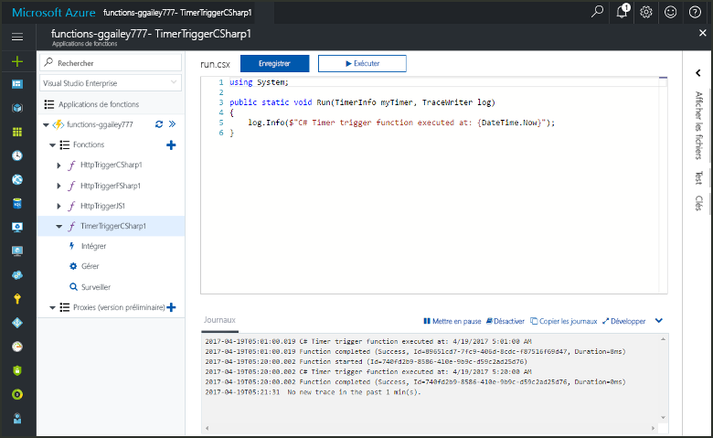
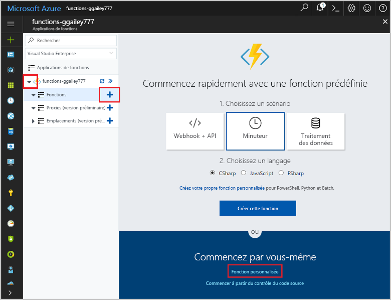
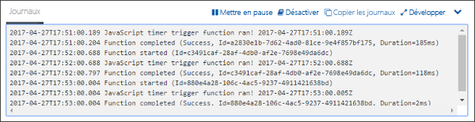
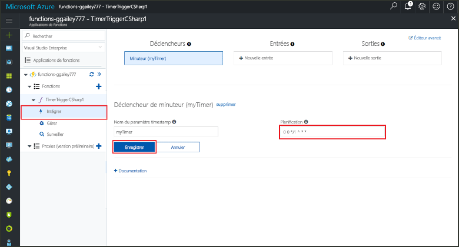

# Créez une fonction dans Azure, qui est déclenchée par un minuteurCreate a function in Azure that is triggered by a timer

Apprenez à créer une fonction dans Azure, qui s’exécute selon une planification que vous définissez.Learn how to use Azure Functions to create a function that runs based a schedule that you define.

## Composants requisPrerequisites

Pour suivre ce didacticiel :To complete this tutorial:

+ Si vous n’avez pas d’abonnement Azure, créez un [compte gratuit](https://azure.microsoft.com/free/?WT.mc_id=A261C142F) avant de commencer.If you don't have an Azure subscription, create a [free account](https://azure.microsoft.com/free/?WT.mc_id=A261C142F) before you begin.

[!INCLUDE [functions-portal-favorite-function-apps](../../includes/functions-portal-favorite-function-apps.md)]

## Création d’une application Azure FunctionCreate an Azure Function app

[!INCLUDE [Create function app Azure portal](../../includes/functions-create-function-app-portal.md)]

Créez ensuite une fonction dans la nouvelle Function App.Next, you create a function in the new function app.

## Créer une fonction déclenchée par un minuteurCreate a timer triggered function

1. Développez votre Function App, puis cliquez sur le bouton **+** en regard de **Fonctions**.Expand your function app and click the **+** button next to **Functions**. S’il s’agit de la première fonction de votre Function App, sélectionnez **Fonction personnalisée**.If this is the first function in your function app, select **Custom function**. Cela affiche l’ensemble complet des modèles de fonction.This displays the complete set of function templates.

    

2. Sélectionnez le modèle **TimerTrigger** pour le langage de votre choix.Select the **TimerTrigger** template for your desired language. Utilisez ensuite les paramètres spécifiés dans le tableau :Then use the settings as specified in the table:

    

    | ParamètreSetting | Valeur suggéréeSuggested value | DescriptionDescription |
    |---|---|---|
    | **Nommer votre fonction****Name your function** | TimerTriggerCSharp1TimerTriggerCSharp1 | Définit le nom de votre fonction déclenchée par minuteur.Defines the name of your timer triggered function. |
    | **[Planification](http://en.wikipedia.org/wiki/Cron#CRON_expression)****[Schedule](http://en.wikipedia.org/wiki/Cron#CRON_expression)** | 0 \*/1 \* \* \* \*0 \*/1 \* \* \* \* | Un champ de six [expressions CRON](http://en.wikipedia.org/wiki/Cron#CRON_expression) qui planifie l’exécution de votre fonction chaque minute.A six field [CRON expression](http://en.wikipedia.org/wiki/Cron#CRON_expression) that schedules your function to run every minute. |

2. Cliquez sur **Create**.Click **Create**. Une fonction est créée dans le langage que vous avez choisi et s’exécute chaque minute.A function is created in your chosen language that runs every minute.

3. Vérifiez l’exécution en consultant les informations de traçage écrites dans les journaux.Verify execution by viewing trace information written to the logs.

    

À présent, vous pouvez modifier la planification de la fonction afin qu’elle s’exécute moins souvent, par exemple une fois par heure.Now, you can change the function's schedule so that it runs less often, such as once every hour. 

## Mise à jour de la planification du minuteurUpdate the timer schedule

1. Développez votre fonction et cliquez sur **Intégrer**.Expand your function and click **Integrate**. Il s’agit de l’endroit où vous définissez les liaisons d’entrée et de sortie pour votre fonction, et où vous configurez la planification.This is where you define input and output bindings for your function and also set the schedule. 

2. Entrez une nouvelle valeur de **Planification** de `0 0 */1 * * *`, puis cliquez sur **Enregistrer**.Enter a new **Schedule** value of `0 0 */1 * * *`, and then click **Save**.  

Vous disposez maintenant d’une fonction qui s’exécute toutes les heures.You now have a function that runs once every hour. 

## Supprimer des ressourcesClean up resources

[!INCLUDE [Next steps note](../../includes/functions-quickstart-cleanup.md)]

## Étapes suivantesNext steps

Vous avez créé une fonction qui s’exécute selon une planification.You have created a function that runs based on a schedule.

[!INCLUDE [Next steps note](../../includes/functions-quickstart-next-steps.md)]

Pour en savoir plus sur les déclencheurs de minuteur, consultez la page [Planifier l’exécution de code avec Azure Functions](functions-bindings-timer.md).For more information timer triggers, see [Schedule code execution with Azure Functions](functions-bindings-timer.md).