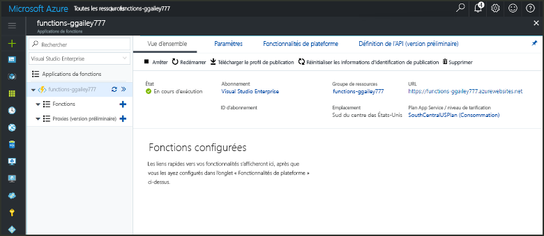

# Créez une fonction dans Azure, qui est déclenchée par un minuteur

Découvrez comment toouse Azure fonctions toocreate une fonction qui s’exécute sur une planification que vous définissez.

## Composants requis

toocomplete ce didacticiel :

+ Si vous n’avez pas d’abonnement Azure, créez un [compte gratuit](https://azure.microsoft.com/free/?WT.mc_id=A261C142F) avant de commencer.

[!INCLUDE [functions-portal-favorite-function-apps](../../includes/functions-portal-favorite-function-apps.md)]

## Création d’une application Azure Function

[!INCLUDE [Create function app Azure portal](../../includes/functions-create-function-app-portal.md)]

Ensuite, créez une fonction dans hello une nouvelle application de fonction.

## Créer une fonction déclenchée par un minuteur

1. Développez votre application de la fonction et cliquez sur hello  **+**  bouton ensuite trop**fonctions**. S’il s’agit de hello première fonction dans votre application de la fonction, sélectionnez **fonction personnalisée**. Cela affiche le jeu complet de hello des modèles de fonction.

    

2. Sélectionnez hello **TimerTrigger** modèle pour le langage de votre choix. Utilisez ensuite les paramètres de hello comme spécifié dans la table de hello :

    

    | Paramètre | Valeur suggérée | Description |
    |---|---|---|
    | **Nommer votre fonction** | TimerTriggerCSharp1 | Définit le nom hello de votre fonction de minuteur déclenché. |
    | **[Planification](http://en.wikipedia.org/wiki/Cron#CRON_expression)** | 0 \*/1 \* \* \* \* | Un champ de six [expression CRON](http://en.wikipedia.org/wiki/Cron#CRON_expression) qui planifie votre toorun fonction toutes les minutes. |

2. Cliquez sur **Créer**. Une fonction est créée dans le langage que vous avez choisi et s’exécute chaque minute.

3. Vérifier l’exécution en consultant les informations de traçage écrites toohello journaux.

    

Maintenant, vous pouvez modifier la planification de la fonction hello afin qu’elle s’exécute moins souvent, par exemple une fois par heure. 

## Planification de mise à jour hello du minuteur

1. Développez votre fonction et cliquez sur **Intégrer**. Il s’agit où vous définissez l’entrée et de sortie liaisons de votre fonction et également définissez la planification de hello. 

2. Entrez une nouvelle valeur de **Planification** de `0 0 */1 * * *`, puis cliquez sur **Enregistrer**.  

Vous disposez maintenant d’une fonction qui s’exécute toutes les heures. 

## Supprimer des ressources

[!INCLUDE [Next steps note](../../includes/functions-quickstart-cleanup.md)]

## Étapes suivantes

Vous avez créé une fonction qui s’exécute selon une planification.

[!INCLUDE [Next steps note](../../includes/functions-quickstart-next-steps.md)]

Pour en savoir plus sur les déclencheurs de minuteur, consultez la page [Planifier l’exécution de code avec Azure Functions](functions-bindings-timer.md).