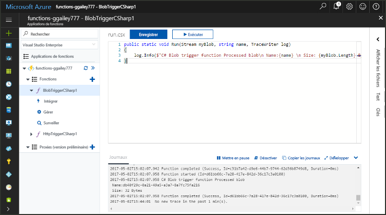
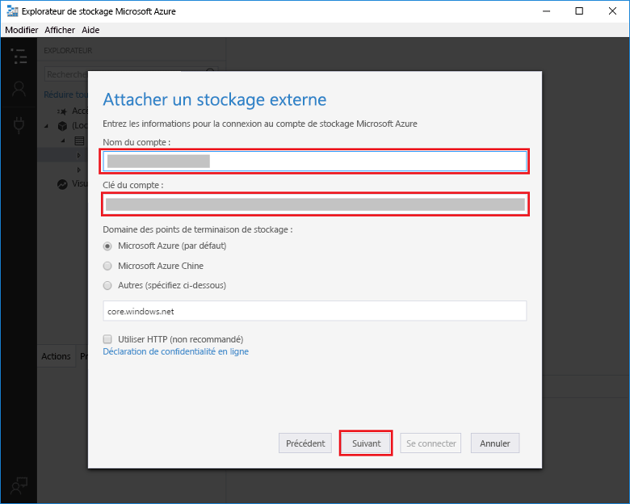
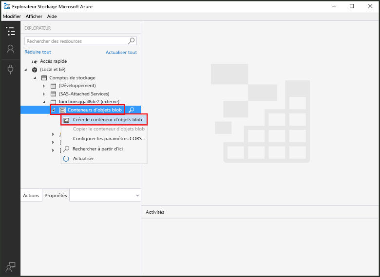
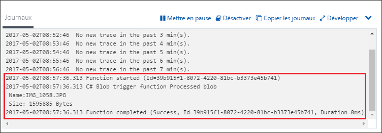

# Créer une fonction déclenchée par un stockage Blob AzureCreate a function triggered by Azure Blob storage

Apprenez à créer une fonction déclenchée lorsque des fichiers sont chargés dans ou mis à jour dans le stockage Blob Azure.Learn how to create a function triggered when files are uploaded to or updated in Azure Blob storage.

## Composants requisPrerequisites

+ Télécharger et installer l’[Explorateur de Stockage Microsoft Azure](http://storageexplorer.com/).Download and install the [Microsoft Azure Storage Explorer](http://storageexplorer.com/).
+ Un abonnement Azure.An Azure subscription. Si vous n’en avez pas, créez un [compte gratuit](https://azure.microsoft.com/free/?WT.mc_id=A261C142F) avant de commencer.If you don't have one, create a [free account](https://azure.microsoft.com/free/?WT.mc_id=A261C142F) before you begin.

[!INCLUDE [functions-portal-favorite-function-apps](../../includes/functions-portal-favorite-function-apps.md)]

## Création d’une application Azure FunctionCreate an Azure Function app

[!INCLUDE [Create function app Azure portal](../../includes/functions-create-function-app-portal.md)]

Créez ensuite une fonction dans la nouvelle Function App.Next, you create a function in the new function app.

## Créer une fonction déclenchée par le stockage BlobCreate a Blob storage triggered function

1. Développez votre Function App, puis cliquez sur le bouton **+** en regard de **Fonctions**.Expand your function app and click the **+** button next to **Functions**. S’il s’agit de la première fonction de votre Function App, sélectionnez **Fonction personnalisée**.If this is the first function in your function app, select **Custom function**. Cela affiche l’ensemble complet des modèles de fonction.This displays the complete set of function templates.

    

2. Sélectionnez le modèle **BlobTrigger** de la langue de votre choix, puis utilisez les paramètres comme indiqué dans le tableau.Select the **BlobTrigger** template for your desired language, and use the settings as specified in the table.

    

    | ParamètreSetting | Valeur suggéréeSuggested value | DescriptionDescription |
    |---|---|---|
    | **Chemin d’accès****Path**   | mycontainer/{name}mycontainer/{name}    | Emplacement du stockage Blob analysé.Location in Blob storage being monitored. Le nom de fichier de l’objet Blob est transmis dans la liaison en tant que paramètre _name_.The file name of the blob is passed in the binding as the _name_ parameter.  |
    | **Connexion au compte de stockage****Storage account connection** | AzureWebJobStorageAzureWebJobStorage | Vous pouvez utiliser la connexion au compte de stockage qui est déjà utilisée par votre Function App ou en créer une.You can use the storage account connection already being used by your function app, or create a new one.  |
    | **Nommer votre fonction****Name your function** | Unique dans votre Function AppUnique in your function app | Nom de cette fonction déclenchée par l’objet Blob.Name of this blob triggered function. |

3. Cliquez sur **Créer** pour créer votre fonction.Click **Create** to create your function.

Ensuite, connectez-vous à votre compte de stockage Azure et créez le conteneur **mycontainer**.Next, you connect to your Azure Storage account and create the **mycontainer** container.

## Créer le conteneurCreate the container

1. Dans votre fonction, cliquez sur **Intégrer**, développez **Documentation** et copiez le **Nom du compte** et la **Clé du compte**.In your function, click **Integrate**, expand **Documentation**, and copy both **Account name** and **Account key**. Vous utilisez ces informations d’identification pour vous connecter au compte de stockage.You use these credentials to connect to the storage account. Si vous avez déjà connecté votre compte de stockage, passez à l’étape 4.If you have already connected your storage account, skip to step 4.

    

1. Exécutez [l’Explorateur de stockage Microsoft Azure](http://storageexplorer.com/), cliquez sur l’icône de connexion situé sur la gauche, choisissez **Utiliser un nom et une clé de compte de stockage**, puis cliquez sur **Suivant**.Run the [Microsoft Azure Storage Explorer](http://storageexplorer.com/) tool, click the connect icon on the left, choose **Use a storage account name and key**, and click **Next**.

    

1. Saisissez le **Nom du compte** et la **Clé du compte** récupérés à l’étape 1, puis cliquez sur **Suivant** et sur **Connexion**.Enter the **Account name** and **Account key** from step 1, click **Next** and then **Connect**. 

    

1. Développez le compte de stockage attaché, cliquez avec le bouton droit sur **Conteneurs d’objets Blob**, puis sur **Créer un conteneur d’objets blob**, tapez `mycontainer` et appuyez sur Entrée.Expand the attached storage account, right-click **Blob containers**, click **Create blob container**, type `mycontainer`, and then press enter.

    

Une fois que vous avez un conteneur d’objets blob, vous pouvez tester la fonction en chargeant un fichier dans le conteneur.Now that you have a blob container, you can test the function by uploading a file to the container.

## Tester la fonctionTest the function

1. Dans le portail Azure, accédez à votre fonction, développez les **Journaux** en bas de la page et vérifiez que la diffusion de journaux n’est pas suspendue.Back in the Azure portal, browse to your function expand the **Logs** at the bottom of the page and make sure that log streaming isn't paused.

1. Dans l’Explorateur de stockage, développez votre compte de stockage, **Conteneurs d’objets Blob** et **mycontainer**.In Storage Explorer, expand your storage account, **Blob containers**, and **mycontainer**. Cliquez sur **Charger**, puis sur **Charger des fichiers...**.Click **Upload** and then **Upload files...**.

    

1. Dans la boîte de dialogue **Charger des fichiers**, cliquez sur le champ **Fichiers**.In the **Upload files** dialog box, click the **Files** field. Accédez à un fichier sur votre ordinateur local, par exemple un fichier image, sélectionnez-le, puis cliquez sur **Ouvrir** et sur **Charger**.Browse to a file on your local computer, such as an image file, select it and click **Open** and then **Upload**.

1. Revenez à vos journaux de fonction et vérifiez que l’objet blob a été lu.Go back to your function logs and verify that the blob has been read.

   

    >[!NOTE]
    > Lorsque votre Function App s’exécute dans le plan de consommation par défaut, il peut s’écouler un délai de plusieurs minutes entre l’ajout ou la mise à jour de l’objet blob et le déclenchement de la fonction.When your function app runs in the default Consumption plan, there may be a delay of up to several minutes between the blob being added or updated and the function being triggered. Si vous exigez une faible latence pour vos fonctions déclenchées par des objets Blob, exécutez plutôt votre Function App dans un plan App Service.If you need low latency in your blob triggered functions, consider running your function app in an App Service plan.

## Supprimer des ressourcesClean up resources

[!INCLUDE [Next steps note](../../includes/functions-quickstart-cleanup.md)]

## Étapes suivantesNext steps

Vous avez créé une fonction qui s’exécute lorsqu’un objet blob est ajouté ou mis à jour dans le stockage Blob.You have created a function that runs when a blob is added to or updated in Blob storage. 

[!INCLUDE [Next steps note](../../includes/functions-quickstart-next-steps.md)]

Pour plus d’informations sur les déclencheurs de stockage Blob, consultez [Liaisons de stockage Blob Azure Functions](functions-bindings-storage-blob.md).For more information about Blob storage triggers, see [Azure Functions Blob storage bindings](functions-bindings-storage-blob.md).
