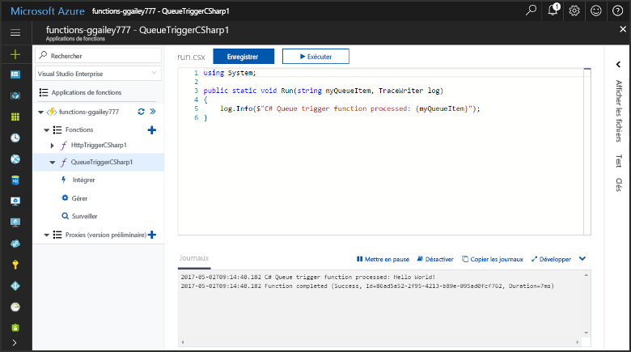
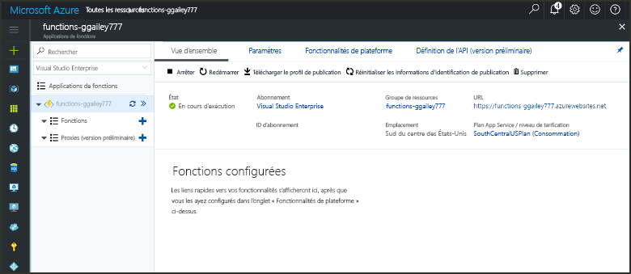
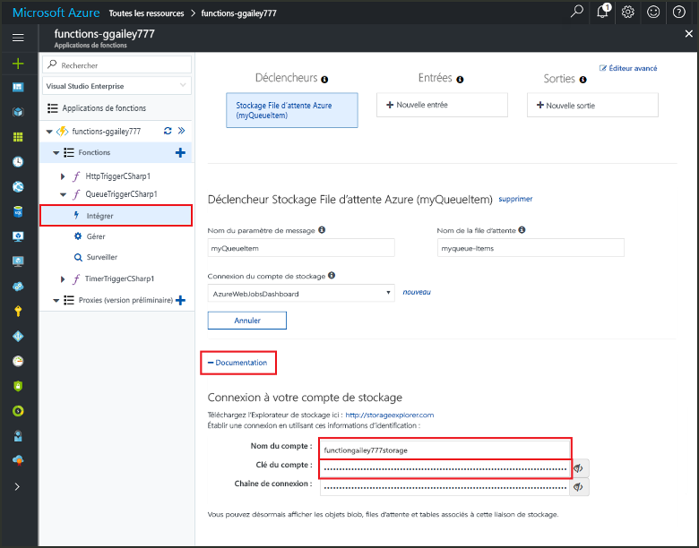
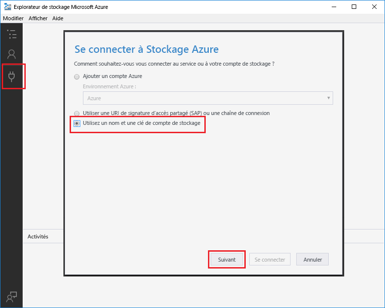
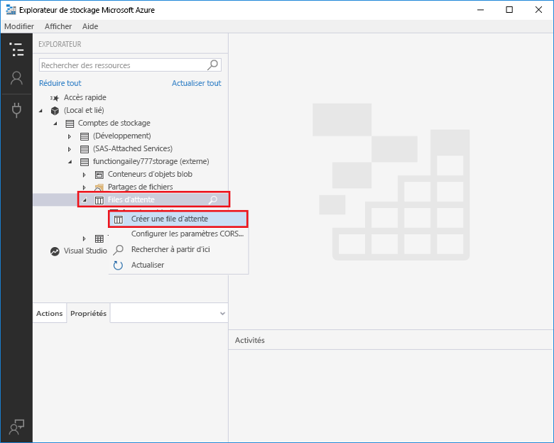
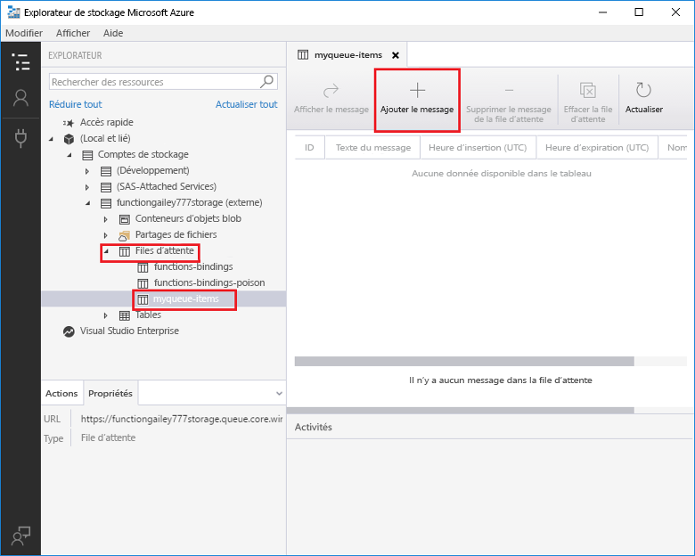
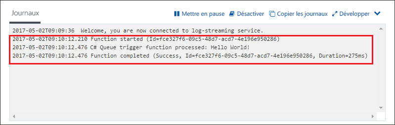

# Créer une fonction déclenchée par une file d’attente de stockage Azure

Découvrez comment toocreate une fonction déclenchée lorsque les messages sont soumis la file d’attente de stockage Azure tooan.

## Composants requis

- Téléchargez et installez hello [Microsoft Azure Storage Explorer](http://storageexplorer.com/).

- Un abonnement Azure. Si vous n’en avez pas, créez un [compte gratuit](https://azure.microsoft.com/free/?WT.mc_id=A261C142F) avant de commencer.

[!INCLUDE [functions-portal-favorite-function-apps](../../includes/functions-portal-favorite-function-apps.md)]

## Création d’une application Azure Function

[!INCLUDE [Create function app Azure portal](../../includes/functions-create-function-app-portal.md)]

Ensuite, créez une fonction dans hello une nouvelle application de fonction.

## Créer une fonction déclenchée par une file d’attente

1. Développez votre application de la fonction et cliquez sur hello  **+**  bouton ensuite trop**fonctions**. S’il s’agit de hello première fonction dans votre application de la fonction, sélectionnez **fonction personnalisée**. Cela affiche le jeu complet de hello des modèles de fonction.

    

2. Sélectionnez hello **QueueTrigger** modèle pour votre langue de votre choix, puis utiliser les paramètres comme spécifié dans la table de hello hello.

    
    
    | Paramètre | Valeur suggérée | Description |
    |---|---|---|
    | **Nom de la file d’attente**   | éléments myqueue    | Nom de hello file d’attente tooconnect tooin votre compte de stockage. |
    | **Connexion au compte de stockage** | AzureWebJobStorage | Vous pouvez utiliser la connexion au compte de stockage hello est déjà utilisée par votre application de la fonction, ou créez-en un.  |
    | **Nommer votre fonction** | Unique dans votre Function App | Nom de cette fonction déclenchée par la file d’attente. |

3. Cliquez sur **créer** toocreate votre fonction.

Ensuite, vous vous connectez compte de stockage Azure tooyour et que vous créez hello **myqueue-éléments** file d’attente de stockage.

## Créer la file d’attente hello

1. Dans votre fonction, cliquez sur **Intégrer**, développez **Documentation** et copiez le **Nom du compte** et la **Clé du compte**. Vous utilisez ces informations d’identification tooconnect toohello stockage compte. Si vous êtes déjà connecté votre compte de stockage, passez toostep 4.

    v

1. Exécutez hello [Microsoft Azure Storage Explorer](http://storageexplorer.com/) outil, cliquez sur hello icône à gauche de hello de connexion, choisissez **utiliser un nom de compte de stockage et de la clé**, puis cliquez sur **suivant**.

    

1. Entrez hello **nom de compte** et **clé de compte** à l’étape 1, cliquez sur **suivant** , puis **connexion**.

    

1. Développez le compte de stockage hello attaché, cliquez sur **les files d’attente**, cliquez sur **Create queue**, type `myqueue-items`, puis appuyez sur ENTRÉE.

    

Maintenant que vous avez une file d’attente de stockage, vous pouvez tester la fonction hello en ajoutant une file d’attente de message toohello.

## Fonction hello de test

1. Dans hello portail Azure, parcourir tooyour fonction développez hello **journaux** bas hello page de hello et assurez-vous que ce journal de diffusion en continu n’est pas suspendue.

1. Dans l’Explorateur de stockage, développez votre compte de stockage, **Files d’attente**, et **myqueue-items**, puis cliquez sur **Ajouter message**.

    

1. Saisissez le message « Hello World ! » dans **Texte du message** et cliquez sur **OK**.

1. Attendez quelques secondes, puis revenir en arrière tooyour fonction journaux et vérifiez que ce nouveau message de salutation a été lu à partir de la file d’attente hello.

    

1. Dans l’Explorateur de stockage, cliquez sur **Actualiser** et vérifiez que ce message de type hello a été traité et n’est plus dans la file d’attente hello.

## Supprimer des ressources

[!INCLUDE [Next steps note](../../includes/functions-quickstart-cleanup.md)]

## Étapes suivantes

Vous avez créé une fonction qui s’exécute lorsqu’un message est ajouté de file d’attente de stockage tooa.

[!INCLUDE [Next steps note](../../includes/functions-quickstart-next-steps.md)]

Pour en savoir plus sur les déclencheurs de stockage en file d’attente, consultez la page [Liaisons de file d’attente de stockage Azure Functions](functions-bindings-storage-queue.md).