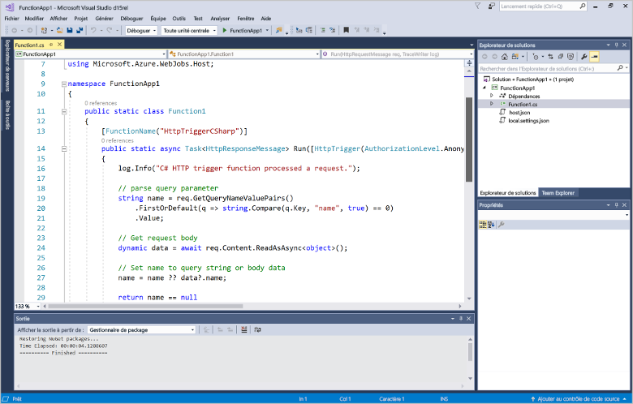
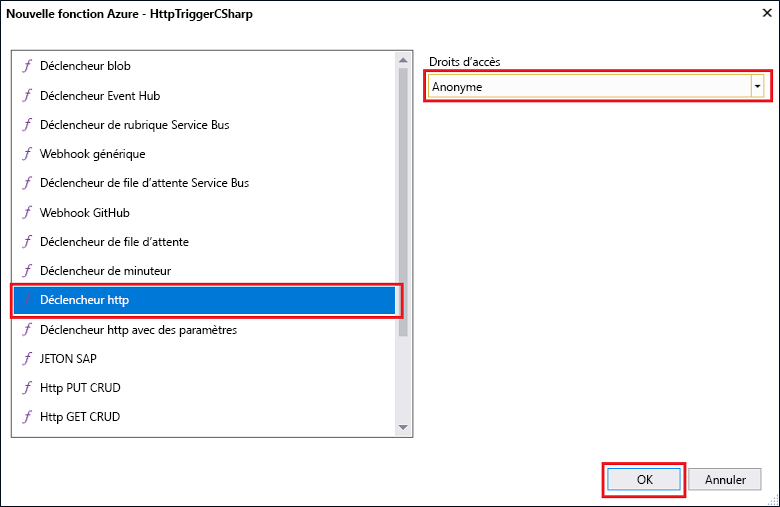

# Créer votre première fonction à l’aide de Visual StudioCreate your first function using Visual Studio

Les fonctions Azure vous permet d’exécuter votre code dans un environnement sans serveur sans avoir toofirst créer une machine virtuelle ou publier une application web.Azure Functions lets you execute your code in a serverless environment without having toofirst create a VM or publish a web application.

Dans cette rubrique, vous découvrez comment toouse hello tools de Visual Studio 2017 pour toocreate des fonctions d’Azure et tester localement une fonction de « hello world ».In this topic, you learn how toouse hello Visual Studio 2017 tools for Azure Functions toocreate and test a "hello world" function locally. Vous allez ensuite publier tooAzure de code de fonction hello.You will then publish hello function code tooAzure. Ces outils sont disponibles dans le cadre de la charge de travail de développement Azure dans Visual Studio 2017 version 15.3 hello, ou une version ultérieure.These tools are available as part of hello Azure development workload in Visual Studio 2017 version 15.3, or a later version.

## Composants requisPrerequisites

toocomplete ce didacticiel, installer :toocomplete this tutorial, install:

* [Visual Studio 2017 version 15.3](https://www.visualstudio.com/vs/preview/), y compris hello **le développement Azure** la charge de travail.[Visual Studio 2017 version 15.3](https://www.visualstudio.com/vs/preview/), including hello **Azure development** workload.

    
    
    >[!NOTE]  
    Une fois que vous installez ou mettez à niveau tooVisual Studio 2017 version 15.3, vous devrez peut-être outils de hello Visual Studio 2017 toomanually mises à jour pour les fonctions d’Azure.After you install or upgrade tooVisual Studio 2017 version 15.3, you might also need toomanually update hello Visual Studio 2017 tools for Azure Functions. Vous pouvez mettre à jour des outils hello hello **outils** menu sous **Extensions et mises à jour...**   >  **Mises à jour** > **Visual Studio Marketplace** > **outils des travaux Web et des fonctions Azure**  >  **Mise à jour**.You can update hello tools from hello **Tools** menu under **Extensions and Updates...** > **Updates** > **Visual Studio Marketplace** > **Azure Functions and Web Jobs Tools** > **Update**. 

[!INCLUDE [quickstarts-free-trial-note](../../includes/quickstarts-free-trial-note.md)] 

## Créer un projet Azure Functions dans Visual StudioCreate an Azure Functions project in Visual Studio

[!INCLUDE [Create a project using hello Azure Functions template](../../includes/functions-vstools-create.md)]

Maintenant que vous avez créé le projet de hello, vous pouvez créer votre première fonction.Now that you have created hello project, you can create your first function.

## Créer la fonction helloCreate hello function

1. Dans **l’Explorateur de solutions**, cliquez avec le bouton droit sur le nœud de projet et sélectionnez **Ajouter** > **Nouvel élément**.In **Solution Explorer**, right-click on your project node and select **Add** > **New Item**. Sélectionnez **Azure Function** et cliquez sur **Ajouter**.Select **Azure Function** and click **Add**.

2. Sélectionnez **HttpTrigger**, tapez un **nom de fonction**, sélectionnez **Anonyme** pour les **Droits d’accès**, puis cliquez sur **Créer**.Select **HttpTrigger**, type a **Function Name**, select **Anonymous** for **Access Rights**, and click **Create**. fonction Hello créée est accessible par une requête HTTP à partir de n’importe quel client.hello function created is accessed by an HTTP request from any client. 

    

    Un fichier de code est ajouté le projet tooyour qui contient une classe qui implémente votre code de fonction.A code file is added tooyour project that contains a class that implements your function code. Ce code est basé sur un modèle, qui reçoit une valeur de nom, puis la renvoie.This code is based on a template, which receives a name value and echos it back. Hello **FunctionName** attribut définit le nom hello de votre fonction.hello **FunctionName** attribute sets hello name of your function. Hello **HttpTrigger** attribut indique le message de type hello qui déclenche la fonction hello.hello **HttpTrigger** attribute indicates hello message that triggers hello function. 

    

Maintenant que vous avez créé une fonction HTTP déclenchée, vous pouvez la tester sur votre ordinateur local.Now that you have created an HTTP-triggered function, you can test it on your local computer.

## Tester la fonction hello localementTest hello function locally

Azure Functions Core Tools vous permet d’exécuter un projet Azure Functions sur votre ordinateur de développement local.Azure Functions Core Tools lets you run Azure Functions project on your local development computer. Vous êtes invité à tooinstall ces outils hello la première fois que vous démarrez une fonction à partir de Visual Studio.You are prompted tooinstall these tools hello first time you start a function from Visual Studio.  

1. tootest votre fonction, appuyez sur F5.tootest your function, press F5. Si vous y êtes invité, accepter la demande hello toodownload de Visual Studio et installez les outils de base des fonctions Azure (CLI).If prompted, accept hello request from Visual Studio toodownload and install Azure Functions Core (CLI) tools.  Vous devez également tooenable une exception de pare-feu afin que les outils hello peuvent traiter les requêtes HTTP.You may also need tooenable a firewall exception so that hello tools can handle HTTP requests.

2. Copier l’URL de votre fonction de l’exécution de fonctions d’Azure hello hello de sortie.Copy hello URL of your function from hello Azure Functions runtime output.  

    

3. Collez l’URL hello pour la requête HTTP de hello dans la barre d’adresse de votre navigateur.Paste hello URL for hello HTTP request into your browser's address bar. Ajouter la chaîne de requête hello `&name=<yourname>` toothis URL et l’exécution de la demande de hello.Append hello query string `&name=<yourname>` toothis URL and execute hello request. les Voici Hello réponse de hello dans hello navigateur toohello local une demande GET retournée par la fonction hello :hello following shows hello response in hello browser toohello local GET request returned by hello function: 

    

4. toostop de débogage, cliquez sur hello **arrêter** bouton de barre d’outils de Visual Studio hello.toostop debugging, click hello **Stop** button on hello Visual Studio toolbar.

Après avoir vérifié que la fonction hello s’exécute correctement sur votre ordinateur local, il est temps toopublish hello projet tooAzure.After you have verified that hello function runs correctly on your local computer, it's time toopublish hello project tooAzure.

## Publier hello projet tooAzurePublish hello project tooAzure

Vous devez disposer d’une application de fonction dans votre abonnement Azure avant de pouvoir publier votre projet.You must have a function app in your Azure subscription before you can publish your project. Vous pouvez créer une application de fonction directement à partir de Visual Studio.You can create a function app right from Visual Studio.

[!INCLUDE [Publish hello project tooAzure](../../includes/functions-vstools-publish.md)]

## Tester votre fonction dans AzureTest your function in Azure

1. URL de base hello copie de l’application de fonction hello à partir de la page de profil de publication hello.Copy hello base URL of hello function app from hello Publish profile page. Remplacez hello `localhost:port` partie de l’URL de hello utilisée lors du test de fonction hello localement avec la nouvelle URL de base hello.Replace hello `localhost:port` portion of hello URL you used when testing hello function locally with hello new base URL. Comme précédemment, vérifiez que chaîne de requête hello tooappend `&name=<yourname>` toothis URL et l’exécution de la demande de hello.As before, make sure tooappend hello query string `&name=<yourname>` toothis URL and execute hello request.

    URL de Hello qui appelle votre HTTP déclenchée présente de fonction comme suit :hello URL that calls your HTTP triggered function looks like this:

        http://<functionappname>.azurewebsites.net/api/<functionname>?name=<yourname> 

2. Collez cette nouvelle URL de demande de hello HTTP dans la barre d’adresse de votre navigateur.Paste this new URL for hello HTTP request into your browser's address bar. les Voici Hello réponse de hello dans hello navigateur toohello à distance une demande GET retourné par la fonction hello :hello following shows hello response in hello browser toohello remote GET request returned by hello function: 

    
 
## Étapes suivantesNext steps

Vous avez utilisé l’application de fonction toocreate C# de Visual Studio avec une fonction HTTP déclenchée simple.You have used Visual Studio toocreate a C# function app with a simple HTTP triggered function. 

+ toolearn comment tooconfigure toosupport de votre projet autres types de déclencheurs et les liaisons, consultez hello [projet hello de configurer pour le développement local](functions-develop-vs.md#configure-the-project-for-local-development) section [Azure fonctions Tools pour Visual Studio](functions-develop-vs.md).toolearn how tooconfigure your project toosupport other types of triggers and bindings, see hello [Configure hello project for local development](functions-develop-vs.md#configure-the-project-for-local-development) section in [Azure Functions Tools for Visual Studio](functions-develop-vs.md).
+ toolearn en savoir plus sur le test local et de débogage à l’aide des outils de base Azure fonctions hello, consultez [Code et test, les fonctions Azure localement](functions-run-local.md).toolearn more about local testing and debugging using hello Azure Functions Core Tools, see [Code and test Azure Functions locally](functions-run-local.md). 
+ toolearn plus sur le développement des fonctions en tant que bibliothèques de classes .NET, consultez [des bibliothèques de classes à l’aide de .NET avec des fonctions d’Azure](functions-dotnet-class-library.md).toolearn more about developing functions as .NET class libraries, see [Using .NET class libraries with Azure Functions](functions-dotnet-class-library.md). 

