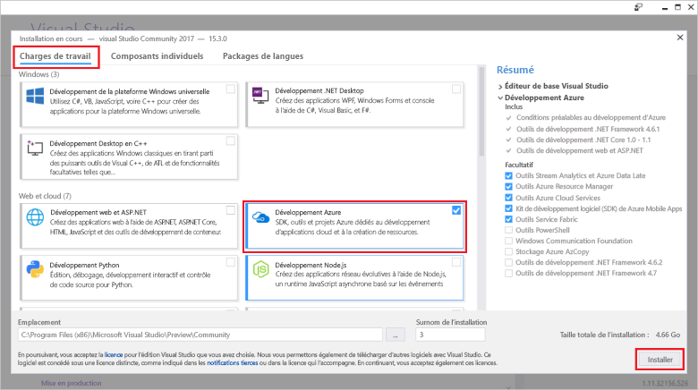

# <a name="azure-functions-tools-for-visual-studio"></a><span data-ttu-id="e02b2-103">Azure Functions Tools pour Visual Studio</span><span class="sxs-lookup"><span data-stu-id="e02b2-103">Azure Functions Tools for Visual Studio</span></span>  

<span data-ttu-id="e02b2-104">Outils de fonctions Azure pour Visual Studio 2017 est une extension pour Visual Studio qui vous permet de développer, tester et déployer des fonctions tooAzure de c#.</span><span class="sxs-lookup"><span data-stu-id="e02b2-104">Azure Functions Tools for Visual Studio 2017 is an extension for Visual Studio that lets you develop, test, and deploy C# functions tooAzure.</span></span> <span data-ttu-id="e02b2-105">S’il s’agit de votre première expérience avec les fonctions d’Azure, vous pouvez en savoir plus sur [un tooAzure introduction fonctions](functions-overview.md).</span><span class="sxs-lookup"><span data-stu-id="e02b2-105">If this is your first experience with Azure Functions, you can learn more at [An introduction tooAzure Functions](functions-overview.md).</span></span>

<span data-ttu-id="e02b2-106">Hello, fonctions de Windows Azure Tools fournit hello avantages suivants :</span><span class="sxs-lookup"><span data-stu-id="e02b2-106">hello Azure Functions Tools provides hello following benefits:</span></span> 

* <span data-ttu-id="e02b2-107">Modifier, générer et exécuter des fonctions sur votre ordinateur de développement local.</span><span class="sxs-lookup"><span data-stu-id="e02b2-107">Edit, build, and run functions on your local development computer.</span></span> 
* <span data-ttu-id="e02b2-108">Publier vos fonctions Azure projet directement tooAzure.</span><span class="sxs-lookup"><span data-stu-id="e02b2-108">Publish your Azure Functions project directly tooAzure.</span></span> 
* <span data-ttu-id="e02b2-109">Utiliser des liaisons de fonction toodeclare WebJobs attributs directement dans hello code c# au lieu de maintenir un function.json distinct pour les définitions de liaison.</span><span class="sxs-lookup"><span data-stu-id="e02b2-109">Use WebJobs attributes toodeclare function bindings directly in hello C# code instead of maintaining a separate function.json for binding definitions.</span></span>
* <span data-ttu-id="e02b2-110">Développer et déployer des fonctions précompilées C#.</span><span class="sxs-lookup"><span data-stu-id="e02b2-110">Develop and deploy pre-compiled C# functions.</span></span> <span data-ttu-id="e02b2-111">Les fonctions précompilées offrent de meilleures performances de démarrage à froid que les fonctions basées sur un script C#.</span><span class="sxs-lookup"><span data-stu-id="e02b2-111">Pre-complied functions provide a better cold-start performance than C# script-based functions.</span></span> 
* <span data-ttu-id="e02b2-112">Code de vos fonctions en c# bien que tous les avantages de hello de développement Visual Studio.</span><span class="sxs-lookup"><span data-stu-id="e02b2-112">Code your functions in C# while having all of hello benefits of Visual Studio development.</span></span> 

<span data-ttu-id="e02b2-113">Cette rubrique vous montre comment toouse hello fonctions de Windows Azure Tools pour Visual Studio 2017 toodevelop, vos fonctions en c#.</span><span class="sxs-lookup"><span data-stu-id="e02b2-113">This topic shows you how toouse hello Azure Functions Tools for Visual Studio 2017 toodevelop your functions in C#.</span></span> <span data-ttu-id="e02b2-114">Vous apprendrez également comment toopublish tooAzure de votre projet en tant qu’un assembly .NET.</span><span class="sxs-lookup"><span data-stu-id="e02b2-114">You also learn how toopublish your project tooAzure as a .NET assembly.</span></span>

## <a name="prerequisites"></a><span data-ttu-id="e02b2-115">Composants requis</span><span class="sxs-lookup"><span data-stu-id="e02b2-115">Prerequisites</span></span>

<span data-ttu-id="e02b2-116">Outils de fonctions Azure est inclus dans la charge de travail de développement Azure hello de [Visual Studio 2017 version 15.3](https://www.visualstudio.com/vs/), ou une version ultérieure.</span><span class="sxs-lookup"><span data-stu-id="e02b2-116">Azure Functions Tools is included in hello Azure development workload of [Visual Studio 2017 version 15.3](https://www.visualstudio.com/vs/), or a later version.</span></span> <span data-ttu-id="e02b2-117">Veillez à inclure hello **le développement Azure** la charge de travail dans votre installation de la version 15.3 Visual Studio 2017 :</span><span class="sxs-lookup"><span data-stu-id="e02b2-117">Make sure you include hello **Azure development** workload in your Visual Studio 2017 version 15.3 installation:</span></span>



<span data-ttu-id="e02b2-119">toocreate et déployer des fonctions, vous devez également :</span><span class="sxs-lookup"><span data-stu-id="e02b2-119">toocreate and deploy functions, you also need:</span></span>

* <span data-ttu-id="e02b2-120">Un abonnement Azure actif.</span><span class="sxs-lookup"><span data-stu-id="e02b2-120">An active Azure subscription.</span></span> <span data-ttu-id="e02b2-121">Si tel n’est pas le cas, des [comptes gratuits](https://azure.microsoft.com/free/?WT.mc_id=A261C142F) sont disponibles.</span><span class="sxs-lookup"><span data-stu-id="e02b2-121">If you don't have an Azure subscription, [free accounts](https://azure.microsoft.com/free/?WT.mc_id=A261C142F) are available.</span></span>

* <span data-ttu-id="e02b2-122">Un compte de stockage Azure.</span><span class="sxs-lookup"><span data-stu-id="e02b2-122">An Azure Storage account.</span></span> <span data-ttu-id="e02b2-123">toocreate un compte de stockage, consultez [créer un compte de stockage](../storage/common/storage-create-storage-account.md#create-a-storage-account).</span><span class="sxs-lookup"><span data-stu-id="e02b2-123">toocreate a storage account, see [Create a storage account](../storage/common/storage-create-storage-account.md#create-a-storage-account).</span></span>  
## <a name="create-an-azure-functions-project"></a><span data-ttu-id="e02b2-124">Créer un projet Azure Functions</span><span class="sxs-lookup"><span data-stu-id="e02b2-124">Create an Azure Functions project</span></span> 

[!INCLUDE [Create a project using hello Azure Functions](../../includes/functions-vstools-create.md)]


## <a name="configure-hello-project-for-local-development"></a><span data-ttu-id="e02b2-125">Configurer le projet hello pour le développement local</span><span class="sxs-lookup"><span data-stu-id="e02b2-125">Configure hello project for local development</span></span>

<span data-ttu-id="e02b2-126">Lorsque vous créez un nouveau projet à l’aide du modèle de fonctions de Azure hello, vous obtenez un projet c# vide qui contient les fichiers suivants de hello :</span><span class="sxs-lookup"><span data-stu-id="e02b2-126">When you create a new project using hello Azure Functions template, you get an empty C# project that contains hello following files:</span></span>

* <span data-ttu-id="e02b2-127">**Host.JSON**: permet de configurer hello hôte de fonctions.</span><span class="sxs-lookup"><span data-stu-id="e02b2-127">**host.json**: Lets you configure hello Functions host.</span></span> <span data-ttu-id="e02b2-128">Ces paramètres s’appliquent lors de l’exécution en local et dans Azure.</span><span class="sxs-lookup"><span data-stu-id="e02b2-128">These settings apply both when running locally and in Azure.</span></span> <span data-ttu-id="e02b2-129">Pour plus d’informations, consultez l’article de référence sur [host.json](https://github.com/Azure/azure-webjobs-sdk-script/wiki/host.json).</span><span class="sxs-lookup"><span data-stu-id="e02b2-129">For more information, see [host.json](https://github.com/Azure/azure-webjobs-sdk-script/wiki/host.json) reference article.</span></span>
    
* <span data-ttu-id="e02b2-130">**local.settings.json** : maintient les paramètres utilisés lors de l’exécution des fonction en local.</span><span class="sxs-lookup"><span data-stu-id="e02b2-130">**local.settings.json**: Maintains settings used when running functions locally.</span></span> <span data-ttu-id="e02b2-131">Ces paramètres ne sont pas utilisés par Azure, ils sont utilisés par hello [outils principaux de fonctions Azure](functions-run-local.md).</span><span class="sxs-lookup"><span data-stu-id="e02b2-131">These settings are not used by Azure, they are used by hello [Azure Functions Core Tools](functions-run-local.md).</span></span> <span data-ttu-id="e02b2-132">Utiliser ce fichier toospecify les paramètres, tels que des chaînes de connexion tooother Azure services.</span><span class="sxs-lookup"><span data-stu-id="e02b2-132">Use this file toospecify settings, such as connection strings tooother Azure services.</span></span> <span data-ttu-id="e02b2-133">Ajouter un nouveau toohello clé **valeurs** tableau pour chaque connexion requise par les fonctions dans votre projet.</span><span class="sxs-lookup"><span data-stu-id="e02b2-133">Add a new key toohello **Values** array for each connection required by functions in your project.</span></span> <span data-ttu-id="e02b2-134">Pour plus d’informations, consultez [fichier de paramètres locaux](functions-run-local.md#local-settings-file) dans la rubrique des outils principaux de fonctions Azure hello.</span><span class="sxs-lookup"><span data-stu-id="e02b2-134">For more information, see [Local settings file](functions-run-local.md#local-settings-file) in hello Azure Functions Core Tools topic.</span></span>

<span data-ttu-id="e02b2-135">exécution de fonctions Hello utilise un compte de stockage Azure en interne.</span><span class="sxs-lookup"><span data-stu-id="e02b2-135">hello Functions runtime uses an Azure Storage account internally.</span></span> <span data-ttu-id="e02b2-136">Pour tous les déclenchent des types autres que HTTP et de webhooks, vous devez le configurer hello **Values.AzureWebJobsStorage** la clé de chaîne de connexion de compte tooa valide le stockage Azure.</span><span class="sxs-lookup"><span data-stu-id="e02b2-136">For all trigger types other than HTTP and webhooks, you must set hello **Values.AzureWebJobsStorage** key tooa valid Azure Storage account connection string.</span></span>

[!INCLUDE [Note toonot use local storage](../../includes/functions-local-settings-note.md)]

 <span data-ttu-id="e02b2-137">chaîne de connexion de compte de stockage de hello de tooset :</span><span class="sxs-lookup"><span data-stu-id="e02b2-137">tooset hello storage account connection string:</span></span>

1. <span data-ttu-id="e02b2-138">Dans Visual Studio, ouvrez **Cloud Explorer**, développez **compte de stockage** > **votre compte de stockage**, puis sélectionnez **propriétés**et copie Bonjour **chaîne de connexion principal** valeur.</span><span class="sxs-lookup"><span data-stu-id="e02b2-138">In Visual Studio, open **Cloud Explorer**, expand **Storage Account** > **Your Storage Account**, then select **Properties** and copy hello **Primary Connection String** value.</span></span>   

2. <span data-ttu-id="e02b2-139">Dans votre projet, ouvrez le fichier de projet local.settings.json hello et hello valeur hello **AzureWebJobsStorage** la clé de chaîne de connexion toohello vous avez copié.</span><span class="sxs-lookup"><span data-stu-id="e02b2-139">In your project, open hello local.settings.json project file and set hello value of hello **AzureWebJobsStorage** key toohello connection string you copied.</span></span>

3. <span data-ttu-id="e02b2-140">Répétez hello précédente étape tooadd clés uniques toohello **valeurs** tableau de toutes les autres connexions requis par vos fonctions.</span><span class="sxs-lookup"><span data-stu-id="e02b2-140">Repeat hello previous step tooadd unique keys toohello **Values** array for any other connections required by your functions.</span></span>  

## <a name="create-a-function"></a><span data-ttu-id="e02b2-141">Créer une fonction</span><span class="sxs-lookup"><span data-stu-id="e02b2-141">Create a function</span></span>

<span data-ttu-id="e02b2-142">Dans les fonctions précompilées, les liaisons de hello utilisées par la fonction hello sont définis en appliquant des attributs dans le code hello.</span><span class="sxs-lookup"><span data-stu-id="e02b2-142">In pre-compiled functions, hello bindings used by hello function are defined by applying attributes in hello code.</span></span> <span data-ttu-id="e02b2-143">Lorsque vous utilisez toocreate des fonctions de Windows Azure Tools hello vos fonctions à partir de modèles de hello fourni, ces attributs sont appliqués pour vous.</span><span class="sxs-lookup"><span data-stu-id="e02b2-143">When you use hello Azure Functions Tools toocreate your functions from hello provided templates, these attributes are applied for you.</span></span> 

1. <span data-ttu-id="e02b2-144">Dans **l’Explorateur de solutions**, cliquez avec le bouton droit sur le nœud de projet et sélectionnez **Ajouter** > **Nouvel élément**.</span><span class="sxs-lookup"><span data-stu-id="e02b2-144">In **Solution Explorer**, right-click on your project node and select **Add** > **New Item**.</span></span> <span data-ttu-id="e02b2-145">Sélectionnez **Azure fonction**, tapez un **nom** classe hello, puis cliquez sur **ajouter**.</span><span class="sxs-lookup"><span data-stu-id="e02b2-145">Select **Azure Function**, type a **Name** for hello class, and click **Add**.</span></span>

2. <span data-ttu-id="e02b2-146">Choisissez votre déclencheur, définissez des propriétés de liaison hello, puis cliquez sur **créer**.</span><span class="sxs-lookup"><span data-stu-id="e02b2-146">Choose your trigger, set hello binding properties, and click **Create**.</span></span> <span data-ttu-id="e02b2-147">Hello suivant montre les paramètres hello au déclenchement de création d’un stockage de file d’attente (fonction).</span><span class="sxs-lookup"><span data-stu-id="e02b2-147">hello following example shows hello settings when creating a Queue storage triggered function.</span></span> 

    
    
    <span data-ttu-id="e02b2-148">Une clé de chaîne de connexion nommée **QueueStorage** est fourni, qui est défini dans le fichier de local.settings.json hello.</span><span class="sxs-lookup"><span data-stu-id="e02b2-148">A connection string key named **QueueStorage** is supplied, which is defined in hello local.settings.json file.</span></span> 
 
3. <span data-ttu-id="e02b2-149">Examinez hello récemment ajouté la classe.</span><span class="sxs-lookup"><span data-stu-id="e02b2-149">Examine hello newly added class.</span></span> <span data-ttu-id="e02b2-150">Vous consultez statique **exécuter** (méthode), qui est attribuée à hello **FunctionName** attribut.</span><span class="sxs-lookup"><span data-stu-id="e02b2-150">You see a static **Run** method, that is attributed with hello **FunctionName** attribute.</span></span> <span data-ttu-id="e02b2-151">Cet attribut indique que méthode hello est le point d’entrée hello pour la fonction hello.</span><span class="sxs-lookup"><span data-stu-id="e02b2-151">This attribute indicates that hello method is hello entry point for hello function.</span></span> 

    <span data-ttu-id="e02b2-152">Par exemple, hello suivant classe c# représente une fonction de stockage déclenchée base file d’attente :</span><span class="sxs-lookup"><span data-stu-id="e02b2-152">For example, hello following C# class represents a basic Queue storage triggered function:</span></span>

    ````csharp
    using System;
    using Microsoft.Azure.WebJobs;
    using Microsoft.Azure.WebJobs.Host;
    
    namespace FunctionApp1
    {
        public static class Function1
        {
            [FunctionName("QueueTriggerCSharp")]        
            public static void Run([QueueTrigger("myqueue-items", Connection = "QueueStorage")]string myQueueItem, TraceWriter log)
            {
                log.Info($"C# Queue trigger function processed: {myQueueItem}");
            }
        }
    } 
    ````
 
    <span data-ttu-id="e02b2-153">Un attribut spécifique à la liaison est la méthode de point d’entrée toohello tooeach appliqué liaison paramètre fourni.</span><span class="sxs-lookup"><span data-stu-id="e02b2-153">A binding-specific attribute is applied tooeach binding parameter supplied toohello entry point method.</span></span> <span data-ttu-id="e02b2-154">l’attribut Hello accepte les informations de liaison hello en tant que paramètres.</span><span class="sxs-lookup"><span data-stu-id="e02b2-154">hello attribute takes hello binding information as parameters.</span></span> <span data-ttu-id="e02b2-155">Dans l’exemple précédent de hello, hello premier paramètre a une **QueueTrigger** attribut appliqué, qui indique la fonction de la file d’attente déclenchée.</span><span class="sxs-lookup"><span data-stu-id="e02b2-155">In hello previous example, hello first parameter has a **QueueTrigger** attribute applied, indicating queue triggered function.</span></span> <span data-ttu-id="e02b2-156">nom de file d’attente Hello et le nom de paramètre de chaîne de connexion sont passés comme paramètres.</span><span class="sxs-lookup"><span data-stu-id="e02b2-156">hello queue name and connection string setting name are passed as parameters.</span></span>  

## <a name="testing-functions"></a><span data-ttu-id="e02b2-157">Tester les fonctions</span><span class="sxs-lookup"><span data-stu-id="e02b2-157">Testing functions</span></span>

<span data-ttu-id="e02b2-158">Azure Functions Core Tools vous permet d’exécuter un projet Azure Functions sur votre ordinateur de développement local.</span><span class="sxs-lookup"><span data-stu-id="e02b2-158">Azure Functions Core Tools lets you run Azure Functions project on your local development computer.</span></span> <span data-ttu-id="e02b2-159">Vous êtes invité à tooinstall ces outils hello la première fois que vous démarrez une fonction à partir de Visual Studio.</span><span class="sxs-lookup"><span data-stu-id="e02b2-159">You are prompted tooinstall these tools hello first time you start a function from Visual Studio.</span></span>  

<span data-ttu-id="e02b2-160">tootest votre fonction, appuyez sur F5.</span><span class="sxs-lookup"><span data-stu-id="e02b2-160">tootest your function, press F5.</span></span> <span data-ttu-id="e02b2-161">Si vous y êtes invité, accepter la demande hello toodownload de Visual Studio et installez les outils de base des fonctions Azure (CLI).</span><span class="sxs-lookup"><span data-stu-id="e02b2-161">If prompted, accept hello request from Visual Studio toodownload and install Azure Functions Core (CLI) tools.</span></span>  <span data-ttu-id="e02b2-162">Vous devez également tooenable une exception de pare-feu afin que les outils hello peuvent traiter les requêtes HTTP.</span><span class="sxs-lookup"><span data-stu-id="e02b2-162">You may also need tooenable a firewall exception so that hello tools can handle HTTP requests.</span></span>

<span data-ttu-id="e02b2-163">Projet hello en cours d’exécution, vous pouvez tester votre code que vous pouvez tester la fonction déployée.</span><span class="sxs-lookup"><span data-stu-id="e02b2-163">With hello project running, you can test your code as you would test deployed function.</span></span> <span data-ttu-id="e02b2-164">Pour plus d’informations, consultez [Stratégies permettant de tester votre code dans Azure Functions](functions-test-a-function.md).</span><span class="sxs-lookup"><span data-stu-id="e02b2-164">For more information, see [Strategies for testing your code in Azure Functions](functions-test-a-function.md).</span></span> <span data-ttu-id="e02b2-165">Lors de l’exécution en mode débogage, les points d’arrêt sont atteints dans Visual Studio comme prévu.</span><span class="sxs-lookup"><span data-stu-id="e02b2-165">When running in debug mode, breakpoints are hit in Visual Studio as expected.</span></span> 

<span data-ttu-id="e02b2-166">Pour obtenir un exemple de la façon dont une file d’attente de tootest déclenché (fonction), consultez hello [didacticiel de démarrage rapide de file d’attente déclenchée fonction](functions-create-storage-queue-triggered-function.md#test-the-function).</span><span class="sxs-lookup"><span data-stu-id="e02b2-166">For an example of how tootest a queue triggered function, see hello [queue triggered function quickstart tutorial](functions-create-storage-queue-triggered-function.md#test-the-function).</span></span>  

<span data-ttu-id="e02b2-167">toolearn savoir plus sur l’utilisation des outils de base fonctions hello Azure, consultez [Code et tester des fonctions Azure localement](functions-run-local.md).</span><span class="sxs-lookup"><span data-stu-id="e02b2-167">toolearn more about using hello Azure Functions Core Tools, see [Code and test Azure functions locally](functions-run-local.md).</span></span>

## <a name="publish-tooazure"></a><span data-ttu-id="e02b2-168">Publication tooAzure</span><span class="sxs-lookup"><span data-stu-id="e02b2-168">Publish tooAzure</span></span>

[!INCLUDE [Publish hello project tooAzure](../../includes/functions-vstools-publish.md)]

>[!NOTE]  
><span data-ttu-id="e02b2-169">Tous les paramètres que vous avez ajoutée dans hello local.settings.json doivent être également ajoutés toohello fonction application dans Azure.</span><span class="sxs-lookup"><span data-stu-id="e02b2-169">Any settings you added in hello local.settings.json must be also added toohello function app in Azure.</span></span> <span data-ttu-id="e02b2-170">Ces paramètres ne sont pas ajoutés automatiquement.</span><span class="sxs-lookup"><span data-stu-id="e02b2-170">These settings are not added automatically.</span></span> <span data-ttu-id="e02b2-171">Vous pouvez ajouter des paramètres requis tooyour fonction application dans une des manières suivantes :</span><span class="sxs-lookup"><span data-stu-id="e02b2-171">You can add required settings tooyour function app in one of these ways:</span></span>
>
>* <span data-ttu-id="e02b2-172">[À l’aide de hello Azure portal](functions-how-to-use-azure-function-app-settings.md#settings).</span><span class="sxs-lookup"><span data-stu-id="e02b2-172">[Using hello Azure portal](functions-how-to-use-azure-function-app-settings.md#settings).</span></span>
>* <span data-ttu-id="e02b2-173">[À l’aide de hello `--publish-local-settings` option Bonjour Azure fonctions principaux outils de publication](functions-run-local.md#publish).</span><span class="sxs-lookup"><span data-stu-id="e02b2-173">[Using hello `--publish-local-settings` publish option in hello Azure Functions Core Tools](functions-run-local.md#publish).</span></span>
>* <span data-ttu-id="e02b2-174">[À l’aide de hello CLI d’Azure](/cli/azure/functionapp/config/appsettings#set).</span><span class="sxs-lookup"><span data-stu-id="e02b2-174">[Using hello Azure CLI](/cli/azure/functionapp/config/appsettings#set).</span></span> 

## <a name="next-steps"></a><span data-ttu-id="e02b2-175">Étapes suivantes</span><span class="sxs-lookup"><span data-stu-id="e02b2-175">Next steps</span></span>

<span data-ttu-id="e02b2-176">Pour plus d’informations sur les fonctions de Windows Azure Tools, consultez hello section commun de Questions de hello [Visual Studio 2017 Tools pour les fonctions Azure](https://blogs.msdn.microsoft.com/webdev/2017/05/10/azure-function-tools-for-visual-studio-2017/) billet de blog.</span><span class="sxs-lookup"><span data-stu-id="e02b2-176">For more information about Azure Functions Tools, see hello Common Questions section of hello [Visual Studio 2017 Tools for Azure Functions](https://blogs.msdn.microsoft.com/webdev/2017/05/10/azure-function-tools-for-visual-studio-2017/) blog post.</span></span>

<span data-ttu-id="e02b2-177">toolearn en savoir plus sur les fonctions principaux outils hello Azure, consultez [Code et tester des fonctions Azure localement](functions-run-local.md).</span><span class="sxs-lookup"><span data-stu-id="e02b2-177">toolearn more about hello Azure Functions Core Tools, see [Code and test Azure functions locally](functions-run-local.md).</span></span>  
<span data-ttu-id="e02b2-178">toolearn plus sur le développement des fonctions en tant que bibliothèques de classes .NET, consultez [des bibliothèques de classes à l’aide de .NET avec des fonctions d’Azure](functions-dotnet-class-library.md).</span><span class="sxs-lookup"><span data-stu-id="e02b2-178">toolearn more about developing functions as .NET class libraries, see [Using .NET class libraries with Azure Functions](functions-dotnet-class-library.md).</span></span> <span data-ttu-id="e02b2-179">Cette rubrique fournit également des exemples de comment toouse attributs toodeclare hello différents types de liaisons prises en charge par les fonctions d’Azure.</span><span class="sxs-lookup"><span data-stu-id="e02b2-179">This topic also provides examples of how toouse attributes toodeclare hello various types of bindings supported by Azure Functions.</span></span>    
