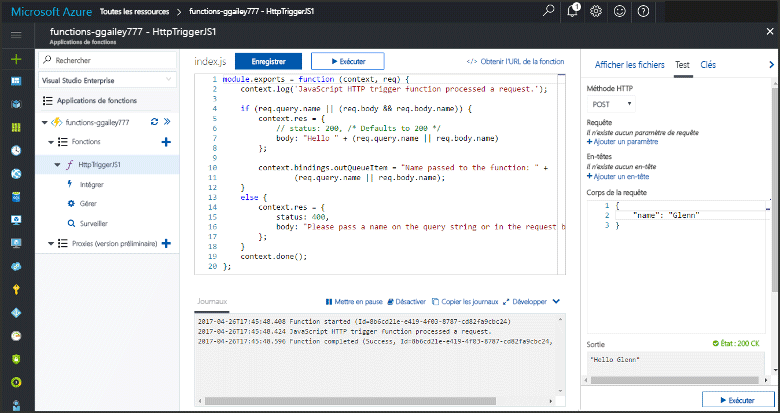
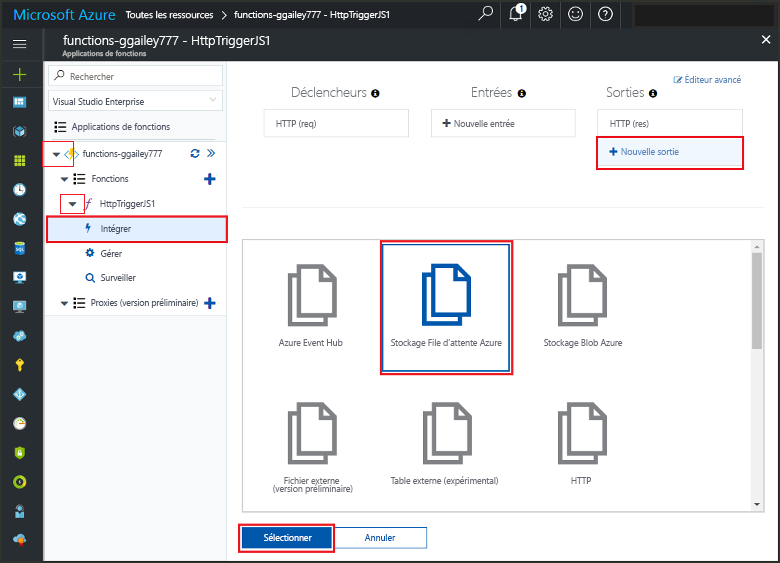
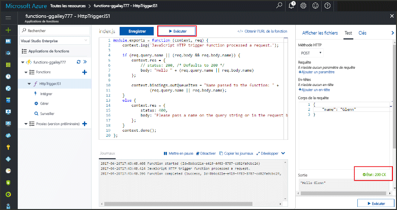
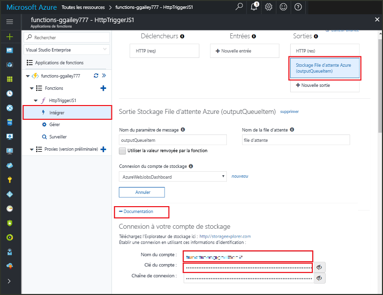

# <a name="add-messages-tooan-azure-storage-queue-using-functions"></a>Ajouter la file d’attente de messages tooan stockage Azure à l’aide de fonctions

Dans les fonctions d’Azure, les liaisons d’entrée et de sortie fournissent une données de service de façon déclarative tooconnect tooexternal à partir de votre fonction. Dans cette rubrique, découvrez comment tooupdate une fonction existante en ajoutant une sortie de liaison qui envoie des messages stockage de file d’attente tooAzure.  



## <a name="prerequisites"></a>Composants requis 

[!INCLUDE [Previous topics](../../includes/functions-quickstart-previous-topics.md)]

* Installer hello [Microsoft Azure Storage Explorer](http://storageexplorer.com/).

## <a name="add-binding"></a>Ajoutez une liaison de sortie
 
1. Développez à la fois votre application de fonction et votre fonction.

2. Cliquez sur **Intégrer** et **+ Nouvelle sortie**, puis choisissez **Stockage File d’attente Azure** et **Sélectionner**.
    
    

3. Utiliser les paramètres de hello comme spécifié dans la table de hello : 

    

    | Paramètre      |  Valeur suggérée   | Description                              |
    | ------------ |  ------- | -------------------------------------------------- |
    | **Nom de la file d’attente**   | éléments myqueue    | nom Hello Hello file d’attente tooconnect tooin votre compte de stockage. |
    | **Connexion au compte de stockage** | AzureWebJobStorage | Vous pouvez utiliser la connexion au compte de stockage hello est déjà utilisée par votre application de la fonction, ou créez-en un.  |
    | **Nom de message de paramètre** | outputQueueItem | nom Hello hello liaison de paramètre de sortie. | 

4. Cliquez sur **enregistrer** liaison de hello tooadd.
 
Maintenant que vous avez définie une liaison de sortie, vous devez tooupdate hello code toouse hello liaison tooadd messages tooa file d’attente.  

## <a name="update-hello-function-code"></a>Mettre à jour le code de la fonction hello

1. Sélectionnez votre code de fonction hello fonction toodisplay dans l’éditeur de hello. 

2. Pour une fonction c#, mise à jour de votre définition de fonction comme suit tooadd hello **outputQueueItem** paramètre de liaison de stockage. Ignorez cette étape pour une fonction JavaScript.

    ```cs   
    public static async Task<HttpResponseMessage> Run(HttpRequestMessage req, 
        ICollector<string> outputQueueItem, TraceWriter log)
    {
        ....
    }
    ```

3. Ajoutez hello suivant fonction toohello de code juste avant le retour de méthode hello. Utilisez hello approprié extrait de code pour la langue hello de votre fonction.

    ```javascript
    context.bindings.outputQueueItem = "Name passed toohello function: " + 
                (req.query.name || req.body.name);
    ```

    ```cs
    outputQueueItem.Add("Name passed toohello function: " + name);     
    ```

4. Sélectionnez **enregistrer** toosave modifications.

valeur de Hello passé le déclencheur HTTP toohello est incluse dans une file d’attente de message toohello ajouté.
 
## <a name="test-hello-function"></a>Fonction hello de test 

1. Après avoir enregistrement les modifications de code hello, sélectionnez **exécuter**. 

    

2. Vérifiez toomake de journaux hello assurer que la fonction hello a réussi. Une nouvelle file d’attente nommée **outqueue** est créé dans votre compte de stockage par hello fonctions runtime lors de la liaison de sortie hello est utilisée pour la première fois.

Ensuite, vous pouvez vous connecter tooyour stockage compte tooverify hello nouvelle file d’attente et vous avez ajouté tooit message de type hello. 

## <a name="connect-toohello-queue"></a>Se connecter à la file d’attente de toohello

Skip hello trois premières étapes si vous avez déjà installé l’Explorateur de stockage et le compte de stockage tooyour elle est connectée.    

1. Dans votre fonction, choisissez **intégrer** et hello nouvelle **stockage de file d’attente Azure** liaison de sortie, puis développez **Documentation**. Copiez le **Nom de compte** et la **Clé de compte**. Vous utilisez ces informations d’identification tooconnect toohello stockage compte.
 
    

2. Exécutez hello [Microsoft Azure Storage Explorer](http://storageexplorer.com/) outil, sélectionnez hello icône à gauche de hello de connexion, choisissez **utiliser un nom de compte de stockage et de la clé**, puis sélectionnez **suivant**.

    
    
3. Hello de coller **nom de compte** et **clé de compte** à l’étape 1 dans les champs correspondants, puis sélectionnez **suivant**, et **connexion**. 
  
    

4. Développez le compte de stockage hello attaché, **les files d’attente** et vérifiez qu’une file d’attente appelé **myqueue-éléments** existe. Vous devez également voir un message déjà dans la file d’attente hello.  
 
    
 

## <a name="clean-up-resources"></a>Supprimer des ressources

[!INCLUDE [Next steps note](../../includes/functions-quickstart-cleanup.md)]

## <a name="next-steps"></a>Étapes suivantes

Vous avez ajouté une fonction existante de tooan de liaison de sortie. 

[!INCLUDE [Next steps note](../../includes/functions-quickstart-next-steps.md)]

Pour plus d’informations sur le stockage de tooQueue de liaison, consultez [liaisons de file d’attente de stockage de fonctions Azure](functions-bindings-storage-queue.md). 


