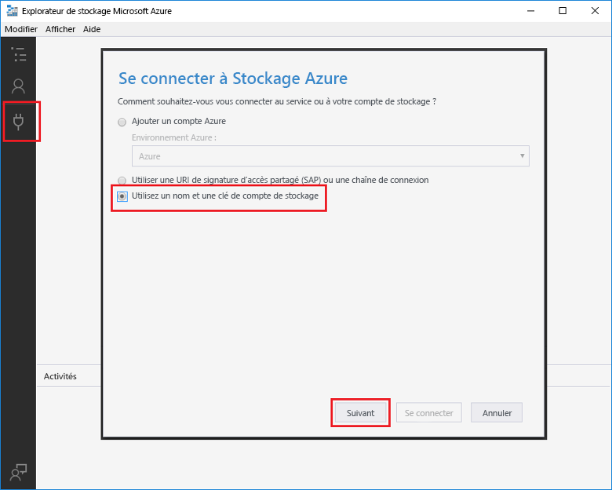

# <a name="add-messages-tooan-azure-storage-queue-using-functions"></a><span data-ttu-id="57ec6-103">Ajouter la file d’attente de messages tooan stockage Azure à l’aide de fonctions</span><span class="sxs-lookup"><span data-stu-id="57ec6-103">Add messages tooan Azure Storage queue using Functions</span></span>

<span data-ttu-id="57ec6-104">Dans les fonctions d’Azure, les liaisons d’entrée et de sortie fournissent une données de service de façon déclarative tooconnect tooexternal à partir de votre fonction.</span><span class="sxs-lookup"><span data-stu-id="57ec6-104">In Azure Functions, input and output bindings provide a declarative way tooconnect tooexternal service data from your function.</span></span> <span data-ttu-id="57ec6-105">Dans cette rubrique, découvrez comment tooupdate une fonction existante en ajoutant une sortie de liaison qui envoie des messages stockage de file d’attente tooAzure.</span><span class="sxs-lookup"><span data-stu-id="57ec6-105">In this topic, learn how tooupdate an existing function by adding an output binding that sends messages tooAzure Queue storage.</span></span>  


## <a name="prerequisites"></a><span data-ttu-id="57ec6-107">Composants requis</span><span class="sxs-lookup"><span data-stu-id="57ec6-107">Prerequisites</span></span> 

[!INCLUDE [Previous topics](../../includes/functions-quickstart-previous-topics.md)]

* <span data-ttu-id="57ec6-108">Installer hello [Microsoft Azure Storage Explorer](http://storageexplorer.com/).</span><span class="sxs-lookup"><span data-stu-id="57ec6-108">Install hello [Microsoft Azure Storage Explorer](http://storageexplorer.com/).</span></span>

## <span data-ttu-id="57ec6-109"><a name="add-binding"></a>Ajoutez une liaison de sortie</span><span class="sxs-lookup"><span data-stu-id="57ec6-109"><a name="add-binding"></a>Add an output binding</span></span>
 
1. <span data-ttu-id="57ec6-110">Développez à la fois votre application de fonction et votre fonction.</span><span class="sxs-lookup"><span data-stu-id="57ec6-110">Expand both your function app and your function.</span></span>

2. <span data-ttu-id="57ec6-111">Cliquez sur **Intégrer** et **+ Nouvelle sortie**, puis choisissez **Stockage File d’attente Azure** et **Sélectionner**.</span><span class="sxs-lookup"><span data-stu-id="57ec6-111">Select **Integrate** and **+ New output**, then choose **Azure Queue storage** and choose **Select**.</span></span>
    
    

3. <span data-ttu-id="57ec6-113">Utiliser les paramètres de hello comme spécifié dans la table de hello :</span><span class="sxs-lookup"><span data-stu-id="57ec6-113">Use hello settings as specified in hello table:</span></span> 

    

    | <span data-ttu-id="57ec6-115">Paramètre</span><span class="sxs-lookup"><span data-stu-id="57ec6-115">Setting</span></span>      |  <span data-ttu-id="57ec6-116">Valeur suggérée</span><span class="sxs-lookup"><span data-stu-id="57ec6-116">Suggested value</span></span>   | <span data-ttu-id="57ec6-117">Description</span><span class="sxs-lookup"><span data-stu-id="57ec6-117">Description</span></span>                              |
    | ------------ |  ------- | -------------------------------------------------- |
    | <span data-ttu-id="57ec6-118">**Nom de la file d’attente**</span><span class="sxs-lookup"><span data-stu-id="57ec6-118">**Queue name**</span></span>   | <span data-ttu-id="57ec6-119">éléments myqueue</span><span class="sxs-lookup"><span data-stu-id="57ec6-119">myqueue-items</span></span>    | <span data-ttu-id="57ec6-120">nom Hello Hello file d’attente tooconnect tooin votre compte de stockage.</span><span class="sxs-lookup"><span data-stu-id="57ec6-120">hello name of hello queue tooconnect tooin your Storage account.</span></span> |
    | <span data-ttu-id="57ec6-121">**Connexion au compte de stockage**</span><span class="sxs-lookup"><span data-stu-id="57ec6-121">**Storage account connection**</span></span> | <span data-ttu-id="57ec6-122">AzureWebJobStorage</span><span class="sxs-lookup"><span data-stu-id="57ec6-122">AzureWebJobStorage</span></span> | <span data-ttu-id="57ec6-123">Vous pouvez utiliser la connexion au compte de stockage hello est déjà utilisée par votre application de la fonction, ou créez-en un.</span><span class="sxs-lookup"><span data-stu-id="57ec6-123">You can use hello storage account connection already being used by your function app, or create a new one.</span></span>  |
    | <span data-ttu-id="57ec6-124">**Nom de message de paramètre**</span><span class="sxs-lookup"><span data-stu-id="57ec6-124">**Message parameter name**</span></span> | <span data-ttu-id="57ec6-125">outputQueueItem</span><span class="sxs-lookup"><span data-stu-id="57ec6-125">outputQueueItem</span></span> | <span data-ttu-id="57ec6-126">nom Hello hello liaison de paramètre de sortie.</span><span class="sxs-lookup"><span data-stu-id="57ec6-126">hello name of hello output binding parameter.</span></span> | 

4. <span data-ttu-id="57ec6-127">Cliquez sur **enregistrer** liaison de hello tooadd.</span><span class="sxs-lookup"><span data-stu-id="57ec6-127">Click **Save** tooadd hello binding.</span></span>
 
<span data-ttu-id="57ec6-128">Maintenant que vous avez définie une liaison de sortie, vous devez tooupdate hello code toouse hello liaison tooadd messages tooa file d’attente.</span><span class="sxs-lookup"><span data-stu-id="57ec6-128">Now that you have an output binding defined, you need tooupdate hello code toouse hello binding tooadd messages tooa queue.</span></span>  

## <a name="update-hello-function-code"></a><span data-ttu-id="57ec6-129">Mettre à jour le code de la fonction hello</span><span class="sxs-lookup"><span data-stu-id="57ec6-129">Update hello function code</span></span>

1. <span data-ttu-id="57ec6-130">Sélectionnez votre code de fonction hello fonction toodisplay dans l’éditeur de hello.</span><span class="sxs-lookup"><span data-stu-id="57ec6-130">Select your function toodisplay hello function code in hello editor.</span></span> 

2. <span data-ttu-id="57ec6-131">Pour une fonction c#, mise à jour de votre définition de fonction comme suit tooadd hello **outputQueueItem** paramètre de liaison de stockage.</span><span class="sxs-lookup"><span data-stu-id="57ec6-131">For a C# function, update your function definition as follows tooadd hello **outputQueueItem** storage binding parameter.</span></span> <span data-ttu-id="57ec6-132">Ignorez cette étape pour une fonction JavaScript.</span><span class="sxs-lookup"><span data-stu-id="57ec6-132">Skip this step for a JavaScript function.</span></span>

    ```cs   
    public static async Task<HttpResponseMessage> Run(HttpRequestMessage req, 
        ICollector<string> outputQueueItem, TraceWriter log)
    {
        ....
    }
    ```

3. <span data-ttu-id="57ec6-133">Ajoutez hello suivant fonction toohello de code juste avant le retour de méthode hello.</span><span class="sxs-lookup"><span data-stu-id="57ec6-133">Add hello following code toohello function just before hello method returns.</span></span> <span data-ttu-id="57ec6-134">Utilisez hello approprié extrait de code pour la langue hello de votre fonction.</span><span class="sxs-lookup"><span data-stu-id="57ec6-134">Use hello appropriate snippet for hello language of your function.</span></span>

    ```javascript
    context.bindings.outputQueueItem = "Name passed toohello function: " + 
                (req.query.name || req.body.name);
    ```

    ```cs
    outputQueueItem.Add("Name passed toohello function: " + name);     
    ```

4. <span data-ttu-id="57ec6-135">Sélectionnez **enregistrer** toosave modifications.</span><span class="sxs-lookup"><span data-stu-id="57ec6-135">Select **Save** toosave changes.</span></span>

<span data-ttu-id="57ec6-136">valeur de Hello passé le déclencheur HTTP toohello est incluse dans une file d’attente de message toohello ajouté.</span><span class="sxs-lookup"><span data-stu-id="57ec6-136">hello value passed toohello HTTP trigger is included in a message added toohello queue.</span></span>
 
## <a name="test-hello-function"></a><span data-ttu-id="57ec6-137">Fonction hello de test</span><span class="sxs-lookup"><span data-stu-id="57ec6-137">Test hello function</span></span> 

1. <span data-ttu-id="57ec6-138">Après avoir enregistrement les modifications de code hello, sélectionnez **exécuter**.</span><span class="sxs-lookup"><span data-stu-id="57ec6-138">After hello code changes are saved, select **Run**.</span></span> 

    

2. <span data-ttu-id="57ec6-140">Vérifiez toomake de journaux hello assurer que la fonction hello a réussi.</span><span class="sxs-lookup"><span data-stu-id="57ec6-140">Check hello logs toomake sure that hello function succeeded.</span></span> <span data-ttu-id="57ec6-141">Une nouvelle file d’attente nommée **outqueue** est créé dans votre compte de stockage par hello fonctions runtime lors de la liaison de sortie hello est utilisée pour la première fois.</span><span class="sxs-lookup"><span data-stu-id="57ec6-141">A new queue named **outqueue** is created in your Storage account by hello Functions runtime when hello output binding is first used.</span></span>

<span data-ttu-id="57ec6-142">Ensuite, vous pouvez vous connecter tooyour stockage compte tooverify hello nouvelle file d’attente et vous avez ajouté tooit message de type hello.</span><span class="sxs-lookup"><span data-stu-id="57ec6-142">Next, you can connect tooyour storage account tooverify hello new queue and hello message you added tooit.</span></span> 

## <a name="connect-toohello-queue"></a><span data-ttu-id="57ec6-143">Se connecter à la file d’attente de toohello</span><span class="sxs-lookup"><span data-stu-id="57ec6-143">Connect toohello queue</span></span>

<span data-ttu-id="57ec6-144">Skip hello trois premières étapes si vous avez déjà installé l’Explorateur de stockage et le compte de stockage tooyour elle est connectée.</span><span class="sxs-lookup"><span data-stu-id="57ec6-144">Skip hello first three steps if you have already installed Storage Explorer and connected it tooyour storage account.</span></span>    

1. <span data-ttu-id="57ec6-145">Dans votre fonction, choisissez **intégrer** et hello nouvelle **stockage de file d’attente Azure** liaison de sortie, puis développez **Documentation**.</span><span class="sxs-lookup"><span data-stu-id="57ec6-145">In your function, choose **Integrate** and hello new **Azure Queue storage** output binding, then expand **Documentation**.</span></span> <span data-ttu-id="57ec6-146">Copiez le **Nom de compte** et la **Clé de compte**.</span><span class="sxs-lookup"><span data-stu-id="57ec6-146">Copy both **Account name** and **Account key**.</span></span> <span data-ttu-id="57ec6-147">Vous utilisez ces informations d’identification tooconnect toohello stockage compte.</span><span class="sxs-lookup"><span data-stu-id="57ec6-147">You use these credentials tooconnect toohello storage account.</span></span>
 
    

2. <span data-ttu-id="57ec6-149">Exécutez hello [Microsoft Azure Storage Explorer](http://storageexplorer.com/) outil, sélectionnez hello icône à gauche de hello de connexion, choisissez **utiliser un nom de compte de stockage et de la clé**, puis sélectionnez **suivant**.</span><span class="sxs-lookup"><span data-stu-id="57ec6-149">Run hello [Microsoft Azure Storage Explorer](http://storageexplorer.com/) tool, select hello connect icon on hello left, choose **Use a storage account name and key**, and select **Next**.</span></span>

    
    
3. <span data-ttu-id="57ec6-151">Hello de coller **nom de compte** et **clé de compte** à l’étape 1 dans les champs correspondants, puis sélectionnez **suivant**, et **connexion**.</span><span class="sxs-lookup"><span data-stu-id="57ec6-151">Paste hello **Account name** and **Account key** from step 1 into their corresponding fields, then select **Next**, and **Connect**.</span></span> 
  
    

4. <span data-ttu-id="57ec6-153">Développez le compte de stockage hello attaché, **les files d’attente** et vérifiez qu’une file d’attente appelé **myqueue-éléments** existe.</span><span class="sxs-lookup"><span data-stu-id="57ec6-153">Expand hello attached storage account, expand **Queues** and verify that a queue named **myqueue-items** exists.</span></span> <span data-ttu-id="57ec6-154">Vous devez également voir un message déjà dans la file d’attente hello.</span><span class="sxs-lookup"><span data-stu-id="57ec6-154">You should also see a message already in hello queue.</span></span>  
 
    
 

## <a name="clean-up-resources"></a><span data-ttu-id="57ec6-156">Supprimer des ressources</span><span class="sxs-lookup"><span data-stu-id="57ec6-156">Clean up resources</span></span>

[!INCLUDE [Next steps note](../../includes/functions-quickstart-cleanup.md)]

## <a name="next-steps"></a><span data-ttu-id="57ec6-157">Étapes suivantes</span><span class="sxs-lookup"><span data-stu-id="57ec6-157">Next steps</span></span>

<span data-ttu-id="57ec6-158">Vous avez ajouté une fonction existante de tooan de liaison de sortie.</span><span class="sxs-lookup"><span data-stu-id="57ec6-158">You have added an output binding tooan existing function.</span></span> 

[!INCLUDE [Next steps note](../../includes/functions-quickstart-next-steps.md)]

<span data-ttu-id="57ec6-159">Pour plus d’informations sur le stockage de tooQueue de liaison, consultez [liaisons de file d’attente de stockage de fonctions Azure](functions-bindings-storage-queue.md).</span><span class="sxs-lookup"><span data-stu-id="57ec6-159">For more information about binding tooQueue storage, see [Azure Functions Storage queue bindings](functions-bindings-storage-queue.md).</span></span> 


