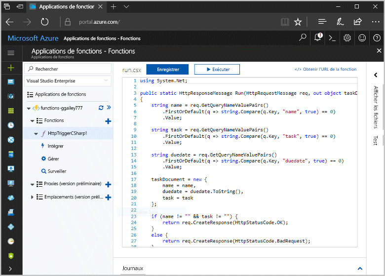
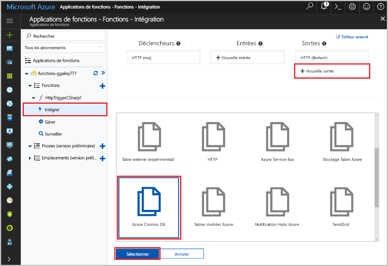
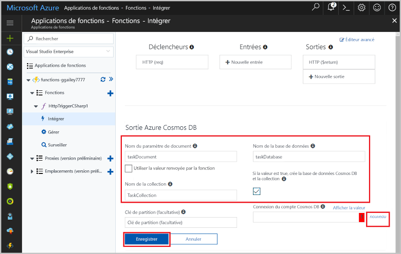
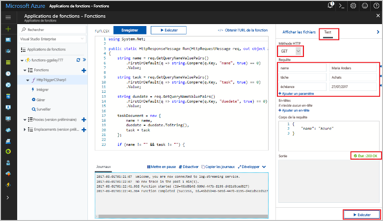
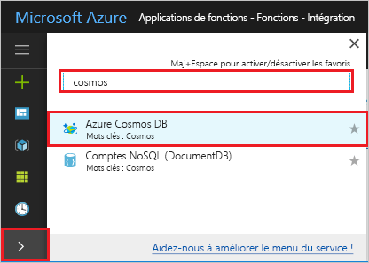
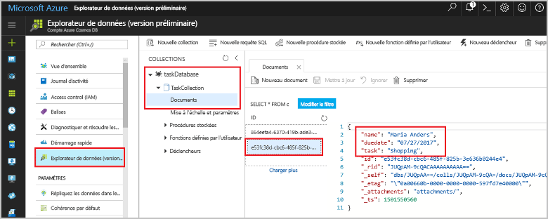

# <a name="store-unstructured-data-using-azure-functions-and-cosmos-db"></a>Stocker des données non structurées à l’aide d’Azure Functions et de Cosmos DB

[Base de données Azure Cosmos](https://azure.microsoft.com/services/cosmos-db/) est un toostore excellent moyen non structurée et les données JSON. Combiné à Azure Functions, Cosmos DB rend le stockage de données simple et rapide avec beaucoup moins de code que pour stocker des données dans une base de données relationnelle.

Dans les fonctions d’Azure, les liaisons d’entrée et de sortie fournissent une données de service de façon déclarative tooconnect tooexternal à partir de votre fonction. Dans cette rubrique, découvrez comment tooupdate un existant c# fonction tooadd une liaison de sortie qui stocke des données non structurées dans un document de base de données Cosmos. 



## <a name="prerequisites"></a>Composants requis

toocomplete ce didacticiel :

[!INCLUDE [Previous quickstart note](../../includes/functions-quickstart-previous-topics.md)]

## <a name="add-an-output-binding"></a>Ajouter une liaison de sortie

1. Développez à la fois votre application de fonction et votre fonction.

1. Sélectionnez **intégrer** et **+ nouvelle sortie**, qui est à hello haut à droite de la page de hello. Choisissez **Azure Cosmos DB**, puis cliquez sur **Sélectionner**.

    

3. Hello d’utilisation **sortie de la base de données Azure Cosmos** paramètres comme spécifié dans la table de hello : 

    

    | Paramètre      | Valeur suggérée  | Description                                |
    | ------------ | ---------------- | ------------------------------------------ |
    | **Nom du paramètre de document** | taskDocument | Nom qui fait référence d’objet de base de données Cosmos toohello dans le code. |
    | **Nom de la base de données** | taskDatabase | Nom de documents toosave de base de données. |
    | **Nom de la collection** | TaskCollection | Nom de la collection de bases de données Cosmos DB. |
    | **Si la valeur est true, crée la collection et la base de données de la base de données Cosmos hello** | Activé | collection de Hello n’existe déjà, donc le créer. |

4. Sélectionnez **nouveau** toohello suivant **connexion de document de base de données Cosmos** d’étiquette, puis sélectionnez **+ créer**. 

5. Hello d’utilisation **nouveau compte** paramètres comme spécifié dans la table de hello : 

    

    | Paramètre      | Valeur suggérée  | Description                                |
    | ------------ | ---------------- | ------------------------------------------ |
    | **Identifiant** | Nom de base de données | ID unique de la base de données de la base de données Cosmos hello  |
    | **API** | SQL (DocumentDB) | Sélectionnez les API de base de données de document hello.  |
    | **Abonnement** | Abonnement Azure | Abonnement Azure  |
    | **Groupe de ressources** | myResourceGroup |  Utilisez hello groupe de ressources existant qui contient votre application de la fonction. |
    | **Emplacement**  | WestEurope | Sélectionner un emplacement près de tooeither votre application de la fonction ou tooother les applications qui utilisent hello documents stockés.  |

6. Cliquez sur **OK** base de données toocreate hello. Il peut prendre la base de données de quelques minutes toocreate hello. Après la création de la base de données hello, chaîne de connexion de base de données hello est stockée comme paramètre d’application de fonction. nom Hello de ce paramètre d’application est inséré dans **connexion au compte de base de données Cosmos**. 
 
8. Une fois que la chaîne de connexion hello est définie, sélectionnez **enregistrer** liaison de hello toocreate.

## <a name="update-hello-function-code"></a>Mettre à jour le code de la fonction hello

Remplacez hello existant c# code de fonction hello suivant de code :

```csharp
using System.Net;

public static HttpResponseMessage Run(HttpRequestMessage req, out object taskDocument, TraceWriter log)
{
    string name = req.GetQueryNameValuePairs()
        .FirstOrDefault(q => string.Compare(q.Key, "name", true) == 0)
        .Value;

    string task = req.GetQueryNameValuePairs()
        .FirstOrDefault(q => string.Compare(q.Key, "task", true) == 0)
        .Value;

    string duedate = req.GetQueryNameValuePairs()
        .FirstOrDefault(q => string.Compare(q.Key, "duedate", true) == 0)
        .Value;

    taskDocument = new {
        name = name,
        duedate = duedate.ToString(),
        task = task
    };

    if (name != "" && task != "") {
        return req.CreateResponse(HttpStatusCode.OK);
    }
    else {
        return req.CreateResponse(HttpStatusCode.BadRequest);
    }
}

```
Cet exemple de code lit les chaînes de requête hello requête HTTP et les affecte toofields Bonjour `taskDocument` objet. Hello `taskDocument` liaison envoie les données d’objet hello à partir de cette toobe de paramètre de liaison stocké dans la base de données du document lié hello. base de données Hello créée hello première fonction hello s’exécute.

## <a name="test-hello-function-and-database"></a>Fonction hello de test et de la base de données

1. Développez la fenêtre de droite hello et sélectionnez **Test**. Sous **requête**, cliquez sur **+ ajouter un paramètre** et ajoutez hello suivant de chaîne de requête toohello paramètres :

    + `name`
    + `task`
    + `duedate`

2. Cliquez sur **Exécuter** et vérifiez que l’état 200 est renvoyé.

    

1. Sur hello à gauche de hello portail Azure, développez la barre d’icônes hello, type `cosmos` Bonjour rechercher le champ, puis sélectionnez **base de données Azure Cosmos**.

    

2. Base de données Sélectionnez hello vous avez créé, puis sélectionnez **Explorateur de données**. Développez hello **Collections** nœuds, sélectionnez hello nouveau document et vérifiez qu’un document hello contient vos valeurs de chaîne de requête, ainsi que des métadonnées supplémentaires. 

    

Vous avez ajouté un déclencheur HTTP tooyour liaison qui stockent les données non structurées dans une base de données de la base de données Cosmos.

[!INCLUDE [Clean-up section](../../includes/clean-up-section-portal.md)]

## <a name="next-steps"></a>Étapes suivantes

[!INCLUDE [functions-quickstart-next-steps](../../includes/functions-quickstart-next-steps.md)]

Pour plus d’informations sur la base de données de liaison tooa Cosmos DB, consultez [les liaisons de base de données Azure fonctions Cosmos](functions-bindings-documentdb.md).
