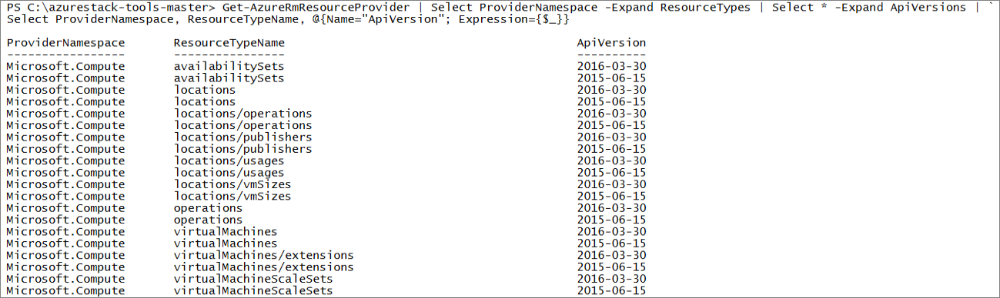

# <a name="key-considerations-using-services-or-building-apps-for-azure-stack"></a><span data-ttu-id="69baa-103">Considérations importantes : utilisation de services ou génération d’applications pour Azure Stack</span><span class="sxs-lookup"><span data-stu-id="69baa-103">Key considerations: Using services or building apps for Azure Stack</span></span>

<span data-ttu-id="69baa-104">Lorsque vous utilisez des services ou générez des applications pour Azure Stack, vous devez comprendre qu’il existe des différences entre Azure Stack et Azure.</span><span class="sxs-lookup"><span data-stu-id="69baa-104">When you use services or build apps for Azure Stack, you must understand that there are differences between Azure Stack and Azure.</span></span> <span data-ttu-id="69baa-105">Cet article fournit des considérations relatives à la clé par une vue d’ensemble de hello lorsque vous ciblez la pile de Azure comme environnement de développement de cloud hybride.</span><span class="sxs-lookup"><span data-stu-id="69baa-105">This article provides an overview of hello key considerations when you target Azure Stack as your hybrid cloud development environment.</span></span>

## <a name="overview"></a><span data-ttu-id="69baa-106">Vue d'ensemble</span><span class="sxs-lookup"><span data-stu-id="69baa-106">Overview</span></span>

<span data-ttu-id="69baa-107">Azure Stack est une plateforme cloud hybride qui vous permet d’utiliser les services Azure à partir du centre de données de votre entreprise ou de votre fournisseur de services.</span><span class="sxs-lookup"><span data-stu-id="69baa-107">Azure Stack is a hybrid cloud platform that lets you use Azure services from your company's or service provider's datacenter.</span></span> <span data-ttu-id="69baa-108">En tant que développeur, vous pouvez générer des applications qui s’exécutent sur Azure Stack.</span><span class="sxs-lookup"><span data-stu-id="69baa-108">As a developer, you can build apps that run on Azure Stack.</span></span> <span data-ttu-id="69baa-109">Vous pouvez ensuite déployer ces tooAzure applications pile, tooAzure, ou vous pouvez générer réellement les applications hybrides qui tirent parti de connectivité hello entre un cloud de la pile d’Azure et le Azure.</span><span class="sxs-lookup"><span data-stu-id="69baa-109">You can then deploy these apps tooAzure Stack, tooAzure, or you can build truly hybrid apps that leverage hello connectivity between an Azure Stack cloud and Azure.</span></span>

<span data-ttu-id="69baa-110">Votre administrateur du cloud Azure pile ou un fournisseur de services sera vous permettent de connaître les services qui sont disponibles pour vous toouse, et comment tooget prennent en charge.</span><span class="sxs-lookup"><span data-stu-id="69baa-110">Your Azure Stack cloud administrator or service provider will let you know which services are available for you toouse, and how tooget support.</span></span> <span data-ttu-id="69baa-111">Il propose ces services par le biais de ses offres et plans personnalisés.</span><span class="sxs-lookup"><span data-stu-id="69baa-111">They will offer these services through their customized plans and offers.</span></span>

<span data-ttu-id="69baa-112">Hello contenu technique Azure suppose que les applications sont développées pour un service Azure au lieu de la pile de Azure.</span><span class="sxs-lookup"><span data-stu-id="69baa-112">hello Azure technical content assumes that apps are being developed for an Azure service instead of Azure Stack.</span></span> <span data-ttu-id="69baa-113">Lorsque vous générez et déployez des applications tooAzure pile, vous devez comprendre les différences clés, telles que :</span><span class="sxs-lookup"><span data-stu-id="69baa-113">When you build and deploy apps tooAzure Stack, you must understand some key differences, such as:</span></span>

* <span data-ttu-id="69baa-114">Pile Azure fournit un sous-ensemble de services de hello et les fonctionnalités qui sont disponibles dans Azure.</span><span class="sxs-lookup"><span data-stu-id="69baa-114">Azure Stack delivers a subset of hello services and features that are available in Azure.</span></span>
* <span data-ttu-id="69baa-115">Votre entreprise ou fournisseur de services permettre choisir les services qu’ils souhaitent toooffer.</span><span class="sxs-lookup"><span data-stu-id="69baa-115">Your company or service provider can choose which services they want toooffer.</span></span> <span data-ttu-id="69baa-116">Cela inclut des services ou des applications personnalisés.</span><span class="sxs-lookup"><span data-stu-id="69baa-116">This includes customized services or applications.</span></span>
* <span data-ttu-id="69baa-117">Vous devez utiliser hello corriger les points de terminaison Azure pile spécifique (par exemple, les URL de hello pour l’adresse de portail hello et le point de terminaison hello Azure Resource Manager).</span><span class="sxs-lookup"><span data-stu-id="69baa-117">You must use hello correct Azure Stack-specific endpoints (for example, hello URLs for hello portal address and hello Azure Resource Manager endpoint).</span></span>
* <span data-ttu-id="69baa-118">Vous devez utiliser des versions de PowerShell et d’API qui sont prises en charge par Azure Stack.</span><span class="sxs-lookup"><span data-stu-id="69baa-118">You must use PowerShell and API versions that are supported by Azure Stack.</span></span> <span data-ttu-id="69baa-119">Ceci permet de s’assurer que vos applications fonctionnent dans Azure Stack et Azure.</span><span class="sxs-lookup"><span data-stu-id="69baa-119">Doing this ensures that your apps will work in both Azure Stack and Azure.</span></span>

## <a name="cheat-sheet-high-level-differences"></a><span data-ttu-id="69baa-120">Aide-mémoire : principales différences</span><span class="sxs-lookup"><span data-stu-id="69baa-120">Cheat sheet: High-level differences</span></span>

<span data-ttu-id="69baa-121">Hello tableau suivant décrit les différences de haut niveau hello entre la pile d’Azure et Azure.</span><span class="sxs-lookup"><span data-stu-id="69baa-121">hello following table describes hello high-level differences between Azure Stack and Azure.</span></span> <span data-ttu-id="69baa-122">Gardez-les à l’esprit lorsque vous développez pour Azure Stack ou utilisez des services Azure Stack.</span><span class="sxs-lookup"><span data-stu-id="69baa-122">Keep these in mind when you develop for Azure Stack or use Azure Stack services.</span></span>

| <span data-ttu-id="69baa-123">Domaine</span><span class="sxs-lookup"><span data-stu-id="69baa-123">Area</span></span> | <span data-ttu-id="69baa-124">Azure (global)</span><span class="sxs-lookup"><span data-stu-id="69baa-124">Azure (global)</span></span> | <span data-ttu-id="69baa-125">Azure Stack</span><span class="sxs-lookup"><span data-stu-id="69baa-125">Azure Stack</span></span> |
| -------- | ------------- | ----------|
| <span data-ttu-id="69baa-126">Qui est en charge de son fonctionnement ?</span><span class="sxs-lookup"><span data-stu-id="69baa-126">Who operates it?</span></span> | <span data-ttu-id="69baa-127">Microsoft</span><span class="sxs-lookup"><span data-stu-id="69baa-127">Microsoft</span></span> | <span data-ttu-id="69baa-128">Votre entreprise ou fournisseur de services.</span><span class="sxs-lookup"><span data-stu-id="69baa-128">Your company or service provider.</span></span>|
| <span data-ttu-id="69baa-129">Qui contactez-vous pour obtenir un support ?</span><span class="sxs-lookup"><span data-stu-id="69baa-129">Who do you contact for support?</span></span> | <span data-ttu-id="69baa-130">Microsoft</span><span class="sxs-lookup"><span data-stu-id="69baa-130">Microsoft</span></span> | <span data-ttu-id="69baa-131">Pour la prise en charge du Kit de développement de pile Azure, visitez hello [forums Microsoft](https://social.msdn.microsoft.com/Forums/home?forum=azurestack).</span><span class="sxs-lookup"><span data-stu-id="69baa-131">For Azure Stack Development Kit support, visit hello [Microsoft forums](https://social.msdn.microsoft.com/Forums/home?forum=azurestack).</span></span> <span data-ttu-id="69baa-132">Kit de développement hello étant un environnement d’évaluation, il n’existe aucune prise en charge officielle proposé par Microsoft prend en charge les Services (technique).</span><span class="sxs-lookup"><span data-stu-id="69baa-132">Because hello development kit is an evaluation environment, there is no official support offered through Microsoft Customer Support Services (CSS).</span></span>
| <span data-ttu-id="69baa-133">Services disponibles</span><span class="sxs-lookup"><span data-stu-id="69baa-133">Available services</span></span> | <span data-ttu-id="69baa-134">Consultez la liste des hello [produits Azure](https://azure.microsoft.com/services/?b=17.04b).</span><span class="sxs-lookup"><span data-stu-id="69baa-134">See hello list of [Azure products](https://azure.microsoft.com/services/?b=17.04b).</span></span> <span data-ttu-id="69baa-135">Les services disponibles varient selon la région Azure.</span><span class="sxs-lookup"><span data-stu-id="69baa-135">Available services vary by Azure region.</span></span> | <span data-ttu-id="69baa-136">Azure Stack prend en charge une partie des services Azure.</span><span class="sxs-lookup"><span data-stu-id="69baa-136">Azure Stack supports a subset of Azure services.</span></span> <br><br><span data-ttu-id="69baa-137">Les services réels varient en fonction de ce que votre entreprise ou fournisseur de services choisit toooffer.</span><span class="sxs-lookup"><span data-stu-id="69baa-137">Actual services will vary based on what your company or service provider chooses toooffer.</span></span>
| <span data-ttu-id="69baa-138">Point de terminaison Azure Resource Manager*</span><span class="sxs-lookup"><span data-stu-id="69baa-138">Azure Resource Manager endpoint*</span></span> | <span data-ttu-id="69baa-139">https://management.azure.com</span><span class="sxs-lookup"><span data-stu-id="69baa-139">https://management.azure.com</span></span> | <span data-ttu-id="69baa-140">Pour le kit de développement hello : https://management.local.azurestack.external</span><span class="sxs-lookup"><span data-stu-id="69baa-140">For hello development kit: https://management.local.azurestack.external</span></span>
| <span data-ttu-id="69baa-141">URL du portail*</span><span class="sxs-lookup"><span data-stu-id="69baa-141">Portal URL*</span></span> | [<span data-ttu-id="69baa-142">https://portal.azure.com</span><span class="sxs-lookup"><span data-stu-id="69baa-142">https://portal.azure.com</span></span>](https://portal.azure.com) | <span data-ttu-id="69baa-143">Pour le kit de développement hello : https://portal.local.azurestack.external</span><span class="sxs-lookup"><span data-stu-id="69baa-143">For hello development kit: https://portal.local.azurestack.external</span></span>
| <span data-ttu-id="69baa-144">Région</span><span class="sxs-lookup"><span data-stu-id="69baa-144">Region</span></span> | <span data-ttu-id="69baa-145">Vous pouvez sélectionner la région toodeploy à.</span><span class="sxs-lookup"><span data-stu-id="69baa-145">You can select which region you want toodeploy to.</span></span> | <span data-ttu-id="69baa-146">Pour le kit de développement hello région sera toujours **local**.</span><span class="sxs-lookup"><span data-stu-id="69baa-146">For hello development kit, region will always be **local**.</span></span> <br><br><span data-ttu-id="69baa-147">kit de développement Hello prend en charge qu’une seule région.</span><span class="sxs-lookup"><span data-stu-id="69baa-147">hello development kit supports only one region.</span></span>
| <span data-ttu-id="69baa-148">Groupes de ressources</span><span class="sxs-lookup"><span data-stu-id="69baa-148">Resource groups</span></span> | <span data-ttu-id="69baa-149">Un groupe de ressources peut s’étendre sur plusieurs régions.</span><span class="sxs-lookup"><span data-stu-id="69baa-149">A resource group can span regions.</span></span> | <span data-ttu-id="69baa-150">Pour le kit de développement hello n'est qu’une seule région.</span><span class="sxs-lookup"><span data-stu-id="69baa-150">For hello development kit, there is only one region.</span></span>
|<span data-ttu-id="69baa-151">Espaces de noms, types de ressources et versions d’API pris en charge</span><span class="sxs-lookup"><span data-stu-id="69baa-151">Supported namespaces, resource types, and API versions</span></span> | <span data-ttu-id="69baa-152">Hello plus récente (ou versions antérieures qui ne sont pas encore déconseillé).</span><span class="sxs-lookup"><span data-stu-id="69baa-152">hello latest (or earlier versions that are not yet deprecated).</span></span> | <span data-ttu-id="69baa-153">Azure Stack prend en charge des versions spécifiques.</span><span class="sxs-lookup"><span data-stu-id="69baa-153">Azure Stack supports specific versions.</span></span> <span data-ttu-id="69baa-154">Voir hello « Configuration requise » de cet article.</span><span class="sxs-lookup"><span data-stu-id="69baa-154">See hello "Version requirements" section of this article.</span></span>
| | |

<span data-ttu-id="69baa-155">* Si vous êtes un opérateur cloud de pile d’Azure, consultez [à l’aide des portails d’administrateur et utilisateur hello dans Azure pile](azure-stack-manage-portals.md) pour plus d’informations sur les URL par administrateur hello portail et l’administrateur de point de terminaison de gestionnaire de ressources.</span><span class="sxs-lookup"><span data-stu-id="69baa-155">*If you are an Azure Stack cloud operator, see [Using hello administrator and user portals in Azure Stack](azure-stack-manage-portals.md) for information about hello administrator portal and administrator Resource Manager endpoint URLs.</span></span>

## <a name="helpful-tools-and-best-practices"></a><span data-ttu-id="69baa-156">Outils utiles et meilleures pratiques</span><span class="sxs-lookup"><span data-stu-id="69baa-156">Helpful tools and best practices</span></span>
 
 <span data-ttu-id="69baa-157">Microsoft fournit plusieurs outils et des conseils qui vous aident lors du développement pour Azure Stack.</span><span class="sxs-lookup"><span data-stu-id="69baa-157">Microsoft provides several tools and guidance that helps you develop for Azure Stack.</span></span>

| <span data-ttu-id="69baa-158">Recommandation</span><span class="sxs-lookup"><span data-stu-id="69baa-158">Recommendation</span></span> | <span data-ttu-id="69baa-159">Références</span><span class="sxs-lookup"><span data-stu-id="69baa-159">References</span></span> | 
| -------- | ------------- | 
| <span data-ttu-id="69baa-160">Installez les outils appropriés hello sur votre station de travail du développeur.</span><span class="sxs-lookup"><span data-stu-id="69baa-160">Install hello correct tools on your developer workstation.</span></span> | <span data-ttu-id="69baa-161">- [Installer PowerShell](azure-stack-powershell-install.md)</span><span class="sxs-lookup"><span data-stu-id="69baa-161">- [Install PowerShell](azure-stack-powershell-install.md)</span></span><br><span data-ttu-id="69baa-162">- [Télécharger des outils](azure-stack-powershell-download.md)</span><span class="sxs-lookup"><span data-stu-id="69baa-162">- [Download tools](azure-stack-powershell-download.md)</span></span><br><span data-ttu-id="69baa-163">- [Configurer PowerShell](azure-stack-powershell-configure-user.md)</span><span class="sxs-lookup"><span data-stu-id="69baa-163">- [Configure PowerShell](azure-stack-powershell-configure-user.md)</span></span><br><span data-ttu-id="69baa-164">- [Installer Visual Studio](azure-stack-install-visual-studio.md)</span><span class="sxs-lookup"><span data-stu-id="69baa-164">- [Install Visual Studio](azure-stack-install-visual-studio.md)</span></span> 
| <span data-ttu-id="69baa-165">Passez en revue les informations sur les éléments suivants de hello :</span><span class="sxs-lookup"><span data-stu-id="69baa-165">Review information about hello following:</span></span><br><span data-ttu-id="69baa-166">- Considérations relatives au modèle Azure Resource Manager</span><span class="sxs-lookup"><span data-stu-id="69baa-166">- Azure Resource Manager template considerations</span></span><br><span data-ttu-id="69baa-167">-Comment toofind les modèles de démarrage rapide</span><span class="sxs-lookup"><span data-stu-id="69baa-167">- How toofind QuickStart templates</span></span><br><span data-ttu-id="69baa-168">-Utilisez un toohelp de module de stratégie vous utilisez Azure toodevelop pour la pile de Azure</span><span class="sxs-lookup"><span data-stu-id="69baa-168">- Use a policy module toohelp you use Azure toodevelop for Azure Stack</span></span> | [<span data-ttu-id="69baa-169">Développer pour Azure Stack</span><span class="sxs-lookup"><span data-stu-id="69baa-169">Develop for Azure Stack</span></span>](azure-stack-developer.md) | 
| <span data-ttu-id="69baa-170">Passez en revue et suivre les meilleures pratiques de hello pour les modèles.</span><span class="sxs-lookup"><span data-stu-id="69baa-170">Review and follow hello best practices for templates.</span></span> | [<span data-ttu-id="69baa-171">Modèles de démarrage rapide Resource Manager</span><span class="sxs-lookup"><span data-stu-id="69baa-171">Resource Manager Quickstart Templates</span></span>](https://github.com/Azure/azure-quickstart-templates/blob/master/1-CONTRIBUTION-GUIDE/best-practices.md#best-practices)
| | |

## <a name="version-requirements"></a><span data-ttu-id="69baa-172">Configuration requise pour la version</span><span class="sxs-lookup"><span data-stu-id="69baa-172">Version requirements</span></span>

<span data-ttu-id="69baa-173">Azure Stack prend en charge des versions spécifiques d’Azure PowerShell et des API de service Azure.</span><span class="sxs-lookup"><span data-stu-id="69baa-173">Azure Stack supports specific versions of Azure PowerShell and Azure service APIs.</span></span> <span data-ttu-id="69baa-174">Vous devez utiliser tooensure versions prises en charge que votre application peut être déployée tooboth Azure pile et tooAzure.</span><span class="sxs-lookup"><span data-stu-id="69baa-174">You must use supported versions tooensure that your app can deploy tooboth Azure Stack and tooAzure.</span></span>

<span data-ttu-id="69baa-175">toomake que que vous utilisez une version appropriée de Azure PowerShell, utilisez [profils de version d’API](azure-stack-version-profiles.md).</span><span class="sxs-lookup"><span data-stu-id="69baa-175">toomake sure that you use a correct version of Azure PowerShell, use [API version profiles](azure-stack-version-profiles.md).</span></span> <span data-ttu-id="69baa-176">toodetermine hello API version profil le plus récent que vous pouvez utiliser, vous devez savoir quelle build de pile de Azure que vous utilisez.</span><span class="sxs-lookup"><span data-stu-id="69baa-176">toodetermine hello latest API version profile that you can use, you must know which build of Azure Stack you're using.</span></span> <span data-ttu-id="69baa-177">Contactez votre administrateur Azure Stack pour obtenir ces informations.</span><span class="sxs-lookup"><span data-stu-id="69baa-177">You can get this information from your Azure Stack administrator.</span></span>

>[!NOTE]
 <span data-ttu-id="69baa-178">Si vous utilisez hello Kit de développement de pile Azure, et vous disposez d’un accès administratif, consultez la section de « Déterminer la version actuelle de hello » de hello de [gérer les mises à jour](https://docs.microsoft.com/azure/azure-stack/azure-stack-updates#determine-the-current-version) toodetermine hello build de la pile de Azure.</span><span class="sxs-lookup"><span data-stu-id="69baa-178">If you're using hello Azure Stack Development Kit, and you have administrative access, see hello "Determine hello current version" section of [Manage updates](https://docs.microsoft.com/azure/azure-stack/azure-stack-updates#determine-the-current-version) toodetermine hello Azure Stack build.</span></span>

<span data-ttu-id="69baa-179">Pour les autres API, exécutez hello suivant PowerShell commande toooutput hello espaces de noms, types de ressources et les versions d’API qui sont pris en charge dans votre abonnement Azure pile.</span><span class="sxs-lookup"><span data-stu-id="69baa-179">For other APIs, run hello following PowerShell command toooutput hello namespaces, resource types, and API versions that are supported in your Azure Stack subscription.</span></span> <span data-ttu-id="69baa-180">Notez que des différences peuvent subsister au niveau de la propriété.</span><span class="sxs-lookup"><span data-stu-id="69baa-180">Note there may still be differences at a property level.</span></span> <span data-ttu-id="69baa-181">(Pour cette commande toowork, vous devez avoir déjà [installé](azure-stack-powershell-install.md) et [configuré](azure-stack-powershell-configure-user.md) PowerShell pour un environnement de la pile de Azure.</span><span class="sxs-lookup"><span data-stu-id="69baa-181">(For this command toowork, you must have already [installed](azure-stack-powershell-install.md) and [configured](azure-stack-powershell-configure-user.md) PowerShell for an Azure Stack environment.</span></span> <span data-ttu-id="69baa-182">Vous devez également avoir une offre d’abonnement tooan pile d’Azure.)</span><span class="sxs-lookup"><span data-stu-id="69baa-182">You must also have a subscription tooan Azure Stack offer.)</span></span>

 ```powershell
Get-AzureRmResourceProvider | Select ProviderNamespace -Expand ResourceTypes | Select * -Expand ApiVersions | `
Select ProviderNamespace, ResourceTypeName, @{Name="ApiVersion"; Expression={$_}} 
```

<span data-ttu-id="69baa-183">Exemple de sortie (tronquée) : </span><span class="sxs-lookup"><span data-stu-id="69baa-183">Example output (truncated): </span></span>
 
## <a name="next-steps"></a><span data-ttu-id="69baa-184">Étapes suivantes</span><span class="sxs-lookup"><span data-stu-id="69baa-184">Next steps</span></span>

<span data-ttu-id="69baa-185">Pour plus d’informations sur les différences au niveau du service, consultez :</span><span class="sxs-lookup"><span data-stu-id="69baa-185">For more detailed information about differences at a service level, see:</span></span>

* [<span data-ttu-id="69baa-186">Considérations relatives aux machines virtuelles dans Azure Stack</span><span class="sxs-lookup"><span data-stu-id="69baa-186">Considerations for Virtual Machines in Azure Stack</span></span>](azure-stack-vm-considerations.md)
* [<span data-ttu-id="69baa-187">Considérations relatives au stockage dans Azure Stack</span><span class="sxs-lookup"><span data-stu-id="69baa-187">Considerations for Storage in Azure Stack</span></span>](azure-stack-acs-differences.md)
* [<span data-ttu-id="69baa-188">Considérations relatives à la mise en réseau Azure Stack</span><span class="sxs-lookup"><span data-stu-id="69baa-188">Considerations for Azure Stack networking</span></span>](azure-stack-network-differences.md)

