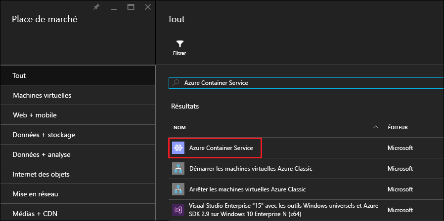
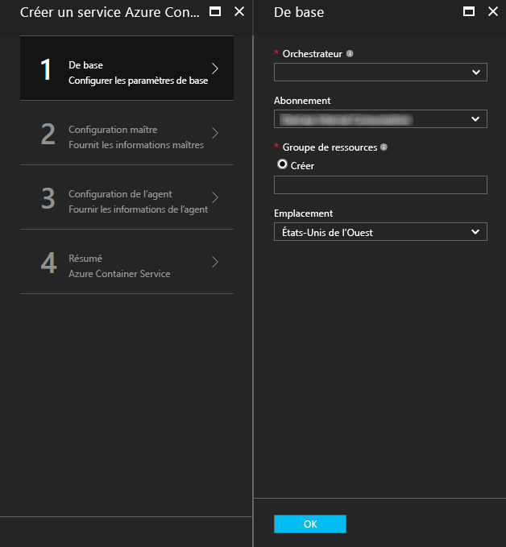
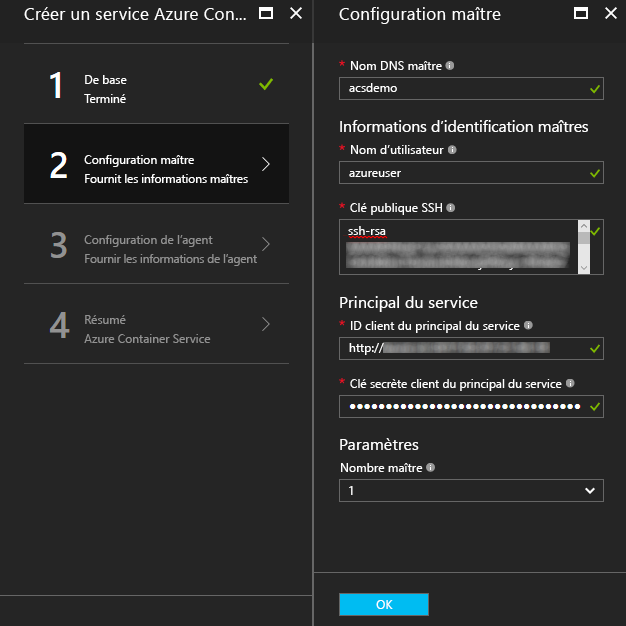
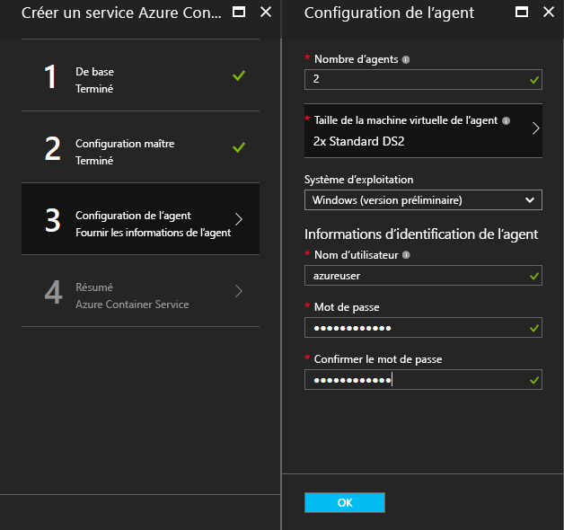
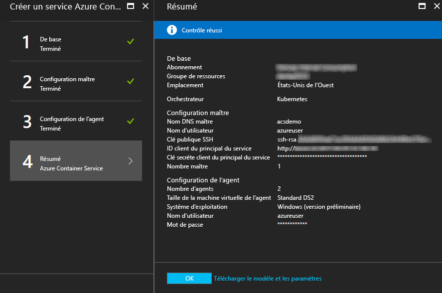
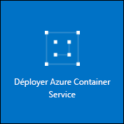

# <a name="deploy-a-docker-container-hosting-solution-using-the-azure-portal"></a><span data-ttu-id="86da0-104">Déployer une solution d’hébergement Conteneur Docker à l’aide du Portail Azure</span><span class="sxs-lookup"><span data-stu-id="86da0-104">Deploy a Docker container hosting solution using the Azure portal</span></span>


<span data-ttu-id="86da0-105">Azure Container Service assure le déploiement rapide des principales solutions de mise en cluster et d’orchestration de containers open source.</span><span class="sxs-lookup"><span data-stu-id="86da0-105">Azure Container Service provides rapid deployment of popular open-source container clustering and orchestration solutions.</span></span> <span data-ttu-id="86da0-106">Ce document vous guide lors du déploiement d’un cluster Azure Container Service à l’aide du portail Azure ou d’un modèle de démarrage rapide Azure Resource Manager.</span><span class="sxs-lookup"><span data-stu-id="86da0-106">This document walks you through deploying an Azure Container Service cluster by using the Azure portal or an Azure Resource Manager quickstart template.</span></span> 

<span data-ttu-id="86da0-107">Vous pouvez également déployer un cluster Azure Container Service à l’aide [d’Azure CLI 2.0](container-service-create-acs-cluster-cli.md) ou des API Azure Container Service.</span><span class="sxs-lookup"><span data-stu-id="86da0-107">You can also deploy an Azure Container Service cluster by using the [Azure CLI 2.0](container-service-create-acs-cluster-cli.md) or the Azure Container Service APIs.</span></span>

<span data-ttu-id="86da0-108">Pour obtenir du contexte, consultez [Présentation d’Azure Container Service](../container-service-intro.md).</span><span class="sxs-lookup"><span data-stu-id="86da0-108">For background, see [Azure Container Service introduction](../container-service-intro.md).</span></span>


## <a name="prerequisites"></a><span data-ttu-id="86da0-109">Composants requis</span><span class="sxs-lookup"><span data-stu-id="86da0-109">Prerequisites</span></span>

* <span data-ttu-id="86da0-110">**Abonnement Azure** : si vous n’en avez pas, inscrivez-vous pour un [essai gratuit](http://azure.microsoft.com/pricing/free-trial/?WT.mc_id=AA4C1C935).</span><span class="sxs-lookup"><span data-stu-id="86da0-110">**Azure subscription**: If you don't have one, sign up for a [free trial](http://azure.microsoft.com/pricing/free-trial/?WT.mc_id=AA4C1C935).</span></span> <span data-ttu-id="86da0-111">Pour un cluster de plus grande taille, envisagez de souscrire un abonnement de paiement à l’utilisation ou d’autres options d’achat.</span><span class="sxs-lookup"><span data-stu-id="86da0-111">For a larger cluster, consider a pay-as-you go subscription or other purchase options.</span></span>

    > [!NOTE]
    > <span data-ttu-id="86da0-112">L’utilisation de votre abonnement Azure et les [quotas des ressources](../../azure-subscription-service-limits.md), notamment les quotas de cœurs, peuvent limiter la taille du cluster déployé.</span><span class="sxs-lookup"><span data-stu-id="86da0-112">Your Azure subscription usage and [resource quotas](../../azure-subscription-service-limits.md), such as cores quotas, can limit the size of the cluster you deploy.</span></span> <span data-ttu-id="86da0-113">Pour demander une augmentation de ce quota, [ouvrez gratuitement une demande de support en ligne](../../azure-supportability/how-to-create-azure-support-request.md).</span><span class="sxs-lookup"><span data-stu-id="86da0-113">To request a quota increase, open an [online customer support request](../../azure-supportability/how-to-create-azure-support-request.md) at no charge.</span></span>
    >

* <span data-ttu-id="86da0-114">**Clé publique SSH RSA** : lorsque vous déployez via le portail ou l’un des modèles de démarrage rapide Azure, vous devez fournir la clé publique pour l’authentification sur les machines virtuelles d’Azure Container Service.</span><span class="sxs-lookup"><span data-stu-id="86da0-114">**SSH RSA public key**: When deploying through the portal or one of the Azure quickstart templates, you need to provide the public key for authentication against Azure Container Service virtual machines.</span></span> <span data-ttu-id="86da0-115">Pour créer des clés Secure Shell (SSH) RSA, consultez les conseils [OS X et Linux](../../virtual-machines/linux/mac-create-ssh-keys.md) ou [Windows](../../virtual-machines/linux/ssh-from-windows.md).</span><span class="sxs-lookup"><span data-stu-id="86da0-115">To create Secure Shell (SSH) RSA keys, see the [OS X and Linux](../../virtual-machines/linux/mac-create-ssh-keys.md) or [Windows](../../virtual-machines/linux/ssh-from-windows.md) guidance.</span></span> 

* <span data-ttu-id="86da0-116">**ID client principal du service et clé secrète** (Kubernetes uniquement) : pour plus d’informations et des conseils sur la création d’un principal du service Azure Active Directory, consultez [À propos du principal du service pour un cluster Kubernetes](../kubernetes/container-service-kubernetes-service-principal.md).</span><span class="sxs-lookup"><span data-stu-id="86da0-116">**Service principal client ID and secret** (Kubernetes only): For more information and guidance to create an Azure Active Directory service principal, see [About the service principal for a Kubernetes cluster](../kubernetes/container-service-kubernetes-service-principal.md).</span></span>


## <a name="create-a-cluster-by-using-the-azure-portal"></a><span data-ttu-id="86da0-117">Créer un cluster à l’aide du portail Azure</span><span class="sxs-lookup"><span data-stu-id="86da0-117">Create a cluster by using the Azure portal</span></span>
1. <span data-ttu-id="86da0-118">Connectez-vous au Portail Azure, sélectionnez **Nouveau** et recherchez **Azure Container Service** dans Azure Marketplace.</span><span class="sxs-lookup"><span data-stu-id="86da0-118">Sign in to the Azure portal, select **New**, and search the Azure Marketplace for **Azure Container Service**.</span></span>

      <br />

2. <span data-ttu-id="86da0-120">Cliquez sur **Azure Container Service**, puis cliquez sur **Créer**.</span><span class="sxs-lookup"><span data-stu-id="86da0-120">Click **Azure Container Service**, and click **Create**.</span></span>

3. <span data-ttu-id="86da0-121">Dans le panneau **De base**, entrez les informations suivantes :</span><span class="sxs-lookup"><span data-stu-id="86da0-121">On the **Basics** blade, enter the following information:</span></span>

    * <span data-ttu-id="86da0-122">**Orchestrator** : sélectionnez l’un des orchestrators du conteneur à déployer sur le cluster.</span><span class="sxs-lookup"><span data-stu-id="86da0-122">**Orchestrator**: Select one of the container orchestrators to deploy on the cluster.</span></span>
        * <span data-ttu-id="86da0-123">**DC/OS**: déploie un cluster DC/OS.</span><span class="sxs-lookup"><span data-stu-id="86da0-123">**DC/OS**: Deploys a DC/OS cluster.</span></span>
        * <span data-ttu-id="86da0-124">**Swarm**: déploie un cluster Docker Swarm.</span><span class="sxs-lookup"><span data-stu-id="86da0-124">**Swarm**: Deploys a Docker Swarm cluster.</span></span>
        * <span data-ttu-id="86da0-125">**Kubernetes** : déploie un cluster Kubernetes.</span><span class="sxs-lookup"><span data-stu-id="86da0-125">**Kubernetes**: Deploys a Kubernetes cluster.</span></span>
    * <span data-ttu-id="86da0-126">**Abonnement**: sélectionnez un abonnement Azure.</span><span class="sxs-lookup"><span data-stu-id="86da0-126">**Subscription**: Select an Azure subscription.</span></span>
    * <span data-ttu-id="86da0-127">**Groupe de ressources** : entrez le nom d’un nouveau groupe de ressources pour le déploiement.</span><span class="sxs-lookup"><span data-stu-id="86da0-127">**Resource group**: Enter the name of a new resource group for the deployment.</span></span>
    * <span data-ttu-id="86da0-128">**Emplacement**: sélectionnez une région Azure pour le déploiement d’Azure Container Service.</span><span class="sxs-lookup"><span data-stu-id="86da0-128">**Location**: Select an Azure region for the Azure Container Service deployment.</span></span> <span data-ttu-id="86da0-129">Pour connaître la disponibilité, consultez [Disponibilité des produits par région](https://azure.microsoft.com/regions/services/).</span><span class="sxs-lookup"><span data-stu-id="86da0-129">For availability, check [Products available by region](https://azure.microsoft.com/regions/services/).</span></span>
    
      <br />
    
    <span data-ttu-id="86da0-131">Cliquez sur **OK** lorsque vous souhaitez continuer.</span><span class="sxs-lookup"><span data-stu-id="86da0-131">Click **OK** when you're ready to proceed.</span></span>

4. <span data-ttu-id="86da0-132">Dans le panneau **Configuration maître**, entrez les paramètres suivants pour le ou les nœuds maîtres Linux du cluster (certains paramètres sont spécifiques à chaque orchestrator) :</span><span class="sxs-lookup"><span data-stu-id="86da0-132">On the **Master configuration** blade, enter the following settings for the Linux master node or nodes in the cluster (some settings are specific to each orchestrator):</span></span>

    * <span data-ttu-id="86da0-133">**Nom DNS maître** : le préfixe utilisé pour créer un nom de domaine complet (FQDN) unique pour le maître.</span><span class="sxs-lookup"><span data-stu-id="86da0-133">**Master DNS name**: The prefix used to create a unique fully qualified domain name (FQDN) for the master.</span></span> <span data-ttu-id="86da0-134">Le nom de domaine complet du maître est au format *préfixe*mgmt.*emplacement*.cloudapp.azure.com.</span><span class="sxs-lookup"><span data-stu-id="86da0-134">The master FQDN is of the form *prefix*mgmt.*location*.cloudapp.azure.com.</span></span>
    * <span data-ttu-id="86da0-135">**Nom d’utilisateur** : le nom d’utilisateur d’un compte sur chacune des machines virtuelles Linux dans le cluster.</span><span class="sxs-lookup"><span data-stu-id="86da0-135">**User name**: The user name for an account on each of the Linux virtual machines in the cluster.</span></span>
    * <span data-ttu-id="86da0-136">**Clé publique SSH RSA** : ajoutez la clé publique à utiliser pour l’authentification sur les machines virtuelles Linux.</span><span class="sxs-lookup"><span data-stu-id="86da0-136">**SSH RSA public key**: Add the public key to be used for authentication against the Linux virtual machines.</span></span> <span data-ttu-id="86da0-137">Vous devez impérativement vérifier que cette clé ne contient aucun saut de ligne et qu’elle inclut le préfixe `ssh-rsa`.</span><span class="sxs-lookup"><span data-stu-id="86da0-137">It is important that this key contains no line breaks, and it includes the `ssh-rsa` prefix.</span></span> <span data-ttu-id="86da0-138">Le postfix `username@domain` est facultatif.</span><span class="sxs-lookup"><span data-stu-id="86da0-138">The `username@domain` postfix is optional.</span></span> <span data-ttu-id="86da0-139">Vous devriez obtenir une clé du type : **ssh-rsa AAAAB3Nz...<...>...UcyupgH azureuser@linuxvm**.</span><span class="sxs-lookup"><span data-stu-id="86da0-139">The key should look something like the following: **ssh-rsa AAAAB3Nz...<...>...UcyupgH azureuser@linuxvm**.</span></span> 
    * <span data-ttu-id="86da0-140">**Principal du service** : si vous avez sélectionné l’orchestrator Kubernetes, entrez **l’ID client du principal du service** (également appelé appId) et la **clé secrète client du principal du service** (mot de passe) d’Azure Active Directory.</span><span class="sxs-lookup"><span data-stu-id="86da0-140">**Service principal**: If you selected the Kubernetes orchestrator, enter an Azure Active Directory **Service principal client ID** (also called the appId) and **Service principal client secret** (password).</span></span> <span data-ttu-id="86da0-141">Pour en savoir plus, consultez [À propos du principal du service pour un cluster Kubernetes](../kubernetes/container-service-kubernetes-service-principal.md) (en anglais).</span><span class="sxs-lookup"><span data-stu-id="86da0-141">For more information, see [About the service principal for a Kubernetes cluster](../kubernetes/container-service-kubernetes-service-principal.md).</span></span>
    * <span data-ttu-id="86da0-142">**Nombre de maîtres**: quantité de maîtres dans le cluster.</span><span class="sxs-lookup"><span data-stu-id="86da0-142">**Master count**: The number of masters in the cluster.</span></span>
    * <span data-ttu-id="86da0-143">**Diagnostics de la machine virtuelle** : pour certains orchestrators, vous pouvez activer les diagnostics sur les maîtres.</span><span class="sxs-lookup"><span data-stu-id="86da0-143">**VM diagnostics**: For some orchestrators, you can enable VM diagnostics on the masters.</span></span>

      <br />

    <span data-ttu-id="86da0-145">Cliquez sur **OK** lorsque vous souhaitez continuer.</span><span class="sxs-lookup"><span data-stu-id="86da0-145">Click **OK** when you're ready to proceed.</span></span>

5. <span data-ttu-id="86da0-146">Dans le panneau **Configuration d’agent**, entrez les informations suivantes :</span><span class="sxs-lookup"><span data-stu-id="86da0-146">On the **Agent configuration** blade, enter the following information:</span></span>

    * <span data-ttu-id="86da0-147">**Nombre d’agents** : pour Docker Swarm et Kubernetes, cette valeur correspond au nombre initial d’agents dans le groupe identique d’agent.</span><span class="sxs-lookup"><span data-stu-id="86da0-147">**Agent count**: For Docker Swarm and Kubernetes, this value is the initial number of agents in the agent scale set.</span></span> <span data-ttu-id="86da0-148">Pour DC/OS, il s’agit du nombre initial d’agents dans un groupe identique privé.</span><span class="sxs-lookup"><span data-stu-id="86da0-148">For DC/OS, it is the initial number of agents in a private scale set.</span></span> <span data-ttu-id="86da0-149">En outre, un groupe identique public est créé pour DC/OS et contient un nombre prédéterminé d’agents.</span><span class="sxs-lookup"><span data-stu-id="86da0-149">Additionally, a public scale set is created for DC/OS, which contains a predetermined number of agents.</span></span> <span data-ttu-id="86da0-150">Le nombre d’agents dans ce groupe identique public est déterminé par le nombre de maîtres dans le cluster : un agent public pour un maître, et deux agents publics pour trois ou cinq maîtres.</span><span class="sxs-lookup"><span data-stu-id="86da0-150">The number of agents in this public scale set is determined by the number of masters in the cluster: one public agent for one master, and two public agents for three or five masters.</span></span>
    * <span data-ttu-id="86da0-151">**Taille de la machine virtuelle de l’agent**: taille des machines virtuelles des agents.</span><span class="sxs-lookup"><span data-stu-id="86da0-151">**Agent virtual machine size**: The size of the agent virtual machines.</span></span>
    * <span data-ttu-id="86da0-152">**Système d’exploitation** : ce paramètre est actuellement disponible uniquement si vous avez sélectionné l’orchestrator Kubernetes.</span><span class="sxs-lookup"><span data-stu-id="86da0-152">**Operating system**: This setting is currently available only if you selected the Kubernetes orchestrator.</span></span> <span data-ttu-id="86da0-153">Choisissez une distribution Linux ou un système d’exploitation Windows à exécuter sur les agents.</span><span class="sxs-lookup"><span data-stu-id="86da0-153">Choose either a Linux distribution or a Windows Server operating system to run on the agents.</span></span> <span data-ttu-id="86da0-154">Ce paramètre détermine si votre cluster peut exécuter des applications de conteneur Windows ou Linux.</span><span class="sxs-lookup"><span data-stu-id="86da0-154">This setting determines whether your cluster can run Linux or Windows container apps.</span></span> 

        > [!NOTE]
        > <span data-ttu-id="86da0-155">La prise en charge de conteneur Windows est en version préliminaire pour les clusters Kubernetes.</span><span class="sxs-lookup"><span data-stu-id="86da0-155">Windows container support is in preview for Kubernetes clusters.</span></span> <span data-ttu-id="86da0-156">Pour les clusters DC/OS et Swarm, seuls les agents Linux sont actuellement pris en charge dans Azure Container Service.</span><span class="sxs-lookup"><span data-stu-id="86da0-156">On DC/OS and Swarm clusters, only Linux agents are currently supported in Azure Container Service.</span></span>

    * <span data-ttu-id="86da0-157">**Informations d’identification de l’agent** : si vous avez sélectionné le système d’exploitation Windows, entrez un **nom d’utilisateur** et un **mot de passe** d’administrateur pour les machines virtuelles de l’agent.</span><span class="sxs-lookup"><span data-stu-id="86da0-157">**Agent credentials**: If you selected the Windows operating system, enter an administrator **User name** and **Password** for the agent VMs.</span></span> 

      <br />

    <span data-ttu-id="86da0-159">Cliquez sur **OK** lorsque vous souhaitez continuer.</span><span class="sxs-lookup"><span data-stu-id="86da0-159">Click **OK** when you're ready to proceed.</span></span>

6. <span data-ttu-id="86da0-160">Cliquez sur **OK** une fois la validation du service terminée.</span><span class="sxs-lookup"><span data-stu-id="86da0-160">After service validation finishes, click **OK**.</span></span>

      <br />

7. <span data-ttu-id="86da0-162">Passez en revue les conditions.</span><span class="sxs-lookup"><span data-stu-id="86da0-162">Review the terms.</span></span> <span data-ttu-id="86da0-163">Cliquez sur **Créer** pour entamer le processus de déploiement.</span><span class="sxs-lookup"><span data-stu-id="86da0-163">To start the deployment process, click **Create**.</span></span>

    <span data-ttu-id="86da0-164">Si vous avez choisi d’épingler le déploiement au Portail Azure, vous pouvez visualiser l’état du déploiement.</span><span class="sxs-lookup"><span data-stu-id="86da0-164">If you've elected to pin the deployment to the Azure portal, you can see the deployment status.</span></span>

      <br />

<span data-ttu-id="86da0-166">Le déploiement prend plusieurs minutes.</span><span class="sxs-lookup"><span data-stu-id="86da0-166">The deployment takes several minutes to complete.</span></span> <span data-ttu-id="86da0-167">Le cluster Azure Container Service est ensuite prêt à l’emploi.</span><span class="sxs-lookup"><span data-stu-id="86da0-167">Then, the Azure Container Service cluster is ready for use.</span></span>


## <a name="create-a-cluster-by-using-a-quickstart-template"></a><span data-ttu-id="86da0-168">Créer un cluster à l’aide d’un modèle de démarrage rapide</span><span class="sxs-lookup"><span data-stu-id="86da0-168">Create a cluster by using a quickstart template</span></span>
<span data-ttu-id="86da0-169">Des modèles de démarrage rapide Azure sont disponibles pour déployer un cluster dans Azure Container Service.</span><span class="sxs-lookup"><span data-stu-id="86da0-169">Azure quickstart templates are available to deploy a cluster in Azure Container Service.</span></span> <span data-ttu-id="86da0-170">Les modèles de démarrage rapide fournis peuvent être modifiés pour inclure une configuration Azure supplémentaire ou avancée.</span><span class="sxs-lookup"><span data-stu-id="86da0-170">The provided quickstart templates can be modified to include additional or advanced Azure configuration.</span></span> <span data-ttu-id="86da0-171">Pour créer un cluster Azure Container Service à l’aide d’un modèle de démarrage rapide Azure, vous avez besoin d’un abonnement Azure.</span><span class="sxs-lookup"><span data-stu-id="86da0-171">To create an Azure Container Service cluster by using an Azure quickstart template, you need an Azure subscription.</span></span> <span data-ttu-id="86da0-172">Si ce n’est pas le cas, inscrivez-vous dès aujourd’hui pour un [essai gratuit](http://azure.microsoft.com/pricing/free-trial/?WT.mc_id=AA4C1C935).</span><span class="sxs-lookup"><span data-stu-id="86da0-172">If you don't have one, then sign up for a [free trial](http://azure.microsoft.com/pricing/free-trial/?WT.mc_id=AA4C1C935).</span></span> 

<span data-ttu-id="86da0-173">Suivez ces étapes pour déployer un cluster à l’aide d’un modèle et d’Azure CLI 2.0 (consultez les [instructions d’installation et de configuration](/cli/azure/install-az-cli2)).</span><span class="sxs-lookup"><span data-stu-id="86da0-173">Follow these steps to deploy a cluster using a template and the Azure CLI 2.0 (see [installation and setup instructions](/cli/azure/install-az-cli2)).</span></span>

> [!NOTE] 
> <span data-ttu-id="86da0-174">Si vous êtes sur un système Windows, vous pouvez utiliser une procédure similaire pour déployer un modèle à l’aide d’Azure PowerShell.</span><span class="sxs-lookup"><span data-stu-id="86da0-174">If you're on a Windows system, you can use similar steps to deploy a template using Azure PowerShell.</span></span> <span data-ttu-id="86da0-175">Consultez les étapes plus loin dans cette section.</span><span class="sxs-lookup"><span data-stu-id="86da0-175">See steps later in this section.</span></span> <span data-ttu-id="86da0-176">Vous pouvez également déployer un modèle via le [portail](../../azure-resource-manager/resource-group-template-deploy-portal.md) ou d’autres méthodes.</span><span class="sxs-lookup"><span data-stu-id="86da0-176">You can also deploy a template through the [portal](../../azure-resource-manager/resource-group-template-deploy-portal.md) or other methods.</span></span>

1. <span data-ttu-id="86da0-177">Sélectionnez l’un des modèles de démarrage rapide disponibles dans GitHub pour déployer un cluster DC/OS, Docker Swarm ou Kubernetes.</span><span class="sxs-lookup"><span data-stu-id="86da0-177">To deploy a DC/OS, Docker Swarm, or Kubernetes cluster, select one of the available quickstart templates from GitHub.</span></span> <span data-ttu-id="86da0-178">Une liste partielle s’affiche.</span><span class="sxs-lookup"><span data-stu-id="86da0-178">A partial list follows.</span></span> <span data-ttu-id="86da0-179">Les modèles DC/OS et Swarm sont identiques, à l’exception de la sélection de l’orchestrator par défaut.</span><span class="sxs-lookup"><span data-stu-id="86da0-179">The DC/OS and Swarm templates are the same, except for the default orchestrator selection.</span></span>

    * [<span data-ttu-id="86da0-180">Modèle DC/OS</span><span class="sxs-lookup"><span data-stu-id="86da0-180">DC/OS template</span></span>](https://github.com/Azure/azure-quickstart-templates/tree/master/101-acs-dcos)
    * [<span data-ttu-id="86da0-181">Modèle Swarm</span><span class="sxs-lookup"><span data-stu-id="86da0-181">Swarm template</span></span>](https://github.com/Azure/azure-quickstart-templates/tree/master/101-acs-swarm)
    * [<span data-ttu-id="86da0-182">Modèle Kubernetes</span><span class="sxs-lookup"><span data-stu-id="86da0-182">Kubernetes template</span></span>](https://github.com/Azure/azure-quickstart-templates/tree/master/101-acs-kubernetes)

2. <span data-ttu-id="86da0-183">Connectez-vous à votre compte Azure (`az login`) et assurez-vous qu’Azure CLI est associé à votre abonnement Azure.</span><span class="sxs-lookup"><span data-stu-id="86da0-183">Log in to your Azure account (`az login`), and make sure that the Azure CLI is connected to your Azure subscription.</span></span> <span data-ttu-id="86da0-184">Vous pouvez voir l’abonnement par défaut à l’aide de la commande suivante :</span><span class="sxs-lookup"><span data-stu-id="86da0-184">You can see the default subscription by using the following command:</span></span>

    ```azurecli
    az account show
    ```
    
    <span data-ttu-id="86da0-185">Si vous avez plusieurs abonnements et que vous devez définir un abonnement par défaut différent, exécutez `az account set --subscription` et spécifier l’ID d’abonnement ou le nom.</span><span class="sxs-lookup"><span data-stu-id="86da0-185">If you have more than one subscription and need to set a different default subscription, run `az account set --subscription` and specify the subscription ID or name.</span></span>

3. <span data-ttu-id="86da0-186">En tant que meilleure pratique, utilisez un nouveau groupe de ressources pour le déploiement.</span><span class="sxs-lookup"><span data-stu-id="86da0-186">As a best practice, use a new resource group for the deployment.</span></span> <span data-ttu-id="86da0-187">Pour créer un groupe de ressources, utilisez la commande `az group create` et spécifiez un nom de groupe de ressources ainsi qu’un emplacement :</span><span class="sxs-lookup"><span data-stu-id="86da0-187">To create a resource group, use the `az group create` command specify a resource group name and location:</span></span> 

    ```azurecli
    az group create --name "RESOURCE_GROUP" --location "LOCATION"
    ```

4. <span data-ttu-id="86da0-188">Créez un fichier JSON contenant les paramètres du modèle requis.</span><span class="sxs-lookup"><span data-stu-id="86da0-188">Create a JSON file containing the required template parameters.</span></span> <span data-ttu-id="86da0-189">Téléchargez le fichier de paramètres nommé `azuredeploy.parameters.json` qui accompagne le modèle Azure Container Service `azuredeploy.json` dans GitHub.</span><span class="sxs-lookup"><span data-stu-id="86da0-189">Download the parameters file named `azuredeploy.parameters.json` that accompanies the Azure Container Service template `azuredeploy.json` in GitHub.</span></span> <span data-ttu-id="86da0-190">Entrez les valeurs de paramètre requises pour votre cluster.</span><span class="sxs-lookup"><span data-stu-id="86da0-190">Enter required parameter values for your cluster.</span></span> 

    <span data-ttu-id="86da0-191">Par exemple, pour utiliser le [modèle DC/OS](https://github.com/Azure/azure-quickstart-templates/tree/master/101-acs-dcos), fournissez des valeurs de paramètre pour `dnsNamePrefix` et `sshRSAPublicKey`.</span><span class="sxs-lookup"><span data-stu-id="86da0-191">For example, to use the [DC/OS template](https://github.com/Azure/azure-quickstart-templates/tree/master/101-acs-dcos), supply parameter values for `dnsNamePrefix` and `sshRSAPublicKey`.</span></span> <span data-ttu-id="86da0-192">Consultez les descriptions dans `azuredeploy.json` et des options pour les autres paramètres.</span><span class="sxs-lookup"><span data-stu-id="86da0-192">See the descriptions in `azuredeploy.json` and options for other parameters.</span></span>  
 

5. <span data-ttu-id="86da0-193">Créez un cluster de service de conteneur en transmettant le fichier de paramètres de déploiement avec la commande suivante, où :</span><span class="sxs-lookup"><span data-stu-id="86da0-193">Create a Container Service cluster by passing the deployment parameters file with the following command, where:</span></span>

    * <span data-ttu-id="86da0-194">**RESOURCE_GROUP** est le nom du groupe de ressources que vous avez créé à l’étape précédente.</span><span class="sxs-lookup"><span data-stu-id="86da0-194">**RESOURCE_GROUP** is the name of the resource group that you created in the previous step.</span></span>
    * <span data-ttu-id="86da0-195">**DEPLOYMENT_NAME** (facultatif) est un nom que vous donnez au déploiement.</span><span class="sxs-lookup"><span data-stu-id="86da0-195">**DEPLOYMENT_NAME** (optional) is a name you give to the deployment.</span></span>
    * <span data-ttu-id="86da0-196">**TEMPLATE_URI** est l’emplacement du fichier de déploiement `azuredeploy.json`.</span><span class="sxs-lookup"><span data-stu-id="86da0-196">**TEMPLATE_URI** is the location of the deployment file `azuredeploy.json`.</span></span> <span data-ttu-id="86da0-197">Cette URI doit être le fichier Raw, et non un pointeur vers l’interface utilisateur de GitHub.</span><span class="sxs-lookup"><span data-stu-id="86da0-197">This URI must be the Raw file, not a pointer to the GitHub UI.</span></span> <span data-ttu-id="86da0-198">Pour trouver cette URI, sélectionnez le fichier `azuredeploy.json` dans GitHub, puis cliquez sur le bouton **Brut** .</span><span class="sxs-lookup"><span data-stu-id="86da0-198">To find this URI, select the `azuredeploy.json` file in GitHub, and click the **Raw** button.</span></span>  

    ```azurecli
    az group deployment create -g RESOURCE_GROUP -n DEPLOYMENT_NAME --template-uri TEMPLATE_URI --parameters @azuredeploy.parameters.json
    ```

    <span data-ttu-id="86da0-199">Vous pouvez également fournir des paramètres sous forme de chaîne au format JSON sur la ligne de commande.</span><span class="sxs-lookup"><span data-stu-id="86da0-199">You can also provide parameters as a JSON-formatted string on the command line.</span></span> <span data-ttu-id="86da0-200">Utilisez une commande similaire à la suivante :</span><span class="sxs-lookup"><span data-stu-id="86da0-200">Use a command similar to the following:</span></span>

    ```azurecli
    az group deployment create -g RESOURCE_GROUP -n DEPLOYMENT_NAME --template-uri TEMPLATE_URI --parameters "{ \"param1\": {\"value1\"} … }"
    ```

    > [!NOTE]
    > <span data-ttu-id="86da0-201">Le déploiement prend plusieurs minutes.</span><span class="sxs-lookup"><span data-stu-id="86da0-201">The deployment takes several minutes to complete.</span></span>
    > 

### <a name="equivalent-powershell-commands"></a><span data-ttu-id="86da0-202">Commandes PowerShell équivalentes</span><span class="sxs-lookup"><span data-stu-id="86da0-202">Equivalent PowerShell commands</span></span>
<span data-ttu-id="86da0-203">Vous pouvez également déployer un modèle de cluster Azure Container Service avec PowerShell.</span><span class="sxs-lookup"><span data-stu-id="86da0-203">You can also deploy an Azure Container Service cluster template with PowerShell.</span></span> <span data-ttu-id="86da0-204">Ce document est basé sur la version 1.0 du [module Azure PowerShell](https://azure.microsoft.com/blog/azps-1-0/).</span><span class="sxs-lookup"><span data-stu-id="86da0-204">This document is based on the version 1.0 [Azure PowerShell module](https://azure.microsoft.com/blog/azps-1-0/).</span></span>

1. <span data-ttu-id="86da0-205">Sélectionnez l’un des modèles de démarrage rapide disponibles dans GitHub pour déployer un cluster DC/OS, Docker Swarm ou Kubernetes.</span><span class="sxs-lookup"><span data-stu-id="86da0-205">To deploy a DC/OS, Docker Swarm, or Kubernetes cluster, select one of the available quickstart templates from GitHub.</span></span> <span data-ttu-id="86da0-206">Une liste partielle s’affiche.</span><span class="sxs-lookup"><span data-stu-id="86da0-206">A partial list follows.</span></span> <span data-ttu-id="86da0-207">Notez que les modèles DC/OS et Swarm sont identiques, à l’exception de la sélection de l’orchestrator par défaut.</span><span class="sxs-lookup"><span data-stu-id="86da0-207">Note that the DC/OS and Swarm templates are the same, with the exception of the default orchestrator selection.</span></span>

    * [<span data-ttu-id="86da0-208">Modèle DC/OS</span><span class="sxs-lookup"><span data-stu-id="86da0-208">DC/OS template</span></span>](https://github.com/Azure/azure-quickstart-templates/tree/master/101-acs-dcos)
    * [<span data-ttu-id="86da0-209">Modèle Swarm</span><span class="sxs-lookup"><span data-stu-id="86da0-209">Swarm template</span></span>](https://github.com/Azure/azure-quickstart-templates/tree/master/101-acs-swarm)
    * [<span data-ttu-id="86da0-210">Modèle Kubernetes</span><span class="sxs-lookup"><span data-stu-id="86da0-210">Kubernetes template</span></span>](https://github.com/Azure/azure-quickstart-templates/tree/master/101-acs-kubernetes)

2. <span data-ttu-id="86da0-211">Avant de créer un cluster dans votre abonnement Azure, vérifiez que votre session PowerShell a bien été connectée à Azure.</span><span class="sxs-lookup"><span data-stu-id="86da0-211">Before creating a cluster in your Azure subscription, verify that your PowerShell session has been signed in to Azure.</span></span> <span data-ttu-id="86da0-212">Pour cela, utilisez la commande `Get-AzureRMSubscription` :</span><span class="sxs-lookup"><span data-stu-id="86da0-212">You can do this with the `Get-AzureRMSubscription` command:</span></span>

    ```powershell
    Get-AzureRmSubscription
    ```

3. <span data-ttu-id="86da0-213">Si vous avez besoin de vous connecter à Azure, utilisez la commande `Login-AzureRMAccount` :</span><span class="sxs-lookup"><span data-stu-id="86da0-213">If you need to sign in to Azure, use the `Login-AzureRMAccount` command:</span></span>

    ```powershell
    Login-AzureRmAccount
    ```

4. <span data-ttu-id="86da0-214">En tant que meilleure pratique, utilisez un nouveau groupe de ressources pour le déploiement.</span><span class="sxs-lookup"><span data-stu-id="86da0-214">As a best practice, use a new resource group for the deployment.</span></span> <span data-ttu-id="86da0-215">Pour créer un groupe de ressources, utilisez la commande `New-AzureRmResourceGroup` et spécifiez un nom de groupe de ressources ainsi qu’une région de destination :</span><span class="sxs-lookup"><span data-stu-id="86da0-215">To create a resource group, use the `New-AzureRmResourceGroup` command, and specify a resource group name and destination region:</span></span>

    ```powershell
    New-AzureRmResourceGroup -Name GROUP_NAME -Location REGION
    ```

5. <span data-ttu-id="86da0-216">Une fois le groupe de ressources créé, vous pouvez créer votre cluster à l’aide de la commande suivante.</span><span class="sxs-lookup"><span data-stu-id="86da0-216">After you create a resource group, you can create your cluster with the following command.</span></span> <span data-ttu-id="86da0-217">L’URI du modèle souhaité est spécifié avec le paramètre `-TemplateUri`.</span><span class="sxs-lookup"><span data-stu-id="86da0-217">The URI of the desired template is specified with the `-TemplateUri` parameter.</span></span> <span data-ttu-id="86da0-218">Lorsque vous exécutez cette commande, PowerShell vous invite à saisir les valeurs des paramètres de déploiement.</span><span class="sxs-lookup"><span data-stu-id="86da0-218">When you run this command, PowerShell prompts you for deployment parameter values.</span></span>

    ```powershell
    New-AzureRmResourceGroupDeployment -Name DEPLOYMENT_NAME -ResourceGroupName RESOURCE_GROUP_NAME -TemplateUri TEMPLATE_URI
    ```

#### <a name="provide-template-parameters"></a><span data-ttu-id="86da0-219">Indication des paramètres du modèle</span><span class="sxs-lookup"><span data-stu-id="86da0-219">Provide template parameters</span></span>
<span data-ttu-id="86da0-220">Si vous êtes familiarisé avec PowerShell, vous savez que vous pouvez parcourir les paramètres disponibles pour une applet de commande en utilisant le signe moins (-), puis en appuyant sur la touche TAB.</span><span class="sxs-lookup"><span data-stu-id="86da0-220">If you're familiar with PowerShell, you know that you can cycle through the available parameters for a cmdlet by typing a minus sign (-) and then pressing the TAB key.</span></span> <span data-ttu-id="86da0-221">Cette fonctionnalité fonctionne également avec les paramètres que vous définissez dans votre modèle.</span><span class="sxs-lookup"><span data-stu-id="86da0-221">This same functionality also works with parameters that you define in your template.</span></span> <span data-ttu-id="86da0-222">Dès que vous entrez le nom du modèle, l’applet de commande récupère le modèle, analyse ses paramètres et ajoute les paramètres du modèle à la commande de façon dynamique.</span><span class="sxs-lookup"><span data-stu-id="86da0-222">As soon as you type the template name, the cmdlet fetches the template, parses the parameters, and adds the template parameters to the command dynamically.</span></span> <span data-ttu-id="86da0-223">Il est ainsi plus facile de spécifier les valeurs des paramètres du modèle.</span><span class="sxs-lookup"><span data-stu-id="86da0-223">This makes it easy to specify the template parameter values.</span></span> <span data-ttu-id="86da0-224">En outre, si vous oubliez une valeur obligatoire, PowerShell vous invite à spécifier cette valeur.</span><span class="sxs-lookup"><span data-stu-id="86da0-224">And, if you forget a required parameter value, PowerShell prompts you for the value.</span></span>

<span data-ttu-id="86da0-225">Voici l’intégralité de la commande contenant les paramètres.</span><span class="sxs-lookup"><span data-stu-id="86da0-225">Here is the full command, with parameters included.</span></span> <span data-ttu-id="86da0-226">Renseignez vos propres valeurs pour les noms des ressources.</span><span class="sxs-lookup"><span data-stu-id="86da0-226">Provide your own values for the names of the resources.</span></span>

```powershell
New-AzureRmResourceGroupDeployment -ResourceGroupName RESOURCE_GROUP_NAME-TemplateURI TEMPLATE_URI -adminuser value1 -adminpassword value2 ....
```

## <a name="next-steps"></a><span data-ttu-id="86da0-227">Étapes suivantes</span><span class="sxs-lookup"><span data-stu-id="86da0-227">Next steps</span></span>
<span data-ttu-id="86da0-228">À présent que vous disposez d’un cluster opérationnel, consultez les documents suivants pour obtenir des informations supplémentaires concernant la connexion et la gestion du cluster :</span><span class="sxs-lookup"><span data-stu-id="86da0-228">Now that you have a functioning cluster, see these documents for connection and management details:</span></span>

* [<span data-ttu-id="86da0-229">Connexion à un cluster Azure Container Service</span><span class="sxs-lookup"><span data-stu-id="86da0-229">Connect to an Azure Container Service cluster</span></span>](../container-service-connect.md)
* [<span data-ttu-id="86da0-230">Gestion de conteneur via l’API REST</span><span class="sxs-lookup"><span data-stu-id="86da0-230">Work with Azure Container Service and DC/OS</span></span>](container-service-mesos-marathon-rest.md)
* [<span data-ttu-id="86da0-231">Gestion des conteneurs avec Docker Swarm</span><span class="sxs-lookup"><span data-stu-id="86da0-231">Work with Azure Container Service and Docker Swarm</span></span>](container-service-docker-swarm.md)
* [<span data-ttu-id="86da0-232">Gestion des conteneurs avec Kubernetes</span><span class="sxs-lookup"><span data-stu-id="86da0-232">Work with Azure Container Service and Kubernetes</span></span>](../kubernetes/container-service-kubernetes-walkthrough.md)
