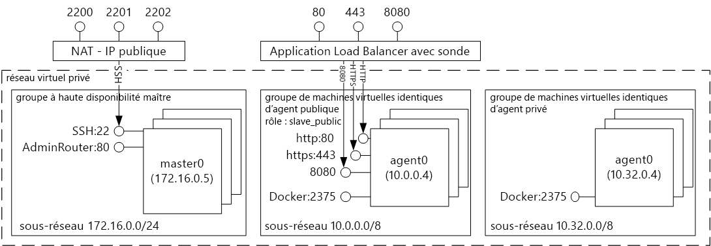
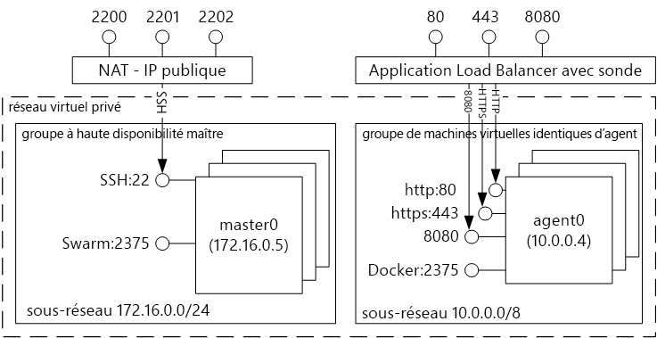
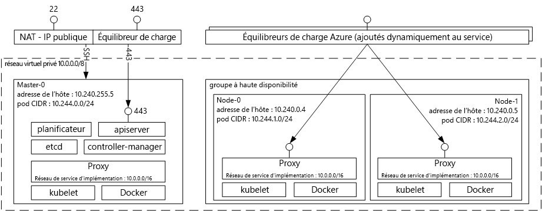

# Conteneur de tooDocker présentation des solutions avec le Service de conteneur Azure d’hébergementIntroduction tooDocker container hosting solutions with Azure Container Service 
Service de conteneur Azure rend plus simple pour vous toocreate, configurer et gérer un cluster d’ordinateurs virtuels qui sont des applications préconfigurés toorun placées dans des conteneurs.Azure Container Service makes it simpler for you toocreate, configure, and manage a cluster of virtual machines that are preconfigured toorun containerized applications. Ce service utilise une configuration optimisée d’outils de planification et d’orchestration open source bien connus.It uses an optimized configuration of popular open-source scheduling and orchestration tools. Ainsi vous toouse vos compétences existantes, ou appuyer sur un corps important et croissant d’expertise de la Communauté, toodeploy et gérer les applications de conteneur basé sur Microsoft Azure.This enables you toouse your existing skills, or draw upon a large and growing body of community expertise, toodeploy and manage container-based applications on Microsoft Azure.

Service de conteneur Azure exploite hello Docker conteneur format tooensure que vos conteneurs d’applications sont entièrement portables.Azure Container Service leverages hello Docker container format tooensure that your application containers are fully portable. Il prend également en charge votre choix de Marathon et contrôleur de domaine/système d’exploitation, Docker Swarm ou Kubernetes afin que vous pouvez adapter ces toothousands applications de conteneurs, ou même des dizaines de milliers.It also supports your choice of Marathon and DC/OS, Docker Swarm, or Kubernetes so that you can scale these applications toothousands of containers, or even tens of thousands.

En utilisant le Service de conteneur Azure, vous pouvez tirer parti des fonctionnalités de niveau entreprise de Azure, tout en conservant la portabilité des applications, y compris la portabilité aux couches d’orchestration hello.By using Azure Container Service, you can take advantage of the enterprise-grade features of Azure, while still maintaining application portability--including portability at hello orchestration layers.

## Utilisation d’Azure Container ServiceUsing Azure Container Service
L’objectif de Service de conteneur Azure est tooprovide un environnement d’hébergement de conteneur à l’aide d’outils open-source et les technologies adoptés par nos clients aujourd'hui.Our goal with Azure Container Service is tooprovide a container hosting environment by using open-source tools and technologies that are popular among our customers today. toothis fin, nous présentons les points de terminaison API standard hello pour votre orchestrator choisie (contrôleur de domaine/système d’exploitation, Docker Swarm ou Kubernetes).toothis end, we expose hello standard API endpoints for your chosen orchestrator (DC/OS, Docker Swarm, or Kubernetes). À l’aide de ces points de terminaison, vous pouvez exploiter tout logiciel qui est capable de communiquer avec les points de terminaison toothose.By using these endpoints, you can leverage any software that is capable of talking toothose endpoints. Par exemple, dans les cas de hello du point de terminaison Docker Swarm hello, vous pouvez choisir d’interface de ligne de commande (CLI) de toouse hello Docker.For example, in hello case of hello Docker Swarm endpoint, you might choose toouse hello Docker command-line interface (CLI). Pour le contrôleur de domaine/système d’exploitation, vous pouvez choisir hello DCOS CLI.For DC/OS, you might choose hello DCOS CLI. Pour Kubernetes, vous pouvez choisir `kubectl`.For Kubernetes, you might choose `kubectl`.

## Création d’un cluster Docker en utilisant Azure Container ServiceCreating a Docker cluster by using Azure Container Service
toobegin à l’aide du Service de conteneur Azure, vous déployez un cluster du Service de conteneur Azure via le portail de hello (hello de recherche Marketplace pour **Service de conteneur Azure**), à l’aide d’un modèle Azure Resource Manager ([Docker Swarm](https://github.com/Azure/azure-quickstart-templates/tree/master/101-acs-swarm), [DC/OS](https://github.com/Azure/azure-quickstart-templates/tree/master/101-acs-dcos), ou [Kubernetes](https://github.com/Azure/azure-quickstart-templates/tree/master/101-acs-kubernetes)), ou par hello [Azure CLI 2.0](container-service-create-acs-cluster-cli.md).toobegin using Azure Container Service, you deploy an Azure Container Service cluster via hello portal (search hello Marketplace for **Azure Container Service**), by using an Azure Resource Manager template ([Docker Swarm](https://github.com/Azure/azure-quickstart-templates/tree/master/101-acs-swarm), [DC/OS](https://github.com/Azure/azure-quickstart-templates/tree/master/101-acs-dcos), or [Kubernetes](https://github.com/Azure/azure-quickstart-templates/tree/master/101-acs-kubernetes)), or with hello [Azure CLI 2.0](container-service-create-acs-cluster-cli.md). Hello fourni des modèles de démarrage rapide peuvent être modifiée tooinclude configuration Azure supplémentaires ou avancés.hello provided quickstart templates can be modified tooinclude additional or advanced Azure configuration. Pour plus d’informations, consultez [Déployer un cluster Azure Container Service](container-service-deployment.md).For more information, see [Deploy an Azure Container Service cluster](container-service-deployment.md).

## Déploiement d’une applicationDeploying an application
Azure Container Service propose le choix entre Docker Swarm, DC/OS ou Kubernetes pour l’orchestration.Azure Container Service provides a choice of Docker Swarm, DC/OS, or Kubernetes for orchestration. Le déploiement de votre application dépend de votre choix en termes d’orchestrateur.How you deploy your application depends on your choice of orchestrator.

### Utilisation de DC/OSUsing DC/OS
Contrôleur de domaine/système d’exploitation est un système d’exploitation distribué basé sur le noyau de systèmes distribués Apache Mesos hello.DC/OS is a distributed operating system based on hello Apache Mesos distributed systems kernel. Apache Mesos est hébergée sur hello Apache Software Foundation et répertorie certaines des hello [plus grands noms dans informatique](http://mesos.apache.org/documentation/latest/powered-by-mesos/) en tant que les utilisateurs et les collaborateurs.Apache Mesos is housed at hello Apache Software Foundation and lists some of hello [biggest names in IT](http://mesos.apache.org/documentation/latest/powered-by-mesos/) as users and contributors.

DC/OS et Apache Mesos intègrent un impressionnant ensemble de fonctionnalités :DC/OS and Apache Mesos include an impressive feature set:

* Extensibilité éprouvéeProven scalability
* Serveurs maître et subordonnés répliqués et à tolérance de panne avec Apache ZooKeeperFault-tolerant replicated master and slaves using Apache ZooKeeper
* Prise en charge des conteneurs de format DockerSupport for Docker-formatted containers
* Isolement natif entre les tâches avec des conteneurs LinuxNative isolation between tasks with Linux containers
* Planification de ressources multiples (mémoire, UC, disque et ports)Multiresource scheduling (memory, CPU, disk, and ports)
* API Java, Python et C++ pour le développement de nouvelles applications parallèlesJava, Python, and C++ APIs for developing new parallel applications
* Interface utilisateur web pour l’affichage de l’état du clusterA web UI for viewing cluster state

Par défaut, le contrôleur de domaine/système d’exploitation en cours d’exécution sur le Service de conteneur Azure inclut plateforme d’orchestration de Marathon hello pour planifier les charges de travail.By default, DC/OS running on Azure Container Service includes hello Marathon orchestration platform for scheduling workloads. Toutefois, est inclus avec hello déploiement de contrôleur de domaine/système d’exploitation des services ACS de hello mésosphère parmi les services qui peuvent être ajoutées tooyour service.However, included with hello DC/OS deployment of ACS is hello Mesosphere Universe of services that can be added tooyour service. Services Bonjour univers incluent Spark, Hadoop, Cassandra et bien plus encore.Services in hello Universe include Spark, Hadoop, Cassandra, and much more.

#### Utilisation de MarathonUsing Marathon
Marathon est un init de l’ensemble du cluster et le système de contrôle des services cgroups--ou, dans le cas de hello du Service de conteneur d’Azure, conteneurs de mise en forme de Docker.Marathon is a cluster-wide init and control system for services in cgroups--or, in hello case of Azure Container Service, Docker-formatted containers. Marathon propose une interface utilisateur web à partir de laquelle vous pouvez déployer vos applications.Marathon provides a web UI from which you can deploy your applications. L’URL qui permet d’y accéder ressemble à `http://DNS_PREFIX.REGION.cloudapp.azure.com`, où DNS\_PREFIX et REGION sont deux valeurs définies au moment du déploiement.You can access this at a URL that looks something like `http://DNS_PREFIX.REGION.cloudapp.azure.com` where DNS\_PREFIX and REGION are both defined at deployment time. Bien sûr, vous pouvez également fournir votre propre nom DNS.Of course, you can also provide your own DNS name. Pour plus d’informations sur l’exécution d’un conteneur à l’aide de l’interface utilisateur web de Marathon hello, consultez [gestion des conteneurs de contrôleur de domaine/système d’exploitation via l’interface utilisateur web de Marathon hello](container-service-mesos-marathon-ui.md).For more information on running a container using hello Marathon web UI, see [DC/OS container management through hello Marathon web UI](container-service-mesos-marathon-ui.md).

Vous pouvez également utiliser hello API REST pour communiquer avec Marathon.You can also use hello REST APIs for communicating with Marathon. Plusieurs bibliothèques clientes sont disponibles pour chaque outil.There are a number of client libraries that are available for each tool. Qu’ils couvrent une variété de langages--et, bien sûr, vous pouvez utiliser le protocole HTTP hello dans n’importe quel langage.They cover a variety of languages--and, of course, you can use hello HTTP protocol in any language. De plus, de nombreux outils DevOps bien connus prennent en charge Marathon.In addition, many popular DevOps tools provide support for Marathon. Votre équipe en charge des opérations profite ainsi d’une flexibilité maximale quand vous utilisez un cluster Azure Container Service.This provides maximum flexibility for your operations team when you are working with an Azure Container Service cluster. Pour plus d’informations sur l’exécution d’un conteneur à l’aide de hello Marathon REST API, consultez [gestion des conteneurs de contrôleur de domaine/système d’exploitation via l’API REST de Marathon de hello](container-service-mesos-marathon-rest.md).For more information on running a container by using hello Marathon REST API, see [DC/OS container management through hello Marathon REST API](container-service-mesos-marathon-rest.md).

### Utilisation de Docker SwarmUsing Docker Swarm
Docker Swarm assure un clustering natif pour Docker.Docker Swarm provides native clustering for Docker. Étant donné que Docker Swarm sert hello API Docker standard, n’importe quel outil déjà communique avec un démon Docker peut utiliser des hôtes de toomultiple de mise à l’échelle de tootransparently essaim sur le Service de conteneur Azure.Because Docker Swarm serves hello standard Docker API, any tool that already communicates with a Docker daemon can use Swarm tootransparently scale toomultiple hosts on Azure Container Service.

[!INCLUDE [container-service-swarm-mode-note](../../../includes/container-service-swarm-mode-note.md)]

Les outils pris en charge pour la gestion des conteneurs sur un cluster essaim incluent, mais ne sont pas limités à, suivant de hello :Supported tools for managing containers on a Swarm cluster include, but are not limited to, hello following:

* DokkuDokku
* Interface de ligne de commande Docker et Docker ComposeDocker CLI and Docker Compose
* KraneKrane
* JenkinsJenkins

### Utilisation de KubernetesUsing Kubernetes
Kubernetes est un outil orchestrator de conteneur populaire, open source, à l’échelle de la production.Kubernetes is a popular open-source, production-grade container orchestrator tool. Kubernetes automatise le déploiement, la mise à l’échelle et la gestion des applications en conteneur.Kubernetes automates deployment, scaling, and management of containerized applications. Il est une solution open source et est piloté par la Communauté open source de hello, il s’exécute en toute transparence sur le conteneur de Service Azure et peut être conteneurs toodeploy utilisées à grande échelle sur le Service de conteneur Azure.Because it is an open-source solution and is driven by hello open-source community, it runs seamlessly on Azure Container Service and can be used toodeploy containers at scale on Azure Container Service.

Il possède un jeu complet de fonctionnalités, notamment :It has a rich set of features including:
* Mise à l’échelle horizontaleHorizontal scaling
* Détection de service et équilibrage de chargeService discovery and load balancing
* Secrets et gestion de la configurationSecrets and configuration management
* API basée sur les déploiements et restaurations automatisésAPI-based automated rollouts and rollbacks
* Réparation spontanéeSelf-healing

## VidéosVideos
Prise en main d’Azure Container Service (101) :Getting started with Azure Container Service (101):  

> [!VIDEO https://channel9.msdn.com/Shows/Azure-Friday/Azure-Container-Service-101/player]
>
>

Hello à l’aide des Applications de création Service de conteneur Azure (version 2016)Building Applications Using hello Azure Container Service (Build 2016)

> [!VIDEO https://channel9.msdn.com/Events/Build/2016/B822/player]
>
>

## Étapes suivantesNext steps

Déployer un cluster du service de conteneur à l’aide de hello [portal](container-service-deployment.md) ou [Azure CLI 2.0](container-service-create-acs-cluster-cli.md).Deploy a container service cluster using hello [portal](container-service-deployment.md) or [Azure CLI 2.0](container-service-create-acs-cluster-cli.md).
