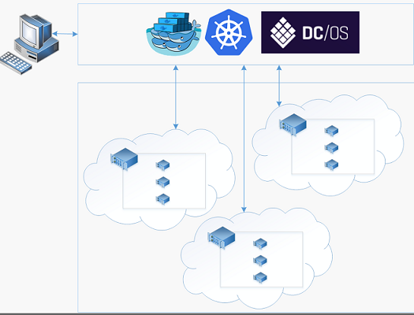

# Conteneur de tooDocker présentation des solutions avec le Service de conteneur Azure d’hébergement 
Service de conteneur Azure rend plus simple pour vous toocreate, configurer et gérer un cluster d’ordinateurs virtuels qui sont des applications préconfigurés toorun placées dans des conteneurs. Ce service utilise une configuration optimisée d’outils de planification et d’orchestration open source bien connus. Ainsi vous toouse vos compétences existantes, ou appuyer sur un corps important et croissant d’expertise de la Communauté, toodeploy et gérer les applications de conteneur basé sur Microsoft Azure.

Service de conteneur Azure exploite hello Docker conteneur format tooensure que vos conteneurs d’applications sont entièrement portables. Il prend également en charge votre choix de Marathon et contrôleur de domaine/système d’exploitation, Docker Swarm ou Kubernetes afin que vous pouvez adapter ces toothousands applications de conteneurs, ou même des dizaines de milliers.

En utilisant le Service de conteneur Azure, vous pouvez tirer parti des fonctionnalités de niveau entreprise de Azure, tout en conservant la portabilité des applications, y compris la portabilité aux couches d’orchestration hello.

## Utilisation d’Azure Container Service
L’objectif de Service de conteneur Azure est tooprovide un environnement d’hébergement de conteneur à l’aide d’outils open-source et les technologies adoptés par nos clients aujourd'hui. toothis fin, nous présentons les points de terminaison API standard hello pour votre orchestrator choisie (contrôleur de domaine/système d’exploitation, Docker Swarm ou Kubernetes). À l’aide de ces points de terminaison, vous pouvez exploiter tout logiciel qui est capable de communiquer avec les points de terminaison toothose. Par exemple, dans les cas de hello du point de terminaison Docker Swarm hello, vous pouvez choisir d’interface de ligne de commande (CLI) de toouse hello Docker. Pour le contrôleur de domaine/système d’exploitation, vous pouvez choisir hello DCOS CLI. Pour Kubernetes, vous pouvez choisir `kubectl`.

## Création d’un cluster Docker en utilisant Azure Container Service
toobegin à l’aide du Service de conteneur Azure, vous déployez un cluster du Service de conteneur Azure via le portail de hello (hello de recherche Marketplace pour **Service de conteneur Azure**), à l’aide d’un modèle Azure Resource Manager ([Docker Swarm](https://github.com/Azure/azure-quickstart-templates/tree/master/101-acs-swarm), [DC/OS](https://github.com/Azure/azure-quickstart-templates/tree/master/101-acs-dcos), ou [Kubernetes](https://github.com/Azure/azure-quickstart-templates/tree/master/101-acs-kubernetes)), ou par hello [Azure CLI 2.0](container-service-create-acs-cluster-cli.md). Hello fourni des modèles de démarrage rapide peuvent être modifiée tooinclude configuration Azure supplémentaires ou avancés. Pour plus d’informations, consultez [Déployer un cluster Azure Container Service](container-service-deployment.md).

## Déploiement d’une application
Azure Container Service propose le choix entre Docker Swarm, DC/OS ou Kubernetes pour l’orchestration. Le déploiement de votre application dépend de votre choix en termes d’orchestrateur.

### Utilisation de DC/OS
Contrôleur de domaine/système d’exploitation est un système d’exploitation distribué basé sur le noyau de systèmes distribués Apache Mesos hello. Apache Mesos est hébergée sur hello Apache Software Foundation et répertorie certaines des hello [plus grands noms dans informatique](http://mesos.apache.org/documentation/latest/powered-by-mesos/) en tant que les utilisateurs et les collaborateurs.

DC/OS et Apache Mesos intègrent un impressionnant ensemble de fonctionnalités :

* Extensibilité éprouvée
* Serveurs maître et subordonnés répliqués et à tolérance de panne avec Apache ZooKeeper
* Prise en charge des conteneurs de format Docker
* Isolement natif entre les tâches avec des conteneurs Linux
* Planification de ressources multiples (mémoire, UC, disque et ports)
* API Java, Python et C++ pour le développement de nouvelles applications parallèles
* Interface utilisateur web pour l’affichage de l’état du cluster

Par défaut, le contrôleur de domaine/système d’exploitation en cours d’exécution sur le Service de conteneur Azure inclut plateforme d’orchestration de Marathon hello pour planifier les charges de travail. Toutefois, est inclus avec hello déploiement de contrôleur de domaine/système d’exploitation des services ACS de hello mésosphère parmi les services qui peuvent être ajoutées tooyour service. Services Bonjour univers incluent Spark, Hadoop, Cassandra et bien plus encore.

#### Utilisation de Marathon
Marathon est un init de l’ensemble du cluster et le système de contrôle des services cgroups--ou, dans le cas de hello du Service de conteneur d’Azure, conteneurs de mise en forme de Docker. Marathon propose une interface utilisateur web à partir de laquelle vous pouvez déployer vos applications. L’URL qui permet d’y accéder ressemble à `http://DNS_PREFIX.REGION.cloudapp.azure.com`, où DNS\_PREFIX et REGION sont deux valeurs définies au moment du déploiement. Bien sûr, vous pouvez également fournir votre propre nom DNS. Pour plus d’informations sur l’exécution d’un conteneur à l’aide de l’interface utilisateur web de Marathon hello, consultez [gestion des conteneurs de contrôleur de domaine/système d’exploitation via l’interface utilisateur web de Marathon hello](container-service-mesos-marathon-ui.md).

Vous pouvez également utiliser hello API REST pour communiquer avec Marathon. Plusieurs bibliothèques clientes sont disponibles pour chaque outil. Qu’ils couvrent une variété de langages--et, bien sûr, vous pouvez utiliser le protocole HTTP hello dans n’importe quel langage. De plus, de nombreux outils DevOps bien connus prennent en charge Marathon. Votre équipe en charge des opérations profite ainsi d’une flexibilité maximale quand vous utilisez un cluster Azure Container Service. Pour plus d’informations sur l’exécution d’un conteneur à l’aide de hello Marathon REST API, consultez [gestion des conteneurs de contrôleur de domaine/système d’exploitation via l’API REST de Marathon de hello](container-service-mesos-marathon-rest.md).

### Utilisation de Docker Swarm
Docker Swarm assure un clustering natif pour Docker. Étant donné que Docker Swarm sert hello API Docker standard, n’importe quel outil déjà communique avec un démon Docker peut utiliser des hôtes de toomultiple de mise à l’échelle de tootransparently essaim sur le Service de conteneur Azure.

[!INCLUDE [container-service-swarm-mode-note](../../../includes/container-service-swarm-mode-note.md)]

Les outils pris en charge pour la gestion des conteneurs sur un cluster essaim incluent, mais ne sont pas limités à, suivant de hello :

* Dokku
* Interface de ligne de commande Docker et Docker Compose
* Krane
* Jenkins

### Utilisation de Kubernetes
Kubernetes est un outil orchestrator de conteneur populaire, open source, à l’échelle de la production. Kubernetes automatise le déploiement, la mise à l’échelle et la gestion des applications en conteneur. Il est une solution open source et est piloté par la Communauté open source de hello, il s’exécute en toute transparence sur le conteneur de Service Azure et peut être conteneurs toodeploy utilisées à grande échelle sur le Service de conteneur Azure.

Il possède un jeu complet de fonctionnalités, notamment :
* Mise à l’échelle horizontale
* Détection de service et équilibrage de charge
* Secrets et gestion de la configuration
* API basée sur les déploiements et restaurations automatisés
* Réparation spontanée

## Vidéos
Prise en main d’Azure Container Service (101) :  

> [!VIDEO https://channel9.msdn.com/Shows/Azure-Friday/Azure-Container-Service-101/player]
>
>

Hello à l’aide des Applications de création Service de conteneur Azure (version 2016)

> [!VIDEO https://channel9.msdn.com/Events/Build/2016/B822/player]
>
>

## Étapes suivantes

Déployer un cluster du service de conteneur à l’aide de hello [portal](container-service-deployment.md) ou [Azure CLI 2.0](container-service-create-acs-cluster-cli.md).
