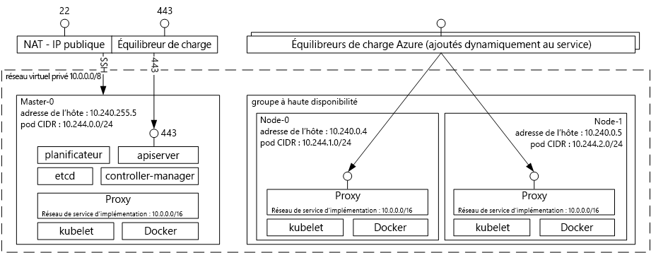

# Introduction tooAzure Service de conteneur pour KubernetesIntroduction tooAzure Container Service for Kubernetes
Service de conteneur Azure pour Kubernetes rend toocreate simple, configurer et gérer un cluster d’ordinateurs virtuels qui sont des applications préconfigurés toorun placées dans des conteneurs.Azure Container Service for Kubernetes makes it simple toocreate, configure, and manage a cluster of virtual machines that are preconfigured toorun containerized applications. Ainsi vous toouse vos compétences existantes, ou appuyer sur un corps important et croissant d’expertise de la Communauté, toodeploy et gérer les applications de conteneur basé sur Microsoft Azure.This enables you toouse your existing skills, or draw upon a large and growing body of community expertise, toodeploy and manage container-based applications on Microsoft Azure.

En utilisant le Service de conteneur Azure, vous pouvez tirer parti des hello entreprise fonctionnalités d’Azure, tout en conservant la portabilité des applications via Kubernetes et hello format d’image Docker.By using Azure Container Service, you can take advantage of hello enterprise-grade features of Azure, while still maintaining application portability through Kubernetes and hello Docker image format.

## Utilisation d’Azure Container Service pour KubernetesUsing Azure Container Service for Kubernetes
L’objectif de Service de conteneur Azure est tooprovide un environnement d’hébergement de conteneur à l’aide d’outils open-source et les technologies adoptés par nos clients aujourd'hui.Our goal with Azure Container Service is tooprovide a container hosting environment by using open-source tools and technologies that are popular among our customers today. toothis fin, nous présentons les points de terminaison Kubernetes API standard hello.toothis end, we expose hello standard Kubernetes API endpoints. À l’aide de ces points de terminaison standard, vous pouvez exploiter tout logiciel qui est capable de communiquer avec tooa Kubernetes cluster.By using these standard endpoints, you can leverage any software that is capable of talking tooa Kubernetes cluster. Par exemple, vous pourriez choisir [kubectl](https://kubernetes.io/docs/user-guide/kubectl-overview/), [helm](https://helm.sh/), ou [draft](https://github.com/Azure/draft).For example, you might choose [kubectl](https://kubernetes.io/docs/user-guide/kubectl-overview/), [helm](https://helm.sh/), or [draft](https://github.com/Azure/draft).

## Création d’un cluster Kubernetes à l’aide d’Azure Container ServiceCreating a Kubernetes cluster using Azure Container Service
toobegin à l’aide du Service de conteneur Azure, déployer un cluster de Service de conteneur Azure avec hello [Azure CLI 2.0](container-service-kubernetes-walkthrough.md) ou via le portail de hello (hello de recherche Marketplace pour **Service de conteneur Azure**).toobegin using Azure Container Service, deploy an Azure Container Service cluster with hello [Azure CLI 2.0](container-service-kubernetes-walkthrough.md) or via hello portal (search hello Marketplace for **Azure Container Service**). Si vous êtes un utilisateur expérimenté ayant besoin de davantage de contrôle sur les modèles Azure Resource Manager hello, vous pouvez utiliser d’ouvrir la source de hello [acs-moteur](https://github.com/Azure/acs-engine) projet toobuild vos propres Kubernetes personnalisées de cluster et le déployer via hello `az` CLI.If you are an advanced user who needs more control over hello Azure Resource Manager templates, you can use hello open source [acs-engine](https://github.com/Azure/acs-engine) project toobuild your own custom Kubernetes cluster and deploy it via hello `az` CLI.

### Utilisation de KubernetesUsing Kubernetes
Kubernetes automatise le déploiement, la mise à l’échelle et la gestion des applications en conteneur.Kubernetes automates deployment, scaling, and management of containerized applications. Il possède un jeu complet de fonctionnalités, notamment :It has a rich set of features including:
* Binpacking automatiqueAutomatic binpacking
* Réparation spontanéeSelf-healing
* Mise à l’échelle horizontaleHorizontal scaling
* Détection de service et équilibrage de chargeService discovery and load balancing
* Déploiements et restaurations automatisésAutomated rollouts and rollbacks
* Secret et gestion de la configurationSecret and configuration management
* Orchestration de stockageStorage orchestration
* Exécution BatchBatch execution

Diagramme architectural de Kubernetes déployé via Azure Container Service :Architectural diagram of Kubernetes deployed via Azure Container Service:

## VidéosVideos

Prise en charge de Kubernetes dans Azure Container Service (Azure Friday janvier 2017) :Kubernetes Support in Azure Container Services (Azure Friday, January 2017):

> [!VIDEO https://channel9.msdn.com/Shows/Azure-Friday/Kubernetes-Support-in-Azure-Container-Services/player]
>
>

Outils dédiés au développement et au déploiement d’applications sur Kubernetes (Azure OpenDev juin 2017) :Tools for Developing and Deploying Applications on Kubernetes (Azure OpenDev, June 2017):

> [!VIDEO https://channel9.msdn.com/Events/AzureOpenDev/June2017/Tools-for-Developing-and-Deploying-Applications-on-Kubernetes/player]
>
>

## Étapes suivantesNext steps

Explorer hello [Kubernetes Quickstart](container-service-kubernetes-walkthrough.md) toobegin Explorer le Service de conteneur Azure aujourd'hui.Explore hello [Kubernetes Quickstart](container-service-kubernetes-walkthrough.md) toobegin exploring Azure Container Service today.
