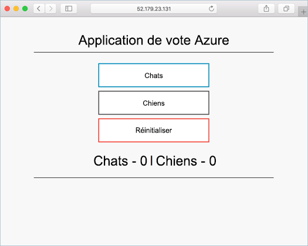

# <a name="deploy-kubernetes-cluster-for-linux-containers"></a>Déployer un cluster Azure Kubernetes pour des conteneurs Linux

Dans ce guide de démarrage rapide, un cluster Kubernetes est déployé à l’aide de hello CLI d’Azure. Une application conteneur multi composé d’un serveur web frontal et une instance de Redis est puis déployée et exécutée sur le cluster de hello. Une fois terminé, l’application hello est accessible sur internet de hello. 

exemple d’application Hello utilisé dans ce document est écrit dans Python. concepts de Hello et les étapes décrites ici peuvent être utilisé toodeploy n’importe quel conteneur de l’image dans un cluster Kubernetes. Hello code, fichier Dockerfile et le projet de toothis connexes précréé Kubernetes fichiers manifeste sont disponibles sur [GitHub](https://github.com/Azure-Samples/azure-voting-app-redis.git).



Ce démarrage rapide suppose une compréhension élémentaire des concepts de Kubernetes, pour plus d’informations sur Kubernetes voir hello [Kubernetes documentation]( https://kubernetes.io/docs/home/).

Si vous n’avez pas d’abonnement Azure, créez un [compte gratuit](https://azure.microsoft.com/free/?WT.mc_id=A261C142F) avant de commencer.

[!INCLUDE [cloud-shell-try-it.md](../../../includes/cloud-shell-try-it.md)]

Si vous choisissez tooinstall et que vous utilisez hello CLI localement, ce démarrage rapide nécessite que vous exécutez hello CLI d’Azure version 2.0.4 ou version ultérieure. Exécutez `az --version` version de hello toofind. Si vous avez besoin de tooinstall ou mise à niveau, consultez [installer Azure CLI 2.0]( /cli/azure/install-azure-cli). 

## <a name="create-a-resource-group"></a>Créer un groupe de ressources

Créer un groupe de ressources avec hello [création de groupe de az](/cli/azure/group#create) commande. Un groupe de ressources Azure est un groupe logique dans lequel des ressources Azure sont déployées et gérées. 

Hello exemple suivant crée un groupe de ressources nommé *myResourceGroup* Bonjour *westeurope* emplacement.

```azurecli-interactive 
az group create --name myResourceGroup --location westeurope
```

Output:

```json
{
  "id": "/subscriptions/00000000-0000-0000-0000-000000000000/resourceGroups/myResourceGroup",
  "location": "westeurope",
  "managedBy": null,
  "name": "myResourceGroup",
  "properties": {
    "provisioningState": "Succeeded"
  },
  "tags": null
}
```

## <a name="create-kubernetes-cluster"></a>Créer un cluster Kubernetes

Créer un cluster Kubernetes dans le Service de conteneur Azure avec hello [az acs créer](/cli/azure/acs#create) commande. Hello exemple suivant crée un cluster nommé *myK8sCluster* avec un Linux maître nœud et trois nœuds de l’agent Linux.

```azurecli-interactive 
az acs create --orchestrator-type kubernetes --resource-group myResourceGroup --name myK8sCluster --generate-ssh-keys 
```

Après quelques minutes, commande hello se termine et retourne des informations au format json sur le cluster de hello. 

## <a name="connect-toohello-cluster"></a>Se connecter toohello cluster

toomanage un cluster Kubernetes, utilisez [kubectl](https://kubernetes.io/docs/user-guide/kubectl/), client de ligne de commande Kubernetes hello. 

Si vous utilisez Azure CloudShell, l’outil kubectl est déjà installé. Si vous souhaitez tooinstall elle, vous pouvez utiliser localement hello [az acs kubernetes install-cli](/cli/azure/acs/kubernetes#install-cli) commande.

tooconfigure kubectl tooconnect tooyour Kubernetes cluster, exécutez hello [az acs kubernetes get-informations d’identification](/cli/azure/acs/kubernetes#get-credentials) commande. Cette étape télécharge les informations d’identification et configure hello Kubernetes CLI toouse les.

```azurecli-interactive 
az acs kubernetes get-credentials --resource-group=myResourceGroup --name=myK8sCluster
```

cluster de tooyour connexion tooverify hello, utilisez hello [kubectl obtenir](https://kubernetes.io/docs/user-guide/kubectl/v1.6/#get) commande tooreturn une liste de nœuds de cluster hello.

```azurecli-interactive
kubectl get nodes
```

Output:

```bash
NAME                    STATUS                     AGE       VERSION
k8s-agent-14ad53a1-0    Ready                      10m       v1.6.6
k8s-agent-14ad53a1-1    Ready                      10m       v1.6.6
k8s-agent-14ad53a1-2    Ready                      10m       v1.6.6
k8s-master-14ad53a1-0   Ready,SchedulingDisabled   10m       v1.6.6
```

## <a name="run-hello-application"></a>Exécutez l’application hello

Un fichier manifeste Kubernetes définit un état souhaité pour le cluster de hello, y compris les images de conteneur doivent s’exécuter. Pour cet exemple, un manifeste est utilisé toocreate tous les objets nécessaires toorun hello application de Vote de Azure. 

Créez un fichier nommé `azure-vote.yml` et copient il hello suivant YAML. Si vous travaillez dans Azure Cloud Shell, vous pouvez créer ce fichier à l’aide de vi ou de Nano comme si vous travailliez sur un système virtuel ou physique.

```yaml
apiVersion: apps/v1beta1
kind: Deployment
metadata:
  name: azure-vote-back
spec:
  replicas: 1
  template:
    metadata:
      labels:
        app: azure-vote-back
    spec:
      containers:
      - name: azure-vote-back
        image: redis
        ports:
        - containerPort: 6379
          name: redis
---
apiVersion: v1
kind: Service
metadata:
  name: azure-vote-back
spec:
  ports:
  - port: 6379
  selector:
    app: azure-vote-back
---
apiVersion: apps/v1beta1
kind: Deployment
metadata:
  name: azure-vote-front
spec:
  replicas: 1
  template:
    metadata:
      labels:
        app: azure-vote-front
    spec:
      containers:
      - name: azure-vote-front
        image: microsoft/azure-vote-front:redis-v1
        ports:
        - containerPort: 80
        env:
        - name: REDIS
          value: "azure-vote-back"
---
apiVersion: v1
kind: Service
metadata:
  name: azure-vote-front
spec:
  type: LoadBalancer
  ports:
  - port: 80
  selector:
    app: azure-vote-front
```

Hello d’utilisation [kubectl créer](https://kubernetes.io/docs/user-guide/kubectl/v1.6/#create) application hello de toorun de commande.

```azurecli-interactive
kubectl create -f azure-vote.yml
```

Output:

```bash
deployment "azure-vote-back" created
service "azure-vote-back" created
deployment "azure-vote-front" created
service "azure-vote-front" created
```

## <a name="test-hello-application"></a>Tester l’application hello

Comme l’application hello est exécutée, un [Kubernetes service](https://kubernetes.io/docs/concepts/services-networking/service/) est créé qu’expose hello application frontale toohello internet. Ce processus peut prendre quelques minutes toocomplete. 

cours toomonitor, utilisez hello [kubectl obtenir service](https://kubernetes.io/docs/user-guide/kubectl/v1.6/#get) avec hello `--watch` argument.

```azurecli-interactive
kubectl get service azure-vote-front --watch
```

Initialement hello **IP externe** pour hello *avant de vote d’azure* service apparaît sous la forme *en attente*. Une fois que l’adresse de hello IP externe a été modifiée à partir de *en attente* tooan *adresse IP*, utilisez `CTRL-C` processus d’observation kubectl toostop hello. 
  
```bash
azure-vote-front   10.0.34.242   <pending>     80:30676/TCP   7s
azure-vote-front   10.0.34.242   52.179.23.131   80:30676/TCP   2m
```

Vous pouvez maintenant rechercher le hello Azure Vote application pour toohello externe IP adresse toosee.

  

## <a name="delete-cluster"></a>Supprimer un cluster
Lorsque le cluster de hello n’est plus nécessaire, vous pouvez utiliser hello [suppression du groupe az](/cli/azure/group#delete) groupe de ressources tooremove hello, service de conteneur et toutes les ressources de la commande.

```azurecli-interactive 
az group delete --name myResourceGroup --yes --no-wait
```

## <a name="get-hello-code"></a>Obtenir le code de hello

Dans ce démarrage rapide, les images de conteneur créés au préalable ont été toocreate utilisé un déploiement Kubernetes. Hello liées code d’application, fichier Dockerfile, et les fichiers manifeste Kubernetes sont disponibles sur GitHub.

[https://github.com/Azure-Samples/azure-voting-app-redis](https://github.com/Azure-Samples/azure-voting-app-redis.git)

## <a name="next-steps"></a>Étapes suivantes

Dans ce guide de démarrage rapide, vous déployé un cluster Kubernetes et déployé une application conteneur multiples de tooit. 

toolearn en savoir plus sur le Service de conteneur Azure et parcourir un exemple de toodeployment de code complet, continuer le didacticiel de cluster toohello Kubernetes.

> [!div class="nextstepaction"]
> [Gérer un cluster Kubernetes ACS](./container-service-tutorial-kubernetes-prepare-app.md)
