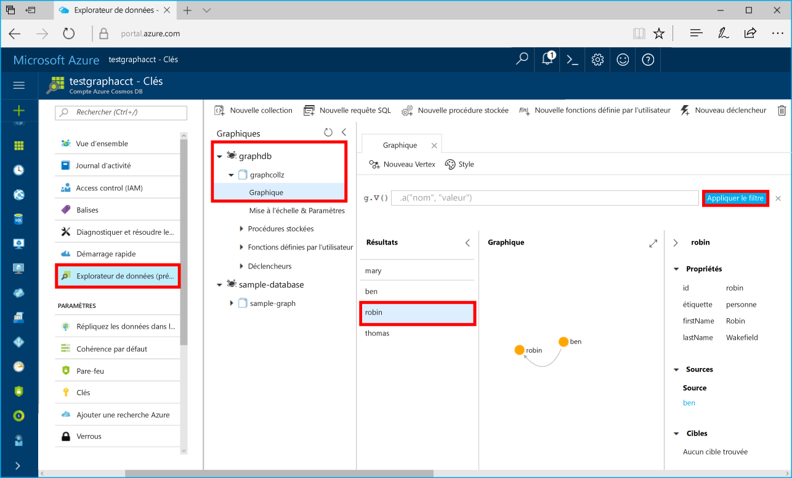

# <a name="azure-cosmos-db-build-a-net-application-using-hello-graph-api"></a>Azure Cosmos DB : Générer une application .NET à l’aide de l’API Graph de hello

Azure Cosmos DB est le service de base de données multi-modèle de Microsoft distribué à l’échelle mondiale. Vous pouvez rapidement créer et interroger des bases de données de graphique, qui bénéficient de distribution globale de hello et des fonctionnalités de mise à l’échelle horizontale au cœur de hello de base de données Azure Cosmos document et clé/valeur. 

Ce démarrage rapide montre comment toocreate un compte de base de données Azure Cosmos, base de données et à l’aide du graphique (conteneur) hello portail Azure. Vous puis créer et exécuter une application de console basée sur hello [API Graph](graph-sdk-dotnet.md) (version préliminaire).  

## <a name="prerequisites"></a>Composants requis

Si vous n’avez pas encore Visual Studio 2017 installé, vous pouvez télécharger et utiliser hello **libre** [2017 de Visual Studio Community Edition](https://www.visualstudio.com/downloads/). Assurez-vous que vous activez **le développement Azure** pendant l’installation de Visual Studio hello.

[!INCLUDE [quickstarts-free-trial-note](../../includes/quickstarts-free-trial-note.md)]

## <a name="create-a-database-account"></a>Création d'un compte de base de données

[!INCLUDE [cosmos-db-create-dbaccount-graph](../../includes/cosmos-db-create-dbaccount-graph.md)]

## <a name="add-a-graph"></a>Ajout d’un graphique

[!INCLUDE [cosmos-db-create-graph](../../includes/cosmos-db-create-graph.md)]

## <a name="clone-hello-sample-application"></a>Exemple d’application hello de cloner

Maintenant, nous allons une API graphique le clonage d’application à partir de github, définir la chaîne de connexion hello et exécutez-le. Vous allez voir combien il est facile toowork avec des données par programme. 

1. Ouvrez une fenêtre de Terminal Server git, telles que l’interpréteur de commandes git, et `cd` répertoire de travail tooa.  

2. Exécutez hello suivant le dépôt d’exemples de commande tooclone hello. 

    ```bash
    git clone https://github.com/Azure-Samples/azure-cosmos-db-graph-dotnet-getting-started.git
    ```

3. Ouvrez Visual Studio et fichier de solution hello ouvert. 

## <a name="review-hello-code"></a>Réviser le code hello

Nous allons effectuer une révision rapide de ce qui se passe dans l’application hello. Fichier de Program.cs hello ouvert et que vous trouverez ces lignes de code créent hello des ressources de base de données Azure Cosmos. 

* Hello DocumentClient est initialisé. Dans l’aperçu de hello, nous avons ajouté une API d’extension graphique sur le client de base de données Azure Cosmos hello. Nous travaillons sur un client de graphique autonome dissocié des ressources et de client de base de données Azure Cosmos hello.

    ```csharp
    using (DocumentClient client = new DocumentClient(
        new Uri(endpoint),
        authKey,
        new ConnectionPolicy { ConnectionMode = ConnectionMode.Direct, ConnectionProtocol = Protocol.Tcp }))
    ```

* Une nouvelle base de données est créée.

    ```csharp
    Database database = await client.CreateDatabaseIfNotExistsAsync(new Database { Id = "graphdb" });
    ```

* Un nouveau graphique est créé.

    ```csharp
    DocumentCollection graph = await client.CreateDocumentCollectionIfNotExistsAsync(
        UriFactory.CreateDatabaseUri("graphdb"),
        new DocumentCollection { Id = "graph" },
        new RequestOptions { OfferThroughput = 1000 });
    ```
* Une série d’étapes de GREMLINE sont exécutées à l’aide de hello `CreateGremlinQuery` (méthode).

    ```csharp
    // hello CreateGremlinQuery method extensions allow you tooexecute Gremlin queries and iterate
    // results asychronously
    IDocumentQuery<dynamic> query = client.CreateGremlinQuery<dynamic>(graph, "g.V().count()");
    while (query.HasMoreResults)
    {
        foreach (dynamic result in await query.ExecuteNextAsync())
        {
            Console.WriteLine($"\t {JsonConvert.SerializeObject(result)}");
        }
    }

    ```

## <a name="update-your-connection-string"></a>Mise à jour de votre chaîne de connexion

Revenez toohello tooget portail Azure vos informations de chaîne de connexion et le copier dans une application hello.

1. Dans Visual Studio 2017, ouvrez le fichier App.config de hello. 

2. Bonjour portail Azure, dans votre compte de base de données Azure Cosmos, cliquez sur **clés** Bonjour barre de navigation gauche. 

    

3. Copiez votre **URI** à partir du portail de hello et le rendre hello la valeur de clé de point de terminaison hello dans App.config. Vous pouvez utiliser le bouton Copier de hello comme indiqué dans hello précédant la valeur de capture d’écran toocopy hello.

    `<add key="Endpoint" value="https://FILLME.documents.azure.com:443" />`

4. Copiez votre **clé primaire** à partir du portail de hello et le rendre hello la valeur de clé de AuthKey hello dans App.config, puis enregistrez vos modifications. 

    `<add key="AuthKey" value="FILLME" />`

Vous avez maintenant d’une mise à jour de votre application avec toutes informations hello lui toocommunicate avec la base de données Azure Cosmos. 

## <a name="run-hello-console-app"></a>Exécutez l’application de console hello

1. Dans Visual Studio, cliquez sur hello **GraphGetStarted** projet **l’Explorateur de solutions** puis cliquez sur **gérer les Packages NuGet**. 

2. Bonjour NuGet **Parcourir** , tapez *Microsoft.Azure.Graphs* et vérifiez hello **inclut la version préliminaire** boîte. 

3. À partir des résultats de hello, installez hello **Microsoft.Azure.Graphs** bibliothèque. Cette opération installe le package de bibliothèque d’extension du graphique de base de données Azure Cosmos hello et toutes les dépendances.

    Si vous obtenez un message sur la vérification des modifications toohello solution, cliquez sur **OK**. Si vous obtenez un message concernant l’acceptation de la licence, cliquez sur **J’accepte**.

4. Cliquez sur CTRL + F5 application hello de toorun.

   fenêtre de console Hello affiche les sommets hello et bords ajoutés toohello graphique. Lorsque hello script terminé, appuyez sur entrée à deux reprises les fenêtre de console hello tooclose. 

## <a name="browse-using-hello-data-explorer"></a>Accédez à l’aide de hello Explorateur de données

Vous pouvez maintenant revenir en arrière tooData Explorer Bonjour portail Azure et parcourir et interroger vos nouvelles données de graphique.

1. Dans l’Explorateur de données, la nouvelle base de données hello s’affiche dans le volet de graphiques hello. Développez **graphdb**, **graphcollz**, puis cliquez sur **Graphique**.

2. Cliquez sur hello **appliquer le filtre** de requête par défaut de bouton toouse hello tooview tous les verticies hello dans le graphique de hello. données Hello générées par application d’exemple hello s’affiche dans le volet de graphiques hello.

    Vous pouvez effectuer un zoom et graphique de hello, vous pouvez développer l’espace d’affichage graphique hello, ajouter verticies supplémentaires et déplacer la surface d’affichage verticies sur hello.

    

## <a name="review-slas-in-hello-azure-portal"></a>Passez en revue les SLA dans hello portail Azure

[!INCLUDE [cosmosdb-tutorial-review-slas](../../includes/cosmos-db-tutorial-review-slas.md)]

## <a name="clean-up-resources"></a>Supprimer des ressources

Si vous n’allez toocontinue toouse cette application, supprimez toutes les ressources créées par ce démarrage rapide Bonjour portail Azure par hello comme suit : 

1. À partir du menu de gauche hello Bonjour portail Azure, cliquez sur **groupes de ressources** puis cliquez sur nom hello de ressource hello vous avez créé. 
2. Dans la page de votre groupe de ressources, cliquez sur **supprimer**, tapez nom hello de hello ressources toodelete dans la zone de texte hello, puis cliquez sur **supprimer**.

## <a name="next-steps"></a>Étapes suivantes

Ce guide de démarrage rapide, vous avez appris comment toocreate un compte de base de données Azure Cosmos, créer un graphique à l’aide de hello Explorateur de données et exécuter une application. Vous pouvez maintenant générer des requêtes plus complexes et implémenter une logique de traversée de graphique puissante, à l’aide de Gremlin. 

> [!div class="nextstepaction"]
> [Interroger à l’aide de Gremlin](tutorial-query-graph.md)

