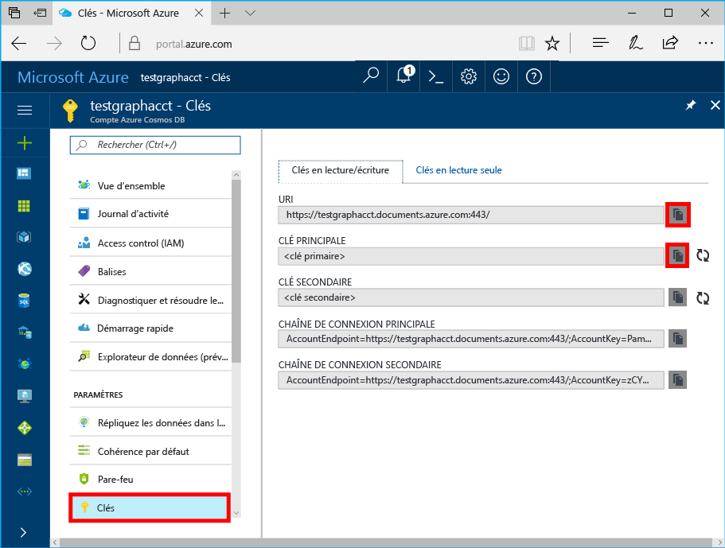

# <a name="azure-cosmos-db-create-query-and-traverse-a-graph-in-hello-gremlin-console"></a>Azure Cosmos DB : Créer, interroger et parcourir un graphique dans la console hello GREMLINE

Azure Cosmos DB est le service de base de données multi-modèle de Microsoft distribué à l’échelle mondiale. Vous pouvez rapidement créer et interroger des bases de données de graphique, qui bénéficient de distribution globale de hello et des fonctionnalités de mise à l’échelle horizontale au cœur de hello de base de données Azure Cosmos document et clé/valeur. 

Ce démarrage rapide montre comment toocreate un compte de base de données Azure Cosmos, base de données et à l’aide du graphique (conteneur) hello portail Azure, puis utilisez hello [GREMLINE Console](https://tinkerpop.apache.org/docs/current/reference/#gremlin-console) de [Apache TinkerPop](http://tinkerpop.apache.org) toowork avec Graphique des données de l’API (version préliminaire). Dans ce didacticiel, vous créez et interrogez les sommets et les bords, mise à jour d’une propriété de sommets, interroger les sommets, parcourent le graphique de hello et supprimer un sommet.


console de GREMLINE Hello est Groovy/Java s’exécute sur Windows, Mac et Linux. Vous pouvez le télécharger depuis hello [Apache TinkerPop site](https://www.apache.org/dyn/closer.lua/tinkerpop/3.2.5/apache-tinkerpop-gremlin-console-3.2.5-bin.zip).

## <a name="prerequisites"></a>Composants requis

Vous devez toohave une toocreate d’abonnement Azure un compte de base de données Azure Cosmos pour ce démarrage rapide.

[!INCLUDE [quickstarts-free-trial-note](../../includes/quickstarts-free-trial-note.md)]

Vous devez également tooinstall hello [GREMLINE Console](http://tinkerpop.apache.org/). Utilisez la version 3.2.5 ou supérieure.

## <a name="create-a-database-account"></a>Création d'un compte de base de données

[!INCLUDE [cosmos-db-create-dbaccount-graph](../../includes/cosmos-db-create-dbaccount-graph.md)]

## <a name="add-a-graph"></a>Ajout d’un graphique

[!INCLUDE [cosmos-db-create-graph](../../includes/cosmos-db-create-graph.md)]

## <a id="ConnectAppService"></a>Se connecter tooyour du service d’applications
1. Avant de démarrer hello GREMLINE Console, créer ou modifier hello à distance-secure.yaml configuration fichier hello apache-tinkerpop-gremlin-console-3.2.5/conf répertoire.
2. Renseignez vos configurations *hôte*, *port*, *nom d’utilisateur*, *mot de passe*, *connectionPool* et *sérialiseur* :

    Paramètre|Valeur suggérée|Description
    ---|---|---
    hôtes|[***.graphs.azure.com]|Reportez-vous à la capture d’écran ci-dessous. Valeur d’URI de GREMLINE hello sur la page de vue d’ensemble de hello Hello portail Azure, entre crochets, suivi d’un hello : 443 / supprimé.<br><br>Cette valeur peut également être récupérée à partir de l’onglet de clés hello, à l’aide de la valeur de l’URI hello en supprimant https://, la modification de documents toographs et suppression de fin hello : 443 /.
    port|443|Définissez too443.
    username|*Votre nom d’utilisateur*|Hello ressource sous forme de hello `/dbs/<db>/colls/<coll>` où `<db>` est le nom de votre base de données et `<coll>` est votre nom de la collection.
    password|*Votre clé primaire*| Reportez-vous à la deuxième capture d’écran ci-dessous. Il s’agit de votre clé primaire, que vous pouvez récupérer à partir de la page de clés hello Hello portail Azure, dans la zone de clé primaire hello. Utilisez le bouton de copie de hello sur le côté gauche de hello de valeur de hello zone toocopy hello.
    connectionPool|{enableSsl: true}|Votre paramètre de pool de connexions pour SSL.
    serializer|{ className: org.apache.tinkerpop.gremlin.<br>driver.ser.GraphSONMessageSerializerV1d0,<br> config: {serializeResultToString: true }}|La valeur toothis et supprimez celles `\n` lors du collage dans la valeur de hello les sauts de ligne.

    Pour la valeur d’hôtes hello, copiez hello **GREMLINE URI** valeur hello **vue d’ensemble** page : 

    Pour la valeur de mot de passe de hello, copiez hello **clé primaire** de hello **clés** page : 


3. Dans votre Terminal Server, exécutez `bin/gremlin.bat` ou `bin/gremlin.sh` toostart hello [GREMLINE Console](http://tinkerpop.apache.org/docs/3.2.5/tutorials/getting-started/).
4. Dans votre Terminal Server, exécutez `:remote connect tinkerpop.server conf/remote-secure.yaml` tooconnect tooyour du service d’applications.

    > [!TIP]
    > Si vous recevez une erreur de hello `No appenders could be found for logger` garantir la mise à jour hello sérialiseur valeur hello à distance-secure.yaml fichier comme décrit à l’étape 2. 

Parfait ! Maintenant que nous avons terminé le programme d’installation Bonjour, nous pouvons commencer en cours d’exécution des commandes de la console.

Essayons une simple commande count(). Tapez hello qui suit dans la console hello invite hello :
```
:> g.V().count()
```

> [!TIP]
> Hello d’avis `:>` qui précède hello `g.V().count()` texte ? 
>
> Cela fait partie de la commande hello que vous devez tootype. Il est important lors de l’utilisation de la console GREMLINE hello, avec la base de données Azure Cosmos.  
>
> L’omission de cette `:>` instruit hello console tooexecute commande hello localement, souvent sur un graphique en mémoire.
> L’utilisation de cette `:>` indique hello console tooexecute une commande à distance, dans ce cas par rapport à la base de données Cosmos (l’émulateur de localhost hello, ou > instance Azure).


## <a name="create-vertices-and-edges"></a>Création de vertex et de bords

Commençons par ajouter des vertex pour cinq personnes : *Thomas*, *Mary Kay*, *Robin*, *Ben* et *Jack*.

Entrée (Thomas) :

```
:> g.addV('person').property('firstName', 'Thomas').property('lastName', 'Andersen').property('age', 44).property('userid', 1)
```

Output:

```
==>[id:796cdccc-2acd-4e58-a324-91d6f6f5ed6d,label:person,type:vertex,properties:[firstName:[[id:f02a749f-b67c-4016-850e-910242d68953,value:Thomas]],lastName:[[id:f5fa3126-8818-4fda-88b0-9bb55145ce5c,value:Andersen]],age:[[id:f6390f9c-e563-433e-acbf-25627628016e,value:44]],userid:[[id:796cdccc-2acd-4e58-a324-91d6f6f5ed6d|userid,value:1]]]]
```
Entrée (Mary Kay) :

```
:> g.addV('person').property('firstName', 'Mary Kay').property('lastName', 'Andersen').property('age', 39).property('userid', 2)

```

Output:

```
==>[id:0ac9be25-a476-4a30-8da8-e79f0119ea5e,label:person,type:vertex,properties:[firstName:[[id:ea0604f8-14ee-4513-a48a-1734a1f28dc0,value:Mary Kay]],lastName:[[id:86d3bba5-fd60-4856-9396-c195ef7d7f4b,value:Andersen]],age:[[id:bc81b78d-30c4-4e03-8f40-50f72eb5f6da,value:39]],userid:[[id:0ac9be25-a476-4a30-8da8-e79f0119ea5e|userid,value:2]]]]

```

Entrée (Robin) :

```
:> g.addV('person').property('firstName', 'Robin').property('lastName', 'Wakefield').property('userid', 3)
```

Output:

```
==>[id:8dc14d6a-8683-4a54-8d74-7eef1fb43a3e,label:person,type:vertex,properties:[firstName:[[id:ec65f078-7a43-4cbe-bc06-e50f2640dc4e,value:Robin]],lastName:[[id:a3937d07-0e88-45d3-a442-26fcdfb042ce,value:Wakefield]],userid:[[id:8dc14d6a-8683-4a54-8d74-7eef1fb43a3e|userid,value:3]]]]
```

Entrée (Ben) :

```
:> g.addV('person').property('firstName', 'Ben').property('lastName', 'Miller').property('userid', 4)

```

Output:

```
==>[id:ee86b670-4d24-4966-9a39-30529284b66f,label:person,type:vertex,properties:[firstName:[[id:a632469b-30fc-4157-840c-b80260871e9a,value:Ben]],lastName:[[id:4a08d307-0719-47c6-84ae-1b0b06630928,value:Miller]],userid:[[id:ee86b670-4d24-4966-9a39-30529284b66f|userid,value:4]]]]
```

Entrée (Jack) :

```
:> g.addV('person').property('firstName', 'Jack').property('lastName', 'Connor').property('userid', 5)
```

Output:

```
==>[id:4c835f2a-ea5b-43bb-9b6b-215488ad8469,label:person,type:vertex,properties:[firstName:[[id:4250824e-4b72-417f-af98-8034aa15559f,value:Jack]],lastName:[[id:44c1d5e1-a831-480a-bf94-5167d133549e,value:Connor]],userid:[[id:4c835f2a-ea5b-43bb-9b6b-215488ad8469|userid,value:5]]]]
```


Ensuite, ajoutons des bords pour les relations entre ces personnes.

Entrée (Thomas -> Mary Kay) :

```
:> g.V().hasLabel('person').has('firstName', 'Thomas').addE('knows').to(g.V().hasLabel('person').has('firstName', 'Mary Kay'))
```

Output:

```
==>[id:c12bf9fb-96a1-4cb7-a3f8-431e196e702f,label:knows,type:edge,inVLabel:person,outVLabel:person,inV:0d1fa428-780c-49a5-bd3a-a68d96391d5c,outV:1ce821c6-aa3d-4170-a0b7-d14d2a4d18c3]
```

Entrée (Thomas -> Robin) :

```
:> g.V().hasLabel('person').has('firstName', 'Thomas').addE('knows').to(g.V().hasLabel('person').has('firstName', 'Robin'))
```

Output:

```
==>[id:58319bdd-1d3e-4f17-a106-0ddf18719d15,label:knows,type:edge,inVLabel:person,outVLabel:person,inV:3e324073-ccfc-4ae1-8675-d450858ca116,outV:1ce821c6-aa3d-4170-a0b7-d14d2a4d18c3]
```

Entrée (Robin -> Ben) :

```
:> g.V().hasLabel('person').has('firstName', 'Robin').addE('knows').to(g.V().hasLabel('person').has('firstName', 'Ben'))
```

Output:

```
==>[id:889c4d3c-549e-4d35-bc21-a3d1bfa11e00,label:knows,type:edge,inVLabel:person,outVLabel:person,inV:40fd641d-546e-412a-abcc-58fe53891aab,outV:3e324073-ccfc-4ae1-8675-d450858ca116]
```

## <a name="update-a-vertex"></a>Mise à jour d’un vertex

Nous allons mettre à jour hello *Thomas* vertex avec une nouvelle durée de vie de *45*.

Entrée :
```
:> g.V().hasLabel('person').has('firstName', 'Thomas').property('age', 45)
```
Output:

```
==>[id:ae36f938-210e-445a-92df-519f2b64c8ec,label:person,type:vertex,properties:[firstName:[[id:872090b6-6a77-456a-9a55-a59141d4ebc2,value:Thomas]],lastName:[[id:7ee7a39a-a414-4127-89b4-870bc4ef99f3,value:Andersen]],age:[[id:a2a75d5a-ae70-4095-806d-a35abcbfe71d,value:45]]]]
```

## <a name="query-your-graph"></a>Interrogation de votre graphique

À présent, exécutons différentes requêtes sur votre graphique.

Tout d’abord, nous allons essayez une requête avec un filtre tooreturn, seuls ceux qui est antérieurs à 40 ans.

Entrée (requête de filtre) :

```
:> g.V().hasLabel('person').has('age', gt(40))
```

Output:

```
==>[id:ae36f938-210e-445a-92df-519f2b64c8ec,label:person,type:vertex,properties:[firstName:[[id:872090b6-6a77-456a-9a55-a59141d4ebc2,value:Thomas]],lastName:[[id:7ee7a39a-a414-4127-89b4-870bc4ef99f3,value:Andersen]],age:[[id:a2a75d5a-ae70-4095-806d-a35abcbfe71d,value:45]]]]
```

Ensuite, nous allons projet prénom hello pour les personnes hello datent de plus de 40 ans.

Entrée (filtre + requête de projection) :

```
:> g.V().hasLabel('person').has('age', gt(40)).values('firstName')
```

Output:

```
==>Thomas
```

## <a name="traverse-your-graph"></a>Traversée du graphique

Nous allons parcourir hello graphique tooreturn tous les amis de Thomas.

Entrée (amis de Thomas) :

```
:> g.V().hasLabel('person').has('firstName', 'Thomas').outE('knows').inV().hasLabel('person')
```

Output: 

```
==>[id:f04bc00b-cb56-46c4-a3bb-a5870c42f7ff,label:person,type:vertex,properties:[firstName:[[id:14feedec-b070-444e-b544-62be15c7167c,value:Mary Kay]],lastName:[[id:107ab421-7208-45d4-b969-bbc54481992a,value:Andersen]],age:[[id:4b08d6e4-58f5-45df-8e69-6b790b692e0a,value:39]]]]
==>[id:91605c63-4988-4b60-9a30-5144719ae326,label:person,type:vertex,properties:[firstName:[[id:f760e0e6-652a-481a-92b0-1767d9bf372e,value:Robin]],lastName:[[id:352a4caa-bad6-47e3-a7dc-90ff342cf870,value:Wakefield]]]]
```

Ensuite, effectuons une couche de suivante hello des sommets. Parcourir hello graphique tooreturn tous les amis hello les amis de Thomas.

Entrée (amis des amis de Thomas) :

```
:> g.V().hasLabel('person').has('firstName', 'Thomas').outE('knows').inV().hasLabel('person').outE('knows').inV().hasLabel('person')
```
Output:

```
==>[id:a801a0cb-ee85-44ee-a502-271685ef212e,label:person,type:vertex,properties:[firstName:[[id:b9489902-d29a-4673-8c09-c2b3fe7f8b94,value:Ben]],lastName:[[id:e084f933-9a4b-4dbc-8273-f0171265cf1d,value:Miller]]]]
```

## <a name="drop-a-vertex"></a>Suppression d’un vertex

Nous allons maintenant supprimer un sommet à partir de la base de données de graphique hello.

Entrée (suppression du vertex de Jack) :

```
:> g.V().hasLabel('person').has('firstName', 'Jack').drop()
```

## <a name="clear-your-graph"></a>Effacement de tout le contenu de votre graphique

Enfin, nous allons effacer de base de données hello de sommets et de bords.

Entrée :

```
:> g.E().drop()
:> g.V().drop()
```

Félicitations ! Vous avez terminé ce tutoriel Azure Cosmos DB : API Graph !

## <a name="review-slas-in-hello-azure-portal"></a>Passez en revue les SLA dans hello portail Azure

[!INCLUDE [cosmosdb-tutorial-review-slas](../../includes/cosmos-db-tutorial-review-slas.md)]

## <a name="clean-up-resources"></a>Supprimer des ressources

Si vous n’allez toocontinue toouse cette application, supprimez toutes les ressources créées par ce démarrage rapide Bonjour portail Azure par hello comme suit :  

1. À partir du menu de gauche hello Bonjour portail Azure, cliquez sur **groupes de ressources** puis cliquez sur nom hello de ressource hello vous avez créé. 
2. Dans la page de votre groupe de ressources, cliquez sur **supprimer**, tapez nom hello de hello ressources toodelete dans la zone de texte hello, puis cliquez sur **supprimer**.

## <a name="next-steps"></a>Étapes suivantes

Ce guide de démarrage rapide, vous avez appris comment toocreate un compte de base de données Azure Cosmos, créer un graphique à l’aide de hello Explorateur de données, créer des sommets et des arêtes et parcourir votre graphique à l’aide de la console de GREMLINE hello. Vous pouvez maintenant générer des requêtes plus complexes et implémenter une logique de traversée de graphique puissante, à l’aide de Gremlin. 

> [!div class="nextstepaction"]
> [Interroger à l’aide de Gremlin](tutorial-query-graph.md)
