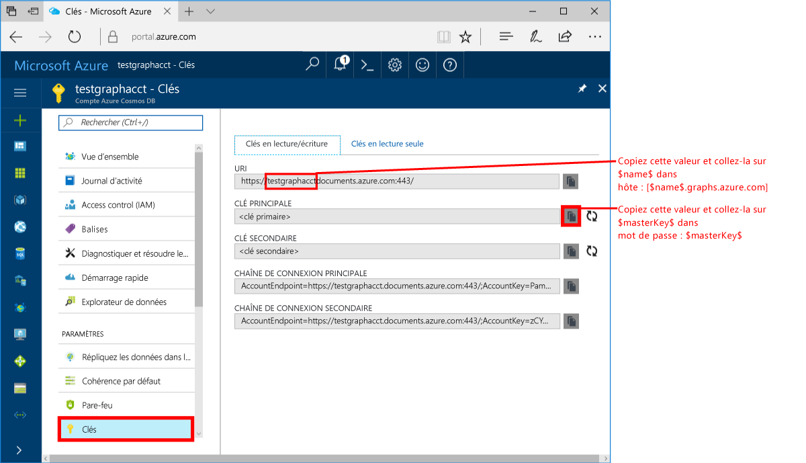
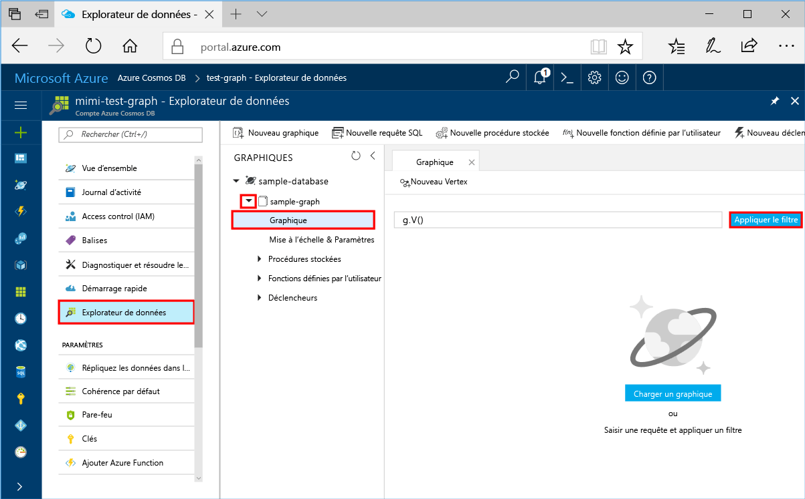
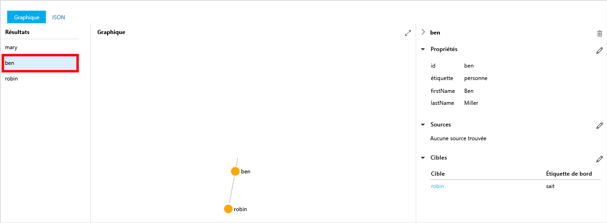
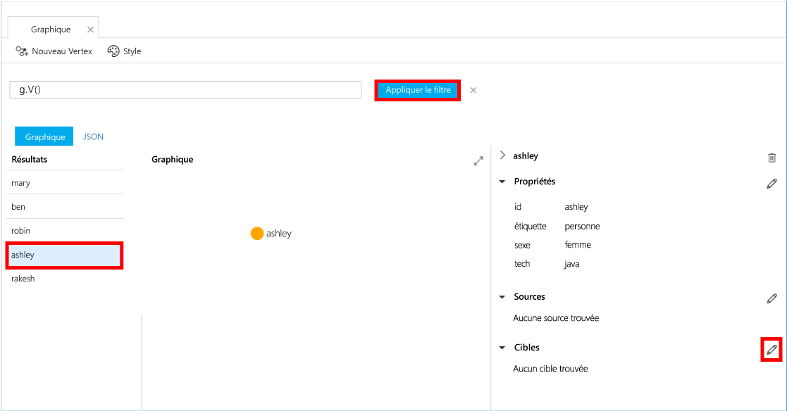
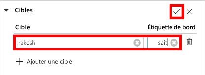
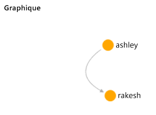

# <a name="azure-cosmos-db-create-a-graph-database-using-java-and-the-azure-portal"></a><span data-ttu-id="01214-103">Azure Cosmos DB : créer une base de données de graphiques à l’aide de Java et du portail Azure</span><span class="sxs-lookup"><span data-stu-id="01214-103">Azure Cosmos DB: Create a graph database using Java and the Azure portal</span></span>

<span data-ttu-id="01214-104">Azure Cosmos DB est le service de base de données multi-modèle de Microsoft distribué à l’échelle mondiale.</span><span class="sxs-lookup"><span data-stu-id="01214-104">Azure Cosmos DB is Microsoft’s globally distributed multi-model database service.</span></span> <span data-ttu-id="01214-105">Rapidement, vous avez la possibilité de créer et d’interroger des documents, des paires clé/valeur, et des bases de données orientées graphe, profitant tous de la distribution à l’échelle mondiale et des capacités de mise à l’échelle horizontale au cœur d’Azure Cosmos DB.</span><span class="sxs-lookup"><span data-stu-id="01214-105">You can quickly create and query document, key/value, and graph databases, all of which benefit from the global distribution and horizontal scale capabilities at the core of Azure Cosmos DB.</span></span> 

<span data-ttu-id="01214-106">Ce guide de démarrage rapide crée une base de données de graphiques à l’aide des outils du portail Azure pour Azure Cosmos DB.</span><span class="sxs-lookup"><span data-stu-id="01214-106">This quickstart creates a graph database using the Azure portal tools for Azure Cosmos DB.</span></span> <span data-ttu-id="01214-107">Ce guide vous indique également comment créer rapidement une application console Java au moyen d’une base de données de graphiques en utilisant le pilote [Gremlin Java](https://mvnrepository.com/artifact/org.apache.tinkerpop/gremlin-driver) OSS.</span><span class="sxs-lookup"><span data-stu-id="01214-107">This quickstart also shows you how to quickly create a Java console app using a graph database using the OSS [Gremlin Java](https://mvnrepository.com/artifact/org.apache.tinkerpop/gremlin-driver) driver.</span></span> <span data-ttu-id="01214-108">Les instructions de ce guide de démarrage rapide s’appliquent à tous les systèmes d’exploitation pouvant exécuter Java.</span><span class="sxs-lookup"><span data-stu-id="01214-108">The instructions in this quickstart can be followed on any operating system that is capable of running Java.</span></span> <span data-ttu-id="01214-109">Avec ce guide de démarrage rapide, vous saurez comment créer et modifier des ressources de graphique dans l’interface utilisateur ou par programme, selon la méthode que vous préférez.</span><span class="sxs-lookup"><span data-stu-id="01214-109">This quickstart familiarizes you with creating and modifying graph resources in either the UI or programmatically, whichever is your preference.</span></span> 

## <a name="prerequisites"></a><span data-ttu-id="01214-110">Composants requis</span><span class="sxs-lookup"><span data-stu-id="01214-110">Prerequisites</span></span>

* [<span data-ttu-id="01214-111">Java Development Kit (JDK) 1.7+</span><span class="sxs-lookup"><span data-stu-id="01214-111">Java Development Kit (JDK) 1.7+</span></span>](http://www.oracle.com/technetwork/java/javase/downloads/jdk8-downloads-2133151.html)
    * <span data-ttu-id="01214-112">Sur Ubuntu, exécutez `apt-get install default-jdk` pour installer le JDK.</span><span class="sxs-lookup"><span data-stu-id="01214-112">On Ubuntu, run `apt-get install default-jdk` to install the JDK.</span></span>
    * <span data-ttu-id="01214-113">Veillez à définir la variable d’environnement JAVA_HOME pour qu’elle pointe vers le dossier dans lequel le JDK est installé.</span><span class="sxs-lookup"><span data-stu-id="01214-113">Be sure to set the JAVA_HOME environment variable to point to the folder where the JDK is installed.</span></span>
* <span data-ttu-id="01214-114">[Téléchargement](http://maven.apache.org/download.cgi) et [installation](http://maven.apache.org/install.html) d’une archive binaire [Maven](http://maven.apache.org/)</span><span class="sxs-lookup"><span data-stu-id="01214-114">[Download](http://maven.apache.org/download.cgi) and [install](http://maven.apache.org/install.html) a [Maven](http://maven.apache.org/) binary archive</span></span>
    * <span data-ttu-id="01214-115">Sur Ubuntu, vous pouvez exécuter `apt-get install maven` pour installer Maven.</span><span class="sxs-lookup"><span data-stu-id="01214-115">On Ubuntu, you can run `apt-get install maven` to install Maven.</span></span>
* [<span data-ttu-id="01214-116">Git</span><span class="sxs-lookup"><span data-stu-id="01214-116">Git</span></span>](https://www.git-scm.com/)
    * <span data-ttu-id="01214-117">Sur Ubuntu, vous pouvez exécuter `sudo apt-get install git` pour installer Git.</span><span class="sxs-lookup"><span data-stu-id="01214-117">On Ubuntu, you can run `sudo apt-get install git` to install Git.</span></span>

[!INCLUDE [quickstarts-free-trial-note](../../includes/quickstarts-free-trial-note.md)]

## <a name="create-a-database-account"></a><span data-ttu-id="01214-118">Création d'un compte de base de données</span><span class="sxs-lookup"><span data-stu-id="01214-118">Create a database account</span></span>

<span data-ttu-id="01214-119">Pour être en mesure de créer une base de données de graphiques, vous devez avoir préalablement créé un compte de base de données (Graphique) Gremlin avec Azure Cosmos DB.</span><span class="sxs-lookup"><span data-stu-id="01214-119">Before you can create a graph database, you need to create a Gremlin (Graph) database account with Azure Cosmos DB.</span></span>

[!INCLUDE [cosmos-db-create-dbaccount-graph](../../includes/cosmos-db-create-dbaccount-graph.md)]

## <a name="add-a-graph"></a><span data-ttu-id="01214-120">Ajout d’un graphique</span><span class="sxs-lookup"><span data-stu-id="01214-120">Add a graph</span></span>

<span data-ttu-id="01214-121">Vous pouvez désormais utiliser l’outil Explorateur de données dans le portail Azure pour créer une base de données de graphiques.</span><span class="sxs-lookup"><span data-stu-id="01214-121">You can now use the Data Explorer tool in the Azure portal to create a graph database.</span></span> 

1. <span data-ttu-id="01214-122">Dans le menu de navigation de gauche du portail Azure, cliquez sur **Explorateur de données** (version d’évaluation).</span><span class="sxs-lookup"><span data-stu-id="01214-122">In the Azure portal, in the left navigation menu, click **Data Explorer (Preview)**.</span></span> 
2. <span data-ttu-id="01214-123">Dans le panneau **Explorateur de données (version d’évaluation)**, cliquez sur **Nouveau graphique**, puis renseignez la page à l’aide des informations suivantes :</span><span class="sxs-lookup"><span data-stu-id="01214-123">In the **Data Explorer (Preview)** blade, click **New Graph**, then fill in the page using the following information:</span></span>

    

    <span data-ttu-id="01214-125">Paramètre</span><span class="sxs-lookup"><span data-stu-id="01214-125">Setting</span></span>|<span data-ttu-id="01214-126">Valeur suggérée</span><span class="sxs-lookup"><span data-stu-id="01214-126">Suggested value</span></span>|<span data-ttu-id="01214-127">Description</span><span class="sxs-lookup"><span data-stu-id="01214-127">Description</span></span>
    ---|---|---
    <span data-ttu-id="01214-128">ID de base de données</span><span class="sxs-lookup"><span data-stu-id="01214-128">Database ID</span></span>|<span data-ttu-id="01214-129">sample-database</span><span class="sxs-lookup"><span data-stu-id="01214-129">sample-database</span></span>|<span data-ttu-id="01214-130">L’ID de votre nouvelle base de données.</span><span class="sxs-lookup"><span data-stu-id="01214-130">The ID for your new database.</span></span> <span data-ttu-id="01214-131">Les noms de base de données doivent inclure entre 1 et 255 caractères et ne peuvent pas contenir `/ \ # ?` ni d’espace de fin.</span><span class="sxs-lookup"><span data-stu-id="01214-131">Database names must be between 1 and 255 characters, and cannot contain `/ \ # ?` or a trailing space.</span></span>
    <span data-ttu-id="01214-132">ID du graphique</span><span class="sxs-lookup"><span data-stu-id="01214-132">Graph ID</span></span>|<span data-ttu-id="01214-133">sample-graph</span><span class="sxs-lookup"><span data-stu-id="01214-133">sample-graph</span></span>|<span data-ttu-id="01214-134">L’ID de votre nouveau graphique.</span><span class="sxs-lookup"><span data-stu-id="01214-134">The ID for your new graph.</span></span> <span data-ttu-id="01214-135">Les noms de graphiques sont soumis aux mêmes exigences de nombre de caractères que les ID de bases de données.</span><span class="sxs-lookup"><span data-stu-id="01214-135">Graph names have the same character requirements as database ids.</span></span>
    <span data-ttu-id="01214-136">Capacité de stockage</span><span class="sxs-lookup"><span data-stu-id="01214-136">Storage Capacity</span></span>| <span data-ttu-id="01214-137">10 Go</span><span class="sxs-lookup"><span data-stu-id="01214-137">10 GB</span></span>|<span data-ttu-id="01214-138">Conservez la valeur par défaut.</span><span class="sxs-lookup"><span data-stu-id="01214-138">Leave the default value.</span></span> <span data-ttu-id="01214-139">Il s’agit de la capacité de stockage de la base de données.</span><span class="sxs-lookup"><span data-stu-id="01214-139">This is the storage capacity of the database.</span></span>
    <span data-ttu-id="01214-140">Débit</span><span class="sxs-lookup"><span data-stu-id="01214-140">Throughput</span></span>|<span data-ttu-id="01214-141">400 unités de requête</span><span class="sxs-lookup"><span data-stu-id="01214-141">400 RUs</span></span>|<span data-ttu-id="01214-142">Conservez la valeur par défaut.</span><span class="sxs-lookup"><span data-stu-id="01214-142">Leave the default value.</span></span> <span data-ttu-id="01214-143">Vous pourrez augmenter le débit ultérieurement si vous souhaitez réduire la latence.</span><span class="sxs-lookup"><span data-stu-id="01214-143">You can scale up the throughput later if you want to reduce latency.</span></span>
    <span data-ttu-id="01214-144">Clé de partition</span><span class="sxs-lookup"><span data-stu-id="01214-144">Partition key</span></span>|<span data-ttu-id="01214-145">Laisser vide</span><span class="sxs-lookup"><span data-stu-id="01214-145">Leave blank</span></span>|<span data-ttu-id="01214-146">Pour les besoins de ce guide de démarrage rapide, ne renseignez pas la clé de partition.</span><span class="sxs-lookup"><span data-stu-id="01214-146">For the purpose of this quickstart, leave the partition key blank.</span></span>

3. <span data-ttu-id="01214-147">Une fois le formulaire rempli, cliquez sur **OK**.</span><span class="sxs-lookup"><span data-stu-id="01214-147">Once the form is filled out, click **OK**.</span></span>

## <a name="clone-the-sample-application"></a><span data-ttu-id="01214-148">Clonage de l’exemple d’application</span><span class="sxs-lookup"><span data-stu-id="01214-148">Clone the sample application</span></span>

<span data-ttu-id="01214-149">À présent, nous allons cloner une application graphique à partir de github, définir la chaîne de connexion, puis l’exécuter.</span><span class="sxs-lookup"><span data-stu-id="01214-149">Now let's clone a graph app from github, set the connection string, and run it.</span></span> <span data-ttu-id="01214-150">Vous pouvez constater à quel point il est facile de travailler par programmation avec des données.</span><span class="sxs-lookup"><span data-stu-id="01214-150">You see how easy it is to work with data programmatically.</span></span> 

1. <span data-ttu-id="01214-151">Ouvrez une fenêtre de terminal git, comme git bash, et accédez à un répertoire de travail à l’aide de la commande `cd`.</span><span class="sxs-lookup"><span data-stu-id="01214-151">Open a git terminal window, such as git bash, and `cd` to a working directory.</span></span>  

2. <span data-ttu-id="01214-152">Exécutez la commande suivante pour cloner l’exemple de référentiel :</span><span class="sxs-lookup"><span data-stu-id="01214-152">Run the following command to clone the sample repository.</span></span> 

    ```bash
    git clone https://github.com/Azure-Samples/azure-cosmos-db-graph-java-getting-started.git
    ```

## <a name="review-the-code"></a><span data-ttu-id="01214-153">Examiner le code</span><span class="sxs-lookup"><span data-stu-id="01214-153">Review the code</span></span>

<span data-ttu-id="01214-154">Passons rapidement en revue ce qui se passe dans l’application.</span><span class="sxs-lookup"><span data-stu-id="01214-154">Let's make a quick review of what's happening in the app.</span></span> <span data-ttu-id="01214-155">Ouvrez le fichier `Program.java` à partir du dossier \src\GetStarted, puis recherchez les lignes de code ci-après.</span><span class="sxs-lookup"><span data-stu-id="01214-155">Open the `Program.java` file from the \src\GetStarted folder and find these lines of code.</span></span> 

* <span data-ttu-id="01214-156">Le Gremlin `Client` est initialisé à partir de la configuration dans `src/remote.yaml`.</span><span class="sxs-lookup"><span data-stu-id="01214-156">The Gremlin `Client` is initialized from the configuration in `src/remote.yaml`.</span></span>

    ```java
    cluster = Cluster.build(new File("src/remote.yaml")).create();
    ...
    client = cluster.connect();
    ```

* <span data-ttu-id="01214-157">Une série d’étapes Gremlin sont exécutées à l’aide de la méthode `client.submit`.</span><span class="sxs-lookup"><span data-stu-id="01214-157">A series of Gremlin steps are executed using the `client.submit` method.</span></span>

    ```java
    ResultSet results = client.submit(gremlin);

    CompletableFuture<List<Result>> completableFutureResults = results.all();
    List<Result> resultList = completableFutureResults.get();

    for (Result result : resultList) {
        System.out.println(result.toString());
    }
    ```

## <a name="update-your-connection-string"></a><span data-ttu-id="01214-158">Mise à jour de votre chaîne de connexion</span><span class="sxs-lookup"><span data-stu-id="01214-158">Update your connection string</span></span>

1. <span data-ttu-id="01214-159">Ouvrez le fichier src/remote.yaml.</span><span class="sxs-lookup"><span data-stu-id="01214-159">Open the src/remote.yaml file.</span></span> 

3. <span data-ttu-id="01214-160">Indiquez vos valeurs *hôtes*, *nom d’utilisateur* et *mot de passe* dans le fichier src/remote.yaml.</span><span class="sxs-lookup"><span data-stu-id="01214-160">Fill in your *hosts*, *username*, and *password* values in the src/remote.yaml file.</span></span> <span data-ttu-id="01214-161">Vous n’avez pas à modifier les autres paramètres.</span><span class="sxs-lookup"><span data-stu-id="01214-161">The rest of the settings do not need to be changed.</span></span>

    <span data-ttu-id="01214-162">Paramètre</span><span class="sxs-lookup"><span data-stu-id="01214-162">Setting</span></span>|<span data-ttu-id="01214-163">Valeur suggérée</span><span class="sxs-lookup"><span data-stu-id="01214-163">Suggested value</span></span>|<span data-ttu-id="01214-164">Description</span><span class="sxs-lookup"><span data-stu-id="01214-164">Description</span></span>
    ---|---|---
    <span data-ttu-id="01214-165">Hôtes</span><span class="sxs-lookup"><span data-stu-id="01214-165">Hosts</span></span>|<span data-ttu-id="01214-166">[***.graphs.azure.com]</span><span class="sxs-lookup"><span data-stu-id="01214-166">[***.graphs.azure.com]</span></span>|<span data-ttu-id="01214-167">Consultez la capture d’écran qui suit ce tableau.</span><span class="sxs-lookup"><span data-stu-id="01214-167">See the screenshot following this table.</span></span> <span data-ttu-id="01214-168">Cette valeur correspond à la valeur d’URI Gremlin indiquée sur la page Vue d’ensemble du portail Azure, entre crochets, sans les caractères finaux :443/.</span><span class="sxs-lookup"><span data-stu-id="01214-168">This value is the Gremlin URI value on the Overview page of the Azure portal, in square brackets, with the trailing :443/ removed.</span></span><br><br><span data-ttu-id="01214-169">Cette valeur peut également être récupérée à partir de l’onglet Clés, à l’aide de la valeur URI, en supprimant https://, en changeant les documents en graphiques et en supprimant la fin : 443/.</span><span class="sxs-lookup"><span data-stu-id="01214-169">This value can also be retrieved from the Keys tab, using the URI value by removing https://, changing documents to graphs, and removing the trailing :443/.</span></span>
    <span data-ttu-id="01214-170">Nom d’utilisateur</span><span class="sxs-lookup"><span data-stu-id="01214-170">Username</span></span>|<span data-ttu-id="01214-171">/dbs/sample-database/colls/sample-graph</span><span class="sxs-lookup"><span data-stu-id="01214-171">/dbs/sample-database/colls/sample-graph</span></span>|<span data-ttu-id="01214-172">Ressource sous la forme `/dbs/<db>/colls/<coll>`, où `<db>` est le nom de votre base de données existante et `<coll>` le nom de votre collection existante.</span><span class="sxs-lookup"><span data-stu-id="01214-172">The resource of the form `/dbs/<db>/colls/<coll>` where `<db>` is your existing database name and `<coll>` is your existing collection name.</span></span>
    <span data-ttu-id="01214-173">Mot de passe</span><span class="sxs-lookup"><span data-stu-id="01214-173">Password</span></span>|<span data-ttu-id="01214-174">*Votre clé principale primaire*</span><span class="sxs-lookup"><span data-stu-id="01214-174">*Your primary master key*</span></span>|<span data-ttu-id="01214-175">Consultez la seconde capture d’écran qui suit ce tableau.</span><span class="sxs-lookup"><span data-stu-id="01214-175">See the second screenshot following this table.</span></span> <span data-ttu-id="01214-176">Cette valeur correspond à votre clé primaire, que vous pouvez récupérer à partir de la page Clés du portail Azure, dans la zone Clé primaire.</span><span class="sxs-lookup"><span data-stu-id="01214-176">This value is your primary key, which you can retrieve from the Keys page of the Azure portal, in the Primary Key box.</span></span> <span data-ttu-id="01214-177">Copiez la valeur à l’aide du bouton de copie figurant sur le côté droit de la zone.</span><span class="sxs-lookup"><span data-stu-id="01214-177">Copy the value using the copy button on the right side of the box.</span></span>

    <span data-ttu-id="01214-178">Pour renseigner le paramètre Hôtes, copiez la valeur **URI Gremlin** de la page **Vue d’ensemble**.</span><span class="sxs-lookup"><span data-stu-id="01214-178">For the Hosts value, copy the **Gremlin URI** value from the **Overview** page.</span></span> <span data-ttu-id="01214-179">Si cette valeur n’est pas spécifiée, consultez les instructions de la ligne Hôtes dans le tableau précédent concernant la création de l’URI Gremlin à partir du panneau Clés.</span><span class="sxs-lookup"><span data-stu-id="01214-179">If it's empty, see the instructions in the Hosts row in the preceding table about creating the Gremlin URI from the Keys blade.</span></span>
<span data-ttu-id="01214-180"></span><span class="sxs-lookup"><span data-stu-id="01214-180"></span></span>

    <span data-ttu-id="01214-181">Pour renseigner le paramètre Mot de passe, copiez la **Clé primaire** indiquée dans le panneau **Clés** : </span><span class="sxs-lookup"><span data-stu-id="01214-181">For the Password value, copy the **Primary key** from the **Keys** blade: </span></span>

## <a name="run-the-console-app"></a><span data-ttu-id="01214-182">Exécuter l’application console</span><span class="sxs-lookup"><span data-stu-id="01214-182">Run the console app</span></span>

1. <span data-ttu-id="01214-183">Dans la fenêtre de terminal git, exécutez la commande `cd` pour accéder au dossier azure-cosmos-db-graph-java-getting-started.</span><span class="sxs-lookup"><span data-stu-id="01214-183">In the git terminal window, `cd` to the azure-cosmos-db-graph-java-getting-started folder.</span></span>

2. <span data-ttu-id="01214-184">Dans la fenêtre de terminal git, tapez `mvn package` pour installer les packages Java requis.</span><span class="sxs-lookup"><span data-stu-id="01214-184">In the git terminal window, type `mvn package` to install the required Java packages.</span></span>

3. <span data-ttu-id="01214-185">Dans la fenêtre de terminal git, exécutez `mvn exec:java -D exec.mainClass=GetStarted.Program` pour démarrer votre application Java.</span><span class="sxs-lookup"><span data-stu-id="01214-185">In the git terminal window, run `mvn exec:java -D exec.mainClass=GetStarted.Program` in the terminal window to start your Java application.</span></span>

<span data-ttu-id="01214-186">La fenêtre de terminal affiche les vertex ajoutés au graphique.</span><span class="sxs-lookup"><span data-stu-id="01214-186">The terminal window displays the vertices being added to the graph.</span></span> <span data-ttu-id="01214-187">Une fois le programme terminé, rebasculez vers le portail Azure dans votre navigateur Internet.</span><span class="sxs-lookup"><span data-stu-id="01214-187">Once the program completes, switch back to the Azure portal in your internet browser.</span></span> 

<a id="add-sample-data"></a>
## <a name="review-and-add-sample-data"></a><span data-ttu-id="01214-188">Examiner et ajouter des exemples de données</span><span class="sxs-lookup"><span data-stu-id="01214-188">Review and add sample data</span></span>

<span data-ttu-id="01214-189">Vous pouvez à présent revenir à l’Explorateur de données et voir les vertex ajoutés au graphique, ainsi qu’ajouter des points de données supplémentaires.</span><span class="sxs-lookup"><span data-stu-id="01214-189">You can now go back to Data Explorer and see the vertices added to the graph, and add additional data points.</span></span>

1. <span data-ttu-id="01214-190">Dans l’Explorateur de données, développez **sample-database**/**sample-graph**, cliquez sur **Graphique**, puis cliquez sur **Appliquer un filtre**.</span><span class="sxs-lookup"><span data-stu-id="01214-190">In Data Explorer, expand the **sample-database**/**sample-graph**, click **Graph**, and then click **Apply Filter**.</span></span> 

   

2. <span data-ttu-id="01214-192">Dans la liste **Résultats**, observez les nouveaux utilisateurs ajoutés au graphique.</span><span class="sxs-lookup"><span data-stu-id="01214-192">In the **Results** list, notice the new users added to the graph.</span></span> <span data-ttu-id="01214-193">Sélectionnez **ben** et notez qu’il est connecté à robin.</span><span class="sxs-lookup"><span data-stu-id="01214-193">Select **ben** and notice that he's connected to robin.</span></span> <span data-ttu-id="01214-194">Vous pouvez déplacer les vertex dans l’explorateur graphique, effectuer un zoom avant et arrière et augmenter la taille de la surface de l’explorateur graphique.</span><span class="sxs-lookup"><span data-stu-id="01214-194">You can move the vertices around on the graph explorer, zoom in and out, and expand the size of the graph explorer surface.</span></span> 

   

3. <span data-ttu-id="01214-196">Ajoutons quelques nouveaux utilisateurs au graphique à l’aide de l’Explorateur de données.</span><span class="sxs-lookup"><span data-stu-id="01214-196">Let's add a few new users to the graph using the Data Explorer.</span></span> <span data-ttu-id="01214-197">Cliquez sur le bouton **New Vertex (Nouveau vertex)** pour ajouter des données à votre graphique.</span><span class="sxs-lookup"><span data-stu-id="01214-197">Click the **New Vertex** button to add data to your graph.</span></span>

   

4. <span data-ttu-id="01214-199">Entrez l’étiquette *person*, puis entrez les clés et valeurs ci-après pour créer le premier vertex du graphique.</span><span class="sxs-lookup"><span data-stu-id="01214-199">Enter a label of *person* then enter the following keys and values to create the first vertex in the graph.</span></span> <span data-ttu-id="01214-200">Notez que vous pouvez créer des propriétés uniques pour chaque personne dans votre graphique.</span><span class="sxs-lookup"><span data-stu-id="01214-200">Notice that you can create unique properties for each person in your graph.</span></span> <span data-ttu-id="01214-201">Seule la clé id est obligatoire.</span><span class="sxs-lookup"><span data-stu-id="01214-201">Only the id key is required.</span></span>

    <span data-ttu-id="01214-202">key</span><span class="sxs-lookup"><span data-stu-id="01214-202">key</span></span>|<span data-ttu-id="01214-203">value</span><span class="sxs-lookup"><span data-stu-id="01214-203">value</span></span>|<span data-ttu-id="01214-204">Remarques</span><span class="sxs-lookup"><span data-stu-id="01214-204">Notes</span></span>
    ----|----|----
    <span data-ttu-id="01214-205">id</span><span class="sxs-lookup"><span data-stu-id="01214-205">id</span></span>|<span data-ttu-id="01214-206">ashley</span><span class="sxs-lookup"><span data-stu-id="01214-206">ashley</span></span>|<span data-ttu-id="01214-207">Identificateur unique du vertex.</span><span class="sxs-lookup"><span data-stu-id="01214-207">The unique identifier for the vertex.</span></span> <span data-ttu-id="01214-208">Si vous ne spécifiez aucun id, le système en génère un pour vous.</span><span class="sxs-lookup"><span data-stu-id="01214-208">If you don't specify an id, one is generated for you.</span></span>
    <span data-ttu-id="01214-209">gender</span><span class="sxs-lookup"><span data-stu-id="01214-209">gender</span></span>|<span data-ttu-id="01214-210">female</span><span class="sxs-lookup"><span data-stu-id="01214-210">female</span></span>| 
    <span data-ttu-id="01214-211">tech</span><span class="sxs-lookup"><span data-stu-id="01214-211">tech</span></span> | <span data-ttu-id="01214-212">java</span><span class="sxs-lookup"><span data-stu-id="01214-212">java</span></span> | 

    > [!NOTE]
    > <span data-ttu-id="01214-213">Dans ce guide de démarrage rapide, nous créons une collection non partitionnée.</span><span class="sxs-lookup"><span data-stu-id="01214-213">In this quickstart we create a non-partitioned collection.</span></span> <span data-ttu-id="01214-214">Toutefois, si vous créez une collection partitionnée en spécifiant une clé de partition lors de la création de la collection, vous devez inclure la clé de partition en tant que clé dans chaque nouveau vertex.</span><span class="sxs-lookup"><span data-stu-id="01214-214">However, if you create a partitioned collection by specifying a partition key during the collection creation, then you need to include the partition key as a key in each new vertex.</span></span> 

5. <span data-ttu-id="01214-215">Cliquez sur **OK**.</span><span class="sxs-lookup"><span data-stu-id="01214-215">Click **OK**.</span></span> <span data-ttu-id="01214-216">Vous pouvez avoir besoin d’agrandir votre écran pour voir apparaître le bouton **OK** au bas de l’écran.</span><span class="sxs-lookup"><span data-stu-id="01214-216">You may need to expand your screen to see **OK** on the bottom of the screen.</span></span>

6. <span data-ttu-id="01214-217">Cliquez de nouveau sur **New Vertex (Nouveau vertex)** et ajoutez un nouvel utilisateur supplémentaire.</span><span class="sxs-lookup"><span data-stu-id="01214-217">Click **New Vertex** again and add an additional new user.</span></span> <span data-ttu-id="01214-218">Entrez l’étiquette *person*, puis entrez les clés et valeurs suivantes :</span><span class="sxs-lookup"><span data-stu-id="01214-218">Enter a label of *person* then enter the following keys and values:</span></span>

    <span data-ttu-id="01214-219">key</span><span class="sxs-lookup"><span data-stu-id="01214-219">key</span></span>|<span data-ttu-id="01214-220">value</span><span class="sxs-lookup"><span data-stu-id="01214-220">value</span></span>|<span data-ttu-id="01214-221">Remarques</span><span class="sxs-lookup"><span data-stu-id="01214-221">Notes</span></span>
    ----|----|----
    <span data-ttu-id="01214-222">id</span><span class="sxs-lookup"><span data-stu-id="01214-222">id</span></span>|<span data-ttu-id="01214-223">rakesh</span><span class="sxs-lookup"><span data-stu-id="01214-223">rakesh</span></span>|<span data-ttu-id="01214-224">Identificateur unique du vertex.</span><span class="sxs-lookup"><span data-stu-id="01214-224">The unique identifier for the vertex.</span></span> <span data-ttu-id="01214-225">Si vous ne spécifiez aucun id, le système en génère un pour vous.</span><span class="sxs-lookup"><span data-stu-id="01214-225">If you don't specify an id, one is generated for you.</span></span>
    <span data-ttu-id="01214-226">gender</span><span class="sxs-lookup"><span data-stu-id="01214-226">gender</span></span>|<span data-ttu-id="01214-227">male</span><span class="sxs-lookup"><span data-stu-id="01214-227">male</span></span>| 
    <span data-ttu-id="01214-228">school</span><span class="sxs-lookup"><span data-stu-id="01214-228">school</span></span>|<span data-ttu-id="01214-229">MIT</span><span class="sxs-lookup"><span data-stu-id="01214-229">MIT</span></span>| 

7. <span data-ttu-id="01214-230">Cliquez sur **OK**.</span><span class="sxs-lookup"><span data-stu-id="01214-230">Click **OK**.</span></span> 

8. <span data-ttu-id="01214-231">Cliquez sur **Appliquer un filtre** avec le filtre `g.V()` par défaut.</span><span class="sxs-lookup"><span data-stu-id="01214-231">Click **Apply Filter** with the default `g.V()` filter.</span></span> <span data-ttu-id="01214-232">Tous les utilisateurs apparaissent désormais dans la liste **Résultats**.</span><span class="sxs-lookup"><span data-stu-id="01214-232">All of the users now show in the **Results** list.</span></span> <span data-ttu-id="01214-233">À mesure que vous ajoutez d’autres données, vous pouvez utiliser des filtres pour limiter les résultats renvoyés.</span><span class="sxs-lookup"><span data-stu-id="01214-233">As you add more data, you can use filters to limit your results.</span></span> <span data-ttu-id="01214-234">Par défaut, l’Explorateur de données utilise `g.V()` pour récupérer tous les vertex d’un graphique, mais vous pouvez remplacer ce filtre par une autre [requête de graphique](tutorial-query-graph.md), telle que `g.V().count()`, afin d’obtenir le nombre total de vertex du graphique au format JSON.</span><span class="sxs-lookup"><span data-stu-id="01214-234">By default, Data Explorer uses `g.V()` to retrieve all vertices in a graph, but you can change that to a different [graph query](tutorial-query-graph.md), such as `g.V().count()`, to return a count of all the vertices in the graph in JSON format.</span></span>

9. <span data-ttu-id="01214-235">À présent, nous pouvons connecter rakesh et ashley.</span><span class="sxs-lookup"><span data-stu-id="01214-235">Now we can connect rakesh and ashley.</span></span> <span data-ttu-id="01214-236">Prenez soin de sélectionner **ashley** dans la liste **Résultats**, puis cliquez sur le bouton de modification en regard de **Cibles** dans la partie inférieure droite de l’écran.</span><span class="sxs-lookup"><span data-stu-id="01214-236">Ensure **ashley** in selected in the **Results** list, then click the edit button next to **Targets** on lower right side.</span></span> <span data-ttu-id="01214-237">Vous devrez peut-être élargir la fenêtre pour visualiser la zone **Propriétés**.</span><span class="sxs-lookup"><span data-stu-id="01214-237">You may need to widen your window to see the **Properties** area.</span></span>

   

10. <span data-ttu-id="01214-239">Dans la zone **Cible**, tapez *rakesh*, et dans la zone **Edge label (Étiquette de relation)**, tapez *knows*, puis cochez la case.</span><span class="sxs-lookup"><span data-stu-id="01214-239">In the **Target** box type *rakesh*, and in the **Edge label** box type *knows*, and then click the check box.</span></span>

   

11. <span data-ttu-id="01214-241">À présent, sélectionnez **rakesh** dans la liste des résultats et vérifiez qu’ashley et rakesh sont connectés.</span><span class="sxs-lookup"><span data-stu-id="01214-241">Now select **rakesh** from the results list and see that ashley and rakesh are connected.</span></span> 

   

    <span data-ttu-id="01214-243">Vous pouvez également utiliser l’Explorateur de données pour créer des procédures stockées, des fonctions définies par l'utilisateur et des déclencheurs afin d’exécuter la logique métier côté serveur ainsi que la mise à l’échelle du débit.</span><span class="sxs-lookup"><span data-stu-id="01214-243">You can also use Data Explorer to create stored procedures, UDFs, and triggers to perform server-side business logic as well as scale throughput.</span></span> <span data-ttu-id="01214-244">L’Explorateur de données affiche tous les accès aux données par programmation intégrés disponibles dans l’API, mais permet d’accéder facilement à vos données dans le portail Azure.</span><span class="sxs-lookup"><span data-stu-id="01214-244">Data Explorer exposes all of the built-in programmatic data access available in the APIs, but provides easy access to your data in the Azure portal.</span></span>


## <a name="review-slas-in-the-azure-portal"></a><span data-ttu-id="01214-245">Vérification des contrats SLA dans le portail Azure</span><span class="sxs-lookup"><span data-stu-id="01214-245">Review SLAs in the Azure portal</span></span>

[!INCLUDE [cosmosdb-tutorial-review-slas](../../includes/cosmos-db-tutorial-review-slas.md)]

## <a name="clean-up-resources"></a><span data-ttu-id="01214-246">Supprimer des ressources</span><span class="sxs-lookup"><span data-stu-id="01214-246">Clean up resources</span></span>

<span data-ttu-id="01214-247">Si vous ne pensez pas continuer à utiliser cette application, supprimez toutes les ressources créées durant ce guide de démarrage rapide dans le Portail Azure en procédant de la façon suivante :</span><span class="sxs-lookup"><span data-stu-id="01214-247">If you're not going to continue to use this app, delete all resources created by this quickstart in the Azure portal with the following steps:</span></span> 

1. <span data-ttu-id="01214-248">Dans le menu de gauche du portail Azure, cliquez sur **Groupes de ressources**, puis sur le nom de la ressource que vous avez créée.</span><span class="sxs-lookup"><span data-stu-id="01214-248">From the left-hand menu in the Azure portal, click **Resource groups** and then click the name of the resource you created.</span></span> 
2. <span data-ttu-id="01214-249">Dans la page de votre groupe de ressources, cliquez sur **Supprimer**, tapez le nom de la ressource à supprimer dans la zone de texte, puis cliquez sur **Supprimer**.</span><span class="sxs-lookup"><span data-stu-id="01214-249">On your resource group page, click **Delete**, type the name of the resource to delete in the text box, and then click **Delete**.</span></span>

## <a name="next-steps"></a><span data-ttu-id="01214-250">Étapes suivantes</span><span class="sxs-lookup"><span data-stu-id="01214-250">Next steps</span></span>

<span data-ttu-id="01214-251">Dans ce guide de démarrage rapide, vous avez appris à créer un compte Azure Cosmos D, à créer un graphique à l’aide de l’Explorateur de données et à exécuter une application.</span><span class="sxs-lookup"><span data-stu-id="01214-251">In this quickstart, you've learned how to create an Azure Cosmos DB account, create a graph using the Data Explorer, and run an app.</span></span> <span data-ttu-id="01214-252">Vous pouvez maintenant générer des requêtes plus complexes et implémenter une logique de traversée de graphique puissante, à l’aide de Gremlin.</span><span class="sxs-lookup"><span data-stu-id="01214-252">You can now build more complex queries and implement powerful graph traversal logic using Gremlin.</span></span> 

> [!div class="nextstepaction"]
> [<span data-ttu-id="01214-253">Interroger à l’aide de Gremlin</span><span class="sxs-lookup"><span data-stu-id="01214-253">Query using Gremlin</span></span>](tutorial-query-graph.md)

