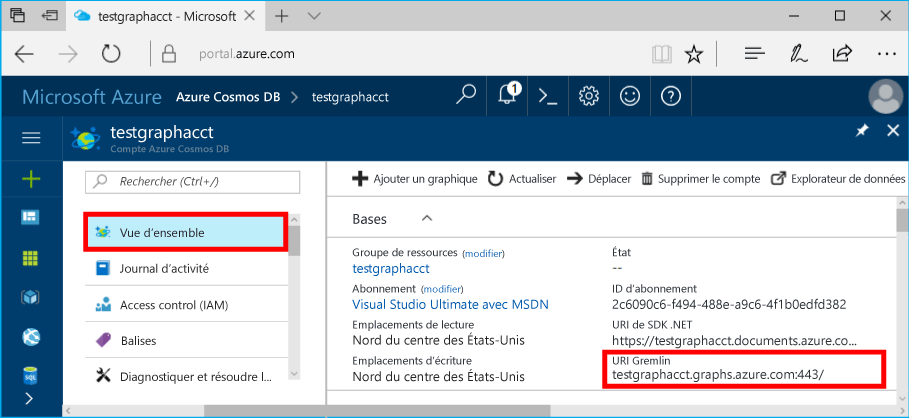

# <a name="azure-cosmos-db-build-a-nodejs-application-by-using-graph-api"></a>Azure Cosmos DB : Créer une application Node.js à l’aide de l’API Graph

Base de données Azure Cosmos est service de base de données comportant plusieurs modèles de hello globalement distribuée à partir de Microsoft. Vous pouvez rapidement créer et interroger des bases de données de graphique, qui bénéficient de distribution globale de hello et des fonctionnalités de mise à l’échelle horizontale au cœur de hello de base de données Azure Cosmos document et clé/valeur. 

Cet article de démarrage rapide montre comment toocreate une base de données Azure Cosmos compte pour l’API Graph (version préliminaire), de base de données et de graphique à l’aide de hello portail Azure. Vous puis créer et exécuter une application console à l’aide de hello open source [GREMLINE Node.js](https://www.npmjs.com/package/gremlin-secure) pilote.  

> [!NOTE]
> module de npm Hello `gremlin-secure` est une version modifiée de `gremlin` module, avec prise en charge de SSL et SASL requis pour la connexion avec la base de données Azure Cosmos. Le code source est disponible sur [GitHub](https://github.com/CosmosDB/gremlin-javascript).
>

## <a name="prerequisites"></a>Composants requis

Avant de pouvoir exécuter cet exemple, vous devez disposer de hello suivant des conditions préalables :
* [Node.js](https://nodejs.org/en/) version 0.10.29 ou supérieure
* [Git](http://git-scm.com/)

[!INCLUDE [quickstarts-free-trial-note](../../includes/quickstarts-free-trial-note.md)]

## <a name="create-a-database-account"></a>Création d'un compte de base de données

[!INCLUDE [cosmos-db-create-dbaccount-graph](../../includes/cosmos-db-create-dbaccount-graph.md)]

## <a name="add-a-graph"></a>Ajout d’un graphique

[!INCLUDE [cosmos-db-create-graph](../../includes/cosmos-db-create-graph.md)]

## <a name="clone-hello-sample-application"></a>Exemple d’application hello de cloner

Maintenant, nous allons une API graphique le clonage d’application à partir de GitHub, définir la chaîne de connexion hello et exécutez-le. Vous allez voir combien il est facile toowork avec des données par programme. 

1. Ouvrez une fenêtre de terminal Git, telles que l’interpréteur de commandes Git et modifiez (via `cd` commande) répertoire de travail tooa.  

2. Exécutez hello suivant le dépôt d’exemples de commande tooclone hello. 

    ```bash
    git clone https://github.com/Azure-Samples/azure-cosmos-db-graph-nodejs-getting-started.git
    ```

3. Ouvrez le fichier de solution hello dans Visual Studio. 

## <a name="review-hello-code"></a>Réviser le code hello

Nous allons effectuer une révision rapide de ce qui se passe dans l’application hello. Ouvrez hello `app.js` fichier et vous trouverez hello lignes de code suivantes. 

* Hello GREMLINE client est créé.

    ```nodejs
    const client = Gremlin.createClient(
        443, 
        config.endpoint, 
        { 
            "session": false, 
            "ssl": true, 
            "user": `/dbs/${config.database}/colls/${config.collection}`,
            "password": config.primaryKey
        });
    ```

  Hello configurations figurent tous dans `config.js`, que nous modifier Bonjour suivant la section.

* Une série d’étapes de GREMLINE sont exécutés avec hello `client.execute` (méthode).

    ```nodejs
    console.log('Running Count'); 
    client.execute("g.V().count()", { }, (err, results) => {
        if (err) return console.error(err);
        console.log(JSON.stringify(results));
        console.log();
    });
    ```

## <a name="update-your-connection-string"></a>Mise à jour de votre chaîne de connexion

1. Fichier de config.js hello ouvert. 

2. Config.js, renseignez clé config.endpoint hello hello **GREMLINE URI** valeur hello **vue d’ensemble** page Hello portail Azure. 

    `config.endpoint = "GRAPHENDPOINT";`

    

   Si hello **GREMLINE URI** valeur est vide, vous pouvez générer la valeur de hello de hello **clés** page portail hello, à l’aide de hello **URI** valeur, https:// de suppression et la modification toographs de documents.

   point de terminaison Hello GREMLINE doit être seul nom d’hôte hello sans numéro de port de protocole/hello, comme `mygraphdb.graphs.azure.com` (pas `https://mygraphdb.graphs.azure.com` ou `mygraphdb.graphs.azure.com:433`).

3. Config.js, renseignez valeur config.primaryKey de hello avec hello **clé primaire** valeur hello **clés** page Hello portail Azure. 

    `config.primaryKey = "PRIMARYKEY";`

   

4. Entrez le nom de base de données hello et le nom du graphique (conteneur) pour la valeur hello config.database et config.collection. 

Voici un exemple de ce à quoi votre fichier config.js terminé doit ressembler :

```nodejs
var config = {}

// Note that this must not have HTTPS or hello port number
config.endpoint = "testgraphacct.graphs.azure.com";
config.primaryKey = "Pams6e7LEUS7LJ2Qk0fjZf3eGo65JdMWHmyn65i52w8ozPX2oxY3iP0yu05t9v1WymAHNcMwPIqNAEv3XDFsEg==";
config.database = "graphdb"
config.collection = "Persons"

module.exports = config;
```

## <a name="run-hello-console-app"></a>Exécutez l’application de console hello

1. Ouvrez une fenêtre de terminal et modifiez (via `cd` commande) toohello répertoire d’installation pour le fichier package.json hello qui est inclus dans le projet de hello.  

2. Exécutez `npm install` tooinstall hello requis modules npm, y compris `gremlin-secure`.

3. Exécutez `node app.js` dans un terminal toostart votre application de nœud.

## <a name="browse-with-data-explorer"></a>Navigation avec l’Explorateur de données

Vous pouvez maintenant revenir en arrière tooData Explorer Bonjour tooview portail Azure, interroger, modifier et travailler avec votre nouveau graphique des données.

Dans l’Explorateur de données, base de données hello apparaît dans hello **graphiques** volet. Développez la base de données hello, suivi d’une collection de hello, puis cliquez sur **graphique**.

données Hello générées par application d’exemple hello s’affiche dans le volet suivant de hello dans hello **graphique** onglet lorsque vous cliquez sur **appliquer le filtre**.

Essayez de fin `g.V()` avec `.has('firstName', 'Thomas')` filtre de hello tootest. Notez que la valeur de hello respecte la casse.

## <a name="review-slas-in-hello-azure-portal"></a>Passez en revue les SLA dans hello portail Azure

[!INCLUDE [cosmosdb-tutorial-review-slas](../../includes/cosmos-db-tutorial-review-slas.md)]

## <a name="clean-up-your-resources"></a>Nettoyage des ressources

Si vous n’envisagez pas de toocontinue à l’aide de cette application, supprimez toutes les ressources que vous avez créé dans cet article de manière hello suivante : 

1. Bonjour portail Azure, dans le menu de navigation gauche hello, cliquez sur **groupes de ressources**, puis cliquez sur nom hello de ressource hello que vous avez créé. 
2. Dans la page de votre groupe de ressources, cliquez sur **supprimer**, tapez nom hello de hello ressource toobe est supprimé, puis cliquez sur **supprimer**.

## <a name="next-steps"></a>Étapes suivantes

Dans cet article, vous avez appris comment toocreate un compte de base de données Azure Cosmos, créez un graphique à l’aide de l’Explorateur de données et exécuter une application. Vous pouvez maintenant générer des requêtes plus complexes et implémenter une logique de traversée de graphique puissante, à l’aide de Gremlin. 

> [!div class="nextstepaction"]
> [Interroger à l’aide de Gremlin](tutorial-query-graph.md)
