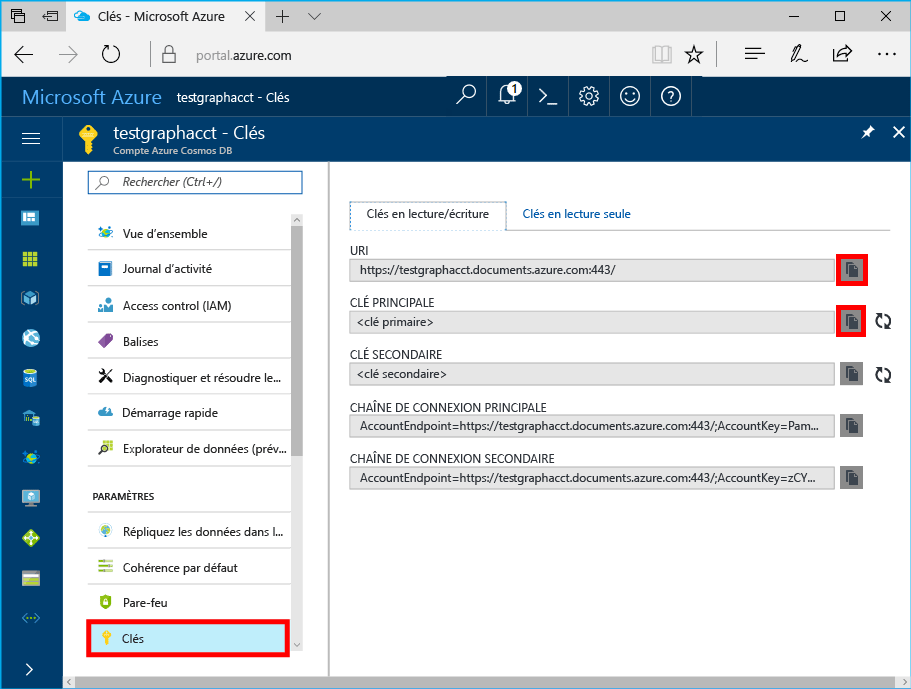

# <a name="azure-cosmos-db-build-a-nodejs-application-by-using-graph-api"></a><span data-ttu-id="9ea38-103">Azure Cosmos DB : Créer une application Node.js à l’aide de l’API Graph</span><span class="sxs-lookup"><span data-stu-id="9ea38-103">Azure Cosmos DB: Build a Node.js application by using Graph API</span></span>

<span data-ttu-id="9ea38-104">Base de données Azure Cosmos est service de base de données comportant plusieurs modèles de hello globalement distribuée à partir de Microsoft.</span><span class="sxs-lookup"><span data-stu-id="9ea38-104">Azure Cosmos DB is hello globally distributed multi-model database service from Microsoft.</span></span> <span data-ttu-id="9ea38-105">Vous pouvez rapidement créer et interroger des bases de données de graphique, qui bénéficient de distribution globale de hello et des fonctionnalités de mise à l’échelle horizontale au cœur de hello de base de données Azure Cosmos document et clé/valeur.</span><span class="sxs-lookup"><span data-stu-id="9ea38-105">You can quickly create and query document, key/value, and graph databases, all of which benefit from hello global distribution and horizontal scale capabilities at hello core of Azure Cosmos DB.</span></span> 

<span data-ttu-id="9ea38-106">Cet article de démarrage rapide montre comment toocreate une base de données Azure Cosmos compte pour l’API Graph (version préliminaire), de base de données et de graphique à l’aide de hello portail Azure.</span><span class="sxs-lookup"><span data-stu-id="9ea38-106">This quick-start article demonstrates how toocreate an Azure Cosmos DB account for Graph API (preview), database, and graph by using hello Azure portal.</span></span> <span data-ttu-id="9ea38-107">Vous puis créer et exécuter une application console à l’aide de hello open source [GREMLINE Node.js](https://www.npmjs.com/package/gremlin-secure) pilote.</span><span class="sxs-lookup"><span data-stu-id="9ea38-107">You then build and run a console app by using hello open-source [Gremlin Node.js](https://www.npmjs.com/package/gremlin-secure) driver.</span></span>  

> [!NOTE]
> <span data-ttu-id="9ea38-108">module de npm Hello `gremlin-secure` est une version modifiée de `gremlin` module, avec prise en charge de SSL et SASL requis pour la connexion avec la base de données Azure Cosmos.</span><span class="sxs-lookup"><span data-stu-id="9ea38-108">hello npm module `gremlin-secure` is a modified version of `gremlin` module, with support for SSL and SASL required for connecting with Azure Cosmos DB.</span></span> <span data-ttu-id="9ea38-109">Le code source est disponible sur [GitHub](https://github.com/CosmosDB/gremlin-javascript).</span><span class="sxs-lookup"><span data-stu-id="9ea38-109">Source code is available on [GitHub](https://github.com/CosmosDB/gremlin-javascript).</span></span>
>

## <a name="prerequisites"></a><span data-ttu-id="9ea38-110">Composants requis</span><span class="sxs-lookup"><span data-stu-id="9ea38-110">Prerequisites</span></span>

<span data-ttu-id="9ea38-111">Avant de pouvoir exécuter cet exemple, vous devez disposer de hello suivant des conditions préalables :</span><span class="sxs-lookup"><span data-stu-id="9ea38-111">Before you can run this sample, you must have hello following prerequisites:</span></span>
* <span data-ttu-id="9ea38-112">[Node.js](https://nodejs.org/en/) version 0.10.29 ou supérieure</span><span class="sxs-lookup"><span data-stu-id="9ea38-112">[Node.js](https://nodejs.org/en/) version v0.10.29 or later</span></span>
* [<span data-ttu-id="9ea38-113">Git</span><span class="sxs-lookup"><span data-stu-id="9ea38-113">Git</span></span>](http://git-scm.com/)

[!INCLUDE [quickstarts-free-trial-note](../../includes/quickstarts-free-trial-note.md)]

## <a name="create-a-database-account"></a><span data-ttu-id="9ea38-114">Création d'un compte de base de données</span><span class="sxs-lookup"><span data-stu-id="9ea38-114">Create a database account</span></span>

[!INCLUDE [cosmos-db-create-dbaccount-graph](../../includes/cosmos-db-create-dbaccount-graph.md)]

## <a name="add-a-graph"></a><span data-ttu-id="9ea38-115">Ajout d’un graphique</span><span class="sxs-lookup"><span data-stu-id="9ea38-115">Add a graph</span></span>

[!INCLUDE [cosmos-db-create-graph](../../includes/cosmos-db-create-graph.md)]

## <a name="clone-hello-sample-application"></a><span data-ttu-id="9ea38-116">Exemple d’application hello de cloner</span><span class="sxs-lookup"><span data-stu-id="9ea38-116">Clone hello sample application</span></span>

<span data-ttu-id="9ea38-117">Maintenant, nous allons une API graphique le clonage d’application à partir de GitHub, définir la chaîne de connexion hello et exécutez-le.</span><span class="sxs-lookup"><span data-stu-id="9ea38-117">Now let's clone a Graph API app from GitHub, set hello connection string, and run it.</span></span> <span data-ttu-id="9ea38-118">Vous allez voir combien il est facile toowork avec des données par programme.</span><span class="sxs-lookup"><span data-stu-id="9ea38-118">You'll see how easy it is toowork with data programmatically.</span></span> 

1. <span data-ttu-id="9ea38-119">Ouvrez une fenêtre de terminal Git, telles que l’interpréteur de commandes Git et modifiez (via `cd` commande) répertoire de travail tooa.</span><span class="sxs-lookup"><span data-stu-id="9ea38-119">Open a Git terminal window, such as Git Bash, and change (via `cd` command) tooa working directory.</span></span>  

2. <span data-ttu-id="9ea38-120">Exécutez hello suivant le dépôt d’exemples de commande tooclone hello.</span><span class="sxs-lookup"><span data-stu-id="9ea38-120">Run hello following command tooclone hello sample repository.</span></span> 

    ```bash
    git clone https://github.com/Azure-Samples/azure-cosmos-db-graph-nodejs-getting-started.git
    ```

3. <span data-ttu-id="9ea38-121">Ouvrez le fichier de solution hello dans Visual Studio.</span><span class="sxs-lookup"><span data-stu-id="9ea38-121">Open hello solution file in Visual Studio.</span></span> 

## <a name="review-hello-code"></a><span data-ttu-id="9ea38-122">Réviser le code hello</span><span class="sxs-lookup"><span data-stu-id="9ea38-122">Review hello code</span></span>

<span data-ttu-id="9ea38-123">Nous allons effectuer une révision rapide de ce qui se passe dans l’application hello.</span><span class="sxs-lookup"><span data-stu-id="9ea38-123">Let's make a quick review of what's happening in hello app.</span></span> <span data-ttu-id="9ea38-124">Ouvrez hello `app.js` fichier et vous trouverez hello lignes de code suivantes.</span><span class="sxs-lookup"><span data-stu-id="9ea38-124">Open hello `app.js` file, and you'll find hello following lines of code.</span></span> 

* <span data-ttu-id="9ea38-125">Hello GREMLINE client est créé.</span><span class="sxs-lookup"><span data-stu-id="9ea38-125">hello Gremlin client is created.</span></span>

    ```nodejs
    const client = Gremlin.createClient(
        443, 
        config.endpoint, 
        { 
            "session": false, 
            "ssl": true, 
            "user": `/dbs/${config.database}/colls/${config.collection}`,
            "password": config.primaryKey
        });
    ```

  <span data-ttu-id="9ea38-126">Hello configurations figurent tous dans `config.js`, que nous modifier Bonjour suivant la section.</span><span class="sxs-lookup"><span data-stu-id="9ea38-126">hello configurations are all in `config.js`, which we edit in hello following section.</span></span>

* <span data-ttu-id="9ea38-127">Une série d’étapes de GREMLINE sont exécutés avec hello `client.execute` (méthode).</span><span class="sxs-lookup"><span data-stu-id="9ea38-127">A series of Gremlin steps are executed with hello `client.execute` method.</span></span>

    ```nodejs
    console.log('Running Count'); 
    client.execute("g.V().count()", { }, (err, results) => {
        if (err) return console.error(err);
        console.log(JSON.stringify(results));
        console.log();
    });
    ```

## <a name="update-your-connection-string"></a><span data-ttu-id="9ea38-128">Mise à jour de votre chaîne de connexion</span><span class="sxs-lookup"><span data-stu-id="9ea38-128">Update your connection string</span></span>

1. <span data-ttu-id="9ea38-129">Fichier de config.js hello ouvert.</span><span class="sxs-lookup"><span data-stu-id="9ea38-129">Open hello config.js file.</span></span> 

2. <span data-ttu-id="9ea38-130">Config.js, renseignez clé config.endpoint hello hello **GREMLINE URI** valeur hello **vue d’ensemble** page Hello portail Azure.</span><span class="sxs-lookup"><span data-stu-id="9ea38-130">In config.js, fill in hello config.endpoint key with hello **Gremlin URI** value from hello **Overview** page of hello Azure portal.</span></span> 

    `config.endpoint = "GRAPHENDPOINT";`

    

   <span data-ttu-id="9ea38-132">Si hello **GREMLINE URI** valeur est vide, vous pouvez générer la valeur de hello de hello **clés** page portail hello, à l’aide de hello **URI** valeur, https:// de suppression et la modification toographs de documents.</span><span class="sxs-lookup"><span data-stu-id="9ea38-132">If hello **Gremlin URI** value is blank, you can generate hello value from hello **Keys** page in hello portal, using hello **URI** value, removing https://, and changing documents toographs.</span></span>

   <span data-ttu-id="9ea38-133">point de terminaison Hello GREMLINE doit être seul nom d’hôte hello sans numéro de port de protocole/hello, comme `mygraphdb.graphs.azure.com` (pas `https://mygraphdb.graphs.azure.com` ou `mygraphdb.graphs.azure.com:433`).</span><span class="sxs-lookup"><span data-stu-id="9ea38-133">hello Gremlin endpoint must be only hello host name without hello protocol/port number, like `mygraphdb.graphs.azure.com` (not `https://mygraphdb.graphs.azure.com` or `mygraphdb.graphs.azure.com:433`).</span></span>

3. <span data-ttu-id="9ea38-134">Config.js, renseignez valeur config.primaryKey de hello avec hello **clé primaire** valeur hello **clés** page Hello portail Azure.</span><span class="sxs-lookup"><span data-stu-id="9ea38-134">In config.js, fill in hello config.primaryKey value in with hello **Primary Key** value from hello **Keys** page of hello Azure portal.</span></span> 

    `config.primaryKey = "PRIMARYKEY";`

   

4. <span data-ttu-id="9ea38-136">Entrez le nom de base de données hello et le nom du graphique (conteneur) pour la valeur hello config.database et config.collection.</span><span class="sxs-lookup"><span data-stu-id="9ea38-136">Enter hello database name, and graph (container) name for hello value of config.database and config.collection.</span></span> 

<span data-ttu-id="9ea38-137">Voici un exemple de ce à quoi votre fichier config.js terminé doit ressembler :</span><span class="sxs-lookup"><span data-stu-id="9ea38-137">Here is an example of what your completed config.js file should look like:</span></span>

```nodejs
var config = {}

// Note that this must not have HTTPS or hello port number
config.endpoint = "testgraphacct.graphs.azure.com";
config.primaryKey = "Pams6e7LEUS7LJ2Qk0fjZf3eGo65JdMWHmyn65i52w8ozPX2oxY3iP0yu05t9v1WymAHNcMwPIqNAEv3XDFsEg==";
config.database = "graphdb"
config.collection = "Persons"

module.exports = config;
```

## <a name="run-hello-console-app"></a><span data-ttu-id="9ea38-138">Exécutez l’application de console hello</span><span class="sxs-lookup"><span data-stu-id="9ea38-138">Run hello console app</span></span>

1. <span data-ttu-id="9ea38-139">Ouvrez une fenêtre de terminal et modifiez (via `cd` commande) toohello répertoire d’installation pour le fichier package.json hello qui est inclus dans le projet de hello.</span><span class="sxs-lookup"><span data-stu-id="9ea38-139">Open a terminal window and change (via `cd` command) toohello installation directory for hello package.json file that's included in hello project.</span></span>  

2. <span data-ttu-id="9ea38-140">Exécutez `npm install` tooinstall hello requis modules npm, y compris `gremlin-secure`.</span><span class="sxs-lookup"><span data-stu-id="9ea38-140">Run `npm install` tooinstall hello required npm modules, including `gremlin-secure`.</span></span>

3. <span data-ttu-id="9ea38-141">Exécutez `node app.js` dans un terminal toostart votre application de nœud.</span><span class="sxs-lookup"><span data-stu-id="9ea38-141">Run `node app.js` in a terminal toostart your node application.</span></span>

## <a name="browse-with-data-explorer"></a><span data-ttu-id="9ea38-142">Navigation avec l’Explorateur de données</span><span class="sxs-lookup"><span data-stu-id="9ea38-142">Browse with Data Explorer</span></span>

<span data-ttu-id="9ea38-143">Vous pouvez maintenant revenir en arrière tooData Explorer Bonjour tooview portail Azure, interroger, modifier et travailler avec votre nouveau graphique des données.</span><span class="sxs-lookup"><span data-stu-id="9ea38-143">You can now go back tooData Explorer in hello Azure portal tooview, query, modify, and work with your new graph data.</span></span>

<span data-ttu-id="9ea38-144">Dans l’Explorateur de données, base de données hello apparaît dans hello **graphiques** volet.</span><span class="sxs-lookup"><span data-stu-id="9ea38-144">In Data Explorer, hello new database appears in hello **Graphs** pane.</span></span> <span data-ttu-id="9ea38-145">Développez la base de données hello, suivi d’une collection de hello, puis cliquez sur **graphique**.</span><span class="sxs-lookup"><span data-stu-id="9ea38-145">Expand hello database, followed by hello collection, then click **Graph**.</span></span>

<span data-ttu-id="9ea38-146">données Hello générées par application d’exemple hello s’affiche dans le volet suivant de hello dans hello **graphique** onglet lorsque vous cliquez sur **appliquer le filtre**.</span><span class="sxs-lookup"><span data-stu-id="9ea38-146">hello data generated by hello sample app is displayed in hello next pane within hello **Graph** tab when you click **Apply Filter**.</span></span>

<span data-ttu-id="9ea38-147">Essayez de fin `g.V()` avec `.has('firstName', 'Thomas')` filtre de hello tootest.</span><span class="sxs-lookup"><span data-stu-id="9ea38-147">Try completing `g.V()` with `.has('firstName', 'Thomas')` tootest hello filter.</span></span> <span data-ttu-id="9ea38-148">Notez que la valeur de hello respecte la casse.</span><span class="sxs-lookup"><span data-stu-id="9ea38-148">Do note that hello value is case sensitive.</span></span>

## <a name="review-slas-in-hello-azure-portal"></a><span data-ttu-id="9ea38-149">Passez en revue les SLA dans hello portail Azure</span><span class="sxs-lookup"><span data-stu-id="9ea38-149">Review SLAs in hello Azure portal</span></span>

[!INCLUDE [cosmosdb-tutorial-review-slas](../../includes/cosmos-db-tutorial-review-slas.md)]

## <a name="clean-up-your-resources"></a><span data-ttu-id="9ea38-150">Nettoyage des ressources</span><span class="sxs-lookup"><span data-stu-id="9ea38-150">Clean up your resources</span></span>

<span data-ttu-id="9ea38-151">Si vous n’envisagez pas de toocontinue à l’aide de cette application, supprimez toutes les ressources que vous avez créé dans cet article de manière hello suivante :</span><span class="sxs-lookup"><span data-stu-id="9ea38-151">If you do not plan toocontinue using this app, delete all resources that you created in this article by doing hello following:</span></span> 

1. <span data-ttu-id="9ea38-152">Bonjour portail Azure, dans le menu de navigation gauche hello, cliquez sur **groupes de ressources**, puis cliquez sur nom hello de ressource hello que vous avez créé.</span><span class="sxs-lookup"><span data-stu-id="9ea38-152">In hello Azure portal, on hello left navigation menu, click **Resource groups**, and then click hello name of hello resource that you created.</span></span> 
2. <span data-ttu-id="9ea38-153">Dans la page de votre groupe de ressources, cliquez sur **supprimer**, tapez nom hello de hello ressource toobe est supprimé, puis cliquez sur **supprimer**.</span><span class="sxs-lookup"><span data-stu-id="9ea38-153">On your resource group page, click **Delete**, type hello name of hello resource toobe deleted, and then click **Delete**.</span></span>

## <a name="next-steps"></a><span data-ttu-id="9ea38-154">Étapes suivantes</span><span class="sxs-lookup"><span data-stu-id="9ea38-154">Next steps</span></span>

<span data-ttu-id="9ea38-155">Dans cet article, vous avez appris comment toocreate un compte de base de données Azure Cosmos, créez un graphique à l’aide de l’Explorateur de données et exécuter une application.</span><span class="sxs-lookup"><span data-stu-id="9ea38-155">In this article, you've learned how toocreate an Azure Cosmos DB account, create a graph by using Data Explorer, and run an app.</span></span> <span data-ttu-id="9ea38-156">Vous pouvez maintenant générer des requêtes plus complexes et implémenter une logique de traversée de graphique puissante, à l’aide de Gremlin.</span><span class="sxs-lookup"><span data-stu-id="9ea38-156">You can now build more complex queries and implement powerful graph traversal logic by using Gremlin.</span></span> 

> [!div class="nextstepaction"]
> [<span data-ttu-id="9ea38-157">Interroger à l’aide de Gremlin</span><span class="sxs-lookup"><span data-stu-id="9ea38-157">Query using Gremlin</span></span>](tutorial-query-graph.md)
