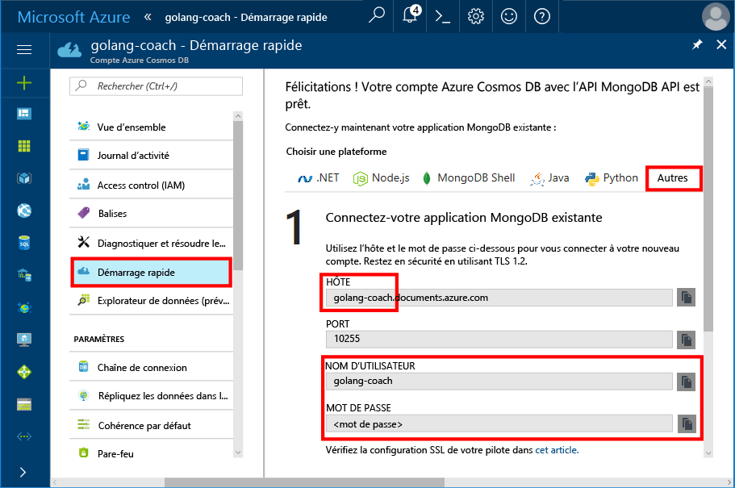
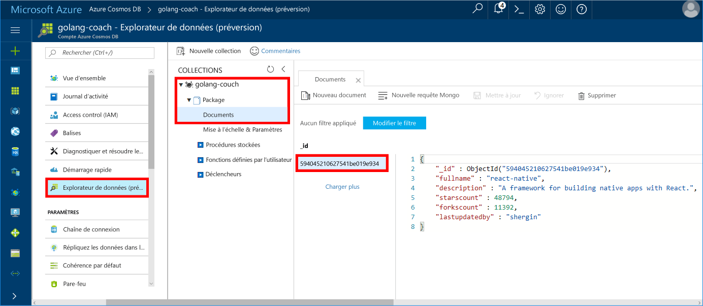

# <a name="azure-cosmos-db-build-a-mongodb-api-console-app-with-golang-and-hello-azure-portal"></a>Base de données Cosmos Azure : Générer une application de console d’API de MongoDB avec Golang et hello portail Azure

Azure Cosmos DB est le service de base de données multi-modèle de Microsoft distribué à l’échelle mondiale. Vous pouvez rapidement créer et interroger des bases de données de graphique, qui bénéficient de distribution globale de hello et des fonctionnalités de mise à l’échelle horizontale au cœur de hello de base de données Azure Cosmos document et clé/valeur.

Ce démarrage rapide montre comment toouse existant [MongoDB](https://docs.microsoft.com/en-us/azure/cosmos-db/mongodb-introduction) application écrite en [Golang](https://golang.org/) et le connecter à base de données de base de données Azure Cosmos tooyour, qui prend en charge les connexions clientes MongoDB.

En d’autres termes, votre application Golang sait uniquement qu’il se connecte à l’aide de MongoDB APIs de la base de données tooa. Il est transparent toohello application hello les données est stockée dans la base de données Azure Cosmos.

## <a name="prerequisites"></a>Composants requis

- Un abonnement Azure. Si vous n’avez pas d’abonnement Azure, créez un [compte gratuit](https://azure.microsoft.com/free) avant de commencer.
- [Accédez](https://golang.org/dl/) et une connaissance élémentaire de hello [accédez](https://golang.org/) language.
- Un IDE — [Gogland](https://www.jetbrains.com/go/) par Jetbrains, [Visual Studio Code](https://code.visualstudio.com/) par Microsoft, ou [Atom](https://atom.io/). Dans ce didacticiel, j’utilise Goglang.

<a id="create-account"></a>
## <a name="create-a-database-account"></a>Création d'un compte de base de données

[!INCLUDE [cosmos-db-create-dbaccount](../../includes/cosmos-db-create-dbaccount-mongodb.md)]

## <a name="clone-hello-sample-application"></a>Exemple d’application hello de cloner

Cloner l’exemple d’application hello et installer des packages hello requis.

1. Créez un dossier nommé CosmosDBSample à l’intérieur du dossier de GOROOT\src hello, qui est C:\Go\ par défaut.
2. Exécutez hello suivant de commande à l’aide d’une fenêtre de terminal git comme référentiel de git bash tooclone hello exemple dans le dossier de CosmosDBSample hello. 

    ```bash
    git clone https://github.com/Azure-Samples/azure-cosmos-db-mongodb-golang-getting-started.git
    ```
3.  Exécutez hello suivant package mgo à commande tooget hello. 

    ```
    go get gopkg.in/mgo.v2
    ```

Hello [mgo](http://labix.org/mgo) pilote (prononcé comme *mango*) est un [MongoDB](http://www.mongodb.org/) pilote pour hello [accédez langage](http://golang.org/) qui implémente une riche et des tests sélection de fonctionnalités sous une API simple suivant des idiomes Go standards.

<a id="connection-string"></a>

## <a name="update-your-connection-string"></a>Mise à jour de votre chaîne de connexion

Revenez toohello tooget portail Azure vos informations de chaîne de connexion et le copier dans une application hello.

1. Cliquez sur **démarrage rapide** dans hello du menu de navigation gauche, puis cliquez sur **autres** informations de chaîne de connexion tooview hello requises par hello Go application.

2. Dans Goglang, ouvrir le fichier de main.go hello dans le répertoire de GOROOT\CosmosDBSample hello et mettre à jour de hello lignes de code à l’aide des informations de chaîne de connexion de hello de hello portail Azure comme indiqué dans hello suivant capture d’écran suivantes. 

    nom de base de données Hello est le préfixe hello hello **hôte** valeur dans le volet de chaîne de connexion avec le portail Azure hello. Compte hello illustré hello ci-dessous, le nom de base de données hello est golang-surveiller.

    ```go
    Database: "hello prefix of hello Host value in hello Azure portal",
    Username: "hello Username in hello Azure portal",
    Password: "hello Password in hello Azure portal",
    ```

    

3. Enregistrez le fichier de main.go hello.

## <a name="review-hello-code"></a>Réviser le code hello

Nous allons effectuer une révision rapide de ce qui se passe dans le fichier de main.go hello. 

### <a name="connecting-hello-go-app-tooazure-cosmos-db"></a>Connexion hello Go application tooAzure Cosmos DB

Base de données Azure Cosmos prend en charge hello MongoDB de SSL activé. tooconnect tooan MongoDB de SSL activé, vous devez toodefine hello **DialServer** fonctionner dans [mgo. DialInfo](http://gopkg.in/mgo.v2#DialInfo)et utiliser de hello [tls. *Accès à distance* ](http://golang.org/pkg/crypto/tls#Dial) connexion de hello tooperform de fonction.

Hello suivant extrait de code Golang connecte hello Go application avec Azure Cosmos DB MongoDB API. Hello *DialInfo* classe contient des options pour établir une session avec un cluster de MongoDB.

```go
// DialInfo holds options for establishing a session with a MongoDB cluster.
dialInfo := &mgo.DialInfo{
    Addrs:    []string{"golang-couch.documents.azure.com:10255"}, // Get HOST + PORT
    Timeout:  60 * time.Second,
    Database: "database", // It can be anything
    Username: "username", // Username
    Password: "Azure database connect password from Azure Portal", // PASSWORD
    DialServer: func(addr *mgo.ServerAddr) (net.Conn, error) {
        return tls.Dial("tcp", addr.String(), &tls.Config{})
    },
}

// Create a session which maintains a pool of socket connections
// tooour Azure Cosmos DB MongoDB database.
session, err := mgo.DialWithInfo(dialInfo)

if err != nil {
    fmt.Printf("Can't connect toomongo, go error %v\n", err)
    os.Exit(1)
}

defer session.Close()

// SetSafe changes hello session safety mode.
// If hello safe parameter is nil, hello session is put in unsafe mode, 
// and writes become fire-and-forget,
// without error checking. hello unsafe mode is faster since operations won't hold on waiting for a confirmation.
// 
session.SetSafe(&mgo.Safe{})
```

Hello **mgo. Dial()** méthode est utilisée lorsque aucune connexion SSL. Pour une connexion SSL, hello **mgo. DialWithInfo()** méthode est requise.

Une instance de hello **{} de DialWIthInfo** objet est l’objet de session utilisé toocreate hello. Une fois la session de hello est établie, vous pouvez accéder collection de hello à l’aide de hello suivant extrait de code :

```go
collection := session.DB(“database”).C(“package”)
```

<a id="create-document"></a>

### <a name="create-a-document"></a>Créer un document

```go
// Model
type Package struct {
    Id bson.ObjectId  `bson:"_id,omitempty"`
    FullName      string
    Description   string
    StarsCount    int
    ForksCount    int
    LastUpdatedBy string
}

// insert Document in collection
err = collection.Insert(&Package{
    FullName:"react",
    Description:"A framework for building native apps with React.",
    ForksCount: 11392,
    StarsCount:48794,
    LastUpdatedBy:"shergin",

})

if err != nil {
    log.Fatal("Problem inserting data: ", err)
    return
}
```

### <a name="query-or-read-a-document"></a>Interroger ou lire un document

Azure Cosmos DB prend en charge les requêtes enrichies sur les documents JSON stockés dans chaque collection. Hello exemple de code suivant montre une requête que vous pouvez exécuter par rapport aux documents de hello dans votre collection.

```go
// Get a Document from hello collection
result := Package{}
err = collection.Find(bson.M{"fullname": "react"}).One(&result)
if err != nil {
    log.Fatal("Error finding record: ", err)
    return
}

fmt.Println("Description:", result.Description)
```


### <a name="update-a-document"></a>Mettre à jour un document

```go
// Update a document
updateQuery := bson.M{"_id": result.Id}
change := bson.M{"$set": bson.M{"fullname": "react-native"}}
err = collection.Update(updateQuery, change)
if err != nil {
    log.Fatal("Error updating record: ", err)
    return
}
```

### <a name="delete-a-document"></a>Supprimer un document

Azure Cosmos DB prend en charge la suppression des documents JSON.

```go
// Delete a document
query := bson.M{"_id": result.Id}
err = collection.Remove(query)
if err != nil {
   log.Fatal("Error deleting record: ", err)
   return
}
```
    
## <a name="run-hello-app"></a>Exécutez l’application hello

1. Dans Goglang, vérifiez que votre GOPATH (disponible sous **fichier**, **paramètres**, **accédez**, **GOPATH**) incluent l’emplacement de hello dans le hello gopkg a été installé, ce qui est USERPROFILE\go par défaut. 
2. Commentez les lignes hello supprimer document hello, lignes 91 à 96, afin que vous pouvez voir le document de hello après application de hello en cours d’exécution.
3. Dans Goglang, cliquez sur **Exécuter**, puis cliquez sur **Exécuter "Générer Main.go et exécuter"**.

    application Hello se termine et affiche la description de hello du document hello créé dans [créer un document](#create-document).
    
    ```
    Description: A framework for building native apps with React.
    
    Process finished with exit code 0
    ```

    
    
## <a name="review-your-document-in-data-explorer"></a>Réviser votre document dans l’Explorateur de données

Revenir en arrière toohello toosee portail Azure votre document dans l’Explorateur de données.

1. Cliquez sur **Explorateur de données (version préliminaire)** dans le menu de navigation gauche hello, développez **golang-surveillance**, **package**, puis cliquez sur **Documents**. Bonjour **Documents** , cliquez sur hello \_document de hello toodisplay id dans le volet de droite hello. 

    
    
2. Vous pouvez ensuite manipuler hello document inline et cliquez sur **mise à jour** toosave il. Vous pouvez également supprimer le document de hello, ou créer de nouveaux documents ou des requêtes.

## <a name="review-slas-in-hello-azure-portal"></a>Passez en revue les SLA dans hello portail Azure

[!INCLUDE [cosmosdb-tutorial-review-slas](../../includes/cosmos-db-tutorial-review-slas.md)]

## <a name="clean-up-resources"></a>Supprimer des ressources

Si vous n’allez toocontinue toouse cette application, supprimez toutes les ressources créées par ce démarrage rapide Bonjour portail Azure par hello comme suit :

1. À partir du menu de gauche hello Bonjour portail Azure, cliquez sur **groupes de ressources** puis cliquez sur nom hello de ressource hello vous avez créé. 
2. Dans la page de votre groupe de ressources, cliquez sur **supprimer**, tapez nom hello de hello ressources toodelete dans la zone de texte hello, puis cliquez sur **supprimer**.

## <a name="next-steps"></a>Étapes suivantes

Ce guide de démarrage rapide, vous avez appris comment toocreate un compte de base de données Azure Cosmos et exécuter une application de Golang à l’aide de hello API pour MongoDB. Vous pouvez maintenant importer les comptes de Cosmos DB tooyour des données supplémentaires. 

> [!div class="nextstepaction"]
> [Importer des données dans la base de données Azure Cosmos pour hello MongoDB API](mongodb-migrate.md)
