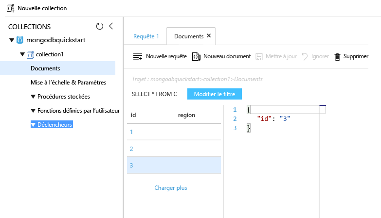

# <a name="azure-cosmos-db-migrate-an-existing-nodejs-mongodb-web-app"></a><span data-ttu-id="292f2-103">Azure Cosmos DB : migrer une application web MongoDB Node.js existante</span><span class="sxs-lookup"><span data-stu-id="292f2-103">Azure Cosmos DB: Migrate an existing Node.js MongoDB web app</span></span> 

<span data-ttu-id="292f2-104">Azure Cosmos DB est le service de base de données multi-modèle de Microsoft distribué à l’échelle mondiale.</span><span class="sxs-lookup"><span data-stu-id="292f2-104">Azure Cosmos DB is Microsoft’s globally distributed multi-model database service.</span></span> <span data-ttu-id="292f2-105">Vous pouvez rapidement créer et interroger des documents, des paires clé/valeur et des bases de données de graphiques, tous profitant de la distribution à l’échelle mondiale et des capacités de mise à l’échelle horizontale au cœur d’Azure Cosmos DB.</span><span class="sxs-lookup"><span data-stu-id="292f2-105">You can quickly create and query document, key/value, and graph databases, all of which benefit from the global distribution and horizontal scale capabilities at the core of Azure Cosmos DB.</span></span> 

<span data-ttu-id="292f2-106">Ce démarrage rapide montre comment utiliser une application [MongoDB](mongodb-introduction.md) existante écrite en Node.js et comment la connecter à votre base de données Azure Cosmos DB, qui prend en charge les connexions clientes MongoDB.</span><span class="sxs-lookup"><span data-stu-id="292f2-106">This quickstart demonstrates how to use an existing [MongoDB](mongodb-introduction.md) app written in Node.js and connect it to your Azure Cosmos DB database, which supports MongoDB client connections.</span></span> <span data-ttu-id="292f2-107">En d’autres termes, votre application Node.js sait uniquement qu’elle se connecte à une base de données qui utilise des API MongoDB.</span><span class="sxs-lookup"><span data-stu-id="292f2-107">In other words, your Node.js application only knows that it's connecting to a database using MongoDB APIs.</span></span> <span data-ttu-id="292f2-108">L’application sait que les données sont stockées dans Azure Cosmos DB.</span><span class="sxs-lookup"><span data-stu-id="292f2-108">It is transparent to the application that the data is stored in Azure Cosmos DB.</span></span>

<span data-ttu-id="292f2-109">Lorsque vous aurez terminé, vous disposerez d’une MEAN (MongoDB, Express, AngularJS et Node.js) exécutée sous [Azure Cosmos DB](https://azure.microsoft.com/services/cosmos-db/).</span><span class="sxs-lookup"><span data-stu-id="292f2-109">When you are done, you will have a MEAN application (MongoDB, Express, AngularJS, and Node.js) running on [Azure Cosmos DB](https://azure.microsoft.com/services/cosmos-db/).</span></span> 


[!INCLUDE [cloud-shell-try-it](../../includes/cloud-shell-try-it.md)]

<span data-ttu-id="292f2-111">Si vous choisissez d’installer et d’utiliser l’interface de ligne de commande localement, vous devez exécuter Azure CLI version 2.0 ou une version ultérieure pour poursuivre la procédure décrite dans cet article.</span><span class="sxs-lookup"><span data-stu-id="292f2-111">If you choose to install and use the CLI locally, this topic requires that you are running the Azure CLI version 2.0 or later.</span></span> <span data-ttu-id="292f2-112">Exécutez `az --version` pour trouver la version.</span><span class="sxs-lookup"><span data-stu-id="292f2-112">Run `az --version` to find the version.</span></span> <span data-ttu-id="292f2-113">Si vous devez installer ou mettre à niveau, consultez [Installation d’Azure CLI 2.0]( /cli/azure/install-azure-cli).</span><span class="sxs-lookup"><span data-stu-id="292f2-113">If you need to install or upgrade, see [Install Azure CLI 2.0]( /cli/azure/install-azure-cli).</span></span> 

## <a name="prerequisites"></a><span data-ttu-id="292f2-114">Composants requis</span><span class="sxs-lookup"><span data-stu-id="292f2-114">Prerequisites</span></span> 
<span data-ttu-id="292f2-115">En plus d’Azure CLI, vous devez avoir installé [Node.js](https://nodejs.org/) et [Git](http://www.git-scm.com/downloads) localement pour exécuter les commandes `npm` et `git`.</span><span class="sxs-lookup"><span data-stu-id="292f2-115">In addition to Azure CLI, you need [Node.js](https://nodejs.org/) and [Git](http://www.git-scm.com/downloads) installed locally to run `npm` and `git` commands.</span></span>

<span data-ttu-id="292f2-116">Vous devriez avoir une bonne connaissance de Node.js.</span><span class="sxs-lookup"><span data-stu-id="292f2-116">You should have working knowledge of Node.js.</span></span> <span data-ttu-id="292f2-117">Ce démarrage rapide n’est pas destiné à vous aider à développer des applications Node.js en général.</span><span class="sxs-lookup"><span data-stu-id="292f2-117">This quickstart is not intended to help you with developing Node.js applications in general.</span></span>

## <a name="clone-the-sample-application"></a><span data-ttu-id="292f2-118">Clonage de l’exemple d’application</span><span class="sxs-lookup"><span data-stu-id="292f2-118">Clone the sample application</span></span>

<span data-ttu-id="292f2-119">Ouvrez une fenêtre de terminal git, comme git bash, et accédez à un répertoire de travail à l’aide de la commande `cd`.</span><span class="sxs-lookup"><span data-stu-id="292f2-119">Open a git terminal window, such as git bash, and `cd` to a working directory.</span></span>  

<span data-ttu-id="292f2-120">Exécutez les commandes suivantes pour cloner l’exemple de référentiel.</span><span class="sxs-lookup"><span data-stu-id="292f2-120">Run the following commands to clone the sample repository.</span></span> <span data-ttu-id="292f2-121">Cet exemple de référentiel contient l’application [MEAN.js](http://meanjs.org/) par défaut.</span><span class="sxs-lookup"><span data-stu-id="292f2-121">This sample repository contains the default [MEAN.js](http://meanjs.org/) application.</span></span> 

```bash
git clone https://github.com/prashanthmadi/mean
```

## <a name="run-the-application"></a><span data-ttu-id="292f2-122">Exécution de l'application</span><span class="sxs-lookup"><span data-stu-id="292f2-122">Run the application</span></span>

<span data-ttu-id="292f2-123">Installez les packages requis et démarrez l’application.</span><span class="sxs-lookup"><span data-stu-id="292f2-123">Install the required packages and start the application.</span></span>

```bash
cd mean
npm install
npm start
```

## <a name="log-in-to-azure"></a><span data-ttu-id="292f2-124">Connexion à Azure</span><span class="sxs-lookup"><span data-stu-id="292f2-124">Log in to Azure</span></span>

<span data-ttu-id="292f2-125">Si vous utilisez une interface de ligne de commande Azure installée, connectez-vous à votre abonnement Azure avec la commande [az login](/cli/azure/#login) et suivez les instructions à l’écran.</span><span class="sxs-lookup"><span data-stu-id="292f2-125">If you are using an installed Azure CLI, log in to your Azure subscription with the [az login](/cli/azure/#login) command and follow the on-screen directions.</span></span> <span data-ttu-id="292f2-126">Vous pouvez ignorer cette étape si vous utilisez Azure Cloud Shell.</span><span class="sxs-lookup"><span data-stu-id="292f2-126">You can skip this step if you're using the Azure Cloud Shell.</span></span>

```azurecli
az login 
``` 
   
## <a name="add-the-azure-cosmos-db-module"></a><span data-ttu-id="292f2-127">Ajouter le module Azure Cosmos DB</span><span class="sxs-lookup"><span data-stu-id="292f2-127">Add the Azure Cosmos DB module</span></span>

<span data-ttu-id="292f2-128">Si vous utilisez une interface de ligne de commande Azure installée, vérifiez si le composant `cosmosdb` est déjà installé en exécutant la commande `az`.</span><span class="sxs-lookup"><span data-stu-id="292f2-128">If you are using an installed Azure CLI, check to see if the `cosmosdb` component is already installed by running the `az` command.</span></span> <span data-ttu-id="292f2-129">Si `cosmosdb` figure dans la liste des commandes de base, passez à la commande suivante.</span><span class="sxs-lookup"><span data-stu-id="292f2-129">If `cosmosdb` is in the list of base commands, proceed to the next command.</span></span> <span data-ttu-id="292f2-130">Vous pouvez ignorer cette étape si vous utilisez Azure Cloud Shell.</span><span class="sxs-lookup"><span data-stu-id="292f2-130">You can skip this step if you're using the Azure Cloud Shell.</span></span>

<span data-ttu-id="292f2-131">Si `cosmosdb` n’apparaît pas dans la liste des commandes de base, réinstallez [Azure CLI 2.0]( /cli/azure/install-azure-cli).</span><span class="sxs-lookup"><span data-stu-id="292f2-131">If `cosmosdb` is not in the list of base commands, reinstall [Azure CLI 2.0]( /cli/azure/install-azure-cli).</span></span>

## <a name="create-a-resource-group"></a><span data-ttu-id="292f2-132">Créer un groupe de ressources</span><span class="sxs-lookup"><span data-stu-id="292f2-132">Create a resource group</span></span>

<span data-ttu-id="292f2-133">Créez un [groupe de ressources](../azure-resource-manager/resource-group-overview.md) avec la commande [az group create](/cli/azure/group#create).</span><span class="sxs-lookup"><span data-stu-id="292f2-133">Create a [resource group](../azure-resource-manager/resource-group-overview.md) with the [az group create](/cli/azure/group#create).</span></span> <span data-ttu-id="292f2-134">Un groupe de ressources Azure est un conteneur logique dans lequel les ressources Azure comme les applications web, les bases de données et les comptes de stockage sont déployées et gérées.</span><span class="sxs-lookup"><span data-stu-id="292f2-134">An Azure resource group is a logical container into which Azure resources like web apps, databases and storage accounts are deployed and managed.</span></span> 

<span data-ttu-id="292f2-135">L’exemple suivant crée un groupe de ressources dans la région Europe de l’Ouest.</span><span class="sxs-lookup"><span data-stu-id="292f2-135">The following example creates a resource group in the West Europe region.</span></span> <span data-ttu-id="292f2-136">Choisissez un nom unique pour le groupe de ressources.</span><span class="sxs-lookup"><span data-stu-id="292f2-136">Choose a unique name for the resource group.</span></span>

<span data-ttu-id="292f2-137">Si vous utilisez Azure Cloud Shell, cliquez sur **Essayer**, suivez les invites à l’écran pour vous connecter, puis copiez la commande dans l’invite de commandes.</span><span class="sxs-lookup"><span data-stu-id="292f2-137">If you are using Azure Cloud Shell, click **Try It**, follow the onscreen prompts to login, then copy the command into the command prompt.</span></span>

```azurecli-interactive
az group create --name myResourceGroup --location "West Europe"
```

## <a name="create-an-azure-cosmos-db-account"></a><span data-ttu-id="292f2-138">Création d’un compte Azure Cosmos DB</span><span class="sxs-lookup"><span data-stu-id="292f2-138">Create an Azure Cosmos DB account</span></span>

<span data-ttu-id="292f2-139">Créez un compte Azure Cosmos DB à l’aide de la commande [az cosmosdb create](/cli/azure/cosmosdb#create).</span><span class="sxs-lookup"><span data-stu-id="292f2-139">Create an Azure Cosmos DB account with the [az cosmosdb create](/cli/azure/cosmosdb#create) command.</span></span>

<span data-ttu-id="292f2-140">Dans la commande suivante, indiquez le nom unique de votre compte Azure Cosmos DB là où se trouve l’espace réservé `<cosmosdb-name>`.</span><span class="sxs-lookup"><span data-stu-id="292f2-140">In the following command, please substitute your own unique Azure Cosmos DB account name where you see the `<cosmosdb-name>` placeholder.</span></span> <span data-ttu-id="292f2-141">Ce nom unique sera utilisé en tant que point de terminaison Azure Cosmos DB (`https://<cosmosdb-name>.documents.azure.com/`). Pour cette raison, le nom doit être unique sur l’ensemble des comptes Azure Cosmos DB dans Azure.</span><span class="sxs-lookup"><span data-stu-id="292f2-141">This unique name will be used as part of your Azure Cosmos DB endpoint (`https://<cosmosdb-name>.documents.azure.com/`), so the name needs to be unique across all Azure Cosmos DB accounts in Azure.</span></span> 

```azurecli-interactive
az cosmosdb create --name <cosmosdb-name> --resource-group myResourceGroup --kind MongoDB
```

<span data-ttu-id="292f2-142">Le paramètre `--kind MongoDB` prend en charge les connexions clientes MongoDB.</span><span class="sxs-lookup"><span data-stu-id="292f2-142">The `--kind MongoDB` parameter enables MongoDB client connections.</span></span>

<span data-ttu-id="292f2-143">Une fois le compte Azure Cosmos DB créé, Azure CLI affiche des informations similaires à celles de l’exemple suivant.</span><span class="sxs-lookup"><span data-stu-id="292f2-143">When the Azure Cosmos DB account is created, the Azure CLI shows information similar to the following example.</span></span> 

> [!NOTE]
> <span data-ttu-id="292f2-144">Cet exemple utilise JSON comme format de sortie de l’interface de ligne de commande Azure, qui constitue le format par défaut.</span><span class="sxs-lookup"><span data-stu-id="292f2-144">This example uses JSON as the Azure CLI output format, which is the default.</span></span> <span data-ttu-id="292f2-145">Pour utiliser un autre format de sortie, consultez l’article [Formats de sortie pour les commandes Azure CLI 2.0](https://docs.microsoft.com/cli/azure/format-output-azure-cli).</span><span class="sxs-lookup"><span data-stu-id="292f2-145">To use another output format, see [Output formats for Azure CLI 2.0 commands](https://docs.microsoft.com/cli/azure/format-output-azure-cli).</span></span>

```json
{
  "databaseAccountOfferType": "Standard",
  "documentEndpoint": "https://<cosmosdb-name>.documents.azure.com:443/",
  "id": "/subscriptions/00000000-0000-0000-0000-000000000000/resourceGroups/myResourceGroup/providers/Microsoft.Document
DB/databaseAccounts/<cosmosdb-name>",
  "kind": "MongoDB",
  "location": "West Europe",
  "name": "<cosmosdb-name>",
  "readLocations": [
    {
      "documentEndpoint": "https://<cosmosdb-name>-westeurope.documents.azure.com:443/",
      "failoverPriority": 0,
      "id": "<cosmosdb-name>-westeurope",
      "locationName": "West Europe",
      "provisioningState": "Succeeded"
    }
  ],
  "resourceGroup": "myResourceGroup",
  "type": "Microsoft.DocumentDB/databaseAccounts",
  "writeLocations": [
    {
      "documentEndpoint": "https://<cosmosdb-name>-westeurope.documents.azure.com:443/",
      "failoverPriority": 0,
      "id": "<cosmosdb-name>-westeurope",
      "locationName": "West Europe",
      "provisioningState": "Succeeded"
    }
  ]
} 
```

## <a name="connect-your-nodejs-application-to-the-database"></a><span data-ttu-id="292f2-146">Connecter votre application Node.js à la base de données</span><span class="sxs-lookup"><span data-stu-id="292f2-146">Connect your Node.js application to the database</span></span>

<span data-ttu-id="292f2-147">Pendant cette étape, vous connectez votre exemple d’application MEAN.js à la base de données Azure Cosmos DB que vous venez de créer, en utilisant une chaîne de connexion MongoDB.</span><span class="sxs-lookup"><span data-stu-id="292f2-147">In this step, you connect your MEAN.js sample application to an Azure Cosmos DB database you just created, using a MongoDB connection string.</span></span> 

<a name="devconfig"></a>
## <a name="configure-the-connection-string-in-your-nodejs-application"></a><span data-ttu-id="292f2-148">Configurer la chaîne de connexion dans votre application Node.js</span><span class="sxs-lookup"><span data-stu-id="292f2-148">Configure the connection string in your Node.js application</span></span>

<span data-ttu-id="292f2-149">Dans votre référentiel MEAN.js, ouvrez `config/env/local-development.js`.</span><span class="sxs-lookup"><span data-stu-id="292f2-149">In your MEAN.js repository, open `config/env/local-development.js`.</span></span>

<span data-ttu-id="292f2-150">Remplacez le contenu de ce fichier par le code suivant.</span><span class="sxs-lookup"><span data-stu-id="292f2-150">Replace the content of this file with the following code.</span></span> <span data-ttu-id="292f2-151">Veillez également à remplacer les deux espaces réservés `<cosmosdb-name>` avec le nom de votre compte Azure Cosmos DB.</span><span class="sxs-lookup"><span data-stu-id="292f2-151">Be sure to also replace the two `<cosmosdb-name>` placeholders with your Azure Cosmos DB account name.</span></span>

```javascript
'use strict';

module.exports = {
  db: {
    uri: 'mongodb://<cosmosdb-name>:<primary_master_key>@<cosmosdb-name>.documents.azure.com:10255/mean-dev?ssl=true&sslverifycertificate=false'
  }
};
```

## <a name="retrieve-the-key"></a><span data-ttu-id="292f2-152">Récupérer la clé</span><span class="sxs-lookup"><span data-stu-id="292f2-152">Retrieve the key</span></span>

<span data-ttu-id="292f2-153">Pour se connecter à une base de données Azure Cosmos DB, vous avez besoin de la clé de la base de données.</span><span class="sxs-lookup"><span data-stu-id="292f2-153">In order to connect to an Azure Cosmos DB database, you need the database key.</span></span> <span data-ttu-id="292f2-154">Utilisez la commande [az documentdb list-keys](/cli/azure/cosmosdb#list-keys) pour récupérer la clé primaire.</span><span class="sxs-lookup"><span data-stu-id="292f2-154">Use the [az cosmosdb list-keys](/cli/azure/cosmosdb#list-keys) command to retrieve the primary key.</span></span>

```azurecli-interactive
az cosmosdb list-keys --name <cosmosdb-name> --resource-group myResourceGroup --query "primaryMasterKey"
```

<span data-ttu-id="292f2-155">Azure CLI génère des informations semblables à ce qui suit.</span><span class="sxs-lookup"><span data-stu-id="292f2-155">The Azure CLI outputs information similar to the following example.</span></span> 

```json
"RUayjYjixJDWG5xTqIiXjC..."
```

<span data-ttu-id="292f2-156">Copiez la valeur de `primaryMasterKey`.</span><span class="sxs-lookup"><span data-stu-id="292f2-156">Copy the value of `primaryMasterKey`.</span></span> <span data-ttu-id="292f2-157">Collez celle-ci sur `<primary_master_key>` dans `local-development.js`.</span><span class="sxs-lookup"><span data-stu-id="292f2-157">Paste this over the  `<primary_master_key>` in `local-development.js`.</span></span>

<span data-ttu-id="292f2-158">Enregistrez vos modifications.</span><span class="sxs-lookup"><span data-stu-id="292f2-158">Save your changes.</span></span>

### <a name="run-the-application-again"></a><span data-ttu-id="292f2-159">Exécutez de nouveau l'application.</span><span class="sxs-lookup"><span data-stu-id="292f2-159">Run the application again.</span></span>

<span data-ttu-id="292f2-160">Exécutez de nouveau `npm start`.</span><span class="sxs-lookup"><span data-stu-id="292f2-160">Run `npm start` again.</span></span> 

```bash
npm start
```

<span data-ttu-id="292f2-161">Un message de console doit maintenant vous indiquer que l’environnement de développement est fonctionnel et en cours d’exécution.</span><span class="sxs-lookup"><span data-stu-id="292f2-161">A console message should now tell you that the development environment is up and running.</span></span> 

<span data-ttu-id="292f2-162">Dans un navigateur, accédez à `http://localhost:3000`.</span><span class="sxs-lookup"><span data-stu-id="292f2-162">Navigate to `http://localhost:3000` in a browser.</span></span> <span data-ttu-id="292f2-163">Cliquez sur **S’inscrire** dans le menu supérieur et essayez de créer deux utilisateurs fictifs.</span><span class="sxs-lookup"><span data-stu-id="292f2-163">Click **Sign Up** in the top menu and try to create two dummy users.</span></span> 

<span data-ttu-id="292f2-164">L’exemple d’application MEAN.js stocke les données utilisateur dans la base de données.</span><span class="sxs-lookup"><span data-stu-id="292f2-164">The MEAN.js sample application stores user data in the database.</span></span> <span data-ttu-id="292f2-165">Si vous réussissez et si MEAN.js se connecte automatiquement à l’utilisateur créé, cela signifie que votre connexion à Azure Cosmos DB fonctionne.</span><span class="sxs-lookup"><span data-stu-id="292f2-165">If you are successful and MEAN.js automatically signs into the created user, then your Azure Cosmos DB connection is working.</span></span> 


## <a name="view-data-in-data-explorer"></a><span data-ttu-id="292f2-167">Afficher les données dans l’Explorateur de données</span><span class="sxs-lookup"><span data-stu-id="292f2-167">View data in Data Explorer</span></span>

<span data-ttu-id="292f2-168">Les données stockées par Azure Cosmos DB peuvent être affichées, interrogées et exécutées selon une logique métier dans le portail Azure.</span><span class="sxs-lookup"><span data-stu-id="292f2-168">Data stored by an Azure Cosmos DB is available to view, query, and run business-logic on in the Azure portal.</span></span>

<span data-ttu-id="292f2-169">Pour afficher, interroger et manipuler les données utilisateur créées à l’étape précédente, connectez-vous au [portail Azure](https://portal.azure.com) dans votre navigateur web.</span><span class="sxs-lookup"><span data-stu-id="292f2-169">To view, query, and work with the user data created in the previous step, login to the [Azure portal](https://portal.azure.com) in your web browser.</span></span>

<span data-ttu-id="292f2-170">Dans la zone de recherche en haut de la page, tapez Azure Cosmos DB.</span><span class="sxs-lookup"><span data-stu-id="292f2-170">In the top Search box, type Azure Cosmos DB.</span></span> <span data-ttu-id="292f2-171">Lorsque le panneau de votre compte Cosmos DB s’ouvre, sélectionnez votre compte Cosmos DB.</span><span class="sxs-lookup"><span data-stu-id="292f2-171">When your Cosmos DB account blade opens, select your Cosmos DB account.</span></span> <span data-ttu-id="292f2-172">Dans le volet de navigation gauche, cliquez sur Explorateur de données.</span><span class="sxs-lookup"><span data-stu-id="292f2-172">In the left navigation, click Data Explorer.</span></span> <span data-ttu-id="292f2-173">Développez votre collection dans le volet Collections, pour pouvoir afficher les documents de la collection, interroger les données et même créer et exécuter des procédures stockées, des déclencheurs et des fonctions définies par l’utilisateur.</span><span class="sxs-lookup"><span data-stu-id="292f2-173">Expand your collection in the Collections pane, and then you can view the documents in the collection, query the data, and even create and run stored procedures, triggers, and UDFs.</span></span> 




## <a name="deploy-the-nodejs-application-to-azure"></a><span data-ttu-id="292f2-175">Déployer l’application Node.js dans Azure</span><span class="sxs-lookup"><span data-stu-id="292f2-175">Deploy the Node.js application to Azure</span></span>

<span data-ttu-id="292f2-176">Dans cette étape, vous allez déployer dans Azure Cosmos DB votre application Node.js connectée à MongoDB.</span><span class="sxs-lookup"><span data-stu-id="292f2-176">In this step, you deploy your MongoDB-connected Node.js application to Azure Cosmos DB.</span></span>

<span data-ttu-id="292f2-177">Vous avez peut-être remarqué que le fichier de configuration que vous avez modifié précédemment est destiné à l’environnement de développement (`/config/env/local-development.js`).</span><span class="sxs-lookup"><span data-stu-id="292f2-177">You may have noticed that the configuration file that you changed earlier is for the development environment (`/config/env/local-development.js`).</span></span> <span data-ttu-id="292f2-178">Lorsque vous déployez votre application dans App Service, elle s’exécute dans l’environnement de production par défaut.</span><span class="sxs-lookup"><span data-stu-id="292f2-178">When you deploy your application to App Service, it will run in the production environment by default.</span></span> <span data-ttu-id="292f2-179">Maintenant, vous devez apporter la même modification au fichier de configuration correspondant.</span><span class="sxs-lookup"><span data-stu-id="292f2-179">So now, you need to make the same change to the respective configuration file.</span></span>

<span data-ttu-id="292f2-180">Dans votre référentiel MEAN.js, ouvrez `config/env/production.js`.</span><span class="sxs-lookup"><span data-stu-id="292f2-180">In your MEAN.js repository, open `config/env/production.js`.</span></span>

<span data-ttu-id="292f2-181">Dans l’objet `db`, remplacez la valeur de `uri` comme indiqué dans l’exemple suivant.</span><span class="sxs-lookup"><span data-stu-id="292f2-181">In the `db` object, replace the value of `uri` as show in the following example.</span></span> <span data-ttu-id="292f2-182">Veillez à remplacer les espaces réservés comme précédemment.</span><span class="sxs-lookup"><span data-stu-id="292f2-182">Be sure to replace the placeholders as before.</span></span>

```javascript
'mongodb://<cosmosdb-name>:<primary_master_key>@<cosmosdb-name>.documents.azure.com:10255/mean?ssl=true&sslverifycertificate=false',
```

> [!NOTE] 
> <span data-ttu-id="292f2-183">L’option `ssl=true` est importante, car [Azure Cosmos DB nécessite SSL](connect-mongodb-account.md#connection-string-requirements).</span><span class="sxs-lookup"><span data-stu-id="292f2-183">The `ssl=true` option is important because [Azure Cosmos DB requires SSL](connect-mongodb-account.md#connection-string-requirements).</span></span> 
>
>

<span data-ttu-id="292f2-184">Dans le terminal, validez toutes vos modifications dans Git.</span><span class="sxs-lookup"><span data-stu-id="292f2-184">In the terminal, commit all your changes into Git.</span></span> <span data-ttu-id="292f2-185">Vous pouvez copier les deux commandes pour les exécuter ensemble.</span><span class="sxs-lookup"><span data-stu-id="292f2-185">You can copy both commands to run them together.</span></span>

```bash
git add .
git commit -m "configured MongoDB connection string"
```
## <a name="clean-up-resources"></a><span data-ttu-id="292f2-186">Supprimer des ressources</span><span class="sxs-lookup"><span data-stu-id="292f2-186">Clean up resources</span></span>

<span data-ttu-id="292f2-187">Si vous ne pensez pas continuer à utiliser cette application, supprimez toutes les ressources créées durant ce guide de démarrage rapide dans le Portail Azure en procédant de la façon suivante :</span><span class="sxs-lookup"><span data-stu-id="292f2-187">If you're not going to continue to use this app, delete all resources created by this quickstart in the Azure portal with the following steps:</span></span>

1. <span data-ttu-id="292f2-188">Dans le menu de gauche du portail Azure, cliquez sur **Groupes de ressources**, puis sur le nom de la ressource que vous avez créée.</span><span class="sxs-lookup"><span data-stu-id="292f2-188">From the left-hand menu in the Azure portal, click **Resource groups** and then click the name of the resource you created.</span></span> 
2. <span data-ttu-id="292f2-189">Dans la page de votre groupe de ressources, cliquez sur **Supprimer**, tapez le nom de la ressource à supprimer dans la zone de texte, puis cliquez sur **Supprimer**.</span><span class="sxs-lookup"><span data-stu-id="292f2-189">On your resource group page, click **Delete**, type the name of the resource to delete in the text box, and then click **Delete**.</span></span>

## <a name="next-steps"></a><span data-ttu-id="292f2-190">Étapes suivantes</span><span class="sxs-lookup"><span data-stu-id="292f2-190">Next steps</span></span>

<span data-ttu-id="292f2-191">Dans ce démarrage rapide, vous avez appris à créer un compte Azure Cosmos DB et à créer une collection MongoDB à l’aide de l’Explorateur de données.</span><span class="sxs-lookup"><span data-stu-id="292f2-191">In this quickstart, you've learned how to create an Azure Cosmos DB account and create a MongoDB collection using the Data Explorer.</span></span> <span data-ttu-id="292f2-192">Vous pouvez désormais migrer vos données MongoDB dans Azure Cosmos DB.</span><span class="sxs-lookup"><span data-stu-id="292f2-192">You can now migrate your MongoDB data to Azure Cosmos DB.</span></span>  

> [!div class="nextstepaction"]
> [<span data-ttu-id="292f2-193">Importer des données MongoDB dans Azure Cosmos DB</span><span class="sxs-lookup"><span data-stu-id="292f2-193">Import MongoDB data into Azure Cosmos DB</span></span>](mongodb-migrate.md)
