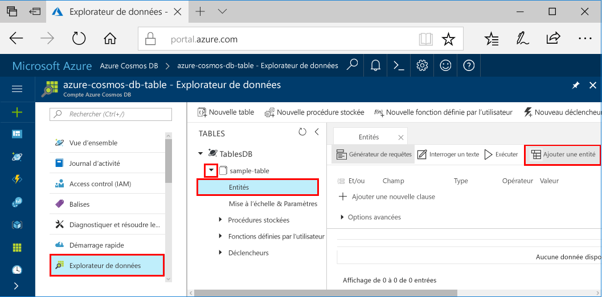

# <a name="azure-cosmos-db-build-a-net-application-using-the-table-api"></a><span data-ttu-id="8d9d6-103">Azure Cosmos DB : Créer une application .NET à l’aide de l’API Table</span><span class="sxs-lookup"><span data-stu-id="8d9d6-103">Azure Cosmos DB: Build a .NET application using the Table API</span></span>

<span data-ttu-id="8d9d6-104">Azure Cosmos DB est un service de base de données multi-modèles mondialement distribué par Microsoft.</span><span class="sxs-lookup"><span data-stu-id="8d9d6-104">Azure Cosmos DB is Microsoft’s globally distributed multi-model database service.</span></span> <span data-ttu-id="8d9d6-105">Rapidement, vous avez la possibilité de créer et d’interroger des documents, des paires clé/valeur, et des bases de données orientées graphe, profitant tous de la distribution à l’échelle mondiale et des capacités de mise à l’échelle horizontale au cœur d’Azure Cosmos DB.</span><span class="sxs-lookup"><span data-stu-id="8d9d6-105">You can quickly create and query document, key/value, and graph databases, all of which benefit from the global distribution and horizontal scale capabilities at the core of Azure Cosmos DB.</span></span> 

<span data-ttu-id="8d9d6-106">Ce guide de démarrage rapide explique comment créer, à l’aide du Portail Azure, un compte Azure Cosmos DB, et une table dans ce compte.</span><span class="sxs-lookup"><span data-stu-id="8d9d6-106">This quick start demonstrates how to create an Azure Cosmos DB account, and create a table within that account using the Azure portal.</span></span> <span data-ttu-id="8d9d6-107">Vous allez ensuite écrire du code pour insérer, mettre à jour et supprimer des entités, et exécuter certaines requêtes à l’aide du nouveau package [Windows Azure Storage Premium Table](https://aka.ms/premiumtablenuget) (préversion) de NuGet.</span><span class="sxs-lookup"><span data-stu-id="8d9d6-107">You'll then write code to insert, update, and delete entities, and run some queries using the new [Windows Azure Storage Premium Table](https://aka.ms/premiumtablenuget) (preview) package from NuGet.</span></span> <span data-ttu-id="8d9d6-108">Cette bibliothèque présente les mêmes classes et signatures de méthode que le [Kit de développement logiciel (SDK) du stockage Windows Azure](https://www.nuget.org/packages/WindowsAzure.Storage), mais il peut également se connecter à des comptes Azure Cosmos DB à l’aide de Windows Azure Storage [l’API Table](table-introduction.md) (préversion).</span><span class="sxs-lookup"><span data-stu-id="8d9d6-108">This library has the same classes and method signatures as the public [Windows Azure Storage SDK](https://www.nuget.org/packages/WindowsAzure.Storage), but also has the ability to connect to Azure Cosmos DB accounts using the [Table API](table-introduction.md) (preview).</span></span> 

## <a name="prerequisites"></a><span data-ttu-id="8d9d6-109">Composants requis</span><span class="sxs-lookup"><span data-stu-id="8d9d6-109">Prerequisites</span></span>

<span data-ttu-id="8d9d6-110">Si vous n’avez pas encore installé Visual Studio 2017, vous pouvez télécharger et utiliser la version **gratuite** [Visual Studio 2017 Community Edition](https://www.visualstudio.com/downloads/).</span><span class="sxs-lookup"><span data-stu-id="8d9d6-110">If you don’t already have Visual Studio 2017 installed, you can download and use the **free** [Visual Studio 2017 Community Edition](https://www.visualstudio.com/downloads/).</span></span> <span data-ttu-id="8d9d6-111">Veillez à activer **le développement Azure** lors de l’installation de Visual Studio.</span><span class="sxs-lookup"><span data-stu-id="8d9d6-111">Make sure that you enable **Azure development** during the Visual Studio setup.</span></span>

[!INCLUDE [quickstarts-free-trial-note](../../includes/quickstarts-free-trial-note.md)]

## <a name="create-a-database-account"></a><span data-ttu-id="8d9d6-112">Création d'un compte de base de données</span><span class="sxs-lookup"><span data-stu-id="8d9d6-112">Create a database account</span></span>

[!INCLUDE [cosmos-db-create-dbaccount-table](../../includes/cosmos-db-create-dbaccount-table.md)]

## <a name="add-a-table"></a><span data-ttu-id="8d9d6-113">Ajouter une table</span><span class="sxs-lookup"><span data-stu-id="8d9d6-113">Add a table</span></span>

[!INCLUDE [cosmos-db-create-table](../../includes/cosmos-db-create-table.md)]

## <a name="add-sample-data"></a><span data-ttu-id="8d9d6-114">Ajouter un exemple de données</span><span class="sxs-lookup"><span data-stu-id="8d9d6-114">Add sample data</span></span>

<span data-ttu-id="8d9d6-115">Vous pouvez maintenant ajouter des données à votre nouvelle table grâce à l’Explorateur de données (préversion).</span><span class="sxs-lookup"><span data-stu-id="8d9d6-115">You can now add data to your new table using Data Explorer (Preview).</span></span>

1. <span data-ttu-id="8d9d6-116">Dans l’Explorateur de données, développez **exemple de table**, cliquez sur **Entités**, puis cliquez sur **Ajouter une entité**.</span><span class="sxs-lookup"><span data-stu-id="8d9d6-116">In Data Explorer, expand **sample-table**, click **Entities**, and then click **Add Entity**.</span></span>

   
2. <span data-ttu-id="8d9d6-118">À présent, ajoutez des données à la zone de valeur PartitionKey et à la zone de valeur RowKey, puis cliquez sur **Ajouter une entité**.</span><span class="sxs-lookup"><span data-stu-id="8d9d6-118">Now add data to the PartitionKey value box and RowKey value box, and click **Add Entity**.</span></span>

   
  
    <span data-ttu-id="8d9d6-120">Vous pouvez maintenant ajouter des entités supplémentaires à votre table, éditer vos entités, ou interroger vos données dans l’Explorateur de données.</span><span class="sxs-lookup"><span data-stu-id="8d9d6-120">You can now add more entities to your table, edit your entities, or query your data in Data Explorer.</span></span> <span data-ttu-id="8d9d6-121">À partir de l’Explorateur de données, vous pouvez également faire évoluer votre débit et ajouter des procédures stockées, des fonctions définies par l’utilisateur, et ajouter à votre table des déclencheurs.</span><span class="sxs-lookup"><span data-stu-id="8d9d6-121">Data Explorer is also where you can scale your throughput and add stored procedures, user defined functions, and triggers to your table.</span></span>

## <a name="clone-the-sample-application"></a><span data-ttu-id="8d9d6-122">Clonage de l’exemple d’application</span><span class="sxs-lookup"><span data-stu-id="8d9d6-122">Clone the sample application</span></span>

<span data-ttu-id="8d9d6-123">À présent, nous allons cloner une application Table à partir de GitHub, configurer la chaîne de connexion et l’exécuter.</span><span class="sxs-lookup"><span data-stu-id="8d9d6-123">Now let's clone a Table app from github, set the connection string, and run it.</span></span> <span data-ttu-id="8d9d6-124">Vous verrez combien il est facile de travailler par programmation avec des données.</span><span class="sxs-lookup"><span data-stu-id="8d9d6-124">You'll see how easy it is to work with data programmatically.</span></span> 

1. <span data-ttu-id="8d9d6-125">Ouvrez une fenêtre de terminal git, comme git bash, et accédez à un répertoire de travail à l’aide de la commande `cd`.</span><span class="sxs-lookup"><span data-stu-id="8d9d6-125">Open a git terminal window, such as git bash, and `cd` to a working directory.</span></span>  

2. <span data-ttu-id="8d9d6-126">Exécutez la commande suivante pour cloner l’exemple de référentiel.</span><span class="sxs-lookup"><span data-stu-id="8d9d6-126">Run the following command to clone the sample repository.</span></span> 

    ```bash
    git clone https://github.com/Azure-Samples/azure-cosmos-db-table-dotnet-getting-started.git
    ```

3. <span data-ttu-id="8d9d6-127">Ouvrez le fichier de solution dans Visual Studio.</span><span class="sxs-lookup"><span data-stu-id="8d9d6-127">Then open the solution file in Visual Studio.</span></span> 

## <a name="review-the-code"></a><span data-ttu-id="8d9d6-128">Examiner le code</span><span class="sxs-lookup"><span data-stu-id="8d9d6-128">Review the code</span></span>

<span data-ttu-id="8d9d6-129">Passons rapidement en revue ce qui se passe dans l’application.</span><span class="sxs-lookup"><span data-stu-id="8d9d6-129">Let's make a quick review of what's happening in the app.</span></span> <span data-ttu-id="8d9d6-130">Ouvrez le fichier Program.cs ; vous pouvez constater que ces lignes de code créent les ressources Azure Cosmos DB.</span><span class="sxs-lookup"><span data-stu-id="8d9d6-130">Open the Program.cs file and you'll find that these lines of code create the Azure Cosmos DB resources.</span></span> 

* <span data-ttu-id="8d9d6-131">L’élément CloudTableClient est initialisé.</span><span class="sxs-lookup"><span data-stu-id="8d9d6-131">The CloudTableClient is initialized.</span></span>

    ```csharp
    CloudStorageAccount storageAccount = CloudStorageAccount.Parse(connectionString); 
    CloudTableClient tableClient = storageAccount.CreateCloudTableClient();
    ```

* <span data-ttu-id="8d9d6-132">Une nouvelle table est créée si elle n’existe pas.</span><span class="sxs-lookup"><span data-stu-id="8d9d6-132">A new table is created if it does not exist.</span></span>

    ```csharp
    CloudTable table = tableClient.GetTableReference("people");
    table.CreateIfNotExists();
    ```

* <span data-ttu-id="8d9d6-133">Un nouveau conteneur de table est créé.</span><span class="sxs-lookup"><span data-stu-id="8d9d6-133">A new Table container is created.</span></span> <span data-ttu-id="8d9d6-134">Vous remarquerez que ce code est très similaire au kit de développement logiciel (SDK) de stockage de tables Azure normal.</span><span class="sxs-lookup"><span data-stu-id="8d9d6-134">You will notice this code very similar to regular Azure Table storage SDK.</span></span> 

    ```csharp
    CustomerEntity item = new CustomerEntity()
                {
                    PartitionKey = Guid.NewGuid().ToString(),
                    RowKey = Guid.NewGuid().ToString(),
                    Email = $"{GetRandomString(6)}@contoso.com",
                    PhoneNumber = "425-555-0102",
                    Bio = GetRandomString(1000)
                };
    ```

## <a name="update-your-connection-string"></a><span data-ttu-id="8d9d6-135">Mise à jour de votre chaîne de connexion</span><span class="sxs-lookup"><span data-stu-id="8d9d6-135">Update your connection string</span></span>

<span data-ttu-id="8d9d6-136">Nous allons maintenant mettre à jour les informations de la chaîne de connexion pour que votre application puisse communiquer avec Azure Cosmos DB.</span><span class="sxs-lookup"><span data-stu-id="8d9d6-136">Now we'll update the connection string information so your app can talk to Azure Cosmos DB.</span></span> 

1. <span data-ttu-id="8d9d6-137">Dans Visual Studio, ouvrez le fichier app.config.</span><span class="sxs-lookup"><span data-stu-id="8d9d6-137">In Visual Studio, open the app.config file.</span></span> 

2. <span data-ttu-id="8d9d6-138">Dans le [portail Azure](http://portal.azure.com/), dans le menu de navigation gauche d’Azure Cosmos DB, cliquez sur la **chaîne de connexion**.</span><span class="sxs-lookup"><span data-stu-id="8d9d6-138">In the [Azure portal](http://portal.azure.com/), in the Azure Cosmos DB left navigation menu, click **Connection String**.</span></span> <span data-ttu-id="8d9d6-139">Puis, cliquez sur le bouton Copier pour la chaîne de connexion dans le nouveau volet.</span><span class="sxs-lookup"><span data-stu-id="8d9d6-139">Then in the new pane click the copy button for the connection string.</span></span> 

    

3. <span data-ttu-id="8d9d6-141">Collez la valeur dans le fichier app.config en tant que valeur de PremiumStorageConnectionString.</span><span class="sxs-lookup"><span data-stu-id="8d9d6-141">Paste the value into the app.config file as the value of the PremiumStorageConnectionString.</span></span> 

    `<add key="PremiumStorageConnectionString" 
        value="DefaultEndpointsProtocol=https;AccountName=MYSTORAGEACCOUNT;AccountKey=AUTHKEY;TableEndpoint=https://COSMOSDB.documents.azure.com" />`    

    <span data-ttu-id="8d9d6-142">Vous pouvez laisser le StandardStorageConnectionString en l’état.</span><span class="sxs-lookup"><span data-stu-id="8d9d6-142">You can leave the StandardStorageConnectionString as is.</span></span>

<span data-ttu-id="8d9d6-143">Vous venez de mettre à jour votre application avec toutes les informations nécessaires pour communiquer avec Azure Cosmos DB.</span><span class="sxs-lookup"><span data-stu-id="8d9d6-143">You've now updated your app with all the info it needs to communicate with Azure Cosmos DB.</span></span> 

## <a name="run-the-web-app"></a><span data-ttu-id="8d9d6-144">Exécuter l’application web</span><span class="sxs-lookup"><span data-stu-id="8d9d6-144">Run the web app</span></span>

1. <span data-ttu-id="8d9d6-145">Dans Visual Studio, cliquez avec le bouton droit sur le projet **PremiumTableGetStarted** dans l’**Explorateur de solutions**, puis cliquez sur **Gérer les packages NuGet**.</span><span class="sxs-lookup"><span data-stu-id="8d9d6-145">In Visual Studio, right-click on the **PremiumTableGetStarted** project in **Solution Explorer** and then click **Manage NuGet Packages**.</span></span> 

2. <span data-ttu-id="8d9d6-146">Dans la zone **Parcourir** de NuGet, tapez *WindowsAzure.Storage-PremiumTable*.</span><span class="sxs-lookup"><span data-stu-id="8d9d6-146">In the NuGet **Browse** box, type *WindowsAzure.Storage-PremiumTable*.</span></span>

3. <span data-ttu-id="8d9d6-147">Cochez la case **Inclure les préversions**.</span><span class="sxs-lookup"><span data-stu-id="8d9d6-147">Check the **Include prerelease** box.</span></span> 

4. <span data-ttu-id="8d9d6-148">À partir des résultats, installez la bibliothèque **WindowsAzure.Storage-PremiumTable**.</span><span class="sxs-lookup"><span data-stu-id="8d9d6-148">From the results, install the **WindowsAzure.Storage-PremiumTable** library.</span></span> <span data-ttu-id="8d9d6-149">Cette opération permet d’installer la préversion du package API Table d’Azure Cosmos DB, ainsi que toutes les dépendances.</span><span class="sxs-lookup"><span data-stu-id="8d9d6-149">This installs the preview Azure Cosmos DB Table API package as well as all dependencies.</span></span> <span data-ttu-id="8d9d6-150">Notez qu’il s’agit d’un package NuGet différent du package de stockage Windows Azure utilisé par le stockage de Table Azure.</span><span class="sxs-lookup"><span data-stu-id="8d9d6-150">Note that this is a different NuGet package than the Windows Azure Storage package used by Azure Table storage.</span></span> 

5. <span data-ttu-id="8d9d6-151">Appuyez sur Ctrl + F5 pour exécuter l’application.</span><span class="sxs-lookup"><span data-stu-id="8d9d6-151">Click CTRL + F5 to run the application.</span></span>

    <span data-ttu-id="8d9d6-152">La fenêtre de console affiche les données ajoutées, récupérées, interrogées, remplacées et supprimées de la table.</span><span class="sxs-lookup"><span data-stu-id="8d9d6-152">The console window displays the data being added, retrieved, queried, replaced and deleted from the table.</span></span> <span data-ttu-id="8d9d6-153">Lorsque le script se termine, appuyez sur n’importe quelle touche pour fermer la fenêtre de console.</span><span class="sxs-lookup"><span data-stu-id="8d9d6-153">When the script completes, press any key to close the console window.</span></span> 
    
    

6. <span data-ttu-id="8d9d6-155">Si vous souhaitez voir les nouvelles entités dans l’Explorateur de données, il suffit de commenter les lignes 188 à 208 dans program.cs afin qu’elles ne soient pas supprimées, puis exécutez de nouveau l’exemple.</span><span class="sxs-lookup"><span data-stu-id="8d9d6-155">If you want to see the new entities in Data Explorer, just comment out lines 188-208 in program.cs so they aren't deleted, then run the sample again.</span></span> 

    <span data-ttu-id="8d9d6-156">Vous pouvez maintenant revenir à l’Explorateur de données, cliquer sur **Actualiser**, développer la table **personnes** et cliquer sur **Entités**, puis travailler avec ces nouvelles données.</span><span class="sxs-lookup"><span data-stu-id="8d9d6-156">You can now go back to Data Explorer, click **Refresh**, expand the **people** table and click **Entities**, and then work with this new data.</span></span> 

    

## <a name="review-slas-in-the-azure-portal"></a><span data-ttu-id="8d9d6-158">Examiner les SLA dans le Portail Azure</span><span class="sxs-lookup"><span data-stu-id="8d9d6-158">Review SLAs in the Azure portal</span></span>

[!INCLUDE [cosmosdb-tutorial-review-slas](../../includes/cosmos-db-tutorial-review-slas.md)]

## <a name="clean-up-resources"></a><span data-ttu-id="8d9d6-159">Supprimer des ressources</span><span class="sxs-lookup"><span data-stu-id="8d9d6-159">Clean up resources</span></span>

<span data-ttu-id="8d9d6-160">Si vous ne pensez pas continuer à utiliser cette application, supprimez toutes les ressources créées durant ce guide de démarrage rapide dans le Portail Azure en procédant de la façon suivante :</span><span class="sxs-lookup"><span data-stu-id="8d9d6-160">If you're not going to continue to use this app, delete all resources created by this quickstart in the Azure portal with the following steps:</span></span> 

1. <span data-ttu-id="8d9d6-161">Dans le menu de gauche du portail Azure, cliquez sur **Groupes de ressources**, puis sur le nom de la ressource que vous avez créée.</span><span class="sxs-lookup"><span data-stu-id="8d9d6-161">From the left-hand menu in the Azure portal, click **Resource groups** and then click the name of the resource you created.</span></span> 
2. <span data-ttu-id="8d9d6-162">Dans la page de votre groupe de ressources, cliquez sur **Supprimer**, tapez le nom de la ressource à supprimer dans la zone de texte, puis cliquez sur **Supprimer**.</span><span class="sxs-lookup"><span data-stu-id="8d9d6-162">On your resource group page, click **Delete**, type the name of the resource to delete in the text box, and then click **Delete**.</span></span>

## <a name="next-steps"></a><span data-ttu-id="8d9d6-163">Étapes suivantes</span><span class="sxs-lookup"><span data-stu-id="8d9d6-163">Next steps</span></span>

<span data-ttu-id="8d9d6-164">Dans ce guide de démarrage rapide, vous avez appris à créer un compte Azure Cosmos DB, à créer une table à l’aide de l’Explorateur de données, et à exécuter une application.</span><span class="sxs-lookup"><span data-stu-id="8d9d6-164">In this quickstart, you've learned how to create an Azure Cosmos DB account, create a table using the Data Explorer, and run an app.</span></span>  <span data-ttu-id="8d9d6-165">Maintenant, vous pouvez interroger vos données à l’aide de l’API Table.</span><span class="sxs-lookup"><span data-stu-id="8d9d6-165">Now you can query your data using the Table API.</span></span>  

> [!div class="nextstepaction"]
> [<span data-ttu-id="8d9d6-166">Requête à l’aide de l’API Table</span><span class="sxs-lookup"><span data-stu-id="8d9d6-166">Query using the Table API</span></span>](tutorial-query-table.md)

