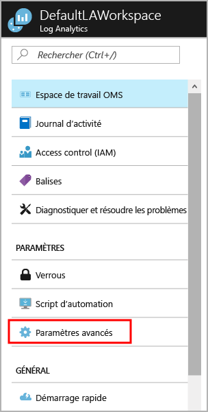
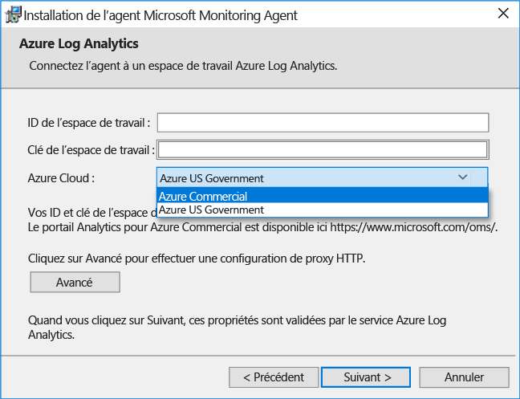
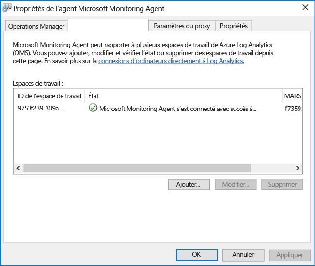

# <a name="connect-windows-computers-to-the-log-analytics-service-in-azure"></a>Connecter des ordinateurs Windows au service Log Analytics dans Azure

Pour surveiller et gérer des machines virtuelles ou des ordinateurs physiques dans votre centre de données local ou dans un environnement cloud avec Log Analytics, vous devez déployer MMA (Microsoft Monitoring Agent) et le configurer pour qu’il rende compte à un ou plusieurs espaces de travail Log Analytics.  L’agent prend également en charge le rôle Runbook Worker hybride pour Azure Automation.  

Sur un ordinateur Windows surveillé, l’agent est répertorié en tant que service Microsoft Monitoring Agent. Le service Microsoft Monitoring Agent collecte les événements à partir des fichiers journaux et du journal des événements Windows, les données de performances et autres données de télémétrie. Même si l’agent ne parvient pas à communiquer avec le service Log Analytics auquel il rend compte, il continue à s’exécuter et place en file d’attente les données collectées sur le disque de l’ordinateur surveillé. Quand la connexion est restaurée, le service Microsoft Monitoring Agent envoie les données collectées au service.

L’agent peut être installé à l’aide d’une des méthodes suivantes. La plupart des installations utilisent une combinaison de ces méthodes pour installer différents groupes d’ordinateurs, selon les besoins.

* Installation manuelle. L’installation est exécutée manuellement sur l’ordinateur à l’aide de l’Assistant Installation, à partir de la ligne de commande ou déployée à l’aide d’un outil de distribution de logiciel existant.
* Configuration de l’état souhaité Azure Automation (DSC). Utilisation de DSC dans Azure Automation avec un script pour les ordinateurs Windows déjà déployés dans votre environnement.  
* Script PowerShell.
* Modèle Resource Manager pour les machines virtuelles exécutant Windows localement dans Azure Stack.  

Pour comprendre la configuration réseau et système requise pour déployer l’agent Windows, consultez [Collect data from your environment with Azure Log Analytics](log-analytics-concept-hybrid.md#prerequisites) (Collecter des données à partir de votre environnement avec Azure Log Analytics).

## <a name="obtain-workspace-id-and-key"></a>Obtenir l’ID et la clé d’espace de travail
Avant d’installer Microsoft Monitoring Agent pour Windows, vous devez disposer de l’ID et de la clé d’espace de travail pour votre espace de travail Log Analytics.  Quelle que soit la méthode d’installation utilisée, ces informations sont nécessaires pendant l’installation afin que l’agent soit configuré correctement et qu’il puisse communiquer avec Log Analytics.  

1. Dans le portail Azure, cliquez sur **Plus de services** dans l’angle inférieur gauche. Dans la liste de ressources, saisissez **Log Analytics**. Au fur et à mesure de la saisie, la liste est filtrée. Sélectionnez **Log Analytics**.
2. Dans la liste des espaces de travail Log Analytics, sélectionnez celui auquel vous envisagez que l’agent rende compte.
3. Sélectionnez **Paramètres avancés**.<br><br> <br><br>  
4. Sélectionnez **Sources connectées**, puis **Serveurs Windows**.   
5. Des valeurs figurent à droite d’**ID de l’espace de travail** et de **Clé primaire**. Copiez-collez ces deux valeurs dans votre éditeur favori.   
   
## <a name="install-the-agent-using-setup"></a>Installation de l’agent à l’aide du programme d’installation
Les étapes suivantes installent et configurent l’agent pour Log Analytics dans le cloud Azure et Azure Government en utilisant le programme d’installation de Microsoft Monitoring Agent sur votre ordinateur.  Le programme d’installation de l’agent se trouve dans le fichier téléchargé et doit être extrait pour 

1. Dans la page **Serveurs Windows**, sélectionnez l’option **Télécharger l’agent Windows** correspondant à la version appropriée selon l’architecture du processeur du système d’exploitation Windows.
2. Exécutez le programme d’installation pour installer l’agent sur votre ordinateur.
2. Sur la page d’**accueil**, cliquez sur **Suivant**.
3. Dans la page **Termes du contrat de licence**, lisez les conditions de licence, puis cliquez sur **J’accepte**.
4. Dans la page **Dossier de destination**, modifiez ou conservez le dossier d’installation par défaut, puis cliquez sur **Suivant**.
5. Dans la page **Options d’installation de l’agent**, choisissez de connecter l’agent à Azure Log Analytics (OMS), puis cliquez sur **Suivant**.   
6. Dans la page **Azure Log Analytics**, procédez comme suit :
   1. Collez l’**ID de l’espace de travail** et la **Clé d’espace de travail (Clé primaire)** que vous avez copiés précédemment.  Si l’ordinateur doit rendre compte à un espace de travail Log Analytics dans le cloud Azure Government, dans la liste déroulante **Cloud Azure**, sélectionnez **Azure - Gouvernement des États-Unis**.  
   2. Si l’ordinateur a besoin de communiquer via un serveur proxy avec le service Log Analytics, cliquez sur **Avancé**, puis indiquez l’URL et le numéro de port du serveur proxy.  Si votre serveur proxy requiert une authentification, tapez le nom d’utilisateur et un mot de passe pour vous authentifier auprès du serveur proxy, puis cliquez sur **Suivant**.  
7. Cliquez sur **Suivant** après avoir fourni les paramètres de configuration nécessaires.<br><br> <br><br>
8. Dans la page **Prêt pour l’installation**, passez en revue vos choix, puis cliquez sur **Installer**.
9. Dans la page **Configuration effectuée**, cliquez sur **Terminer**.

Lorsque vous avez terminé, **Microsoft Monitoring Agent** apparaît dans le **Panneau de configuration**. Pour confirmer qu’il rend compte à Log Analytics, passez en revue [Vérifier la connectivité de l’agent à Log Analytics](#verify-agent-connectivity-to-log-analytics). 

## <a name="install-the-agent-using-the-command-line"></a>Installation de l’agent à l’aide de la ligne de commande
Le fichier téléchargé de l’agent est un package d’installation autonome créé avec IExpress.  Le programme d’installation de l’agent et les fichiers de prise en charge sont contenus dans le package et doivent être extraits pour effectuer une installation correcte à l’aide de la ligne de commande indiquée dans les exemples suivants.  Cette méthode prend en charge la configuration de l’agent pour qu’il rende compte au cloud Azure Commercial et au cloud du gouvernement des États-Unis.  

>[!NOTE]
>Si vous souhaitez mettre à niveau un agent, vous devez utiliser l’API de script Log Analytics. Consultez la rubrique [Gestion et maintenance de l’agent Log Analytics sous Windows et Linux](log-analytics-agent-manage.md) pour plus d’informations.

Le tableau suivant répertorie les paramètres Log Analytics spécifiques pris en charge par le programme d’installation de l’agent, notamment quand il est déployé à l’aide d’Automation DSC.

|Options propres à MMA                   |Notes         |
|---------------------------------------|--------------|
|ADD_OPINSIGHTS_WORKSPACE               | 1 = Configurer l’agent de façon à ce qu’il se connecte à un espace de travail                |
|OPINSIGHTS_WORKSPACE_ID                | ID d’espace de travail (GUID) de l’espace de travail à ajouter                    |
|OPINSIGHTS_WORKSPACE_KEY               | Clé d’espace de travail utilisée initialement pour l’authentification auprès de l’espace de travail |
|OPINSIGHTS_WORKSPACE_AZURE_CLOUD_TYPE  | Spécifie l’environnement cloud où se trouve l’espace de travail <br> 0 = cloud commercial Azure (par défaut) <br> 1 = Azure Government |
|OPINSIGHTS_PROXY_URL               | URI du proxy à utiliser |
|OPINSIGHTS_PROXY_USERNAME               | Nom d’utilisateur permettant d’accéder à un proxy authentifié |
|OPINSIGHTS_PROXY_PASSWORD               | Mot de passe permettant d’accéder à un proxy authentifié |

1. Pour extraire les fichiers d’installation de l’agent, à partir d’une invite de commandes avec élévation de privilèges, exécutez `extract MMASetup-<platform>.exe` et indiquez l’emplacement où extraire les fichiers.  L’autre possibilité consiste à spécifier le chemin d’accès à l’aide des arguments `extract MMASetup-<platform>.exe /c:<Path> /t:<Path>`.  Pour plus d’informations sur les commutateurs de ligne de commande pris en charge par IExpress, consultez [Commutateurs de ligne de commande pour IExpress](https://support.microsoft.com/help/197147/command-line-switches-for-iexpress-software-update-packages) puis mettez à jour l’exemple en fonction de vos besoins.
2. Pour installer l’agent en mode silencieux et le configurer pour qu’il rende compte à un espace de travail dans le cloud Azure Commercial, à partir du dossier dans lequel vous avez extrait les fichiers d’installation, tapez : 
   
     ```dos
    setup.exe /qn ADD_OPINSIGHTS_WORKSPACE=1 OPINSIGHTS_WORKSPACE_AZURE_CLOUD_TYPE=0 OPINSIGHTS_WORKSPACE_ID=<your workspace id> OPINSIGHTS_WORKSPACE_KEY=<your workspace key> AcceptEndUserLicenseAgreement=1
    ```

   ou, pour configurer l’agent afin qu’il rende compte au cloud du gouvernement des États-Unis, tapez : 

     ```dos
    setup.exe /qn ADD_OPINSIGHTS_WORKSPACE=1 OPINSIGHTS_WORKSPACE_AZURE_CLOUD_TYPE=1 OPINSIGHTS_WORKSPACE_ID=<your workspace id> OPINSIGHTS_WORKSPACE_KEY=<your workspace key> AcceptEndUserLicenseAgreement=1
    ```

## <a name="install-the-agent-using-dsc-in-azure-automation"></a>Installer l’agent à l’aide de DSC dans Azure Automation

Vous pouvez utiliser l’exemple de script suivant pour installer l’agent à l’aide d’Azure Automation DSC.   Si vous n’avez pas de compte Automation, consultez [Prise en main d’Azure Automation](../automation/automation-offering-get-started.md) pour comprendre les exigences et les étapes de création d’un compte Automation à respecter avant d’utiliser Automation DSC.  Si vous n’êtes pas familiarisé avec Automation DSC, consultez [Prise en main d’Azure Automation DSC](../automation/automation-dsc-getting-started.md).

L’exemple suivant installe l’agent 64 bits, identifié par la valeur `URI`. Vous pouvez également utiliser la version 32 bits en remplaçant la valeur de l’URI. Les URI pour les deux versions sont :

- Agent Windows 64 bits - https://go.microsoft.com/fwlink/?LinkId=828603
- Agent Windows 32 bits - https://go.microsoft.com/fwlink/?LinkId=828604


>[!NOTE]
>Cet exemple de procédure et de script ne prend pas en charge la mise à niveau de l’agent déjà déployé sur un ordinateur Windows.

Les versions 32 bits et 64 bits du package de l’agent ont des codes de produit différents et les nouvelles versions publiées ont également une valeur unique.  Le code de produit est un GUID qui est l’identification principale d’une application ou d’un produit, et est représenté par la propriété **ProductCode** de Windows Installer.  Dans le script **MMAgent.ps1**, `ProductId value` doit correspondre au code de produit dans le package du programme d’installation 32 bits ou 64 bits de l’agent.

Pour récupérer le code de produit du package d’installation de l’agent directement, vous pouvez utiliser Orca.exe à partir des [composants SDK Windows pour les développeurs Windows Installer](https://msdn.microsoft.com/library/windows/desktop/aa370834%27v=vs.85%28.aspx) (composant du SDK Windows) ou utiliser PowerShell en suivant un [exemple de script](http://www.scconfigmgr.com/2014/08/22/how-to-get-msi-file-information-with-powershell/) écrit par un MVP (Microsoft Valuable Professional).

1. Importez le module DSC xPSDesiredStateConfiguration à partir de [http://www.powershellgallery.com/packages/xPSDesiredStateConfiguration](http://www.powershellgallery.com/packages/xPSDesiredStateConfiguration) dans Azure Automation.  
2.  Créez des ressources variables Azure Automation pour *OPSINSIGHTS_WS_ID* et *OPSINSIGHTS_WS_KEY*. Affectez votre ID d’espace de travail Log Analytics comme valeur *OPSINSIGHTS_WS_ID* et affectez la clé primaire de votre espace de travail comme valeur *OPSINSIGHTS_WS_KEY*.
3.  Copiez le script et enregistrez-le sous le nom MMAgent.ps1.

    ```PowerShell
    Configuration MMAgent
    {
        $OIPackageLocalPath = "C:\Deploy\MMASetup-AMD64.exe"
        $OPSINSIGHTS_WS_ID = Get-AutomationVariable -Name "OPSINSIGHTS_WS_ID"
        $OPSINSIGHTS_WS_KEY = Get-AutomationVariable -Name "OPSINSIGHTS_WS_KEY"

        Import-DscResource -ModuleName xPSDesiredStateConfiguration

        Node OMSnode {
            Service OIService
            {
                Name = "HealthService"
                State = "Running"
                DependsOn = "[Package]OI"
            }

            xRemoteFile OIPackage {
                Uri = "https://go.microsoft.com/fwlink/?LinkId=828603"
                DestinationPath = $OIPackageLocalPath
            }

            Package OI {
                Ensure = "Present"
                Path  = $OIPackageLocalPath
                Name = "Microsoft Monitoring Agent"
                ProductId = "8A7F2C51-4C7D-4BFD-9014-91D11F24AAE2"
                Arguments = '/C:Deploy"setup.exe /qn ADD_OPINSIGHTS_WORKSPACE=1 OPINSIGHTS_WORKSPACE_ID=' + $OPSINSIGHTS_WS_ID + ' OPINSIGHTS_WORKSPACE_KEY=' + $OPSINSIGHTS_WS_KEY + ' AcceptEndUserLicenseAgreement=1"'
                DependsOn = "[xRemoteFile]OIPackage"
            }
        }
    }

    ```

4. [Importez le script de configuration MMAgent.ps1](../automation/automation-dsc-getting-started.md#importing-a-configuration-into-azure-automation) dans votre compte Automation. 
5. [Affectez un nœud ou ordinateur Windows](../automation/automation-dsc-getting-started.md#onboarding-an-azure-vm-for-management-with-azure-automation-dsc) à la configuration. En moins de 15 minutes, le nœud vérifie sa configuration et l’agent est poussé vers le nœud.

## <a name="verify-agent-connectivity-to-log-analytics"></a>Vérifier la connectivité de l’agent à Log Analytics

Une fois terminée l’installation de l’agent, vous pouvez vérifier qu’il se connecte et qu’il rend compte correctement de deux manières.  

À partir de l’ordinateur, dans le **Panneau de configuration**, recherchez l’élément **Microsoft Monitoring Agent**.  Sélectionnez-le ; sous l’onglet **Azure Log Analytics (OMS)**, l’agent doit alors afficher un message indiquant que **Microsoft Monitoring Agent s’est correctement connecté au service Microsoft Operations Management Suite**.<br><br> 

Vous pouvez également effectuer une recherche dans les journaux simple dans le portail Azure.  

1. Dans le portail Azure, cliquez sur **Plus de services** dans l’angle inférieur gauche. Dans la liste de ressources, saisissez **Log Analytics**. Au fur et à mesure de la saisie, la liste est filtrée. Sélectionnez **Log Analytics**.  
2. Dans la page des espaces de travail Log Analytics, sélectionnez l’espace de travail cible, puis la vignette **Recherche dans les journaux**. 
2. Dans le volet Recherche dans les journaux, dans le champ de requête, tapez :  

    ```
    search * 
    | where Type == "Heartbeat" 
    | where Category == "Direct Agent" 
    | where TimeGenerated > ago(30m)  
    ```

Dans les résultats de recherche retournés, vous devez voir des enregistrements de pulsation pour l’ordinateur, indiquant qu’il est connecté et qu’il rend compte au service.   

## <a name="next-steps"></a>étapes suivantes

Consultez [Gestion et maintenance de l’agent Log Analytics sous Windows et Linux](log-analytics-agent-manage.md) pour en savoir plus sur la gestion de l’agent pendant le cycle de vie de son déploiement sur vos machines.  