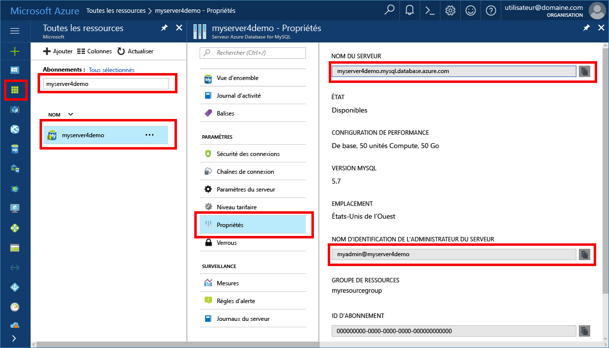

# <a name="migrate-your-mysql-database-by-using-import-and-export"></a><span data-ttu-id="f778c-103">Migration d’une base de données MySQL à l’aide de l’importation et de l’exportation</span><span class="sxs-lookup"><span data-stu-id="f778c-103">Migrate your MySQL database by using import and export</span></span>
<span data-ttu-id="f778c-104">Cet article explique deux approches communes de l’importation et de l’exportation de données vers un serveur de base de données Azure pour MySQL à l’aide de MySQL Workbench.</span><span class="sxs-lookup"><span data-stu-id="f778c-104">This article explains two common approaches to importing and exporting data to an Azure Database for MySQL server by using MySQL Workbench.</span></span> 

## <a name="before-you-begin"></a><span data-ttu-id="f778c-105">Avant de commencer</span><span class="sxs-lookup"><span data-stu-id="f778c-105">Before you begin</span></span>
<span data-ttu-id="f778c-106">Pour parcourir ce guide pratique, vous aurez besoin des éléments suivants :</span><span class="sxs-lookup"><span data-stu-id="f778c-106">To step through this how-to guide, you need:</span></span>
- <span data-ttu-id="f778c-107">Un serveur de base de données Azure pour MySQL (voir [Créer un serveur de base de données Azure pour MySQL à l’aide du Portail Azure](quickstart-create-mysql-server-database-using-azure-portal.md))</span><span class="sxs-lookup"><span data-stu-id="f778c-107">An Azure Database for MySQL server, by following [Create an Azure Database for MySQL server using Azure portal](quickstart-create-mysql-server-database-using-azure-portal.md).</span></span>
- <span data-ttu-id="f778c-108">MySQL Workbench [téléchargé](https://dev.mysql.com/downloads/workbench/) ou un autre outil MySQL pour l’importation et l’exportation</span><span class="sxs-lookup"><span data-stu-id="f778c-108">MySQL Workbench [downloaded](https://dev.mysql.com/downloads/workbench/), or another MySQL tool to import and export.</span></span>

## <a name="use-common-tools"></a><span data-ttu-id="f778c-109">Utiliser des outils courants</span><span class="sxs-lookup"><span data-stu-id="f778c-109">Use common tools</span></span>
<span data-ttu-id="f778c-110">Utilisez les outils courants tels que MySQL Workbench, Toad ou Navicat pour vous connecter à distance et importer ou exporter les données dans la base de données Azure pour MySQL.</span><span class="sxs-lookup"><span data-stu-id="f778c-110">Use common tools such as MySQL Workbench, Toad, or Navicat to remotely connect and import or export data into Azure Database for MySQL.</span></span> 

<span data-ttu-id="f778c-111">Utilisez ces outils sur votre ordinateur client disposant d’une connexion Internet pour se connecter à la base de données Azure pour MySQL.</span><span class="sxs-lookup"><span data-stu-id="f778c-111">Use such tools on your client machine with an Internet connection to connect to Azure Database for MySQL.</span></span> <span data-ttu-id="f778c-112">Utilisez une connexion chiffrée SSL pour appliquer les meilleures pratiques de sécurité, comme décrit dans la page [Configurer la connectivité SSL dans la base de données Azure pour MySQL](concepts-ssl-connection-security.md).</span><span class="sxs-lookup"><span data-stu-id="f778c-112">Use an SSL-encrypted connection for best security practices, as described in [Configure SSL connectivity in Azure Database for MySQL](concepts-ssl-connection-security.md).</span></span>

<span data-ttu-id="f778c-113">Il est inutile de déplacer les fichiers d’importation et d’exportation dans un emplacement spécifique du cloud lors de la migration vers la base de données Azure pour MySQL.</span><span class="sxs-lookup"><span data-stu-id="f778c-113">You do not need to move your import and export files to any special cloud location when migrating to Azure Database for MySQL.</span></span> 

## <a name="create-a-database-on-the-azure-database-for-mysql-server"></a><span data-ttu-id="f778c-114">Créer une base de données sur le serveur de base de données Azure pour MySQL</span><span class="sxs-lookup"><span data-stu-id="f778c-114">Create a database on the Azure Database for MySQL server</span></span>
<span data-ttu-id="f778c-115">Créez une base de données vide sur le serveur de base de données Azure pour MySQL vers lequel vous souhaitez migrer les données.</span><span class="sxs-lookup"><span data-stu-id="f778c-115">Create an empty database on the Azure Database for MySQL server where you want to migrate the data.</span></span> <span data-ttu-id="f778c-116">Utilisez un outil comme MySQL Workbench, Toad ou Navicat pour créer la base de données.</span><span class="sxs-lookup"><span data-stu-id="f778c-116">Use a tool such as MySQL Workbench, Toad, or Navicat to create the database.</span></span> <span data-ttu-id="f778c-117">La base de données peut avoir le même nom que celle qui contient les données sauvegardées, mais vous pouvez également créer une base de données avec un autre nom.</span><span class="sxs-lookup"><span data-stu-id="f778c-117">The database can have the same name as the database that contains the dumped data, or you can create a database with a different name.</span></span>

<span data-ttu-id="f778c-118">Pour vous connecter, repérez les informations de connexion dans le volet **Propriétés** de la base de données Azure pour MySQL.</span><span class="sxs-lookup"><span data-stu-id="f778c-118">To get connected, locate the connection information on the **Properties** pane in Azure Database for MySQL.</span></span>



<span data-ttu-id="f778c-120">Ajoutez les informations de connexion à MySQL Workbench.</span><span class="sxs-lookup"><span data-stu-id="f778c-120">Add the connection information to MySQL Workbench.</span></span>


## <a name="determine-when-to-use-import-and-export-techniques-instead-of-a-dump-and-restore"></a><span data-ttu-id="f778c-122">Déterminer quand utiliser les techniques d’importation et d’exportation au lieu du processus de sauvegarde et restauration</span><span class="sxs-lookup"><span data-stu-id="f778c-122">Determine when to use import and export techniques instead of a dump and restore</span></span>
<span data-ttu-id="f778c-123">Utilisez les outils MySQL pour importer et exporter des bases de données dans la base de données Azure MySQL dans les scénarios suivants.</span><span class="sxs-lookup"><span data-stu-id="f778c-123">Use MySQL tools to import and export databases into Azure MySQL Database in the following scenarios.</span></span> <span data-ttu-id="f778c-124">Dans d’autres scénarios, l’approche de [sauvegarde et restauration](concepts-migrate-dump-restore.md) sera plus avantageuse.</span><span class="sxs-lookup"><span data-stu-id="f778c-124">In other scenarios, you might benefit from using the [dump and restore](concepts-migrate-dump-restore.md) approach instead.</span></span> 

- <span data-ttu-id="f778c-125">Lorsque vous devez choisir spécifiquement plusieurs tables à importer à partir d’une base de données MySQL existante vers une base de données Azure MySQL, il est préférable d’utiliser la technique d’importation et d’exportation.</span><span class="sxs-lookup"><span data-stu-id="f778c-125">When you need to selectively choose a few tables to import from an existing MySQL database into Azure MySQL Database, it's best to use the import and export technique.</span></span>  <span data-ttu-id="f778c-126">En procédant ainsi, vous pouvez omettre toutes les tables non nécessaires de la migration pour économiser du temps et des ressources.</span><span class="sxs-lookup"><span data-stu-id="f778c-126">By doing so, you can omit any unneeded tables from the migration to save time and resources.</span></span> <span data-ttu-id="f778c-127">Par exemple, utilisez le commutateur `--include-tables` ou `--exclude-tables` avec [mysqlpump](https://dev.mysql.com/doc/refman/5.7/en/mysqlpump.html#option_mysqlpump_include-tables) et le commutateur `--tables` avec [mysqldump](https://dev.mysql.com/doc/refman/5.7/en/mysqldump.html#option_mysqldump_tables).</span><span class="sxs-lookup"><span data-stu-id="f778c-127">For example, use the `--include-tables` or `--exclude-tables` switch with [mysqlpump](https://dev.mysql.com/doc/refman/5.7/en/mysqlpump.html#option_mysqlpump_include-tables) and the `--tables` switch with [mysqldump](https://dev.mysql.com/doc/refman/5.7/en/mysqldump.html#option_mysqldump_tables).</span></span>
- <span data-ttu-id="f778c-128">Lorsque vous déplacez des objets de base de données autres que des tables, vous devez les créer explicitement.</span><span class="sxs-lookup"><span data-stu-id="f778c-128">When you're moving the database objects other than tables, explicitly create those.</span></span> <span data-ttu-id="f778c-129">Incluez les contraintes (clé primaire, clé étrangère, index), les vues, les fonctions, les procédures, les déclencheurs et tout autre objet de base de données dont vous souhaitez effectuer la migration.</span><span class="sxs-lookup"><span data-stu-id="f778c-129">Include constraints (primary key, foreign key, indexes), views, functions, procedures, triggers, and any other database objects that you want to migrate.</span></span>
- <span data-ttu-id="f778c-130">Lorsque vous effectuez la migration de données à partir de sources de données externes autres qu’une base de données MySQL, créez des fichiers plats et importez-les à l’aide de [mysqlimport](https://dev.mysql.com/doc/refman/5.7/en/mysqlimport.html).</span><span class="sxs-lookup"><span data-stu-id="f778c-130">When you're migrating data from external data sources other than a MySQL database, create flat files and import them by using [mysqlimport](https://dev.mysql.com/doc/refman/5.7/en/mysqlimport.html).</span></span>

<span data-ttu-id="f778c-131">Assurez-vous que toutes les tables de la base de données utilisent le moteur de stockage InnoDB lors du chargement de données dans la base de données Azure pour MySQL.</span><span class="sxs-lookup"><span data-stu-id="f778c-131">Make sure that all tables in the database use the InnoDB storage engine when you're loading data into Azure Database for MySQL.</span></span> <span data-ttu-id="f778c-132">La base de données Azure pour MySQL prend en charge le moteur de stockage InnoDB uniquement. Par conséquent, elle ne prend pas en charge les autres moteurs de stockage.</span><span class="sxs-lookup"><span data-stu-id="f778c-132">Azure Database for MySQL supports only the InnoDB storage engine, so it doesn't support alternative storage engines.</span></span> <span data-ttu-id="f778c-133">Si vos tables requièrent d’autres moteurs de stockage, veillez à les convertir au format de moteur InnoDB avant la migration vers la base de données Azure pour MySQL.</span><span class="sxs-lookup"><span data-stu-id="f778c-133">If your tables require alternative storage engines, be sure to convert them to use the InnoDB engine format before the migration to Azure Database for MySQL.</span></span> 

<span data-ttu-id="f778c-134">Par exemple, si votre site WordPress ou votre application web utilise le moteur MyISAM, commencez par convertir les tables en effectuant une migration des données vers des tables InnoDB.</span><span class="sxs-lookup"><span data-stu-id="f778c-134">For example, if you have a WordPress or web app that uses the MyISAM engine, first convert the tables by migrating the data into InnoDB tables.</span></span> <span data-ttu-id="f778c-135">Effectuez ensuite la restauration vers la base de données Azure pour MySQL.</span><span class="sxs-lookup"><span data-stu-id="f778c-135">Then restore to Azure Database for MySQL.</span></span> <span data-ttu-id="f778c-136">Utilisez la clause `ENGINE=INNODB` pour définir le moteur utilisé pour la création d’une table, puis transférez les données dans la table compatible avant la migration.</span><span class="sxs-lookup"><span data-stu-id="f778c-136">Use the clause `ENGINE=INNODB` to set the engine for creating a table, and then transfer the data into the compatible table before the migration.</span></span> 

   ```sql
   INSERT INTO innodb_table SELECT * FROM myisam_table ORDER BY primary_key_columns
   ```

## <a name="performance-recommendations-for-import-and-export"></a><span data-ttu-id="f778c-137">Recommandations en matière de performances pour l’importation et l’exportation</span><span class="sxs-lookup"><span data-stu-id="f778c-137">Performance recommendations for import and export</span></span>
-   <span data-ttu-id="f778c-138">Créez des index cluster et des clés primaires avant le chargement des données.</span><span class="sxs-lookup"><span data-stu-id="f778c-138">Create clustered indexes and primary keys before loading data.</span></span> <span data-ttu-id="f778c-139">Chargez les données dans l’ordre des clés primaires.</span><span class="sxs-lookup"><span data-stu-id="f778c-139">Load data in primary key order.</span></span> 
-   <span data-ttu-id="f778c-140">Reportez la création des index secondaires après le chargement des données.</span><span class="sxs-lookup"><span data-stu-id="f778c-140">Delay creation of secondary indexes until after data is loaded.</span></span> <span data-ttu-id="f778c-141">Créez tous les index secondaires après le chargement.</span><span class="sxs-lookup"><span data-stu-id="f778c-141">Create all secondary indexes after loading.</span></span> 
-   <span data-ttu-id="f778c-142">Désactivez les contraintes de clé étrangère avant le chargement.</span><span class="sxs-lookup"><span data-stu-id="f778c-142">Disable foreign key constraints before loading.</span></span> <span data-ttu-id="f778c-143">La désactivation des vérifications de clé étrangère offre d’importants gains de performances.</span><span class="sxs-lookup"><span data-stu-id="f778c-143">Disabling foreign key checks provides significant performance gains.</span></span> <span data-ttu-id="f778c-144">Activez les contraintes et vérifiez les données après le chargement pour garantir l’intégrité référentielle.</span><span class="sxs-lookup"><span data-stu-id="f778c-144">Enable the constraints and verify the data after the load to ensure referential integrity.</span></span>
-   <span data-ttu-id="f778c-145">Chargez les données en parallèle.</span><span class="sxs-lookup"><span data-stu-id="f778c-145">Load data in parallel.</span></span> <span data-ttu-id="f778c-146">Évitez tout parallélisme excessif, qui vous ferait atteindre une limite de ressources, et surveillez les ressources à l’aide des mesures disponibles dans le Portail Azure.</span><span class="sxs-lookup"><span data-stu-id="f778c-146">Avoid too much parallelism that would cause you to hit a resource limit, and monitor resources by using the metrics available in the Azure portal.</span></span> 
-   <span data-ttu-id="f778c-147">Utilisez des tables partitionnées le cas échéant.</span><span class="sxs-lookup"><span data-stu-id="f778c-147">Use partitioned tables when appropriate.</span></span>

## <a name="import-and-export-by-using-mysql-workbench"></a><span data-ttu-id="f778c-148">Importer et exporter des données à l’aide de MySQL Workbench</span><span class="sxs-lookup"><span data-stu-id="f778c-148">Import and export by using MySQL Workbench</span></span>
<span data-ttu-id="f778c-149">Il existe deux façons d’exporter et d’importer des données dans MySQL Workbench.</span><span class="sxs-lookup"><span data-stu-id="f778c-149">There are two ways to export and import data in MySQL Workbench.</span></span> <span data-ttu-id="f778c-150">Chacune répond à un objectif différent.</span><span class="sxs-lookup"><span data-stu-id="f778c-150">Each serves a different purpose.</span></span> 

### <a name="table-data-export-and-import-wizards-from-the-object-browsers-context-menu"></a><span data-ttu-id="f778c-151">Assistants d’importation et d’exportation de données de table accessibles à partir du menu contextuel de l’Explorateur d’objets</span><span class="sxs-lookup"><span data-stu-id="f778c-151">Table data export and import wizards from the object browser's context menu</span></span>


<span data-ttu-id="f778c-153">Les Assistants pour les données de table prennent en charge les opérations d’importation et d’exportation à l’aide de fichiers CSV et JSON.</span><span class="sxs-lookup"><span data-stu-id="f778c-153">The wizards for table data support import and export operations by using CSV and JSON files.</span></span> <span data-ttu-id="f778c-154">Ils offrent plusieurs options de configuration, notamment les séparateurs, la sélection de colonne et la sélection du codage.</span><span class="sxs-lookup"><span data-stu-id="f778c-154">They include several configuration options, such as separators, column selection, and encoding selection.</span></span> <span data-ttu-id="f778c-155">Vous pouvez exécuter chaque Assistant sur des serveurs MySQL locaux ou connectés à distance.</span><span class="sxs-lookup"><span data-stu-id="f778c-155">You can perform each wizard against local or remotely connected MySQL servers.</span></span> <span data-ttu-id="f778c-156">L’action d’importation inclut le mappage de table, de colonne et de type.</span><span class="sxs-lookup"><span data-stu-id="f778c-156">The import action includes table, column, and type mapping.</span></span> 

<span data-ttu-id="f778c-157">Vous pouvez accéder ces Assistants à partir du menu contextuel de l’Explorateur d’objets en cliquant sur une table avec le bouton droit.</span><span class="sxs-lookup"><span data-stu-id="f778c-157">You can access these wizards from the object browser's context menu by right-clicking a table.</span></span> <span data-ttu-id="f778c-158">Choisissez ensuite **Table Data Export Wizard** (Assistant Exportation de données de table) ou **Table Data Import Wizard** (Assistant Importation de données de table).</span><span class="sxs-lookup"><span data-stu-id="f778c-158">Then choose either **Table Data Export Wizard** or **Table Data Import Wizard**.</span></span> 

#### <a name="table-data-export-wizard"></a><span data-ttu-id="f778c-159">Assistant Exportation de données de table</span><span class="sxs-lookup"><span data-stu-id="f778c-159">Table Data Export Wizard</span></span>
<span data-ttu-id="f778c-160">L’exemple suivant exporte la table dans un fichier CSV :</span><span class="sxs-lookup"><span data-stu-id="f778c-160">The following example exports the table to a CSV file:</span></span> 
1. <span data-ttu-id="f778c-161">Cliquez avec le bouton droit sur la table de la base de données à exporter.</span><span class="sxs-lookup"><span data-stu-id="f778c-161">Right-click the table of the database to be exported.</span></span> 
2. <span data-ttu-id="f778c-162">Sélectionnez **Assistant Exportation de données de table**.</span><span class="sxs-lookup"><span data-stu-id="f778c-162">Select **Table Data Export Wizard**.</span></span> <span data-ttu-id="f778c-163">Sélectionnez les colonnes à exporter, le décalage de ligne (le cas échéant) et le nombre (le cas échéant).</span><span class="sxs-lookup"><span data-stu-id="f778c-163">Select the columns to be exported, row offset (if any), and count (if any).</span></span> 
3. <span data-ttu-id="f778c-164">Sur la page **Select data for export** (Sélectionner les données à exporter), cliquez sur **Next** (Suivant).</span><span class="sxs-lookup"><span data-stu-id="f778c-164">On the **Select data for export** page, click **Next**.</span></span> <span data-ttu-id="f778c-165">Sélectionnez le chemin d’accès et le type de fichier CSV ou JSON.</span><span class="sxs-lookup"><span data-stu-id="f778c-165">Select the file path, CSV, or JSON file type.</span></span> <span data-ttu-id="f778c-166">Sélectionnez également le séparateur de ligne, les caractères entourant les chaînes et le séparateur de champs.</span><span class="sxs-lookup"><span data-stu-id="f778c-166">Also select the line separator, method of enclosing strings, and field separator.</span></span> 
4. <span data-ttu-id="f778c-167">Sur la page **Select output file location** (Sélectionner l’emplacement du fichier de sortie), cliquez sur **Next** (Suivant).</span><span class="sxs-lookup"><span data-stu-id="f778c-167">On the **Select output file location** page, click **Next**.</span></span> 
5. <span data-ttu-id="f778c-168">Sur la page **Export data** (Exporter les données), cliquez sur **Next** (Suivant).</span><span class="sxs-lookup"><span data-stu-id="f778c-168">On the **Export data** page, click **Next**.</span></span>

#### <a name="table-data-import-wizard"></a><span data-ttu-id="f778c-169">Assistant Importation de données de table</span><span class="sxs-lookup"><span data-stu-id="f778c-169">Table Data Import Wizard</span></span>
<span data-ttu-id="f778c-170">L’exemple suivant importe la table à partir d’un fichier CSV :</span><span class="sxs-lookup"><span data-stu-id="f778c-170">The following example imports the table from a CSV file:</span></span>
1. <span data-ttu-id="f778c-171">Cliquez avec le bouton droit sur la table de la base de données à importer.</span><span class="sxs-lookup"><span data-stu-id="f778c-171">Right-click the table of the database to be imported.</span></span> 
2. <span data-ttu-id="f778c-172">Recherchez et sélectionnez le fichier CSV à importer, puis cliquez sur le bouton **Next** (Suivant).</span><span class="sxs-lookup"><span data-stu-id="f778c-172">Browse to and select the CSV file to be imported, and then click **Next**.</span></span> 
3. <span data-ttu-id="f778c-173">Sélectionnez la table de destination (nouvelle ou existante), puis activez ou désactivez la case à cocher **Truncate table before import** (Tronquer la table avant l’importation).</span><span class="sxs-lookup"><span data-stu-id="f778c-173">Select the destination table (new or existing), and select or clear the **Truncate table before import** check box.</span></span> <span data-ttu-id="f778c-174">Cliquez sur **Suivant**.</span><span class="sxs-lookup"><span data-stu-id="f778c-174">Click **Next**.</span></span>
4. <span data-ttu-id="f778c-175">Sélectionnez le codage et les colonnes à importer, puis cliquez sur **Next** (Suivant).</span><span class="sxs-lookup"><span data-stu-id="f778c-175">Select encoding and the columns to be imported, and then click **Next**.</span></span> 
5. <span data-ttu-id="f778c-176">Sur la page **Import data** (Importer les données), cliquez sur **Next** (Suivant).</span><span class="sxs-lookup"><span data-stu-id="f778c-176">On the **Import data** page, click **Next**.</span></span> <span data-ttu-id="f778c-177">L’Assistant importe les données en conséquence.</span><span class="sxs-lookup"><span data-stu-id="f778c-177">The wizard imports the data accordingly.</span></span>

### <a name="sql-data-export-and-import-wizards-from-the-navigator-pane"></a><span data-ttu-id="f778c-178">Assistants d’exportation et d’importation de données SQL accessibles à partir du volet Navigator (Navigateur)</span><span class="sxs-lookup"><span data-stu-id="f778c-178">SQL data export and import wizards from the Navigator pane</span></span>
<span data-ttu-id="f778c-179">Utilisez un Assistant pour exporter ou importer des données SQL générées à partir de MySQL Workbench ou avec la commande mysqldump.</span><span class="sxs-lookup"><span data-stu-id="f778c-179">Use a wizard to export or import SQL generated from MySQL Workbench or generated from the mysqldump command.</span></span> <span data-ttu-id="f778c-180">Accédez à ces Assistants à partir du volet **Navigator** (Navigateur) ou en sélectionnant **Server** (Serveur) dans le menu principal.</span><span class="sxs-lookup"><span data-stu-id="f778c-180">Access these wizards from the **Navigator** pane or by selecting **Server** from the main menu.</span></span> <span data-ttu-id="f778c-181">Puis, sélectionnez **Data Export** (Exportation des données) ou **Data Import** (Importation de données).</span><span class="sxs-lookup"><span data-stu-id="f778c-181">Then select **Data Export** or **Data Import**.</span></span> 

#### <a name="data-export"></a><span data-ttu-id="f778c-182">Exportation de données</span><span class="sxs-lookup"><span data-stu-id="f778c-182">Data Export</span></span>


<span data-ttu-id="f778c-184">Vous pouvez utiliser l’onglet **Data Export** (Exportation des données) pour exporter vos données MySQL.</span><span class="sxs-lookup"><span data-stu-id="f778c-184">You can use the **Data Export** tab to export your MySQL data.</span></span> 
1. <span data-ttu-id="f778c-185">Sélectionnez chaque schéma que vous voulez exporter, choisissez éventuellement des tables/objets spécifiques pour chacun et générez l’exportation.</span><span class="sxs-lookup"><span data-stu-id="f778c-185">Select each schema that you want to export, optionally choose specific schema objects/tables from each schema, and generate the export.</span></span> <span data-ttu-id="f778c-186">Parmi les options de configuration figurent la possibilité d’exporter dans un dossier de projet ou un fichier SQL autonome, de vider les événements et les routines stockés et d’ignorer les données de table.</span><span class="sxs-lookup"><span data-stu-id="f778c-186">Configuration options include export to a project folder or self-contained SQL file, dump stored routines and events, or skip table data.</span></span> 
 
   <span data-ttu-id="f778c-187">Vous pouvez également utiliser l’option **Export a Result Set** (Exporter un jeu de résultats) pour exporter un jeu de résultats spécifique de l’éditeur SQL vers un autre format, par exemple CSV, JSON, HTML ou XML.</span><span class="sxs-lookup"><span data-stu-id="f778c-187">Alternatively, use **Export a Result Set** to export a specific result set in the SQL editor to another format, such as CSV, JSON, HTML, and XML.</span></span> 
3. <span data-ttu-id="f778c-188">Sélectionnez les objets de base de données à exporter et configurez les options associées.</span><span class="sxs-lookup"><span data-stu-id="f778c-188">Select the database objects to export, and configure the related options.</span></span>
4. <span data-ttu-id="f778c-189">Cliquez sur **Actualiser** pour charger les objets actifs.</span><span class="sxs-lookup"><span data-stu-id="f778c-189">Click **Refresh** to load the current objects.</span></span>
5. <span data-ttu-id="f778c-190">Vous pouvez également ouvrir l’onglet **Advanced Options** (Options avancées) pour affiner l’opération d’exportation.</span><span class="sxs-lookup"><span data-stu-id="f778c-190">Optionally, open the **Advanced Options** tab to refine the export operation.</span></span> <span data-ttu-id="f778c-191">Par exemple, ajoutez des verrous de table, utilisez des instructions replace à la place des instructions insert et placez les identificateurs entre accents graves.</span><span class="sxs-lookup"><span data-stu-id="f778c-191">For example, add table locks, use replace instead of insert statements, and quote identifiers with backtick characters.</span></span>
6. <span data-ttu-id="f778c-192">Cliquez sur **Start Export** (Démarrer l’exportation) pour commencer le processus d’exportation.</span><span class="sxs-lookup"><span data-stu-id="f778c-192">Click **Start Export** to begin the export process.</span></span>


#### <a name="data-import"></a><span data-ttu-id="f778c-193">Importation de données</span><span class="sxs-lookup"><span data-stu-id="f778c-193">Data Import</span></span>


<span data-ttu-id="f778c-195">Vous pouvez utiliser l’onglet **Data Import** (Importation des données) pour importer ou restaurer les données exportées avec l’opération d’exportation de données ou la commande mysqldump.</span><span class="sxs-lookup"><span data-stu-id="f778c-195">You can use the **Data Import** tab to import or restore exported data from the data export operation or from the mysqldump command.</span></span> 
1. <span data-ttu-id="f778c-196">Choisissez le dossier du projet ou un fichier SQL autonome, sélectionnez le schéma dans lequel les données seront importées ou cliquez sur **New** (Nouveau) pour définir un nouveau schéma.</span><span class="sxs-lookup"><span data-stu-id="f778c-196">Choose the project folder or self-contained SQL file, choose the schema to import into, or choose **New** to define a new schema.</span></span> 
2. <span data-ttu-id="f778c-197">Cliquez sur **Start Import** (Démarrer l’importation) pour commencer le processus d’importation.</span><span class="sxs-lookup"><span data-stu-id="f778c-197">Click **Start Import** to begin the import process.</span></span>

## <a name="next-steps"></a><span data-ttu-id="f778c-198">Étapes suivantes</span><span class="sxs-lookup"><span data-stu-id="f778c-198">Next steps</span></span>
<span data-ttu-id="f778c-199">Pour découvrir une autre approche de migration, consultez [Migrer une base de données MySQL à l’aide des images mémoire et de la restauration dans la base de données Azure pour MySQL](concepts-migrate-dump-restore.md).</span><span class="sxs-lookup"><span data-stu-id="f778c-199">As another migration approach, read [Migrate your MySQL database using dump and restore in Azure Database for MySQL](concepts-migrate-dump-restore.md).</span></span> 
