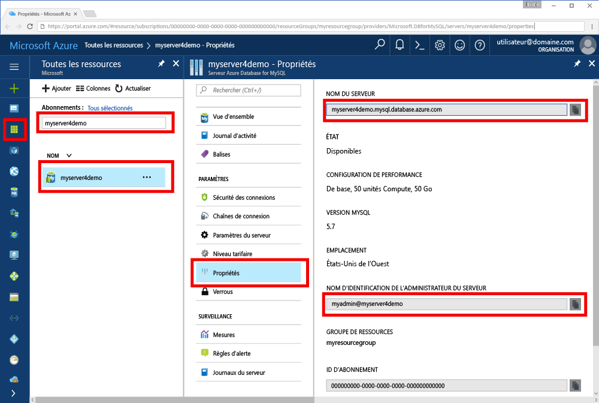

# <a name="azure-database-for-mysql-use-go-language-tooconnect-and-query-data"></a>Base de données Azure pour MySQL : utilisent la commande Go langage tooconnect et interroger des données
Ce démarrage rapide montre comment tooconnect tooan base de données Azure pour MySQL à l’aide de code hello écrite dans [accédez](https://golang.org/) langage à partir des plates-formes Windows, Ubuntu Linux et Apple macOS. Il montre comment toouse SQL instructions tooquery, insérer, mettre à jour et supprimer des données dans la base de données hello. Cet article suppose que vous êtes familiarisé avec le développement à l’aide de Go, mais que vous êtes tooworking nouvelle base de données Azure pour MySQL.

## <a name="prerequisites"></a>Composants requis
Ce démarrage rapide utilise des ressources hello créés dans un de ces guides comme point de départ :
- [Création d’un serveur Azure Database pour MySQL à l’aide du portail Azure](./quickstart-create-mysql-server-database-using-azure-portal.md)
- [Création d’un serveur Azure Database pour MySQL à l’aide de la CLI Azure](./quickstart-create-mysql-server-database-using-azure-cli.md)

## <a name="install-go-and-mysql-connector"></a>Installer le connecteur pour Go et MySQL
Installer [accédez](https://golang.org/doc/install) et hello [go-sql-pilote pour MySQL](https://github.com/go-sql-driver/mysql#installation) sur votre propre ordinateur. Selon votre plateforme, suivez les étapes de hello :

### <a name="windows"></a>Windows
1. [Télécharger](https://golang.org/dl/) et installer Go pour Microsoft Windows, en fonction de toohello [des instructions d’installation](https://golang.org/doc/install).
2. Lancez l’invite de commandes hello à partir du menu Démarrer de hello.
3. Créez un dossier pour votre projet. `mkdir  %USERPROFILE%\go\src\mysqlgo`.
4. Placez-vous dans le dossier du projet hello, tel que `cd %USERPROFILE%\go\src\mysqlgo`.
5. Définissez la variable d’environnement hello pour le répertoire de code source GOPATH toopoint toohello. `set GOPATH=%USERPROFILE%\go`.
6. Installer hello [go-sql-pilote pour mysql](https://github.com/go-sql-driver/mysql#installation) en exécutant hello `go get github.com/go-sql-driver/mysql` commande.

   En résumé, installez Go, puis exécuter ces commandes dans une invite de commandes hello :
   ```cmd
   mkdir  %USERPROFILE%\go\src\mysqlgo
   cd %USERPROFILE%\go\src\mysqlgo
   set GOPATH=%USERPROFILE%\go
   go get github.com/go-sql-driver/mysql
   ```

### <a name="linux-ubuntu"></a>Linux (Ubuntu)
1. Lancez l’interpréteur de commandes Bash hello. 
2. Installez Go en exécutant la commande `sudo apt-get install golang-go`.
3. Créez un dossier pour votre projet dans votre répertoire de base, par exemple `mkdir -p ~/go/src/mysqlgo/`.
4. Placez-vous dans le dossier de hello, tel que `cd ~/go/src/mysqlgo/`.
5. Ensemble hello GOPATH environnement variable toopoint tooa source valide répertoire, tel que votre accueil actuel du répertoire atteindre le dossier. À l’interpréteur de commandes bash hello, exécutez `export GOPATH=~/go` tooadd hello accédez répertoire comme hello GOPATH pour la session d’interpréteur de commandes en cours hello.
6. Installer hello [go-sql-pilote pour mysql](https://github.com/go-sql-driver/mysql#installation) en exécutant hello `go get github.com/go-sql-driver/mysql` commande.

   Pour résumer, exécutez ces commandes Bash :
   ```bash
   sudo apt-get install golang-go
   mkdir -p ~/go/src/mysqlgo/
   cd ~/go/src/mysqlgo/
   export GOPATH=~/go/
   go get github.com/go-sql-driver/mysql
   ```

### <a name="apple-macos"></a>Système d’exploitation mac d’Apple
1. Téléchargez et installez accèdent selon toohello [des instructions d’installation](https://golang.org/doc/install) correspondant à votre plateforme. 
2. Lancez l’interpréteur de commandes Bash hello. 
3. Créez un dossier pour votre projet dans votre répertoire de base, par exemple `mkdir -p ~/go/src/mysqlgo/`.
4. Placez-vous dans le dossier de hello, tel que `cd ~/go/src/mysqlgo/`.
5. Ensemble hello GOPATH environnement variable toopoint tooa source valide répertoire, tel que votre accueil actuel du répertoire atteindre le dossier. À l’interpréteur de commandes bash hello, exécutez `export GOPATH=~/go` tooadd hello accédez répertoire comme hello GOPATH pour la session d’interpréteur de commandes en cours hello.
6. Installer hello [go-sql-pilote pour mysql](https://github.com/go-sql-driver/mysql#installation) en exécutant hello `go get github.com/go-sql-driver/mysql` commande.

   Pour résumer, installez Go, puis exécutez ces commandes Bash :
   ```bash
   mkdir -p ~/go/src/mysqlgo/
   cd ~/go/src/mysqlgo/
   export GOPATH=~/go/
   go get github.com/go-sql-driver/mysql
   ```

## <a name="get-connection-information"></a>Obtenir des informations de connexion
Obtenir hello connexion informations nécessaires tooconnect toohello base de données Azure pour MySQL. Vous devez hello des informations d’identification de nom et la connexion serveur complet.

1. Connectez-vous à toohello [portail Azure](https://portal.azure.com/).
2. Hello menu de gauche dans le portail Azure, cliquez sur **toutes les ressources** et recherchez le serveur hello vous avez accroissant, tel que **myserver4demo**.
3. Cliquez sur le nom du serveur hello **myserver4demo**.
4. Serveur hello sélectionnez **propriétés** page. Prenez note de hello **nom du serveur** et **nom de connexion de serveur admin**.
 
5. Si vous oubliez vos informations de connexion du serveur, accédez à toohello **vue d’ensemble** page Nom de connexion d’administrateur du serveur de hello tooview et, si nécessaire, réinitialiser un mot de passe hello.
   

## <a name="build-and-run-go-code"></a>Générer et exécuter du code Go 
1. toowrite Golang code, vous pouvez utiliser un simple éditeur de texte, tel que le bloc-notes dans Microsoft Windows, [vi](http://manpages.ubuntu.com/manpages/xenial/man1/nvi.1.html#contenttoc5) ou [Nano](https://www.nano-editor.org/) dans Ubuntu ou TextEdit dans macOS. Si vous préférez un environnement de développement interactif (EDI) plus complet, essayez [Gogland](https://www.jetbrains.com/go/) de Jetbrains, [Visual Studio Code](https://code.visualstudio.com/) de Microsoft, ou [Atom](https://atom.io/).
2. Collez hello code Go à partir des sections hello ci-dessous dans des fichiers texte et enregistrer dans votre dossier de projet avec l’extension de fichier \*.consultez la rubrique, telles que le chemin d’accès au Windows `%USERPROFILE%\go\src\mysqlgo\createtable.go` ou chemin d’accès de Linux `~/go/src/mysqlgo/createtable.go`.
3. Recherchez hello `HOST`, `DATABASE`, `USER`, et `PASSWORD` constantes dans le code hello et valeurs de l’exemple hello remplacer par vos propres valeurs. 
4. Lancez l’invite de commandes hello ou bash shell. Basculez dans votre dossier de projet. Par exemple, sur Windows `cd %USERPROFILE%\go\src\mysqlgo\`. Sur Linux `cd ~/go/src/mysqlgo/`.  Certains éditeurs d’IDE hello mentionnés offrent des fonctions de débogage et d’exécution sans nécessiter de commandes d’environnement.
5. Exécuter le code de hello en tapant la commande hello `go run createtable.go` toocompile hello application et exécutez-le. 
6. Vous pouvez également les code hello toobuild dans une application native, `go build createtable.go`, puis lancez `createtable.exe` application hello de toorun.

## <a name="connect-create-table-and-insert-data"></a>Se connecter, créer des tables et insérer des données
Utilisez hello suivantes tooconnect toohello server de code, créer une table et chargez à l’aide de données hello un **insérer** instruction SQL. 

code de Hello importe trois packages : hello [package sql](https://golang.org/pkg/database/sql/), hello [pilote sql accédez pour mysql](https://github.com/go-sql-driver/mysql#installation) comme un toocommunicate pilote avec Bonjour Azure de base de données de MySQL et hello [fmt package](https://golang.org/pkg/fmt/)imprimée d’entrée et en sortie sur la ligne de commande hello.

Hello code appelle la méthode [sql. Open()](http://go-database-sql.org/accessing.html) tooconnect tooAzure base de données MySQL et la connexion de hello de vérifications à l’aide de la méthode [db. Ping()](https://golang.org/pkg/database/sql/#DB.Ping). A [handle de la base de données](https://golang.org/pkg/database/sql/#DB) est utilisé partout, contenant le pool de connexions hello pour le serveur de base de données hello. appels de code Bonjour Bonjour [Exec()](https://golang.org/pkg/database/sql/#DB.Exec) méthode plusieurs fois toorun plusieurs commandes DDL. code de Hello utilise également hello [Prepare()](http://go-database-sql.org/prepared.html) et Exec() toorun préparées avec des paramètres différents tooinsert trois lignes. Chaque fois qu’une méthode checkError() personnalisée est toocheck utilisé si une erreur s’est produite et un dysfonctionnement tooexit.

Remplacez hello `host`, `database`, `user`, et `password` constantes avec vos propres valeurs. 

```Go
package main

import (
    "database/sql"
    "fmt"

    _ "github.com/go-sql-driver/mysql"
)

const (
    host     = "myserver4demo.mysql.database.azure.com"
    database = "quickstartdb"
    user     = "myadmin@myserver4demo"
    password = "yourpassword"
)

func checkError(err error) {
    if err != nil {
        panic(err)
    }
}

func main() {

    // Initialize connection string.
    var connectionString = fmt.Sprintf("%s:%s@tcp(%s:3306)/%s?allowNativePasswords=true", user, password, host, database)

    // Initialize connection object.
    db, err := sql.Open("mysql", connectionString)
    checkError(err)
    defer db.Close()

    err = db.Ping()
    checkError(err)
    fmt.Println("Successfully created connection toodatabase.")

    // Drop previous table of same name if one exists.
    _, err = db.Exec("DROP TABLE IF EXISTS inventory;")
    checkError(err)
    fmt.Println("Finished dropping table (if existed).")

    // Create table.
    _, err = db.Exec("CREATE TABLE inventory (id serial PRIMARY KEY, name VARCHAR(50), quantity INTEGER);")
    checkError(err)
    fmt.Println("Finished creating table.")

    // Insert some data into table.
    sqlStatement, err := db.Prepare("INSERT INTO inventory (name, quantity) VALUES (?, ?);")
    res, err := sqlStatement.Exec("banana", 150)
    checkError(err)
    rowCount, err := res.RowsAffected()
    fmt.Printf("Inserted %d row(s) of data.\n", rowCount)

    res, err = sqlStatement.Exec("orange", 154)
    checkError(err)
    rowCount, err = res.RowsAffected()
    fmt.Printf("Inserted %d row(s) of data.\n", rowCount)

    res, err = sqlStatement.Exec("apple", 100)
    checkError(err)
    rowCount, err = res.RowsAffected()
    fmt.Printf("Inserted %d row(s) of data.\n", rowCount)
    fmt.Println("Done.")
}

```

## <a name="read-data"></a>Lire les données
Suivante de hello utilisation tooconnect de code et lire à l’aide de données hello un **sélectionnez** instruction SQL. 

code de Hello importe trois packages : hello [package sql](https://golang.org/pkg/database/sql/), hello [pilote sql accédez pour mysql](https://github.com/go-sql-driver/mysql#installation) comme un toocommunicate pilote avec Bonjour Azure de base de données de MySQL et hello [fmt package](https://golang.org/pkg/fmt/)imprimée d’entrée et en sortie sur la ligne de commande hello.

Hello code appelle la méthode [sql. Open()](http://go-database-sql.org/accessing.html) tooconnect tooAzure base de données MySQL et la connexion de hello de vérifications à l’aide de la méthode [db. Ping()](https://golang.org/pkg/database/sql/#DB.Ping). A [handle de la base de données](https://golang.org/pkg/database/sql/#DB) est utilisé partout, contenant le pool de connexions hello pour le serveur de base de données hello. appels de code Bonjour Bonjour [Query()](https://golang.org/pkg/database/sql/#DB.Query) commande select de la méthode toorun hello. Ensuite il exécute [Next()](https://golang.org/pkg/database/sql/#Rows.Next) tooiterate dans le jeu de résultats hello et [Scan()](https://golang.org/pkg/database/sql/#Rows.Scan) les valeurs de colonne de tooparse hello, l’enregistrement de la valeur de hello dans des variables. Chaque fois qu’une méthode checkError() personnalisée est toocheck utilisé si une erreur s’est produite et un dysfonctionnement tooexit.

Remplacez hello `host`, `database`, `user`, et `password` constantes avec vos propres valeurs. 

```Go
package main

import (
    "database/sql"
    "fmt"

    _ "github.com/go-sql-driver/mysql"
)

const (
    host     = "myserver4demo.mysql.database.azure.com"
    database = "quickstartdb"
    user     = "myadmin@myserver4demo"
    password = "yourpassword"
)

func checkError(err error) {
    if err != nil {
        panic(err)
    }
}

func main() {

    // Initialize connection string.
    var connectionString = fmt.Sprintf("%s:%s@tcp(%s:3306)/%s?allowNativePasswords=true", user, password, host, database)

    // Initialize connection object.
    db, err := sql.Open("mysql", connectionString)
    checkError(err)
    defer db.Close()

    err = db.Ping()
    checkError(err)
    fmt.Println("Successfully created connection toodatabase.")

    // Variables for printing column data when scanned.
    var (
        id       int
        name     string
        quantity int
    )

    // Read some data from hello table.
    rows, err := db.Query("SELECT id, name, quantity from inventory;")
    checkError(err)
    defer rows.Close()
    fmt.Println("Reading data:")
    for rows.Next() {
        err := rows.Scan(&id, &name, &quantity)
        checkError(err)
        fmt.Printf("Data row = (%d, %s, %d)\n", id, name, quantity)
    }
    err = rows.Err()
    checkError(err)
    fmt.Println("Done.")
}
```

## <a name="update-data"></a>Mettre à jour des données
Suivant de hello utilisation tooconnect de code et mettre à jour les données de hello à l’aide un **mettre à jour** instruction SQL. 

code de Hello importe trois packages : hello [package sql](https://golang.org/pkg/database/sql/), hello [pilote sql accédez pour mysql](https://github.com/go-sql-driver/mysql#installation) comme un toocommunicate pilote avec Bonjour Azure de base de données de MySQL et hello [fmt package](https://golang.org/pkg/fmt/)imprimée d’entrée et en sortie sur la ligne de commande hello.

Hello code appelle la méthode [sql. Open()](http://go-database-sql.org/accessing.html) tooconnect tooAzure base de données MySQL et la connexion de hello de vérifications à l’aide de la méthode [db. Ping()](https://golang.org/pkg/database/sql/#DB.Ping). A [handle de la base de données](https://golang.org/pkg/database/sql/#DB) est utilisé partout, contenant le pool de connexions hello pour le serveur de base de données hello. appels de code Bonjour Bonjour [Exec()](https://golang.org/pkg/database/sql/#DB.Exec) commande de mise à jour de la méthode toorun hello. Chaque fois qu’une méthode checkError() personnalisée est toocheck utilisé si une erreur s’est produite et un dysfonctionnement tooexit.

Remplacez hello `host`, `database`, `user`, et `password` constantes avec vos propres valeurs. 

```Go
package main

import (
    "database/sql"
    "fmt"

    _ "github.com/go-sql-driver/mysql"
)

const (
    host     = "myserver4demo.mysql.database.azure.com"
    database = "quickstartdb"
    user     = "myadmin@myserver4demo"
    password = "yourpassword"
)

func checkError(err error) {
    if err != nil {
        panic(err)
    }
}

func main() {

    // Initialize connection string.
    var connectionString = fmt.Sprintf("%s:%s@tcp(%s:3306)/%s?allowNativePasswords=true", user, password, host, database)

    // Initialize connection object.
    db, err := sql.Open("mysql", connectionString)
    checkError(err)
    defer db.Close()

    err = db.Ping()
    checkError(err)
    fmt.Println("Successfully created connection toodatabase.")

    // Modify some data in table.
    rows, err := db.Exec("UPDATE inventory SET quantity = ? WHERE name = ?", 200, "banana")
    checkError(err)
    rowCount, err := rows.RowsAffected()
    fmt.Printf("Deleted %d row(s) of data.\n", rowCount)
    fmt.Println("Done.")
}
```

## <a name="delete-data"></a>Suppression de données
Suivant de hello utilisation tooconnect de code et supprimer des données à l’aide un **supprimer** instruction SQL. 

code de Hello importe trois packages : hello [package sql](https://golang.org/pkg/database/sql/), hello [pilote sql accédez pour mysql](https://github.com/go-sql-driver/mysql#installation) comme un toocommunicate pilote avec Bonjour Azure de base de données de MySQL et hello [fmt package](https://golang.org/pkg/fmt/)imprimée d’entrée et en sortie sur la ligne de commande hello.

Hello code appelle la méthode [sql. Open()](http://go-database-sql.org/accessing.html) tooconnect tooAzure base de données MySQL et la connexion de hello de vérifications à l’aide de la méthode [db. Ping()](https://golang.org/pkg/database/sql/#DB.Ping). A [handle de la base de données](https://golang.org/pkg/database/sql/#DB) est utilisé partout, contenant le pool de connexions hello pour le serveur de base de données hello. appels de code Bonjour Bonjour [Exec()](https://golang.org/pkg/database/sql/#DB.Exec) hello toorun de méthode de commande delete. Chaque fois qu’une méthode checkError() personnalisée est toocheck utilisé si une erreur s’est produite et un dysfonctionnement tooexit.

Remplacez hello `host`, `database`, `user`, et `password` constantes avec vos propres valeurs. 

```Go
package main

import (
    "database/sql"
    "fmt"
    _ "github.com/go-sql-driver/mysql"
)

const (
    host     = "myserver4demo.mysql.database.azure.com"
    database = "quickstartdb"
    user     = "myadmin@myserver4demo"
    password = "yourpassword"
)

func checkError(err error) {
    if err != nil {
        panic(err)
    }
}

func main() {

    // Initialize connection string.
    var connectionString = fmt.Sprintf("%s:%s@tcp(%s:3306)/%s?allowNativePasswords=true", user, password, host, database)

    // Initialize connection object.
    db, err := sql.Open("mysql", connectionString)
    checkError(err)
    defer db.Close()

    err = db.Ping()
    checkError(err)
    fmt.Println("Successfully created connection toodatabase.")

    // Modify some data in table.
    rows, err := db.Exec("DELETE FROM inventory WHERE name = ?", "orange")
    checkError(err)
    rowCount, err := rows.RowsAffected()
    fmt.Printf("Deleted %d row(s) of data.\n", rowCount)
    fmt.Println("Done.")
}
```

## <a name="next-steps"></a>Étapes suivantes
> [!div class="nextstepaction"]
> [Migration de votre base de données PostgreSQL par exportation et importation](./concepts-migrate-import-export.md)
