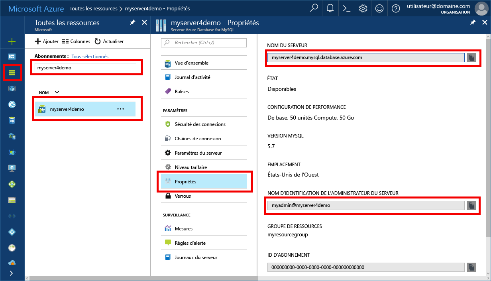

# <a name="azure-database-for-mysql-use-mysql-workbench-tooconnect-and-query-data"></a><span data-ttu-id="4ad7a-103">Base de données Azure pour MySQL : utilisez MySQL Workbench tooconnect et interroger des données</span><span class="sxs-lookup"><span data-stu-id="4ad7a-103">Azure Database for MySQL: Use MySQL Workbench tooconnect and query data</span></span>
<span data-ttu-id="4ad7a-104">Ce démarrage rapide montre comment tooconnect tooan base de données Azure pour l’utilisation de MySQL hello application MySQL Workbench.</span><span class="sxs-lookup"><span data-stu-id="4ad7a-104">This quickstart demonstrates how tooconnect tooan Azure Database for MySQL using hello MySQL Workbench application.</span></span> 

## <a name="prerequisites"></a><span data-ttu-id="4ad7a-105">Composants requis</span><span class="sxs-lookup"><span data-stu-id="4ad7a-105">Prerequisites</span></span>
<span data-ttu-id="4ad7a-106">Ce démarrage rapide utilise des ressources hello créés dans un de ces guides comme point de départ :</span><span class="sxs-lookup"><span data-stu-id="4ad7a-106">This quickstart uses hello resources created in either of these guides as a starting point:</span></span>
- [<span data-ttu-id="4ad7a-107">Création d’un serveur Azure Database pour MySQL à l’aide du portail Azure</span><span class="sxs-lookup"><span data-stu-id="4ad7a-107">Create an Azure Database for MySQL server using Azure portal</span></span>](./quickstart-create-mysql-server-database-using-azure-portal.md)
- [<span data-ttu-id="4ad7a-108">Création d’un serveur de base de données Azure pour MySQL à l’aide d’Azure CLI</span><span class="sxs-lookup"><span data-stu-id="4ad7a-108">Create an Azure Database for MySQL server using Azure CLI</span></span>](./quickstart-create-mysql-server-database-using-azure-cli.md)

## <a name="install-mysql-workbench"></a><span data-ttu-id="4ad7a-109">Installer MySQL Workbench</span><span class="sxs-lookup"><span data-stu-id="4ad7a-109">Install MySQL Workbench</span></span>
<span data-ttu-id="4ad7a-110">Télécharger et installer le banc d’essai MySQL sur votre ordinateur à partir de [site Web de MySQL hello](https://dev.mysql.com/downloads/workbench/).</span><span class="sxs-lookup"><span data-stu-id="4ad7a-110">Download and install MySQL Workbench on your computer from [hello MySQL website](https://dev.mysql.com/downloads/workbench/).</span></span>

## <a name="get-connection-information"></a><span data-ttu-id="4ad7a-111">Obtenir des informations de connexion</span><span class="sxs-lookup"><span data-stu-id="4ad7a-111">Get connection information</span></span>
<span data-ttu-id="4ad7a-112">Obtenir hello connexion informations nécessaires tooconnect toohello base de données Azure pour MySQL.</span><span class="sxs-lookup"><span data-stu-id="4ad7a-112">Get hello connection information needed tooconnect toohello Azure Database for MySQL.</span></span> <span data-ttu-id="4ad7a-113">Vous devez hello des informations d’identification de nom et la connexion serveur complet.</span><span class="sxs-lookup"><span data-stu-id="4ad7a-113">You need hello fully qualified server name and login credentials.</span></span>

1. <span data-ttu-id="4ad7a-114">Connectez-vous à toohello [portail Azure](https://portal.azure.com/).</span><span class="sxs-lookup"><span data-stu-id="4ad7a-114">Log in toohello [Azure portal](https://portal.azure.com/).</span></span>

2. <span data-ttu-id="4ad7a-115">Hello menu de gauche dans le portail Azure, cliquez sur **toutes les ressources** et recherchez le serveur hello vous avez créé, tel que **myserver4demo**.</span><span class="sxs-lookup"><span data-stu-id="4ad7a-115">From hello left-hand menu in Azure portal, click **All resources** and search for hello server you have created, such as **myserver4demo**.</span></span>

3. <span data-ttu-id="4ad7a-116">Cliquez sur le nom du serveur hello.</span><span class="sxs-lookup"><span data-stu-id="4ad7a-116">Click hello server name.</span></span>

4. <span data-ttu-id="4ad7a-117">Serveur hello sélectionnez **propriétés** page.</span><span class="sxs-lookup"><span data-stu-id="4ad7a-117">Select hello server's **Properties** page.</span></span> <span data-ttu-id="4ad7a-118">Prenez note de hello **nom du serveur** et **nom de connexion de serveur admin**.</span><span class="sxs-lookup"><span data-stu-id="4ad7a-118">Make a note of hello **Server name** and **Server admin login name**.</span></span>

 
 
5. <span data-ttu-id="4ad7a-120">Si vous oubliez vos informations de connexion du serveur, accédez à toohello **vue d’ensemble** page Nom de connexion d’administrateur du serveur de hello tooview et, si nécessaire, réinitialiser un mot de passe hello.</span><span class="sxs-lookup"><span data-stu-id="4ad7a-120">If you forget your server login information, navigate toohello **Overview** page tooview hello Server admin login name and, if necessary, reset hello password.</span></span>

## <a name="connect-toohello-server-using-mysql-workbench"></a><span data-ttu-id="4ad7a-121">Connexion serveur toohello à l’aide de banc d’essai MySQL</span><span class="sxs-lookup"><span data-stu-id="4ad7a-121">Connect toohello server using MySQL Workbench</span></span> 
<span data-ttu-id="4ad7a-122">tooconnect tooAzure MySQL server à l’aide de l’outil hello GUI banc d’essai MySQL :</span><span class="sxs-lookup"><span data-stu-id="4ad7a-122">tooconnect tooAzure MySQL server using hello GUI tool MySQL Workbench:</span></span>

1.  <span data-ttu-id="4ad7a-123">Lancez hello application banc d’essai MySQL sur votre ordinateur.</span><span class="sxs-lookup"><span data-stu-id="4ad7a-123">Launch hello MySQL Workbench application on your computer.</span></span> 

2.  <span data-ttu-id="4ad7a-124">Dans **le programme d’installation nouvelle connexion** boîte de dialogue, entrez hello suivant les informations de hello **paramètres** onglet :</span><span class="sxs-lookup"><span data-stu-id="4ad7a-124">In **Setup New Connection** dialog box, enter hello following information on hello **Parameters** tab:</span></span>

    

    | <span data-ttu-id="4ad7a-126">**Paramètre**</span><span class="sxs-lookup"><span data-stu-id="4ad7a-126">**Setting**</span></span> | <span data-ttu-id="4ad7a-127">**Valeur suggérée**</span><span class="sxs-lookup"><span data-stu-id="4ad7a-127">**Suggested value**</span></span> | <span data-ttu-id="4ad7a-128">**Description du champ**</span><span class="sxs-lookup"><span data-stu-id="4ad7a-128">**Field description**</span></span> |
    |---|---|---|
    |   <span data-ttu-id="4ad7a-129">Nom de connexion</span><span class="sxs-lookup"><span data-stu-id="4ad7a-129">Connection Name</span></span> | <span data-ttu-id="4ad7a-130">Connexion démo</span><span class="sxs-lookup"><span data-stu-id="4ad7a-130">Demo Connection</span></span> | <span data-ttu-id="4ad7a-131">Spécifiez une étiquette pour cette connexion.</span><span class="sxs-lookup"><span data-stu-id="4ad7a-131">Specify a label for this connection.</span></span> |
    | <span data-ttu-id="4ad7a-132">Méthode de connexion</span><span class="sxs-lookup"><span data-stu-id="4ad7a-132">Connection Method</span></span> | <span data-ttu-id="4ad7a-133">Standard (TCP/IP)</span><span class="sxs-lookup"><span data-stu-id="4ad7a-133">Standard (TCP/IP)</span></span> | <span data-ttu-id="4ad7a-134">Standard (TCP/IP) est suffisant.</span><span class="sxs-lookup"><span data-stu-id="4ad7a-134">Standard (TCP/IP) is sufficient.</span></span> |
    | <span data-ttu-id="4ad7a-135">Nom d’hôte</span><span class="sxs-lookup"><span data-stu-id="4ad7a-135">Hostname</span></span> | <span data-ttu-id="4ad7a-136">*nom du serveur*</span><span class="sxs-lookup"><span data-stu-id="4ad7a-136">*server name*</span></span> | <span data-ttu-id="4ad7a-137">Spécifiez la valeur de nom de serveur hello utilisé lorsque vous avez créé précédemment des hello de base de données Azure pour MySQL.</span><span class="sxs-lookup"><span data-stu-id="4ad7a-137">Specify hello server name value that was used when you created hello Azure Database for MySQL earlier.</span></span> <span data-ttu-id="4ad7a-138">Le serveur que nous utilisons dans notre exemple est myserver4demo.mysql.database.azure.com. Utilisez le nom de domaine complet hello (\*. mysql.database.azure.com) comme indiqué dans l’exemple de hello.</span><span class="sxs-lookup"><span data-stu-id="4ad7a-138">Our example server shown is myserver4demo.mysql.database.azure.com. Use hello fully qualified domain name (\*.mysql.database.azure.com) as shown in hello example.</span></span> <span data-ttu-id="4ad7a-139">Suivez les étapes de hello dans les informations de connexion du hello tooget de la section précédente hello si vous ne vous souvenez pas de nom de votre serveur.</span><span class="sxs-lookup"><span data-stu-id="4ad7a-139">Follow hello steps in hello previous section tooget hello connection information if you do not remember your server name.</span></span>  |
    | <span data-ttu-id="4ad7a-140">Port</span><span class="sxs-lookup"><span data-stu-id="4ad7a-140">Port</span></span> | <span data-ttu-id="4ad7a-141">3306</span><span class="sxs-lookup"><span data-stu-id="4ad7a-141">3306</span></span> | <span data-ttu-id="4ad7a-142">Utilisez toujours le port 3306 lors de la connexion de base de données de tooAzure pour MySQL.</span><span class="sxs-lookup"><span data-stu-id="4ad7a-142">Always use port 3306 when connecting tooAzure Database for MySQL.</span></span> |
    | <span data-ttu-id="4ad7a-143">Nom d’utilisateur</span><span class="sxs-lookup"><span data-stu-id="4ad7a-143">Username</span></span> |  <span data-ttu-id="4ad7a-144">*nom de connexion d’administrateur du serveur*</span><span class="sxs-lookup"><span data-stu-id="4ad7a-144">*server admin login name*</span></span> | <span data-ttu-id="4ad7a-145">Tapez hello server connexion nom d’utilisateur administrateur fourni lorsque vous avez créé précédemment des hello de base de données Azure pour MySQL.</span><span class="sxs-lookup"><span data-stu-id="4ad7a-145">Type in hello server admin login username supplied when you created hello Azure Database for MySQL earlier.</span></span> <span data-ttu-id="4ad7a-146">Le nom d’utilisateur dans notre exemple est myadmin@myserver4demo.</span><span class="sxs-lookup"><span data-stu-id="4ad7a-146">Our example username is myadmin@myserver4demo.</span></span> <span data-ttu-id="4ad7a-147">Suivez les étapes de hello dans les informations de connexion du hello tooget de la section précédente hello si vous ne vous souvenez pas de nom d’utilisateur hello.</span><span class="sxs-lookup"><span data-stu-id="4ad7a-147">Follow hello steps in hello previous section tooget hello connection information if you do not remember hello username.</span></span> <span data-ttu-id="4ad7a-148">format de Hello est  *username@servername* .</span><span class="sxs-lookup"><span data-stu-id="4ad7a-148">hello format is *username@servername*.</span></span>
    | <span data-ttu-id="4ad7a-149">Mot de passe</span><span class="sxs-lookup"><span data-stu-id="4ad7a-149">Password</span></span> | <span data-ttu-id="4ad7a-150">votre mot de passe</span><span class="sxs-lookup"><span data-stu-id="4ad7a-150">your password</span></span> | <span data-ttu-id="4ad7a-151">Cliquez sur **magasin dans le coffre...**  mot de passe de bouton toosave hello.</span><span class="sxs-lookup"><span data-stu-id="4ad7a-151">Click **Store in Vault...** button toosave hello password.</span></span> |

3.   <span data-ttu-id="4ad7a-152">Cliquez sur **tester la connexion** tootest si tous les paramètres sont configurés correctement.</span><span class="sxs-lookup"><span data-stu-id="4ad7a-152">Click **Test Connection** tootest if all parameters are correctly configured.</span></span> 

4.   <span data-ttu-id="4ad7a-153">Cliquez sur **OK** connexion de hello toosave.</span><span class="sxs-lookup"><span data-stu-id="4ad7a-153">Click **OK** toosave hello connection.</span></span> 

5.   <span data-ttu-id="4ad7a-154">Dans la liste des hello **connexion MySQL**, cliquez sur le serveur de tooyour correspondant hello vignette et attendez hello toobe de connexion établie.</span><span class="sxs-lookup"><span data-stu-id="4ad7a-154">In hello listing of **MySQL Connections**, click hello tile corresponding tooyour server and wait for hello connection toobe established.</span></span>

6.   <span data-ttu-id="4ad7a-155">Un nouvel onglet SQL s’ouvre avec un éditeur vide où vous pouvez saisir vos requêtes.</span><span class="sxs-lookup"><span data-stu-id="4ad7a-155">A new SQL tab opens with a blank editor where you can type your queries.</span></span>

    > [!NOTE]
    > <span data-ttu-id="4ad7a-156">Par défaut, la sécurité de la connexion SSL est requise et appliquée sur votre serveur Azure Database pour MySQL.</span><span class="sxs-lookup"><span data-stu-id="4ad7a-156">By default, SSL connection security is required and enforced on your Azure Database for MySQL server.</span></span> <span data-ttu-id="4ad7a-157">En général, aucune configuration supplémentaire avec les certificats SSL n’est requise pour le serveur de banc d’essai MySQL tooconnect tooyour.</span><span class="sxs-lookup"><span data-stu-id="4ad7a-157">Typically no additional configuration with SSL certificates is required for MySQL Workbench tooconnect tooyour server.</span></span> <span data-ttu-id="4ad7a-158">Pour plus d’informations sur SSL, consultez [tooAzure base de données de connexion de connectivité configurez SSL dans votre application de toosecurely pour MySQL](./howto-configure-ssl.md).</span><span class="sxs-lookup"><span data-stu-id="4ad7a-158">For more information on SSL, see [Configure SSL connectivity in your application toosecurely connect tooAzure Database for MySQL](./howto-configure-ssl.md).</span></span>  <span data-ttu-id="4ad7a-159">Si vous avez besoin de toodisable SSL, visitez hello portail Azure et cliquez sur hello connexion sécurité page toodisable hello SSL d’appliquer la connexion bascule.</span><span class="sxs-lookup"><span data-stu-id="4ad7a-159">If you need toodisable SSL, visit hello Azure portal and click hello Connection security page toodisable hello Enforce SSL connection toggle button.</span></span>

## <a name="create-a-table-insert-data-read-data-update-data-delete-data"></a><span data-ttu-id="4ad7a-160">Créer une table, insérer des données, lire les données, mettre à jour des données et supprimer des données</span><span class="sxs-lookup"><span data-stu-id="4ad7a-160">Create a table, insert data, read data, update data, delete data</span></span>
1. <span data-ttu-id="4ad7a-161">Copiez et collez les exemple de code SQL hello dans un tooillustrate d’onglet SQL vide quelques exemples de données.</span><span class="sxs-lookup"><span data-stu-id="4ad7a-161">Copy and paste hello sample SQL code into a blank SQL tab tooillustrate some sample data.</span></span>

    <span data-ttu-id="4ad7a-162">Ce code crée une base de données vide nommée quickstartdb, puis crée un exemple de table nommée inventory.</span><span class="sxs-lookup"><span data-stu-id="4ad7a-162">This code creates an empty database named quickstartdb, and then creates a sample table named inventory.</span></span> <span data-ttu-id="4ad7a-163">Il insère des lignes, puis lit les lignes hello.</span><span class="sxs-lookup"><span data-stu-id="4ad7a-163">It inserts some rows, then reads hello rows.</span></span> <span data-ttu-id="4ad7a-164">Il modifie des données de hello avec une instruction de mise à jour et lectures hello à nouveau les lignes.</span><span class="sxs-lookup"><span data-stu-id="4ad7a-164">It changes hello data with an update statement, and reads hello rows again.</span></span> <span data-ttu-id="4ad7a-165">Pour finir, il supprime une ligne et lit les lignes hello à nouveau.</span><span class="sxs-lookup"><span data-stu-id="4ad7a-165">Finally it deletes a row, and reads hello rows again.</span></span>
    
    ```sql
    -- Create a database
    -- DROP DATABASE IF EXISTS quickstartdb;
    CREATE DATABASE quickstartdb;
    USE quickstartdb;
    
    -- Create a table and insert rows
    DROP TABLE IF EXISTS inventory;
    CREATE TABLE inventory (id serial PRIMARY KEY, name VARCHAR(50), quantity INTEGER);
    INSERT INTO inventory (name, quantity) VALUES ('banana', 150);
    INSERT INTO inventory (name, quantity) VALUES ('orange', 154);
    INSERT INTO inventory (name, quantity) VALUES ('apple', 100);
    
    -- Read
    SELECT * FROM inventory;
    
    -- Update
    UPDATE inventory SET quantity = 200 WHERE id = 1;
    SELECT * FROM inventory;
    
    -- Delete
    DELETE FROM inventory WHERE id = 2;
    SELECT * FROM inventory;
    ```

    <span data-ttu-id="4ad7a-166">capture d’écran de Hello montre un exemple de code SQL de hello dans la sortie de SQL Workbench et hello après que qu’il a été exécuté.</span><span class="sxs-lookup"><span data-stu-id="4ad7a-166">hello screenshot shows an example of hello SQL code in SQL Workbench and hello output after it has been run.</span></span>
    
    

2. <span data-ttu-id="4ad7a-168">hello toorun exemple de Code SQL, cliquez sur hello éclaircissement icône d’éclair dans la barre d’outils hello Hello **fichier SQL** onglet.</span><span class="sxs-lookup"><span data-stu-id="4ad7a-168">toorun hello sample SQL Code, click hello lightening bolt icon in hello toolbar of hello **SQL File** tab.</span></span>
3. <span data-ttu-id="4ad7a-169">Notez hello trois résultats à onglets Bonjour **grille de résultats** section milieu de hello de page de hello.</span><span class="sxs-lookup"><span data-stu-id="4ad7a-169">Notice hello three tabbed results in hello **Result Grid** section in hello middle of hello page.</span></span> 
4. <span data-ttu-id="4ad7a-170">Hello d’avis **sortie** liste à la fin de hello de page de hello.</span><span class="sxs-lookup"><span data-stu-id="4ad7a-170">Notice hello **Output** list at hello bottom of hello page.</span></span> <span data-ttu-id="4ad7a-171">Hello l’état de chaque commande est affiché.</span><span class="sxs-lookup"><span data-stu-id="4ad7a-171">hello status of each command is shown.</span></span> 

<span data-ttu-id="4ad7a-172">À présent, vous avez connecté tooAzure de base de données pour MySQL à l’aide de banc d’essai MySQL et interrogez les données à l’aide du langage SQL de hello.</span><span class="sxs-lookup"><span data-stu-id="4ad7a-172">Now, you have connected tooAzure Database for MySQL using MySQL Workbench, and have queried data using hello SQL language.</span></span>

## <a name="next-steps"></a><span data-ttu-id="4ad7a-173">Étapes suivantes</span><span class="sxs-lookup"><span data-stu-id="4ad7a-173">Next steps</span></span>
> [!div class="nextstepaction"]
> [<span data-ttu-id="4ad7a-174">Migration de votre base de données PostgreSQL par exportation et importation</span><span class="sxs-lookup"><span data-stu-id="4ad7a-174">Migrate your database using Export and Import</span></span>](./concepts-migrate-import-export.md)
