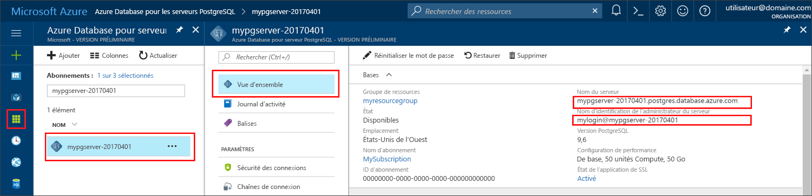

# <a name="azure-database-for-postgresql-use-go-language-tooconnect-and-query-data"></a>Base de données Azure pour PostgreSQL : utilisent la commande Go langage tooconnect et interroger des données
Ce démarrage rapide montre comment tooconnect tooan base de données Azure pour PostgreSQL à l’aide de code hello écrite dans [accédez](https://golang.org/) language (golang). Il montre comment toouse SQL instructions tooquery, insérer, mettre à jour et supprimer des données dans la base de données hello. Cet article suppose que vous êtes familiarisé avec le développement à l’aide de Go, mais que vous êtes tooworking nouvelle base de données Azure pour PostgreSQL.

## <a name="prerequisites"></a>Composants requis
Ce démarrage rapide utilise des ressources hello créés dans un de ces guides comme point de départ :
- [Créer une base de données - Portail](quickstart-create-server-database-portal.md)
- [Créer une base de données - Interface de ligne de commande Azure](quickstart-create-server-database-azure-cli.md)

## <a name="install-go-and-pq-connector"></a>Installer le connecteur pour Go et pq
Installer [accédez](https://golang.org/doc/install) et hello [Pure Postgres accédez pilote (LQ)](https://github.com/lib/pq) sur votre propre ordinateur. Selon votre plateforme, suivez les étapes de hello :

### <a name="windows"></a>Windows
1. [Télécharger](https://golang.org/dl/) et installer Go pour Microsoft Windows, en fonction de toohello [des instructions d’installation](https://golang.org/doc/install).
2. Lancez l’invite de commandes hello à partir du menu Démarrer de hello.
3. Créez un dossier pour votre projet. `mkdir  %USERPROFILE%\go\src\postgresqlgo`.
4. Placez-vous dans le dossier du projet hello, tel que `cd %USERPROFILE%\go\src\postgresqlgo`.
5. Définissez la variable d’environnement hello pour le répertoire de code source GOPATH toopoint toohello. `set GOPATH=%USERPROFILE%\go`.
6. Installer hello [Pure Postgres accédez pilote (LQ)](https://github.com/lib/pq) en exécutant hello `go get github.com/lib/pq` commande.

   En résumé, installez Go, puis exécuter ces commandes dans une invite de commandes hello :
   ```cmd
   mkdir  %USERPROFILE%\go\src\postgresqlgo
   cd %USERPROFILE%\go\src\postgresqlgo
   set GOPATH=%USERPROFILE%\go
   go get github.com/lib/pq
   ```

### <a name="linux-ubuntu"></a>Linux (Ubuntu)
1. Lancez l’interpréteur de commandes Bash hello. 
2. Installez Go en exécutant la commande `sudo apt-get install golang-go`.
3. Créez un dossier pour votre projet dans votre répertoire de base, par exemple `mkdir -p ~/go/src/postgresqlgo/`.
4. Placez-vous dans le dossier de hello, tel que `cd ~/go/src/postgresqlgo/`.
5. Ensemble hello GOPATH environnement variable toopoint tooa source valide répertoire, tel que votre accueil actuel du répertoire atteindre le dossier. À l’interpréteur de commandes bash hello, exécutez `export GOPATH=~/go` tooadd hello accédez répertoire comme hello GOPATH pour la session d’interpréteur de commandes en cours hello.
6. Installer hello [Pure Postgres accédez pilote (LQ)](https://github.com/lib/pq) en exécutant hello `go get github.com/lib/pq` commande.

   Pour résumer, exécutez ces commandes Bash :
   ```bash
   sudo apt-get install golang-go
   mkdir -p ~/go/src/postgresqlgo/
   cd ~/go/src/postgresqlgo/
   export GOPATH=~/go/
   go get github.com/lib/pq
   ```

### <a name="apple-macos"></a>Système d’exploitation mac d’Apple
1. Téléchargez et installez accèdent selon toohello [des instructions d’installation](https://golang.org/doc/install) correspondant à votre plateforme. 
2. Lancez l’interpréteur de commandes Bash hello. 
3. Créez un dossier pour votre projet dans votre répertoire de base, par exemple `mkdir -p ~/go/src/postgresqlgo/`.
4. Placez-vous dans le dossier de hello, tel que `cd ~/go/src/postgresqlgo/`.
5. Ensemble hello GOPATH environnement variable toopoint tooa source valide répertoire, tel que votre accueil actuel du répertoire atteindre le dossier. À l’interpréteur de commandes bash hello, exécutez `export GOPATH=~/go` tooadd hello accédez répertoire comme hello GOPATH pour la session d’interpréteur de commandes en cours hello.
6. Installer hello [Pure Postgres accédez pilote (LQ)](https://github.com/lib/pq) en exécutant hello `go get github.com/lib/pq` commande.

   Pour résumer, installez Go, puis exécutez ces commandes Bash :
   ```bash
   mkdir -p ~/go/src/postgresqlgo/
   cd ~/go/src/postgresqlgo/
   export GOPATH=~/go/
   go get github.com/lib/pq
   ```

## <a name="get-connection-information"></a>Obtenir des informations de connexion
Obtenir les informations nécessaires tooconnect toohello de hello connexion base de données Azure pour PostgreSQL. Vous devez hello des informations d’identification de nom et la connexion serveur complet.

1. Connectez-vous à toohello [portail Azure](https://portal.azure.com/).
2. Hello menu de gauche dans le portail Azure, cliquez sur **toutes les ressources** et recherchez le serveur hello vous avez créé, tel que **mypgserver-20170401**.
3. Cliquez sur le nom du serveur hello **mypgserver-20170401**.
4. Serveur hello sélectionnez **vue d’ensemble** page. Prenez note de hello **nom du serveur** et **nom de connexion de serveur admin**.
 
5. Si vous oubliez vos informations de connexion du serveur, accédez à toohello **vue d’ensemble** page et le nom de connexion d’administrateur du serveur hello de vue. Si nécessaire, le mot de passe réinitialisé hello.

## <a name="build-and-run-go-code"></a>Générer et exécuter du code Go 
1. toowrite Golang code, vous pouvez utiliser un simple éditeur de texte, tel que le bloc-notes dans Microsoft Windows, [vi](http://manpages.ubuntu.com/manpages/xenial/man1/nvi.1.html#contenttoc5) ou [Nano](https://www.nano-editor.org/) dans Ubuntu ou TextEdit dans macOS. Si vous préférez un environnement de développement interactif (EDI) plus complet, essayez [Gogland](https://www.jetbrains.com/go/) de Jetbrains, [Visual Studio Code](https://code.visualstudio.com/) de Microsoft, ou [Atom](https://atom.io/).
2. Collez le code de Golang de hello à partir des sections hello ci-dessous dans des fichiers texte et enregistrer dans votre dossier de projet avec l’extension de fichier \*.consultez la rubrique, telles que le chemin d’accès au Windows `%USERPROFILE%\go\src\postgresqlgo\createtable.go` ou chemin d’accès de Linux `~/go/src/postgresqlgo/createtable.go`.
3. Recherchez hello `HOST`, `DATABASE`, `USER`, et `PASSWORD` constantes dans le code hello et valeurs de l’exemple hello remplacer par vos propres valeurs.  
4. Lancez l’invite de commandes hello ou bash shell. Basculez dans votre dossier de projet. Par exemple, sur Windows `cd %USERPROFILE%\go\src\postgresqlgo\`. Sur Linux `cd ~/go/src/postgresqlgo/`. Certains des environnements IDE de hello mentionnés offrent des fonctions de débogage et d’exécution sans nécessiter de commandes d’environnement.
5. Exécuter le code de hello en tapant la commande hello `go run createtable.go` toocompile hello application et exécutez-le. 
6. Vous pouvez également les code hello toobuild dans une application native, `go build createtable.go`, puis lancez `createtable.exe` application hello de toorun.

## <a name="connect-and-create-a-table"></a>Se connecter et créer une table
Suivante de hello utilisation tooconnect de code et créer une table à l’aide de **CREATE TABLE** instruction SQL, suivie de **INSERT INTO** lignes de tooadd d’instructions SQL dans la table de hello.

code de Hello importe trois packages : hello [package sql](https://golang.org/pkg/database/sql/), hello [package de pq](http://godoc.org/github.com/lib/pq) comme un toocommunicate pilote avec hello Postgres server et hello [fmt package](https://golang.org/pkg/fmt/) pour impression entrée et sortie de ligne de commande hello.

Hello code appelle la méthode [sql. Open()](http://godoc.org/github.com/lib/pq#Open) tooconnect tooAzure base de données PostgreSQL et connexion hello de vérifications à l’aide de la méthode [db. Ping()](https://golang.org/pkg/database/sql/#DB.Ping). A [handle de la base de données](https://golang.org/pkg/database/sql/#DB) est utilisé partout, contenant le pool de connexions hello pour le serveur de base de données hello. appels de code Bonjour Bonjour [Exec()](https://golang.org/pkg/database/sql/#DB.Exec) méthode plusieurs fois toorun plusieurs commandes SQL. Chaque fois un toocheck de méthode checkError() personnalisé que si une erreur s’est produite, paniquer tooexit si une erreur se produit.

Remplacez hello `HOST`, `DATABASE`, `USER`, et `PASSWORD` paramètres avec vos propres valeurs. 

```go
package main

import (
    "database/sql"
    "fmt"
    _ "github.com/lib/pq"
)

const (
    // Initialize connection constants.
    HOST     = "mypgserver-20170401.postgres.database.azure.com"
    DATABASE = "mypgsqldb"
    USER     = "mylogin@mypgserver-20170401"
    PASSWORD = "<server_admin_password>"
)

func checkError(err error) {
    if err != nil {
        panic(err)
    }
}

func main() {
    // Initialize connection string.
    var connectionString string = fmt.Sprintf("host=%s user=%s password=%s dbname=%s sslmode=require", HOST, USER, PASSWORD, DATABASE)

    // Initialize connection object.
    db, err := sql.Open("postgres", connectionString)
    checkError(err)

    err = db.Ping()
    checkError(err)
    fmt.Println("Successfully created connection toodatabase")

    // Drop previous table of same name if one exists.
    _, err = db.Exec("DROP TABLE IF EXISTS inventory;")
    checkError(err)
    fmt.Println("Finished dropping table (if existed)")

    // Create table.
    _, err = db.Exec("CREATE TABLE inventory (id serial PRIMARY KEY, name VARCHAR(50), quantity INTEGER);")
    checkError(err)
    fmt.Println("Finished creating table")

    // Insert some data into table.
    sql_statement := "INSERT INTO inventory (name, quantity) VALUES ($1, $2);"
    _, err = db.Exec(sql_statement, "banana", 150)
    checkError(err)
    _, err = db.Exec(sql_statement, "orange", 154)
    checkError(err)
    _, err = db.Exec(sql_statement, "apple", 100)
    checkError(err)
    fmt.Println("Inserted 3 rows of data")
}
```

## <a name="read-data"></a>Lire les données
Suivante de hello utilisation tooconnect de code et lire à l’aide de données hello un **sélectionnez** instruction SQL. 

code de Hello importe trois packages : hello [package sql](https://golang.org/pkg/database/sql/), hello [package de pq](http://godoc.org/github.com/lib/pq) comme un toocommunicate pilote avec hello Postgres server et hello [fmt package](https://golang.org/pkg/fmt/) pour impression entrée et sortie de ligne de commande hello.

Hello code appelle la méthode [sql. Open()](http://godoc.org/github.com/lib/pq#Open) tooconnect tooAzure base de données PostgreSQL et connexion hello de vérifications à l’aide de la méthode [db. Ping()](https://golang.org/pkg/database/sql/#DB.Ping). A [handle de la base de données](https://golang.org/pkg/database/sql/#DB) est utilisé partout, contenant le pool de connexions hello pour le serveur de base de données hello. requête select de Hello est exécutée en appelant la méthode [db. Query()](https://golang.org/pkg/database/sql/#DB.Query), et les lignes résultant hello est conservée dans une variable de type [lignes](https://golang.org/pkg/database/sql/#Rows). code de Hello lit des valeurs de données de colonne hello hello ligne en cours à l’aide de la méthode [lignes. Scan()](https://golang.org/pkg/database/sql/#Rows.Scan) et effectue une boucle sur les lignes de hello à l’aide d’itérateur de hello [lignes. Next()](https://golang.org/pkg/database/sql/#Rows.Next) jusqu'à ce que plus aucune ligne n’existe. Les valeurs de colonne de chaque ligne sont console toohello imprimée out. Chaque fois un toocheck de méthode checkError() personnalisé que si une erreur s’est produite, paniquer tooexit si une erreur se produit.

Remplacez hello `HOST`, `DATABASE`, `USER`, et `PASSWORD` paramètres avec vos propres valeurs. 

```go
package main

import (
    "database/sql"
    "fmt"
    _ "github.com/lib/pq"
)

const (
    // Initialize connection constants.
    HOST     = "mypgserver-20170401.postgres.database.azure.com"
    DATABASE = "mypgsqldb"
    USER     = "mylogin@mypgserver-20170401"
    PASSWORD = "<server_admin_password>"
)

func checkError(err error) {
    if err != nil {
        panic(err)
    }
}

func main() {

    // Initialize connection string.
    var connectionString string = fmt.Sprintf("host=%s user=%s password=%s dbname=%s sslmode=require", HOST, USER, PASSWORD, DATABASE)

    // Initialize connection object.
    db, err := sql.Open("postgres", connectionString)
    checkError(err)

    err = db.Ping()
    checkError(err)
    fmt.Println("Successfully created connection toodatabase")

    // Read rows from table.
    var id int
    var name string
    var quantity int

    sql_statement := "SELECT * from inventory;"
    rows, err := db.Query(sql_statement)
    checkError(err)

    for rows.Next() {
        switch err := rows.Scan(&id, &name, &quantity); err {
        case sql.ErrNoRows:
            fmt.Println("No rows were returned")
        case nil:
            fmt.Printf("Data row = (%d, %s, %d)\n", id, name, quantity)
        default:
            checkError(err)
        }
    }
}
```

## <a name="update-data"></a>Mettre à jour des données
Suivant de hello utilisation tooconnect de code et mettre à jour les données de hello à l’aide un **mettre à jour** instruction SQL.

code de Hello importe trois packages : hello [package sql](https://golang.org/pkg/database/sql/), hello [package de pq](http://godoc.org/github.com/lib/pq) comme un toocommunicate pilote avec hello Postgres server et hello [fmt package](https://golang.org/pkg/fmt/) pour impression entrée et sortie de ligne de commande hello.

Hello code appelle la méthode [sql. Open()](http://godoc.org/github.com/lib/pq#Open) tooconnect tooAzure base de données PostgreSQL et connexion hello de vérifications à l’aide de la méthode [db. Ping()](https://golang.org/pkg/database/sql/#DB.Ping). A [handle de la base de données](https://golang.org/pkg/database/sql/#DB) est utilisé partout, contenant le pool de connexions hello pour le serveur de base de données hello. appels de code Bonjour Bonjour [Exec()](https://golang.org/pkg/database/sql/#DB.Exec) hello toorun de méthode instruction SQL qui met à jour la table de hello. Un toocheck de méthode checkError() personnalisée si une erreur s’est produite et un dysfonctionnement tooexit si une erreur se produit.

Remplacez hello `HOST`, `DATABASE`, `USER`, et `PASSWORD` paramètres avec vos propres valeurs. 
```go
package main

import (
  "database/sql"
  _ "github.com/lib/pq"
  "fmt"
)

const (
    // Initialize connection constants.
    HOST     = "mypgserver-20170401.postgres.database.azure.com"
    DATABASE = "mypgsqldb"
    USER     = "mylogin@mypgserver-20170401"
    PASSWORD = "<server_admin_password>"
)

func checkError(err error) {
    if err != nil {
        panic(err)
    }
}

func main() {
    
    // Initialize connection string.
    var connectionString string = 
        fmt.Sprintf("host=%s user=%s password=%s dbname=%s sslmode=require", HOST, USER, PASSWORD, DATABASE)

    // Initialize connection object.
    db, err := sql.Open("postgres", connectionString)
    checkError(err)

    err = db.Ping()
    checkError(err)
    fmt.Println("Successfully created connection toodatabase")

    // Modify some data in table.
    sql_statement := "UPDATE inventory SET quantity = $2 WHERE name = $1;"
    _, err = db.Exec(sql_statement, "banana", 200)
    checkError(err)
    fmt.Println("Updated 1 row of data")
}
```

## <a name="delete-data"></a>Suppression de données
Suivante de hello utilisation tooconnect de code et lire à l’aide de données hello un **supprimer** instruction SQL. 

code de Hello importe trois packages : hello [package sql](https://golang.org/pkg/database/sql/), hello [package de pq](http://godoc.org/github.com/lib/pq) comme un toocommunicate pilote avec hello Postgres server et hello [fmt package](https://golang.org/pkg/fmt/) pour impression entrée et sortie de ligne de commande hello.

Hello code appelle la méthode [sql. Open()](http://godoc.org/github.com/lib/pq#Open) tooconnect tooAzure base de données PostgreSQL et connexion hello de vérifications à l’aide de la méthode [db. Ping()](https://golang.org/pkg/database/sql/#DB.Ping). A [handle de la base de données](https://golang.org/pkg/database/sql/#DB) est utilisé partout, contenant le pool de connexions hello pour le serveur de base de données hello. appels de code Bonjour Bonjour [Exec()](https://golang.org/pkg/database/sql/#DB.Exec) hello toorun de méthode instruction SQL qui met à jour la table de hello. Un toocheck de méthode checkError() personnalisée si une erreur s’est produite et un dysfonctionnement tooexit si une erreur se produit.

Remplacez hello `HOST`, `DATABASE`, `USER`, et `PASSWORD` paramètres avec vos propres valeurs. 
```go
package main

import (
  "database/sql"
  _ "github.com/lib/pq"
  "fmt"
)

const (
    // Initialize connection constants.
    HOST     = "mypgserver-20170401.postgres.database.azure.com"
    DATABASE = "mypgsqldb"
    USER     = "mylogin@mypgserver-20170401"
    PASSWORD = "<server_admin_password>"
)

func checkError(err error) {
    if err != nil {
        panic(err)
    }
}

func main() {
    
    // Initialize connection string.
    var connectionString string = 
        fmt.Sprintf("host=%s user=%s password=%s dbname=%s sslmode=require", HOST, USER, PASSWORD, DATABASE)

    // Initialize connection object.
    db, err := sql.Open("postgres", connectionString)
    checkError(err)

    err = db.Ping()
    checkError(err)
    fmt.Println("Successfully created connection toodatabase")

    // Delete some data from table.
    sql_statement := "DELETE FROM inventory WHERE name = $1;"
    _, err = db.Exec(sql_statement, "orange")
    checkError(err)
    fmt.Println("Deleted 1 row of data")
}
```

## <a name="next-steps"></a>Étapes suivantes
> [!div class="nextstepaction"]
> [Migration de votre base de données PostgreSQL par exportation et importation](./howto-migrate-using-export-and-import.md)
