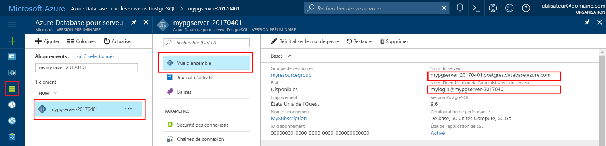

# <a name="azure-database-for-postgresql-use-java-tooconnect-and-query-data"></a>Base de données Azure pour PostgreSQL : utiliser Java tooconnect et interroger des données
Ce démarrage rapide montre comment tooconnect tooan Azure de base de données PostgreSQL à l’aide d’une application Java. Il montre comment toouse SQL instructions tooquery, insérer, mettre à jour et supprimer des données dans la base de données hello. Hello étapes décrites dans cet article supposent que vous êtes familiarisé avec le développement à l’aide de Java et que vous êtes tooworking nouvelle base de données Azure pour PostgreSQL.

## <a name="prerequisites"></a>Composants requis
Ce démarrage rapide utilise des ressources hello créés dans un de ces guides comme point de départ :
- [Créer une base de données - Portail](quickstart-create-server-database-portal.md)
- [Créer une base de données - Interface de ligne de commande Azure](quickstart-create-server-database-azure-cli.md)

Il vous faudra également :
- Télécharger hello [PostgreSQL JDBC Driver](https://jdbc.postgresql.org/download.html) correspondant à votre version de Java et hello Kit de développement Java.
- Inclure hello le fichier jar PostgreSQL JDBC (par exemple postgresql 42.1.1.jar) dans votre chemin de classe d’application. Pour plus d'informations, consultez la rubrique [Classpath](https://jdbc.postgresql.org/documentation/head/classpath.html) (Chemin de classe).

## <a name="get-connection-information"></a>Obtenir des informations de connexion
Obtenir les informations nécessaires tooconnect toohello de hello connexion base de données Azure pour PostgreSQL. Vous devez hello des informations d’identification de nom et la connexion serveur complet.

1. Connectez-vous à toohello [portail Azure](https://portal.azure.com/).
2. Hello menu de gauche dans le portail Azure, cliquez sur **toutes les ressources** et recherchez le serveur hello vous avez créé, tel que **mypgserver-20170401**.
3. Cliquez sur le nom du serveur hello **mypgserver-20170401**.
4. Serveur hello sélectionnez **vue d’ensemble** page. Prenez note de hello **nom du serveur** et **nom de connexion de serveur admin**.
 
5. Si vous oubliez vos informations de connexion du serveur, accédez à toohello **vue d’ensemble** page Nom de connexion d’administrateur du serveur de hello tooview et, si nécessaire, réinitialiser un mot de passe hello.

## <a name="connect-create-table-and-insert-data"></a>Se connecter, créer des tables et insérer des données
Hello utilisation code tooconnect et charge hello données suivantes à l’aide de la fonction hello avec un **insérer** instruction SQL. méthodes de Hello [getConnection()](https://www.postgresql.org/docs/7.4/static/jdbc-use.html), [createStatement()](https://jdbc.postgresql.org/documentation/head/query.html), et [executeQuery()](https://jdbc.postgresql.org/documentation/head/query.html) sont utilisé tooconnect, supprimez et recréez la table de hello. Hello [prepareStatement](https://jdbc.postgresql.org/documentation/head/query.html) objet est commandes insert hello toobuild utilisé, avec des valeurs de paramètre de hello toobind setString() et setInt(). Méthode [executeUpdate()](https://jdbc.postgresql.org/documentation/head/update.html) séries hello commande pour chaque jeu de paramètres. 

Remplacez les valeurs hello que vous avez spécifié lorsque vous avez créé votre propre serveur et la base de données hôte de hello, base de données, utilisateur et les paramètres de mot de passe.

```java
import java.sql.*;
import java.util.Properties;

public class CreateTableInsertRows {

    public static void main (String[] args)  throws Exception
    {

        // Initialize connection variables.
        String host = "mypgserver-20170401.postgres.database.azure.com";
        String database = "mypgsqldb";
        String user = "mylogin@mypgserver-20170401";
        String password = "<server_admin_password>";

        // check that hello driver is installed
        try
        {
            Class.forName("org.postgresql.Driver");
        }
        catch (ClassNotFoundException e)
        {
            throw new ClassNotFoundException("PostgreSQL JDBC driver NOT detected in library path.", e);
        }

        System.out.println("PostgreSQL JDBC driver detected in library path.");

        Connection connection = null;

        // Initialize connection object
        try
        {
            String url = String.format("jdbc:postgresql://%s/%s", host, database);
            
            // set up hello connection properties
            Properties properties = new Properties();
            properties.setProperty("user", user);
            properties.setProperty("password", password);
            properties.setProperty("ssl", "true");

            // get connection
            connection = DriverManager.getConnection(url, properties);
        }
        catch (SQLException e)
        {
            throw new SQLException("Failed toocreate connection toodatabase.", e);
        }
        if (connection != null) 
        { 
            System.out.println("Successfully created connection toodatabase.");
        
            // Perform some SQL queries over hello connection.
            try
            {
                // Drop previous table of same name if one exists.
                Statement statement = connection.createStatement();
                statement.execute("DROP TABLE IF EXISTS inventory;");
                System.out.println("Finished dropping table (if existed).");
    
                // Create table.
                statement.execute("CREATE TABLE inventory (id serial PRIMARY KEY, name VARCHAR(50), quantity INTEGER);");
                System.out.println("Created table.");
    
                // Insert some data into table.
                int nRowsInserted = 0;
                PreparedStatement preparedStatement = connection.prepareStatement("INSERT INTO inventory (name, quantity) VALUES (?, ?);");
                preparedStatement.setString(1, "banana");
                preparedStatement.setInt(2, 150);
                nRowsInserted += preparedStatement.executeUpdate();

                preparedStatement.setString(1, "orange");
                preparedStatement.setInt(2, 154);
                nRowsInserted += preparedStatement.executeUpdate();

                preparedStatement.setString(1, "apple");
                preparedStatement.setInt(2, 100);
                nRowsInserted += preparedStatement.executeUpdate();
                System.out.println(String.format("Inserted %d row(s) of data.", nRowsInserted));
    
                // NOTE No need toocommit all changes toodatabase, as auto-commit is enabled by default.
    
            }
            catch (SQLException e)
            {
                throw new SQLException("Encountered an error when executing given sql statement.", e);
            }       
        }
        else {
            System.out.println("Failed toocreate connection toodatabase.");
        }
        System.out.println("Execution finished.");
    }
}
```

## <a name="read-data"></a>Lire les données
Suivant de hello d’utilisation de code tooread les données de salutation avec un **sélectionnez** instruction SQL. méthodes de Hello [getConnection()](https://www.postgresql.org/docs/7.4/static/jdbc-use.html), [createStatement()](https://jdbc.postgresql.org/documentation/head/query.html), et [executeQuery()](https://jdbc.postgresql.org/documentation/head/query.html) sont utilisé tooconnect, créer et exécuter l’instruction select de hello. les résultats de Hello sont traités à l’aide un [ResultSet](https://www.postgresql.org/docs/7.4/static/jdbc-query.html) objet. 

Remplacez les valeurs hello que vous avez spécifié lorsque vous avez créé votre propre serveur et la base de données hôte de hello, base de données, utilisateur et les paramètres de mot de passe.

```java
import java.sql.*;
import java.util.Properties;

public class ReadTable {

    public static void main (String[] args)  throws Exception
    {

        // Initialize connection variables.
        String host = "mypgserver-20170401.postgres.database.azure.com";
        String database = "mypgsqldb";
        String user = "mylogin@mypgserver-20170401";
        String password = "<server_admin_password>";

        // check that hello driver is installed
        try
        {
            Class.forName("org.postgresql.Driver");
        }
        catch (ClassNotFoundException e)
        {
            throw new ClassNotFoundException("PostgreSQL JDBC driver NOT detected in library path.", e);
        }

        System.out.println("PostgreSQL JDBC driver detected in library path.");

        Connection connection = null;

        // Initialize connection object
        try
        {
            String url = String.format("jdbc:postgresql://%s/%s", host, database);
            
            // set up hello connection properties
            Properties properties = new Properties();
            properties.setProperty("user", user);
            properties.setProperty("password", password);
            properties.setProperty("ssl", "true");

            // get connection
            connection = DriverManager.getConnection(url, properties);
        }
        catch (SQLException e)
        {
            throw new SQLException("Failed toocreate connection toodatabase.", e);
        }
        if (connection != null) 
        { 
            System.out.println("Successfully created connection toodatabase.");
        
            // Perform some SQL queries over hello connection.
            try
            {
    
                Statement statement = connection.createStatement();
                ResultSet results = statement.executeQuery("SELECT * from inventory;");
                while (results.next())
                {
                    String outputString = 
                        String.format(
                            "Data row = (%s, %s, %s)",
                            results.getString(1),
                            results.getString(2),
                            results.getString(3));
                    System.out.println(outputString);
                }
            }
            catch (SQLException e)
            {
                throw new SQLException("Encountered an error when executing given sql statement.", e);
            }       
        }
        else {
            System.out.println("Failed toocreate connection toodatabase.");
        }
        System.out.println("Execution finished.");
    }
}

```

## <a name="update-data"></a>Mettre à jour des données
Suivant de hello d’utilisation de code toochange les données de salutation avec une **mise à jour** instruction SQL. Hello méthodes [getConnection()](https://www.postgresql.org/docs/7.4/static/jdbc-use.html), [prepareStatement()](https://jdbc.postgresql.org/documentation/head/query.html), et [executeUpdate()](https://jdbc.postgresql.org/documentation/head/update.html) sont utilisé tooconnect, préparer et exécuter l’instruction de mise à jour hello. 

Remplacez les valeurs hello que vous avez spécifié lorsque vous avez créé votre propre serveur et la base de données hôte de hello, base de données, utilisateur et les paramètres de mot de passe.

```java
import java.sql.*;
import java.util.Properties;

public class UpdateTable {
    public static void main (String[] args)  throws Exception
    {

        // Initialize connection variables.
        String host = "mypgserver-20170401.postgres.database.azure.com";
        String database = "mypgsqldb";
        String user = "mylogin@mypgserver-20170401";
        String password = "<server_admin_password>";

        // check that hello driver is installed
        try
        {
            Class.forName("org.postgresql.Driver");
        }
        catch (ClassNotFoundException e)
        {
            throw new ClassNotFoundException("PostgreSQL JDBC driver NOT detected in library path.", e);
        }

        System.out.println("PostgreSQL JDBC driver detected in library path.");

        Connection connection = null;

        // Initialize connection object
        try
        {
            String url = String.format("jdbc:postgresql://%s/%s", host, database);
            
            // set up hello connection properties
            Properties properties = new Properties();
            properties.setProperty("user", user);
            properties.setProperty("password", password);
            properties.setProperty("ssl", "true");

            // get connection
            connection = DriverManager.getConnection(url, properties);
        }
        catch (SQLException e)
        {
            throw new SQLException("Failed toocreate connection toodatabase.", e);
        }
        if (connection != null) 
        { 
            System.out.println("Successfully created connection toodatabase.");
        
            // Perform some SQL queries over hello connection.
            try
            {
                // Modify some data in table.
                int nRowsUpdated = 0;
                PreparedStatement preparedStatement = connection.prepareStatement("UPDATE inventory SET quantity = ? WHERE name = ?;");
                preparedStatement.setInt(1, 200);
                preparedStatement.setString(2, "banana");
                nRowsUpdated += preparedStatement.executeUpdate();
                System.out.println(String.format("Updated %d row(s) of data.", nRowsUpdated));
    
                // NOTE No need toocommit all changes toodatabase, as auto-commit is enabled by default.
            }
            catch (SQLException e)
            {
                throw new SQLException("Encountered an error when executing given sql statement.", e);
            }       
        }
        else {
            System.out.println("Failed toocreate connection toodatabase.");
        }
        System.out.println("Execution finished.");
    }
}
```
## <a name="delete-data"></a>Suppression de données
Données tooremove avec du code suivant de hello utilisation un **supprimer** instruction SQL. méthodes de Hello [getConnection()](https://www.postgresql.org/docs/7.4/static/jdbc-use.html), [prepareStatement()](https://jdbc.postgresql.org/documentation/head/query.html), et [executeUpdate()](https://jdbc.postgresql.org/documentation/head/update.html) sont utilisé tooconnect, préparer et exécuter l’instruction delete de hello. 

Remplacez les valeurs hello que vous avez spécifié lorsque vous avez créé votre propre serveur et la base de données hôte de hello, base de données, utilisateur et les paramètres de mot de passe.

```java
import java.sql.*;
import java.util.Properties;

public class DeleteTable {
    public static void main (String[] args)  throws Exception
    {

        // Initialize connection variables.
        String host = "mypgserver-20170401.postgres.database.azure.com";
        String database = "mypgsqldb";
        String user = "mylogin@mypgserver-20170401";
        String password = "<server_admin_password>";

        // check that hello driver is installed
        try
        {
            Class.forName("org.postgresql.Driver");
        }
        catch (ClassNotFoundException e)
        {
            throw new ClassNotFoundException("PostgreSQL JDBC driver NOT detected in library path.", e);
        }

        System.out.println("PostgreSQL JDBC driver detected in library path.");

        Connection connection = null;

        // Initialize connection object
        try
        {
            String url = String.format("jdbc:postgresql://%s/%s", host, database);
            
            // set up hello connection properties
            Properties properties = new Properties();
            properties.setProperty("user", user);
            properties.setProperty("password", password);
            properties.setProperty("ssl", "true");

            // get connection
            connection = DriverManager.getConnection(url, properties);
        }
        catch (SQLException e)
        {
            throw new SQLException("Failed toocreate connection toodatabase.", e);
        }
        if (connection != null) 
        { 
            System.out.println("Successfully created connection toodatabase.");
        
            // Perform some SQL queries over hello connection.
            try
            {
                // Delete some data from table.
                int nRowsDeleted = 0;
                PreparedStatement preparedStatement = connection.prepareStatement("DELETE FROM inventory WHERE name = ?;");
                preparedStatement.setString(1, "orange");
                nRowsDeleted += preparedStatement.executeUpdate();
                System.out.println(String.format("Deleted %d row(s) of data.", nRowsDeleted));
    
                // NOTE No need toocommit all changes toodatabase, as auto-commit is enabled by default.
            }
            catch (SQLException e)
            {
                throw new SQLException("Encountered an error when executing given sql statement.", e);
            }       
        }
        else {
            System.out.println("Failed toocreate connection toodatabase.");
        }
        System.out.println("Execution finished.");
    }
}
```

## <a name="next-steps"></a>Étapes suivantes
> [!div class="nextstepaction"]
> [Migration de votre base de données PostgreSQL par exportation et importation](./howto-migrate-using-export-and-import.md)
