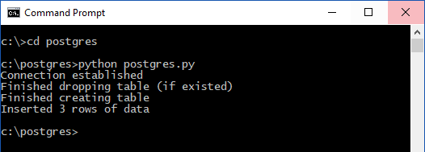

# <a name="azure-database-for-postgresql-use-python-tooconnect-and-query-data"></a>Base de données Azure pour PostgreSQL : utilisation de Python tooconnect et interroger des données
Ce démarrage rapide montre comment toouse [Python](https://python.org) tooconnect tooan base de données Azure pour PostgreSQL. Il montre également comment toouse SQL instructions tooquery, insérer, mettre à jour et supprimer les données dans la base de données hello macOS, Ubuntu Linux et les plateformes Windows. Hello dans cet article suppose que vous êtes familiarisé avec le développement à l’aide de Python et tooworking nouvelle base de données Azure pour PostgreSQL.

## <a name="prerequisites"></a>Composants requis
Ce démarrage rapide utilise des ressources hello créés dans un de ces guides comme point de départ :
- [Créer une base de données - Portail](quickstart-create-server-database-portal.md)
- [Créer une base de données - CLI](quickstart-create-server-database-azure-cli.md)

Vous aurez également besoin des éléments suivants :
- Installation de [python](https://www.python.org/downloads/)
- Installation du package [pip](https://pip.pypa.io/en/stable/installing/) (déjà installé si vous utilisez des binaires Python 2 >=2.7.9 ou Python 3 >=3.4 téléchargés depuis [python.org](https://python.org)).

## <a name="install-hello-python-connection-libraries-for-postgresql"></a>Installer les bibliothèques de connexions de Python hello pour PostgreSQL
Installer hello [psycopg2](http://initd.org/psycopg/docs/install.html) package, ce qui vous permet de tooconnect et requête de base de données hello. psycopg2 est [disponible sur PyPI](https://pypi.python.org/pypi/psycopg2/) sous forme de hello de [roue](http://pythonwheels.com/) packages pour les plateformes de hello courants (Linux, OS x, Windows). Utilisez pip installez tooget hello version binaire module hello, y compris toutes les dépendances de hello.

1. Sur votre ordinateur, lancez une interface de ligne de commande :
    - Sur Linux, lancez l’interpréteur de commandes Bash hello.
    - Sur Mac OS, lancez hello Terminal Server.
    - Sur Windows, lancez hello invite de commandes à partir du Menu Démarrer de hello.
2. Assurez-vous que vous utilisez une version plus récente hello pip en exécutant une commande comme :
    ```cmd
    pip install -U pip
    ```

3. Exécutez hello suivant package psycopg2 de commande tooinstall hello :
    ```cmd
    pip install psycopg2
    ```

## <a name="get-connection-information"></a>Obtenir des informations de connexion
Obtenir les informations nécessaires tooconnect toohello de hello connexion base de données Azure pour PostgreSQL. Vous devez hello des informations d’identification de nom et la connexion serveur complet.

1. Connectez-vous à toohello [portail Azure](https://portal.azure.com/).
2. Hello menu de gauche dans le portail Azure, cliquez sur **toutes les ressources** et recherchez **mypgserver-20170401** (serveur vous venez de créer pour hello).
3. Cliquez sur le nom du serveur hello **mypgserver-20170401**.
4. Serveur hello sélectionnez **vue d’ensemble** page et notez hello **nom du serveur** et **nom de connexion de serveur admin**.
 
5. Si vous oubliez vos informations de connexion du serveur, accédez à toohello **vue d’ensemble** page Nom de connexion d’administrateur du serveur de hello tooview et, si nécessaire, réinitialiser un mot de passe hello.

## <a name="how-toorun-python-code"></a>Comment toorun code Python
Cette rubrique contient un total de quatre exemples de code, qui effectuent chacun une fonction spécifique. Hello instructions suivantes indiquent comment toocreate un fichier texte, insérer un bloc de code, puis enregistrez le fichier de hello afin que vous pouvez l’exécuter ultérieurement. Être vraiment toocreate quatre fichiers distincts, un pour chaque bloc de code.

- Dans l’éditeur de texte que vous préférez, créez un nouveau fichier.
- Copiez et collez un des exemples de code hello dans les sections suivantes dans le fichier de texte hello de hello. Remplacez hello **hôte**, **dbname**, **utilisateur**, et **mot de passe** paramètres avec des valeurs hello que vous avez spécifié lors de la création de hello serveur et base de données.
- Enregistrez-le hello avec l’extension de .py hello (par exemple postgres.py) dans votre dossier de projet. Si vous exécutez hello du système d’exploitation Windows, être vraiment tooselect codage UTF-8 lors de l’enregistrement du fichier de hello. 
- Lancer l’environnement d’invite de commandes ou un interpréteur de commandes hello et modifiez hello tooyour projet répertoire, par exemple `cd postgres`.
-  le code hello toorun, hello de type commande Python suivi par nom de fichier hello, par exemple `Python postgres.py`.

> [!NOTE]
> À partir de Python version 3, vous pouvez voir l’erreur de hello `SyntaxError: Missing parentheses in call too'print'` hello suivant des blocs de code lors de l’exécution. Si cela se produit, remplacez chaque commande de toohello appel `print "string"` avec un appel de fonction à l’aide de parenthèses, tel que `print("string")`.

## <a name="connect-create-table-and-insert-data"></a>Se connecter, créer des tables et insérer des données
Suivante de hello utilisation tooconnect de code et chargez à l’aide de données hello [psycopg2.connect](http://initd.org/psycopg/docs/connection.html) fonctionne avec **insérer** instruction SQL. Hello [cursor.execute](http://initd.org/psycopg/docs/cursor.html#execute) fonction est la requête SQL hello tooexecute utilisé par rapport à la base de données PostgreSQL. Remplacez les valeurs hello que vous avez spécifié lorsque vous avez créé la base de données et serveur de hello hello hôte, dbname, utilisateur et les paramètres de mot de passe.

```Python
import psycopg2

# Update connection string information obtained from hello portal
host = "mypgserver-20170401.postgres.database.azure.com"
user = "mylogin@mypgserver-20170401"
dbname = "mypgsqldb"
password = "<server_admin_password>"
sslmode = "require"

# Construct connection string
conn_string = "host={0} user={1} dbname={2} password={3} sslmode={4}".format(host, user, dbname, password, sslmode)
conn = psycopg2.connect(conn_string) 
print "Connection established"

cursor = conn.cursor()

# Drop previous table of same name if one exists
cursor.execute("DROP TABLE IF EXISTS inventory;")
print "Finished dropping table (if existed)"

# Create table
cursor.execute("CREATE TABLE inventory (id serial PRIMARY KEY, name VARCHAR(50), quantity INTEGER);")
print "Finished creating table"

# Insert some data into table
cursor.execute("INSERT INTO inventory (name, quantity) VALUES (%s, %s);", ("banana", 150))
cursor.execute("INSERT INTO inventory (name, quantity) VALUES (%s, %s);", ("orange", 154))
cursor.execute("INSERT INTO inventory (name, quantity) VALUES (%s, %s);", ("apple", 100))
print "Inserted 3 rows of data"

# Cleanup
conn.commit()
cursor.close()
conn.close()
```

Une fois que le code de hello s’exécute avec succès, hello sortie apparaît comme suit :



## <a name="read-data"></a>Lire les données
Les données de salutation tooread insérées à l’aide de code de suivant de hello utilisation [cursor.execute](http://initd.org/psycopg/docs/cursor.html#execute) fonctionne avec **sélectionnez** instruction SQL. Cette fonction accepte une requête et retourne un ensemble de résultats pouvant être itéré sur avec utilisation hello de [cursor.fetchall()](http://initd.org/psycopg/docs/cursor.html#cursor.fetchall). Remplacez les valeurs hello que vous avez spécifié lorsque vous avez créé la base de données et serveur de hello hello hôte, dbname, utilisateur et les paramètres de mot de passe.

```Python
import psycopg2

# Update connection string information obtained from hello portal
host = "mypgserver-20170401.postgres.database.azure.com"
user = "mylogin@mypgserver-20170401"
dbname = "mypgsqldb"
password = "<server_admin_password>"
sslmode = "require"

# Construct connection string
conn_string = "host={0} user={1} dbname={2} password={3} sslmode={4}".format(host, user, dbname, password, sslmode)
conn = psycopg2.connect(conn_string) 
print "Connection established"

cursor = conn.cursor()

# Fetch all rows from table
cursor.execute("SELECT * FROM inventory;")
rows = cursor.fetchall()

# Print all rows
for row in rows:
    print "Data row = (%s, %s, %s)" %(str(row[0]), str(row[1]), str(row[2]))

# Cleanup
conn.commit()
cursor.close()
conn.close()
```

## <a name="update-data"></a>Mettre à jour des données
Ligne de l’inventaire de hello tooupdate que vous avez inséré précédemment à l’aide de code de suivant de hello utilisation [cursor.execute](http://initd.org/psycopg/docs/cursor.html#execute) fonctionne avec **mise à jour** instruction SQL. Remplacez les valeurs hello que vous avez spécifié lorsque vous avez créé la base de données et serveur de hello hello hôte, dbname, utilisateur et les paramètres de mot de passe.

```Python
import psycopg2

# Update connection string information obtained from hello portal
host = "mypgserver-20170401.postgres.database.azure.com"
user = "mylogin@mypgserver-20170401"
dbname = "mypgsqldb"
password = "<server_admin_password>"
sslmode = "require"

# Construct connection string
conn_string = "host={0} user={1} dbname={2} password={3} sslmode={4}".format(host, user, dbname, password, sslmode)
conn = psycopg2.connect(conn_string) 
print "Connection established"

cursor = conn.cursor()

# Update a data row in hello table
cursor.execute("UPDATE inventory SET quantity = %s WHERE name = %s;", (200, "banana"))
print "Updated 1 row of data"

# Cleanup
conn.commit()
cursor.close()
conn.close()
```

## <a name="delete-data"></a>Suppression de données
Toodelete un élément d’inventaire que vous avez inséré précédemment à l’aide de code suivant de hello utilisation [cursor.execute](http://initd.org/psycopg/docs/cursor.html#execute) fonctionne avec **supprimer** instruction SQL. Remplacez les valeurs hello que vous avez spécifié lorsque vous avez créé la base de données et serveur de hello hello hôte, dbname, utilisateur et les paramètres de mot de passe.

```Python
import psycopg2

# Update connection string information obtained from hello portal
host = "mypgserver-20170401.postgres.database.azure.com"
user = "mylogin@mypgserver-20170401"
dbname = "mypgsqldb"
password = "<server_admin_password>"
sslmode = "require"

# Construct connection string
conn_string = "host={0} user={1} dbname={2} password={3} sslmode={4}".format(host, user, dbname, password, sslmode)
conn = psycopg2.connect(conn_string) 
print "Connection established"

cursor = conn.cursor()

# Delete data row from table
cursor.execute("DELETE FROM inventory WHERE name = %s;", ("orange",))
print "Deleted 1 row of data"

# Cleanup
conn.commit()
cursor.close()
conn.close()
```

## <a name="next-steps"></a>Étapes suivantes
> [!div class="nextstepaction"]
> [Migration de votre base de données PostgreSQL par exportation et importation](./howto-migrate-using-export-and-import.md)
