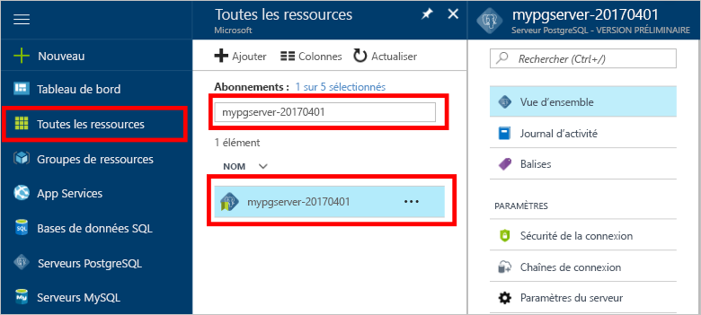

# Comment tooBackup et restauration d’un serveur de base de données Azure pour l’utilisation de PostgreSQL hello portail Azure

## La sauvegarde s’effectue automatiquement
Lors de l’utilisation de base de données Azure pour PostgreSQL, service de base de données hello effectue automatiquement une sauvegarde du service de hello toutes les 5 minutes. 

sauvegardes de Hello sont disponibles pour les 7 jours lors de l’utilisation de niveau de base et de 35 jours lors de l’utilisation de niveau Standard. Pour plus d’informations, consultez [Niveaux de service d’Azure Database pour PostgreSQL](concepts-service-tiers.md)

À l’aide de cette fonctionnalité de sauvegarde automatique vous pouvez restaurer le serveur de hello et toutes ses bases de données dans un nouveau serveur tooan précédemment point-à-temps.

## Restaurer Bonjour portail Azure
Base de données Azure pour PostgreSQL vous permet de toorestore hello server tooa précédent point dans le temps et en tooa une nouvelle copie du serveur de hello. Vous pouvez utiliser cette nouvelle toorecover de serveur à vos données. 

Par exemple, si une table a été accidentellement supprimé à midi aujourd'hui, vous pourriez restaurer temps toohello juste avant midi et les récupérer hello manquant de table et les données à partir de la copie du serveur de hello.

Hello suit restaurer hello exemple server tooa point dans le temps :
1. L’authentification à hello [portail Azure](https://portal.azure.com/)
2. Recherchez votre serveur Azure Database pour PostgreSQL. Bonjour portail Azure, cliquez sur **toutes les ressources** de menu à gauche hello et tapez Bonjour nom, tel que **mypgserver-20170401**, toosearch de votre serveur existant. Cliquez sur le nom du serveur hello répertorié dans les résultats de recherche hello. Hello **vue d’ensemble** pour votre serveur s’ouvre et fournit des options pour poursuivre la configuration de la page.

   

3. Dans le haut de hello du Panneau de vue d’ensemble du serveur hello, cliquez sur **restaurer** sur la barre d’outils hello. Panneau de restauration Hello s’ouvre.

   

4. Remplissez le formulaire de restauration de hello avec les informations de hello requis :

   
  - **Point de restauration**: sélectionnez un point dans le temps qui se produit avant que le serveur de hello a été modifié
  - **Serveur cible**: fournir un nouveau nom du serveur toorestore à
  - **Emplacement**: vous ne pouvez pas sélectionner la région de hello, par défaut, il est identique au serveur de source de hello
  - **Niveau tarifaire** : vous ne pouvez pas modifier cette valeur lors de la restauration d’un serveur. Il est identique au serveur de source de hello. 

5. Cliquez sur **OK** toorestore hello server toorestore tooa point dans le temps. 

6. Une fois hello restauration terminée, recherchez hello nouveau serveur qui est créé hello tooverify données ont été restaurées comme prévu.

## Étapes suivantes
- [Bibliothèques de connexions pour Azure Database pour PostgreSQL](concepts-connection-libraries.md)
