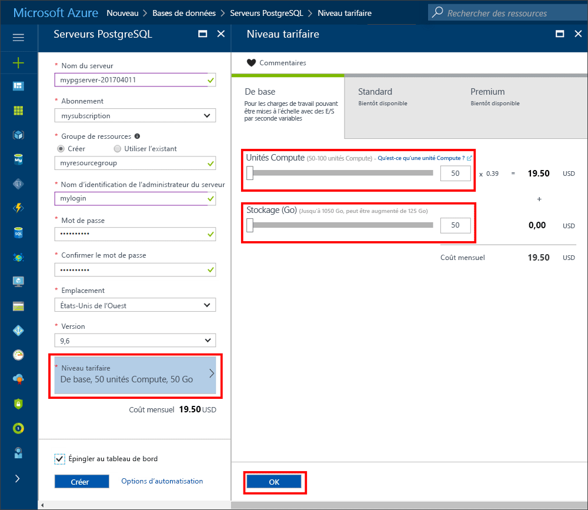
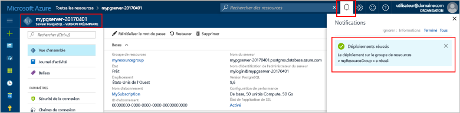
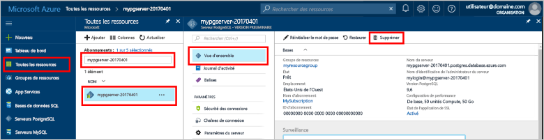

# <a name="create-an-azure-database-for-postgresql-in-hello-azure-portal"></a><span data-ttu-id="f94cc-103">Créer une base de données Azure PostgreSQL Bonjour portail Azure</span><span class="sxs-lookup"><span data-stu-id="f94cc-103">Create an Azure Database for PostgreSQL in hello Azure portal</span></span>

<span data-ttu-id="f94cc-104">Base de données Azure pour PostgreSQL est un service géré qui vous permet de toorun, gérer et mettre à l’échelle des bases de données PostgreSQL hautement disponibles dans le cloud de hello.</span><span class="sxs-lookup"><span data-stu-id="f94cc-104">Azure Database for PostgreSQL is a managed service that enables you toorun, manage, and scale highly available PostgreSQL databases in hello cloud.</span></span> <span data-ttu-id="f94cc-105">Ce démarrage rapide vous montre comment toocreate Azure de base de données pour le serveur PostgreSQL à l’aide de hello portail Azure en cinq minutes environ.</span><span class="sxs-lookup"><span data-stu-id="f94cc-105">This quickstart shows you how toocreate an Azure Database for PostgreSQL server using hello Azure portal in about five minutes.</span></span>

<span data-ttu-id="f94cc-106">Si vous n’avez pas d’abonnement Azure, créez un compte [gratuit](https://azure.microsoft.com/free/) avant de commencer.</span><span class="sxs-lookup"><span data-stu-id="f94cc-106">If you don't have an Azure subscription, create a [free](https://azure.microsoft.com/free/) account before you begin.</span></span>

## <a name="log-in-toohello-azure-portal"></a><span data-ttu-id="f94cc-107">Ouvrez une session dans toohello portail Azure</span><span class="sxs-lookup"><span data-stu-id="f94cc-107">Log in toohello Azure portal</span></span>
<span data-ttu-id="f94cc-108">Ouvrez votre navigateur web et accédez toohello [portail Microsoft Azure](https://portal.azure.com/).</span><span class="sxs-lookup"><span data-stu-id="f94cc-108">Open your web browser, and navigate toohello [Microsoft Azure portal](https://portal.azure.com/).</span></span> <span data-ttu-id="f94cc-109">Entrez vos informations d’identification toosign dans toohello portal.</span><span class="sxs-lookup"><span data-stu-id="f94cc-109">Enter your credentials toosign in toohello portal.</span></span> <span data-ttu-id="f94cc-110">affichage par défaut de Hello est votre tableau de bord de service.</span><span class="sxs-lookup"><span data-stu-id="f94cc-110">hello default view is your service dashboard.</span></span>

## <a name="create-an-azure-database-for-postgresql"></a><span data-ttu-id="f94cc-111">Créer une base de données Azure pour PostgreSQL</span><span class="sxs-lookup"><span data-stu-id="f94cc-111">Create an Azure Database for PostgreSQL</span></span>

<span data-ttu-id="f94cc-112">Un serveur de base de données Azure pour PostgreSQL est créé. Il contient un ensemble défini de [ressources de calcul et de stockage](./concepts-compute-unit-and-storage.md).</span><span class="sxs-lookup"><span data-stu-id="f94cc-112">An Azure Database for PostgreSQL server is created with a defined set of [compute and storage resources](./concepts-compute-unit-and-storage.md).</span></span> <span data-ttu-id="f94cc-113">serveur de Hello est créé dans un [groupe de ressources Azure](../azure-resource-manager/resource-group-overview.md).</span><span class="sxs-lookup"><span data-stu-id="f94cc-113">hello server is created within an [Azure resource group](../azure-resource-manager/resource-group-overview.md).</span></span>

<span data-ttu-id="f94cc-114">Suivez ces étapes de toocreate PostgreSQL server dans une base de données Azure :</span><span class="sxs-lookup"><span data-stu-id="f94cc-114">Follow these steps toocreate an Azure Database for PostgreSQL server:</span></span>
1.  <span data-ttu-id="f94cc-115">Cliquez sur hello **nouveau** bouton (+) sur le coin supérieur gauche hello Hello portail Azure.</span><span class="sxs-lookup"><span data-stu-id="f94cc-115">Click hello **New** button (+) found on hello upper left-hand corner of hello Azure portal.</span></span>
2.  <span data-ttu-id="f94cc-116">Sélectionnez **bases de données** de hello **nouveau** page, puis sélectionnez **base de données Azure pour PostgreSQL** de hello **bases de données** page.</span><span class="sxs-lookup"><span data-stu-id="f94cc-116">Select **Databases** from hello **New** page, and select **Azure Database for PostgreSQL** from hello **Databases** page.</span></span>
 <span data-ttu-id="f94cc-117"></span><span class="sxs-lookup"><span data-stu-id="f94cc-117"></span></span>

3.  <span data-ttu-id="f94cc-118">Rempliront hello nouveau serveur détails avec hello suivant d’informations, comme indiqué dans le hello précédant l’image :</span><span class="sxs-lookup"><span data-stu-id="f94cc-118">Fill out hello new server details form with hello following information, as shown on hello preceding image:</span></span>

    <span data-ttu-id="f94cc-119">Paramètre</span><span class="sxs-lookup"><span data-stu-id="f94cc-119">Setting</span></span>|<span data-ttu-id="f94cc-120">Valeur suggérée</span><span class="sxs-lookup"><span data-stu-id="f94cc-120">Suggested value</span></span>|<span data-ttu-id="f94cc-121">Description</span><span class="sxs-lookup"><span data-stu-id="f94cc-121">Description</span></span>
    ---|---|---
    <span data-ttu-id="f94cc-122">Nom du serveur</span><span class="sxs-lookup"><span data-stu-id="f94cc-122">Server name</span></span> |<span data-ttu-id="f94cc-123">*mypgserver-20170401*</span><span class="sxs-lookup"><span data-stu-id="f94cc-123">*mypgserver-20170401*</span></span>|<span data-ttu-id="f94cc-124">Choisissez un nom unique qui identifie votre serveur de base de données Azure pour PostgreSQL.</span><span class="sxs-lookup"><span data-stu-id="f94cc-124">Choose a unique name that identifies your Azure Database for PostgreSQL server.</span></span> <span data-ttu-id="f94cc-125">nom de domaine Hello *postgres.database.azure.com* est ajouté toohello nom de serveur vous fournissez pour tooconnect d’applications pour.</span><span class="sxs-lookup"><span data-stu-id="f94cc-125">hello domain name *postgres.database.azure.com* is appended toohello server name you provide for applications tooconnect to.</span></span> <span data-ttu-id="f94cc-126">nom du serveur Hello peut contenir uniquement des lettres minuscules, des chiffres et des caractères de trait d’union (-) hello, et il doit contenir entre 3 et 63 caractères.</span><span class="sxs-lookup"><span data-stu-id="f94cc-126">hello server name can contain only lowercase letters, numbers, and hello hyphen (-) character, and it must contain from 3 through 63 characters.</span></span>
    <span data-ttu-id="f94cc-127">Abonnement</span><span class="sxs-lookup"><span data-stu-id="f94cc-127">Subscription</span></span>|<span data-ttu-id="f94cc-128">*Votre abonnement*</span><span class="sxs-lookup"><span data-stu-id="f94cc-128">*Your subscription*</span></span>|<span data-ttu-id="f94cc-129">Hello abonnement Azure que vous souhaitez toouse pour votre serveur.</span><span class="sxs-lookup"><span data-stu-id="f94cc-129">hello Azure subscription that you want toouse for your server.</span></span> <span data-ttu-id="f94cc-130">Si vous avez plusieurs abonnements, choisissez abonnement approprié de hello dans lequel les ressources hello sont facturé pour.</span><span class="sxs-lookup"><span data-stu-id="f94cc-130">If you have multiple subscriptions, choose hello appropriate subscription in which hello resource is billed for.</span></span>
    <span data-ttu-id="f94cc-131">Groupe de ressources</span><span class="sxs-lookup"><span data-stu-id="f94cc-131">Resource Group</span></span>|<span data-ttu-id="f94cc-132">*myresourcegroup*</span><span class="sxs-lookup"><span data-stu-id="f94cc-132">*myresourcegroup*</span></span>| <span data-ttu-id="f94cc-133">Vous pouvez définir un nouveau nom de groupe de ressources ou utiliser un nom de groupe existant dans votre abonnement.</span><span class="sxs-lookup"><span data-stu-id="f94cc-133">You may make a new resource group name, or use an existing one from your subscription.</span></span>
    <span data-ttu-id="f94cc-134">Connexion d’administrateur serveur</span><span class="sxs-lookup"><span data-stu-id="f94cc-134">Server admin login</span></span> |<span data-ttu-id="f94cc-135">*mylogin*</span><span class="sxs-lookup"><span data-stu-id="f94cc-135">*mylogin*</span></span>| <span data-ttu-id="f94cc-136">Vérifiez votre propre toouse de compte de connexion lors de la connexion toohello server.</span><span class="sxs-lookup"><span data-stu-id="f94cc-136">Make your own login account toouse when connecting toohello server.</span></span> <span data-ttu-id="f94cc-137">nom de connexion Hello admin ne peut pas être 'azure_superuser', « azure_pg_admin », « admin », « administrateur », « root », 'invité' ou 'public' et ne peut pas commencer par 'pg_'.</span><span class="sxs-lookup"><span data-stu-id="f94cc-137">hello admin login name cannot be 'azure_superuser', 'azure_pg_admin', 'admin', 'administrator', 'root', 'guest', or 'public', and cannot start with 'pg_'.</span></span>
    <span data-ttu-id="f94cc-138">Mot de passe</span><span class="sxs-lookup"><span data-stu-id="f94cc-138">Password</span></span> |<span data-ttu-id="f94cc-139">*Votre choix*</span><span class="sxs-lookup"><span data-stu-id="f94cc-139">*Your choice*</span></span> | <span data-ttu-id="f94cc-140">Créer un nouveau mot de passe pour le compte d’administrateur serveur hello.</span><span class="sxs-lookup"><span data-stu-id="f94cc-140">Create a new password for hello server admin account.</span></span> <span data-ttu-id="f94cc-141">Doit contenir entre 8 caractères too128.</span><span class="sxs-lookup"><span data-stu-id="f94cc-141">Must contain from 8 too128 characters.</span></span> <span data-ttu-id="f94cc-142">Votre mot de passe doit contenir des caractères appartenant à trois des hello suivant catégories : majuscules des lettres, des lettres minuscules, des chiffres (0-9) et des caractères non alphanumériques ( !, $, #, %, etc..).</span><span class="sxs-lookup"><span data-stu-id="f94cc-142">Your password must contain characters from three of hello following categories – English uppercase letters, English lowercase letters, numbers (0-9), and non-alphanumeric characters (!, $, #, %, etc.).</span></span>
    <span data-ttu-id="f94cc-143">Lieu</span><span class="sxs-lookup"><span data-stu-id="f94cc-143">Location</span></span>|<span data-ttu-id="f94cc-144">*utilisateurs tooyour le plus proche Hello région*</span><span class="sxs-lookup"><span data-stu-id="f94cc-144">*hello region closest tooyour users*</span></span>| <span data-ttu-id="f94cc-145">Choisissez un emplacement hello qui est le plus proche tooyour utilisateurs.</span><span class="sxs-lookup"><span data-stu-id="f94cc-145">Choose hello location that's closest tooyour users.</span></span>
    <span data-ttu-id="f94cc-146">Version de PostgreSQL.</span><span class="sxs-lookup"><span data-stu-id="f94cc-146">PostgreSQL Version</span></span>|<span data-ttu-id="f94cc-147">*Choisissez la version la plus récente hello*</span><span class="sxs-lookup"><span data-stu-id="f94cc-147">*Choose hello latest version*</span></span>| <span data-ttu-id="f94cc-148">Choisissez la version la plus récente hello, sauf si vous avez des exigences spécifiques.</span><span class="sxs-lookup"><span data-stu-id="f94cc-148">Choose hello latest version unless you have specific requirements.</span></span>
    <span data-ttu-id="f94cc-149">Niveau de tarification</span><span class="sxs-lookup"><span data-stu-id="f94cc-149">Pricing Tier</span></span> | <span data-ttu-id="f94cc-150">**De base**, **50 unités de calcul****50 Go**</span><span class="sxs-lookup"><span data-stu-id="f94cc-150">**Basic**, **50 Compute Units** **50 GB**</span></span> | <span data-ttu-id="f94cc-151">Cliquez sur **niveau tarifaire** toospecify hello performances et la couche de niveau de service pour votre nouvelle base de données.</span><span class="sxs-lookup"><span data-stu-id="f94cc-151">Click **Pricing tier** toospecify hello service tier and performance level for your new database.</span></span> <span data-ttu-id="f94cc-152">Choisissez le niveau de base dans l’onglet hello haut hello.</span><span class="sxs-lookup"><span data-stu-id="f94cc-152">Choose Basic tier in hello tab at hello top.</span></span> <span data-ttu-id="f94cc-153">Cliquez sur fin gauche hello hello unités de calcul curseur tooadjust hello valeur toohello minimum disponible pour ce démarrage rapide.</span><span class="sxs-lookup"><span data-stu-id="f94cc-153">Click hello left end of hello Compute Units slider tooadjust hello value toohello least amount available for this quickstart.</span></span> <span data-ttu-id="f94cc-154">Cliquez sur **Ok** hello toosave sélection de niveau de tarification.</span><span class="sxs-lookup"><span data-stu-id="f94cc-154">Click **Ok** toosave hello pricing tier selection.</span></span> <span data-ttu-id="f94cc-155">Consultez hello suivant capture d’écran.</span><span class="sxs-lookup"><span data-stu-id="f94cc-155">See hello following screenshot.</span></span>
    | <span data-ttu-id="f94cc-156">Code confidentiel toodashboard</span><span class="sxs-lookup"><span data-stu-id="f94cc-156">Pin toodashboard</span></span> | <span data-ttu-id="f94cc-157">Vérification</span><span class="sxs-lookup"><span data-stu-id="f94cc-157">Check</span></span> | <span data-ttu-id="f94cc-158">Vérifiez hello **toodashboard du code confidentiel** option tooallow simplifier le suivi de votre serveur sur la page de tableau de bord avant hello de votre portail Azure.</span><span class="sxs-lookup"><span data-stu-id="f94cc-158">Check hello **Pin toodashboard** option tooallow easy tracking of your server on hello front dashboard page of your Azure portal.</span></span>

  > [!IMPORTANT]
  > <span data-ttu-id="f94cc-159">connexion administrateur de serveur Hello et un mot de passe que vous spécifiez ici sont requis toolog dans toohello server et ses bases de données plus loin dans ce guide de démarrage rapide.</span><span class="sxs-lookup"><span data-stu-id="f94cc-159">hello server admin login and password that you specify here are required toolog in toohello server and its databases later in this quick start.</span></span> <span data-ttu-id="f94cc-160">Retenez ou enregistrez ces informations pour une utilisation ultérieure.</span><span class="sxs-lookup"><span data-stu-id="f94cc-160">Remember or record this information for later use.</span></span>

    

4.  <span data-ttu-id="f94cc-162">Cliquez sur **créer** serveur hello de tooprovision.</span><span class="sxs-lookup"><span data-stu-id="f94cc-162">Click **Create** tooprovision hello server.</span></span> <span data-ttu-id="f94cc-163">Configuration prend quelques minutes, des too20 minutes maximum.</span><span class="sxs-lookup"><span data-stu-id="f94cc-163">Provisioning takes a few minutes, up too20 minutes maximum.</span></span>

5.  <span data-ttu-id="f94cc-164">Dans la barre d’outils de hello, cliquez sur **Notifications** processus de déploiement toomonitor hello.</span><span class="sxs-lookup"><span data-stu-id="f94cc-164">On hello toolbar, click **Notifications** toomonitor hello deployment process.</span></span>
 <span data-ttu-id="f94cc-165"></span><span class="sxs-lookup"><span data-stu-id="f94cc-165"></span></span>
   
  <span data-ttu-id="f94cc-166">Par défaut, la création de la base de données **postgres** intervient sous votre serveur.</span><span class="sxs-lookup"><span data-stu-id="f94cc-166">By default, **postgres** database gets created under your server.</span></span> <span data-ttu-id="f94cc-167">Hello [postgres](https://www.postgresql.org/docs/9.6/static/app-initdb.html) base de données est une base de données par défaut destinée à une utilisation par les utilisateurs, les utilitaires et les applications tierces.</span><span class="sxs-lookup"><span data-stu-id="f94cc-167">hello [postgres](https://www.postgresql.org/docs/9.6/static/app-initdb.html) database is a default database meant for use by users, utilities, and third-party applications.</span></span> 

## <a name="configure-a-server-level-firewall-rule"></a><span data-ttu-id="f94cc-168">Configurer une règle de pare-feu au niveau du serveur</span><span class="sxs-lookup"><span data-stu-id="f94cc-168">Configure a server-level firewall rule</span></span>

<span data-ttu-id="f94cc-169">Bonjour Azure de base de données PostgreSQL service crée un pare-feu au niveau serveur hello.</span><span class="sxs-lookup"><span data-stu-id="f94cc-169">hello Azure Database for PostgreSQL service creates a firewall at hello server-level.</span></span> <span data-ttu-id="f94cc-170">Ce pare-feu empêche des applications externes et des outils de connexion toohello serveur et les bases de données sur le serveur de hello, sauf si une règle de pare-feu est créée le pare-feu tooopen hello pour des adresses IP spécifiques.</span><span class="sxs-lookup"><span data-stu-id="f94cc-170">This firewall prevents external applications and tools from connecting toohello server and any databases on hello server, unless a firewall rule is created tooopen hello firewall for specific IP addresses.</span></span> 

1.  <span data-ttu-id="f94cc-171">Localisez votre serveur une fois hello déploiement terminé.</span><span class="sxs-lookup"><span data-stu-id="f94cc-171">Locate your server after hello deployment completes.</span></span> <span data-ttu-id="f94cc-172">Si nécessaire, vous pouvez le rechercher.</span><span class="sxs-lookup"><span data-stu-id="f94cc-172">If needed, you can search for it.</span></span> <span data-ttu-id="f94cc-173">Par exemple, cliquez sur **toutes les ressources** de menu à gauche hello et tapez nom du serveur hello (exemple hello *mypgserver-20170401*) toosearch pour votre serveur nouvellement créé.</span><span class="sxs-lookup"><span data-stu-id="f94cc-173">For example, click **All Resources** from hello left-hand menu and type in hello server name (such as hello example *mypgserver-20170401*) toosearch for your newly created server.</span></span> <span data-ttu-id="f94cc-174">Cliquez sur le nom de votre serveur répertorié dans les résultats de recherche hello.</span><span class="sxs-lookup"><span data-stu-id="f94cc-174">Click on your server name listed in hello search result.</span></span> <span data-ttu-id="f94cc-175">Hello **vue d’ensemble** pour votre serveur s’ouvre et fournit des options pour poursuivre la configuration de la page.</span><span class="sxs-lookup"><span data-stu-id="f94cc-175">hello **Overview** page for your server opens and provides options for further configuration.</span></span>
 
    

2.  <span data-ttu-id="f94cc-177">Sur la page hello du serveur, sélectionnez **sécurité de connexion**.</span><span class="sxs-lookup"><span data-stu-id="f94cc-177">On hello server page, select **Connection security**.</span></span> 
    <span data-ttu-id="f94cc-178"></span><span class="sxs-lookup"><span data-stu-id="f94cc-178"></span></span>

3.  <span data-ttu-id="f94cc-179">Sous hello **des règles de pare-feu** en-tête, cliquez dans la zone de texte vide hello Bonjour **nom de la règle** toobegin colonne création de règle de pare-feu hello.</span><span class="sxs-lookup"><span data-stu-id="f94cc-179">Under hello **Firewall rules** heading, click in hello blank text box in hello **Rule Name** column toobegin creating hello firewall rule.</span></span> 

    <span data-ttu-id="f94cc-180">Pour ce guide de démarrage rapide, nous allons autoriser toutes les adresses IP dans le serveur de hello en remplissant la zone de texte hello dans chaque colonne avec hello valeurs suivantes :</span><span class="sxs-lookup"><span data-stu-id="f94cc-180">For this quick start, let's allow all IP addresses into hello server by filling in hello text box in each column with hello following values:</span></span>

    <span data-ttu-id="f94cc-181">Nom de la règle</span><span class="sxs-lookup"><span data-stu-id="f94cc-181">Rule Name</span></span> | <span data-ttu-id="f94cc-182">Adresse IP de début</span><span class="sxs-lookup"><span data-stu-id="f94cc-182">Start IP</span></span> | <span data-ttu-id="f94cc-183">Adresse IP de fin</span><span class="sxs-lookup"><span data-stu-id="f94cc-183">End IP</span></span> 
    ---|---|---
    <span data-ttu-id="f94cc-184">AllowAllIps</span><span class="sxs-lookup"><span data-stu-id="f94cc-184">AllowAllIps</span></span> |  <span data-ttu-id="f94cc-185">0.0.0.0</span><span class="sxs-lookup"><span data-stu-id="f94cc-185">0.0.0.0</span></span> | <span data-ttu-id="f94cc-186">255.255.255.255</span><span class="sxs-lookup"><span data-stu-id="f94cc-186">255.255.255.255</span></span>

4. <span data-ttu-id="f94cc-187">Barre d’outils hello supérieur de la page de sécurité de connexion hello, cliquez sur **enregistrer**.</span><span class="sxs-lookup"><span data-stu-id="f94cc-187">On hello upper toolbar of hello Connection security page, click **Save**.</span></span> <span data-ttu-id="f94cc-188">Attendez quelques instants et message hello notification indiquant que la mise à jour de sécurité de connexion s’est correctement terminé avant de continuer.</span><span class="sxs-lookup"><span data-stu-id="f94cc-188">Wait for a few moments and notice hello notification showing that updating connection security has finished successfully before continuing.</span></span>

    > [!NOTE]
    > <span data-ttu-id="f94cc-189">Connexions tooyour Azure de base de données PostgreSQL serveur communiquent via le port 5432.</span><span class="sxs-lookup"><span data-stu-id="f94cc-189">Connections tooyour Azure Database for PostgreSQL server communicate over port 5432.</span></span> <span data-ttu-id="f94cc-190">Si vous essayez de tooconnect à partir d’un réseau d’entreprise, le trafic sortant sur le port 5432 ne peut pas être autorisé par le pare-feu de votre réseau.</span><span class="sxs-lookup"><span data-stu-id="f94cc-190">If you are trying tooconnect from within a corporate network, outbound traffic over port 5432 may not be allowed by your network's firewall.</span></span> <span data-ttu-id="f94cc-191">Dans ce cas, vous ne serez pas en mesure de tooconnect tooyour serveur, sauf si votre service informatique ouvre le port 5432.</span><span class="sxs-lookup"><span data-stu-id="f94cc-191">If so, you will not be able tooconnect tooyour server unless your IT department opens port 5432.</span></span>
    >

## <a name="get-hello-connection-information"></a><span data-ttu-id="f94cc-192">Obtenir des informations de connexion hello</span><span class="sxs-lookup"><span data-stu-id="f94cc-192">Get hello connection information</span></span>

<span data-ttu-id="f94cc-193">Lorsque nous avons créé notre serveur de base de données Azure pour PostgreSQL, une base de données par défaut nommée **postgres** a été créée.</span><span class="sxs-lookup"><span data-stu-id="f94cc-193">When we created our Azure Database for PostgreSQL server, a default database named **postgres** gets created.</span></span> <span data-ttu-id="f94cc-194">serveur de base de données tooconnect tooyour, vous devez tooremember hello serveur complet administration et le nom d’identification.</span><span class="sxs-lookup"><span data-stu-id="f94cc-194">tooconnect tooyour database server, you need tooremember hello full server name and admin login credentials.</span></span> <span data-ttu-id="f94cc-195">Il pouvez que vous avez noté ces valeurs plus haut dans l’article de démarrage rapide de hello.</span><span class="sxs-lookup"><span data-stu-id="f94cc-195">You may have noted those values earlier in hello quick start article.</span></span> <span data-ttu-id="f94cc-196">Dans le cas où vous n’avez pas, vous pouvez facilement trouver des informations de nom et de connexion de serveur à partir de la page Vue d’ensemble du serveur hello hello Bonjour portail Azure.</span><span class="sxs-lookup"><span data-stu-id="f94cc-196">In case you did not, you can easily find hello server name and login information from hello server Overview page in hello Azure portal.</span></span>

1. <span data-ttu-id="f94cc-197">Ouvrez la page **Vue d’ensemble** de votre serveur.</span><span class="sxs-lookup"><span data-stu-id="f94cc-197">Open your server's **Overview** page.</span></span> <span data-ttu-id="f94cc-198">Prenez note de hello **nom du serveur** et **nom de connexion de serveur admin**.</span><span class="sxs-lookup"><span data-stu-id="f94cc-198">Make a note of hello **Server name** and **Server admin login name**.</span></span>
    <span data-ttu-id="f94cc-199">Placez votre curseur dans chaque champ et icône de copie hello s’affiche à droite de toohello de texte hello.</span><span class="sxs-lookup"><span data-stu-id="f94cc-199">Hover your cursor over each field, and hello copy icon appears toohello right of hello text.</span></span> <span data-ttu-id="f94cc-200">Cliquez sur icône de copie hello en tant que valeurs de hello toocopy nécessaires.</span><span class="sxs-lookup"><span data-stu-id="f94cc-200">Click hello copy icon as needed toocopy hello values.</span></span>

 

## <a name="connect-toopostgresql-database-using-psql-in-cloud-shell"></a><span data-ttu-id="f94cc-202">Se connecter à l’aide de psql dans un environnement de Cloud de la base de données tooPostgreSQL</span><span class="sxs-lookup"><span data-stu-id="f94cc-202">Connect tooPostgreSQL database using psql in Cloud Shell</span></span>

<span data-ttu-id="f94cc-203">Il existe un certain nombre d’applications, vous pouvez utiliser tooconnect tooyour Azure de base de données PostgreSQL serveur.</span><span class="sxs-lookup"><span data-stu-id="f94cc-203">There are a number of applications you can use tooconnect tooyour Azure Database for PostgreSQL server.</span></span> <span data-ttu-id="f94cc-204">Nous allons d’abord utiliser hello psql utilitaire de ligne de commande tooillustrate comment tooconnect toohello server.</span><span class="sxs-lookup"><span data-stu-id="f94cc-204">Let's first use hello psql command-line utility tooillustrate how tooconnect toohello server.</span></span>  <span data-ttu-id="f94cc-205">Vous pouvez utiliser un navigateur web et hello Azure Cloud Shell comme décrit ici sans hello doivent tooinstall des logiciels supplémentaires.</span><span class="sxs-lookup"><span data-stu-id="f94cc-205">You can use a web browser and hello Azure Cloud Shell as described here without hello need tooinstall any additional software.</span></span> <span data-ttu-id="f94cc-206">Si vous avez hello psql utilitaire est installé localement sur votre propre ordinateur, vous pouvez vous connecter à partir de là également.</span><span class="sxs-lookup"><span data-stu-id="f94cc-206">If you have hello psql utility installed locally on your own machine, you can connect from there as well.</span></span>

1. <span data-ttu-id="f94cc-207">Lancez hello Azure Cloud Shell via l’icône de terminal hello sur le volet de navigation supérieure hello.</span><span class="sxs-lookup"><span data-stu-id="f94cc-207">Launch hello Azure Cloud Shell via hello terminal icon on hello top navigation pane.</span></span>

   

2. <span data-ttu-id="f94cc-209">Bonjour Azure Cloud Shell s’ouvre dans votre navigateur, l’activation de commandes d’environnement tootype bash.</span><span class="sxs-lookup"><span data-stu-id="f94cc-209">hello Azure Cloud Shell opens in your browser, enabling you tootype bash shell commands.</span></span>

   

3. <span data-ttu-id="f94cc-211">Invite hello Cloud, se connecter tooa de base de données dans votre base de données Azure pour PostgreSQL serveur en tapant la ligne de commande hello psql invite hello vert.</span><span class="sxs-lookup"><span data-stu-id="f94cc-211">At hello Cloud Shell prompt, connect tooa database in your Azure Database for PostgreSQL server by typing hello psql command line at hello green prompt.</span></span>

    <span data-ttu-id="f94cc-212">Bonjour format suivant est utilisé tooconnect tooan base de données Azure pour serveur PostgreSQL avec hello [psql](https://www.postgresql.org/docs/9.6/static/app-psql.html) utilitaire :</span><span class="sxs-lookup"><span data-stu-id="f94cc-212">hello following format is used tooconnect tooan Azure Database for PostgreSQL server with hello [psql](https://www.postgresql.org/docs/9.6/static/app-psql.html) utility:</span></span>
    ```bash
    psql --host=<yourserver> --port=<port> --username=<server admin login> --dbname=<database name>
    ```

    <span data-ttu-id="f94cc-213">Par exemple, hello commande suivante établit une connexion tooan exemple de serveur :</span><span class="sxs-lookup"><span data-stu-id="f94cc-213">For example, hello following command connects tooan example server:</span></span>

    ```bash
    psql --host=mypgserver-20170401.postgres.database.azure.com --port=5432 --username=mylogin@mypgserver-20170401 --dbname=postgres
    ```

    <span data-ttu-id="f94cc-214">Paramètre psql</span><span class="sxs-lookup"><span data-stu-id="f94cc-214">psql parameter</span></span> |<span data-ttu-id="f94cc-215">Valeur suggérée</span><span class="sxs-lookup"><span data-stu-id="f94cc-215">Suggested value</span></span>|<span data-ttu-id="f94cc-216">Description</span><span class="sxs-lookup"><span data-stu-id="f94cc-216">Description</span></span>
    ---|---|---
    <span data-ttu-id="f94cc-217">--host</span><span class="sxs-lookup"><span data-stu-id="f94cc-217">--host</span></span> | <span data-ttu-id="f94cc-218">*nom du serveur*</span><span class="sxs-lookup"><span data-stu-id="f94cc-218">*server name*</span></span> | <span data-ttu-id="f94cc-219">Spécifiez la valeur de nom de serveur hello utilisé lorsque vous avez créé précédemment des hello de base de données Azure pour PostgreSQL.</span><span class="sxs-lookup"><span data-stu-id="f94cc-219">Specify hello server name value that was used when you created hello Azure Database for PostgreSQL earlier.</span></span> <span data-ttu-id="f94cc-220">L’exemple de serveur que nous utilisons ici est mypgserver-20170401.postgres.database.azure.com. Utilisez le nom de domaine complet hello (\*. postgres.database.azure.com) comme indiqué dans l’exemple de hello.</span><span class="sxs-lookup"><span data-stu-id="f94cc-220">Our example server shown is mypgserver-20170401.postgres.database.azure.com. Use hello fully qualified domain name (\*.postgres.database.azure.com) as shown in hello example.</span></span> <span data-ttu-id="f94cc-221">Suivez les étapes de hello dans les informations de connexion du hello tooget de la section précédente hello si vous ne vous souvenez pas de nom de votre serveur.</span><span class="sxs-lookup"><span data-stu-id="f94cc-221">Follow hello steps in hello previous section tooget hello connection information if you do not remember your server name.</span></span> 
    <span data-ttu-id="f94cc-222">--port</span><span class="sxs-lookup"><span data-stu-id="f94cc-222">--port</span></span> | <span data-ttu-id="f94cc-223">**5432**</span><span class="sxs-lookup"><span data-stu-id="f94cc-223">**5432**</span></span> | <span data-ttu-id="f94cc-224">Utilisez toujours le port 5432 lors de la connexion de base de données de tooAzure pour PostgreSQL.</span><span class="sxs-lookup"><span data-stu-id="f94cc-224">Always use port 5432 when connecting tooAzure Database for PostgreSQL.</span></span> 
    <span data-ttu-id="f94cc-225">--username</span><span class="sxs-lookup"><span data-stu-id="f94cc-225">--username</span></span> | <span data-ttu-id="f94cc-226">*nom de connexion d’administrateur du serveur*</span><span class="sxs-lookup"><span data-stu-id="f94cc-226">*server admin login name*</span></span> |<span data-ttu-id="f94cc-227">Tapez hello server connexion nom d’utilisateur administrateur fourni lorsque vous avez créé précédemment des hello de base de données Azure pour PostgreSQL.</span><span class="sxs-lookup"><span data-stu-id="f94cc-227">Type in hello  server admin login username supplied when you created hello Azure Database for PostgreSQL earlier.</span></span> <span data-ttu-id="f94cc-228">Suivez les étapes de hello dans les informations de connexion du hello tooget de la section précédente hello si vous ne vous souvenez pas de nom d’utilisateur hello.</span><span class="sxs-lookup"><span data-stu-id="f94cc-228">Follow hello steps in hello previous section tooget hello connection information if you do not remember hello username.</span></span>  <span data-ttu-id="f94cc-229">format de Hello est  *username@servername* .</span><span class="sxs-lookup"><span data-stu-id="f94cc-229">hello format is *username@servername*.</span></span>
    <span data-ttu-id="f94cc-230">--dbname</span><span class="sxs-lookup"><span data-stu-id="f94cc-230">--dbname</span></span> | <span data-ttu-id="f94cc-231">**postgres**</span><span class="sxs-lookup"><span data-stu-id="f94cc-231">**postgres**</span></span> | <span data-ttu-id="f94cc-232">Nom de base de données utilisez hello par défaut générée par le système *postgres* pour la première connexion de hello.</span><span class="sxs-lookup"><span data-stu-id="f94cc-232">Use hello default system generated database name *postgres* for hello first connection.</span></span> <span data-ttu-id="f94cc-233">Par la suite, vous créerez votre propre base de données.</span><span class="sxs-lookup"><span data-stu-id="f94cc-233">Later you create your own database.</span></span>

    <span data-ttu-id="f94cc-234">Après la commande de psql hello en cours d’exécution, avec vos propres valeurs de paramètre, vous êtes tootype demandées par invite de mot de passe hello server admin.</span><span class="sxs-lookup"><span data-stu-id="f94cc-234">After running hello psql command, with your own parameter values, you are prompted tootype hello server admin password.</span></span> <span data-ttu-id="f94cc-235">Ce mot de passe est hello même que vous avez fourni lors de la création du serveur de hello.</span><span class="sxs-lookup"><span data-stu-id="f94cc-235">This password is hello same that you provided when you created hello server.</span></span> 

    <span data-ttu-id="f94cc-236">Paramètre psql</span><span class="sxs-lookup"><span data-stu-id="f94cc-236">psql parameter</span></span> |<span data-ttu-id="f94cc-237">Valeur suggérée</span><span class="sxs-lookup"><span data-stu-id="f94cc-237">Suggested value</span></span>|<span data-ttu-id="f94cc-238">Description</span><span class="sxs-lookup"><span data-stu-id="f94cc-238">Description</span></span>
    ---|---|---
    <span data-ttu-id="f94cc-239">password</span><span class="sxs-lookup"><span data-stu-id="f94cc-239">password</span></span> | <span data-ttu-id="f94cc-240">*votre mot de passe d’administrateur*</span><span class="sxs-lookup"><span data-stu-id="f94cc-240">*your admin password*</span></span> | <span data-ttu-id="f94cc-241">Notez, hello typé caractères ne figurent pas dans un interpréteur de commandes hello invite de mot de passe.</span><span class="sxs-lookup"><span data-stu-id="f94cc-241">Note, hello typed password characters are not shown on hello bash prompt.</span></span> <span data-ttu-id="f94cc-242">Appuyez sur entrée une fois que vous avez tapé tous les tooauthenticate de caractères hello et vous connecter.</span><span class="sxs-lookup"><span data-stu-id="f94cc-242">Press enter after you have typed all hello characters tooauthenticate and connect.</span></span>

    <span data-ttu-id="f94cc-243">Une fois connecté, utilitaire de psql hello affiche une invite de postgres où vous tapez des commandes sql.</span><span class="sxs-lookup"><span data-stu-id="f94cc-243">Once connected, hello psql utility displays a postgres prompt where you type sql commands.</span></span> <span data-ttu-id="f94cc-244">Dans la sortie de la connexion initiale hello, un avertissement peut être affiché comme psql hello Bonjour Azure Cloud Shell peut être différente de celle hello Azure de base de données pour la version du serveur PostgreSQL.</span><span class="sxs-lookup"><span data-stu-id="f94cc-244">In hello initial connection output, a warning may be displayed since hello psql in hello Azure Cloud Shell may be a different  version than hello Azure Database for PostgreSQL server version.</span></span> 
    
    <span data-ttu-id="f94cc-245">Exemple de sortie psql :</span><span class="sxs-lookup"><span data-stu-id="f94cc-245">Example psql output:</span></span>
    ```bash
    psql (9.5.7, server 9.6.2)
    WARNING: psql major version 9.5, server major version 9.6.
        Some psql features might not work.
    SSL connection (protocol: TLSv1.2, cipher: ECDHE-RSA-AES256-SHA384, bits: 256, compression: off)
    Type "help" for help.
   
    postgres=> 
    ```

    > [!TIP]
    > <span data-ttu-id="f94cc-246">Si le pare-feu hello n’est pas configuré les adresse IP tooallow hello hello Azure Cloud Shell, hello erreur suivante se produit :</span><span class="sxs-lookup"><span data-stu-id="f94cc-246">If hello firewall is not configured tooallow hello IP address of hello Azure Cloud Shell, hello following error occurs:</span></span>
    > 
    > <span data-ttu-id="f94cc-247">"psql: FATAL:  aucune entrée pg_hba.conf pour l’hôte "138.91.195.82", utilisateur "mylogin", base de données "postgres", SSL sur FATAL :  Connexion SSL nécessaire.</span><span class="sxs-lookup"><span data-stu-id="f94cc-247">"psql: FATAL:  no pg_hba.conf entry for host "138.91.195.82", user "mylogin", database "postgres", SSL on FATAL:  SSL connection is required.</span></span> <span data-ttu-id="f94cc-248">Veuillez spécifier les options SSL puis réessayez.</span><span class="sxs-lookup"><span data-stu-id="f94cc-248">Please specify SSL options and retry.</span></span>
    > 
    > <span data-ttu-id="f94cc-249">Erreur de hello tooresolve, vérifiez que hello server configuration correspondances hello étapes Bonjour *configurer une règle de pare-feu de niveau serveur* section de l’article de hello.</span><span class="sxs-lookup"><span data-stu-id="f94cc-249">tooresolve hello error, make sure hello server configuration matches hello steps in hello *Configure a server-level firewall rule* section of hello article.</span></span>

4.  <span data-ttu-id="f94cc-250">Créer une base de données vide à hello invite de commandes en tapant hello de commande suivante :</span><span class="sxs-lookup"><span data-stu-id="f94cc-250">Create a blank database at hello prompt by typing hello following command:</span></span>
    ```bash
    CREATE DATABASE mypgsqldb;
    ```
    <span data-ttu-id="f94cc-251">commande Hello peut prendre quelques instants toocomplete.</span><span class="sxs-lookup"><span data-stu-id="f94cc-251">hello command may take a few moments toocomplete.</span></span> 

5.  <span data-ttu-id="f94cc-252">À l’invite de hello, exécutez hello suivant de base de données de commande tooswitch connexion toohello nouvellement créé **mypgsqldb**.</span><span class="sxs-lookup"><span data-stu-id="f94cc-252">At hello prompt, execute hello following command tooswitch connection toohello newly created database **mypgsqldb**.</span></span>
    ```bash
    \c mypgsqldb
    ```

6.  <span data-ttu-id="f94cc-253">Tapez \q et appuyez sur entrée tooquit psql.</span><span class="sxs-lookup"><span data-stu-id="f94cc-253">Type \q and then press ENTER tooquit psql.</span></span> <span data-ttu-id="f94cc-254">Vous pouvez fermer hello Azure Cloud Shell une fois que vous avez terminé.</span><span class="sxs-lookup"><span data-stu-id="f94cc-254">You can close hello Azure Cloud Shell after you are done.</span></span>

<span data-ttu-id="f94cc-255">Vous avez maintenant connecté toohello base de données Azure pour PostgreSQL et créé une base de données utilisateur vide.</span><span class="sxs-lookup"><span data-stu-id="f94cc-255">Now you have connected toohello Azure Database for PostgreSQL and created a blank user database.</span></span> <span data-ttu-id="f94cc-256">Continuer toohello tooconnect de section suivante à l’aide d’un autre outil commun, pgAdmin.</span><span class="sxs-lookup"><span data-stu-id="f94cc-256">Continue toohello next section tooconnect using another common tool, pgAdmin.</span></span>

## <a name="connect-toopostgresql-database-using-pgadmin"></a><span data-ttu-id="f94cc-257">Se connecter à l’aide de pgAdmin de la base de données tooPostgreSQL</span><span class="sxs-lookup"><span data-stu-id="f94cc-257">Connect tooPostgreSQL database using pgAdmin</span></span>

<span data-ttu-id="f94cc-258">tooconnect tooAzure PostgreSQL serveur à l’aide d’outil d’interface utilisateur graphique de hello _pgAdmin_</span><span class="sxs-lookup"><span data-stu-id="f94cc-258">tooconnect tooAzure PostgreSQL server using hello GUI tool _pgAdmin_</span></span>
1.  <span data-ttu-id="f94cc-259">Lancez hello _pgAdmin_ application sur votre ordinateur client.</span><span class="sxs-lookup"><span data-stu-id="f94cc-259">Launch hello _pgAdmin_ application on your client computer.</span></span> <span data-ttu-id="f94cc-260">Vous pouvez installer _pgAdmin_ à partir de http://www.pgadmin.org/.</span><span class="sxs-lookup"><span data-stu-id="f94cc-260">You can install _pgAdmin_ from http://www.pgadmin.org/.</span></span>
2.  <span data-ttu-id="f94cc-261">Cliquez sur hello **ajouter un nouveau serveur** icône de hello **liens rapides** section dans le centre de hello de page du tableau de bord hello.</span><span class="sxs-lookup"><span data-stu-id="f94cc-261">Click hello **Add New Server** icon from hello **Quick Links** section in hello center of hello Dashboard page.</span></span>
3.  <span data-ttu-id="f94cc-262">Bonjour **Create - Server** boîte de dialogue **général** , entrez un nom convivial unique pour le serveur de hello, tel que **Azure PostgreSQL Server**.</span><span class="sxs-lookup"><span data-stu-id="f94cc-262">In hello **Create - Server** dialog box **General** tab, enter a unique friendly Name for hello server, such as **Azure PostgreSQL Server**.</span></span>
<span data-ttu-id="f94cc-263"></span><span class="sxs-lookup"><span data-stu-id="f94cc-263"></span></span>
4.  <span data-ttu-id="f94cc-264">Bonjour **Create - Server** boîte de dialogue, **connexion** onglet, utilisez les paramètres hello spécifié et cliquez sur **enregistrer**.</span><span class="sxs-lookup"><span data-stu-id="f94cc-264">In hello **Create - Server** dialog box, **Connection** tab, use hello settings as specified and click **Save**.</span></span>
   <span data-ttu-id="f94cc-265"></span><span class="sxs-lookup"><span data-stu-id="f94cc-265"></span></span>

    <span data-ttu-id="f94cc-266">Paramètre pgAdmin</span><span class="sxs-lookup"><span data-stu-id="f94cc-266">pgAdmin parameter</span></span> |<span data-ttu-id="f94cc-267">Valeur suggérée</span><span class="sxs-lookup"><span data-stu-id="f94cc-267">Suggested value</span></span>|<span data-ttu-id="f94cc-268">Description</span><span class="sxs-lookup"><span data-stu-id="f94cc-268">Description</span></span>
    ---|---|---
    <span data-ttu-id="f94cc-269">Nom/adresse de l’hôte</span><span class="sxs-lookup"><span data-stu-id="f94cc-269">Host Name/Address</span></span> | <span data-ttu-id="f94cc-270">*nom du serveur*</span><span class="sxs-lookup"><span data-stu-id="f94cc-270">*server name*</span></span> | <span data-ttu-id="f94cc-271">Spécifiez la valeur de nom de serveur hello utilisé lorsque vous avez créé précédemment des hello de base de données Azure pour PostgreSQL.</span><span class="sxs-lookup"><span data-stu-id="f94cc-271">Specify hello server name value that was used when you created hello Azure Database for PostgreSQL earlier.</span></span> <span data-ttu-id="f94cc-272">L’exemple de serveur que nous utilisons ici est mypgserver-20170401.postgres.database.azure.com. Utilisez le nom de domaine complet hello (\*. postgres.database.azure.com) comme indiqué dans l’exemple de hello.</span><span class="sxs-lookup"><span data-stu-id="f94cc-272">Our example server shown is mypgserver-20170401.postgres.database.azure.com. Use hello fully qualified domain name (\*.postgres.database.azure.com) as shown in hello example.</span></span> <span data-ttu-id="f94cc-273">Suivez les étapes de hello dans les informations de connexion du hello tooget de la section précédente hello si vous ne vous souvenez pas de nom de votre serveur.</span><span class="sxs-lookup"><span data-stu-id="f94cc-273">Follow hello steps in hello previous section tooget hello connection information if you do not remember your server name.</span></span> 
    <span data-ttu-id="f94cc-274">Port</span><span class="sxs-lookup"><span data-stu-id="f94cc-274">Port</span></span> | <span data-ttu-id="f94cc-275">**5432**</span><span class="sxs-lookup"><span data-stu-id="f94cc-275">**5432**</span></span> | <span data-ttu-id="f94cc-276">Utilisez toujours le port 5432 lors de la connexion de base de données de tooAzure pour PostgreSQL.</span><span class="sxs-lookup"><span data-stu-id="f94cc-276">Always use port 5432 when connecting tooAzure Database for PostgreSQL.</span></span>  
    <span data-ttu-id="f94cc-277">Base de données de maintenance</span><span class="sxs-lookup"><span data-stu-id="f94cc-277">Maintenance Database</span></span> | <span data-ttu-id="f94cc-278">**postgres**</span><span class="sxs-lookup"><span data-stu-id="f94cc-278">**postgres**</span></span> | <span data-ttu-id="f94cc-279">Nom de base de données utilisez hello par défaut générée par le système *postgres*.</span><span class="sxs-lookup"><span data-stu-id="f94cc-279">Use hello default system generated database name *postgres*.</span></span>
    <span data-ttu-id="f94cc-280">User Name</span><span class="sxs-lookup"><span data-stu-id="f94cc-280">User Name</span></span> | <span data-ttu-id="f94cc-281">*nom de connexion d’administrateur du serveur*</span><span class="sxs-lookup"><span data-stu-id="f94cc-281">*server admin login name*</span></span> | <span data-ttu-id="f94cc-282">Tapez hello server connexion nom d’utilisateur administrateur fourni lorsque vous avez créé précédemment des hello de base de données Azure pour PostgreSQL.</span><span class="sxs-lookup"><span data-stu-id="f94cc-282">Type in hello server admin login username supplied when you created hello Azure Database for PostgreSQL earlier.</span></span> <span data-ttu-id="f94cc-283">Suivez les étapes de hello dans les informations de connexion du hello tooget de la section précédente hello si vous ne vous souvenez pas de nom d’utilisateur hello.</span><span class="sxs-lookup"><span data-stu-id="f94cc-283">Follow hello steps in hello previous section tooget hello connection information if you do not remember hello username.</span></span> <span data-ttu-id="f94cc-284">format de Hello est  *username@servername* .</span><span class="sxs-lookup"><span data-stu-id="f94cc-284">hello format is *username@servername*.</span></span>
    <span data-ttu-id="f94cc-285">Mot de passe</span><span class="sxs-lookup"><span data-stu-id="f94cc-285">Password</span></span> | <span data-ttu-id="f94cc-286">*votre mot de passe d’administrateur*</span><span class="sxs-lookup"><span data-stu-id="f94cc-286">*your admin password*</span></span> |  <span data-ttu-id="f94cc-287">mot de passe Hello vous avez choisi lorsque vous avez créé le serveur de hello plus haut dans ce démarrage rapide.</span><span class="sxs-lookup"><span data-stu-id="f94cc-287">hello password you chose when you created hello server earlier in this quickstart.</span></span>
    <span data-ttu-id="f94cc-288">Rôle</span><span class="sxs-lookup"><span data-stu-id="f94cc-288">Role</span></span> | <span data-ttu-id="f94cc-289">*Laisser vide*</span><span class="sxs-lookup"><span data-stu-id="f94cc-289">*leave blank*</span></span> | <span data-ttu-id="f94cc-290">Ne doivent tooprovide un rôle de nom à ce stade.</span><span class="sxs-lookup"><span data-stu-id="f94cc-290">No need tooprovide a role name at this point.</span></span> <span data-ttu-id="f94cc-291">Renseignez le champ de hello.</span><span class="sxs-lookup"><span data-stu-id="f94cc-291">Leave hello field blank.</span></span>
    <span data-ttu-id="f94cc-292">Mode SSL</span><span class="sxs-lookup"><span data-stu-id="f94cc-292">SSL Mode</span></span> | <span data-ttu-id="f94cc-293">Require</span><span class="sxs-lookup"><span data-stu-id="f94cc-293">Require</span></span> | <span data-ttu-id="f94cc-294">Par défaut, tous les serveurs Azure PostgreSQL sont créés avec l’application du SSL activée.</span><span class="sxs-lookup"><span data-stu-id="f94cc-294">By default, all Azure PostgreSQL servers are created with SSL enforcing turned ON.</span></span> <span data-ttu-id="f94cc-295">tooturn hors tension de l’application de SSL, consultez les détails dans [SSL de l’application](./concepts-ssl-connection-security.md).</span><span class="sxs-lookup"><span data-stu-id="f94cc-295">tooturn OFF SSL enforcing, see details in [Enforcing SSL](./concepts-ssl-connection-security.md).</span></span>
    
5.  <span data-ttu-id="f94cc-296">Cliquez sur **Enregistrer**.</span><span class="sxs-lookup"><span data-stu-id="f94cc-296">Click **Save**.</span></span>
6.  <span data-ttu-id="f94cc-297">Dans le volet gauche du navigateur hello, développez hello **serveurs** nœud.</span><span class="sxs-lookup"><span data-stu-id="f94cc-297">In hello Browser left pane, expand hello **Servers** node.</span></span> <span data-ttu-id="f94cc-298">Sélectionnez votre serveur, par exemple **Azure PostgreSQL serveur** et cliquez sur tooconnect tooit.</span><span class="sxs-lookup"><span data-stu-id="f94cc-298">Choose your server, for example **Azure PostgreSQL Server** and click tooconnect tooit.</span></span>
7. <span data-ttu-id="f94cc-299">Développez le nœud du serveur hello et puis **bases de données** sous celle-ci.</span><span class="sxs-lookup"><span data-stu-id="f94cc-299">Expand hello server node, and then expand **Databases** under it.</span></span> <span data-ttu-id="f94cc-300">Hello liste doit inclure vos *postgres* base de données et n’importe quel utilisateur nouvellement créé de base de données, tel que *mypgsqldb*, que vous avez créée dans la section précédente de hello.</span><span class="sxs-lookup"><span data-stu-id="f94cc-300">hello list should include your existing *postgres* database, and any newly created user database, such as *mypgsqldb*, that we created in hello previous section.</span></span> <span data-ttu-id="f94cc-301">Remarque : vous pouvez créer plusieurs bases de données par serveur avec la base de données Azure pour PostgreSQL.</span><span class="sxs-lookup"><span data-stu-id="f94cc-301">Notice that you may create multiple databases per server with Azure Database for PostgreSQL.</span></span>
8. <span data-ttu-id="f94cc-302">Avec le bouton droit sur **bases de données**, choisissez hello **créer** menu, puis cliquez sur **base de données**.</span><span class="sxs-lookup"><span data-stu-id="f94cc-302">Right-click on **Databases**, choose hello **Create** menu, and click **Database**.</span></span>
9.  <span data-ttu-id="f94cc-303">Tapez un nom de base de données de votre choix dans hello **base de données** champ, tels que *mypgsqldb* hello illustré.</span><span class="sxs-lookup"><span data-stu-id="f94cc-303">Type a database name of your choice in hello **Database** field, such as *mypgsqldb* shown in hello example.</span></span> 
10. <span data-ttu-id="f94cc-304">Sélectionnez hello **propriétaire** de base de données hello à partir de la zone de liste déroulante hello.</span><span class="sxs-lookup"><span data-stu-id="f94cc-304">Select hello **Owner** for hello database from hello drop-down box.</span></span> <span data-ttu-id="f94cc-305">Choisissez le nom de connexion d’administrateur du serveur, par exemple *mylogin*.</span><span class="sxs-lookup"><span data-stu-id="f94cc-305">Choose your server admin login name, such as our example *mylogin*.</span></span>
10. <span data-ttu-id="f94cc-306">Cliquez sur **enregistrer** toocreate une base de données vide.</span><span class="sxs-lookup"><span data-stu-id="f94cc-306">Click **Save** toocreate a new blank database.</span></span>
11. <span data-ttu-id="f94cc-307">Bonjour **navigateur** volet, consultez hello de base de données vous avez créé dans la liste hello des bases de données sous le nom de votre serveur.</span><span class="sxs-lookup"><span data-stu-id="f94cc-307">In hello **Browser** pane, see hello database you created in hello list of Databases under your server name.</span></span>
 <span data-ttu-id="f94cc-308"></span><span class="sxs-lookup"><span data-stu-id="f94cc-308"></span></span>


## <a name="clean-up-resources"></a><span data-ttu-id="f94cc-309">Supprimer des ressources</span><span class="sxs-lookup"><span data-stu-id="f94cc-309">Clean up resources</span></span>
<span data-ttu-id="f94cc-310">Nettoyer les ressources hello vous avez créé dans démarrage rapide de hello soit en supprimant hello [groupe de ressources Azure](../azure-resource-manager/resource-group-overview.md), qui inclut toutes les ressources hello dans le groupe de ressources hello ou en supprimant des ressources d’un serveur hello si vous souhaitez tookeep hello autres ressources intacts.</span><span class="sxs-lookup"><span data-stu-id="f94cc-310">Clean up hello resources you created in hello quickstart either by deleting hello [Azure resource group](../azure-resource-manager/resource-group-overview.md), which includes all hello resources in hello resource group, or by deleting hello one server resource if you want tookeep hello other resources intact.</span></span>

> [!TIP]
> <span data-ttu-id="f94cc-311">Les autres démarrages rapides de cette collection reposent sur ce démarrage rapide.</span><span class="sxs-lookup"><span data-stu-id="f94cc-311">Other quickstarts in this collection build upon this quick start.</span></span> <span data-ttu-id="f94cc-312">Si vous prévoyez toocontinue toowork avec ultérieures Démarrages rapides, effectuez pas nettoyer les hello ressources créées dans ce démarrage rapide.</span><span class="sxs-lookup"><span data-stu-id="f94cc-312">If you plan toocontinue on toowork with subsequent quickstarts, do not clean up hello resources created in this quickstart.</span></span> <span data-ttu-id="f94cc-313">Si vous n’envisagez pas de toocontinue, utilisez hello suivant les ressources de toodelete étapes créées par ce démarrage rapide Bonjour portail Azure.</span><span class="sxs-lookup"><span data-stu-id="f94cc-313">If you do not plan toocontinue, use hello following steps toodelete resources created by this quickstart in hello Azure portal.</span></span>

<span data-ttu-id="f94cc-314">groupe de ressource entier hello toodelete y compris les serveur hello nouvellement créé :</span><span class="sxs-lookup"><span data-stu-id="f94cc-314">toodelete hello entire resource group including hello newly created server:</span></span>
1.  <span data-ttu-id="f94cc-315">Bonjour portail Azure, recherchez votre groupe de ressources.</span><span class="sxs-lookup"><span data-stu-id="f94cc-315">Locate your resource group in hello Azure portal.</span></span> <span data-ttu-id="f94cc-316">À partir du menu de gauche hello Bonjour portail Azure, cliquez sur **groupes de ressources** puis cliquez sur le nom de votre groupe de ressources, telles que notre exemple hello du **myresourcegroup**.</span><span class="sxs-lookup"><span data-stu-id="f94cc-316">From hello left-hand menu in hello Azure portal, click **Resource groups** and then click hello name of your resource group, such as our example **myresourcegroup**.</span></span>
2.  <span data-ttu-id="f94cc-317">Sur la page de votre groupe de ressources, cliquez sur **Supprimer**.</span><span class="sxs-lookup"><span data-stu-id="f94cc-317">On your resource group page, click **Delete**.</span></span> <span data-ttu-id="f94cc-318">Puis hello nom du type de votre groupe de ressources, telles que notre exemple **myresourcegroup**, en hello suppression de tooconfirm de zone de texte, puis cliquez sur **supprimer**.</span><span class="sxs-lookup"><span data-stu-id="f94cc-318">Then type hello name of your resource group, such as our example **myresourcegroup**, in hello text box tooconfirm deletion, and then click **Delete**.</span></span>

<span data-ttu-id="f94cc-319">Ou, au lieu de cela, toodelete hello créé récemment serveur :</span><span class="sxs-lookup"><span data-stu-id="f94cc-319">Or instead, toodelete hello newly created server:</span></span>
1.  <span data-ttu-id="f94cc-320">Localisez votre serveur Bonjour portail Azure, si vous ne pas les connaissez ouvrir.</span><span class="sxs-lookup"><span data-stu-id="f94cc-320">Locate your server in hello Azure portal, if you do not have it open.</span></span> <span data-ttu-id="f94cc-321">Hello menu de gauche dans le portail Azure, cliquez sur **toutes les ressources**, puis recherchez serveur hello vous avez créé.</span><span class="sxs-lookup"><span data-stu-id="f94cc-321">From hello left-hand menu in Azure portal, click **All resources**, and then search for hello server you created.</span></span>
2.  <span data-ttu-id="f94cc-322">Sur hello **vue d’ensemble** , cliquez sur hello **supprimer** bouton dans le volet supérieur de hello.</span><span class="sxs-lookup"><span data-stu-id="f94cc-322">On hello **Overview** page, click hello **Delete** button on hello top pane.</span></span>
<span data-ttu-id="f94cc-323"></span><span class="sxs-lookup"><span data-stu-id="f94cc-323"></span></span>
3.  <span data-ttu-id="f94cc-324">Confirmez le nom du serveur hello souhaité toodelete, afficher hello bases de données dans cette section sont affectées.</span><span class="sxs-lookup"><span data-stu-id="f94cc-324">Confirm hello server name you want toodelete, and show hello databases under it that are affected.</span></span> <span data-ttu-id="f94cc-325">Tapez le nom de votre serveur dans la zone de texte hello, tels que notre exemple **mypgserver-20170401**, puis cliquez sur **supprimer**.</span><span class="sxs-lookup"><span data-stu-id="f94cc-325">Type your server name in hello text box, such as our example **mypgserver-20170401**, and then click **Delete**.</span></span>

## <a name="next-steps"></a><span data-ttu-id="f94cc-326">Étapes suivantes</span><span class="sxs-lookup"><span data-stu-id="f94cc-326">Next steps</span></span>
> [!div class="nextstepaction"]
> [<span data-ttu-id="f94cc-327">Migration de votre base de données PostgreSQL par exportation et importation</span><span class="sxs-lookup"><span data-stu-id="f94cc-327">Migrate your database using Export and Import</span></span>](./howto-migrate-using-export-and-import.md)
