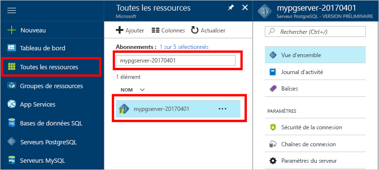
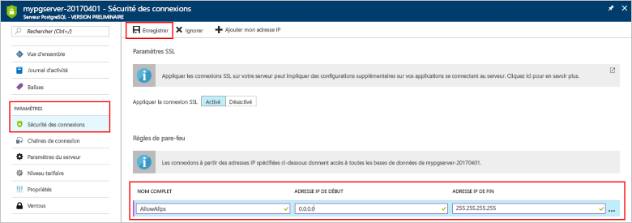
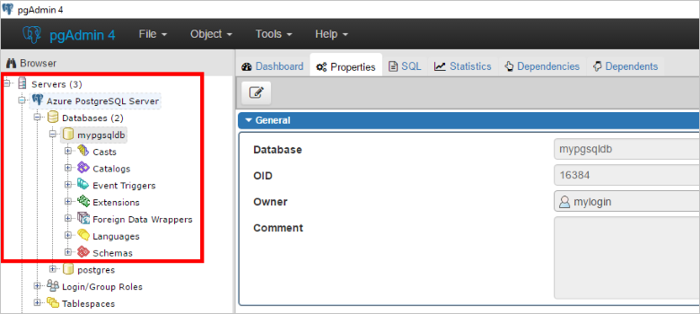

# <a name="create-an-azure-database-for-postgresql-in-the-azure-portal"></a><span data-ttu-id="5ea15-103">Créer une base de données Azure pour PostgreSQL dans le portail Azure</span><span class="sxs-lookup"><span data-stu-id="5ea15-103">Create an Azure Database for PostgreSQL in the Azure portal</span></span>

<span data-ttu-id="5ea15-104">Base de données Azure pour PostgreSQL est un service géré qui vous permet d’exécuter, de gérer et de mettre à l’échelle des bases de données PostgreSQL hautement disponibles dans le cloud.</span><span class="sxs-lookup"><span data-stu-id="5ea15-104">Azure Database for PostgreSQL is a managed service that enables you to run, manage, and scale highly available PostgreSQL databases in the cloud.</span></span> <span data-ttu-id="5ea15-105">Ce guide de démarrage rapide vous montre comment créer en quelques minutes un serveur de base de données Azure pour PostgreSQL à l’aide du portail Azure.</span><span class="sxs-lookup"><span data-stu-id="5ea15-105">This quickstart shows you how to create an Azure Database for PostgreSQL server using the Azure portal in about five minutes.</span></span>

<span data-ttu-id="5ea15-106">Si vous n’avez pas d’abonnement Azure, créez un compte [gratuit](https://azure.microsoft.com/free/) avant de commencer.</span><span class="sxs-lookup"><span data-stu-id="5ea15-106">If you don't have an Azure subscription, create a [free](https://azure.microsoft.com/free/) account before you begin.</span></span>

## <a name="log-in-to-the-azure-portal"></a><span data-ttu-id="5ea15-107">Connectez-vous au portail Azure.</span><span class="sxs-lookup"><span data-stu-id="5ea15-107">Log in to the Azure portal</span></span>
<span data-ttu-id="5ea15-108">Ouvrez votre navigateur web et accédez au [portail Microsoft Azure](https://portal.azure.com/).</span><span class="sxs-lookup"><span data-stu-id="5ea15-108">Open your web browser, and navigate to the [Microsoft Azure portal](https://portal.azure.com/).</span></span> <span data-ttu-id="5ea15-109">Entrez vos informations d’identification pour vous connecter au portail.</span><span class="sxs-lookup"><span data-stu-id="5ea15-109">Enter your credentials to sign in to the portal.</span></span> <span data-ttu-id="5ea15-110">Il s’ouvre par défaut sur le tableau de bord des services.</span><span class="sxs-lookup"><span data-stu-id="5ea15-110">The default view is your service dashboard.</span></span>

## <a name="create-an-azure-database-for-postgresql"></a><span data-ttu-id="5ea15-111">Créer une base de données Azure pour PostgreSQL</span><span class="sxs-lookup"><span data-stu-id="5ea15-111">Create an Azure Database for PostgreSQL</span></span>

<span data-ttu-id="5ea15-112">Un serveur de base de données Azure pour PostgreSQL est créé. Il contient un ensemble défini de [ressources de calcul et de stockage](./concepts-compute-unit-and-storage.md).</span><span class="sxs-lookup"><span data-stu-id="5ea15-112">An Azure Database for PostgreSQL server is created with a defined set of [compute and storage resources](./concepts-compute-unit-and-storage.md).</span></span> <span data-ttu-id="5ea15-113">Ce serveur est créé dans un [groupe de ressources Azure](../azure-resource-manager/resource-group-overview.md).</span><span class="sxs-lookup"><span data-stu-id="5ea15-113">The server is created within an [Azure resource group](../azure-resource-manager/resource-group-overview.md).</span></span>

<span data-ttu-id="5ea15-114">Pour créer un serveur de base de données Azure pour PostgreSQL, suivez les étapes ci-après :</span><span class="sxs-lookup"><span data-stu-id="5ea15-114">Follow these steps to create an Azure Database for PostgreSQL server:</span></span>
1.  <span data-ttu-id="5ea15-115">Cliquez sur le bouton **Nouveau** (+) dans le coin supérieur gauche du portail Azure.</span><span class="sxs-lookup"><span data-stu-id="5ea15-115">Click the **New** button (+) found on the upper left-hand corner of the Azure portal.</span></span>
2.  <span data-ttu-id="5ea15-116">Sélectionnez **Bases de données** dans la page **Nouveau**, puis **Base de données Azure pour PostgreSQL** dans la page **Bases de données**.</span><span class="sxs-lookup"><span data-stu-id="5ea15-116">Select **Databases** from the **New** page, and select **Azure Database for PostgreSQL** from the **Databases** page.</span></span>
 <span data-ttu-id="5ea15-117"></span><span class="sxs-lookup"><span data-stu-id="5ea15-117"></span></span>

3.  <span data-ttu-id="5ea15-118">Renseignez le formulaire du nouveau serveur avec les informations suivantes, comme indiqué dans l’illustration précédente :</span><span class="sxs-lookup"><span data-stu-id="5ea15-118">Fill out the new server details form with the following information, as shown on the preceding image:</span></span>

    <span data-ttu-id="5ea15-119">Paramètre</span><span class="sxs-lookup"><span data-stu-id="5ea15-119">Setting</span></span>|<span data-ttu-id="5ea15-120">Valeur suggérée</span><span class="sxs-lookup"><span data-stu-id="5ea15-120">Suggested value</span></span>|<span data-ttu-id="5ea15-121">Description</span><span class="sxs-lookup"><span data-stu-id="5ea15-121">Description</span></span>
    ---|---|---
    <span data-ttu-id="5ea15-122">Nom du serveur</span><span class="sxs-lookup"><span data-stu-id="5ea15-122">Server name</span></span> |<span data-ttu-id="5ea15-123">*mypgserver-20170401*</span><span class="sxs-lookup"><span data-stu-id="5ea15-123">*mypgserver-20170401*</span></span>|<span data-ttu-id="5ea15-124">Choisissez un nom unique qui identifie votre serveur de base de données Azure pour PostgreSQL.</span><span class="sxs-lookup"><span data-stu-id="5ea15-124">Choose a unique name that identifies your Azure Database for PostgreSQL server.</span></span> <span data-ttu-id="5ea15-125">Le nom de domaine *postgres.database.azure.com* est ajouté au nom de serveur que vous fournissez pour les applications utilisées pour la connexion.</span><span class="sxs-lookup"><span data-stu-id="5ea15-125">The domain name *postgres.database.azure.com* is appended to the server name you provide for applications to connect to.</span></span> <span data-ttu-id="5ea15-126">Le nom de serveur ne peut contenir que des lettres minuscules, des chiffres et le caractère de trait d’union (-). Il doit inclure entre 3 et 63 caractères.</span><span class="sxs-lookup"><span data-stu-id="5ea15-126">The server name can contain only lowercase letters, numbers, and the hyphen (-) character, and it must contain from 3 through 63 characters.</span></span>
    <span data-ttu-id="5ea15-127">Abonnement</span><span class="sxs-lookup"><span data-stu-id="5ea15-127">Subscription</span></span>|<span data-ttu-id="5ea15-128">*Votre abonnement*</span><span class="sxs-lookup"><span data-stu-id="5ea15-128">*Your subscription*</span></span>|<span data-ttu-id="5ea15-129">Abonnement Azure que vous souhaitez utiliser pour votre serveur.</span><span class="sxs-lookup"><span data-stu-id="5ea15-129">The Azure subscription that you want to use for your server.</span></span> <span data-ttu-id="5ea15-130">Si vous avez plusieurs abonnements, sélectionnez l’abonnement approprié dans lequel la ressource est facturée.</span><span class="sxs-lookup"><span data-stu-id="5ea15-130">If you have multiple subscriptions, choose the appropriate subscription in which the resource is billed for.</span></span>
    <span data-ttu-id="5ea15-131">Groupe de ressources</span><span class="sxs-lookup"><span data-stu-id="5ea15-131">Resource Group</span></span>|<span data-ttu-id="5ea15-132">*myresourcegroup*</span><span class="sxs-lookup"><span data-stu-id="5ea15-132">*myresourcegroup*</span></span>| <span data-ttu-id="5ea15-133">Vous pouvez définir un nouveau nom de groupe de ressources ou utiliser un nom de groupe existant dans votre abonnement.</span><span class="sxs-lookup"><span data-stu-id="5ea15-133">You may make a new resource group name, or use an existing one from your subscription.</span></span>
    <span data-ttu-id="5ea15-134">Connexion d’administrateur serveur</span><span class="sxs-lookup"><span data-stu-id="5ea15-134">Server admin login</span></span> |<span data-ttu-id="5ea15-135">*mylogin*</span><span class="sxs-lookup"><span data-stu-id="5ea15-135">*mylogin*</span></span>| <span data-ttu-id="5ea15-136">Définissez votre propre compte de connexion en tant que compte à utiliser lors de la connexion au serveur.</span><span class="sxs-lookup"><span data-stu-id="5ea15-136">Make your own login account to use when connecting to the server.</span></span> <span data-ttu-id="5ea15-137">Le nom de connexion d’administrateur ne doit pas être « azure_superuser », « azure_pg_admin », « admin », « administrator », « root », « guest » ni « public », et ne doit pas commencer par « pg_ ».</span><span class="sxs-lookup"><span data-stu-id="5ea15-137">The admin login name cannot be 'azure_superuser', 'azure_pg_admin', 'admin', 'administrator', 'root', 'guest', or 'public', and cannot start with 'pg_'.</span></span>
    <span data-ttu-id="5ea15-138">Mot de passe</span><span class="sxs-lookup"><span data-stu-id="5ea15-138">Password</span></span> |<span data-ttu-id="5ea15-139">*Votre choix*</span><span class="sxs-lookup"><span data-stu-id="5ea15-139">*Your choice*</span></span> | <span data-ttu-id="5ea15-140">Créez un mot de passe pour le compte Administrateur du serveur.</span><span class="sxs-lookup"><span data-stu-id="5ea15-140">Create a new password for the server admin account.</span></span> <span data-ttu-id="5ea15-141">Ce mot de passe doit comporter entre 8 et 128 caractères.</span><span class="sxs-lookup"><span data-stu-id="5ea15-141">Must contain from 8 to 128 characters.</span></span> <span data-ttu-id="5ea15-142">Votre mot de passe doit contenir des caractères appartenant à trois des catégories suivantes : lettres majuscules, lettres minuscules, chiffres (0 à 9) et caractères non alphanumériques (!, $, #, %, etc.).</span><span class="sxs-lookup"><span data-stu-id="5ea15-142">Your password must contain characters from three of the following categories – English uppercase letters, English lowercase letters, numbers (0-9), and non-alphanumeric characters (!, $, #, %, etc.).</span></span>
    <span data-ttu-id="5ea15-143">Lieu</span><span class="sxs-lookup"><span data-stu-id="5ea15-143">Location</span></span>|<span data-ttu-id="5ea15-144">*La région la plus proche de vos utilisateurs*</span><span class="sxs-lookup"><span data-stu-id="5ea15-144">*The region closest to your users*</span></span>| <span data-ttu-id="5ea15-145">Choisissez l’emplacement le plus proche de vos utilisateurs.</span><span class="sxs-lookup"><span data-stu-id="5ea15-145">Choose the location that's closest to your users.</span></span>
    <span data-ttu-id="5ea15-146">Version de PostgreSQL.</span><span class="sxs-lookup"><span data-stu-id="5ea15-146">PostgreSQL Version</span></span>|<span data-ttu-id="5ea15-147">*La version la plus récente*</span><span class="sxs-lookup"><span data-stu-id="5ea15-147">*Choose the latest version*</span></span>| <span data-ttu-id="5ea15-148">Choisissez la version la plus récente, sauf si vous avez des exigences spécifiques.</span><span class="sxs-lookup"><span data-stu-id="5ea15-148">Choose the latest version unless you have specific requirements.</span></span>
    <span data-ttu-id="5ea15-149">Niveau de tarification</span><span class="sxs-lookup"><span data-stu-id="5ea15-149">Pricing Tier</span></span> | <span data-ttu-id="5ea15-150">**De base**, **50 unités de calcul** **50 Go**</span><span class="sxs-lookup"><span data-stu-id="5ea15-150">**Basic**, **50 Compute Units** **50 GB**</span></span> | <span data-ttu-id="5ea15-151">Cliquez sur **Niveau tarifaire** pour spécifier le niveau de service et le niveau de performances pour votre nouvelle base de données.</span><span class="sxs-lookup"><span data-stu-id="5ea15-151">Click **Pricing tier** to specify the service tier and performance level for your new database.</span></span> <span data-ttu-id="5ea15-152">Choisissez le niveau De base dans l’onglet figurant dans la partie supérieure.</span><span class="sxs-lookup"><span data-stu-id="5ea15-152">Choose Basic tier in the tab at the top.</span></span> <span data-ttu-id="5ea15-153">Cliquez sur l’extrémité gauche du curseur Unités de calcul pour reconfigurer la valeur sur le plus petit nombre d’unités disponible pour ce guide de démarrage rapide.</span><span class="sxs-lookup"><span data-stu-id="5ea15-153">Click the left end of the Compute Units slider to adjust the value to the least amount available for this quickstart.</span></span> <span data-ttu-id="5ea15-154">Cliquez sur **OK** pour enregistrer la sélection du niveau tarifaire.</span><span class="sxs-lookup"><span data-stu-id="5ea15-154">Click **Ok** to save the pricing tier selection.</span></span> <span data-ttu-id="5ea15-155">Voir la capture d’écran suivante.</span><span class="sxs-lookup"><span data-stu-id="5ea15-155">See the following screenshot.</span></span>
    | <span data-ttu-id="5ea15-156">Épingler au tableau de bord</span><span class="sxs-lookup"><span data-stu-id="5ea15-156">Pin to dashboard</span></span> | <span data-ttu-id="5ea15-157">Vérification</span><span class="sxs-lookup"><span data-stu-id="5ea15-157">Check</span></span> | <span data-ttu-id="5ea15-158">Cochez la case **Épingler au tableau de bord** pour faciliter le suivi de votre serveur sur la première page du tableau de bord de votre portail Azure.</span><span class="sxs-lookup"><span data-stu-id="5ea15-158">Check the **Pin to dashboard** option to allow easy tracking of your server on the front dashboard page of your Azure portal.</span></span>

  > [!IMPORTANT]
  > <span data-ttu-id="5ea15-159">La connexion d’administrateur serveur et le mot de passe que vous spécifiez ici seront requis plus loin dans ce guide de démarrage rapide pour la connexion au serveur et à ses bases de données.</span><span class="sxs-lookup"><span data-stu-id="5ea15-159">The server admin login and password that you specify here are required to log in to the server and its databases later in this quick start.</span></span> <span data-ttu-id="5ea15-160">Retenez ou enregistrez ces informations pour une utilisation ultérieure.</span><span class="sxs-lookup"><span data-stu-id="5ea15-160">Remember or record this information for later use.</span></span>

    

4.  <span data-ttu-id="5ea15-162">Cliquez sur **Créer** pour approvisionner le serveur.</span><span class="sxs-lookup"><span data-stu-id="5ea15-162">Click **Create** to provision the server.</span></span> <span data-ttu-id="5ea15-163">L’approvisionnement prend plusieurs minutes, 20 au maximum.</span><span class="sxs-lookup"><span data-stu-id="5ea15-163">Provisioning takes a few minutes, up to 20 minutes maximum.</span></span>

5.  <span data-ttu-id="5ea15-164">Dans la barre d’outils, cliquez sur **Notifications** pour surveiller le processus de déploiement.</span><span class="sxs-lookup"><span data-stu-id="5ea15-164">On the toolbar, click **Notifications** to monitor the deployment process.</span></span>
 <span data-ttu-id="5ea15-165"></span><span class="sxs-lookup"><span data-stu-id="5ea15-165"></span></span>
   
  <span data-ttu-id="5ea15-166">Par défaut, la création de la base de données **postgres** intervient sous votre serveur.</span><span class="sxs-lookup"><span data-stu-id="5ea15-166">By default, **postgres** database gets created under your server.</span></span> <span data-ttu-id="5ea15-167">La base de données [postgres](https://www.postgresql.org/docs/9.6/static/app-initdb.html) est une base de données par défaut destinée aux utilisateurs, utilitaires et applications tierces.</span><span class="sxs-lookup"><span data-stu-id="5ea15-167">The [postgres](https://www.postgresql.org/docs/9.6/static/app-initdb.html) database is a default database meant for use by users, utilities, and third-party applications.</span></span> 

## <a name="configure-a-server-level-firewall-rule"></a><span data-ttu-id="5ea15-168">Configurer une règle de pare-feu au niveau du serveur</span><span class="sxs-lookup"><span data-stu-id="5ea15-168">Configure a server-level firewall rule</span></span>

<span data-ttu-id="5ea15-169">Le service Base de données Azure pour PostgreSQL crée un pare-feu au niveau du serveur.</span><span class="sxs-lookup"><span data-stu-id="5ea15-169">The Azure Database for PostgreSQL service creates a firewall at the server-level.</span></span> <span data-ttu-id="5ea15-170">Le pare-feu empêche les applications et les outils externes de se connecter au serveur et à toute base de données sur le serveur, sauf si une règle de pare-feu est créée pour ouvrir le pare-feu à des adresses IP spécifiques.</span><span class="sxs-lookup"><span data-stu-id="5ea15-170">This firewall prevents external applications and tools from connecting to the server and any databases on the server, unless a firewall rule is created to open the firewall for specific IP addresses.</span></span> 

1.  <span data-ttu-id="5ea15-171">Localisez votre serveur après le déploiement.</span><span class="sxs-lookup"><span data-stu-id="5ea15-171">Locate your server after the deployment completes.</span></span> <span data-ttu-id="5ea15-172">Si nécessaire, vous pouvez le rechercher.</span><span class="sxs-lookup"><span data-stu-id="5ea15-172">If needed, you can search for it.</span></span> <span data-ttu-id="5ea15-173">Par exemple, cliquez sur **Toutes les ressources** dans le menu de gauche, puis tapez le nom du serveur (tel que *mypgserver-20170401*) pour rechercher le serveur que vous venez de créer.</span><span class="sxs-lookup"><span data-stu-id="5ea15-173">For example, click **All Resources** from the left-hand menu and type in the server name (such as the example *mypgserver-20170401*) to search for your newly created server.</span></span> <span data-ttu-id="5ea15-174">Cliquez sur le nom de votre serveur dans les résultats de la recherche.</span><span class="sxs-lookup"><span data-stu-id="5ea15-174">Click on your server name listed in the search result.</span></span> <span data-ttu-id="5ea15-175">La page **Présentation** correspondant à votre serveur s’ouvre et propose des options pour poursuivre la configuration de la page.</span><span class="sxs-lookup"><span data-stu-id="5ea15-175">The **Overview** page for your server opens and provides options for further configuration.</span></span>
 
    

2.  <span data-ttu-id="5ea15-177">Sur la page du serveur, sélectionnez **Sécurité de la connexion**.</span><span class="sxs-lookup"><span data-stu-id="5ea15-177">On the server page, select **Connection security**.</span></span> 
    <span data-ttu-id="5ea15-178"></span><span class="sxs-lookup"><span data-stu-id="5ea15-178"></span></span>

3.  <span data-ttu-id="5ea15-179">Sous le titre **Règles de pare-feu**, cliquez sur la zone de texte vide de la colonne **Nom de la règle** pour commencer à créer la règle de pare-feu.</span><span class="sxs-lookup"><span data-stu-id="5ea15-179">Under the **Firewall rules** heading, click in the blank text box in the **Rule Name** column to begin creating the firewall rule.</span></span> 

    <span data-ttu-id="5ea15-180">Pour ce guide de démarrage rapide, autorisons toutes les adresses IP sur le serveur en remplissant la zone de texte de chaque colonne avec les valeurs suivantes :</span><span class="sxs-lookup"><span data-stu-id="5ea15-180">For this quick start, let's allow all IP addresses into the server by filling in the text box in each column with the following values:</span></span>

    <span data-ttu-id="5ea15-181">Nom de la règle</span><span class="sxs-lookup"><span data-stu-id="5ea15-181">Rule Name</span></span> | <span data-ttu-id="5ea15-182">Adresse IP de début</span><span class="sxs-lookup"><span data-stu-id="5ea15-182">Start IP</span></span> | <span data-ttu-id="5ea15-183">Adresse IP de fin</span><span class="sxs-lookup"><span data-stu-id="5ea15-183">End IP</span></span> 
    ---|---|---
    <span data-ttu-id="5ea15-184">AllowAllIps</span><span class="sxs-lookup"><span data-stu-id="5ea15-184">AllowAllIps</span></span> |  <span data-ttu-id="5ea15-185">0.0.0.0</span><span class="sxs-lookup"><span data-stu-id="5ea15-185">0.0.0.0</span></span> | <span data-ttu-id="5ea15-186">255.255.255.255</span><span class="sxs-lookup"><span data-stu-id="5ea15-186">255.255.255.255</span></span>

4. <span data-ttu-id="5ea15-187">Dans la barre d’outils supérieure de la page Sécurité de la connexion, cliquez sur **Enregistrer**.</span><span class="sxs-lookup"><span data-stu-id="5ea15-187">On the upper toolbar of the Connection security page, click **Save**.</span></span> <span data-ttu-id="5ea15-188">Avant de continuer, attendez quelques instants que la notification indiquant que la mise à jour de la sécurité de la connexion est terminée avec succès.</span><span class="sxs-lookup"><span data-stu-id="5ea15-188">Wait for a few moments and notice the notification showing that updating connection security has finished successfully before continuing.</span></span>

    > [!NOTE]
    > <span data-ttu-id="5ea15-189">Les connexions à votre serveur de base de données Azure pour PostgreSQL communiquent via le port 5432.</span><span class="sxs-lookup"><span data-stu-id="5ea15-189">Connections to your Azure Database for PostgreSQL server communicate over port 5432.</span></span> <span data-ttu-id="5ea15-190">Si vous essayez de vous connecter à partir d’un réseau d’entreprise, le trafic sortant sur le port 5432 peut être bloqué par le pare-feu de votre réseau.</span><span class="sxs-lookup"><span data-stu-id="5ea15-190">If you are trying to connect from within a corporate network, outbound traffic over port 5432 may not be allowed by your network's firewall.</span></span> <span data-ttu-id="5ea15-191">Dans ce cas, vous ne pourrez pas vous connecter à votre serveur, sauf si votre service informatique ouvre le port 5432.</span><span class="sxs-lookup"><span data-stu-id="5ea15-191">If so, you will not be able to connect to your server unless your IT department opens port 5432.</span></span>
    >

## <a name="get-the-connection-information"></a><span data-ttu-id="5ea15-192">Obtenir les informations de connexion</span><span class="sxs-lookup"><span data-stu-id="5ea15-192">Get the connection information</span></span>

<span data-ttu-id="5ea15-193">Lorsque nous avons créé notre serveur de base de données Azure pour PostgreSQL, une base de données par défaut nommée **postgres** a été créée.</span><span class="sxs-lookup"><span data-stu-id="5ea15-193">When we created our Azure Database for PostgreSQL server, a default database named **postgres** gets created.</span></span> <span data-ttu-id="5ea15-194">Pour vous connecter à votre serveur de base de données, vous devez rappeler le nom de serveur complet et les informations d’identification de connexion d’administrateur.</span><span class="sxs-lookup"><span data-stu-id="5ea15-194">To connect to your database server, you need to remember the full server name and admin login credentials.</span></span> <span data-ttu-id="5ea15-195">Il est possible que vous ayez noté ces valeurs précédemment dans le cadre de ce guide de démarrage rapide.</span><span class="sxs-lookup"><span data-stu-id="5ea15-195">You may have noted those values earlier in the quick start article.</span></span> <span data-ttu-id="5ea15-196">Si vous ne l’avez pas fait, vous pouvez facilement localiser le nom du serveur et les informations de connexion sur la page Vue d’ensemble du serveur sur le portail Azure.</span><span class="sxs-lookup"><span data-stu-id="5ea15-196">In case you did not, you can easily find the server name and login information from the server Overview page in the Azure portal.</span></span>

1. <span data-ttu-id="5ea15-197">Ouvrez la page **Vue d’ensemble** de votre serveur.</span><span class="sxs-lookup"><span data-stu-id="5ea15-197">Open your server's **Overview** page.</span></span> <span data-ttu-id="5ea15-198">Prenez note du **nom du serveur** et du **nom de connexion d’administrateur du serveur**.</span><span class="sxs-lookup"><span data-stu-id="5ea15-198">Make a note of the **Server name** and **Server admin login name**.</span></span>
    <span data-ttu-id="5ea15-199">Placez le curseur sur chaque champ afin de faire apparaître l’icône de copie à droite du texte.</span><span class="sxs-lookup"><span data-stu-id="5ea15-199">Hover your cursor over each field, and the copy icon appears to the right of the text.</span></span> <span data-ttu-id="5ea15-200">Cliquez sur l’icône de copie appropriée pour copier les valeurs qui vous intéressent.</span><span class="sxs-lookup"><span data-stu-id="5ea15-200">Click the copy icon as needed to copy the values.</span></span>

 

## <a name="connect-to-postgresql-database-using-psql-in-cloud-shell"></a><span data-ttu-id="5ea15-202">Se connecter à la base de données PostgreSQL à l’aide de psql dans Cloud Shell</span><span class="sxs-lookup"><span data-stu-id="5ea15-202">Connect to PostgreSQL database using psql in Cloud Shell</span></span>

<span data-ttu-id="5ea15-203">Vous pouvez utiliser différentes applications pour vous connecter à votre serveur de base de données Azure pour PostgreSQL.</span><span class="sxs-lookup"><span data-stu-id="5ea15-203">There are a number of applications you can use to connect to your Azure Database for PostgreSQL server.</span></span> <span data-ttu-id="5ea15-204">Commençons par utiliser l’utilitaire en ligne de commande psql pour illustrer la procédure de connexion au serveur.</span><span class="sxs-lookup"><span data-stu-id="5ea15-204">Let's first use the psql command-line utility to illustrate how to connect to the server.</span></span>  <span data-ttu-id="5ea15-205">Vous pouvez utiliser un navigateur web et le service Azure Cloud Shell comme décrit dans cet article sans avoir besoin d’installer d’autres logiciels.</span><span class="sxs-lookup"><span data-stu-id="5ea15-205">You can use a web browser and the Azure Cloud Shell as described here without the need to install any additional software.</span></span> <span data-ttu-id="5ea15-206">Si vous avez installé l’utilitaire psql en local sur votre propre machine, vous pouvez également vous y connecter à cet emplacement.</span><span class="sxs-lookup"><span data-stu-id="5ea15-206">If you have the psql utility installed locally on your own machine, you can connect from there as well.</span></span>

1. <span data-ttu-id="5ea15-207">Exécutez Azure Cloud Shell via l’icône de la console dans le volet de navigation supérieur.</span><span class="sxs-lookup"><span data-stu-id="5ea15-207">Launch the Azure Cloud Shell via the terminal icon on the top navigation pane.</span></span>

   

2. <span data-ttu-id="5ea15-209">Azure Cloud Shell s’ouvre dans votre navigateur pour vous permettre de taper des commandes de l’interpréteur de commandes bash.</span><span class="sxs-lookup"><span data-stu-id="5ea15-209">The Azure Cloud Shell opens in your browser, enabling you to type bash shell commands.</span></span>

   

3. <span data-ttu-id="5ea15-211">À l’invite Cloud Shell, connectez-vous à une base de données de votre serveur de base de données Azure pour PostgreSQL en tapant la ligne de commande psql à l’invite de couleur verte.</span><span class="sxs-lookup"><span data-stu-id="5ea15-211">At the Cloud Shell prompt, connect to a database in your Azure Database for PostgreSQL server by typing the psql command line at the green prompt.</span></span>

    <span data-ttu-id="5ea15-212">Le format suivant est utilisé pour se connecter à un serveur de base de données Azure pour PostgreSQL avec l’utilitaire [psql](https://www.postgresql.org/docs/9.6/static/app-psql.html) :</span><span class="sxs-lookup"><span data-stu-id="5ea15-212">The following format is used to connect to an Azure Database for PostgreSQL server with the [psql](https://www.postgresql.org/docs/9.6/static/app-psql.html) utility:</span></span>
    ```bash
    psql --host=<yourserver> --port=<port> --username=<server admin login> --dbname=<database name>
    ```

    <span data-ttu-id="5ea15-213">Par exemple, la commande ci-après permet de se connecter à un exemple de serveur :</span><span class="sxs-lookup"><span data-stu-id="5ea15-213">For example, the following command connects to an example server:</span></span>

    ```bash
    psql --host=mypgserver-20170401.postgres.database.azure.com --port=5432 --username=mylogin@mypgserver-20170401 --dbname=postgres
    ```

    <span data-ttu-id="5ea15-214">Paramètre psql</span><span class="sxs-lookup"><span data-stu-id="5ea15-214">psql parameter</span></span> |<span data-ttu-id="5ea15-215">Valeur suggérée</span><span class="sxs-lookup"><span data-stu-id="5ea15-215">Suggested value</span></span>|<span data-ttu-id="5ea15-216">Description</span><span class="sxs-lookup"><span data-stu-id="5ea15-216">Description</span></span>
    ---|---|---
    <span data-ttu-id="5ea15-217">--host</span><span class="sxs-lookup"><span data-stu-id="5ea15-217">--host</span></span> | <span data-ttu-id="5ea15-218">*nom du serveur*</span><span class="sxs-lookup"><span data-stu-id="5ea15-218">*server name*</span></span> | <span data-ttu-id="5ea15-219">Spécifiez la valeur de nom de serveur utilisée lorsque vous avez créé la base de données Azure pour PostgreSQL.</span><span class="sxs-lookup"><span data-stu-id="5ea15-219">Specify the server name value that was used when you created the Azure Database for PostgreSQL earlier.</span></span> <span data-ttu-id="5ea15-220">L’exemple de serveur que nous utilisons ici est mypgserver-20170401.postgres.database.azure.com. Utilisez le nom de domaine complet (\*.postgres.database.azure.com), comme indiqué dans l’exemple.</span><span class="sxs-lookup"><span data-stu-id="5ea15-220">Our example server shown is mypgserver-20170401.postgres.database.azure.com. Use the fully qualified domain name (\*.postgres.database.azure.com) as shown in the example.</span></span> <span data-ttu-id="5ea15-221">Si vous ne vous souvenez pas du nom de votre serveur, suivez les instructions de la section précédente pour obtenir les informations de connexion.</span><span class="sxs-lookup"><span data-stu-id="5ea15-221">Follow the steps in the previous section to get the connection information if you do not remember your server name.</span></span> 
    <span data-ttu-id="5ea15-222">--port</span><span class="sxs-lookup"><span data-stu-id="5ea15-222">--port</span></span> | <span data-ttu-id="5ea15-223">**5432**</span><span class="sxs-lookup"><span data-stu-id="5ea15-223">**5432**</span></span> | <span data-ttu-id="5ea15-224">Utilisez toujours le port 5432 lorsque vous vous connectez au service Base de données Azure pour PostgreSQL.</span><span class="sxs-lookup"><span data-stu-id="5ea15-224">Always use port 5432 when connecting to Azure Database for PostgreSQL.</span></span> 
    <span data-ttu-id="5ea15-225">--username</span><span class="sxs-lookup"><span data-stu-id="5ea15-225">--username</span></span> | <span data-ttu-id="5ea15-226">*nom de connexion d’administrateur du serveur*</span><span class="sxs-lookup"><span data-stu-id="5ea15-226">*server admin login name*</span></span> |<span data-ttu-id="5ea15-227">Tapez le nom d’utilisateur de connexion d’administrateur du serveur fourni lorsque vous avez créé la base de données Azure pour PostgreSQL.</span><span class="sxs-lookup"><span data-stu-id="5ea15-227">Type in the  server admin login username supplied when you created the Azure Database for PostgreSQL earlier.</span></span> <span data-ttu-id="5ea15-228">Si vous ne vous souvenez pas du nom d’utilisateur, suivez les instructions de la section précédente pour obtenir les informations de connexion.</span><span class="sxs-lookup"><span data-stu-id="5ea15-228">Follow the steps in the previous section to get the connection information if you do not remember the username.</span></span>  <span data-ttu-id="5ea15-229">Le format correct est *username@servername*.</span><span class="sxs-lookup"><span data-stu-id="5ea15-229">The format is *username@servername*.</span></span>
    <span data-ttu-id="5ea15-230">--dbname</span><span class="sxs-lookup"><span data-stu-id="5ea15-230">--dbname</span></span> | <span data-ttu-id="5ea15-231">**postgres**</span><span class="sxs-lookup"><span data-stu-id="5ea15-231">**postgres**</span></span> | <span data-ttu-id="5ea15-232">Pour la première connexion, utilisez le nom de base de données *postgres* généré par défaut par le système.</span><span class="sxs-lookup"><span data-stu-id="5ea15-232">Use the default system generated database name *postgres* for the first connection.</span></span> <span data-ttu-id="5ea15-233">Par la suite, vous créerez votre propre base de données.</span><span class="sxs-lookup"><span data-stu-id="5ea15-233">Later you create your own database.</span></span>

    <span data-ttu-id="5ea15-234">Après avoir exécuté la commande psql avec vos propres valeurs de paramètre, vous êtes invité à taper le mot de passe d’administrateur du serveur.</span><span class="sxs-lookup"><span data-stu-id="5ea15-234">After running the psql command, with your own parameter values, you are prompted to type the server admin password.</span></span> <span data-ttu-id="5ea15-235">Il s’agit du mot de passe que vous avez fourni lorsque vous avez créé le serveur.</span><span class="sxs-lookup"><span data-stu-id="5ea15-235">This password is the same that you provided when you created the server.</span></span> 

    <span data-ttu-id="5ea15-236">Paramètre psql</span><span class="sxs-lookup"><span data-stu-id="5ea15-236">psql parameter</span></span> |<span data-ttu-id="5ea15-237">Valeur suggérée</span><span class="sxs-lookup"><span data-stu-id="5ea15-237">Suggested value</span></span>|<span data-ttu-id="5ea15-238">Description</span><span class="sxs-lookup"><span data-stu-id="5ea15-238">Description</span></span>
    ---|---|---
    <span data-ttu-id="5ea15-239">password</span><span class="sxs-lookup"><span data-stu-id="5ea15-239">password</span></span> | <span data-ttu-id="5ea15-240">*votre mot de passe d’administrateur*</span><span class="sxs-lookup"><span data-stu-id="5ea15-240">*your admin password*</span></span> | <span data-ttu-id="5ea15-241">Notez que les caractères du mot de passe que vous tapez ne sont pas visibles au niveau de l’invite bash.</span><span class="sxs-lookup"><span data-stu-id="5ea15-241">Note, the typed password characters are not shown on the bash prompt.</span></span> <span data-ttu-id="5ea15-242">Après avoir tapé tous les caractères, appuyez sur Entrée pour vous authentifier et vous connecter.</span><span class="sxs-lookup"><span data-stu-id="5ea15-242">Press enter after you have typed all the characters to authenticate and connect.</span></span>

    <span data-ttu-id="5ea15-243">Une fois connecté, l’utilitaire psql affiche une invite de commandes postgres dans laquelle vous pouvez taper des commandes sql.</span><span class="sxs-lookup"><span data-stu-id="5ea15-243">Once connected, the psql utility displays a postgres prompt where you type sql commands.</span></span> <span data-ttu-id="5ea15-244">Au niveau de la sortie de connexion initiale, un avertissement peut s’afficher si la version de l’utilitaire psql dans Azure Cloud Shell est différente de la version du serveur de base de données Azure pour PostgreSQL.</span><span class="sxs-lookup"><span data-stu-id="5ea15-244">In the initial connection output, a warning may be displayed since the psql in the Azure Cloud Shell may be a different  version than the Azure Database for PostgreSQL server version.</span></span> 
    
    <span data-ttu-id="5ea15-245">Exemple de sortie psql :</span><span class="sxs-lookup"><span data-stu-id="5ea15-245">Example psql output:</span></span>
    ```bash
    psql (9.5.7, server 9.6.2)
    WARNING: psql major version 9.5, server major version 9.6.
        Some psql features might not work.
    SSL connection (protocol: TLSv1.2, cipher: ECDHE-RSA-AES256-SHA384, bits: 256, compression: off)
    Type "help" for help.
   
    postgres=> 
    ```

    > [!TIP]
    > <span data-ttu-id="5ea15-246">Si le pare-feu n’est pas configuré pour autoriser l’adresse IP d’Azure Cloud Shell, l’erreur suivante se produit :</span><span class="sxs-lookup"><span data-stu-id="5ea15-246">If the firewall is not configured to allow the IP address of the Azure Cloud Shell, the following error occurs:</span></span>
    > 
    > <span data-ttu-id="5ea15-247">"psql: FATAL:  aucune entrée pg_hba.conf pour l’hôte "138.91.195.82", utilisateur "mylogin", base de données "postgres", SSL sur FATAL :  Connexion SSL nécessaire.</span><span class="sxs-lookup"><span data-stu-id="5ea15-247">"psql: FATAL:  no pg_hba.conf entry for host "138.91.195.82", user "mylogin", database "postgres", SSL on FATAL:  SSL connection is required.</span></span> <span data-ttu-id="5ea15-248">Veuillez spécifier les options SSL puis réessayez.</span><span class="sxs-lookup"><span data-stu-id="5ea15-248">Please specify SSL options and retry.</span></span>
    > 
    > <span data-ttu-id="5ea15-249">Pour résoudre l’erreur, veillez à ce que la configuration du serveur corresponde à celle détaillée dans la section *Configurer une règle de pare-feu au niveau du serveur* de l’article.</span><span class="sxs-lookup"><span data-stu-id="5ea15-249">To resolve the error, make sure the server configuration matches the steps in the *Configure a server-level firewall rule* section of the article.</span></span>

4.  <span data-ttu-id="5ea15-250">Créez une base de données vide à l’invite en tapant la commande suivante :</span><span class="sxs-lookup"><span data-stu-id="5ea15-250">Create a blank database at the prompt by typing the following command:</span></span>
    ```bash
    CREATE DATABASE mypgsqldb;
    ```
    <span data-ttu-id="5ea15-251">La commande peut prendre quelques instants.</span><span class="sxs-lookup"><span data-stu-id="5ea15-251">The command may take a few moments to complete.</span></span> 

5.  <span data-ttu-id="5ea15-252">À l’invite, exécutez la commande suivante pour basculer la connexion sur la base de données **mypgsqldb** nouvellement créée.</span><span class="sxs-lookup"><span data-stu-id="5ea15-252">At the prompt, execute the following command to switch connection to the newly created database **mypgsqldb**.</span></span>
    ```bash
    \c mypgsqldb
    ```

6.  <span data-ttu-id="5ea15-253">Tapez \q, puis appuyez sur ENTRÉE pour quitter l’utilitaire psql.</span><span class="sxs-lookup"><span data-stu-id="5ea15-253">Type \q and then press ENTER to quit psql.</span></span> <span data-ttu-id="5ea15-254">Une fois terminé, vous pouvez fermer Azure Cloud Shell.</span><span class="sxs-lookup"><span data-stu-id="5ea15-254">You can close the Azure Cloud Shell after you are done.</span></span>

<span data-ttu-id="5ea15-255">Vous venez de vous connecter à la base de données Azure pour PostgreSQL et de créer une base de données utilisateur vide.</span><span class="sxs-lookup"><span data-stu-id="5ea15-255">Now you have connected to the Azure Database for PostgreSQL and created a blank user database.</span></span> <span data-ttu-id="5ea15-256">Pour vous connecter à l’aide d’un autre outil courant, pgAdmin, passez à la section suivante.</span><span class="sxs-lookup"><span data-stu-id="5ea15-256">Continue to the next section to connect using another common tool, pgAdmin.</span></span>

## <a name="connect-to-postgresql-database-using-pgadmin"></a><span data-ttu-id="5ea15-257">Se connecter à la base de données PostgreSQL avec pgAdmin</span><span class="sxs-lookup"><span data-stu-id="5ea15-257">Connect to PostgreSQL database using pgAdmin</span></span>

<span data-ttu-id="5ea15-258">Pour se connecter au serveur Azure PostgreSQL à l’aide de l’outil d’interface graphique _pgAdmin_</span><span class="sxs-lookup"><span data-stu-id="5ea15-258">To connect to Azure PostgreSQL server using the GUI tool _pgAdmin_</span></span>
1.  <span data-ttu-id="5ea15-259">Lancez l’application _pgAdmin_ sur votre ordinateur client.</span><span class="sxs-lookup"><span data-stu-id="5ea15-259">Launch the _pgAdmin_ application on your client computer.</span></span> <span data-ttu-id="5ea15-260">Vous pouvez installer _pgAdmin_ à partir de http://www.pgadmin.org/.</span><span class="sxs-lookup"><span data-stu-id="5ea15-260">You can install _pgAdmin_ from http://www.pgadmin.org/.</span></span>
2.  <span data-ttu-id="5ea15-261">Cliquez sur l’icône **Ajouter nouveau serveur** à partir de la section **Liens rapides** au milieu de la page Tableau de bord.</span><span class="sxs-lookup"><span data-stu-id="5ea15-261">Click the **Add New Server** icon from the **Quick Links** section in the center of the Dashboard page.</span></span>
3.  <span data-ttu-id="5ea15-262">Dans l’onglet **Général** de la boîte de dialogue **Créer - Serveur**, entrez un nom convivial unique pour le serveur comme **Serveur Azure PostgreSQL**.</span><span class="sxs-lookup"><span data-stu-id="5ea15-262">In the **Create - Server** dialog box **General** tab, enter a unique friendly Name for the server, such as **Azure PostgreSQL Server**.</span></span>
<span data-ttu-id="5ea15-263"></span><span class="sxs-lookup"><span data-stu-id="5ea15-263"></span></span>
4.  <span data-ttu-id="5ea15-264">Dans l’onglet **Connexion** de la boîte de dialogue **Créer - Serveur**, utilisez les paramètres comme indiqué et cliquez sur **Enregistrer**.</span><span class="sxs-lookup"><span data-stu-id="5ea15-264">In the **Create - Server** dialog box, **Connection** tab, use the settings as specified and click **Save**.</span></span>
   <span data-ttu-id="5ea15-265"></span><span class="sxs-lookup"><span data-stu-id="5ea15-265"></span></span>

    <span data-ttu-id="5ea15-266">Paramètre pgAdmin</span><span class="sxs-lookup"><span data-stu-id="5ea15-266">pgAdmin parameter</span></span> |<span data-ttu-id="5ea15-267">Valeur suggérée</span><span class="sxs-lookup"><span data-stu-id="5ea15-267">Suggested value</span></span>|<span data-ttu-id="5ea15-268">Description</span><span class="sxs-lookup"><span data-stu-id="5ea15-268">Description</span></span>
    ---|---|---
    <span data-ttu-id="5ea15-269">Nom/adresse de l’hôte</span><span class="sxs-lookup"><span data-stu-id="5ea15-269">Host Name/Address</span></span> | <span data-ttu-id="5ea15-270">*nom du serveur*</span><span class="sxs-lookup"><span data-stu-id="5ea15-270">*server name*</span></span> | <span data-ttu-id="5ea15-271">Spécifiez la valeur de nom de serveur utilisée lorsque vous avez créé la base de données Azure pour PostgreSQL.</span><span class="sxs-lookup"><span data-stu-id="5ea15-271">Specify the server name value that was used when you created the Azure Database for PostgreSQL earlier.</span></span> <span data-ttu-id="5ea15-272">L’exemple de serveur que nous utilisons ici est mypgserver-20170401.postgres.database.azure.com. Utilisez le nom de domaine complet (\*.postgres.database.azure.com), comme indiqué dans l’exemple.</span><span class="sxs-lookup"><span data-stu-id="5ea15-272">Our example server shown is mypgserver-20170401.postgres.database.azure.com. Use the fully qualified domain name (\*.postgres.database.azure.com) as shown in the example.</span></span> <span data-ttu-id="5ea15-273">Si vous ne vous souvenez pas du nom de votre serveur, suivez les instructions de la section précédente pour obtenir les informations de connexion.</span><span class="sxs-lookup"><span data-stu-id="5ea15-273">Follow the steps in the previous section to get the connection information if you do not remember your server name.</span></span> 
    <span data-ttu-id="5ea15-274">Port</span><span class="sxs-lookup"><span data-stu-id="5ea15-274">Port</span></span> | <span data-ttu-id="5ea15-275">**5432**</span><span class="sxs-lookup"><span data-stu-id="5ea15-275">**5432**</span></span> | <span data-ttu-id="5ea15-276">Utilisez toujours le port 5432 lorsque vous vous connectez au service Base de données Azure pour PostgreSQL.</span><span class="sxs-lookup"><span data-stu-id="5ea15-276">Always use port 5432 when connecting to Azure Database for PostgreSQL.</span></span>  
    <span data-ttu-id="5ea15-277">Base de données de maintenance</span><span class="sxs-lookup"><span data-stu-id="5ea15-277">Maintenance Database</span></span> | <span data-ttu-id="5ea15-278">**postgres**</span><span class="sxs-lookup"><span data-stu-id="5ea15-278">**postgres**</span></span> | <span data-ttu-id="5ea15-279">Utilisez le nom de la base de données par défaut générée par le système *postgres*.</span><span class="sxs-lookup"><span data-stu-id="5ea15-279">Use the default system generated database name *postgres*.</span></span>
    <span data-ttu-id="5ea15-280">User Name</span><span class="sxs-lookup"><span data-stu-id="5ea15-280">User Name</span></span> | <span data-ttu-id="5ea15-281">*nom de connexion d’administrateur du serveur*</span><span class="sxs-lookup"><span data-stu-id="5ea15-281">*server admin login name*</span></span> | <span data-ttu-id="5ea15-282">Tapez le nom d’utilisateur de connexion d’administrateur du serveur fourni lorsque vous avez créé la base de données Azure pour PostgreSQL.</span><span class="sxs-lookup"><span data-stu-id="5ea15-282">Type in the server admin login username supplied when you created the Azure Database for PostgreSQL earlier.</span></span> <span data-ttu-id="5ea15-283">Si vous ne vous souvenez pas du nom d’utilisateur, suivez les instructions de la section précédente pour obtenir les informations de connexion.</span><span class="sxs-lookup"><span data-stu-id="5ea15-283">Follow the steps in the previous section to get the connection information if you do not remember the username.</span></span> <span data-ttu-id="5ea15-284">Le format correct est *username@servername*.</span><span class="sxs-lookup"><span data-stu-id="5ea15-284">The format is *username@servername*.</span></span>
    <span data-ttu-id="5ea15-285">Mot de passe</span><span class="sxs-lookup"><span data-stu-id="5ea15-285">Password</span></span> | <span data-ttu-id="5ea15-286">*votre mot de passe d’administrateur*</span><span class="sxs-lookup"><span data-stu-id="5ea15-286">*your admin password*</span></span> |  <span data-ttu-id="5ea15-287">Le mot de passe que vous avez choisi lorsque vous avez créé le serveur précédemment dans ce démarrage rapide.</span><span class="sxs-lookup"><span data-stu-id="5ea15-287">The password you chose when you created the server earlier in this quickstart.</span></span>
    <span data-ttu-id="5ea15-288">Rôle</span><span class="sxs-lookup"><span data-stu-id="5ea15-288">Role</span></span> | <span data-ttu-id="5ea15-289">*Laisser vide*</span><span class="sxs-lookup"><span data-stu-id="5ea15-289">*leave blank*</span></span> | <span data-ttu-id="5ea15-290">Il est inutile de fournir un nom de rôle à ce stade.</span><span class="sxs-lookup"><span data-stu-id="5ea15-290">No need to provide a role name at this point.</span></span> <span data-ttu-id="5ea15-291">Laissez le champ vide.</span><span class="sxs-lookup"><span data-stu-id="5ea15-291">Leave the field blank.</span></span>
    <span data-ttu-id="5ea15-292">Mode SSL</span><span class="sxs-lookup"><span data-stu-id="5ea15-292">SSL Mode</span></span> | <span data-ttu-id="5ea15-293">Require</span><span class="sxs-lookup"><span data-stu-id="5ea15-293">Require</span></span> | <span data-ttu-id="5ea15-294">Par défaut, tous les serveurs Azure PostgreSQL sont créés avec l’application du SSL activée.</span><span class="sxs-lookup"><span data-stu-id="5ea15-294">By default, all Azure PostgreSQL servers are created with SSL enforcing turned ON.</span></span> <span data-ttu-id="5ea15-295">Pour désactiver l’application du SSL, consultez les détails dans [Configure SSL connectivity in Azure Database for PostgreSQL](./concepts-ssl-connection-security.md) (Configurer la connectivité SSL dans Base de données Azure pour PostgreSQL).</span><span class="sxs-lookup"><span data-stu-id="5ea15-295">To turn OFF SSL enforcing, see details in [Enforcing SSL](./concepts-ssl-connection-security.md).</span></span>
    
5.  <span data-ttu-id="5ea15-296">Cliquez sur **Enregistrer**.</span><span class="sxs-lookup"><span data-stu-id="5ea15-296">Click **Save**.</span></span>
6.  <span data-ttu-id="5ea15-297">Dans le volet gauche Navigateur, développez le nœud **Serveurs**.</span><span class="sxs-lookup"><span data-stu-id="5ea15-297">In the Browser left pane, expand the **Servers** node.</span></span> <span data-ttu-id="5ea15-298">Sélectionnez votre serveur, par exemple **Serveur Azure PostgreSQL** et cliquez pour vous y connecter.</span><span class="sxs-lookup"><span data-stu-id="5ea15-298">Choose your server, for example **Azure PostgreSQL Server** and click to connect to it.</span></span>
7. <span data-ttu-id="5ea15-299">Développez le nœud serveur, puis **Bases de données** situé en-dessous.</span><span class="sxs-lookup"><span data-stu-id="5ea15-299">Expand the server node, and then expand **Databases** under it.</span></span> <span data-ttu-id="5ea15-300">La liste doit inclure votre base de données *postgres* existante, ainsi que toute base de données utilisateur récemment créée, telle que la base *mypgsqldb*, que nous avons créée dans la section précédente.</span><span class="sxs-lookup"><span data-stu-id="5ea15-300">The list should include your existing *postgres* database, and any newly created user database, such as *mypgsqldb*, that we created in the previous section.</span></span> <span data-ttu-id="5ea15-301">Remarque : vous pouvez créer plusieurs bases de données par serveur avec la base de données Azure pour PostgreSQL.</span><span class="sxs-lookup"><span data-stu-id="5ea15-301">Notice that you may create multiple databases per server with Azure Database for PostgreSQL.</span></span>
8. <span data-ttu-id="5ea15-302">Faites un clic droit sur **Bases de données**, choisissez le menu **Créer**, puis cliquez sur **Base de données**.</span><span class="sxs-lookup"><span data-stu-id="5ea15-302">Right-click on **Databases**, choose the **Create** menu, and click **Database**.</span></span>
9.  <span data-ttu-id="5ea15-303">Tapez le nom de base de données de votre choix dans le champ **Base de données**, tel que *mypgsqldb*, comme indiqué dans l’exemple.</span><span class="sxs-lookup"><span data-stu-id="5ea15-303">Type a database name of your choice in the **Database** field, such as *mypgsqldb* shown in the example.</span></span> 
10. <span data-ttu-id="5ea15-304">Sélectionnez le **Propriétaire** de la base de données dans la liste déroulante.</span><span class="sxs-lookup"><span data-stu-id="5ea15-304">Select the **Owner** for the database from the drop-down box.</span></span> <span data-ttu-id="5ea15-305">Choisissez le nom de connexion d’administrateur du serveur, par exemple *mylogin*.</span><span class="sxs-lookup"><span data-stu-id="5ea15-305">Choose your server admin login name, such as our example *mylogin*.</span></span>
10. <span data-ttu-id="5ea15-306">Cliquez sur **Enregistrer** pour créer une nouvelle base de données vide.</span><span class="sxs-lookup"><span data-stu-id="5ea15-306">Click **Save** to create a new blank database.</span></span>
11. <span data-ttu-id="5ea15-307">Dans le volet **Navigateur**, consultez la base de données que vous avez créée dans la liste des bases de données qui se trouve sous votre nom de serveur.</span><span class="sxs-lookup"><span data-stu-id="5ea15-307">In the **Browser** pane, see the database you created in the list of Databases under your server name.</span></span>
 <span data-ttu-id="5ea15-308"></span><span class="sxs-lookup"><span data-stu-id="5ea15-308"></span></span>


## <a name="clean-up-resources"></a><span data-ttu-id="5ea15-309">Supprimer des ressources</span><span class="sxs-lookup"><span data-stu-id="5ea15-309">Clean up resources</span></span>
<span data-ttu-id="5ea15-310">Supprimez les ressources créées lors du démarrage rapide en supprimant le [groupe de ressources Azure](../azure-resource-manager/resource-group-overview.md), qui comprend toutes les ressources du groupe de ressources, ou bien en supprimant une seule ressource du serveur, si vous souhaitez conserver les autres ressources.</span><span class="sxs-lookup"><span data-stu-id="5ea15-310">Clean up the resources you created in the quickstart either by deleting the [Azure resource group](../azure-resource-manager/resource-group-overview.md), which includes all the resources in the resource group, or by deleting the one server resource if you want to keep the other resources intact.</span></span>

> [!TIP]
> <span data-ttu-id="5ea15-311">Les autres démarrages rapides de cette collection reposent sur ce démarrage rapide.</span><span class="sxs-lookup"><span data-stu-id="5ea15-311">Other quickstarts in this collection build upon this quick start.</span></span> <span data-ttu-id="5ea15-312">Si vous souhaitez continuer à utiliser d’autres démarrages rapides, ne nettoyez pas les ressources créées au cours de ce démarrage rapide.</span><span class="sxs-lookup"><span data-stu-id="5ea15-312">If you plan to continue on to work with subsequent quickstarts, do not clean up the resources created in this quickstart.</span></span> <span data-ttu-id="5ea15-313">Sinon, procédez comme suit pour supprimer les ressources créées au cours de ce démarrage rapide dans le portail Azure.</span><span class="sxs-lookup"><span data-stu-id="5ea15-313">If you do not plan to continue, use the following steps to delete resources created by this quickstart in the Azure portal.</span></span>

<span data-ttu-id="5ea15-314">Pour supprimer l’intégralité du groupe de ressources, y compris le serveur nouvellement créé :</span><span class="sxs-lookup"><span data-stu-id="5ea15-314">To delete the entire resource group including the newly created server:</span></span>
1.  <span data-ttu-id="5ea15-315">Localisez votre groupe de ressources dans le portail Azure.</span><span class="sxs-lookup"><span data-stu-id="5ea15-315">Locate your resource group in the Azure portal.</span></span> <span data-ttu-id="5ea15-316">Dans le menu de gauche du portail Azure, cliquez sur **Groupes de ressources**, puis sur le nom du groupe de ressources, **myresourcegroup** dans notre exemple.</span><span class="sxs-lookup"><span data-stu-id="5ea15-316">From the left-hand menu in the Azure portal, click **Resource groups** and then click the name of your resource group, such as our example **myresourcegroup**.</span></span>
2.  <span data-ttu-id="5ea15-317">Sur la page de votre groupe de ressources, cliquez sur **Supprimer**.</span><span class="sxs-lookup"><span data-stu-id="5ea15-317">On your resource group page, click **Delete**.</span></span> <span data-ttu-id="5ea15-318">Tapez ensuite le nom de votre groupe de ressources, **myresourcegroup** dans notre exemple, dans la zone de texte pour confirmer la suppression, et cliquez sur **Supprimer**.</span><span class="sxs-lookup"><span data-stu-id="5ea15-318">Then type the name of your resource group, such as our example **myresourcegroup**, in the text box to confirm deletion, and then click **Delete**.</span></span>

<span data-ttu-id="5ea15-319">Autrement, vous pouvez supprimer le serveur nouvellement créé :</span><span class="sxs-lookup"><span data-stu-id="5ea15-319">Or instead, to delete the newly created server:</span></span>
1.  <span data-ttu-id="5ea15-320">Localisez votre serveur dans le portail Azure, s’il n’est pas ouvert.</span><span class="sxs-lookup"><span data-stu-id="5ea15-320">Locate your server in the Azure portal, if you do not have it open.</span></span> <span data-ttu-id="5ea15-321">Dans le menu de gauche du portail Azure, cliquez sur **Toutes les ressources**, puis recherchez le serveur que vous avez créé.</span><span class="sxs-lookup"><span data-stu-id="5ea15-321">From the left-hand menu in Azure portal, click **All resources**, and then search for the server you created.</span></span>
2.  <span data-ttu-id="5ea15-322">Sur la page **Présentation**, cliquez sur le bouton **Supprimer** dans le volet supérieur.</span><span class="sxs-lookup"><span data-stu-id="5ea15-322">On the **Overview** page, click the **Delete** button on the top pane.</span></span>
<span data-ttu-id="5ea15-323"></span><span class="sxs-lookup"><span data-stu-id="5ea15-323"></span></span>
3.  <span data-ttu-id="5ea15-324">Vérifiez le nom du serveur à supprimer et affichez les bases de données affectées situées sous celui-ci.</span><span class="sxs-lookup"><span data-stu-id="5ea15-324">Confirm the server name you want to delete, and show the databases under it that are affected.</span></span> <span data-ttu-id="5ea15-325">Tapez le nom de serveur dans la zone de texte, **mypgserver-20170401** dans notre exemple, puis cliquez sur **Supprimer**.</span><span class="sxs-lookup"><span data-stu-id="5ea15-325">Type your server name in the text box, such as our example **mypgserver-20170401**, and then click **Delete**.</span></span>

## <a name="next-steps"></a><span data-ttu-id="5ea15-326">Étapes suivantes</span><span class="sxs-lookup"><span data-stu-id="5ea15-326">Next steps</span></span>
> [!div class="nextstepaction"]
> [<span data-ttu-id="5ea15-327">Migration de votre base de données PostgreSQL par exportation et importation</span><span class="sxs-lookup"><span data-stu-id="5ea15-327">Migrate your database using Export and Import</span></span>](./howto-migrate-using-export-and-import.md)
