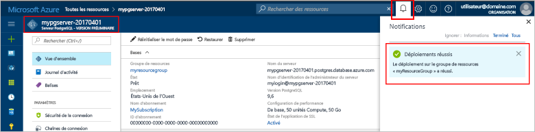

# <a name="design-your-first-azure-database-for-postgresql-using-hello-azure-portal"></a><span data-ttu-id="9ed9c-103">Concevoir votre première base de données Azure pour PostgreSQL à l’aide de hello portail Azure</span><span class="sxs-lookup"><span data-stu-id="9ed9c-103">Design your first Azure Database for PostgreSQL using hello Azure portal</span></span>

<span data-ttu-id="9ed9c-104">Base de données Azure pour PostgreSQL est un service géré qui vous permet de toorun, gérer et mettre à l’échelle des bases de données PostgreSQL hautement disponibles dans le cloud de hello.</span><span class="sxs-lookup"><span data-stu-id="9ed9c-104">Azure Database for PostgreSQL is a managed service that enables you toorun, manage, and scale highly available PostgreSQL databases in hello cloud.</span></span> <span data-ttu-id="9ed9c-105">À l’aide de hello portail Azure, vous pouvez facilement gérer votre serveur et concevoir une base de données.</span><span class="sxs-lookup"><span data-stu-id="9ed9c-105">Using hello Azure portal, you can easily manage your server and design a database.</span></span>

<span data-ttu-id="9ed9c-106">Dans ce didacticiel, vous utilisez comment hello toolearn portail Azure pour :</span><span class="sxs-lookup"><span data-stu-id="9ed9c-106">In this tutorial, you use hello Azure portal toolearn how to:</span></span>
> [!div class="checklist"]
> * <span data-ttu-id="9ed9c-107">Créer une base de données Azure pour PostgreSQL</span><span class="sxs-lookup"><span data-stu-id="9ed9c-107">Create an Azure Database for PostgreSQL</span></span>
> * <span data-ttu-id="9ed9c-108">Configurer le pare-feu du serveur hello</span><span class="sxs-lookup"><span data-stu-id="9ed9c-108">Configure hello server firewall</span></span>
> * <span data-ttu-id="9ed9c-109">Utilisez [ **psql** ](https://www.postgresql.org/docs/9.6/static/app-psql.html) utilitaire toocreate une base de données</span><span class="sxs-lookup"><span data-stu-id="9ed9c-109">Use [**psql**](https://www.postgresql.org/docs/9.6/static/app-psql.html) utility toocreate a database</span></span>
> * <span data-ttu-id="9ed9c-110">Charger les exemples de données</span><span class="sxs-lookup"><span data-stu-id="9ed9c-110">Load sample data</span></span>
> * <span data-ttu-id="9ed9c-111">Données de requête</span><span class="sxs-lookup"><span data-stu-id="9ed9c-111">Query data</span></span>
> * <span data-ttu-id="9ed9c-112">Mettre à jour des données</span><span class="sxs-lookup"><span data-stu-id="9ed9c-112">Update data</span></span>
> * <span data-ttu-id="9ed9c-113">Restaurer des données</span><span class="sxs-lookup"><span data-stu-id="9ed9c-113">Restore data</span></span>

## <a name="prerequisites"></a><span data-ttu-id="9ed9c-114">Composants requis</span><span class="sxs-lookup"><span data-stu-id="9ed9c-114">Prerequisites</span></span>
<span data-ttu-id="9ed9c-115">Si vous n’avez pas d’abonnement Azure, créez un compte [gratuit](https://azure.microsoft.com/free/) avant de commencer.</span><span class="sxs-lookup"><span data-stu-id="9ed9c-115">If you don't have an Azure subscription, create a [free](https://azure.microsoft.com/free/) account before you begin.</span></span>

## <a name="log-in-toohello-azure-portal"></a><span data-ttu-id="9ed9c-116">Ouvrez une session dans toohello portail Azure</span><span class="sxs-lookup"><span data-stu-id="9ed9c-116">Log in toohello Azure portal</span></span>
<span data-ttu-id="9ed9c-117">Connectez-vous à toohello [portail Azure](https://portal.azure.com).</span><span class="sxs-lookup"><span data-stu-id="9ed9c-117">Log in toohello [Azure portal](https://portal.azure.com).</span></span>

## <a name="create-an-azure-database-for-postgresql"></a><span data-ttu-id="9ed9c-118">Créer une base de données Azure pour PostgreSQL</span><span class="sxs-lookup"><span data-stu-id="9ed9c-118">Create an Azure Database for PostgreSQL</span></span>

<span data-ttu-id="9ed9c-119">Un serveur de base de données Azure pour PostgreSQL est créé. Il contient un ensemble défini de [ressources de calcul et de stockage](./concepts-compute-unit-and-storage.md).</span><span class="sxs-lookup"><span data-stu-id="9ed9c-119">An Azure Database for PostgreSQL server is created with a defined set of [compute and storage resources](./concepts-compute-unit-and-storage.md).</span></span> <span data-ttu-id="9ed9c-120">serveur de Hello est créé dans un [groupe de ressources Azure](../azure-resource-manager/resource-group-overview.md).</span><span class="sxs-lookup"><span data-stu-id="9ed9c-120">hello server is created within an [Azure resource group](../azure-resource-manager/resource-group-overview.md).</span></span>

<span data-ttu-id="9ed9c-121">Suivez ces étapes de toocreate PostgreSQL server dans une base de données Azure :</span><span class="sxs-lookup"><span data-stu-id="9ed9c-121">Follow these steps toocreate an Azure Database for PostgreSQL server:</span></span>
1.  <span data-ttu-id="9ed9c-122">Cliquez sur hello **+ nouveau** bouton se trouve sur le coin supérieur gauche hello Hello portail Azure.</span><span class="sxs-lookup"><span data-stu-id="9ed9c-122">Click hello **+ New**  button found on hello upper left-hand corner of hello Azure portal.</span></span>
2.  <span data-ttu-id="9ed9c-123">Sélectionnez **bases de données** de hello **nouveau** page, puis sélectionnez **base de données Azure pour PostgreSQL** de hello **bases de données** page.</span><span class="sxs-lookup"><span data-stu-id="9ed9c-123">Select **Databases** from hello **New** page, and select **Azure Database for PostgreSQL** from hello **Databases** page.</span></span>
 <span data-ttu-id="9ed9c-124"></span><span class="sxs-lookup"><span data-stu-id="9ed9c-124"></span></span>

3.  <span data-ttu-id="9ed9c-125">Rempliront hello nouveau serveur détails avec hello suivant d’informations, comme indiqué dans le hello précédant l’image :</span><span class="sxs-lookup"><span data-stu-id="9ed9c-125">Fill out hello new server details form with hello following information, as shown on hello preceding image:</span></span>
    - <span data-ttu-id="9ed9c-126">Nom du serveur : **mypgserver-20170401** (nom d’un serveur mappe le nom de tooDNS et est donc requis toobe global unique)</span><span class="sxs-lookup"><span data-stu-id="9ed9c-126">Server name: **mypgserver-20170401** (name of a server maps tooDNS name and is thus required toobe globally unique)</span></span> 
    - <span data-ttu-id="9ed9c-127">L’abonnement : Si vous avez plusieurs abonnements, choisissez abonnement approprié de hello dans lequel les ressources hello existent ou sont facturé pour.</span><span class="sxs-lookup"><span data-stu-id="9ed9c-127">Subscription: If you have multiple subscriptions, choose hello appropriate subscription in which hello resource exists or is billed for.</span></span>
    - <span data-ttu-id="9ed9c-128">Groupe de ressources : **myresourcegroup**.</span><span class="sxs-lookup"><span data-stu-id="9ed9c-128">Resource group: **myresourcegroup**</span></span>
    - <span data-ttu-id="9ed9c-129">Connexion d’administrateur du serveur et mot de passe de votre choix.</span><span class="sxs-lookup"><span data-stu-id="9ed9c-129">Server admin login and password of your choice</span></span>
    - <span data-ttu-id="9ed9c-130">Lieu</span><span class="sxs-lookup"><span data-stu-id="9ed9c-130">Location</span></span>
    - <span data-ttu-id="9ed9c-131">Version de PostgreSQL.</span><span class="sxs-lookup"><span data-stu-id="9ed9c-131">PostgreSQL Version</span></span>

  > [!IMPORTANT]
  > <span data-ttu-id="9ed9c-132">connexion administrateur de serveur Hello et un mot de passe que vous spécifiez ici sont requis toolog dans toohello server et ses bases de données plus loin dans ce guide de démarrage rapide.</span><span class="sxs-lookup"><span data-stu-id="9ed9c-132">hello server admin login and password that you specify here are required toolog in toohello server and its databases later in this quick start.</span></span> <span data-ttu-id="9ed9c-133">Retenez ou enregistrez ces informations pour une utilisation ultérieure.</span><span class="sxs-lookup"><span data-stu-id="9ed9c-133">Remember or record this information for later use.</span></span>

4.  <span data-ttu-id="9ed9c-134">Cliquez sur **niveau tarifaire** toospecify hello performances et la couche de niveau de service pour votre nouvelle base de données.</span><span class="sxs-lookup"><span data-stu-id="9ed9c-134">Click **Pricing tier** toospecify hello service tier and performance level for your new database.</span></span> <span data-ttu-id="9ed9c-135">Pour ce guide de démarrage rapide, choisissez le niveau **De base**, **50 unités de calcul** et **50 Go** de stockage inclus.</span><span class="sxs-lookup"><span data-stu-id="9ed9c-135">For this quick start, select **Basic** Tier, **50 Compute Units** and **50 GB** of included storage.</span></span>
 <span data-ttu-id="9ed9c-136"></span><span class="sxs-lookup"><span data-stu-id="9ed9c-136"></span></span>
5.  <span data-ttu-id="9ed9c-137">Cliquez sur **OK**.</span><span class="sxs-lookup"><span data-stu-id="9ed9c-137">Click **Ok**.</span></span>
6.  <span data-ttu-id="9ed9c-138">Cliquez sur **créer** serveur hello de tooprovision.</span><span class="sxs-lookup"><span data-stu-id="9ed9c-138">Click **Create** tooprovision hello server.</span></span> <span data-ttu-id="9ed9c-139">L’approvisionnement prend quelques minutes.</span><span class="sxs-lookup"><span data-stu-id="9ed9c-139">Provisioning takes a few minutes.</span></span>

  > [!TIP]
  > <span data-ttu-id="9ed9c-140">Vérifiez hello **toodashboard du code confidentiel** option tooallow simplifier le suivi de vos déploiements.</span><span class="sxs-lookup"><span data-stu-id="9ed9c-140">Check hello **Pin toodashboard** option tooallow easy tracking of your deployments.</span></span>

7.  <span data-ttu-id="9ed9c-141">Dans la barre d’outils de hello, cliquez sur **Notifications** processus de déploiement toomonitor hello.</span><span class="sxs-lookup"><span data-stu-id="9ed9c-141">On hello toolbar, click **Notifications** toomonitor hello deployment process.</span></span>
 <span data-ttu-id="9ed9c-142"></span><span class="sxs-lookup"><span data-stu-id="9ed9c-142"></span></span>
   
  <span data-ttu-id="9ed9c-143">Par défaut, la création de la base de données **postgres** intervient sous votre serveur.</span><span class="sxs-lookup"><span data-stu-id="9ed9c-143">By default, **postgres** database gets created under your server.</span></span> <span data-ttu-id="9ed9c-144">Hello [postgres](https://www.postgresql.org/docs/9.6/static/app-initdb.html) base de données est une base de données par défaut destinée à une utilisation par les utilisateurs, les utilitaires et les applications tierces.</span><span class="sxs-lookup"><span data-stu-id="9ed9c-144">hello [postgres](https://www.postgresql.org/docs/9.6/static/app-initdb.html) database is a default database meant for use by users, utilities, and third-party applications.</span></span> 

## <a name="configure-a-server-level-firewall-rule"></a><span data-ttu-id="9ed9c-145">Configurer une règle de pare-feu au niveau du serveur</span><span class="sxs-lookup"><span data-stu-id="9ed9c-145">Configure a server-level firewall rule</span></span>

<span data-ttu-id="9ed9c-146">Bonjour Azure de base de données PostgreSQL service crée un pare-feu au niveau serveur hello.</span><span class="sxs-lookup"><span data-stu-id="9ed9c-146">hello Azure Database for PostgreSQL service creates a firewall at hello server-level.</span></span> <span data-ttu-id="9ed9c-147">Ce pare-feu empêche des applications externes et des outils de se connecter toutes les bases de données sur le serveur de hello et toohello, sauf si une règle de pare-feu est créée le pare-feu tooopen hello pour des adresses IP spécifiques.</span><span class="sxs-lookup"><span data-stu-id="9ed9c-147">This firewall prevents external applications and tools from connecting toohello server and any databases on hello server unless a firewall rule is created tooopen hello firewall for specific IP addresses.</span></span> 

1.  <span data-ttu-id="9ed9c-148">Une fois le déploiement de hello terminé, cliquez sur **toutes les ressources** de menu à gauche hello et tapez le nom de hello **mypgserver-20170401** toosearch pour votre serveur nouvellement créé.</span><span class="sxs-lookup"><span data-stu-id="9ed9c-148">After hello deployment completes, click **All Resources** from hello left-hand menu and type in hello name **mypgserver-20170401** toosearch for your newly created server.</span></span> <span data-ttu-id="9ed9c-149">Cliquez sur le nom du serveur hello répertorié dans les résultats de recherche hello.</span><span class="sxs-lookup"><span data-stu-id="9ed9c-149">Click hello server name listed in hello search result.</span></span> <span data-ttu-id="9ed9c-150">Hello **vue d’ensemble** pour votre serveur s’ouvre et fournit des options pour poursuivre la configuration de la page.</span><span class="sxs-lookup"><span data-stu-id="9ed9c-150">hello **Overview** page for your server opens and provides options for further configuration.</span></span>
 
 

2.  <span data-ttu-id="9ed9c-152">Dans le panneau de serveur hello, sélectionnez **sécurité de connexion**.</span><span class="sxs-lookup"><span data-stu-id="9ed9c-152">In hello server blade, select **Connection Security**.</span></span> 
3.  <span data-ttu-id="9ed9c-153">Cliquez dans la zone de texte hello sous **nom de la règle,** et ajoutez une nouvelle pare-feu règle toowhitelist hello plages IP pour la connectivité.</span><span class="sxs-lookup"><span data-stu-id="9ed9c-153">Click in hello text box under **Rule Name,** and add a new firewall rule toowhitelist hello IP range for connectivity.</span></span> <span data-ttu-id="9ed9c-154">Pour ce didacticiel, nous allons autoriser toutes les adresses IP. Pour cela, tapez **Nom de la règle = AllowAllIps** ,  **= 0.0.0.0** et **= 255.255.255.255** , puis cliquez sur **Enregistrer**.</span><span class="sxs-lookup"><span data-stu-id="9ed9c-154">For this tutorial, let's allow all IPs by typing in **Rule Name = AllowAllIps**, **Start IP = 0.0.0.0** and **End IP = 255.255.255.255** and then click **Save**.</span></span> <span data-ttu-id="9ed9c-155">Vous pouvez définir une règle de pare-feu qui couvre une tooconnect IP plage toobe en mesure de votre réseau.</span><span class="sxs-lookup"><span data-stu-id="9ed9c-155">You can set a firewall rule that covers an IP range toobe able tooconnect from your network.</span></span>
 
 

4.  <span data-ttu-id="9ed9c-157">Cliquez sur **enregistrer** puis cliquez sur hello **X** tooclose hello **sécurité des connexions** page.</span><span class="sxs-lookup"><span data-stu-id="9ed9c-157">Click **Save** and then click hello **X** tooclose hello **Connections Security** page.</span></span>

  > [!NOTE]
  > <span data-ttu-id="9ed9c-158">Le serveur Azure PostgreSQL communique sur le port 5432.</span><span class="sxs-lookup"><span data-stu-id="9ed9c-158">Azure PostgreSQL server communicates over port 5432.</span></span> <span data-ttu-id="9ed9c-159">Si vous essayez de tooconnect à partir d’un réseau d’entreprise, le trafic sortant sur le port 5432 ne peut pas être autorisé par le pare-feu de votre réseau.</span><span class="sxs-lookup"><span data-stu-id="9ed9c-159">If you are trying tooconnect from within a corporate network, outbound traffic over port 5432 may not be allowed by your network's firewall.</span></span> <span data-ttu-id="9ed9c-160">Dans ce cas, vous ne serez pas de serveur de base de données SQL Azure en mesure de tooconnect tooyour, sauf si votre service informatique ouvre le port 5432.</span><span class="sxs-lookup"><span data-stu-id="9ed9c-160">If so, you will not be able tooconnect tooyour Azure SQL Database server unless your IT department opens port 5432.</span></span>
  >


## <a name="get-hello-connection-information"></a><span data-ttu-id="9ed9c-161">Obtenir des informations de connexion hello</span><span class="sxs-lookup"><span data-stu-id="9ed9c-161">Get hello connection information</span></span>

<span data-ttu-id="9ed9c-162">Lorsque nous avons créé notre base de données Azure pour le serveur de PostgreSQL, hello par défaut **postgres** base de données est également créé.</span><span class="sxs-lookup"><span data-stu-id="9ed9c-162">When we created our Azure Database for PostgreSQL server, hello default **postgres** database also gets created.</span></span> <span data-ttu-id="9ed9c-163">serveur de base de données tooconnect tooyour, vous devez tooprovide hôte accéder aux informations et informations d’identification.</span><span class="sxs-lookup"><span data-stu-id="9ed9c-163">tooconnect tooyour database server, you need tooprovide host information and access credentials.</span></span>

1. <span data-ttu-id="9ed9c-164">Hello menu de gauche dans le portail Azure, cliquez sur **toutes les ressources** et recherchez le serveur hello vous venez de créer **mypgserver-20170401**.</span><span class="sxs-lookup"><span data-stu-id="9ed9c-164">From hello left-hand menu in Azure portal, click **All resources** and search for hello server you just created **mypgserver-20170401**.</span></span>

  

3. <span data-ttu-id="9ed9c-166">Cliquez sur le nom du serveur hello **mypgserver-20170401**.</span><span class="sxs-lookup"><span data-stu-id="9ed9c-166">Click hello server name **mypgserver-20170401**.</span></span>
4. <span data-ttu-id="9ed9c-167">Serveur hello sélectionnez **vue d’ensemble** page.</span><span class="sxs-lookup"><span data-stu-id="9ed9c-167">Select hello server's **Overview** page.</span></span> <span data-ttu-id="9ed9c-168">Prenez note de hello **nom du serveur** et **nom de connexion de serveur admin**.</span><span class="sxs-lookup"><span data-stu-id="9ed9c-168">Make a note of hello **Server name** and **Server admin login name**.</span></span>

 


## <a name="connect-toopostgresql-database-using-psql-in-cloud-shell"></a><span data-ttu-id="9ed9c-170">Se connecter à l’aide de psql dans un environnement de Cloud de la base de données tooPostgreSQL</span><span class="sxs-lookup"><span data-stu-id="9ed9c-170">Connect tooPostgreSQL database using psql in Cloud Shell</span></span>

<span data-ttu-id="9ed9c-171">Nous allons maintenant utiliser hello psql utilitaire de ligne de commande tooconnect toohello Azure de base de données PostgreSQL serveur.</span><span class="sxs-lookup"><span data-stu-id="9ed9c-171">Let's now use hello psql command-line utility tooconnect toohello Azure Database for PostgreSQL server.</span></span> 
1. <span data-ttu-id="9ed9c-172">Lancez hello Azure Cloud Shell via l’icône de terminal hello sur le volet de navigation supérieure hello.</span><span class="sxs-lookup"><span data-stu-id="9ed9c-172">Launch hello Azure Cloud Shell via hello terminal icon on hello top navigation pane.</span></span>

   

2. <span data-ttu-id="9ed9c-174">Bonjour Azure Cloud Shell s’ouvre dans votre navigateur, ce qui vous tootype bash commandes.</span><span class="sxs-lookup"><span data-stu-id="9ed9c-174">hello Azure Cloud Shell opens in your browser, enabling you tootype bash commands.</span></span>

   

3. <span data-ttu-id="9ed9c-176">Invite hello Cloud, se connecter tooyour base de données Azure pour le serveur PostgreSQL à l’aide des commandes de psql hello.</span><span class="sxs-lookup"><span data-stu-id="9ed9c-176">At hello Cloud Shell prompt, connect tooyour Azure Database for PostgreSQL server using hello psql commands.</span></span> <span data-ttu-id="9ed9c-177">Bonjour format suivant est utilisé tooconnect tooan base de données Azure pour serveur PostgreSQL avec hello [psql](https://www.postgresql.org/docs/9.6/static/app-psql.html) utilitaire :</span><span class="sxs-lookup"><span data-stu-id="9ed9c-177">hello following format is used tooconnect tooan Azure Database for PostgreSQL server with hello [psql](https://www.postgresql.org/docs/9.6/static/app-psql.html) utility:</span></span>
   ```bash
   psql --host=<myserver> --port=<port> --username=<server admin login> --dbname=<database name>
   ```

   <span data-ttu-id="9ed9c-178">Par exemple, hello commande suivante connecte à base de données de la valeur par défaut toohello appelée **postgres** sur votre serveur PostgreSQL **mypgserver-20170401.postgres.database.azure.com** à l’aide des informations d’identification d’accès.</span><span class="sxs-lookup"><span data-stu-id="9ed9c-178">For example, hello following command connects toohello default database called **postgres** on your PostgreSQL server **mypgserver-20170401.postgres.database.azure.com** using access credentials.</span></span> <span data-ttu-id="9ed9c-179">À l’invite, entrez votre mot de passe d’administrateur du serveur.</span><span class="sxs-lookup"><span data-stu-id="9ed9c-179">Enter your server admin password when prompted.</span></span>

   ```bash
   psql --host=mypgserver-20170401.postgres.database.azure.com --port=5432 --username=mylogin@mypgserver-20170401 --dbname=postgres
   ```

## <a name="create-a-new-database"></a><span data-ttu-id="9ed9c-180">Créer une base de données</span><span class="sxs-lookup"><span data-stu-id="9ed9c-180">Create a New Database</span></span>
<span data-ttu-id="9ed9c-181">Une fois que vous êtes connecté toohello server, créez une base de données vide à l’invite de hello.</span><span class="sxs-lookup"><span data-stu-id="9ed9c-181">Once you're connected toohello server, create a blank database at hello prompt.</span></span>
```bash
CREATE DATABASE mypgsqldb;
```

<span data-ttu-id="9ed9c-182">À l’invite de hello, exécutez hello suivant de base de données de commande tooswitch connexion toohello nouvellement créé **mypgsqldb**.</span><span class="sxs-lookup"><span data-stu-id="9ed9c-182">At hello prompt, execute hello following command tooswitch connection toohello newly created database **mypgsqldb**.</span></span>
```bash
\c mypgsqldb
```
## <a name="create-tables-in-hello-database"></a><span data-ttu-id="9ed9c-183">Créer des tables dans la base de données hello</span><span class="sxs-lookup"><span data-stu-id="9ed9c-183">Create tables in hello database</span></span>
<span data-ttu-id="9ed9c-184">Maintenant que vous savez comment tooconnect toohello base de données Azure pour PostgreSQL, nous pouvons sur la façon toocomplete certaines tâches de base.</span><span class="sxs-lookup"><span data-stu-id="9ed9c-184">Now that you know how tooconnect toohello Azure Database for PostgreSQL, we can go over how toocomplete some basic tasks.</span></span>

<span data-ttu-id="9ed9c-185">Tout d’abord, nous pouvons créer une table et y charger des données.</span><span class="sxs-lookup"><span data-stu-id="9ed9c-185">First, we can create a table and load it with some data.</span></span> <span data-ttu-id="9ed9c-186">Nous allons créer une table qui assure le suivi des informations d’inventaire.</span><span class="sxs-lookup"><span data-stu-id="9ed9c-186">Let's create a table that tracks inventory information.</span></span>
```sql
CREATE TABLE inventory (
    id serial PRIMARY KEY, 
    name VARCHAR(50), 
    quantity INTEGER
);
```

<span data-ttu-id="9ed9c-187">Vous pouvez voir hello nouvellement créé table dans la liste hello de tabvles maintenant en tapant :</span><span class="sxs-lookup"><span data-stu-id="9ed9c-187">You can see hello newly created table in hello list of tabvles now by typing:</span></span>
```sql
\dt
```

## <a name="load-data-into-hello-tables"></a><span data-ttu-id="9ed9c-188">Charger des données dans les tables de hello</span><span class="sxs-lookup"><span data-stu-id="9ed9c-188">Load data into hello tables</span></span>
<span data-ttu-id="9ed9c-189">Maintenant que nous disposons d’une table, nous pouvons y insérer des données.</span><span class="sxs-lookup"><span data-stu-id="9ed9c-189">Now that we have a table, we can insert some data into it.</span></span> <span data-ttu-id="9ed9c-190">Au niveau de la fenêtre d’invite de commandes ouverte hello, exécutez hello suivant requête tooinsert certaines lignes de données</span><span class="sxs-lookup"><span data-stu-id="9ed9c-190">At hello open command prompt window, run hello following query tooinsert some rows of data</span></span>
```sql
INSERT INTO inventory (id, name, quantity) VALUES (1, 'banana', 150); 
INSERT INTO inventory (id, name, quantity) VALUES (2, 'orange', 154);
```

<span data-ttu-id="9ed9c-191">Vous avez maintenant deux lignes d’exemples de données dans la table hello que vous avez créé précédemment.</span><span class="sxs-lookup"><span data-stu-id="9ed9c-191">You have now two rows of sample data into hello table you created earlier.</span></span>

## <a name="query-and-update-hello-data-in-hello-tables"></a><span data-ttu-id="9ed9c-192">Interroger et mettre à jour les données hello dans les tables de hello</span><span class="sxs-lookup"><span data-stu-id="9ed9c-192">Query and update hello data in hello tables</span></span>
<span data-ttu-id="9ed9c-193">Exécutez hello suivant tooretrieve les informations de requête à partir de la table de base de données hello.</span><span class="sxs-lookup"><span data-stu-id="9ed9c-193">Execute hello following query tooretrieve information from hello database table.</span></span> 
```sql
SELECT * FROM inventory;
```

<span data-ttu-id="9ed9c-194">Vous pouvez également mettre à jour les données hello dans les tables de hello</span><span class="sxs-lookup"><span data-stu-id="9ed9c-194">You can also update hello data in hello tables</span></span>
```sql
UPDATE inventory SET quantity = 200 WHERE name = 'banana';
```

<span data-ttu-id="9ed9c-195">ligne de Hello est mise à jour en conséquence lorsque vous récupérez des données.</span><span class="sxs-lookup"><span data-stu-id="9ed9c-195">hello row gets updated accordingly when you retrieve data.</span></span>
```sql
SELECT * FROM inventory;
```

## <a name="restore-data-tooa-previous-point-in-time"></a><span data-ttu-id="9ed9c-196">Restaurer le point de données tooa précédent dans le temps</span><span class="sxs-lookup"><span data-stu-id="9ed9c-196">Restore data tooa previous point in time</span></span>
<span data-ttu-id="9ed9c-197">Imaginez que vous avez supprimé cette table par erreur.</span><span class="sxs-lookup"><span data-stu-id="9ed9c-197">Imagine you have accidentally deleted this table.</span></span> <span data-ttu-id="9ed9c-198">La récupération dans ce cas n’est pas simple.</span><span class="sxs-lookup"><span data-stu-id="9ed9c-198">This situation is something you cannot easily recover from.</span></span> <span data-ttu-id="9ed9c-199">Base de données Azure pour PostgreSQL vous permet de toogo tooany arrière dans le temps (en hello dernière too7 jours (Basic) et de 35 jours (Standard)) et de restauration ce point-à-temps tooa nouveau serveur.</span><span class="sxs-lookup"><span data-stu-id="9ed9c-199">Azure Database for PostgreSQL allows you toogo back tooany point-in-time (in hello last up too7 days (Basic) and 35 days (Standard)) and restore this point-in-time tooa new server.</span></span> <span data-ttu-id="9ed9c-200">Les données supprimées, vous pouvez utiliser cette nouvelle toorecover de serveur.</span><span class="sxs-lookup"><span data-stu-id="9ed9c-200">You can use this new server toorecover your deleted data.</span></span> <span data-ttu-id="9ed9c-201">Hello suivant étapes restauration hello exemple server tooa point avant hello table a été ajoutée.</span><span class="sxs-lookup"><span data-stu-id="9ed9c-201">hello following steps restore hello sample server tooa point before hello table was added.</span></span>

1.  <span data-ttu-id="9ed9c-202">Dans hello Azure de base de données pour la page PostgreSQL pour votre serveur, cliquez sur **restaurer** sur la barre d’outils hello.</span><span class="sxs-lookup"><span data-stu-id="9ed9c-202">On hello Azure Database for PostgreSQL page for your server, click **Restore** on hello toolbar.</span></span> <span data-ttu-id="9ed9c-203">Hello **restaurer** ouvrir la page.</span><span class="sxs-lookup"><span data-stu-id="9ed9c-203">hello **Restore** page opens.</span></span>
  <span data-ttu-id="9ed9c-204"></span><span class="sxs-lookup"><span data-stu-id="9ed9c-204"></span></span>
2.  <span data-ttu-id="9ed9c-205">Remplir hello **restaurer** formulaire avec les informations de hello requis :</span><span class="sxs-lookup"><span data-stu-id="9ed9c-205">Fill out hello **Restore** form with hello required information:</span></span>

  
  - <span data-ttu-id="9ed9c-207">**Point de restauration**: sélectionnez un point dans le temps qui se produit avant que le serveur de hello a été modifié</span><span class="sxs-lookup"><span data-stu-id="9ed9c-207">**Restore point**: Select a point-in-time that occurs before hello server was changed</span></span>
  - <span data-ttu-id="9ed9c-208">**Serveur cible**: fournir un nouveau nom du serveur toorestore à</span><span class="sxs-lookup"><span data-stu-id="9ed9c-208">**Target server**: Provide a new server name you want toorestore to</span></span>
  - <span data-ttu-id="9ed9c-209">**Emplacement**: vous ne pouvez pas sélectionner la région de hello, par défaut, il est identique au serveur de source de hello</span><span class="sxs-lookup"><span data-stu-id="9ed9c-209">**Location**: You cannot select hello region, by default it is same as hello source server</span></span>
  - <span data-ttu-id="9ed9c-210">**Niveau tarifaire** : vous ne pouvez pas modifier cette valeur lors de la restauration d’un serveur.</span><span class="sxs-lookup"><span data-stu-id="9ed9c-210">**Pricing tier**: You cannot change this value when restoring a server.</span></span> <span data-ttu-id="9ed9c-211">Il est identique au serveur de source de hello.</span><span class="sxs-lookup"><span data-stu-id="9ed9c-211">It is same as hello source server.</span></span> 
3.  <span data-ttu-id="9ed9c-212">Cliquez sur **OK** toorestore hello server trop[tooa point-à-temps de restauration](./howto-restore-server-portal.md) avant la suppression de tables de hello.</span><span class="sxs-lookup"><span data-stu-id="9ed9c-212">Click **OK** toorestore hello server too[restore tooa point-in-time](./howto-restore-server-portal.md) before hello tables was deleted.</span></span> <span data-ttu-id="9ed9c-213">Restauration d’un point différent de tooa de serveur dans le temps crée un nouveau serveur en double en tant que serveur d’origine de hello en tant que point hello dans le temps, vous spécifiez, autant qu’il soit dans la période de rétention hello pour votre [niveau de service](./concepts-service-tiers.md).</span><span class="sxs-lookup"><span data-stu-id="9ed9c-213">Restoring a server tooa different point in time creates a duplicate new server as hello original server as of hello point in time you specify, provided that it is within hello retention period for your [service tier](./concepts-service-tiers.md).</span></span>

## <a name="next-steps"></a><span data-ttu-id="9ed9c-214">Étapes suivantes</span><span class="sxs-lookup"><span data-stu-id="9ed9c-214">Next Steps</span></span>
<span data-ttu-id="9ed9c-215">Dans ce didacticiel, vous avez appris comment toouse hello portail Azure et autres utilitaires pour :</span><span class="sxs-lookup"><span data-stu-id="9ed9c-215">In this tutorial, you learned how toouse hello Azure portal and other utilities to:</span></span>
> [!div class="checklist"]
> * <span data-ttu-id="9ed9c-216">Créer une base de données Azure pour PostgreSQL</span><span class="sxs-lookup"><span data-stu-id="9ed9c-216">Create an Azure Database for PostgreSQL</span></span>
> * <span data-ttu-id="9ed9c-217">Configurer le pare-feu du serveur hello</span><span class="sxs-lookup"><span data-stu-id="9ed9c-217">Configure hello server firewall</span></span>
> * <span data-ttu-id="9ed9c-218">Utilisez [ **psql** ](https://www.postgresql.org/docs/9.6/static/app-psql.html) utilitaire toocreate une base de données</span><span class="sxs-lookup"><span data-stu-id="9ed9c-218">Use [**psql**](https://www.postgresql.org/docs/9.6/static/app-psql.html) utility toocreate a database</span></span>
> * <span data-ttu-id="9ed9c-219">Charger les exemples de données</span><span class="sxs-lookup"><span data-stu-id="9ed9c-219">Load sample data</span></span>
> * <span data-ttu-id="9ed9c-220">Données de requête</span><span class="sxs-lookup"><span data-stu-id="9ed9c-220">Query data</span></span>
> * <span data-ttu-id="9ed9c-221">Mettre à jour des données</span><span class="sxs-lookup"><span data-stu-id="9ed9c-221">Update data</span></span>
> * <span data-ttu-id="9ed9c-222">Restaurer des données</span><span class="sxs-lookup"><span data-stu-id="9ed9c-222">Restore data</span></span>

<span data-ttu-id="9ed9c-223">Ensuite, découvrez comment toouse CLI d’Azure toodo des tâches similaires, passez en revue ce didacticiel : [concevoir votre première base de données Azure pour PostgreSQL à l’aide de CLI d’Azure](tutorial-design-database-using-azure-cli.md)</span><span class="sxs-lookup"><span data-stu-id="9ed9c-223">Next, learn how toouse Azure CLI toodo similar tasks, review this tutorial: [Design your first Azure Database for PostgreSQL using Azure CLI](tutorial-design-database-using-azure-cli.md)</span></span>
