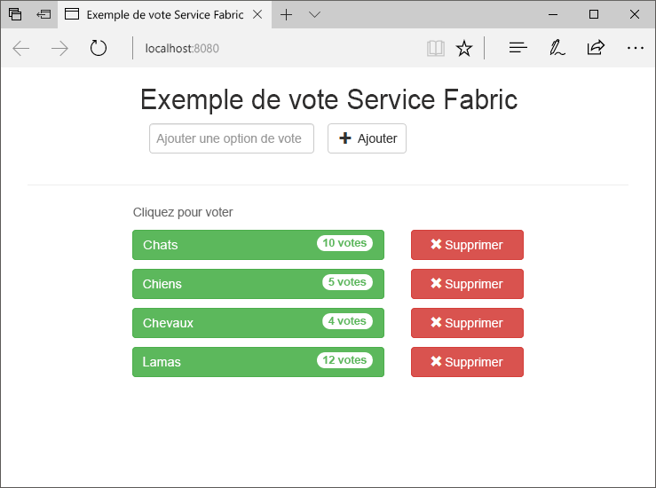
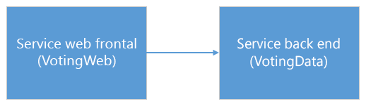
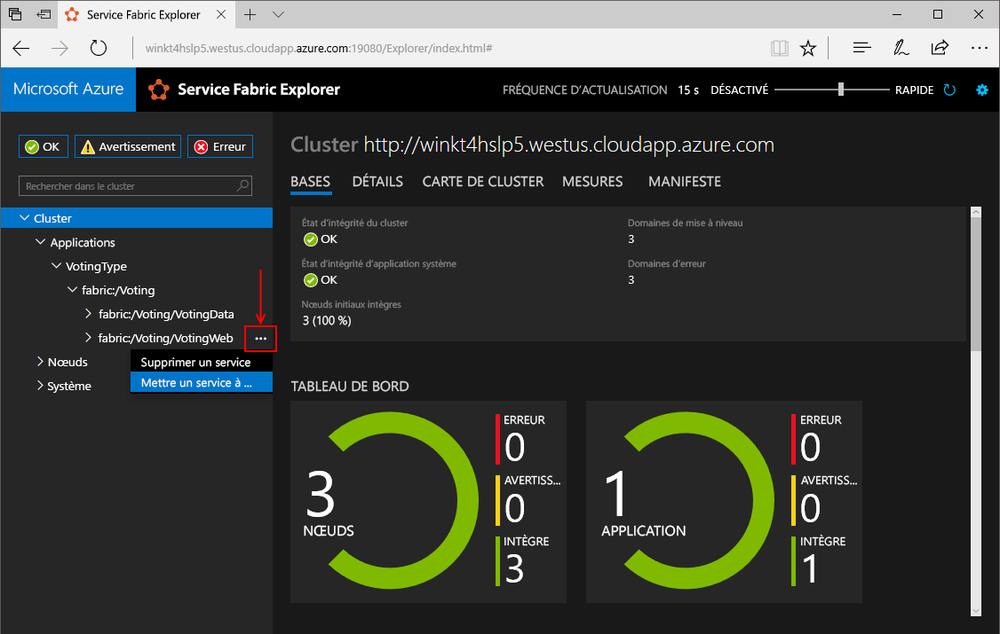
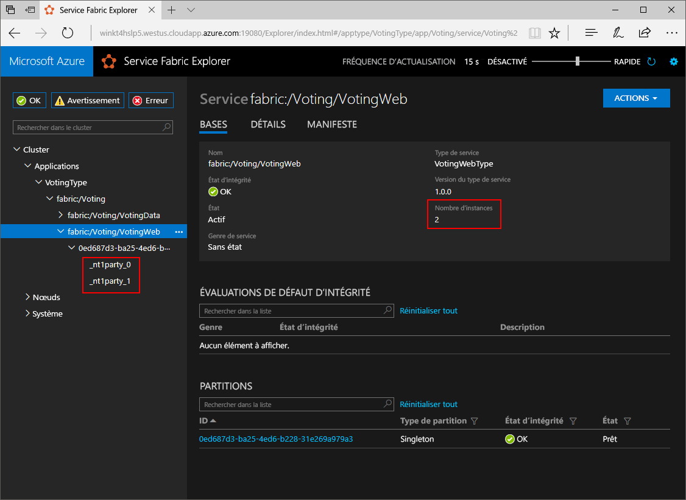
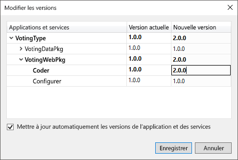
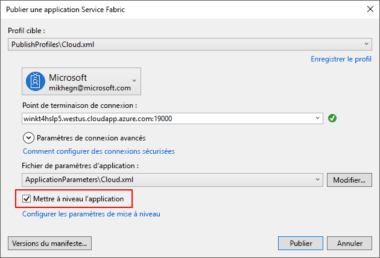
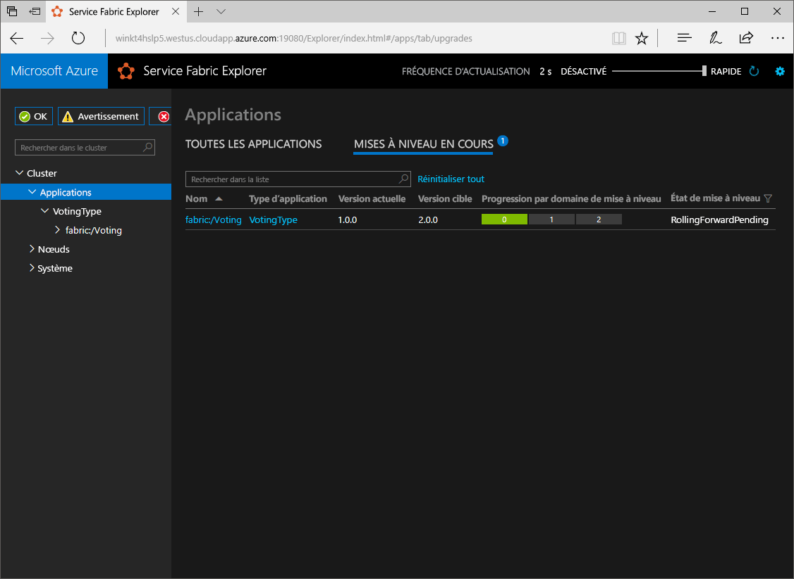

# <a name="create-a-net-service-fabric-application-in-azure"></a>Créer une application Service Fabric dans Azure
Azure Service Fabric est une plateforme de systèmes distribués pour le déploiement et la gestion de microservices et conteneurs extensibles et fiables. 

Ce démarrage rapide montre comment toodeploy votre tooService d’application .NET premier ensemble fibre optique. Lorsque vous avez terminé, vous disposez d’une application de vote avec un serveur web ASP.NET Core frontal qui enregistre les résultats de vote dans un service principal avec état dans le cluster de hello.



Cette application vous permet d’apprendre à :
> [!div class="checklist"]
> * Créer une application à l’aide de .NET et Service Fabric
> * Utiliser ASP.NET Core en tant que service frontal web
> * Stocker des données d’application dans un service avec état
> * Déboguez votre application localement
> * Déployer un cluster tooa hello application dans Azure
> * Application hello de montée en puissance parallèle sur plusieurs nœuds
> * Effectuer une mise à niveau propagée d’application

## <a name="prerequisites"></a>Composants requis
toocomplete ce démarrage rapide :
1. [Installer Visual Studio 2017](https://www.visualstudio.com/) avec hello **le développement Azure** et **développement web ASP.NET et** les charges de travail.
2. [Installez Git](https://git-scm.com/)
3. [Installer hello Microsoft Azure Service Fabric SDK](http://www.microsoft.com/web/handlers/webpi.ashx?command=getinstallerredirect&appid=MicrosoftAzure-ServiceFabric-CoreSDK)
4. Exécutez hello suivant le cluster de l’infrastructure de Service local de commande tooenable Visual Studio toodeploy toohello :
    ```powershell
    Set-ExecutionPolicy -ExecutionPolicy Unrestricted -Force -Scope CurrentUser
    ```

## <a name="download-hello-sample"></a>Télécharger l’exemple hello
Dans une fenêtre de commande, exécutez hello suivant commande tooclone hello exemple application référentiel tooyour ordinateur local.
```
git clone https://github.com/Azure-Samples/service-fabric-dotnet-quickstart
```

## <a name="run-hello-application-locally"></a>Exécutez hello application localement
Icône de Visual Studio hello Bonjour Menu Démarrer d’avec le bouton droit et choisissez **exécuter en tant qu’administrateur**. Dans l’ordre tooattach hello débogueur tooyour les services, vous devez toorun Visual Studio en tant qu’administrateur.

Ouvrez hello **Voting.sln** solution Visual Studio à partir du référentiel hello vous avez cloné.

application de hello toodeploy, appuyez sur **F5**.

> [!NOTE]
> Hello la première fois que vous exécutez et déployez l’application hello, Visual Studio crée un cluster local pour le débogage. Cette opération peut prendre un certain temps. état de la création de cluster Hello s’affiche dans la fenêtre de sortie de Visual Studio hello.

Lorsque le déploiement de hello est terminé, lancer un navigateur et ouvrir cette page : `http://localhost:8080` -hello frontal web d’application hello.


Vous pouvez à présent ajouter un ensemble d’options de vote et commencer à enregistrer les votes. application Hello s’exécute et stocke toutes les données de votre cluster Service Fabric, sans avoir besoin de hello pour une base de données distincte.

## <a name="walk-through-hello-voting-sample-application"></a>Parcourez hello vote exemple d’application
Hello vote application se compose de deux services :
- Web service frontal (VotingWeb) - An ASP.NET Core web service frontal, qui sert de page web de hello et expose web toocommunicate API avec le service principal de hello.
- Le service principal (VotingData)-service web An ASP.NET Core, qui expose un vote de hello API toostore entraîne un dictionnaire fiable rendues persistantes sur disque.



Lorsque vous marquez Bonjour d’application hello suivant se produisent :
1. Un code JavaScript envoie des API du web hello vote demande toohello dans le service frontal hello web comme une demande HTTP PUT.

2. service de Hello web frontal utilise un toolocate proxy et transférer un service de serveur principal de toohello demande HTTP PUT.

3. service principal de Hello accepte la demande entrante de hello et magasins hello mis à jour le résultat dans un dictionnaire fiable, qui obtient les nœuds toomultiple répliquées au sein du cluster de hello et rendues persistantes sur disque. Données de l’application hello toutes les sont stockées dans le cluster de hello, donc aucune base de données n’est nécessaire.

## <a name="debug-in-visual-studio"></a>Déboguer dans Visual Studio
Lors du débogage d’application dans Visual Studio, vous utilisez un cluster de développement Service Fabric local. Vous avez hello option tooadjust votre scénario de tooyour expérience de débogage. Dans cette application, nous stockons les données dans notre service principal à l’aide d’un dictionnaire fiable. Visual Studio supprime l’application hello par défaut lorsque vous arrêtez le débogueur de hello. Suppression de l’application hello entraîne les données hello dans hello principal service tooalso être supprimé. les données de salutation toopersist entre les sessions de débogage, vous pouvez modifier hello **Mode de débogage d’Application** en tant que propriété sur hello **vote** projet dans Visual Studio.

toolook à ce qui se passe dans le code hello, hello complète comme suit :
1. Ouvrez hello **VotesController.cs** de fichiers et de définir un point d’arrêt dans l’API web de hello **Put** méthode (ligne 47) - vous pouvez rechercher des fichiers hello Bonjour l’Explorateur de solutions dans Visual Studio.

2. Ouvrez hello **VoteDataController.cs** de fichiers et de définir un point d’arrêt dans cette API web **Put** (méthode) (ligne 50).

3. Revenir en arrière toohello navigateur et cliquez sur une option de vote ou ajouter une nouvelle option de vote. Vous avez atteint le premier point d’arrêt à la hello dans le contrôleur d’api de hello web frontal.
    - Il s’agit où hello JavaScript dans le navigateur de hello envoie un contrôleur d’API web demande toohello dans le service frontal hello.
    
    

    - Tout d’abord, nous construisons hello URL toohello ReverseProxy pour notre service principal **(1)**.
    - Puis nous envoyer hello la demande HTTP PUT toohello ReverseProxy **(2)**.
    - Enfin hello nous retourner hello réponse à partir du client de toohello hello service principal **(3)**.

4. Appuyez sur **F5** toocontinue
    - Vous êtes maintenant au point d’arrêt hello dans le service principal hello.
    
    

    - Dans la première ligne de hello dans la méthode hello **(1)** , nous utilisons hello `StateManager` tooget ou ajoutez un dictionnaire fiable appelé `counts`.
    - Toutes les interactions avec des valeurs d’un dictionnaire fiable requièrent une transaction. Cette instruction using **(2)** crée cette transaction.
    - Transaction de hello, nous puis mettre à jour valeur clé hello des hello vote option hello et validations hello opération **(3)**. Une fois la validation de hello méthode est retournée, hello données sont mise à jour dans le dictionnaire de hello et répliquées tooother des nœuds de cluster de hello. les données de salutation sont maintenant stockées en toute sécurité dans un cluster de hello et service principal de hello peut échouer sur les nœuds tooother, que les données hello disponibles.
5. Appuyez sur **F5** toocontinue

hello toostop session, appuyez sur le débogage **MAJ + F5**.

## <a name="deploy-hello-application-tooazure"></a>Déployer hello application tooAzure
cluster de tooa application toodeploy hello dans Azure, vous pouvez choisir toocreate votre propre cluster, ou utilisez un Cluster de tiers.

Clusters tiers sont des clusters Service Fabric gratuites et limitée dans le temps hébergé sur Azure et exécuté par l’équipe de Service Fabric hello où tout le monde peut déployer des applications et en savoir plus sur la plateforme de hello. tooget accès tooa tiers Cluster, [suivez les instructions de hello](http://aka.ms/tryservicefabric). 

Pour plus d’informations sur la création de votre propre cluster, voir [Créer votre premier cluster Service Fabric sur Azure](service-fabric-get-started-azure-cluster.md).

> [!Note]
> service de Hello web frontal est toolisten configuré sur le port 8080 pour le trafic entrant. Assurez-vous que ce port est ouvert dans votre cluster. Si vous utilisez hello tiers Cluster, ce port est ouvert.
>

### <a name="deploy-hello-application-using-visual-studio"></a>Déployer l’application hello à l’aide de Visual Studio
Maintenant que l’application hello est prête, vous pouvez la déployer cluster tooa directement à partir de Visual Studio.

1. Avec le bouton droit **vote** dans hello l’Explorateur de solutions et choisissez **publier**. boîte de dialogue Publier Hello s’affiche.

    

2. Type Bonjour point de terminaison de connexion de cluster hello Bonjour **connexion de point de terminaison** champ et cliquez sur **publier**. Lors de l’inscription pour hello tiers Cluster, hello connexion de point de terminaison est fourni dans le navigateur de hello. - par exemple, `winh1x87d1d.westus.cloudapp.azure.com:19000`.

3. Ouvrez un navigateur et tapez dans l’adresse du cluster hello - par exemple, `http://winh1x87d1d.westus.cloudapp.azure.com`. Vous devez maintenant voir application hello en cours d’exécution dans un cluster hello dans Azure.


## <a name="scale-applications-and-services-in-a-cluster"></a>Mettre à l’échelle les applications et services dans un cluster
Services de Fabric de service peuvent facilement être distribuées sur un tooaccommodate de cluster pour une modification dans la charge sur les services de hello hello. Mettre à l’échelle un service en modifiant le nombre de hello d’instances en cours d’exécution dans un cluster de hello. Plusieurs méthodes sont disponibles pour mettre à l’échelle vos services. Vous pouvez utiliser des scripts ou des commandes de PowerShell ou de l’interface CLI de Service Fabric (sfctl). Dans cet exemple, nous utilisons Service Fabric Explorer.

Service Fabric Explorer s’exécute dans tous les clusters Service Fabric et est accessible à partir d’un navigateur, en parcourant le port de gestion de clusters HTTP toohello (19080), par exemple, `http://winh1x87d1d.westus.cloudapp.azure.com:19080`.

tooscale hello service frontal web, procédez comme hello comme suit :

1. Ouvrez Service Fabric Explorer dans votre cluster. Par exemple, `http://winh1x87d1d.westus.cloudapp.azure.com:19080`.
2. Cliquez sur toohello suivant de points de suspension (trois points) hello **fabric : / vote/VotingWeb** nœud hello treeview et choisissez **Service de mise à l’échelle**.

    

    Vous pouvez maintenant choisir le nombre de hello tooscale d’instances de service de hello web frontal.

3. Modifier le nombre de hello trop**2** et cliquez sur **Service de mise à l’échelle**.
4. Cliquez sur hello **fabric : / vote/VotingWeb** nœud hello arborescence et développez le nœud de partition hello (représenté par un GUID).

    

    Vous pouvez maintenant voir que service de hello possède deux instances, et dans l’arborescence de hello, vous voyez les nœuds hello instances s’exécutent sur.

Par cette tâche de gestion simple, nous avons doublé ressources hello disponibles pour la charge utilisateur tooprocess de notre service frontal. Il est important toounderstand que vous n’avez pas besoin de plusieurs instances d’un toohave service fonctionner de manière fiable. Si un service échoue, l’infrastructure de Service permet de s’assurer de qu'une nouvelle instance de service s’exécute dans un cluster de hello.

## <a name="perform-a-rolling-application-upgrade"></a>Effectuer une mise à niveau propagée d’application
Lorsque vous déployez la nouvelle application tooyour de mises à jour, Service Fabric déploie les mises à jour hello d’une façon sécurisée. Les mises à niveau propagées n’occasionnent aucun temps d'arrêt, et assurent une restauration automatique en cas d’erreur.

tooupgrade hello application, procédez comme hello suivant :

1. Ouvrez hello **Index.cshtml** fichier dans Visual Studio - vous pouvez rechercher fichier hello Bonjour l’Explorateur de solutions dans Visual Studio.
2. Modifier le titre hello sur la page de hello en ajoutant du texte - par exemple.
    ```html
        <div class="col-xs-8 col-xs-offset-2 text-center">
            <h2>Service Fabric Voting Sample v2</h2>
        </div>
    ```
3. Enregistrez le fichier de hello.
4. Avec le bouton droit **vote** dans hello l’Explorateur de solutions et choisissez **publier**. boîte de dialogue Publier Hello s’affiche.
5. Cliquez sur hello **Version de manifeste** version de hello toochange bouton de hello service et application.
6. Modifier la version de hello hello **Code** élément sous **VotingWebPkg** trop « 2.0.0 », par exemple, cliquez sur **enregistrer**.

    
7. Bonjour **publier une Application de Service Fabric** boîte de dialogue, cocher hello hello mise à niveau Application case à cocher, puis cliquez sur **publier**.

    
8. Ouvrez votre navigateur et accédez toohello adresse du cluster sur le port 19080 - par exemple, `http://winh1x87d1d.westus.cloudapp.azure.com:19080`.
9. Cliquez sur hello **Applications** nœud dans l’arborescence de hello, puis **mises à niveau en cours d’exécution** dans le volet de droite hello. Vous voyez la mise à niveau hello restaure dans les domaines de mise à niveau hello dans votre cluster, vous assurant que chaque domaine est sain avant de continuer toohello ensuite.
    

    Service Fabric rend les mises à niveau sécurisé en attendant de deux minutes après la mise à niveau de service hello sur chaque nœud de cluster de hello. Attendez hello mise à jour complète tootake environ huit minutes.

10. Lors de la mise à niveau hello est en cours d’exécution, vous pouvez toujours utiliser l’application hello. Étant donné que vous disposez de deux instances de service hello en cours d’exécution dans un cluster de hello, certaines de vos demandes peuvent obtenir une version mise à niveau de l’application hello, tandis que d’autres utilisateurs peuvent obtenir l’ancienne hello.

## <a name="next-steps"></a>Étapes suivantes
Dans ce démarrage rapide, vous avez appris comment :

> [!div class="checklist"]
> * Créer une application à l’aide de .NET et Service Fabric
> * Utiliser ASP.NET Core en tant que service frontal web
> * Stocker des données d’application dans un service avec état
> * Déboguez votre application localement
> * Déployer un cluster tooa hello application dans Azure
> * Application hello de montée en puissance parallèle sur plusieurs nœuds
> * Effectuer une mise à niveau propagée d’application

toolearn en savoir plus sur le Service Fabric et .NET, examinons ce didacticiel :
> [!div class="nextstepaction"]
> [Application .NET sur Service Fabric](service-fabric-tutorial-create-dotnet-app.md)