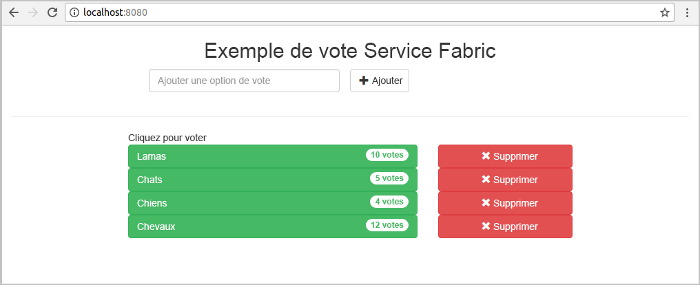
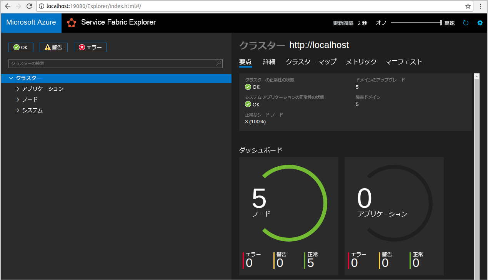
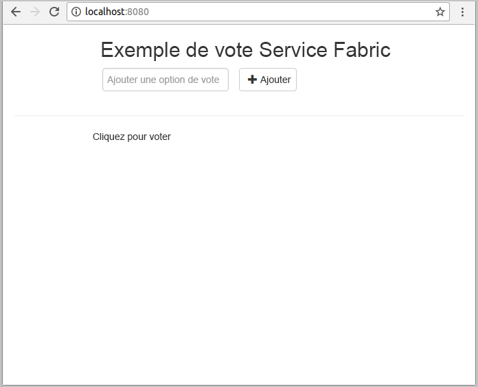
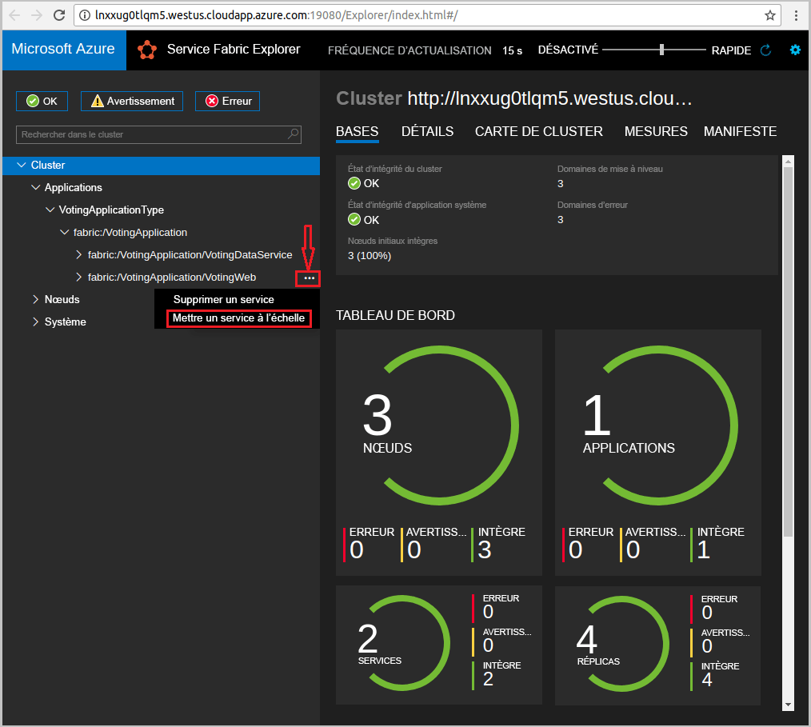
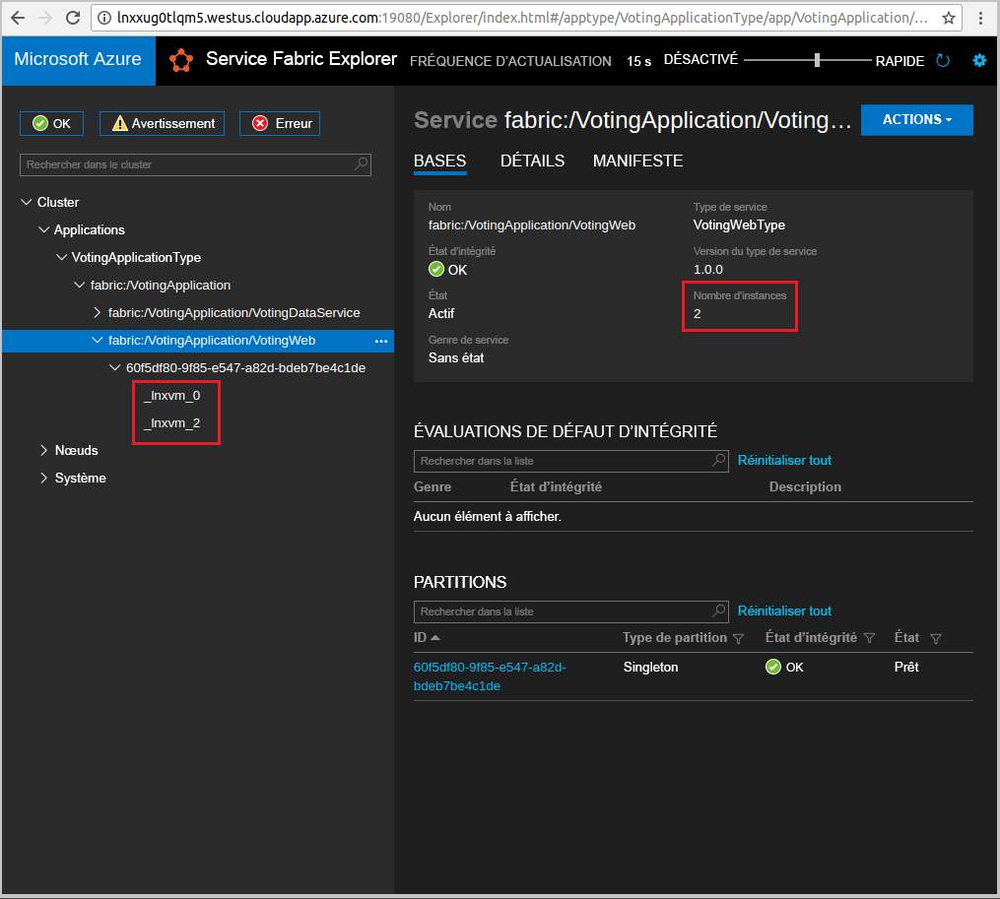

# <a name="create-a-java-application"></a>Créer une application Java
Azure Service Fabric est une plateforme de systèmes distribués pour le déploiement et la gestion de microservices et de conteneurs. 

Ce démarrage rapide montre comment déployer votre première application Java dans Service Fabric à l’aide de l’IDE Eclipse sur un ordinateur de développement Linux. Lorsque vous avez terminé, vous disposez d’une application de vote avec un frontend Java qui enregistre les résultats de vote dans un service backend avec état dans le cluster.



Dans ce guide de démarrage rapide, vous apprenez à :

> [!div class="checklist"]
> * Utiliser Eclipse comme outil pour vos applications Java Service Fabric
> * Déployer l’application dans le cluster local 
> * Déployer l’application sur un cluster dans Azure
> * Mettre à l’échelle avec une montée en puissance parallèle sur plusieurs nœuds

## <a name="prerequisites"></a>Composants requis
Pour effectuer ce démarrage rapide :
1. [Installez le SDK Service Fabric et l’interface CLI Service Fabric](https://docs.microsoft.com/azure/service-fabric/service-fabric-get-started-linux#installation-methods)
2. [Installez Git](https://git-scm.com/)
3. [Installez Eclipse](https://www.eclipse.org/downloads/)
4. [Configurez l’environnement Java](https://docs.microsoft.com/azure/service-fabric/service-fabric-get-started-linux#set-up-java-development), en suivant les étapes facultatives d’installation du plug-in Eclipse 

## <a name="download-the-sample"></a>Téléchargez l’exemple
Dans une fenêtre Commande, exécutez la commande suivante pour cloner le référentiel de l’exemple d’application sur votre ordinateur local.
```
git clone https://github.com/Azure-Samples/service-fabric-java-quickstart.git
```

## <a name="run-the-application-locally"></a>Exécution locale de l'application
1. Démarrez le cluster local en exécutant la commande suivante :

    ```bash
    sudo /opt/microsoft/sdk/servicefabric/common/clustersetup/devclustersetup.sh
    ```
    Le démarrage du cluster local prend un certain temps. Pour vérifier que le cluster est entièrement opérationnel, accédez à Service Fabric Explorer ici : **http://localhost:19080**. Les cinq nœuds sains indiquent que le cluster local est opérationnel. 
    
    

2. Ouvrez Eclipse.
3. Cliquez sur Fichier -> Ouvrir des projets à partir du système de fichiers... 
4. Cliquez sur Répertoire, puis sélectionnez le répertoire `Voting` dans le dossier `service-fabric-java-quickstart` que vous avez cloné à partir de Github. Cliquez sur Finish. 

    
    
5. Le projet `Voting` se trouve désormais dans l’Explorateur de package pour Eclipse. 
6. Cliquez avec le bouton droit sur le projet, puis sélectionnez **Publier l’application...** dans la liste déroulante **Service Fabric**. Choisissez **PublishProfiles/Local.json** comme profil cible, puis cliquez sur Publier. 

    
    
7. Ouvrez votre navigateur web par défaut, puis accédez à l’application ici : **http://localhost:8080**. 

    
    
Vous pouvez à présent ajouter un ensemble d’options de vote et commencer à enregistrer les votes. L’application s’exécute et stocke toutes les données dans votre cluster Service Fabric, sans recourir à une base de données séparée.

## <a name="deploy-the-application-to-azure"></a>Déploiement de l'application dans Azure

### <a name="set-up-your-azure-service-fabric-cluster"></a>Configurer un cluster Azure Service Fabric
Pour déployer l’application sur un cluster dans Azure, créez votre propre cluster ou utilisez celui d’un tiers.

Les clusters tiers sont des clusters Service Fabric gratuits, limités dans le temps et hébergés sur Azure. Ils sont gérés par l’équipe Service Fabric, au sein de laquelle chacun peut déployer des applications et en savoir plus sur la plateforme. Pour obtenir l’accès à un cluster tiers, [suivez ces instructions](http://aka.ms/tryservicefabric). 

Pour plus d’informations sur la création de votre propre cluster, consultez [Créer un cluster Service Fabric dans Azure](service-fabric-tutorial-create-vnet-and-linux-cluster.md).

> [!Note]
> Le service frontal web est configuré pour écouter le trafic entrant sur le port 8080. Assurez-vous que ce port est ouvert dans votre cluster. Si vous utilisez le cluster tiers, ce port est ouvert.
>

### <a name="deploy-the-application-using-eclipse"></a>Déployer l’application à l’aide d’Eclipse
Maintenant que l’application et votre cluster sont prêts, vous pouvez déployer l’application sur le cluster directement à partir d’Eclipse.

1. Ouvrez le fichier **Cloud.json** situé dans le répertoire **PublishProfiles**, puis renseignez les champs `ConnectionIPOrURL` et `ConnectionPort`. L’exemple suivant est fourni : 

    ```bash
    {
         "ClusterConnectionParameters": 
         {
            "ConnectionIPOrURL": "lnxxug0tlqm5.westus.cloudapp.azure.com",
            "ConnectionPort": "19080",
            "ClientKey": "",
            "ClientCert": ""
         }
    }
    ```

2. Cliquez avec le bouton droit sur le projet, puis sélectionnez **Publier l’application...** dans la liste déroulante **Service Fabric**. Choisissez **PublishProfiles/Cloud.json** comme profil cible, puis cliquez sur Publier. 

    

3. Ouvrez votre navigateur web par défaut, puis accédez à l’application ici : **http://\<ConnectionIPOrURL>:8080**. 

    
    
## <a name="scale-applications-and-services-in-a-cluster"></a>Mettre à l’échelle les applications et services dans un cluster
Les services peuvent facilement être mis à l’échelle dans un cluster pour prendre en compte une modification de la charge sur les services. Pour mettre à l’échelle un service, vous modifiez le nombre d’instances s’exécutant dans le cluster. Plusieurs méthodes sont disponibles pour mettre à l’échelle vos services. Vous pouvez utiliser des scripts ou des commandes de l’interface CLI de Service Fabric (sfctl). Dans cet exemple, nous utilisons Service Fabric Explorer.

Service Fabric Explorer s’exécute dans tous les clusters Service Fabric et est accessible à partir d’un navigateur, en accédant au port de gestion HTTP des clusters (19080), par exemple, `http://lnxxug0tlqm5.westus.cloudapp.azure.com:19080`.

Pour mettre à l’échelle le service frontal web, procédez comme suit :

1. Ouvrez Service Fabric Explorer dans votre cluster. Par exemple, `http://lnxxug0tlqm5.westus.cloudapp.azure.com:19080`.
2. Cliquez sur le bouton de sélection (points de suspension) à côté du nœud **fabric:/Voting/VotingWeb** dans l’arborescence, puis choisissez **Scale Service** (Mettre à l’échelle le service).

    

    Vous pouvez maintenant choisir de mettre à l’échelle le nombre d’instances du service frontal web.

3. Définissez le nombre sur **2**, puis cliquez sur **Scale Service** (Mettre à l’échelle le service).
4. Cliquez sur le nœud **fabric:/Voting/VotingWeb** dans l’arborescence, puis développez le nœud de la partition (représenté par un GUID).

    

    Vous pouvez maintenant voir que le service a deux instances et, dans l’arborescence, vous voyez les nœuds sur lesquels les instances s’exécutent.

Par cette tâche de gestion simple, nous avons doublé les ressources disponibles pour permettre à notre service frontal de traiter la charge utilisateur. Il est important de comprendre que vous n’avez pas besoin de plusieurs instances d’un service pour que celui-ci s’exécute de manière fiable. En cas de défaillance d’un service, Service Fabric veille à ce qu'une nouvelle instance du service s’exécute dans le cluster.

## <a name="next-steps"></a>Étapes suivantes
Dans ce démarrage rapide, vous avez appris comment :

> [!div class="checklist"]
> * Utiliser Eclipse comme outil pour vos applications Java Service Fabric
> * Déployer des applications Java sur votre cluster local 
> * Déployer des applications Java sur un cluster dans Azure
> * Mettre à l’échelle avec une montée en puissance parallèle sur plusieurs nœuds

* En savoir plus sur le [débogage des services dans Java à l’aide d’Eclipse](service-fabric-debugging-your-application-java.md)
* En savoir plus sur la [configuration de l’intégration et du déploiement continus à l’aide de Jenkins](service-fabric-cicd-your-linux-applications-with-jenkins.md)
* Consulter d’autres [exemples Java](https://github.com/Azure-Samples/service-fabric-java-getting-started)