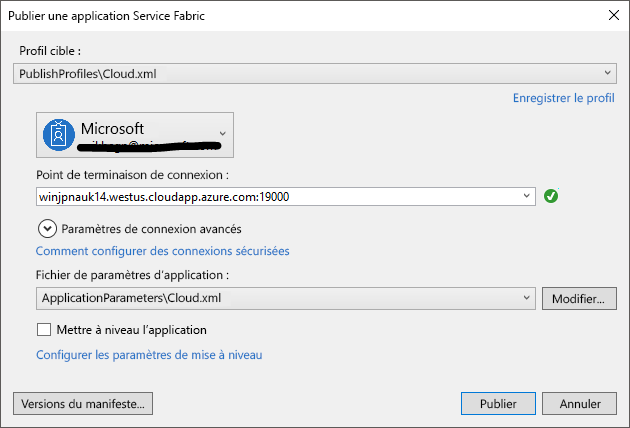

# <a name="deploy-an-application-to-a-party-cluster-in-azure"></a><span data-ttu-id="60251-103">Déployer une application sur un cluster tiers dans Azure</span><span class="sxs-lookup"><span data-stu-id="60251-103">Deploy an application to a Party Cluster in Azure</span></span>
<span data-ttu-id="60251-104">Deuxième d’une série, ce didacticiel vous montre comment déployer une application Azure Service Fabric sur un cluster tiers dans Azure.</span><span class="sxs-lookup"><span data-stu-id="60251-104">This tutorial is part two of a series and shows you how to deploy an Azure Service Fabric application to a Party Cluster in Azure.</span></span>

<span data-ttu-id="60251-105">Dans ce deuxième volet, vous apprenez à :</span><span class="sxs-lookup"><span data-stu-id="60251-105">In part two of the tutorial series, you learn how to:</span></span>
> [!div class="checklist"]
> * <span data-ttu-id="60251-106">Déployer une application sur un cluster distant à l’aide de Visual Studio</span><span class="sxs-lookup"><span data-stu-id="60251-106">Deploy an application to a remote cluster using Visual Studio</span></span>
> * <span data-ttu-id="60251-107">Supprimer une application d’un cluster à l’aide de Service Fabric Explorer</span><span class="sxs-lookup"><span data-stu-id="60251-107">Remove an application from a cluster using Service Fabric Explorer</span></span>

<span data-ttu-id="60251-108">Cette série de didacticiels vous montre comment effectuer les opérations suivantes :</span><span class="sxs-lookup"><span data-stu-id="60251-108">In this tutorial series you learn how to:</span></span>
> [!div class="checklist"]
> * [<span data-ttu-id="60251-109">Créer une application .NET Service Fabric</span><span class="sxs-lookup"><span data-stu-id="60251-109">Build a .NET Service Fabric application</span></span>](service-fabric-tutorial-create-dotnet-app.md)
> * <span data-ttu-id="60251-110">Déployer l’application sur un cluster distant</span><span class="sxs-lookup"><span data-stu-id="60251-110">Deploy the application to a remote cluster</span></span>
> * [<span data-ttu-id="60251-111">Configurer l’intégration et le déploiement continus à l’aide de Visual Studio Team Services</span><span class="sxs-lookup"><span data-stu-id="60251-111">Configure CI/CD using Visual Studio Team Services</span></span>](service-fabric-tutorial-deploy-app-with-cicd-vsts.md)

## <a name="prerequisites"></a><span data-ttu-id="60251-112">Composants requis</span><span class="sxs-lookup"><span data-stu-id="60251-112">Prerequisites</span></span>
<span data-ttu-id="60251-113">Avant de commencer ce didacticiel :</span><span class="sxs-lookup"><span data-stu-id="60251-113">Before you begin this tutorial:</span></span>
- <span data-ttu-id="60251-114">Si vous n’avez pas d’abonnement Azure, créez un [compte gratuit](https://azure.microsoft.com/free/?WT.mc_id=A261C142F).</span><span class="sxs-lookup"><span data-stu-id="60251-114">If you don't have an Azure subscription, create a [free account](https://azure.microsoft.com/free/?WT.mc_id=A261C142F)</span></span>
- <span data-ttu-id="60251-115">[Installez Visual Studio 2017](https://www.visualstudio.com/) et les charges de travail **Développement Azure** et **Développement web et ASP.NET**.</span><span class="sxs-lookup"><span data-stu-id="60251-115">[Install Visual Studio 2017](https://www.visualstudio.com/) and install the **Azure development** and **ASP.NET and web development** workloads.</span></span>
- <span data-ttu-id="60251-116">[Installez le Kit de développement logiciel (SDK) Service Fabric](service-fabric-get-started.md).</span><span class="sxs-lookup"><span data-stu-id="60251-116">[Install the Service Fabric SDK](service-fabric-get-started.md)</span></span>

## <a name="download-the-voting-sample-application"></a><span data-ttu-id="60251-117">Télécharger l’exemple d’application de vote</span><span class="sxs-lookup"><span data-stu-id="60251-117">Download the Voting sample application</span></span>
<span data-ttu-id="60251-118">Si vous n’avez pas généré l’exemple d’application de vote lors de la [première partie de cette série de didacticiels](service-fabric-tutorial-create-dotnet-app.md), vous pouvez le télécharger.</span><span class="sxs-lookup"><span data-stu-id="60251-118">If you did not build the Voting sample application in [part one of this tutorial series](service-fabric-tutorial-create-dotnet-app.md), you can download it.</span></span> <span data-ttu-id="60251-119">Dans une fenêtre Commande, exécutez la commande suivante pour cloner le référentiel de l’exemple d’application sur votre ordinateur local.</span><span class="sxs-lookup"><span data-stu-id="60251-119">In a command window, run the following command to clone the sample app repository to your local machine.</span></span>

```
git clone https://github.com/Azure-Samples/service-fabric-dotnet-quickstart
```

## <a name="set-up-a-party-cluster"></a><span data-ttu-id="60251-120">Configurer un cluster tiers</span><span class="sxs-lookup"><span data-stu-id="60251-120">Set up a Party Cluster</span></span>
<span data-ttu-id="60251-121">Les clusters tiers sont des clusters Service Fabric gratuits et limités dans le temps. Ils sont hébergés sur Azure et exécutés par l’équipe Service Fabric, dont tous les membres peuvent déployer des applications et en savoir plus sur la plateforme</span><span class="sxs-lookup"><span data-stu-id="60251-121">Party clusters are free, limited-time Service Fabric clusters hosted on Azure and run by the Service Fabric team where anyone can deploy applications and learn about the platform.</span></span> <span data-ttu-id="60251-122">gratuitement.</span><span class="sxs-lookup"><span data-stu-id="60251-122">For free!</span></span>

<span data-ttu-id="60251-123">Pour accéder à un cluster tiers, rendez-vous sur le site http://aka.ms/tryservicefabric et suivez les instructions.</span><span class="sxs-lookup"><span data-stu-id="60251-123">To get access to a Party Cluster, browse to this site: http://aka.ms/tryservicefabric and follow the instructions to get access to a cluster.</span></span> <span data-ttu-id="60251-124">Vous avez besoin d’un compte Facebook ou GitHub pour accéder à un cluster tiers.</span><span class="sxs-lookup"><span data-stu-id="60251-124">You need a Facebook or GitHub account to get access to a Party Cluster.</span></span>

> [!NOTE]
> <span data-ttu-id="60251-125">Les clusters tiers ne sont pas sécurisés. Vos applications et toutes les données que vous y placez sont donc visibles par d’autres personnes.</span><span class="sxs-lookup"><span data-stu-id="60251-125">Party clusters are not secured, so your applications and any data you put in them may be visible to others.</span></span> <span data-ttu-id="60251-126">Ne déployez aucun élément que vous souhaitez cacher aux autres utilisateurs.</span><span class="sxs-lookup"><span data-stu-id="60251-126">Don't deploy anything you don't want others to see.</span></span> <span data-ttu-id="60251-127">Veillez à lire les conditions d’utilisation pour plus d’informations.</span><span class="sxs-lookup"><span data-stu-id="60251-127">Be sure to read over our Terms of Use for all the details.</span></span>

## <a name="configure-the-listening-port"></a><span data-ttu-id="60251-128">Configurer le port d’écoute</span><span class="sxs-lookup"><span data-stu-id="60251-128">Configure the listening port</span></span>
<span data-ttu-id="60251-129">Lorsque le service frontal VotingWeb est créé, Visual Studio sélectionne de manière aléatoire le port d’écoute du service.</span><span class="sxs-lookup"><span data-stu-id="60251-129">When the VotingWeb front-end service is created, Visual Studio randomly selects a port for the service to listen on.</span></span>  <span data-ttu-id="60251-130">Le service VotingWeb joue le rôle de serveur frontal de cette application et accepte le trafic externe. Associez ce service à un port fixe et connu.</span><span class="sxs-lookup"><span data-stu-id="60251-130">The VotingWeb service acts as the front-end for this application and accepts external traffic, so let's bind that service to a fixed and well-know port.</span></span> <span data-ttu-id="60251-131">Dans l’Explorateur de solutions, ouvrez *VotingWeb/PackageRoot/ServiceManifest.xml*.</span><span class="sxs-lookup"><span data-stu-id="60251-131">In Solution Explorer, open  *VotingWeb/PackageRoot/ServiceManifest.xml*.</span></span>  <span data-ttu-id="60251-132">Recherchez la ressource **Endpoint** dans la section **Resources**, puis remplacez la valeur du **port** par 80.</span><span class="sxs-lookup"><span data-stu-id="60251-132">Find the **Endpoint** resource in the **Resources** section and change the **Port** value to 80.</span></span>

```xml
<Resources>
    <Endpoints>
      <!-- This endpoint is used by the communication listener to obtain the port on which to 
           listen. Please note that if your service is partitioned, this port is shared with 
           replicas of different partitions that are placed in your code. -->
      <Endpoint Protocol="http" Name="ServiceEndpoint" Type="Input" Port="80" />
    </Endpoints>
  </Resources>
```

<span data-ttu-id="60251-133">Mettez également à jour la valeur de la propriété d’URL d’application dans le projet Voting, afin qu’un navigateur web s’ouvre sur le port adéquat lorsque vous effectuez le débogage en appuyant sur F5.</span><span class="sxs-lookup"><span data-stu-id="60251-133">Also update the Application URL property value in the Voting project so a web browser opens to the correct port when you debug using 'F5'.</span></span>  <span data-ttu-id="60251-134">Dans l’Explorateur de solutions, sélectionnez le projet **Voting** et mettez à jour la propriété **URL de l’application**.</span><span class="sxs-lookup"><span data-stu-id="60251-134">In Solution Explorer, select the **Voting** project and update the **Application URL** property.</span></span>


## <a name="deploy-the-app-to-the-azure"></a><span data-ttu-id="60251-136">Déployer l’application dans Azure</span><span class="sxs-lookup"><span data-stu-id="60251-136">Deploy the app to the Azure</span></span>
<span data-ttu-id="60251-137">Maintenant que l’application est prête, vous pouvez la déployer sur le cluster tiers directement à partir de Visual Studio.</span><span class="sxs-lookup"><span data-stu-id="60251-137">Now that the application is ready, you can deploy it to the Party Cluster direct from Visual Studio.</span></span>

1. <span data-ttu-id="60251-138">Dans l’Explorateur de solutions, cliquez avec le bouton droit sur **Voting**, puis choisissez **Publier**.</span><span class="sxs-lookup"><span data-stu-id="60251-138">Right-click **Voting** in the Solution Explorer and choose **Publish**.</span></span>

    

2. <span data-ttu-id="60251-140">Saisissez le point de terminaison de connexion du cluster tiers dans le champ **Point de terminaison de connexion** et cliquez sur **Publier**.</span><span class="sxs-lookup"><span data-stu-id="60251-140">Type in the Connection Endpoint of the Party Cluster in the **Connection Endpoint** field and click **Publish**.</span></span>

    <span data-ttu-id="60251-141">Une fois la publication terminée, vous devez être en mesure d’envoyer une demande à l’application via un navigateur.</span><span class="sxs-lookup"><span data-stu-id="60251-141">Once the publish has finished, you should be able to send a request to the application via a browser.</span></span>

3. <span data-ttu-id="60251-142">Ouvrez le navigateur de votre choix et saisissez l’adresse du cluster (le point de terminaison de connexion sans les informations de port ; par exemple, win1kw5649s.westus.cloudapp.azure.com).</span><span class="sxs-lookup"><span data-stu-id="60251-142">Open you preferred browser and type in the cluster address (the connection endpoint without the port information - for example, win1kw5649s.westus.cloudapp.azure.com).</span></span>

    <span data-ttu-id="60251-143">Vous devez maintenant obtenir le même résultat que lors de l’exécution de l’application en local.</span><span class="sxs-lookup"><span data-stu-id="60251-143">You should now see the same result as you saw when running the application locally.</span></span>

    

## <a name="remove-the-application-from-a-cluster-using-service-fabric-explorer"></a><span data-ttu-id="60251-145">Supprimer l’application d’un cluster à l’aide de Service Fabric Explorer</span><span class="sxs-lookup"><span data-stu-id="60251-145">Remove the application from a cluster using Service Fabric Explorer</span></span>
<span data-ttu-id="60251-146">Service Fabric Explorer est une interface utilisateur graphique qui permet d’explorer et de gérer des applications dans un cluster Service Fabric.</span><span class="sxs-lookup"><span data-stu-id="60251-146">Service Fabric Explorer is a graphical user interface to explore and manage applications in a Service Fabric cluster.</span></span>

<span data-ttu-id="60251-147">Pour supprimer l’application du cluster tiers :</span><span class="sxs-lookup"><span data-stu-id="60251-147">To remove the application from the Party Cluster:</span></span>

1. <span data-ttu-id="60251-148">Accédez à Service Fabric Explorer à l’aide du lien fourni sur la page d’inscription du cluster tiers.</span><span class="sxs-lookup"><span data-stu-id="60251-148">Browse to the Service Fabric Explorer, using the link provided by the Party Cluster sign-up page.</span></span> <span data-ttu-id="60251-149">Par exemple, http://win1kw5649s.westus.cloudapp.azure.com:19080/Explorer/index.html.</span><span class="sxs-lookup"><span data-stu-id="60251-149">For example, http://win1kw5649s.westus.cloudapp.azure.com:19080/Explorer/index.html.</span></span>

2. <span data-ttu-id="60251-150">Dans Service Fabric Explorer, accédez au nœud **fabric://Voting**, dans l’arborescence figurant sur le côté gauche.</span><span class="sxs-lookup"><span data-stu-id="60251-150">In Service Fabric Explorer, navigate to the **fabric://Voting** node in the treeview on the left-hand side.</span></span>

3. <span data-ttu-id="60251-151">Cliquez sur le bouton **Action** dans le volet **Essentials** à droite, puis choisissez **Supprimer l’application**.</span><span class="sxs-lookup"><span data-stu-id="60251-151">Click the **Action** button in the right-hand **Essentials** pane, and choose **Delete Application**.</span></span> <span data-ttu-id="60251-152">Confirmez la suppression de l’instance d’application, ce qui supprime l’instance de notre application en cours d’exécution dans le cluster.</span><span class="sxs-lookup"><span data-stu-id="60251-152">Confirm deleting the application instance, which removes the instance of our application running in the cluster.</span></span>


## <a name="remove-the-application-type-from-a-cluster-using-service-fabric-explorer"></a><span data-ttu-id="60251-154">Supprimer le type d’application d’un cluster à l’aide de Service Fabric Explorer</span><span class="sxs-lookup"><span data-stu-id="60251-154">Remove the application type from a cluster using Service Fabric Explorer</span></span>
<span data-ttu-id="60251-155">Les applications sont déployées en tant que types d’applications dans un cluster Service Fabric, ce qui vous permet d’avoir plusieurs instances et versions de l’application en cours d’exécution au sein du cluster.</span><span class="sxs-lookup"><span data-stu-id="60251-155">Applications are deployed as application types in a Service Fabric cluster, which enables you to have multiple instances and versions of the application running within the cluster.</span></span> <span data-ttu-id="60251-156">Après avoir supprimé l’instance en cours d’exécution de notre application, nous pouvons également supprimer le type pour nettoyer le déploiement.</span><span class="sxs-lookup"><span data-stu-id="60251-156">After having removed the running instance of our application, we can also remove the type, to complete the cleanup of the deployment.</span></span>

<span data-ttu-id="60251-157">Pour plus d’informations sur le modèle d’application dans Service Fabric, consultez [Modéliser une application dans Service Fabric](service-fabric-application-model.md).</span><span class="sxs-lookup"><span data-stu-id="60251-157">For more information about the application model in Service Fabric, see [Model an application in Service Fabric](service-fabric-application-model.md).</span></span>

1. <span data-ttu-id="60251-158">Accédez au nœud **VotingType** dans l’arborescence.</span><span class="sxs-lookup"><span data-stu-id="60251-158">Navigate to the **VotingType** node in the treeview.</span></span>

2. <span data-ttu-id="60251-159">Cliquez sur le bouton **Action** dans le volet **Essentials** à droite, puis choisissez **Unprovision Type** (Annuler la mise en service du type).</span><span class="sxs-lookup"><span data-stu-id="60251-159">Click the **Action** button in the right-hand **Essentials** pane, and choose **Unprovision Type**.</span></span> <span data-ttu-id="60251-160">Confirmez l’annulation de la mise en service du type d’application.</span><span class="sxs-lookup"><span data-stu-id="60251-160">Confirm unprovisioning the application type.</span></span>


<span data-ttu-id="60251-162">Cela conclut le didacticiel.</span><span class="sxs-lookup"><span data-stu-id="60251-162">This concludes the tutorial.</span></span>

## <a name="next-steps"></a><span data-ttu-id="60251-163">Étapes suivantes</span><span class="sxs-lookup"><span data-stu-id="60251-163">Next steps</span></span>
<span data-ttu-id="60251-164">Dans ce didacticiel, vous avez appris à :</span><span class="sxs-lookup"><span data-stu-id="60251-164">In this tutorial, you learned how to:</span></span>

> [!div class="checklist"]
> * <span data-ttu-id="60251-165">Déployer une application sur un cluster distant à l’aide de Visual Studio</span><span class="sxs-lookup"><span data-stu-id="60251-165">Deploy an application to a remote cluster using Visual Studio</span></span>
> * <span data-ttu-id="60251-166">Supprimer une application d’un cluster à l’aide de Service Fabric Explorer</span><span class="sxs-lookup"><span data-stu-id="60251-166">Remove an application from a cluster using Service Fabric Explorer</span></span>

<span data-ttu-id="60251-167">Passez au didacticiel suivant :</span><span class="sxs-lookup"><span data-stu-id="60251-167">Advance to the next tutorial:</span></span>
> [!div class="nextstepaction"]
> [<span data-ttu-id="60251-168">Configurer l’intégration continue avec Visual Studio Team Services</span><span class="sxs-lookup"><span data-stu-id="60251-168">Set up continuous integration using Visual Studio Team Services</span></span>](service-fabric-tutorial-deploy-app-with-cicd-vsts.md)