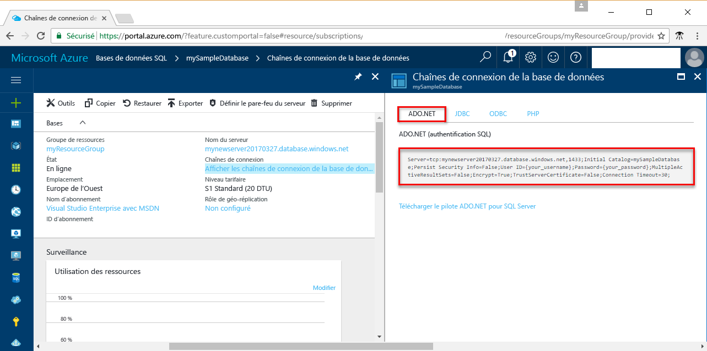

# <a name="use-net-c-with-visual-studio-tooconnect-and-query-an-azure-sql-database"></a>Utiliser .NET (c#) avec Visual Studio tooconnect et interroger une base de données SQL Azure

Ce didacticiel de démarrage rapide montre comment toouse hello [.NET framework](https://www.microsoft.com/net/) toocreate c# programmer avec la base de données SQL Azure de Visual Studio tooconnect tooan et utiliser des données de tooquery d’instructions Transact-SQL.

## <a name="prerequisites"></a>Composants requis

toocomplete rapide de ce didacticiel de démarrage, assurez-vous que vous avez hello suivantes :

- base de données SQL Azure. Ce démarrage rapide utilise des ressources hello créés dans une de ces Démarrages rapides : 

   - [Créer une base de données - Portail](sql-database-get-started-portal.md)
   - [Créer une base de données - CLI](sql-database-get-started-cli.md)
   - [Créer une base de données - PowerShell](sql-database-get-started-powershell.md)

- A [règle de pare-feu de niveau serveur](sql-database-get-started-portal.md#create-a-server-level-firewall-rule) pour l’adresse IP publique de hello d’ordinateur de hello que vous utilisez pour ce didacticiel de démarrage rapide.
- Une installation de [Visual Studio Community 2017, Visual Studio Professional 2017 ou Visual Studio Enterprise 2017](https://www.visualstudio.com/downloads/).

## <a name="sql-server-connection-information"></a>Informations de connexion SQL Server

Obtenir hello connexion informations nécessaires tooconnect toohello Azure SQL database. Vous devez le nom du serveur complet hello, nom de la base de données et les informations de connexion dans les procédures suivantes hello.

1. Connectez-vous à toohello [portail Azure](https://portal.azure.com/).
2. Sélectionnez **bases de données SQL** hello menu de gauche, cliquez sur votre base de données sur hello **bases de données SQL** page. 
3. Sur hello **vue d’ensemble** page de votre base de données, révision hello serveur nom complet comme dans hello suivant l’image. Vous pouvez pointer sur toobring de nom de serveur hello des hello **cliquez sur toocopy** option. 

    

4. Si vous oubliez vos informations de connexion de serveur de base de données SQL Azure, accédez à nom d’administrateur serveur page tooview hello toohello base de données SQL server. Vous pouvez réinitialiser le mot de passe hello si nécessaire.

5. Cliquez sur **Afficher les chaînes de connexion de la base de données**.

6. Hello révision complète **ADO.NET** chaîne de connexion.

    

> [!IMPORTANT]
> Vous devez disposer d’une règle de pare-feu en place pour hello IP adresse publique de hello ordinateur sur lequel vous effectuez ce didacticiel. Si vous se trouvent sur un autre ordinateur ou que vous avez une autre adresse IP publique, créez un [règle de pare-feu de niveau serveur à l’aide de hello Azure portal](sql-database-get-started-portal.md#create-a-server-level-firewall-rule). 
>
  
## <a name="create-a-new-visual-studio-project"></a>Création d’un nouveau projet Visual Studio

1. Dans Visual Studio, sélectionnez **Fichier**, **Nouveau**, **Projet**. 
2. Bonjour **nouveau projet** boîte de dialogue, développez **Visual C#**.
3. Sélectionnez **application Console** et entrez *sqltest* du nom de projet hello.
4. Cliquez sur **OK** toocreate et hello ouvrir un nouveau projet dans Visual Studio
4. Dans l’Explorateur de solutions, cliquez avec le bouton droit sur **sqltest**, puis cliquez sur **Gérer les packages NuGet**. 
5. Sur hello **Parcourir**, recherchez ```System.Data.SqlClient``` et quand trouvé, sélectionnez-le.
6. Bonjour **System.Data.SqlClient** , cliquez sur **installer**.
7. Hello installation terminée, passez en revue les modifications de hello, puis cliquez sur **OK** tooclose hello **aperçu** fenêtre. 
8. Si une fenêtre **Acceptation de la licence**, cliquez sur **J’accepte**.

## <a name="insert-code-tooquery-sql-database"></a>Insérer la base de données SQL de code tooquery
1. Basculer trop (ou ouvrez le cas échéant) **Program.cs**

2. Remplacez le contenu hello de **Program.cs** avec hello suivante de code et ajoutez hello les valeurs appropriées pour votre serveur, une base de données, un utilisateur et un mot de passe.

```csharp
using System;
using System.Data.SqlClient;
using System.Text;

namespace sqltest
{
    class Program
    {
        static void Main(string[] args)
        {
            try 
            { 
                SqlConnectionStringBuilder builder = new SqlConnectionStringBuilder();
                builder.DataSource = "your_server.database.windows.net"; 
                builder.UserID = "your_user";            
                builder.Password = "your_password";     
                builder.InitialCatalog = "your_database";

                using (SqlConnection connection = new SqlConnection(builder.ConnectionString))
                {
                    Console.WriteLine("\nQuery data example:");
                    Console.WriteLine("=========================================\n");
                    
                    connection.Open();       
                    StringBuilder sb = new StringBuilder();
                    sb.Append("SELECT TOP 20 pc.Name as CategoryName, p.name as ProductName ");
                    sb.Append("FROM [SalesLT].[ProductCategory] pc ");
                    sb.Append("JOIN [SalesLT].[Product] p ");
                    sb.Append("ON pc.productcategoryid = p.productcategoryid;");
                    String sql = sb.ToString();

                    using (SqlCommand command = new SqlCommand(sql, connection))
                    {
                        using (SqlDataReader reader = command.ExecuteReader())
                        {
                            while (reader.Read())
                            {
                                Console.WriteLine("{0} {1}", reader.GetString(0), reader.GetString(1));
                            }
                        }
                    }                    
                }
            }
            catch (SqlException e)
            {
                Console.WriteLine(e.ToString());
            }
            Console.ReadLine();
        }
    }
}
```

## <a name="run-hello-code"></a>Exécuter le code de hello

1. Appuyez sur **F5** application hello de toorun.
2. Vérifiez que hello supérieur des 20 lignes sont retournées, puis fermez la fenêtre de l’application hello.

## <a name="next-steps"></a>Étapes suivantes

- Découvrez comment trop[connecter et interroger une base de données SQL Azure à l’aide de .NET core](sql-database-connect-query-dotnet-core.md) sur Linux/Windows/macOS.  
- En savoir plus sur [prise en main de .NET Core sur Windows/Linux/macOS à l’aide de la ligne de commande hello](/dotnet/core/tutorials/using-with-xplat-cli).
- Découvrez comment trop[concevoir votre première base de données SQL Azure à l’aide de SSMS](sql-database-design-first-database.md) ou [concevoir votre première base de données SQL Azure à l’aide de .NET](sql-database-design-first-database-csharp.md).
- Pour plus d’informations sur .NET, consultez la [documentation .NET](https://docs.microsoft.com/dotnet/).
