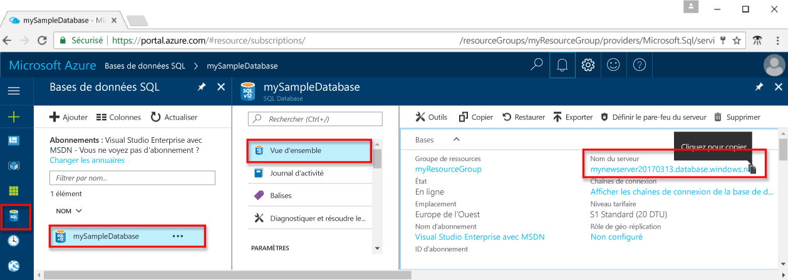

# <a name="use-python-to-query-an-azure-sql-database"></a><span data-ttu-id="3f52a-103">Utilisation de Python pour interroger une base de données SQL Azure</span><span class="sxs-lookup"><span data-stu-id="3f52a-103">Use Python to query an Azure SQL database</span></span>

 <span data-ttu-id="3f52a-104">Ce didacticiel de démarrage rapide indique comment utiliser [Python](https://python.org) pour se connecter à une base de données SQL Azure et utiliser des instructions Transact-SQL pour interroger des données.</span><span class="sxs-lookup"><span data-stu-id="3f52a-104">This quick start demonstrates how to use [Python](https://python.org) to connect to an Azure SQL database and use Transact-SQL statements to query data.</span></span>

## <a name="prerequisites"></a><span data-ttu-id="3f52a-105">Composants requis</span><span class="sxs-lookup"><span data-stu-id="3f52a-105">Prerequisites</span></span>

<span data-ttu-id="3f52a-106">Pour suivre ce didacticiel de démarrage rapide, vérifiez que vous disposez des éléments suivants :</span><span class="sxs-lookup"><span data-stu-id="3f52a-106">To complete this quick start tutorial, make sure you have the following:</span></span>

- <span data-ttu-id="3f52a-107">base de données SQL Azure.</span><span class="sxs-lookup"><span data-stu-id="3f52a-107">An Azure SQL database.</span></span> <span data-ttu-id="3f52a-108">Ce guide de démarrage rapide utilise les ressources créées dans l’une de ces instructions de démarrage rapide :</span><span class="sxs-lookup"><span data-stu-id="3f52a-108">This quick start uses the resources created in one of these quick starts:</span></span> 

   - [<span data-ttu-id="3f52a-109">Créer une base de données - Portail</span><span class="sxs-lookup"><span data-stu-id="3f52a-109">Create DB - Portal</span></span>](sql-database-get-started-portal.md)
   - [<span data-ttu-id="3f52a-110">Créer une base de données - CLI</span><span class="sxs-lookup"><span data-stu-id="3f52a-110">Create DB - CLI</span></span>](sql-database-get-started-cli.md)
   - [<span data-ttu-id="3f52a-111">Créer une base de données - PowerShell</span><span class="sxs-lookup"><span data-stu-id="3f52a-111">Create DB - PowerShell</span></span>](sql-database-get-started-powershell.md)

- <span data-ttu-id="3f52a-112">Une [règle de pare-feu au niveau du serveur](sql-database-get-started-portal.md#create-a-server-level-firewall-rule) pour l’adresse IP publique de l’ordinateur que vous utilisez pour ce didacticiel de démarrage rapide.</span><span class="sxs-lookup"><span data-stu-id="3f52a-112">A [server-level firewall rule](sql-database-get-started-portal.md#create-a-server-level-firewall-rule) for the public IP address of the computer you use for this quick start tutorial.</span></span>

- <span data-ttu-id="3f52a-113">Vous avez installé Python et les logiciels connexes pour votre système d’exploitation.</span><span class="sxs-lookup"><span data-stu-id="3f52a-113">You have installed Python and related software for your operating system.</span></span>

    - <span data-ttu-id="3f52a-114">**MacOS** : installez Homebrew et Python, installez le pilote ODBC et SQLCMD, puis installez le pilote Python pour SQL Server.</span><span class="sxs-lookup"><span data-stu-id="3f52a-114">**MacOS**: Install Homebrew and Python, install the ODBC driver and SQLCMD, and then install the Python Driver for SQL Server.</span></span> <span data-ttu-id="3f52a-115">Consultez les [étapes 1.2, 1.3 et 2.1](https://www.microsoft.com/sql-server/developer-get-started/python/mac/).</span><span class="sxs-lookup"><span data-stu-id="3f52a-115">See [Steps 1.2, 1.3, and 2.1](https://www.microsoft.com/sql-server/developer-get-started/python/mac/).</span></span>
    - <span data-ttu-id="3f52a-116">**Ubuntu** : installez Python et les autres packages requis, puis installez le pilote Python pour SQL Server.</span><span class="sxs-lookup"><span data-stu-id="3f52a-116">**Ubuntu**:  Install Python and other required packages, and then install the Python Driver for SQL Server.</span></span> <span data-ttu-id="3f52a-117">Consultez les [étapes 1.2, 1.3 et 2.1](https://www.microsoft.com/sql-server/developer-get-started/python/ubuntu/).</span><span class="sxs-lookup"><span data-stu-id="3f52a-117">See [Steps 1.2, 1.3, and 2.1](https://www.microsoft.com/sql-server/developer-get-started/python/ubuntu/).</span></span>
    - <span data-ttu-id="3f52a-118">**Windows** : installez la version la plus récente de Python (la variable d’environnement est désormais configurée pour vous), installez le pilote ODBC et SQLCMD, puis installez le pilote Python pour SQL Server.</span><span class="sxs-lookup"><span data-stu-id="3f52a-118">**Windows**: Install the newest version of Python (environment variable is now configured for you), install the ODBC driver and SQLCMD, and then install the Python Driver for SQL Server.</span></span> <span data-ttu-id="3f52a-119">Consultez les [étapes 1.2, 1.3 et 2.1](https://www.microsoft.com/sql-server/developer-get-started/python/windows/).</span><span class="sxs-lookup"><span data-stu-id="3f52a-119">See [Step 1.2, 1.3, and 2.1](https://www.microsoft.com/sql-server/developer-get-started/python/windows/).</span></span> 

## <a name="sql-server-connection-information"></a><span data-ttu-id="3f52a-120">Informations de connexion SQL Server</span><span class="sxs-lookup"><span data-stu-id="3f52a-120">SQL server connection information</span></span>

<span data-ttu-id="3f52a-121">Obtenez les informations de connexion requises pour la connexion à la base de données SQL Azure.</span><span class="sxs-lookup"><span data-stu-id="3f52a-121">Get the connection information needed to connect to the Azure SQL database.</span></span> <span data-ttu-id="3f52a-122">Vous aurez besoin du nom du serveur complet, du nom de la base de données et des informations de connexion dans les procédures suivantes.</span><span class="sxs-lookup"><span data-stu-id="3f52a-122">You will need the fully qualified server name, database name, and login information in the next procedures.</span></span>

1. <span data-ttu-id="3f52a-123">Connectez-vous au [portail Azure](https://portal.azure.com/).</span><span class="sxs-lookup"><span data-stu-id="3f52a-123">Log in to the [Azure portal](https://portal.azure.com/).</span></span>
2. <span data-ttu-id="3f52a-124">Sélectionnez **Bases de données SQL** dans le menu de gauche, puis cliquez sur votre base de données dans la page **Bases de données SQL**.</span><span class="sxs-lookup"><span data-stu-id="3f52a-124">Select **SQL Databases** from the left-hand menu, and click your database on the **SQL databases** page.</span></span> 
3. <span data-ttu-id="3f52a-125">Sur la page **Vue d’ensemble** de votre base de données, vérifiez le nom complet du serveur, comme indiqué dans l’image suivante.</span><span class="sxs-lookup"><span data-stu-id="3f52a-125">On the **Overview** page for your database, review the fully qualified server name as shown in the following image.</span></span> <span data-ttu-id="3f52a-126">Vous pouvez pointer sur le nom du serveur pour afficher l’option **Cliquez pour copier**.</span><span class="sxs-lookup"><span data-stu-id="3f52a-126">You can hover over the server name to bring up the **Click to copy** option.</span></span>  

    

4. <span data-ttu-id="3f52a-128">Si vous avez oublié vos informations de connexion au serveur, accédez à la page du serveur SQL Database pour afficher le nom de l’administrateur du serveur et, si nécessaire, réinitialiser le mot de passe.</span><span class="sxs-lookup"><span data-stu-id="3f52a-128">If you forget your server login information, navigate to the SQL Database server page to view the server admin name and, if necessary, reset the password.</span></span>     
    
## <a name="insert-code-to-query-sql-database"></a><span data-ttu-id="3f52a-129">Insertion du code pour interroger la base de données SQL</span><span class="sxs-lookup"><span data-stu-id="3f52a-129">Insert code to query SQL database</span></span> 

1. <span data-ttu-id="3f52a-130">Dans votre éditeur de texte favori, créez un nouveau fichier nommé **sqltest.py**.</span><span class="sxs-lookup"><span data-stu-id="3f52a-130">In your favorite text editor, create a new file, **sqltest.py**.</span></span>  

2. <span data-ttu-id="3f52a-131">Remplacez le contenu par le code suivant et ajoutez les valeurs appropriées pour votre serveur, base de données, utilisateur et mot de passe.</span><span class="sxs-lookup"><span data-stu-id="3f52a-131">Replace the contents with the following code and add the appropriate values for your server, database, user, and password.</span></span>

```Python
import pyodbc
server = 'your_server.database.windows.net'
database = 'your_database'
username = 'your_username'
password = 'your_password'
driver= '{ODBC Driver 13 for SQL Server}'
cnxn = pyodbc.connect('DRIVER='+driver+';PORT=1433;SERVER='+server+';PORT=1443;DATABASE='+database+';UID='+username+';PWD='+ password)
cursor = cnxn.cursor()
cursor.execute("SELECT TOP 20 pc.Name as CategoryName, p.name as ProductName FROM [SalesLT].[ProductCategory] pc JOIN [SalesLT].[Product] p ON pc.productcategoryid = p.productcategoryid")
row = cursor.fetchone()
while row:
    print (str(row[0]) + " " + str(row[1]))
    row = cursor.fetchone()
```

## <a name="run-the-code"></a><span data-ttu-id="3f52a-132">Exécution du code</span><span class="sxs-lookup"><span data-stu-id="3f52a-132">Run the code</span></span>

1. <span data-ttu-id="3f52a-133">Exécutez ensuite les commandes suivantes dans l’invite de commandes :</span><span class="sxs-lookup"><span data-stu-id="3f52a-133">At the command prompt, run the following commands:</span></span>

   ```Python
   python sqltest.py
   ```

2. <span data-ttu-id="3f52a-134">Vérifiez que les 20 premières lignes sont renvoyées, puis fermez la fenêtre d’application.</span><span class="sxs-lookup"><span data-stu-id="3f52a-134">Verify that the top 20 rows are returned and then close the application window.</span></span>

## <a name="next-steps"></a><span data-ttu-id="3f52a-135">Étapes suivantes</span><span class="sxs-lookup"><span data-stu-id="3f52a-135">Next steps</span></span>

- [<span data-ttu-id="3f52a-136">Concevoir votre première base de données SQL Azure</span><span class="sxs-lookup"><span data-stu-id="3f52a-136">Design your first Azure SQL database</span></span>](sql-database-design-first-database.md)
- <span data-ttu-id="3f52a-137">[Python SQL Driver](https://docs.microsoft.com/sql/connect/python/python-driver-for-sql-server/) (Pilote SQL Python)</span><span class="sxs-lookup"><span data-stu-id="3f52a-137">[Microsoft Python Drivers for SQL Server](https://docs.microsoft.com/sql/connect/python/python-driver-for-sql-server/)</span></span>
- [<span data-ttu-id="3f52a-138">Centre de développement Python</span><span class="sxs-lookup"><span data-stu-id="3f52a-138">Python Developer Center</span></span>](https://azure.microsoft.com/develop/python/?v=17.23h)

