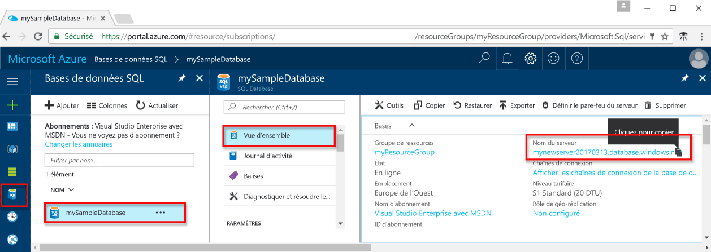

# <a name="use-ruby-to-query-an-azure-sql-database"></a><span data-ttu-id="db640-103">Utilisation de Ruby pour interroger une base de données SQL Azure</span><span class="sxs-lookup"><span data-stu-id="db640-103">Use Ruby to query an Azure SQL database</span></span>

<span data-ttu-id="db640-104">Ce didacticiel de démarrage rapide indique comment utiliser [Ruby](https://www.ruby-lang.org) pour créer un programme qui se connecte à une base de données SQL Azure et utiliser des instructions Transact-SQL pour interroger des données.</span><span class="sxs-lookup"><span data-stu-id="db640-104">This quick start tutorial demonstrates how to use [Ruby](https://www.ruby-lang.org) to create a program to connect to an Azure SQL database and use Transact-SQL statements to query data.</span></span>

## <a name="prerequisites"></a><span data-ttu-id="db640-105">Composants requis</span><span class="sxs-lookup"><span data-stu-id="db640-105">Prerequisites</span></span>

<span data-ttu-id="db640-106">Pour suivre ce didacticiel de démarrage rapide, vérifiez que vous disposez des éléments prérequis suivants :</span><span class="sxs-lookup"><span data-stu-id="db640-106">To complete this quick start tutorial, make sure you have the following prerequisites:</span></span>

- <span data-ttu-id="db640-107">base de données SQL Azure.</span><span class="sxs-lookup"><span data-stu-id="db640-107">An Azure SQL database.</span></span> <span data-ttu-id="db640-108">Ce guide de démarrage rapide utilise les ressources créées dans l’une de ces instructions de démarrage rapide :</span><span class="sxs-lookup"><span data-stu-id="db640-108">This quick start uses the resources created in one of these quick starts:</span></span> 

   - [<span data-ttu-id="db640-109">Créer une base de données - Portail</span><span class="sxs-lookup"><span data-stu-id="db640-109">Create DB - Portal</span></span>](sql-database-get-started-portal.md)
   - [<span data-ttu-id="db640-110">Créer une base de données - CLI</span><span class="sxs-lookup"><span data-stu-id="db640-110">Create DB - CLI</span></span>](sql-database-get-started-cli.md)
   - [<span data-ttu-id="db640-111">Créer une base de données - PowerShell</span><span class="sxs-lookup"><span data-stu-id="db640-111">Create DB - PowerShell</span></span>](sql-database-get-started-powershell.md)

- <span data-ttu-id="db640-112">Une [règle de pare-feu au niveau du serveur](sql-database-get-started-portal.md#create-a-server-level-firewall-rule) pour l’adresse IP publique de l’ordinateur que vous utilisez pour ce didacticiel de démarrage rapide.</span><span class="sxs-lookup"><span data-stu-id="db640-112">A [server-level firewall rule](sql-database-get-started-portal.md#create-a-server-level-firewall-rule) for the public IP address of the computer you use for this quick start tutorial.</span></span>
- <span data-ttu-id="db640-113">Vous avez installé Ruby et les logiciels connexes pour votre système d’exploitation.</span><span class="sxs-lookup"><span data-stu-id="db640-113">You have installed Ruby and related software for your operating system.</span></span>
    - <span data-ttu-id="db640-114">**MacOS** : installez Homebrew installez rbenv et ruby-build, installez Ruby, puis installez FreeTDS.</span><span class="sxs-lookup"><span data-stu-id="db640-114">**MacOS**: Install Homebrew, install rbenv and ruby-build, install Ruby, and then install FreeTDS.</span></span> <span data-ttu-id="db640-115">Consultez les [étapes 1.2, 1.3, 1.4 et 1.5](https://www.microsoft.com/sql-server/developer-get-started/ruby/mac/).</span><span class="sxs-lookup"><span data-stu-id="db640-115">See [Step 1.2, 1.3, 1.4, and 1.5](https://www.microsoft.com/sql-server/developer-get-started/ruby/mac/).</span></span>
    - <span data-ttu-id="db640-116">**Ubuntu** : installez les éléments requis pour Ruby, installez rbenv et ruby-build, installez Ruby, puis installez FreeTDS.</span><span class="sxs-lookup"><span data-stu-id="db640-116">**Ubuntu**: Install prerequisites for Ruby, install rbenv and ruby-build, install Ruby, and then install FreeTDS.</span></span> <span data-ttu-id="db640-117">Consultez les [étapes 1.2, 1.3, 1.4 et 1.5](https://www.microsoft.com/sql-server/developer-get-started/ruby/ubuntu/).</span><span class="sxs-lookup"><span data-stu-id="db640-117">See [Step 1.2, 1.3, 1.4, and 1.5](https://www.microsoft.com/sql-server/developer-get-started/ruby/ubuntu/).</span></span>

## <a name="sql-server-connection-information"></a><span data-ttu-id="db640-118">Informations de connexion SQL Server</span><span class="sxs-lookup"><span data-stu-id="db640-118">SQL server connection information</span></span>

<span data-ttu-id="db640-119">Obtenez les informations de connexion requises pour la connexion à la base de données SQL Azure.</span><span class="sxs-lookup"><span data-stu-id="db640-119">Get the connection information needed to connect to the Azure SQL database.</span></span> <span data-ttu-id="db640-120">Vous aurez besoin du nom du serveur complet, du nom de la base de données et des informations de connexion dans les procédures suivantes.</span><span class="sxs-lookup"><span data-stu-id="db640-120">You will need the fully qualified server name, database name, and login information in the next procedures.</span></span>

1. <span data-ttu-id="db640-121">Connectez-vous au [portail Azure](https://portal.azure.com/).</span><span class="sxs-lookup"><span data-stu-id="db640-121">Log in to the [Azure portal](https://portal.azure.com/).</span></span>
2. <span data-ttu-id="db640-122">Sélectionnez **Bases de données SQL** dans le menu de gauche, puis cliquez sur votre base de données dans la page **Bases de données SQL**.</span><span class="sxs-lookup"><span data-stu-id="db640-122">Select **SQL Databases** from the left-hand menu, and click your database on the **SQL databases** page.</span></span> 
3. <span data-ttu-id="db640-123">Sur la page **Aperçu** de votre base de données, vérifiez le nom complet du serveur.</span><span class="sxs-lookup"><span data-stu-id="db640-123">On the **Overview** page for your database, review the fully qualified server name.</span></span> <span data-ttu-id="db640-124">Vous pouvez pointer sur le nom du serveur pour afficher l’option **Cliquez pour copier**, comme illustré sur l’image suivante :</span><span class="sxs-lookup"><span data-stu-id="db640-124">You can hover over the server name to bring up the **Click to copy** option, as shown in the following image:</span></span>

    

4. <span data-ttu-id="db640-126">Si vous avez oublié vos informations de connexion à votre serveur Azure SQL Database, accédez à la page du serveur SQL Database pour afficher le nom de l’administrateur du serveur et, si nécessaire, réinitialiser le mot de passe.</span><span class="sxs-lookup"><span data-stu-id="db640-126">If you have forgotten the login information for your Azure SQL Database server, navigate to the SQL Database server page to view the server admin name and, if necessary, reset the password.</span></span>

> [!IMPORTANT]
> <span data-ttu-id="db640-127">Une règle de pare-feu doit être en place pour l’adresse IP publique de l’ordinateur sur lequel vous effectuez ce didacticiel.</span><span class="sxs-lookup"><span data-stu-id="db640-127">You must have a firewall rule in place for the public IP address of the computer on which you perform this tutorial.</span></span> <span data-ttu-id="db640-128">Si vous êtes sur un autre ordinateur ou si vous avez une autre adresse IP publique, créez une [règle de pare-feu au niveau du serveur à l’aide du portail Azure](sql-database-get-started-portal.md#create-a-server-level-firewall-rule).</span><span class="sxs-lookup"><span data-stu-id="db640-128">If you are on a different computer or have a different public IP address, create a [server-level firewall rule using the Azure portal](sql-database-get-started-portal.md#create-a-server-level-firewall-rule).</span></span> 

## <a name="insert-code-to-query-sql-database"></a><span data-ttu-id="db640-129">Insertion du code pour interroger la base de données SQL</span><span class="sxs-lookup"><span data-stu-id="db640-129">Insert code to query SQL database</span></span>

1. <span data-ttu-id="db640-130">Dans votre éditeur de texte favori, créez un nouveau fichier nommé **sqltest.rb**</span><span class="sxs-lookup"><span data-stu-id="db640-130">In your favorite text editor, create a new file, **sqltest.rb**</span></span>

2. <span data-ttu-id="db640-131">Remplacez le contenu par le code suivant et ajoutez les valeurs appropriées pour votre serveur, base de données, utilisateur et mot de passe.</span><span class="sxs-lookup"><span data-stu-id="db640-131">Replace the contents with the following code and add the appropriate values for your server, database, user, and password.</span></span>

```ruby
require 'tiny_tds'
server = 'your_server.database.windows.net'
database = 'your_database'
username = 'your_username'
password = 'your_password'
client = TinyTds::Client.new username: username, password: password, 
    host: server, port: 1433, database: database, azure: true

puts "Reading data from table"
tsql = "SELECT TOP 20 pc.Name as CategoryName, p.name as ProductName
        FROM [SalesLT].[ProductCategory] pc
        JOIN [SalesLT].[Product] p
        ON pc.productcategoryid = p.productcategoryid"
result = client.execute(tsql)
result.each do |row|
    puts row
end
```

## <a name="run-the-code"></a><span data-ttu-id="db640-132">Exécution du code</span><span class="sxs-lookup"><span data-stu-id="db640-132">Run the code</span></span>

1. <span data-ttu-id="db640-133">Exécutez ensuite les commandes suivantes dans l’invite de commandes :</span><span class="sxs-lookup"><span data-stu-id="db640-133">At the command prompt, run the following commands:</span></span>

   ```bash
   ruby sqltest.rb
   ```

2. <span data-ttu-id="db640-134">Vérifiez que les 20 premières lignes sont renvoyées, puis fermez la fenêtre d’application.</span><span class="sxs-lookup"><span data-stu-id="db640-134">Verify that the top 20 rows are returned and then close the application window.</span></span>


## <a name="next-steps"></a><span data-ttu-id="db640-135">Étapes suivantes</span><span class="sxs-lookup"><span data-stu-id="db640-135">Next Steps</span></span>
- [<span data-ttu-id="db640-136">Concevoir votre première base de données SQL Azure</span><span class="sxs-lookup"><span data-stu-id="db640-136">Design your first Azure SQL database</span></span>](sql-database-design-first-database.md)
- <span data-ttu-id="db640-137">[GitHub repository for TinyTDS](https://github.com/rails-sqlserver/tiny_tds) (Référentiel GitHub pour TinyTDS)</span><span class="sxs-lookup"><span data-stu-id="db640-137">[GitHub repository for TinyTDS](https://github.com/rails-sqlserver/tiny_tds)</span></span>
- [<span data-ttu-id="db640-138">Signaler des problèmes ou poser des questions sur TinyTDS</span><span class="sxs-lookup"><span data-stu-id="db640-138">Report issues or ask questions about TinyTDS</span></span>](https://github.com/rails-sqlserver/tiny_tds/issues)
- <span data-ttu-id="db640-139">[Ruby Driver for SQL Server](https://docs.microsoft.com/sql/connect/ruby/ruby-driver-for-sql-server/) (Pilote Ruby pour SQL Server)</span><span class="sxs-lookup"><span data-stu-id="db640-139">[Ruby Drivers for SQL Server](https://docs.microsoft.com/sql/connect/ruby/ruby-driver-for-sql-server/)</span></span>
