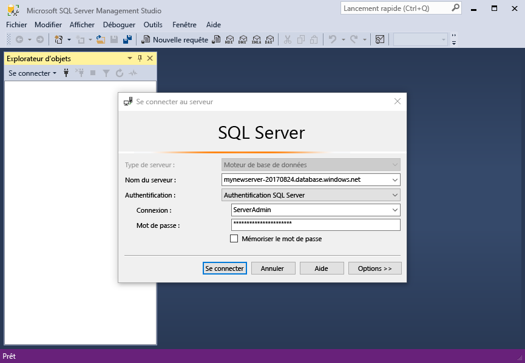
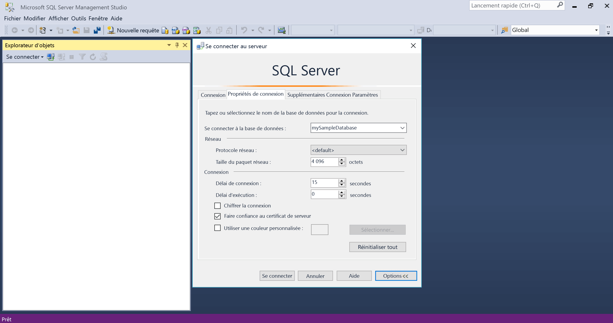
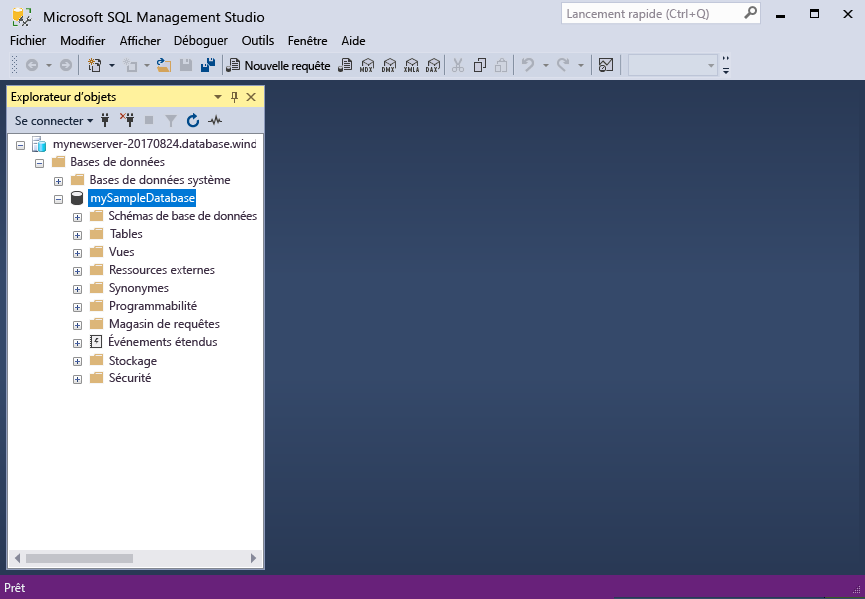
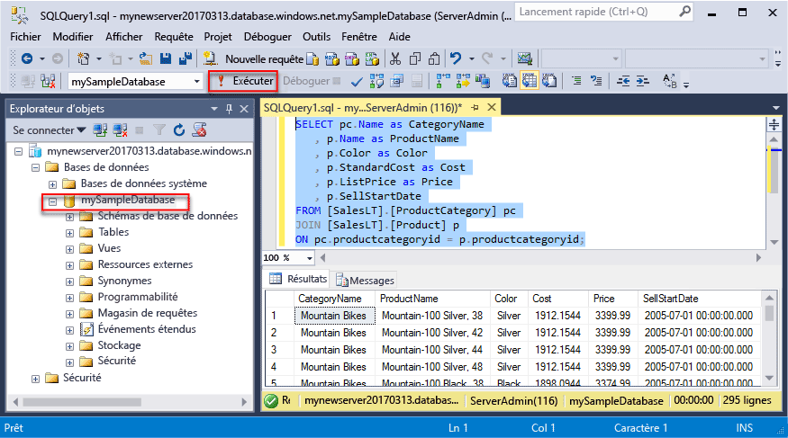
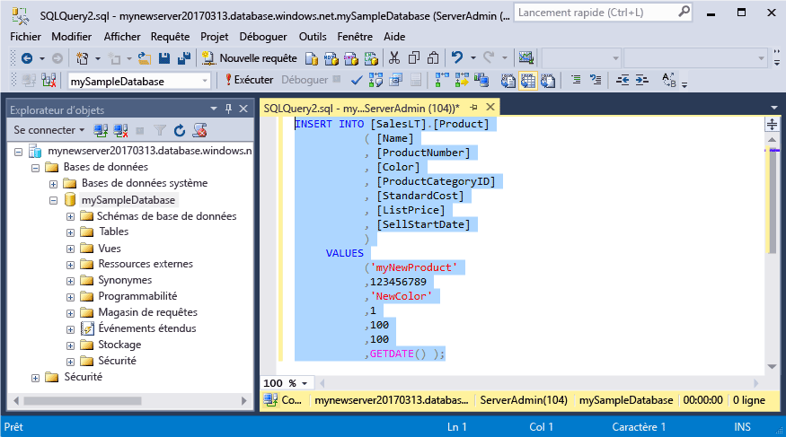
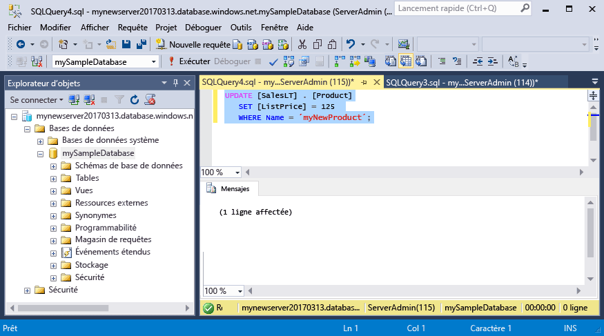
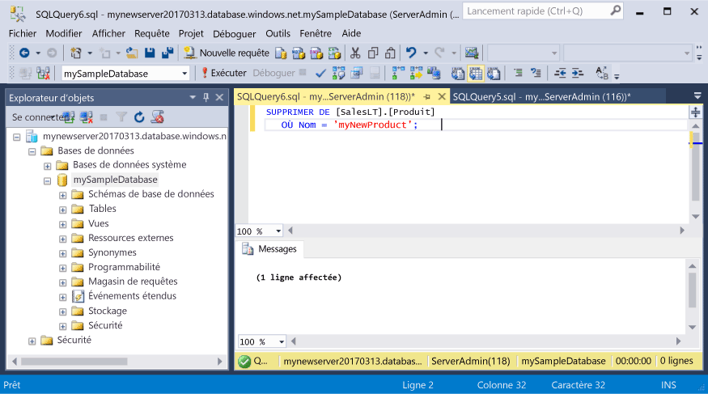

# <a name="azure-sql-database-use-sql-server-management-studio-tooconnect-and-query-data"></a>Base de données SQL Azure : Utilisez SQL Server Management Studio tooconnect et interroger des données

[SQL Server Management Studio](https://msdn.microsoft.com/library/ms174173.aspx) (SSMS) est un environnement intégré pour la gestion d’une infrastructure SQL, à partir de SQL Server tooSQL de base de données pour Microsoft Windows. Ce démarrage rapide montre comment toouse SSMS tooconnect tooan Azure SQL database et puis tooquery d’instructions Transact-SQL d’utilisation, insérer, mettre à jour et supprimer des données dans la base de données hello. 

## <a name="prerequisites"></a>Composants requis

Ce démarrage rapide utilise en tant que ses ressources de hello de point de départ créés dans une de ces Démarrages rapides :

- [Créer une base de données - Portail](sql-database-get-started-portal.md)
- [Créer une base de données - CLI](sql-database-get-started-cli.md)
- [Créer une base de données - PowerShell](sql-database-get-started-powershell.md)

Avant de commencer, assurez-vous que vous avez installé la version la plus récente de hello [SSMS](https://msdn.microsoft.com/library/mt238290.aspx). 

## <a name="sql-server-connection-information"></a>Informations de connexion SQL Server

Obtenir hello connexion informations nécessaires tooconnect toohello Azure SQL database. Vous devez le nom du serveur complet hello, nom de la base de données et les informations de connexion dans les procédures suivantes hello.

1. Connectez-vous à toohello [portail Azure](https://portal.azure.com/).
2. Sélectionnez **bases de données SQL** hello menu de gauche, cliquez sur votre base de données sur hello **bases de données SQL** page. 
3. Sur hello **vue d’ensemble** pour votre base de données, vérifiez le nom du serveur complet hello comme indiqué dans l’image hello ci-dessous. Vous pouvez pointer sur toobring de nom de serveur hello des hello **cliquez sur toocopy** option.

    

4. Si vous avez oublié des informations de connexion hello pour votre serveur de base de données SQL Azure, accédez nom d’administrateur serveur page tooview hello toohello base de données SQL server et, si nécessaire, réinitialiser un mot de passe hello. 

## <a name="connect-tooyour-database"></a>Connexion de base de données tooyour

Utilisez SQL Server Management Studio tooestablish un serveur de base de données SQL Azure de tooyour de connexion. 

> [!IMPORTANT]
> Un serveur logique Azure SQL Database écoute sur le port 1433. Si vous essayez de tooconnect tooan base de données SQL Azure serveur logique au sein d’un pare-feu d’entreprise, ce port doit être ouvert dans le pare-feu d’entreprise hello pour toosuccessfully de vous connecter.
>

1. Ouvrez SQL Server Management Studio.

2. Bonjour **connecter tooServer** boîte de dialogue, entrez hello informations suivantes :

   | Paramètre       | Valeur suggérée | Description | 
   | ------------ | ------------------ | ------------------------------------------------- | 
   | **Type de serveur** | Moteur de base de données | Cette valeur est obligatoire. |
   | **Nom du serveur** | nom du serveur complet Hello | Hello nom doit être semblable à celui-ci : **mynewserver20170313.database.windows.net**. |
   | **Authentification** | l’authentification SQL Server | L’authentification SQL est hello seul type d’authentification que nous avons configuré dans ce didacticiel. |
   | **Connexion** | compte d’administrateur serveur Hello | Il s’agit de compte hello que vous avez spécifié lors de la création du serveur de hello. |
   | **Mot de passe** | mot de passe Hello pour votre compte d’administrateur de serveur | Il s’agit d’un mot de passe hello que vous avez spécifié lors de la création du serveur de hello. |

     

3. Cliquez sur **Options** Bonjour **connecter tooserver** boîte de dialogue. Bonjour **connecter toodatabase** section, entrez **mySampleDatabase** tooconnect toothis base de données.

     

4. Cliquez sur **Connecter**. Ouvre la fenêtre de l’Explorateur d’objets Hello dans SSMS. 

     

5. Dans l’Explorateur d’objets, développez **bases de données** , puis **mySampleDatabase** tooview des objets de hello dans la base de données exemple hello.

## <a name="query-data"></a>Données de requête

Tooquery pour les produits de 20 premiers hello de code suivant de hello d’utilisation par catégorie à l’aide de hello [sélectionnez](https://msdn.microsoft.com/library/ms189499.aspx) instruction Transact-SQL.

1. Dans l’Explorateur d’objets, cliquez avec le bouton droit sur **mySampleDatabase**, puis cliquez sur **Nouvelle requête**. Une fenêtre de requête vide s’ouvre tooyour connecté de base de données.
2. Dans la fenêtre de requête hello, entrez hello suivant la requête :

   ```sql
   SELECT pc.Name as CategoryName, p.name as ProductName
   FROM [SalesLT].[ProductCategory] pc
   JOIN [SalesLT].[Product] p
   ON pc.productcategoryid = p.productcategoryid;
   ```

3. Dans la barre d’outils de hello, cliquez sur **Execute** tooretrieve des données à partir des tables Product et ProductCategory de hello.

    

## <a name="insert-data"></a>Insertion des données

Utilisez hello de code suivant tooinsert un nouveau produit dans table de SalesLT.Product hello à l’aide de hello [insérer](https://msdn.microsoft.com/library/ms174335.aspx) instruction Transact-SQL.

1. Dans la fenêtre de requête hello, remplacez les requêtes précédentes hello hello suivant la requête :

   ```sql
   INSERT INTO [SalesLT].[Product]
           ( [Name]
           , [ProductNumber]
           , [Color]
           , [ProductCategoryID]
           , [StandardCost]
           , [ListPrice]
           , [SellStartDate]
           )
     VALUES
           ('myNewProduct'
           ,123456789
           ,'NewColor'
           ,1
           ,100
           ,100
           ,GETDATE() );
   ```

2. Dans la barre d’outils de hello, cliquez sur **Execute** tooinsert une nouvelle ligne dans la table Product de hello.

    

## <a name="update-data"></a>Mettre à jour des données

Tooupdate hello produit que vous avez ajouté précédemment à l’aide de hello de code suivant de hello utilisation [mise à jour](https://msdn.microsoft.com/library/ms177523.aspx) instruction Transact-SQL.

1. Dans la fenêtre de requête hello, remplacez les requêtes précédentes hello hello suivant la requête :

   ```sql
   UPDATE [SalesLT].[Product]
   SET [ListPrice] = 125
   WHERE Name = 'myNewProduct';
   ```

2. Dans la barre d’outils de hello, cliquez sur **Execute** ligne spécifiée de tooupdate hello dans la table Product de hello.

    

## <a name="delete-data"></a>Suppression de données

Toodelete hello produit que vous avez ajouté précédemment à l’aide de hello de code suivant de hello utilisation [supprimer](https://msdn.microsoft.com/library/ms189835.aspx) instruction Transact-SQL.

1. Dans la fenêtre de requête hello, remplacez les requêtes précédentes hello hello suivant la requête :

   ```sql
   DELETE FROM [SalesLT].[Product]
   WHERE Name = 'myNewProduct';
   ```

2. Dans la barre d’outils de hello, cliquez sur **Execute** ligne spécifiée de toodelete hello dans la table Product de hello.

    

## <a name="next-steps"></a>Étapes suivantes

- toolearn sur la création et la gestion des serveurs et bases de données avec Transact-SQL, consultez [en savoir plus sur les serveurs de base de données SQL Azure et les bases de données](sql-database-servers-databases.md).
- Pour plus d’informations sur SSMS, consultez [Utiliser SQL Server Management Studio](https://msdn.microsoft.com/library/ms174173.aspx).
- tooconnect et la requête à l’aide de Visual Studio Code, consultez [se connecter et requête avec le Code de Visual Studio](sql-database-connect-query-vscode.md).
- tooconnect et la requête à l’aide de .NET, consultez [se connecter et requête avec .NET](sql-database-connect-query-dotnet.md).
- tooconnect et la requête à l’aide de PHP, consultez [se connecter et requête avec PHP](sql-database-connect-query-php.md).
- tooconnect et la requête à l’aide de Node.js, consultez [se connecter et requête avec Node.js](sql-database-connect-query-nodejs.md).
- tooconnect et la requête à l’aide de Java, consultez [se connecter et requête avec Java](sql-database-connect-query-java.md).
- tooconnect et la requête à l’aide de Python, consultez [se connecter et requête avec Python](sql-database-connect-query-python.md).
- tooconnect et la requête à l’aide de Ruby, consultez [se connecter et requête Ruby](sql-database-connect-query-ruby.md).
