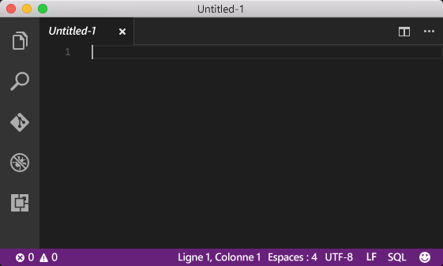
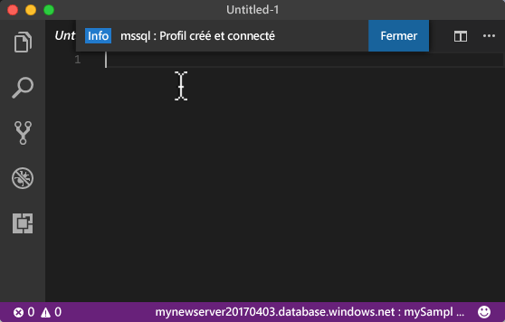
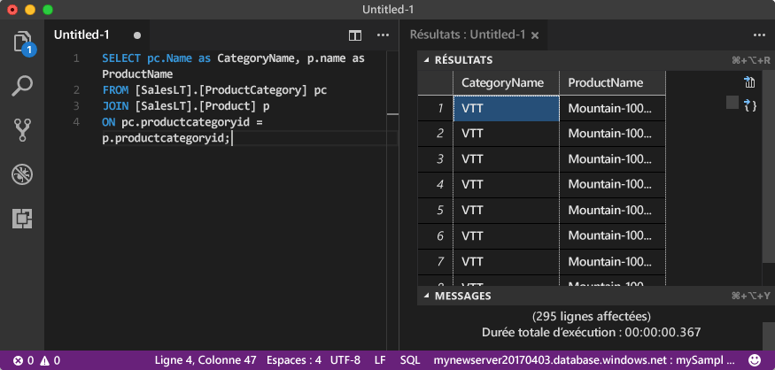

# <a name="azure-sql-database-use-visual-studio-code-tooconnect-and-query-data"></a><span data-ttu-id="7d5db-105">Base de données SQL Azure : Utilisation de Visual Studio Code tooconnect et interroger des données</span><span class="sxs-lookup"><span data-stu-id="7d5db-105">Azure SQL Database: Use Visual Studio Code tooconnect and query data</span></span>

<span data-ttu-id="7d5db-106">[Code Visual Studio](https://code.visualstudio.com/docs) est un éditeur de code graphique pour macOS, Linux et Windows qui prend en charge les extensions, y compris hello [mssql extension](https://aka.ms/mssql-marketplace) pour l’interrogation de Microsoft SQL Server, base de données SQL Azure et SQL Data Warehouse.</span><span class="sxs-lookup"><span data-stu-id="7d5db-106">[Visual Studio Code](https://code.visualstudio.com/docs) is a graphical code editor for Linux, macOS, and Windows that supports extensions, including hello [mssql extension](https://aka.ms/mssql-marketplace) for querying Microsoft SQL Server, Azure SQL Database, and SQL Data Warehouse.</span></span> <span data-ttu-id="7d5db-107">Ce démarrage rapide montre comment toouse Visual Studio Code tooconnect tooan Azure SQL database et puis tooquery d’instructions Transact-SQL d’utilisation, insérer, mettre à jour et supprimer des données dans la base de données hello.</span><span class="sxs-lookup"><span data-stu-id="7d5db-107">This quick start demonstrates how toouse Visual Studio Code tooconnect tooan Azure SQL database, and then use Transact-SQL statements tooquery, insert, update, and delete data in hello database.</span></span>

## <a name="prerequisites"></a><span data-ttu-id="7d5db-108">Composants requis</span><span class="sxs-lookup"><span data-stu-id="7d5db-108">Prerequisites</span></span>

<span data-ttu-id="7d5db-109">Ce démarrage rapide utilise en tant que ses ressources de hello de point de départ créés dans une de ces Démarrages rapides :</span><span class="sxs-lookup"><span data-stu-id="7d5db-109">This quick start uses as its starting point hello resources created in one of these quick starts:</span></span>

- [<span data-ttu-id="7d5db-110">Créer une base de données - Portail</span><span class="sxs-lookup"><span data-stu-id="7d5db-110">Create DB - Portal</span></span>](sql-database-get-started-portal.md)
- [<span data-ttu-id="7d5db-111">Créer une base de données - CLI</span><span class="sxs-lookup"><span data-stu-id="7d5db-111">Create DB - CLI</span></span>](sql-database-get-started-cli.md)
- [<span data-ttu-id="7d5db-112">Créer une base de données - PowerShell</span><span class="sxs-lookup"><span data-stu-id="7d5db-112">Create DB - PowerShell</span></span>](sql-database-get-started-powershell.md)

<span data-ttu-id="7d5db-113">Avant de commencer, assurez-vous que vous avez installé la version la plus récente de hello [Visual Studio Code](https://code.visualstudio.com/Download) et hello chargés [mssql extension](https://aka.ms/mssql-marketplace).</span><span class="sxs-lookup"><span data-stu-id="7d5db-113">Before you start, make sure you have installed hello newest version of [Visual Studio Code](https://code.visualstudio.com/Download) and loaded hello [mssql extension](https://aka.ms/mssql-marketplace).</span></span> <span data-ttu-id="7d5db-114">Pour obtenir des instructions d’installation pour l’extension de mssql hello, consultez [installer VS Code](https://docs.microsoft.com/sql/linux/sql-server-linux-develop-use-vscode#install-vs-code) et [mssql pour le Code de Visual Studio](https://marketplace.visualstudio.com/items?itemName=ms-mssql.mssql).</span><span class="sxs-lookup"><span data-stu-id="7d5db-114">For installation guidance for hello mssql extension, see [Install VS Code](https://docs.microsoft.com/sql/linux/sql-server-linux-develop-use-vscode#install-vs-code) and see [mssql for Visual Studio Code](https://marketplace.visualstudio.com/items?itemName=ms-mssql.mssql).</span></span> 

## <a name="configure-vs-code"></a><span data-ttu-id="7d5db-115">Configurer Visual Studio Code</span><span class="sxs-lookup"><span data-stu-id="7d5db-115">Configure VS Code</span></span> 

### <a name="mac-os"></a><span data-ttu-id="7d5db-116">**Mac OS**</span><span class="sxs-lookup"><span data-stu-id="7d5db-116">**Mac OS**</span></span>
<span data-ttu-id="7d5db-117">Pour macOS, vous devez tooinstall OpenSSL qui est un prérequis pour DotNet Core que l’extension mssql utilise.</span><span class="sxs-lookup"><span data-stu-id="7d5db-117">For macOS, you need tooinstall OpenSSL which is a prerequiste for DotNet Core that mssql extention uses.</span></span> <span data-ttu-id="7d5db-118">Ouvrez votre terminal et entrez hello suivant de commandes tooinstall **brew** et **OpenSSL**.</span><span class="sxs-lookup"><span data-stu-id="7d5db-118">Open your terminal and enter hello following commands tooinstall **brew** and **OpenSSL**.</span></span> 

```bash
ruby -e "$(curl -fsSL https://raw.githubusercontent.com/Homebrew/install/master/install)"
brew update
brew install openssl
mkdir -p /usr/local/lib
ln -s /usr/local/opt/openssl/lib/libcrypto.1.0.0.dylib /usr/local/lib/
ln -s /usr/local/opt/openssl/lib/libssl.1.0.0.dylib /usr/local/lib/
```

### <a name="linux-ubuntu"></a><span data-ttu-id="7d5db-119">**Linux (Ubuntu)**</span><span class="sxs-lookup"><span data-stu-id="7d5db-119">**Linux (Ubuntu)**</span></span>

<span data-ttu-id="7d5db-120">Aucune configuration spéciale nécessaire.</span><span class="sxs-lookup"><span data-stu-id="7d5db-120">No special configuration needed.</span></span>

### <a name="windows"></a><span data-ttu-id="7d5db-121">**Windows**</span><span class="sxs-lookup"><span data-stu-id="7d5db-121">**Windows**</span></span>

<span data-ttu-id="7d5db-122">Aucune configuration spéciale nécessaire.</span><span class="sxs-lookup"><span data-stu-id="7d5db-122">No special configuration needed.</span></span>

## <a name="sql-server-connection-information"></a><span data-ttu-id="7d5db-123">Informations de connexion SQL Server</span><span class="sxs-lookup"><span data-stu-id="7d5db-123">SQL server connection information</span></span>

<span data-ttu-id="7d5db-124">Obtenir hello connexion informations nécessaires tooconnect toohello Azure SQL database.</span><span class="sxs-lookup"><span data-stu-id="7d5db-124">Get hello connection information needed tooconnect toohello Azure SQL database.</span></span> <span data-ttu-id="7d5db-125">Vous devez le nom du serveur complet hello, nom de la base de données et les informations de connexion dans les procédures suivantes hello.</span><span class="sxs-lookup"><span data-stu-id="7d5db-125">You will need hello fully qualified server name, database name, and login information in hello next procedures.</span></span>

1. <span data-ttu-id="7d5db-126">Connectez-vous à toohello [portail Azure](https://portal.azure.com/).</span><span class="sxs-lookup"><span data-stu-id="7d5db-126">Log in toohello [Azure portal](https://portal.azure.com/).</span></span>
2. <span data-ttu-id="7d5db-127">Sélectionnez **bases de données SQL** hello menu de gauche, cliquez sur votre base de données sur hello **bases de données SQL** page.</span><span class="sxs-lookup"><span data-stu-id="7d5db-127">Select **SQL Databases** from hello left-hand menu, and click your database on hello **SQL databases** page.</span></span> 
3. <span data-ttu-id="7d5db-128">Sur hello **vue d’ensemble** page de votre base de données, révision hello serveur nom complet comme dans hello suivant l’image.</span><span class="sxs-lookup"><span data-stu-id="7d5db-128">On hello **Overview** page for your database, review hello fully qualified server name as shown in hello following image.</span></span> <span data-ttu-id="7d5db-129">Vous pouvez pointer sur toobring de nom de serveur hello des hello **cliquez sur toocopy** option.</span><span class="sxs-lookup"><span data-stu-id="7d5db-129">You can hover over hello server name toobring up hello **Click toocopy** option.</span></span>

    

4. <span data-ttu-id="7d5db-131">Si vous avez oublié des informations de connexion hello pour votre serveur de base de données SQL Azure, accédez nom d’administrateur serveur page tooview hello toohello base de données SQL server et, si nécessaire, réinitialiser un mot de passe hello.</span><span class="sxs-lookup"><span data-stu-id="7d5db-131">If you have forgotten hello login information for your Azure SQL Database server, navigate toohello SQL Database server page tooview hello server admin name and, if necessary, reset hello password.</span></span> 

## <a name="set-language-mode-toosql"></a><span data-ttu-id="7d5db-132">Set language mode tooSQL</span><span class="sxs-lookup"><span data-stu-id="7d5db-132">Set language mode tooSQL</span></span>

<span data-ttu-id="7d5db-133">Définir le mode de langage hello est défini trop**SQL** dans T-SQL IntelliSense et les commandes de Visual Studio Code tooenable mssql.</span><span class="sxs-lookup"><span data-stu-id="7d5db-133">Set hello language mode is set too**SQL** in Visual Studio Code tooenable mssql commands and T-SQL IntelliSense.</span></span>

1. <span data-ttu-id="7d5db-134">Ouvrez une nouvelle fenêtre Visual Studio Code.</span><span class="sxs-lookup"><span data-stu-id="7d5db-134">Open a new Visual Studio Code window.</span></span> 

2. <span data-ttu-id="7d5db-135">Cliquez sur **en texte brut** dans hello coin inférieur droit de la barre d’état hello.</span><span class="sxs-lookup"><span data-stu-id="7d5db-135">Click **Plain Text** in hello lower right-hand corner of hello status bar.</span></span>
3. <span data-ttu-id="7d5db-136">Bonjour **mode langage sélectionnez** menu déroulant qui s’ouvre, tapez **SQL**, puis appuyez sur **entrée** tooset hello langage mode tooSQL.</span><span class="sxs-lookup"><span data-stu-id="7d5db-136">In hello **Select language mode** drop-down menu that opens, type **SQL**, and then press **ENTER** tooset hello language mode tooSQL.</span></span> 

   

## <a name="connect-tooyour-database"></a><span data-ttu-id="7d5db-138">Connexion de base de données tooyour</span><span class="sxs-lookup"><span data-stu-id="7d5db-138">Connect tooyour database</span></span>

<span data-ttu-id="7d5db-139">Utilisez Visual Studio Code tooestablish un serveur de base de données SQL Azure de tooyour de connexion.</span><span class="sxs-lookup"><span data-stu-id="7d5db-139">Use Visual Studio Code tooestablish a connection tooyour Azure SQL Database server.</span></span>

> [!IMPORTANT]
> <span data-ttu-id="7d5db-140">Avant de poursuivre, assurez-vous que votre serveur et votre base de données sont prêts, et que vous disposez de vos informations de connexion.</span><span class="sxs-lookup"><span data-stu-id="7d5db-140">Before continuing, make sure that you have your server, database, and login information ready.</span></span> <span data-ttu-id="7d5db-141">Une fois que vous commencez à entrer des informations de profil de connexion hello, si vous modifiez le focus à partir de Code Visual Studio, vous devez toorestart création de profil de connexion hello.</span><span class="sxs-lookup"><span data-stu-id="7d5db-141">Once you begin entering hello connection profile information, if you change your focus from Visual Studio Code, you have toorestart creating hello connection profile.</span></span>
>

1. <span data-ttu-id="7d5db-142">Dans le Code de Visual Studio, appuyez sur **CTRL + MAJ + P** (ou **F1**) tooopen hello Palette de commandes.</span><span class="sxs-lookup"><span data-stu-id="7d5db-142">In VS Code, press **CTRL+SHIFT+P** (or **F1**) tooopen hello Command Palette.</span></span>

2. <span data-ttu-id="7d5db-143">Tapez **sqlcon**, puis appuyez sur **ENTRÉE**.</span><span class="sxs-lookup"><span data-stu-id="7d5db-143">Type **sqlcon** and press **ENTER**.</span></span>

3. <span data-ttu-id="7d5db-144">Appuyez sur **entrée** tooselect **créer un profil de connexion**.</span><span class="sxs-lookup"><span data-stu-id="7d5db-144">Press **ENTER** tooselect **Create Connection Profile**.</span></span> <span data-ttu-id="7d5db-145">Cela crée un profil de connexion à votre instance SQL Server.</span><span class="sxs-lookup"><span data-stu-id="7d5db-145">This creates a connection profile for your SQL Server instance.</span></span>

4. <span data-ttu-id="7d5db-146">Suivre les propriétés de connexion hello invites toospecify hello hello nouveau profil de connexion.</span><span class="sxs-lookup"><span data-stu-id="7d5db-146">Follow hello prompts toospecify hello connection properties for hello new connection profile.</span></span> <span data-ttu-id="7d5db-147">Après avoir spécifié de chaque valeur, appuyez sur **entrée** toocontinue.</span><span class="sxs-lookup"><span data-stu-id="7d5db-147">After specifying each value, press **ENTER** toocontinue.</span></span> 

   | <span data-ttu-id="7d5db-148">Paramètre</span><span class="sxs-lookup"><span data-stu-id="7d5db-148">Setting</span></span>       | <span data-ttu-id="7d5db-149">Valeur suggérée</span><span class="sxs-lookup"><span data-stu-id="7d5db-149">Suggested value</span></span> | <span data-ttu-id="7d5db-150">Description</span><span class="sxs-lookup"><span data-stu-id="7d5db-150">Description</span></span> |
   | ------------ | ------------------ | ------------------------------------------------- | 
   | <span data-ttu-id="7d5db-151">**Nom du serveur</span><span class="sxs-lookup"><span data-stu-id="7d5db-151">**Server name</span></span> | <span data-ttu-id="7d5db-152">nom du serveur complet Hello</span><span class="sxs-lookup"><span data-stu-id="7d5db-152">hello fully qualified server name</span></span> | <span data-ttu-id="7d5db-153">Hello nom doit être semblable à celui-ci : **mynewserver20170313.database.windows.net**.</span><span class="sxs-lookup"><span data-stu-id="7d5db-153">hello name should be something like this: **mynewserver20170313.database.windows.net**.</span></span> |
   | <span data-ttu-id="7d5db-154">**Nom de la base de données**</span><span class="sxs-lookup"><span data-stu-id="7d5db-154">**Database name**</span></span> | <span data-ttu-id="7d5db-155">mySampleDatabase</span><span class="sxs-lookup"><span data-stu-id="7d5db-155">mySampleDatabase</span></span> | <span data-ttu-id="7d5db-156">nom de Hello de hello de base de données toowhich tooconnect.</span><span class="sxs-lookup"><span data-stu-id="7d5db-156">hello name of hello database toowhich tooconnect.</span></span> |
   | <span data-ttu-id="7d5db-157">**Authentification**</span><span class="sxs-lookup"><span data-stu-id="7d5db-157">**Authentication**</span></span> | <span data-ttu-id="7d5db-158">Connexion SQL</span><span class="sxs-lookup"><span data-stu-id="7d5db-158">SQL Login</span></span>| <span data-ttu-id="7d5db-159">L’authentification SQL est hello seul type d’authentification que nous avons configuré dans ce didacticiel.</span><span class="sxs-lookup"><span data-stu-id="7d5db-159">SQL Authentication is hello only authentication type that we have configured in this tutorial.</span></span> |
   | <span data-ttu-id="7d5db-160">**Nom d'utilisateur**</span><span class="sxs-lookup"><span data-stu-id="7d5db-160">**User name**</span></span> | <span data-ttu-id="7d5db-161">compte d’administrateur serveur Hello</span><span class="sxs-lookup"><span data-stu-id="7d5db-161">hello server admin account</span></span> | <span data-ttu-id="7d5db-162">Il s’agit de compte hello que vous avez spécifié lors de la création du serveur de hello.</span><span class="sxs-lookup"><span data-stu-id="7d5db-162">This is hello account that you specified when you created hello server.</span></span> |
   | <span data-ttu-id="7d5db-163">**Mot de passe (connexion SQL)**</span><span class="sxs-lookup"><span data-stu-id="7d5db-163">**Password (SQL Login)**</span></span> | <span data-ttu-id="7d5db-164">mot de passe Hello pour votre compte d’administrateur de serveur</span><span class="sxs-lookup"><span data-stu-id="7d5db-164">hello password for your server admin account</span></span> | <span data-ttu-id="7d5db-165">Il s’agit d’un mot de passe hello que vous avez spécifié lors de la création du serveur de hello.</span><span class="sxs-lookup"><span data-stu-id="7d5db-165">This is hello password that you specified when you created hello server.</span></span> |
   | <span data-ttu-id="7d5db-166">**Enregistrer le mot de passe ?**</span><span class="sxs-lookup"><span data-stu-id="7d5db-166">**Save Password?**</span></span> | <span data-ttu-id="7d5db-167">Oui ou Non</span><span class="sxs-lookup"><span data-stu-id="7d5db-167">Yes or No</span></span> | <span data-ttu-id="7d5db-168">Sélectionnez Oui si vous ne souhaitez pas un mot de passe tooenter hello chaque fois.</span><span class="sxs-lookup"><span data-stu-id="7d5db-168">Select Yes if you do not want tooenter hello password each time.</span></span> |
   | <span data-ttu-id="7d5db-169">**Entrez un nom pour ce profil**</span><span class="sxs-lookup"><span data-stu-id="7d5db-169">**Enter a name for this profile**</span></span> | <span data-ttu-id="7d5db-170">Nom de profil de connexion, par exemple **mySampleDatabase**</span><span class="sxs-lookup"><span data-stu-id="7d5db-170">A profile name, such as **mySampleDatabase**</span></span> | <span data-ttu-id="7d5db-171">Un nom de profil enregistré permet d’accélérer votre connexion lors des connexions suivantes.</span><span class="sxs-lookup"><span data-stu-id="7d5db-171">A saved profile name speeds your connection on subsequent logins.</span></span> | 

5. <span data-ttu-id="7d5db-172">Hello de presse **ÉCHAP** tooclose clé hello info message qui vous informe que le profil de hello est créé et connecté.</span><span class="sxs-lookup"><span data-stu-id="7d5db-172">Press hello **ESC** key tooclose hello info message that informs you that hello profile is created and connected.</span></span>

6. <span data-ttu-id="7d5db-173">Vérifiez votre connexion dans la barre d’état hello.</span><span class="sxs-lookup"><span data-stu-id="7d5db-173">Verify your connection in hello status bar.</span></span>

   

## <a name="query-data"></a><span data-ttu-id="7d5db-175">Données de requête</span><span class="sxs-lookup"><span data-stu-id="7d5db-175">Query data</span></span>

<span data-ttu-id="7d5db-176">Tooquery pour les produits de 20 premiers hello de code suivant de hello d’utilisation par catégorie à l’aide de hello [sélectionnez](https://msdn.microsoft.com/library/ms189499.aspx) instruction Transact-SQL.</span><span class="sxs-lookup"><span data-stu-id="7d5db-176">Use hello following code tooquery for hello top 20 products by category using hello [SELECT](https://msdn.microsoft.com/library/ms189499.aspx) Transact-SQL statement.</span></span>

1. <span data-ttu-id="7d5db-177">Bonjour **éditeur** fenêtre, entrez hello suivant la requête dans la fenêtre de requête vide hello :</span><span class="sxs-lookup"><span data-stu-id="7d5db-177">In hello **Editor** window, enter hello following query in hello empty query window:</span></span>

   ```sql
   SELECT pc.Name as CategoryName, p.name as ProductName
   FROM [SalesLT].[ProductCategory] pc
   JOIN [SalesLT].[Product] p
   ON pc.productcategoryid = p.productcategoryid;
   ```

2. <span data-ttu-id="7d5db-178">Appuyez sur **CTRL + MAJ + E** tooretrieve des données à partir des tables Product et ProductCategory de hello.</span><span class="sxs-lookup"><span data-stu-id="7d5db-178">Press **CTRL+SHIFT+E** tooretrieve data from hello Product and ProductCategory tables.</span></span>

    

## <a name="insert-data"></a><span data-ttu-id="7d5db-180">Insertion des données</span><span class="sxs-lookup"><span data-stu-id="7d5db-180">Insert data</span></span>

<span data-ttu-id="7d5db-181">Utilisez hello de code suivant tooinsert un nouveau produit dans table de SalesLT.Product hello à l’aide de hello [insérer](https://msdn.microsoft.com/library/ms174335.aspx) instruction Transact-SQL.</span><span class="sxs-lookup"><span data-stu-id="7d5db-181">Use hello following code tooinsert a new product into hello SalesLT.Product table using hello [INSERT](https://msdn.microsoft.com/library/ms174335.aspx) Transact-SQL statement.</span></span>

1. <span data-ttu-id="7d5db-182">Bonjour **éditeur** fenêtre, supprimer la requête précédente de hello et entrez hello suivant la requête :</span><span class="sxs-lookup"><span data-stu-id="7d5db-182">In hello **Editor** window, delete hello previous query and enter hello following query:</span></span>

   ```sql
   INSERT INTO [SalesLT].[Product]
           ( [Name]
           , [ProductNumber]
           , [Color]
           , [ProductCategoryID]
           , [StandardCost]
           , [ListPrice]
           , [SellStartDate]
           )
     VALUES
           ('myNewProduct'
           ,123456789
           ,'NewColor'
           ,1
           ,100
           ,100
           ,GETDATE() );
   ```

2. <span data-ttu-id="7d5db-183">Appuyez sur **CTRL + MAJ + E** tooinsert une nouvelle ligne dans la table Product de hello.</span><span class="sxs-lookup"><span data-stu-id="7d5db-183">Press **CTRL+SHIFT+E** tooinsert a new row in hello Product table.</span></span>

## <a name="update-data"></a><span data-ttu-id="7d5db-184">Mettre à jour des données</span><span class="sxs-lookup"><span data-stu-id="7d5db-184">Update data</span></span>

<span data-ttu-id="7d5db-185">Tooupdate hello produit que vous avez ajouté précédemment à l’aide de hello de code suivant de hello utilisation [mise à jour](https://msdn.microsoft.com/library/ms177523.aspx) instruction Transact-SQL.</span><span class="sxs-lookup"><span data-stu-id="7d5db-185">Use hello following code tooupdate hello new product that you previously added using hello [UPDATE](https://msdn.microsoft.com/library/ms177523.aspx) Transact-SQL statement.</span></span>

1.  <span data-ttu-id="7d5db-186">Bonjour **éditeur** fenêtre, supprimer la requête précédente de hello et entrez hello suivant la requête :</span><span class="sxs-lookup"><span data-stu-id="7d5db-186">In hello **Editor** window, delete hello previous query and enter hello following query:</span></span>

   ```sql
   UPDATE [SalesLT].[Product]
   SET [ListPrice] = 125
   WHERE Name = 'myNewProduct';
   ```

2. <span data-ttu-id="7d5db-187">Appuyez sur **CTRL + MAJ + E** ligne spécifiée de tooupdate hello dans la table Product de hello.</span><span class="sxs-lookup"><span data-stu-id="7d5db-187">Press **CTRL+SHIFT+E** tooupdate hello specified row in hello Product table.</span></span>

## <a name="delete-data"></a><span data-ttu-id="7d5db-188">Suppression de données</span><span class="sxs-lookup"><span data-stu-id="7d5db-188">Delete data</span></span>

<span data-ttu-id="7d5db-189">Toodelete hello produit que vous avez ajouté précédemment à l’aide de hello de code suivant de hello utilisation [supprimer](https://msdn.microsoft.com/library/ms189835.aspx) instruction Transact-SQL.</span><span class="sxs-lookup"><span data-stu-id="7d5db-189">Use hello following code toodelete hello new product that you previously added using hello [DELETE](https://msdn.microsoft.com/library/ms189835.aspx) Transact-SQL statement.</span></span>

1. <span data-ttu-id="7d5db-190">Bonjour **éditeur** fenêtre, supprimer la requête précédente de hello et entrez hello suivant la requête :</span><span class="sxs-lookup"><span data-stu-id="7d5db-190">In hello **Editor** window, delete hello previous query and enter hello following query:</span></span>

   ```sql
   DELETE FROM [SalesLT].[Product]
   WHERE Name = 'myNewProduct';
   ```

2. <span data-ttu-id="7d5db-191">Appuyez sur **CTRL + MAJ + E** ligne spécifiée de toodelete hello dans la table Product de hello.</span><span class="sxs-lookup"><span data-stu-id="7d5db-191">Press **CTRL+SHIFT+E** toodelete hello specified row in hello Product table.</span></span>

## <a name="next-steps"></a><span data-ttu-id="7d5db-192">Étapes suivantes</span><span class="sxs-lookup"><span data-stu-id="7d5db-192">Next steps</span></span>

- <span data-ttu-id="7d5db-193">tooconnect et la requête à l’aide de SQL Server Management Studio, consultez [se connecter et requête avec SSMS](sql-database-connect-query-ssms.md).</span><span class="sxs-lookup"><span data-stu-id="7d5db-193">tooconnect and query using SQL Server Management Studio, see [Connect and query with SSMS](sql-database-connect-query-ssms.md).</span></span>
- <span data-ttu-id="7d5db-194">Pour lire un article du magazine MSDN sur l’utilisation de Visual Studio Code, consultez le [billet de blog Créer un IDE de base de données avec une extension MSSQL](https://msdn.microsoft.com/magazine/mt809115).</span><span class="sxs-lookup"><span data-stu-id="7d5db-194">For an MSDN magazine article on using Visual Studio Code, see [Create a database IDE with MSSQL extension blog post](https://msdn.microsoft.com/magazine/mt809115).</span></span>
